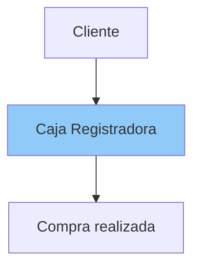
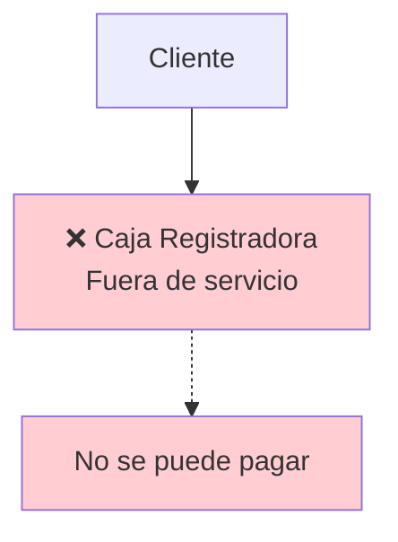
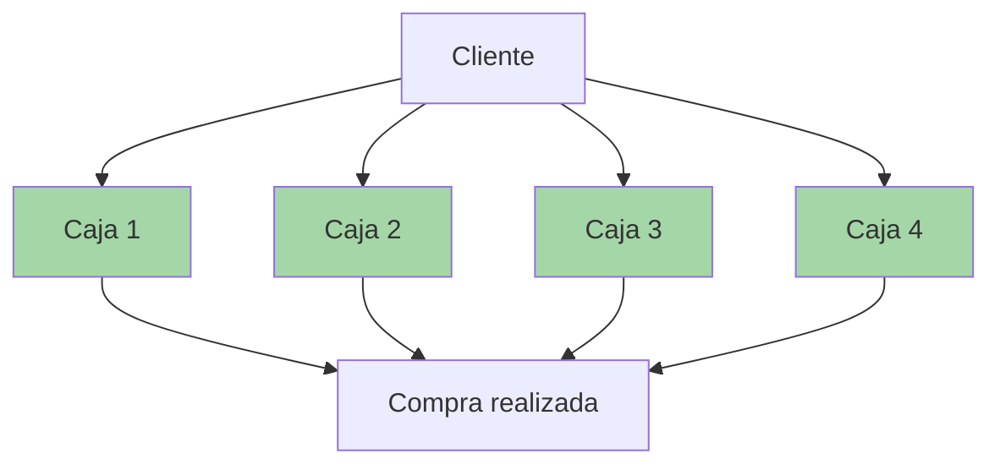
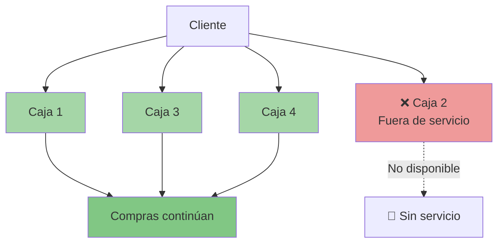
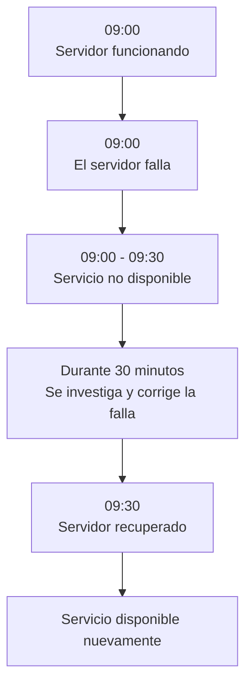
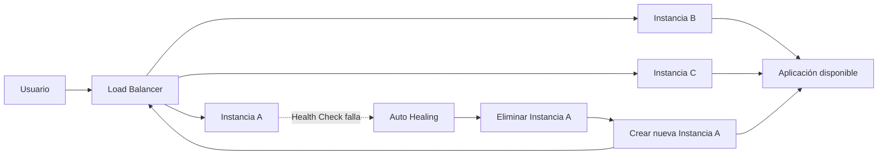

# Alta Disponibilidad

La **alta disponibilidad** en cloud computing es una estrategia de diseño para que una aplicación o servicio siga funcionando aunque falle una parte de la infraestructura. Su objetivo es reducir al máximo el tiempo de caída y mantener el servicio accesible para el usuario casi todo el tiempo.

A diferencia de los sistemas tradicionales locales (on-premise), la alta disponibilidad en la nube aprovecha la elasticidad, la distribución geográfica y la automatización que ofrecen los proveedores de servicios en la nube (como AWS, Microsoft Azure o Google Cloud Platform).

## ¿Qué es la Alta Disponibilidad?

La Alta Disponibilidad (High Availability - HA) es la capacidad de un sistema para seguir funcionando de manera continua incluso cuando alguno de sus componentes falla.

En otras palabras:

>El servicio permanece disponible para los usuarios la mayor parte del tiempo, minimizando las interrupciones.

El objetivo principal es:

- reducir caídas del sistema
- minimizar tiempos de inactividad (Downtime)
- garantizar continuidad del negocio

## Cómo funciona

La idea central es evitar puntos únicos de fallo. Para eso se usan varias técnicas: balanceo de carga, réplicas de servidores, bases de datos replicadas, conmutación por error automática y despliegue en múltiples zonas de disponibilidad o regiones.

:::tip Ejemplo sencillo
Imagina un supermercado. Tiene una sola caja registradora.



**¿Qué ocurre si la caja deja de funcionar?**

Todos los clientes dejan de comprar. El supermercado queda prácticamente detenido.



Ahora imagina que existen cuatro cajas.



**Si una caja falla**:



- las demás continúan atendiendo
- los clientes casi no perciben el problema

Eso es Alta Disponibilidad.
:::

## ¿Por qué es importante?

Hoy prácticamente todo funciona mediante Internet: bancos, Netflix, Amazon, Uber, WhatsApp, hospitales. Si alguno deja de funcionar durante algunos minutos puede perder:

- dinero
- clientes
- reputación
- información
- confianza

Por eso las empresas invierten millones para que sus servicios permanezcan disponibles.

## Elementos clave

### A. Downtime

El Downtime es el tiempo durante el cual un servicio no está disponible.



Las causas pueden ser:

- falla eléctrica
- error humano
- daño de hardware
- actualización fallida

La Alta Disponibilidad busca reducir este tiempo al mínimo.

### B. Redundancia

La redundancia consiste en tener recursos duplicados o adicionales para que otro componente tome el relevo si uno falla.

En lugar de tener:

```txt
Servidor
```
Se tiene:

```txt
Servidor A
Servidor B
Servidor C
```
Si **Servidor `A`** falla. El servicio continúa funcionando.

### C. Balanceador de carga (Load Balancer)

El Load Balancer distribuye las solicitudes entre varios servidores. Si un servidor deja de responder, el balanceador simplemente deja de enviar tráfico hacia él.

### D. Health Checks

¿Cómo sabe el balanceador si un servidor está funcionando?

Realiza Health Checks. Cada pocos segundos pregunta: ¿Estás vivo? Si el servidor responde:

```txt
200 OK
```

Continúa enviándole tráfico. Si responde:

```txt
500 Error
```
o no responde. Lo elimina temporalmente.

### E. Auto Healing

El Auto Healing significa: El sistema detecta un fallo y reemplaza automáticamente el recurso afectado.



###  F. Escalado Automático (Auto Scaling)

Si llegan muchos usuarios:

```txt
Servidor único
↓
1000 usuarios
```

Puede saturarse. Con Auto Scaling:

```txt

1000 usuarios

↓

Se crean más servidores

↓

4 servidores

↓

Carga distribuida
```

Esto también mejora la disponibilidad.

### G. Replicación de datos

No basta con replicar servidores. También deben replicarse los datos.

***Ejemplo:***

Base principal

```txt
BD A
```

Réplica

```txt
BD B
```

Si la primera falla. La segunda continúa atendiendo. Así se evita pérdida de información.

### H. Zonas de Disponibilidad (Availability Zones)

Uno de los pilares del Cloud Computing. Una región posee varias zonas. Cada zona tiene:

- energía independiente
- refrigeración independiente
- redes independientes

Si una zona presenta un problema. Las demás continúan funcionando.

## ¿Cómo se mide la Alta Disponibilidad?

La alta disponibilidad se cuantifica comúnmente mediante **"nueves"** (nines), que representan el porcentaje de tiempo de actividad (uptime) esperado en un año:

>La disponibilidad indica qué porcentaje del tiempo un sistema permanece funcionando correctamente.

Se expresa normalmente como un porcentaje. Por ejemplo:

```txt
Disponibilidad = Tiempo funcionando
                 ----------------------
                 Tiempo total
```

Un servicio estuvo disponible: **`364`** días de un año.

```
Disponibilidad = 364 / 365 = 99.72%
```

Mientras más cercano esté al **`100%`**, mejor.

En Cloud Computing se habla constantemente de los "**Nueves**" (Availability Nines).

| Disponibilidad (%) | Tiempo de inactividad permitido (al año) |
| -------------- | -------------------: |
| 99%            |            3 días y 15 horas |
| 99.9%          |           8 horas y 45 minutos |
| 99.99%         |        52 minutos|
| 99.999%        |         5 minutos y 26 segundos |

La mayoría de las arquitecturas críticas en la nube apuntan al menos a **`99.99%`** o más.

## ¿Cómo se logra la Alta Disponibilidad?

No existe una única tecnología. Se consigue mediante varias estrategias combinadas.

- **Arquitectura distribuida**: si falla un nodo, otro ocupa su lugar de forma transparente para el usuario.

- **No dependemos de un servidor físico**: en línea con el punto anterior, el servidor no podrá “caerse”, ya que no existe como tal.

- **Capacidad de ampliar recursos**: sin tener que desconectar el sistema.

## Pilares fundamentales de la Alta Disponibilidad en la Nube
Para lograr que una aplicación en la nube sea altamente disponible, se deben implementar cuatro principios arquitectónicos esenciales:

1. **Eliminación de puntos únicos de fallo (Single Points of Failure - SPOF)**

Si un componente crítico (un servidor, una base de datos o un cable de red) falla y hace caer todo el sistema, existe un SPOF. Para evitarlo, todos los componentes esenciales deben estar duplicados (redundancia).

2. **Redundancia e Infraestructura Multi-AZ**

Los proveedores de nube dividen sus regiones geográficas en Zonas de Disponibilidad (Availability Zones o AZs). Una AZ es uno o más centros de datos discretos con energía, refrigeración y redes independientes.

>**Estrategia**: Desplegar instancias de tus aplicaciones en múltiples AZs simultáneamente. Si una zona sufre un apagón o un desastre natural, el tráfico se enruta automáticamente hacia las zonas restantes que siguen operativas.

**3. Tolerancia a fallos y conmutación por error (Failover)**

Cuando un componente activo falla, el sistema debe ser capaz de detectar la falla y cambiar de forma automática a un recurso secundario de respaldo sin intervención humana perceptible para el usuario final. Esto se divide en:

- **Activo Pasivo**: El servidor secundario está encendido pero inactivo, esperando a que el primario falle.

- **Activo Activo**: Múltiples servidores procesan solicitudes de manera simultánea, distribuyendo la carga.

**4. Balanceo de carga (Load Balancing)**

Los balanceadores de carga actúan como "puertas de entrada" inteligentes que distribuyen el tráfico de red entrante entre múltiples servidores, contenedores o bases de datos. Si un servidor deja de responder, el balanceador deja de enviarle tráfico de inmediato.

## Buenas prácticas

- Desplegar recursos en múltiples Zonas de Disponibilidad.
- Evitar puntos únicos de fallo (Single Point of Failure).
- Utilizar balanceadores de carga.
- Configurar Health Checks.
- Automatizar el reemplazo de instancias.
- Replicar bases de datos y realizar copias de seguridad.
- Supervisar continuamente con herramientas de monitoreo y alertas.
- Probar periódicamente los procedimientos de recuperación.

:::info
La **Alta Disponibilidad** busca que una aplicación permanezca operativa el mayor tiempo posible, incluso cuando algunos componentes fallan. Para lograrlo se combinan mecanismos como la redundancia, los balanceadores de carga, las comprobaciones de estado, el escalado automático, la replicación de datos y la distribución de recursos entre múltiples Zonas de Disponibilidad. Cuanto mejor se diseñe la arquitectura, menor será el tiempo de inactividad y mayor la continuidad del negocio.
:::
