# API Gateway


En los sistemas de software modernos, especialmente aquellos basados en arquitecturas de **microservicios**, una aplicación ya no está compuesta por un único bloque monolítico, sino por decenas o incluso cientos de servicios independientes que trabajan en conjunto: un servicio de usuarios, uno de pagos, otro de notificaciones, otro de catálogo, etc.

Este enfoque distribuido trae grandes beneficios en escalabilidad y flexibilidad, pero también introduce un problema fundamental:

>¿Cómo hace un cliente (una app móvil, un sitio web, un sistema externo) para comunicarse con todos estos servicios de forma **simple, segura y ordenada**?

Aquí es donde entra el **API Gateway**: un componente que actúa como **punto de entrada único** al sistema. En lugar de que cada cliente tenga que conocer, autenticarse y comunicarse directamente con cada microservicio por separado, todas las solicitudes pasan primero por el Gateway, que se encarga de recibirlas, validarlas, enrutarlas al servicio correcto y devolver la respuesta.

Además de simplificar la comunicación, el **API Gateway** centraliza funciones críticas como la seguridad, el control de tráfico, el monitoreo y la transformación de datos, convirtiéndose en una pieza fundamental para construir sistemas distribuidos robustos, seguros y fáciles de mantener.

:::tip Analogía: la recepción de un edificio
Imagina un edificio corporativo con múltiples departamentos (Ventas, Soporte, Recursos Humanos). Sin recepción, cada visitante deambularía por los pasillos buscando la oficina correcta, presentándose de nuevo en cada una.

Con una **recepción central**, un único punto resuelve todo:

- Verifica la identidad del visitante (**autenticación**).
- Determina a qué departamento debe ir (**enrutamiento**).
- Controla cuántas personas pueden pasar por hora (**rate limiting**).
- Registra quién entra y sale (**logging y auditoría**).

El **API Gateway** cumple exactamente este rol para las peticiones digitales.
:::

:::info Idea clave
En una arquitectura distribuida, los clientes no deben hablar directamente con cada servicio interno. El **API Gateway** es la puerta de entrada única que unifica, protege y controla todo el tráfico hacia el backend. Por ejemplo (**`https://api.empresa.com`**)
:::

## 1. ¿Qué es un API Gateway?

### 1.1 Definición

Un **API Gateway** es un componente de infraestructura que actúa como **punto de entrada único** (*Single Entry Point*) para todas las solicitudes de clientes hacia un conjunto de servicios backend.

- Opera en la **capa de aplicación (Capa 7 del modelo OSI)**: entiende HTTP, rutas, encabezados, tokens y cuerpos JSON.
- Se coloca **entre los clientes y los servicios backend**.
- Es especialmente relevante en arquitecturas de **microservicios**, donde múltiples servicios independientes necesitan ser expuestos de forma unificada, segura y controlada.

En lugar de que los clientes (aplicaciones web, móviles, IoT, sistemas externos) se comuniquen directamente con cada microservicio individual, todas las peticiones pasan primero por el Gateway, que se encarga de procesarlas, enrutarlas y aplicar políticas transversales antes de llegar a su destino final.

:::info ¿Un API Gateway añade latencia?
Sí, un pequeño coste por el salto adicional. Se compensa con caché, agregación de respuestas y conexiones persistentes, y suele ser despreciable frente a los beneficios.
:::

### 1.2 Qué NO es un API Gateway

- No es un **balanceador de carga**: aunque puede distribuir tráfico, su propósito principal es más rico (gestionar APIs, no solo repartir peticiones).
- No es **el backend**: no contiene lógica de negocio; la delega en los microservicios.
- No es un **framework de la aplicación**: es infraestructura, normalmente desplegada y operada aparte.

| Característica | Descripción |
|---|---|
| **Punto de entrada único** | Todos los clientes usan la misma URL base (`https://api.empresa.com`). |
| **Desacoplamiento** | El cliente nunca conoce la ubicación real de cada servicio. |
| **Capa 7** | Entiende HTTP, JSON, encabezados, cookies y tokens. |
| **Cruce de caminos** | Todo el tráfico norte-sur pasa por él (clientes → backend). |

:::info Idea clave
Un API Gateway es la **puerta de enlace de las APIs**: un único componente que recibe todas las peticiones HTTP, las valida, las enruta al servicio correcto y aplica políticas transversales de seguridad, tráfico y observabilidad.
:::

---

## 2. ¿Por qué surgió la necesidad de un API Gateway?

### 2.1 La evolución: del monolito a los microservicios

En los primeros sistemas, todo vivía en un **monolito**: una sola aplicación con todo el código, un único despliegue y una única URL. El cliente hablaba con un solo backend. No hacía falta un Gateway porque no había "varios destinos" que unificar.

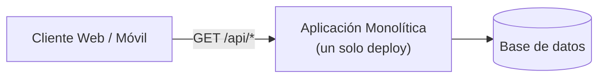

Con el tiempo, las empresas adoptaron **microservicios**: cada funcionalidad (usuarios, pedidos, pagos) se convirtió en un servicio independiente con su propia URL, su propio despliegue y, a menudo, su propia tecnología.

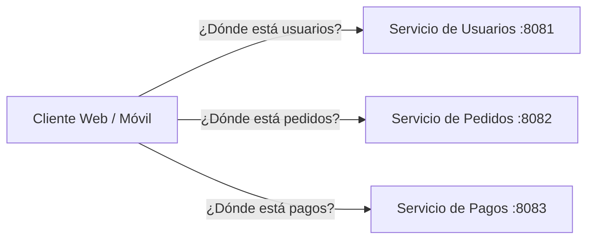

De repente, el cliente tenía que saber **dónde** estaba cada servicio, **autenticarse** contra cada uno, **respetar** el formato de cada uno y **reconfigurarse** cada vez que un servicio cambiaba.

### 2.2 El problema de exponer servicios "al desnudo"

Exponer cada microservicio directamente a los clientes genera una serie de problemas graves (desarrollados en la siguiente sección): complejidad para el cliente, lógica de seguridad duplicada, falta de control del tráfico, y acoplamiento total entre el frontend y la topología interna.

### 2.3 La solución: un único punto de entrada

El **API Gateway** nació como el componente que **absorbe toda esa complejidad**:

- El cliente conoce **una sola URL**.
- La seguridad se aplica **una sola vez**.
- El tráfico se controla **desde un solo lugar**.
- Los servicios internos pueden **cambiar, moverse o escalar** sin que el cliente lo note.

:::info Idea clave
El API Gateway surge de la necesidad de **unificar la entrada a muchos servicios** y de trasladar la complejidad (seguridad, enrutamiento, control de tráfico) fuera de los clientes y fuera de cada microservicio.
:::

---

## 3. Problemas de una arquitectura sin API Gateway

Cuando los clientes se comunican directamente con los microservicios, aparecen estos problemas:

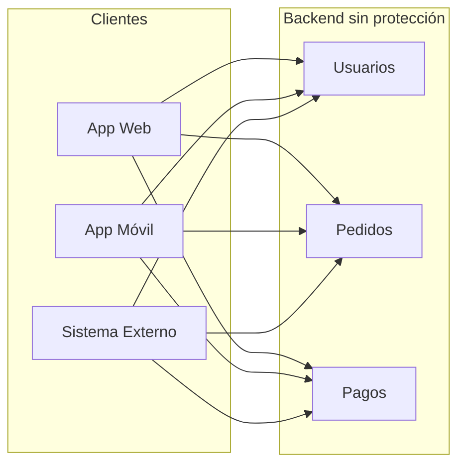

| Problema | Explicación |
|---|---|
| **Complejidad para el cliente** | Debe conocer la URL, el puerto y el formato de cada servicio. |
| **Seguridad duplicada** | La autenticación/autorización debe implementarse en cada microservicio. |
| **Sin control de tráfico** | Un cliente abusivo puede saturar un servicio (DoS, picos). |
| **Acoplamiento total** | Si un servicio cambia de URL o de tecnología, hay que actualizar todos los clientes. |
| **Sin visibilidad global** | Los logs y métricas están dispersos en cada servicio, sin una vista unificada. |
| **Fuga de topología interna** | Los clientes conocen puertos, hosts y estructura interna del sistema (riesgo de seguridad). |
| **Formato inconsistente** | Cada servicio puede responder en su propio formato, obligando al cliente a adaptarse a todos. |

> **Importante**: exponer los microservicios directamente equivale a abrir todas las puertas del edificio sin recepción. Funciona, pero es inseguro, desordenado y difícil de mantener.

:::info Idea clave
Sin un API Gateway, cada cliente debe gestionar **por sí mismo** la localización, la autenticación, los formatos y las políticas de cada servicio. Esto multiplica la complejidad, debilita la seguridad y acopla el frontend a la topología interna.
:::

---

## 4. ¿Cómo funciona un API Gateway? Paso a paso

El Gateway actúa como un **intermediario inteligente**. Su funcionamiento puede resumirse así:

1. **Recibe** la petición HTTP del cliente en su URL pública.
2. **Identifica** al cliente y verifica su identidad (autenticación).
3. **Verifica permisos** para el recurso solicitado (autorización).
4. **Valida** la petición: formato, campos requeridos, método HTTP.
5. **Aplica políticas** de tráfico: rate limiting, throttling, tamaño máximo, CORS.
6. **Enruta** la petición al microservicio correspondiente (según la ruta y el método).
7. **Transforma** la petición si es necesario (cambiar encabezados, formato, estructura).
8. **Balancea** la carga entre las instancias disponibles del servicio.
9. **Consulta la caché** antes de reenviar si la política de caché lo permite.
10. **Reenvía** la petición al backend elegido.
11. **Recibe la respuesta** del backend.
12. **Transforma y enriquece** la respuesta (agregación con otros servicios si aplica).
13. **Registra** logs, métricas y trazas (observabilidad).
14. **Devuelve** la respuesta final al cliente.

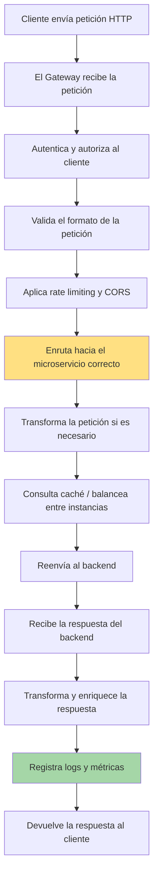

:::info Idea clave
El API Gateway es un **paso intermedio completo**: no solo reenvía peticiones, sino que ejecuta un **pipeline** de verificación (autenticación → autorización → validación → control de tráfico → enrutamiento → transformación → observabilidad) antes y después de tocar el backend.
:::

---

## 5. Arquitectura general

### 5.1 Arquitectura sin API Gateway

Cada cliente se conecta directamente con todos los servicios, duplicando lógica de seguridad y conociendo la topología interna.

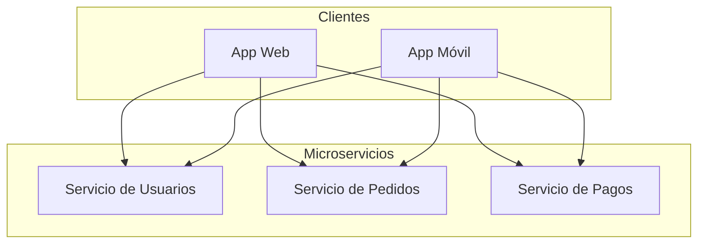

### 5.2 Arquitectura con API Gateway

Todos los clientes apuntan a una **única URL**; el Gateway internamente se comunica con los microservicios.

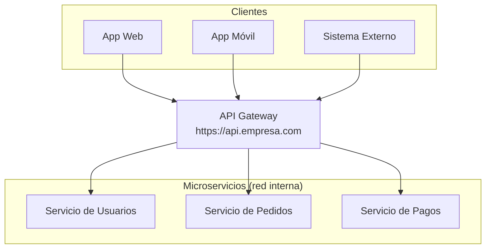

> **Nota**: los clientes solo conocen `https://api.empresa.com`. Las URLs internas de los microservicios (`http://servicio-usuarios:8081`) permanecen ocultas en la red privada.

### 5.3 API Gateway comunicándose con múltiples microservicios

Aquí se ve cómo una sola petición del cliente puede activar varios servicios internos (enrutamiento y agregación):

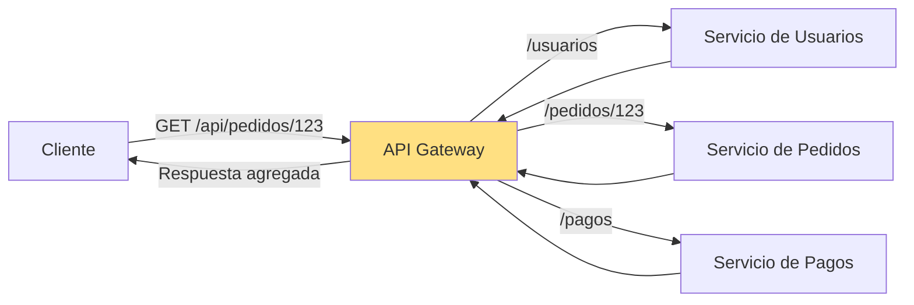

> **Consejo**: la agregación de respuestas (combinar varios servicios en una sola respuesta) reduce drásticamente el número de llamadas que hace el cliente móvil, que suele operar con redes lentas.

:::info Idea clave
Con un API Gateway, la topología interna del sistema queda **oculta** detrás de un único punto de entrada. El Gateway habla con todos los microservicios internamente y le presenta al cliente una sola cara: una API unificada.
:::

---

## 6. Componentes principales

Un API Gateway, por dentro, se compone de varios bloques funcionales:

| Componente | Función |
|---|---|
| **Enrutador (Router)** | Decide a qué servicio enviar cada petición según ruta, método y encabezados. |
| **Motor de políticas** | Aplica reglas de seguridad, tráfico y transformación a cada petición. |
| **Autenticador / Autorizador** | Valida tokens (JWT, OAuth2), API keys y verifica permisos. |
| **Controlador de tráfico** | Implementa rate limiting y throttling. |
| **Gestor de caché** | Almacena respuestas frecuentes en memoria o en un cache distribuido (Redis). |
| **Terminador TLS** | Descifra HTTPS en el borde para que los servicios internos trabajen en texto plano. |
| **Transformador** | Convierte formatos (JSON ↔ XML), reescribe URLs y adapta encabezados. |
| **Agregador** | Combina respuestas de varios servicios en una sola. |
| **Monitoreo y logging** | Emite métricas, logs y trazas distribuidas. |
| **Circuito breaker** | Detecta fallos en los backends y corta el tráfico hacia servicios degradados. |

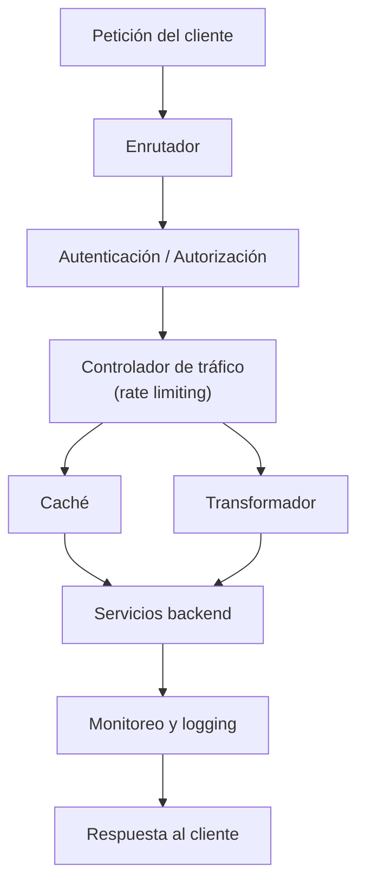

:::info Idea clave
Un API Gateway no es "una caja mágica": es un **conjunto de componentes** (enrutador, autenticador, controlador de tráfico, caché, terminador TLS, transformador, agregador y observabilidad) que trabajan en cadena sobre cada petición.
:::

---

## 7. Funciones principales

### 7.1 Enrutamiento (Routing)

**Qué es**: dirigir cada solicitud hacia el microservicio correspondiente según la URL, el método HTTP y otros criterios.

```txt
GET  /api/usuarios → Servicio de Usuarios
GET  /api/pedidos  → Servicio de Pedidos
POST /api/pagos    → Servicio de Pagos
```

- Aísla al cliente de los detalles internos (puertos, hosts, rutas reales).
- Permite reorganizar los servicios internos sin cambiar la API pública.

### 7.2 Reverse Proxy

**Qué es**: un servidor intermediario que recibe peticiones en nombre de los servidores backend y las reenvía, ocultando la identidad y la topología de estos.

| Aspecto | Reverse Proxy | API Gateway |
|---|---|---|
| Propósito principal | Reenviar tráfico y ocultar el backend | Gestionar APIs completas |
| Entiende la API | Puede no entenderla | Sí, profundamente |
| Autenticación | Básica o ninguna | Completa (JWT, OAuth2, keys) |
| Transformación | Limitada | Avanzada |
| Rate limiting / caché | Puede, de forma básica | Nativo |

> **Nota**: un API Gateway **es** un reverse proxy muy evolucionado. Todo Gateway implementa un reverse proxy, pero no todo reverse proxy es un Gateway.

### 7.3 Balanceo de Carga (Load Balancing)

**Qué es**: distribuir las peticiones entre **múltiples instancias del mismo servicio** para evitar saturación y garantizar alta disponibilidad.

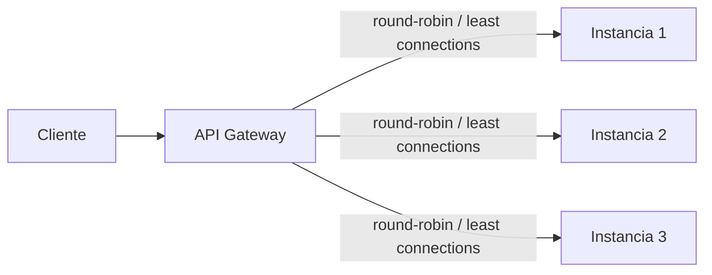

- Se combina con **health checks**: si una instancia deja de responder, el Gateway deja de enviarle tráfico.

### 7.4 Autenticación

**Qué es**: verificar **quién** es el cliente. Métodos comunes:

- **API Keys**: una clave fija por cliente (menos segura).
- **JWT (JSON Web Token)**: token firmado que contiene la identidad y expiración.
- **OAuth2 / OpenID Connect**: flujo estándar para delegar autenticación a un IdP (Identity Provider).

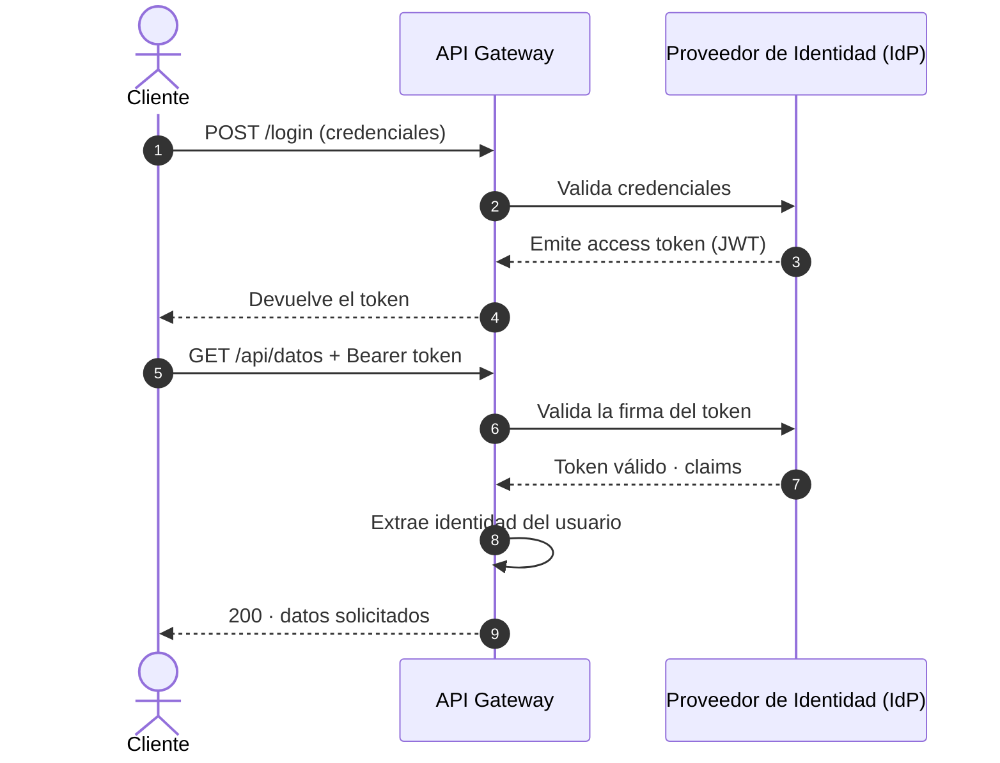

### 7.5 Autorización

**Qué es**: verificar **qué** puede hacer el cliente. Después de autenticarlo, se comprueban sus permisos:

- Roles y permisos (RBAC) definidos en el token o en un servicio de políticas.
- Reglas por recurso, método o ruta (ej. `POST /api/pagos` solo para rol `admin`).

> **Consejo**: autenticar (¿quién eres?) y autorizar (¿qué puedes hacer?) son dos pasos distintos. Muchos errores de seguridad vienen de confundirlos.

### 7.6 Rate Limiting

**Qué es**: limitar **cuántas peticiones** puede hacer un cliente en un periodo de tiempo (ej. 100 peticiones/minuto).

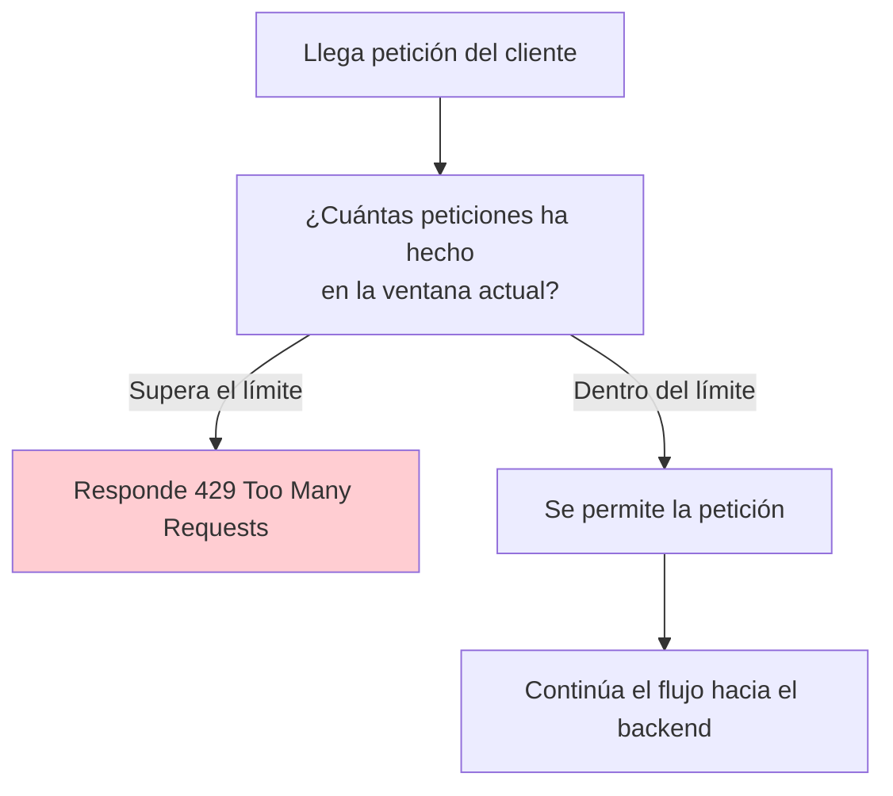

- Protege contra **abuso, DoS y errores de programación** en los clientes.
- Puede aplicarse por cliente, por IP, por API key o por usuario.
- **Respuesta típica**: HTTP `429 Too Many Requests`, a menudo con cabeceras como `X-RateLimit-Remaining`.

### 7.7 Throttling

**Qué es**: **ralentizar** el tráfico cuando el sistema está sobrecargado, en lugar de rechazarlo de golpe.

| Aspecto | Rate Limiting | Throttling |
|---|---|---|
| Objetivo | Evitar que un cliente abuse | Proteger al backend de sobrecarga |
| Comportamiento | Rechaza (429) o cuenta | Espera / retrasa / degrada |
| Base | Por cliente (cuota) | Por estado del sistema |
| Analogía | "Máximo 2 clientes a la vez en la tienda" | "Si la tienda se llena, los nuevos esperan en la fila" |

> **Importante**: ambos se complementan. El rate limiting protege de clientes abusivos; el throttling protege al sistema de picos globales.

### 7.8 Caché

**Qué es**: almacenar temporalmente respuestas frecuentes para **evitar consultar el backend** cada vez.

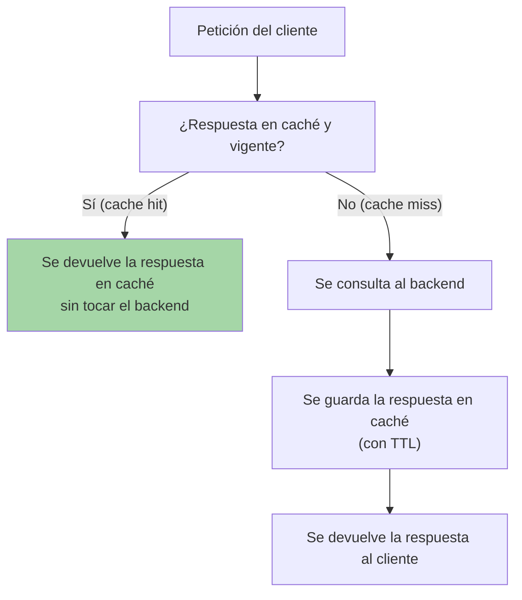

- **TTL (Time To Live)**: tiempo durante el cual la caché es válida.
- Reduce **latencia**, carga del backend y coste de infraestructura.
- Solo es seguro cachear respuestas **idempotentes y no sensibles** (GET de catálogo, configuración...).

### 7.9 Terminación SSL/TLS (SSL Termination)

**Qué es**: descifrar el tráfico HTTPS en el Gateway para que la comunicación interna sea en HTTP.

- Alivia a los microservicios del coste de cifrado/descifrado.
- Centraliza la gestión de **certificados** (renovación, expiración).
- Combinado con **mTLS** (TLS mutuo) permite además autenticar a los servicios entre sí.

```txt
Cliente --HTTPS (cifrado)--> API Gateway --HTTP interno--> Microservicios
```

> **Advertencia**: si la comunicación interna viaja en texto plano por la red, hay que asegurarse de que la red interna sea segura o usar mTLS en tramos sensibles.

### 7.10 Logging

**Qué es**: registrar un **registro de eventos** de cada petición: quién, qué, cuándo y resultado.

```json
{
  "timestamp": "2026-08-06T10:15:30Z",
  "method": "GET",
  "path": "/api/pedidos/123",
  "status": 200,
  "clientIp": "203.0.113.5",
  "userId": "usr_0421",
  "latencyMs": 42,
  "service": "servicio-pedidos"
}
```

- Auditoría y cumplimiento normativo.
- Diagnóstico de errores y respuesta a incidentes.

### 7.11 Monitoring

**Qué es**: medir continuamente el **estado y rendimiento** del sistema con métricas.

| Métrica | Qué indica |
|---|---|
| Tasa de peticiones (RPS) | Volumen de tráfico |
| Latencia (p50, p95, p99) | Tiempo de respuesta |
| Tasa de errores | Fallos (4xx, 5xx) |
| Uso de instancias | Saturación del backend |

### 7.12 Observabilidad

**Qué es**: el paso más allá del monitoring: poder **entender qué pasa internamente** ante un problema. Se apoya en tres pilares:

- **Métricas**: números agregados (latencia, errores, RPS).
- **Logs**: eventos individuales estructurados.
- **Trazas distribuidas**: el recorrido completo de una petición a través de todos los servicios (con `traceId`).

```txt
traceId: abc123
┌─ API Gateway ── 5ms
├─ Servicio Auth ── 2ms
├─ Servicio Pedidos ── 30ms
└─ Servicio Pagos ── 10ms
Total: 47ms
```

> **Consejo**: con observabilidad, cuando un cliente reporta lentitud, puedes seguir la traza e identificar **exactamente** qué servicio es el culpable.

### 7.13 Transformación de Solicitudes y Respuestas

**Qué es**: **adaptar** el mensaje entre lo que envía el cliente y lo que espera el backend, y viceversa.

- Conversión de formatos: XML ↔ JSON.
- Añadir/eliminar encabezados (injectar `X-User-Id`, quitar cookies internas).
- Reescribir rutas: `/api/v1/pedidos` → `/pedidos`.
- Normalizar errores: convertir cualquier error del backend en un formato uniforme.

```txt
Cliente envía:  { "nombre": "Ana" }
Gateway transforma a:
Backend recibe: { "name": "Ana", "source": "mobile-app" }
```

### 7.14 Versionado de APIs

**Qué es**: mantener **múltiples versiones** de una API a la vez para evolucionar sin romper a los clientes existentes.

```txt
https://api.empresa.com/v1/usuarios
https://api.empresa.com/v2/usuarios
```

- `v1` sigue disponible para clientes antiguos; `v2` llega para los nuevos.
- Permite **deprecar** versiones de forma gradual (anunciar, migrar, retirar).

### 7.15 Validación de Solicitudes

**Qué es**: comprobar que la petición es **correcta y segura** antes de enviarla al backend.

- Validación de esquema (campos obligatorios, tipos, rangos).
- Rechazo temprano: un error de validación **no debe llegar al backend**.
- Protección contra **inyección y payloads maliciosos** (tamaño máximo del cuerpo).

```txt
POST /api/usuarios
Cuerpo: { }  → 400 Bad Request (falta el campo "email")
```

### 7.16 Gestión de CORS

**Qué es**: controlar **qué orígenes web** pueden llamar a tu API desde el navegador.

- El navegador bloquea peticiones cross-origin salvo que el servidor lo permita mediante cabeceras.
- El Gateway centraliza la configuración de **CORS (Cross-Origin Resource Sharing)**.

```txt
Access-Control-Allow-Origin: https://miapp.com
Access-Control-Allow-Methods: GET, POST, PUT, DELETE
Access-Control-Allow-Headers: Content-Type, Authorization
```

> **Importante**: CORS protege a los usuarios del navegador (peticiones AJAX/fetch). No es una medida de seguridad para APIs usadas por apps móviles o servidores.

:::info Idea clave
El API Gateway concentra **16 o más responsabilidades transversales**: enrutamiento, proxy, balanceo, autenticación, autorización, rate limiting, throttling, caché, TLS, logging, monitoreo, observabilidad, transformación, versionado, validación y CORS. Al centralizarlas, los microservicios se mantienen simples y enfocados en su lógica de negocio.
:::

---

## 8. Ventajas y desventajas

### 8.1 Ventajas

| Ventaja | Descripción |
|---|---|
| **Simplicidad para el cliente** | Una sola URL, un solo punto de autenticación. |
| **Seguridad centralizada** | Auth, rate limiting y validación en un solo lugar. |
| **Desacoplamiento** | Los servicios internos cambian sin afectar a los clientes. |
| **Control de tráfico** | Protege el backend de abusos y picos (429, throttling). |
| **Reducción de latencia percibida** | Caché y agregación de respuestas. |
| **Observabilidad centralizada** | Métricas, logs y trazas unificadas. |
| **Escalabilidad controlada** | El tráfico hacia el backend se gobierna desde un único punto. |

### 8.2 Desventajas

| Desventaja | Mitigación |
|---|---|
| **Punto único de fallo (SPOF)** | Alta disponibilidad, réplicas del Gateway. |
| **Latencia adicional** | Un salto de red más; se compensa con caché. |
| **Complejidad operativa** | Configuración, mantenimiento y monitoreo extra. |
| **Cuello de botella potencial** | Dimensionar correctamente y escalar horizontalmente. |
| **Riesgo de "God object"** | Evitar meter lógica de negocio en el Gateway. |

> **Importante**: un API Gateway bien dimensionado y con réplicas (mínimo 2-3 instancias detrás de un load balancer) no debe ser la causa de indisponibilidad.

:::info Idea clave
El API Gateway resuelve **complejidad de comunicación**, pero introduce **complejidad operativa**. La clave está en centralizar solo lo transversal y mantenerlo escalable y redundante para no convertirlo en el punto débil del sistema.
:::

---

## 9. Casos de uso reales

| Caso de uso | Cómo ayuda el API Gateway |
|---|---|
| **E-commerce** | Unifica catálogo, carrito, pagos y envíos bajo una sola API para web y móvil. |
| **Apps bancarias / fintech** | Seguridad fuerte, rate limiting y observabilidad para APIs financieras. |
| **Plataformas SaaS multi-tenant** | Autenticación por inquilino, cuotas de uso y facturación por API. |
| **Integración con socios externos** | Expone APIs públicas controladas con API keys y contratos de uso. |
| **Migración de monolito a microservicios** | Oculta la transición: el cliente sigue llamando a la misma API. |
| **Backend para apps móviles** | Agregación de respuestas para minimizar llamadas en redes lentas. |
| **IoT** | Millones de dispositivos con autenticación y rate limiting masivo. |
| **Estrategia de evolución de APIs** | Versionado y deprecación sin romper clientes. |

---

## 10. API Gateway vs Load Balancer

Aunque ambos componentes **"distribuyen"** tráfico, operan en niveles distintos de la arquitectura y cumplen propósitos diferentes.

La diferencia más importante es esta:

>Un **Balanceador de Carga (Load Balancer)** distribuye el tráfico entre múltiples servidores y un **API Gateway** administra y controla las APIs, además de poder enrutar, autenticar, transformar y aplicar políticas.

### 10.1 Balanceador de Carga (Load Balancer)

Es un componente más simple y de bajo nivel (opera principalmente en las capas 4 o 7 del modelo OSI) cuyo único propósito es **distribuir el tráfico entrante entre múltiples instancias de un mismo servicio**, para evitar que una sola instancia se sature.

- No entiende el "significado" de la petición, solo distribuye conexiones/requests.
- Su lógica de decisión es simple: round-robin, least connections, por IP hash, etc.
- No aplica autenticación, transformación de datos ni lógica de negocio.
- Ejemplo: si existen 5 instancias del "Servicio de Pedidos", el balanceador decide a cuál de las 5 enviar cada petición.

### 10.2 API Gateway

Es un componente de **capa de aplicación (L7)**, mucho más inteligente, que actúa como punto de entrada unificado a **múltiples servicios distintos** (no instancias del mismo servicio, sino servicios diferentes).

- Entiende el contenido de la petición (rutas, headers, tokens).
- Aplica autenticación, autorización, rate limiting, transformación, agregación de respuestas, caché, logging, etc.
- Decide **a qué servicio** enviar la petición (no solo a qué instancia).

### 10.3 Tabla comparativa

| Aspecto | Balanceador de Carga | API Gateway |
|---|---|---|
| Nivel OSI típico | L4 (transporte) o L7 básico | L7 (aplicación) |
| Propósito principal | Distribuir carga entre instancias iguales | Enrutar, proteger y gestionar acceso a servicios distintos |
| Autenticación/Autorización | No | Sí |
| Rate limiting | Generalmente no | Sí |
| Transformación de datos | No | Sí |
| Agregación de respuestas | No | Sí |
| Conoce la lógica de negocio | No | Puede aplicarla |
| Ejemplo de uso | Repartir tráfico entre 10 réplicas de un servicio | Enrutar `/usuarios` al Servicio A y `/pedidos` al Servicio B, validando tokens |

:::info En la práctica, se complementan
Un API Gateway **normalmente usa un balanceador de carga internamente** (o delante de él) para distribuir el tráfico hacia las múltiples instancias del servicio al que decidió enrutar la petición. Es decir:

```
Cliente → API Gateway (decide QUÉ servicio) → Load Balancer (decide QUÉ instancia) → Instancias del servicio
```

Por eso no compiten entre sí: el balanceador resuelve "¿a cuál réplica envío esto?", mientras que el Gateway resuelve "¿a qué servicio pertenece esto, y tiene permiso para acceder?".
:::

## 11. API Gateway en arquitecturas de microservicios

- Es el **punto de entrada único** al conjunto de microservicios.
- Los microservicios quedan en la **red interna**, sin exponer puertos al exterior.
- El Gateway implementa **enrutamiento, agregación, seguridad y observabilidad** para que los servicios sean simples.
- Se combina con **Service Mesh** para la comunicación interna y con **BFF** para la experiencia de cada cliente.

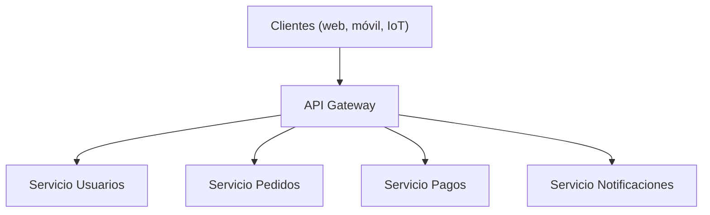

---

## 12. API Gateway en arquitecturas Serverless

En un modelo serverless (AWS Lambda, Azure Functions), el API Gateway es **todavía más importante**, porque no existe un servidor físico que reciba las peticiones:

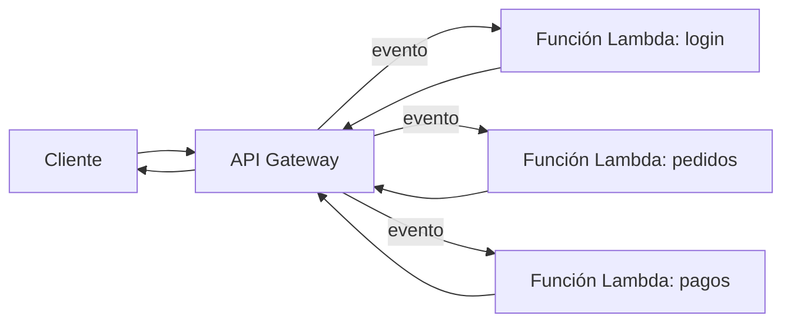

- El Gateway **recibe el HTTP** y lo convierte en un **evento** que dispara la función.
- Se encarga de la **autenticación** (cognito authorizers, API keys) antes de invocar la función.
- Las funciones quedan **sin estado** y el Gateway maneja las sesiones de petición.
- **Ejemplo real**: AWS API Gateway + AWS Lambda + Amazon DynamoDB.

:::info Idea clave
El API Gateway **no es un load balancer, ni un proxy simple**: es una **capa de gestión de APIs en el borde**. Entiende cuándo usar cada concepto: balancea instancias, actúa de proxy, se complementa con el mesh (este-oeste) y puede convivir con BFFs por tipo de cliente.
:::

---

## 13. Buenas prácticas

- **Nunca expongas los microservicios directamente**: todo el tráfico debe pasar por el Gateway.
- **Autentica y autoriza en el borde**: centraliza JWT/OAuth2 y no dupliques la lógica en cada servicio.
- **Aplica rate limiting por cliente**, no solo global: evita que un inquilino degrade a los demás.
- **Configura la caché con criterio**: solo respuestas idempotentes y no sensibles; respeta el TTL.
- **Usa terminación TLS en el Gateway** y centraliza la gestión de certificados.
- **Implementa observabilidad desde el día uno**: métricas, logs estructurados y trazado distribuido (`traceId`).
- **Mantén el Gateway sin lógica de negocio**: si empieza a guardar reglas de negocio, se vuelve un "God object".
- **Dimensiona y escala horizontalmente**: mínimo 2-3 instancias detrás de un load balancer.
- **Versiona tus APIs** (`/v1`, `/v2`) y define un ciclo de deprecación.
- **Documenta el contrato** con OpenAPI/Swagger y valida las peticiones contra el esquema.
- **Usa plantillas/Infrastructure as Code** (Terraform, CloudFormation, Bicep) para definir el Gateway.
- **Centraliza el manejo de errores**: responde con un formato JSON de error uniforme.

---

## 14. Glosario de términos

| Término | Definición |
|---|---|
| **API** | Interfaz de programación que permite a dos sistemas comunicarse. |
| **API Gateway** | Punto de entrada único que enruta, protege y observa las peticiones a los backends. |
| **Autenticación** | Verificar **quién** es el cliente. |
| **Autorización** | Verificar **qué** puede hacer el cliente. |
| **Balanceador de carga** | Componente que reparte tráfico entre instancias del mismo servicio. |
| **BFF (Backend for Frontend)** | API dedicada a las necesidades de un tipo de cliente. |
| **Caché** | Almacenamiento temporal de respuestas para evitar consultar el backend. |
| **CORS** | Cabeceras HTTP que controlan qué orígenes web pueden llamar a la API. |
| **JWT** | Token firmado que transporta la identidad del usuario. |
| **Load Balancer** | Ver *Balanceador de carga*. |
| **Microservicios** | Arquitectura donde cada funcionalidad es un servicio independiente. |
| **mTLS** | TLS mutuo: ambos extremos se autentican con certificados. |
| **Norte-sur** | Tráfico entre clientes externos y el sistema. |
| **Este-oeste** | Tráfico entre servicios internos. |
| **Observabilidad** | Capacidad de entender el estado interno mediante métricas, logs y trazas. |
| **OAuth2 / OIDC** | Estándares para autorización y autenticación delegadas. |
| **Rate limiting** | Límite de peticiones por cliente en un periodo. |
| **Reverse proxy** | Intermediario que reenvía peticiones ocultando el backend. |
| **REST** | Estilo de arquitectura de APIs basado en HTTP y recursos. |
| **Serverless** | Modelo donde el proveedor gestiona los servidores (ej. Lambda). |
| **Service Mesh** | Capa de comunicación interna entre microservicios (sidecar). |
| **SPOF** | Single Point of Failure: punto único que, al fallar, tumba el sistema. |
| **SSL/TLS termination** | Descifrado del tráfico HTTPS en el borde del sistema. |
| **Throttling** | Ralentización del tráfico para proteger el sistema de sobrecarga. |
| **TTL (Time To Live)** | Tiempo de validez de una entrada en caché. |
