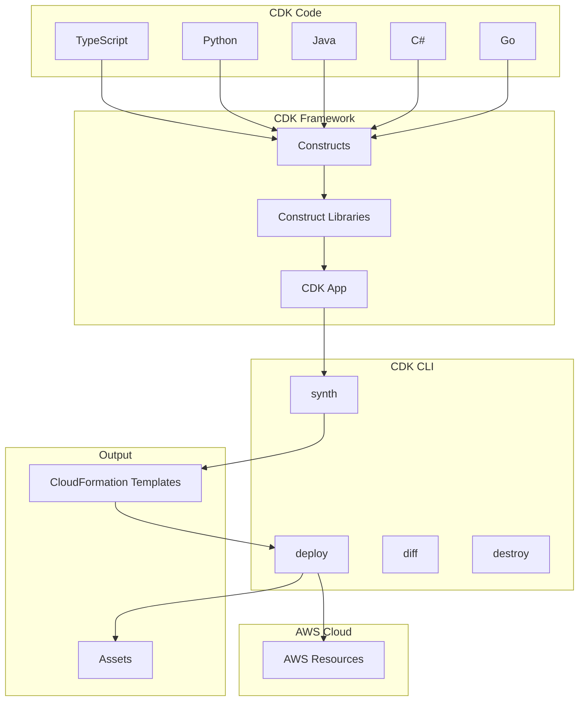
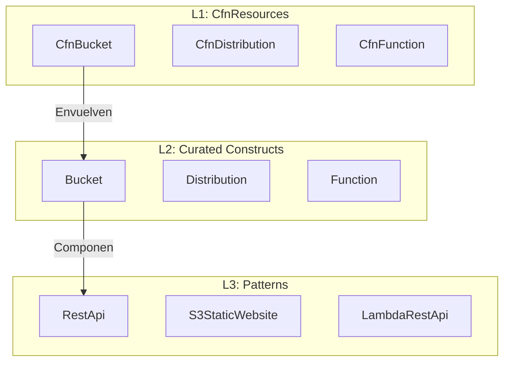

# AWS CDK - Cloud Development Kit

## ¿Qué es AWS CDK?

AWS CDK (Cloud Development Kit) es un framework de desarrollo open source que te permite definir tu infraestructura en la nube usando lenguajes de programación familiares. CDK compila tu código a templates de CloudFormation.

**Analogía:** CDK es como **escribir infraestructura como código de aplicación**. Así como usas frameworks como NestJS o Express para crear APIs con código legible y reutilizable, CDK te permite crear VPCs, bases de datos y servidores escribiendo código en TypeScript, Python u otro lenguaje. En lugar de escribir declaraciones YAML estáticas, escribes clases, funciones y objetos que generan la infraestructura.



---

## CDK vs CloudFormation

| Característica | CloudFormation | AWS CDK |
|---|---|---|
| **Lenguaje** | YAML/JSON declarativo | TypeScript, Python, Java, C#, Go |
| **Programabilidad** | Limitada (intrinsic functions) | Completa (loops, condicionales, funciones) |
| **Reutilización** | Templates, Nested Stacks | Constructs, Libraries, Aspects |
| **Abstracción** | Nivel bajo (recurso por recurso) | Alto (L1, L2, L3 Constructs) |
| **Pruebas** | Difícil | Fácil (unit tests con assertions) |
| **Curva de aprendizaje** | Baja (si conoces YAML/JSON) | Media (requiere lenguaje de programación) |
| **Generación de código** | No | Sí (scaffolding, CLI) |
| **Costo** | Gratis | Gratis |
| **Output final** | Template CloudFormation | Template CloudFormation |

---

## CDK Constructs

Los constructs son los bloques de construcción fundamentales de CDK. Representan componentes de infraestructra de abstracción creciente.

### Niveles de Constructs



| Nivel | Nombre | Descripción | Ejemplo |
|---|---|---|---|
| **L1** | Cfn Resources | Envoltorio directo de recursos CFN | `CfnBucket`, `CfnFunction` |
| **L2** | Curated Constructs | Abstracciones con defaults sensatos | `Bucket`, `Function`, `Table` |
| **L3** | Patterns | Arquitecturas completas pre-armadas | `RestApi`, `S3StaticWebsite` |

### Ejemplo de cada nivel

```typescript
// L1: CfnResource - Envoltorio directo de CloudFormation
import { CfnBucket } from 'aws-cdk-lib/aws-s3';

const bucketL1 = new CfnBucket(this, 'MyL1Bucket', {
  bucketName: 'my-bucket-l1',
  versioningConfiguration: { status: 'Enabled' },
});

// L2: Construct curado - Más intuitivo y con defaults
import { Bucket, BucketEncryption } from 'aws-cdk-lib/aws-s3';

const bucketL2 = new Bucket(this, 'MyL2Bucket', {
  bucketName: 'my-bucket-l2',
  encryption: BucketEncryption.S3_MANAGED,
  versioned: true,
  removalPolicy: RemovalPolicy.DESTROY,
});

// L3: Pattern - Arquitectura completa
import { S3StaticWebsite } from 'aws-cdk-lib/aws-s3-deployment';

const website = new S3StaticWebsite(this, 'MyWebsite', {
  bucket: bucketL2,
});
```

---

## Lenguajes Soportados

CDK soporta 5 lenguajes de programación:

| Lenguaje | Paquete | Estado |
|---|---|---|
| **TypeScript** | `aws-cdk-lib` | Estable (el más popular) |
| **Python** | `aws-cdk-lib` | Estable |
| **Java** | `software.amazon.awscdk` | Estable |
| **C# (.NET)** | `Amazon.CDK.Lib` | Estable |
| **Go** | `github.com/aws/aws-cdk-go` | Experimental |

---

## CDK CLI Commands

### Comandos Principales

```bash
# Inicializar un nuevo proyecto CDK
cdk init app --language typescript
cdk init lib --language python
cdk init app --language java
cdk init app --language csharp
cdk init app --language go

# Sintetizar templates de CloudFormation
cdk synth
cdk synth MiStack
cdk synth --output ./out

# Ver diferencias con el stack desplegado
cdk diff
cdk diff MiStack
cdk diff --context "key=value"

# Desplegar stacks
cdk deploy
cdk deploy MiStack
cdk deploy --all
cdk deploy --require-approval never
cdk deploy --parameters paramKey=paramValue
cdk deploy --exclusively

# Destruir stacks
cdk destroy
cdk destroy MiStack
cdk destroy --all --force
cdk destroy --exclusively

# Comandos útiles
cdk list                    # Listar stacks
cdk doctor                  # Diagnosticar problemas
cdk bootstrap               # Preparar cuenta para CDK
cdk context --reset         # Resetear contexto cacheado
cdk context                 # Ver contexto actual
```

### Bootstrap

```bash
# Bootstrap es necesario la primera vez que usas CDK en una cuenta/región
cdk bootstrap

# Bootstrap con configuración específica
cdk bootstrap aws://123456789012/us-east-1

# Bootstrap con trust policy para otra cuenta (deploy cross-account)
cdk bootstrap aws://987654321098/us-east-1 \
  --trust 123456789012 \
  --cloudformation-execution-policies arn:aws:iam::aws:policy/AdministratorAccess
```

---

## Stacks y Environments

```typescript
import { App, Stack, StackProps } from 'aws-cdk-lib';
import { Vpc } from 'aws-cdk-lib/aws-ec2';
import { DatabaseInstance, DatabaseInstanceEngine } from 'aws-cdk-lib/aws-rds';

export class MiStack extends Stack {
  constructor(scope: App, id: string, props?: StackProps) {
    super(scope, id, props);

    // Recursos del stack
    const vpc = new Vpc(this, 'MiVpc', {
      maxAzs: 2,
    });

    const database = new DatabaseInstance(this, 'MiDatabase', {
      engine: DatabaseInstanceEngine.POSTGRES,
      instanceType: InstanceType.of(InstanceClass.T3, InstanceSize.MICRO),
      vpc,
    });
  }
}

// App - Punto de entrada
const app = new App();

// Stack con environment específico
new MiStack(app, 'ProductionStack', {
  env: {
    account: process.env.CDK_DEFAULT_ACCOUNT,
    region: 'us-east-1',
  },
  tags: {
    Environment: 'production',
    Project: 'MiApp',
  },
});

new MiStack(app, 'StagingStack', {
  env: {
    account: process.env.CDK_DEFAULT_ACCOUNT,
    region: 'us-east-1',
  },
  tags: {
    Environment: 'staging',
    Project: 'MiApp',
  },
});

app.synth();
```

---

## Context y Lookups

CDK permite usar context para almacenar valores que se resuelven una vez y se cachean.

```typescript
import { App, Stack, StackProps, Tags } from 'aws-cdk-lib';
import { Vpc, LookupMachineImage } from 'aws-cdk-lib/aws-ec2';

export class MiStack extends Stack {
  constructor(scope: App, id: string, props?: StackProps) {
    super(scope, id, props);

    // Lookups que se resuelven durante el synth
    const ami = LookupMachineImage.lookup({
      name: 'amzn2-ami-hvm-*-x86_64-gp2',
      owners: ['amazon'],
    });

    // Context values
    const environment = this.node.tryGetContext('environment') || 'development';
    
    const vpc = new Vpc(this, 'Vpc', {
      maxAzs: environment === 'production' ? 3 : 2,
    });
  }
}

// Uso:
// cdk synth --context environment=production
// cdk synth --context environment=development
```

### Archivo cdk.json

```json
{
  "app": "npx ts-node --prefer-ts-exts bin/app.ts",
  "context": {
    "@aws-cdk/aws-lambda:recognizeLayerVersion": true,
    "@aws-cdk/core:checkSecretUsage": true,
    "environment": "production",
    "vpc CIDR": "10.0.0.0/16"
  }
}
```

---

## Assets

Los assets son archivos que CDK maneja automáticamente durante el despliegue (código Lambda, archivos estáticos, etc.).

```typescript
import { Function, Runtime, Code } from 'aws-cdk-lib/aws-lambda';
import { Asset } from 'aws-cdk-lib/aws-s3-assets';
import * as path from 'path';

// Asset de código Lambda
const lambdaFunction = new Function(this, 'MiFuncion', {
  runtime: Runtime.NODEJS_18_X,
  handler: 'index.handler',
  code: Code.fromAsset(path.join(__dirname, '../lambda')), // Assets
});

// Asset genérico
const asset = new Asset(this, 'MiAsset', {
  path: path.join(__dirname, '../assets/config.json'),
});
```

---

## Ejemplos de Código TypeScript

### Ejemplo 1: VPC Completa

```typescript
import { Stack, StackProps, CfnOutput, Tags } from 'aws-cdk-lib';
import { Construct } from 'constructs';
import {
  Vpc,
  SubnetType,
  SecurityGroup,
  Peer,
  Port,
  FlowLog,
  FlowLogDestination,
  FlowLogResourceType,
} from 'aws-cdk-lib/aws-ec2';

export class NetworkStack extends Stack {
  public readonly vpc: Vpc;

  constructor(scope: Construct, id: string, props?: StackProps) {
    super(scope, id, props);

    this.vpc = new Vpc(this, 'ProductionVpc', {
      vpcName: 'production-vpc',
      ipAddresses: IpAddresses.cidr('10.0.0.0/16'),
      maxAzs: 3,
      natGateways: 2,
      subnetConfiguration: [
        {
          cidrMask: 24,
          name: 'Public',
          subnetType: SubnetType.PUBLIC,
        },
        {
          cidrMask: 24,
          name: 'Private',
          subnetType: SubnetType.PRIVATE_WITH_EGRESS,
        },
        {
          cidrMask: 24,
          name: 'Isolated',
          subnetType: SubnetType.PRIVATE_ISOLATED,
        },
      ],
    });

    // VPC Flow Logs
    new FlowLog(this, 'VpcFlowLog', {
      resourceType: FlowLogResourceType.fromVpc(this.vpc),
      destination: FlowLogDestination.toCloudWatchLogs(),
    });

    Tags.of(this.vpc).add('Environment', 'production');
    Tags.of(this.vpc).add('ManagedBy', 'CDK');

    new CfnOutput(this, 'VpcId', { value: this.vpc.vpcId });
  }
}
```

### Ejemplo 2: Lambda + API Gateway

```typescript
import { Stack, StackProps, CfnOutput } from 'aws-cdk-lib';
import { Construct } from 'constructs';
import { Function, Runtime, Code, RetentionDays } from 'aws-cdk-lib/aws-lambda';
import { RestApi, LambdaIntegration, MethodLoggingLevel } from 'aws-cdk-lib/aws-apigateway';
import { Effect, PolicyStatement } from 'aws-cdk-lib/aws-iam';
import { Table, BillingMode, AttributeType } from 'aws-cdk-lib/aws-dynamodb';
import { NodejsFunction } from 'aws-cdk-lib/aws-lambda-nodejs';
import * as path from 'path';

export class ApiStack extends Stack {
  constructor(scope: Construct, id: string, props?: StackProps) {
    super(scope, id, props);

    // DynamoDB Table
    const table = new Table(this, 'MiTabla', {
      tableName: 'mi-tabla',
      partitionKey: { name: 'PK', type: AttributeType.STRING },
      sortKey: { name: 'SK', type: AttributeType.STRING },
      billingMode: BillingMode.PAY_PER_REQUEST,
      removalPolicy: RemovalPolicy.DESTROY,
    });

    // Lambda Function (NodejsFunction compila automáticamente)
    const miFuncion = new NodejsFunction(this, 'MiFuncionLambda', {
      functionName: 'mi-funcion',
      runtime: Runtime.NODEJS_18_X,
      handler: 'handler',
      entry: path.join(__dirname, '../lambda/index.ts'),
      environment: {
        TABLE_NAME: table.tableName,
        NODE_OPTIONS: '--enable-source-maps',
      },
      timeout: Duration.seconds(30),
      memorySize: 256,
      logRetention: RetentionDays.TWO_WEEKS,
    });

    // Permiso para Lambda acceder a DynamoDB
    miFuncion.addToRolePolicy(new PolicyStatement({
      effect: Effect.ALLOW,
      actions: [
        'dynamodb:PutItem',
        'dynamodb:GetItem',
        'dynamodb:Query',
        'dynamodb:UpdateItem',
        'dynamodb:DeleteItem',
      ],
      resources: [table.tableArn],
    }));

    // API Gateway
    const api = new RestApi(this, 'MiApi', {
      restApiName: 'mi-api',
      description: 'API de ejemplo con CDK',
      deployOptions: {
        stageName: 'v1',
        loggingLevel: MethodLoggingLevel.INFO,
        metricsEnabled: true,
        tracingEnabled: true,
      },
      defaultCorsPreflightOptions: {
        allowOrigins: ['*'],
        allowMethods: ['GET', 'POST', 'PUT', 'DELETE'],
      },
    });

    // Integración Lambda
    const lambdaIntegration = new LambdaIntegration(miFuncion);

    // Rutas
    const items = api.root.addResource('items');
    items.addMethod('GET', lambdaIntegration);
    items.addMethod('POST', lambdaIntegration);

    const item = items.addResource('{id}');
    item.addMethod('GET', lambdaIntegration);
    item.addMethod('PUT', lambdaIntegration);
    item.addMethod('DELETE', lambdaIntegration);

    // Outputs
    new CfnOutput(this, 'ApiUrl', { value: api.url });
    new CfnOutput(this, 'TableName', { value: table.tableName });
  }
}
```

### Ejemplo 3: Stack de Producción Completo

```typescript
import { App, Stack, StackProps, CfnOutput, Tags, RemovalPolicy } from 'aws-cdk-lib';
import { Construct } from 'constructs';
import {
  Vpc, SubnetType, SecurityGroup, Peer, Port,
  Instance, InstanceType, InstanceClass, MachineImage,
  UserData, AmazonLinuxGeneration, AmazonLinuxCpuType,
} from 'aws-cdk-lib/aws-ec2';
import {
  DatabaseInstance, DatabaseInstanceEngine, PostgresEngineVersion,
  Credentials, BackupRetention,
} from 'aws-cdk-lib/aws-rds';
import { LoadBalancer, ApplicationProtocol } from 'aws-cdk-lib/aws-elasticloadbalancingv2';
import { Topic } from 'aws-cdk-lib/aws-sns';
import { EmailSubscription } from 'aws-cdk-lib/aws-sns-subscriptions';
import { Alarm, Metric, ComparisonOperator, TreatMissingData } from 'aws-cdk-lib/aws-cloudwatch';
import { SnsAction } from 'aws-cdk-lib/aws-cloudwatch-actions';

export class ProductionStack extends Stack {
  constructor(scope: Construct, id: string, props?: StackProps) {
    super(scope, id, props);

    // ============ VPC ============
    const vpc = new Vpc(this, 'ProductionVpc', {
      maxAzs: 3,
      natGateways: 2,
    });

    // ============ SNS Topic ============
    const alertTopic = new Topic(this, 'AlertTopic', {
      topicName: 'production-alerts',
    });
    alertTopic.addSubscription(new EmailSubscription('ops@miempresa.com'));

    // ============ RDS ============
    const database = new DatabaseInstance(this, 'ProductionDB', {
      engine: DatabaseInstanceEngine.postgres({
        version: PostgresEngineVersion.VER_15_4,
      }),
      instanceType: InstanceType.of(InstanceClass.T3, InstanceSize.MEDIUM),
      credentials: Credentials.fromGeneratedSecret('dbadmin'),
      vpc,
      multiAz: true,
      allocatedStorage: 100,
      storageEncrypted: true,
      backupRetention: BackupRetention.days(7),
      deletionProtection: true,
      databaseName: 'productiondb',
    });

    // ============ EC2 Instances ============
    const webServers: Instance[] = [];
    for (let i = 0; i < 2; i++) {
      const instance = new Instance(this, `WebServer${i + 1}`, {
        instanceType: InstanceType.of(InstanceClass.T3, InstanceSize.LARGE),
        machineImage: MachineImage.latestAmazonLinux2(),
        vpc,
        vpcSubnets: { subnetType: SubnetType.PRIVATE_WITH_EGRESS },
        userData: UserData.forLinux(),
      });
      instance.addUserData(
        'yum update -y',
        'yum install -y httpd',
        'systemctl start httpd',
      );
      webServers.push(instance);
    }

    // ============ Security Group ============
    const albSg = new SecurityGroup(this, 'ALBSecurityGroup', {
      vpc,
      description: 'ALB Security Group',
    });
    albSg.addIngressRule(Peer.anyIpv4(), Port.tcp(80));

    // ============ ALB ============
    const alb = new LoadBalancer(this, 'ALB', {
      vpc,
      internetFacing: true,
      securityGroup: albSg,
    });

    webServers.forEach((instance) => {
      alb.addTarget(instance);
    });

    const listener = alb.addListener('Listener', {
      port: 80,
    });
    listener.addDefaultTargetGroup({
      targets: webServers,
    });

    // ============ CloudWatch Alarms ============
    const cpuAlarm = new Alarm(this, 'HighCPU', {
      metric: new Metric({
        namespace: 'AWS/EC2',
        metricName: 'CPUUtilization',
        dimensionsMap: {
          InstanceId: webServers[0].instanceId,
        },
      }),
      threshold: 80,
      evaluationPeriods: 3,
      comparisonOperator: ComparisonOperator.GREATER_THAN_THRESHOLD,
      treatMissingData: TreatMissingData.NOT_BREACHING,
    });
    cpuAlarm.addAlarmAction(new SnsAction(alertTopic));

    // ============ Tags ============
    Tags.of(this).add('Environment', 'production');
    Tags.of(this).add('Project', 'MiApp');
    Tags.of(this).add('ManagedBy', 'CDK');

    // ============ Outputs ============
    new CfnOutput(this, 'ALBEndpoint', { value: alb.loadBalancerDnsName });
    new CfnOutput(this, 'RDSEndpoint', { value: database.dbInstanceEndpointAddress });
  }
}

// App
const app = new App();
new ProductionStack(app, 'ProductionStack', {
  env: { account: process.env.CDK_DEFAULT_ACCOUNT, region: 'us-east-1' },
});
app.synth();
```

---

## Mejores Prácticas

### 1. Estructura de Proyecto

```
mi-app-cdk/
├── bin/
│   └── app.ts                    # Punto de entrada
├── lib/
│   ├── stacks/
│   │   ├── network-stack.ts      # VPC y networking
│   │   ├── compute-stack.ts      # EC2, Lambda
│   │   ├── database-stack.ts     # RDS, DynamoDB
│   │   └── monitoring-stack.ts   # CloudWatch, SNS
│   └── constructs/
│       ├── mi-lambda.ts          # Construct personalizado
│       └── mi-vpc.ts             # Construct personalizado
├── lambda/
│   └── index.ts                  # Código Lambda
├── test/
│   └── mi-app.test.ts            # Unit tests
├── cdk.json
├── package.json
└── tsconfig.json
```

### 2. Constructs Personalizados

```typescript
import { Construct } from 'constructs';
import { Function, Runtime, Code } from 'aws-cdk-lib/aws-lambda';
import { Table, BillingMode, AttributeType } from 'aws-cdk-lib/aws-dynamodb';
import { Effect, PolicyStatement } from 'aws-cdk-lib/aws-iam';

export interface MiServicioProps {
  tableName: string;
  environment: string;
}

export class MiServicio extends Construct {
  public readonly lambda: Function;
  public readonly table: Table;

  constructor(scope: Construct, id: string, props: MiServicioProps) {
    super(scope, id);

    this.table = new Table(this, 'Table', {
      tableName: props.tableName,
      partitionKey: { name: 'PK', type: AttributeType.STRING },
      billingMode: BillingMode.PAY_PER_REQUEST,
      removalPolicy: props.environment === 'production'
        ? RemovalPolicy.RETAIN
        : RemovalPolicy.DESTROY,
    });

    this.lambda = new Function(this, 'Function', {
      runtime: Runtime.NODEJS_18_X,
      handler: 'handler',
      code: Code.fromAsset('lambda'),
      environment: {
        TABLE_NAME: this.table.tableName,
      },
    });

    this.table.grantReadWriteData(this.lambda);
  }
}
```

### 3. Unit Tests

```typescript
import { App } from 'aws-cdk-lib';
import { Template, Match } from 'aws-cdk-lib/assertions';
import { MiServicio } from '../lib/constructs/mi-servicio';

describe('MiServicio', () => {
  let template: Template;

  beforeEach(() => {
    const app = new App();
    const stack = new Stack(app, 'TestStack');
    new MiServicio(stack, 'MiServicio', {
      tableName: 'test-table',
      environment: 'test',
    });
    template = Template.fromStack(stack);
  });

  test('creates DynamoDB table', () => {
    template.hasResourceProperties('AWS::DynamoDB::Table', {
      TableName: 'test-table',
    });
  });

  test('creates Lambda function', () => {
    template.hasResourceProperties('AWS::Lambda::Function', {
      Handler: 'handler',
      Runtime: 'nodejs18.x',
    });
  });

  test('creates IAM policy for Lambda to access DynamoDB', () => {
    template.hasResourceProperties('AWS::IAM::Policy', {
      PolicyDocument: {
        Statement: Match.arrayWith([
          Match.objectLike({
            Action: Match.arrayWith([
              'dynamodb:GetItem',
              'dynamodb:PutItem',
            ]),
          }),
        ]),
      },
    });
  });
});
```

---

## Errores Comunes

1. **No ejecutar `cdk bootstrap`** antes del primer deploy
2. **Olvidar `RemovalPolicy`** en recursos que se eliminarán
3. **Hardcodear cuentas/regiones** en lugar de usar `env`
4. **No usar constructs personalizados** para código repetitivo
5. **No implementar tests** antes de desplegar
6. **Ignorar warnings del CLI** (como `--require-approval`)
7. **No usar `CfnOutput`** para valores que otros stacks necesitan
8. **OlvidarTags** para gestión de costos

---

## Consejos para Entrevistas

1. **Explica los 3 niveles de constructs** y cuándo usar cada uno
2. **Conoce los comandos CLI** principales (synth, deploy, diff, destroy)
3. **Sabe la diferencia** entre CDK y CloudFormation puro
4. **Entiende los assets** y cómo CDK maneja archivos
5. **Conoce los patrones comunes** (VPC, Lambda, API Gateway)
6. **Explica el concepto de context** y por qué es útil
7. **Sabe cómo testing** funciona en CDK

---

## Preguntas Frecuentes (FAQ)

**¿Puedo usar CDK con CloudFormation existente?**
Sí, puedes importar stacks existentes con `cdk import` o usar `CfnInclude` para incluir templates existentes.

**¿CDK genera CloudFormation templates?**
Sí, ejecutando `cdk synth` generas el template de CloudFormation que CDK deploya.

**¿Puedo mezclar CDK y CloudFormation en el mismo stack?**
Sí, puedes usar `CfnResource` para agregar recursos CloudFormation raw dentro de un stack CDK.

**¿Qué pasa si destruyo un stack con `cdk destroy`?**
Todos los recursos gestionados por el stack se eliminan. Usa `RemovalPolicy.RETAIN` para recursos que no deben eliminarse.

**¿CDK soporta multi-account deployment?**
Sí, puedes usar Stack Sets o hacer cross-account deployments configurando el rol de CDK.

**¿Cómo manejo secrets en CDK?**
Usa `SecretValue.secretsManager()` o `SecretValue.ssmSecure()` para referenciar secrets de forma segura.

---

## Resumen

AWS CDK es la evolución natural de Infrastructure as Code para AWS que permite:

- **Definir infraestructura** con lenguajes de programación familiares
- **Usar constructs** de 3 niveles para diferentes niveles de abstracción
- **Generar CloudFormation templates** automáticamente
- **Implementar tests** unitarios de infraestructura
- **Reutilizar código** con constructs personalizados y bibliotecas
- **Gestionar assets** como código Lambda y archivos estáticos
- **Multi-account deployment** con Stack Sets

CDK es ideal cuando tu equipo está familiarizado con lenguajes de programación y necesita infraestructra compleja, reutilizable y testeable. Es la opción recomendada para nuevos proyectos en AWS que buscan lo mejor de IaC con la potencia de un lenguaje de programación completo.

---
