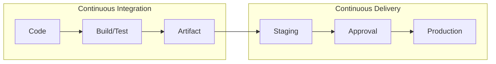
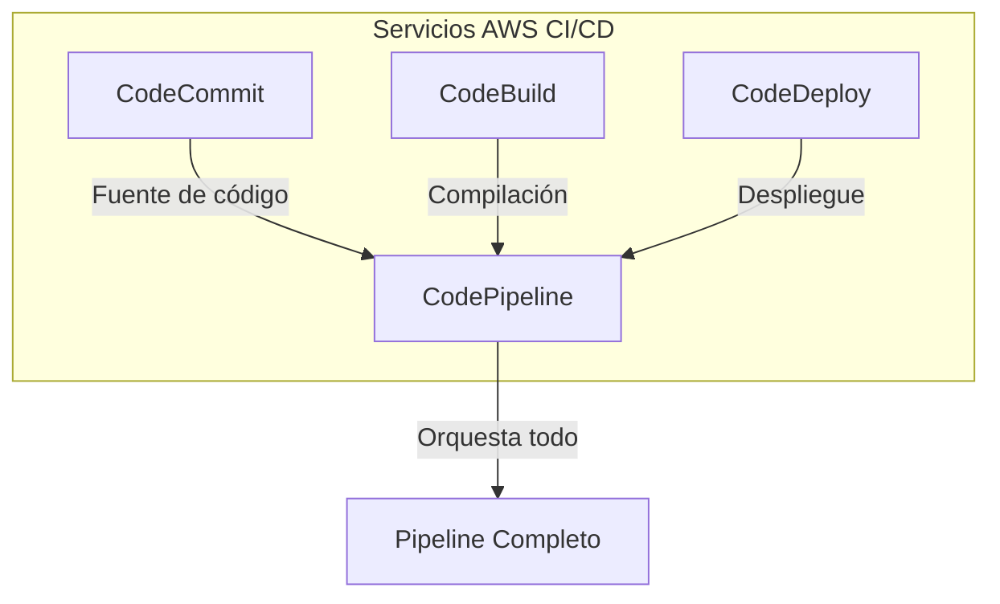
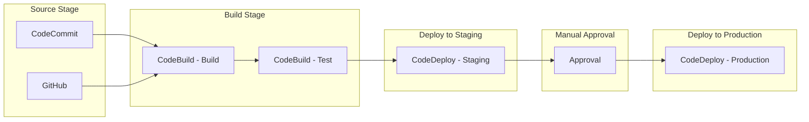
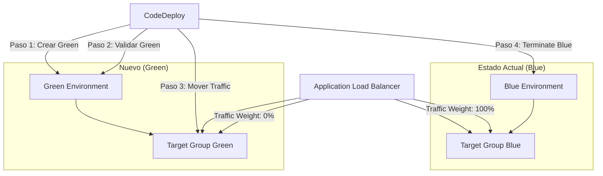
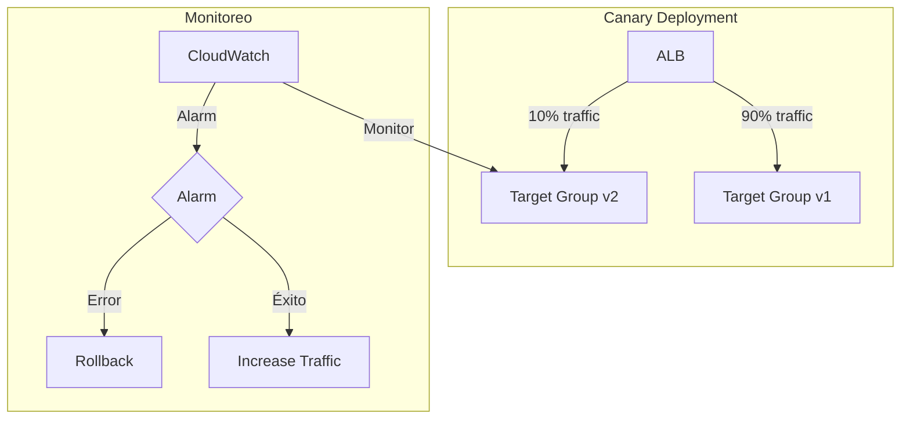

# AWS CI/CD - CodePipeline, CodeBuild, CodeDeploy

## ¿Qué es CI/CD en AWS?

CI/CD (Continuous Integration / Continuous Delivery) es la práctica de integrar código constantemente y desplegarlo automáticamente. AWS ofrece servicios nativos para construir pipelines completos de CI/CD.

**Analogía:** CI/CD es como una **fábrica automatizada**. Los trabajadores (CodeBuild) ensamblan el producto (compilan y testean el código), una cinta transportadora (CodePipeline) mueve el producto por cada estación, y al final el producto empaquetado (CodeDeploy) se envía a las tiendas (servidores) automáticamente.





---

## CodePipeline

CodePipeline es el orquestador de CI/CD de AWS. Define un pipeline como una serie de etapas (stages) que se ejecutan en orden.

### Conceptos Clave

| Concepto | Descripción |
|---|---|
| **Pipeline** | Flujo de trabajo completo de CI/CD |
| **Stage** | Grupo de acciones que se ejecutan en paralelo o en secuencia |
| **Action** | Tarea individual dentro de una stage |
| **Artifact** | Archivos movidos entre stages (resultado de builds) |
| **Source** | Fuente del código (GitHub, CodeCommit, S3) |
| **Provider** | Servicio que ejecuta la acción (CodeBuild, Lambda, etc.) |

### Pipeline Completo con CodePipeline



### Definición de Pipeline (CloudFormation)

```yaml
AWSTemplateFormatVersion: "2010-09-09"
Description: "Pipeline CI/CD completo"

Resources:
  # ==================== REPOSITORIO ====================
  CodeRepo:
    Type: AWS::CodeCommit::Repository
    Properties:
      RepositoryName: "mi-aplicacion"
      Description: "Repositorio de la aplicación"

  # ==================== CODEBUILD ====================
  BuildProject:
    Type: AWS::CodeBuild::Project
    Properties:
      Name: "mi-app-build"
      Description: "Build project para mi aplicación"
      ServiceRole: !GetAtt CodeBuildRole.Arn
      Artifacts:
        Type: CODEPIPELINE
      Environment:
        Type: LINUX_CONTAINER
        ComputeType: BUILD_GENERAL1_MEDIUM
        Image: aws/codebuild/amazonlinux2-x86_64-standard:4.0
        EnvironmentVariables:
          - Name: ENVIRONMENT
            Value: "production"
          - Name: NODE_ENV
            Value: "production"
      Source:
        Type: CODEPIPELINE
        BuildSpec: buildspec.yml
      TimeoutInMinutes: 15
      QueuedTimeoutInMinutes: 5

  TestProject:
    Type: AWS::CodeBuild::Project
    Properties:
      Name: "mi-app-test"
      Description: "Test project para mi aplicación"
      ServiceRole: !GetAtt CodeBuildRole.Arn
      Artifacts:
        Type: CODEPIPELINE
      Environment:
        Type: LINUX_CONTAINER
        ComputeType: BUILD_GENERAL1_SMALL
        Image: aws/codebuild/amazonlinux2-x86_64-standard:4.0
      Source:
        Type: CODEPIPELINE
        BuildSpec: testspec.yml

  # ==================== CODEDEPLOY ====================
  DeploymentConfig:
    Type: AWS::CodeDeploy::DeploymentConfig
    Properties:
      DeploymentConfigName: "CustomCodeDeployConfig"
      MinimumHealthyHosts:
        Type: FLEET_PERCENT
        Value: 75

  StagingDeploymentGroup:
    Type: AWS::CodeDeploy::DeploymentGroup
    Properties:
      ApplicationName: !Ref CodeDeployApp
      DeploymentGroupName: "staging-group"
      ServiceRoleArn: !GetAtt CodeDeployRole.Arn
      DeploymentConfigName: CodeDeployDefault.OneAtATime
      AutoScalingGroups:
        - !Ref StagingASG
      DeploymentStyle:
        DeploymentOption: WITH_TRAFFIC_CONTROL
        DeploymentType: IN_PLACE

  ProductionDeploymentGroup:
    Type: AWS::CodeDeploy::DeploymentGroup
    Properties:
      ApplicationName: !Ref CodeDeployApp
      DeploymentGroupName: "production-group"
      ServiceRoleArn: !GetAtt CodeDeployRole.Arn
      DeploymentConfigName: CodeDeployDefault.HalfAtATime
      AutoScalingGroups:
        - !Ref ProductionASG
      DeploymentStyle:
        DeploymentOption: WITH_TRAFFIC_CONTROL
        DeploymentType: IN_PLACE
      AutoRollbackConfiguration:
        Enabled: true
        Events:
          - DEPLOYMENT_FAILURE
          - DEPLOYMENT_STOP_ON_REQUEST

  CodeDeployApp:
    Type: AWS::CodeDeploy::Application
    Properties:
      ApplicationName: "mi-aplicacion"
      ComputePlatform: Server

  # ==================== S3 BUCKET PARA ARTIFACTS ====================
  ArtifactBucket:
    Type: AWS::S3::Bucket
    Properties:
      BucketEncryption:
        ServerSideEncryptionConfiguration:
          - ServerSideEncryptionByDefault:
              SSEAlgorithm: aws:kms
      LifecycleConfiguration:
        Rules:
          - Id: ExpireArtifacts
            Status: Enabled
            ExpirationInDays: 30

  # ==================== SNS TOPIC ====================
  PipelineNotifications:
    Type: AWS::SNS::Topic
    Properties:
      TopicName: "pipeline-notifications"

  # ==================== PIPELINE ====================
  Pipeline:
    Type: AWS::CodePipeline::Pipeline
    Properties:
      Name: "mi-app-pipeline"
      RoleArn: !GetAtt PipelineRole.Arn
      ArtifactStore:
        Type: S3
        Location: !Ref ArtifactBucket
      Stages:
        # Stage 1: Source
        - Name: "Source"
          Actions:
            - Name: "CodeCommitSource"
              ActionTypeId:
                Category: Source
                Owner: AWS
                Provider: CodeCommit
                Version: "1"
              Configuration:
                RepositoryName: !GetAtt CodeRepo.RepositoryName
                BranchName: "main"
                PollForSourceChanges: false
              OutputArtifacts:
                - Name: "SourceOutput"
        
        # Stage 2: Build
        - Name: "Build"
          Actions:
            - Name: "BuildApplication"
              ActionTypeId:
                Category: Build
                Owner: AWS
                Provider: CodeBuild
                Version: "1"
              Configuration:
                ProjectName: !Ref BuildProject
              InputArtifacts:
                - Name: "SourceOutput"
              OutputArtifacts:
                - Name: "BuildOutput"
        
        # Stage 3: Test
        - Name: "Test"
          Actions:
            - Name: "RunTests"
              ActionTypeId:
                Category: Build
                Owner: AWS
                Provider: CodeBuild
                Version: "1"
              Configuration:
                ProjectName: !Ref TestProject
              InputArtifacts:
                - Name: "SourceOutput"
              OutputArtifacts:
                - Name: "TestOutput"
        
        # Stage 4: Deploy to Staging
        - Name: "DeployStaging"
          Actions:
            - Name: "DeployToStaging"
              ActionTypeId:
                Category: Deploy
                Owner: AWS
                Provider: CodeDeploy
                Version: "1"
              Configuration:
                ApplicationName: !Ref CodeDeployApp
                DeploymentGroupName: !Ref StagingDeploymentGroup
              InputArtifacts:
                - Name: "BuildOutput"
        
        # Stage 5: Manual Approval
        - Name: "Approval"
          Actions:
            - Name: "ManualApproval"
              ActionTypeId:
                Category: Approval
                Owner: Custom
                Provider: Manual
                Version: "1"
              Configuration:
                CustomData: "Por favor, revisa la aplicación en staging antes de aprobar"
                NotificationArn: !Ref PipelineNotifications
        
        # Stage 6: Deploy to Production
        - Name: "DeployProduction"
          Actions:
            - Name: "DeployToProduction"
              ActionTypeId:
                Category: Deploy
                Owner: AWS
                Provider: CodeDeploy
                Version: "1"
              Configuration:
                ApplicationName: !Ref CodeDeployApp
                DeploymentGroupName: !Ref ProductionDeploymentGroup
              InputArtifacts:
                - Name: "BuildOutput"

  # ==================== IAM ROLES ====================
  PipelineRole:
    Type: AWS::IAM::Role
    Properties:
      AssumeRolePolicyDocument:
        Version: "2012-10-17"
        Statement:
          - Effect: Allow
            Principal:
              Service: codepipeline.amazonaws.com
            Action: sts:AssumeRole
      ManagedPolicyArns:
        - arn:aws:iam::aws:policy/AmazonS3FullAccess
        - arn:aws:iam::aws:policy/AWSCodeCommitFullAccess
        - arn:aws:iam::aws:policy/AWSCodeBuildAdminAccess
        - arn:aws:iam::aws:policy/AWSCodeDeployAdminAccess

  CodeBuildRole:
    Type: AWS::IAM::Role
    Properties:
      AssumeRolePolicyDocument:
        Version: "2012-10-17"
        Statement:
          - Effect: Allow
            Principal:
              Service: codebuild.amazonaws.com
            Action: sts:AssumeRole

  CodeDeployRole:
    Type: AWS::IAM::Role
    Properties:
      AssumeRolePolicyDocument:
        Version: "2012-10-17"
        Statement:
          - Effect: Allow
            Principal:
              Service: codedeploy.amazonaws.com
            Action: sts:AssumeRole
      ManagedPolicyArns:
        - arn:aws:iam::aws:policy/service-role/AWSCodeDeployRole

Outputs:
  PipelineName:
    Value: !Ref Pipeline
  RepositoryCloneUrl:
    Value: !GetAtt CodeRepo.CloneUrlSsh
```

---

## CodeBuild

CodeBuild compila el código, ejecuta tests y genera artifacts.

### buildspec.yml

```yaml
version: 0.2

env:
  variables:
    NODE_ENV: "production"
    APP_NAME: "mi-app"
  parameter-store:
    DATABASE_URL: "/mi-app/database/url"
  secrets-manager:
    API_KEY: "mi-app/secrets:api_key"

phases:
  install:
    runtime-versions:
      nodejs: 18
    commands:
      - echo "Instalando dependencias..."
      - npm ci
  pre_build:
    commands:
      - echo "Ejecutando linting..."
      - npm run lint
      - echo "Ejecutando type-check..."
      - npm run typecheck
  build:
    commands:
      - echo "Compilando la aplicación..."
      - npm run build
      - echo "Ejecutando tests unitarios..."
      - npm run test:unit
    finally:
      - echo "Build completado"
  post_build:
    commands:
      - echo "Ejecutando tests de integración..."
      - npm run test:integration
      - echo "Generando reportes de cobertura..."
      - npm run test:coverage

artifacts:
  files:
    - '**/*'
  exclude-paths:
    - 'node_modules/**'
    - '.git/**'
    - 'coverage/**'
    - 'tests/**'
  discard-paths: no
  name: "build-artifact-$(date +%Y%m%d%H%M%S)"

cache:
  paths:
    - 'node_modules/**/*'
    - '/root/.npm/**/*'

reports:
  coverage Reports:
    files:
      - 'coverage/clover.xml'
    file-format: CLOVERXML
  test Reports:
    files:
      - 'test-results/junit.xml'
    file-format: JUNITXML

batch:
  fast-fail: true
  build-list:
    - identifier: build
    - identifier: test
      depends-on:
        - build
```

### buildspec.yml para Python

```yaml
version: 0.2

env:
  variables:
    DJANGO_SETTINGS_MODULE: "config.settings.production"

phases:
  install:
    commands:
      - pip install --upgrade pip
      - pip install -r requirements.txt
      - pip install -r requirements-dev.txt
  pre_build:
    commands:
      - python manage.py check --deploy
      - python manage.py test --settings=config.settings.test
  build:
    commands:
      - python manage.py collectstatic --noinput
      - python manage.py migrate --check

artifacts:
  files:
    - '**/*'
  exclude-paths:
    - 'venv/**'
    - '__pycache__/**'
    - '.git/**'
```

---

## CodeDeploy

CodeDeploy despliega código en servidores (EC2, on-premises) o AWS Lambda.

### appspec.yml

```yaml
version: 0.0
os: linux
files:
  - source: /
    destination: /var/www/html
    overwrite: yes
file_exists_behavior: OVERWRITE

permissions:
  - object: /var/www/html
    pattern: "**"
    owner: ec2-user
    group: ec2-user
    mode: 755
    type:
      - directory
  - object: /var/www/html
    pattern: "**/*"
    owner: ec2-user
    group: ec2-user
    mode: 644
    type:
      - file

hooks:
  BeforeInstall:
    - location: scripts/before_install.sh
      timeout: 300
      runas: root
  AfterInstall:
    - location: scripts/after_install.sh
      timeout: 300
      runas: root
  ApplicationStart:
    - location: scripts/start_server.sh
      timeout: 300
      runas: root
  ValidateService:
    - location: scripts/validate_service.sh
      timeout: 300
      runas: root
  BeforeAllowTraffic:
    - location: scripts/before_traffic.sh
      timeout: 300
      runas: root
  AfterAllowTraffic:
    - location: scripts/after_traffic.sh
      timeout: 300
      runas: root
```

### Scripts de Hooks

```bash
#!/bin/bash
# scripts/before_install.sh
set -e

echo "Pre-instalación iniciada..."
yum update -y
yum install -y nginx

# Crear directorio de deploy si no existe
mkdir -p /var/www/html
chown ec2-user:ec2-user /var/www/html

# Detener nginx si está corriendo
systemctl stop nginx || true
```

```bash
#!/bin/bash
# scripts/after_install.sh
set -e

echo "Post-instalación iniciada..."
cd /var/www/html

# Instalar dependencias de producción
npm ci --only=production

# Configurar permisos
chown -R ec2-user:ec2-user /var/www/html
chmod -R 755 /var/www/html

# Copiar configuración de nginx
cp nginx.conf /etc/nginx/nginx.conf
```

```bash
#!/bin/bash
# scripts/start_server.sh
set -e

echo "Iniciando servidor..."

# Iniciar nginx
systemctl start nginx
systemctl enable nginx

# Esperar a que el servicio esté listo
sleep 10

# Verificar que nginx está corriendo
if ! systemctl is-active --quiet nginx; then
    echo "ERROR: nginx no pudo iniciarse"
    exit 1
fi
```

```bash
#!/bin/bash
# scripts/validate_service.sh
set -e

echo "Validando servicio..."

# Esperar a que la aplicación esté lista
for i in {1..30}; do
    if curl -s http://localhost/health | grep -q "healthy"; then
        echo "Servicio validado correctamente"
        exit 0
    fi
    echo "Esperando... ($i/30)"
    sleep 2
done

echo "ERROR: Servicio no respondió después de 60 segundos"
exit 1
```

---

## Blue/Green Deployment con CodeDeploy



### Configuración Blue/Green

```yaml
# appspec.yml para Blue/Green
version: 0.0
os: linux
application:
  hooks:
    BeforeInstall:
      - location: scripts/before_install.sh
    AfterInstall:
      - location: scripts/after_install.sh
    AllowTestTraffic:
      - location: scripts/test_traffic.sh
    ApplicationStart:
      - location: scripts/start_server.sh
    ValidateService:
      - location: scripts/validate_service.sh
    BeforeAllowTraffic:
      - location: scripts/before_traffic.sh
    AfterAllowTraffic:
      - location: scripts/after_traffic.sh
```

```yaml
# Configuración de Deployment Group para Blue/Green
Type: AWS::CodeDeploy::DeploymentGroup
Properties:
  ApplicationName: !Ref App
  DeploymentGroupName: "production-green"
  ServiceRoleArn: !GetAtt CodeDeployRole.Arn
  DeploymentConfigName: CodeDeployDefault.OneAtATime
  AutoScalingGroups:
    - !Ref GreenASG
  LoadBalancerInfo:
    TargetGroupInfoList:
      - Name: !Ref GreenTargetGroup
  DeploymentStyle:
    DeploymentOption: WITH_TRAFFIC_CONTROL
    DeploymentType: BLUE_GREEN
  BlueGreenDeploymentConfiguration:
    TerminateBlueInstancesOnDeploymentSuccess:
      Action: TERMINATE
      TerminationWaitTimeMinutes: 60
    DeploymentReadyOption:
      ActionOnTimeout: CONTINUE_DEPLOYMENT
      WaitTimeInMinutes: 0
    ReadyTimeout:
      ActionOnTimeout: CONTINUE_DEPLOYMENT
      WaitTimeInMinutes: 0
  AutoRollbackConfiguration:
    Enabled: true
    Events:
      - DEPLOYMENT_FAILURE
      - DEPLOYMENT_STOP_ON_REQUEST
```

---

## Canary Deployment con CodeDeploy



### Canary con CodeDeploy + Lambda

```yaml
# Canary Deployment - Lambda Function
Type: AWS::Lambda::Alias
Properties:
  FunctionName: !Ref MiLambda
  Name: "live"
  RoutingConfig:
    AdditionalVersionWeights:
      - FunctionVersion: !Ref NewLambdaVersion
        FunctionWeight: 0.1  # 10% al nuevo version

# Canary Deployment - EC2
Type: AWS::CodeDeploy::DeploymentConfig
Properties:
  DeploymentConfigName: "Canary10Percent5Minutes"
  TrafficRoutingConfig:
    Type: TimeBasedCanary
    TimeBasedCanary:
      CanaryPercentage: 10
      CanaryInterval: 5
```

---

## CodeCommit

CodeCommit es el servicio de repositorios Git gestionados de AWS.

```bash
# Clonar repositorio
git clone https://git-codecommit.us-east-1.amazonaws.com/v1/repos/mi-repo

# Configurar credenciales para CodeCommit
git config --global credential.helper '!aws codecommit credential-helper $@'
git config --global credential.UseHttpPath true

# Crear repositorio
aws codecommit create-repository \
  --repository-name mi-repo \
  --repository-description "Repositorio de mi aplicación"
```

---

## Integración con NestJS/React

### buildspec.yml para NestJS

```yaml
version: 0.2

env:
  variables:
    NODE_ENV: "production"
    NESTJS_ENV: "production"

phases:
  install:
    runtime-versions:
      nodejs: 18
    commands:
      - npm ci
  build:
    commands:
      - npm run build
      - npm run test:cov
      - npm run test:e2e

artifacts:
  base-directory: dist
  files:
    - '**/*'
```

### appspec.yml para NestJS (EC2)

```yaml
version: 0.0
os: linux
files:
  - source: dist
    destination: /var/www/nestjs-app/dist
  - source: package.json
    destination: /var/www/nestjs-app/
  - source: package-lock.json
    destination: /var/www/nestjs-app/
  - source: ecosystem.config.js
    destination: /var/www/nestjs-app/
hooks:
  AfterInstall:
    - location: scripts/install-dependencies.sh
      timeout: 600
      runas: root
  ApplicationStart:
    - location: scripts/start-nestjs.sh
      timeout: 300
      runas: root
  ValidateService:
    - location: scripts/validate-nestjs.sh
      timeout: 120
      runas: root
```

### buildspec.yml para React

```yaml
version: 0.2

phases:
  install:
    runtime-versions:
      nodejs: 18
    commands:
      - npm ci
  build:
    commands:
      - npm run build
      - npm run test -- --watchAll=false
  post_build:
    commands:
      - aws s3 sync build/ s3://mi-bucket-frontend/ --delete
      - aws cloudfront create-invalidation --distribution-id EXXXXX --paths "/*"
```

---

## Pricing

| Servicio | Costo |
|---|---|
| **CodePipeline** | $15/pipeline/mes (1 activo gratis) |
| **CodeBuild** | $0.0067/minuto (build general 1 small) |
| **CodeDeploy** | Gratis para EC2/Lambda (pago por recursos) |
| **CodeCommit** | $1/usuario/mes (5 usuarios gratis) |
| **S3 (artifacts)** | $0.023/GB/mes |
| **SNS (notificaciones)** | $0.50/millón de publicaciones |

---

## Mejores Prácticas

### 1. Estructura del Pipeline

```yaml
# Pipeline con stages separados
Stages:
  - Name: Source          # Código fuente
  - Name: Build           # Compilar
  - Name: Unit Tests      # Tests unitarios
  - Name: Security Scan   # Análisis de seguridad
  - Name: Deploy Staging  # Desplegar en staging
  - Name: Integration Tests # Tests de integración
  - Name: Manual Approval # Aprobación manual
  - Name: Deploy Production # Desplegar en producción
```

### 2. Manejo de Errores

```yaml
# Auto-rollback en CodeDeploy
AutoRollbackConfiguration:
  Enabled: true
  Events:
    - DEPLOYMENT_FAILURE
    - DEPLOYMENT_STOP_ON_REQUEST
    - DEPLOYMENT_STOP_ON_ALARM
```

### 3. Seguridad

- Usa **AWS Secrets Manager** para credenciales en buildspecs
- Implementa **IAM roles**最小权限 (least privilege)
- Habilita **encryption** para artifacts en S3
- Usa **VPC endpoints** para acceder a servicios privados
- Implementa **branch protection** en CodeCommit

### 4. Monitoreo

```yaml
# CloudWatch Events para notificaciones
Type: AWS::Events::Rule
Properties:
  Description: "Notificar cambios en el pipeline"
  EventPattern:
    source:
      - "aws.codepipeline"
    detail-type:
      - "CodePipeline Pipeline Execution State Change"
    detail:
      state:
        - "FAILED"
        - "SUCCEEDED"
  Targets:
    - Arn: !Ref AlertSNSTopic
      Id: "PipelineAlerts"
```

### 5. Cache en CodeBuild

```yaml
# Cache para builds rápidos
cache:
  paths:
    - 'node_modules/**/*'      # npm cache
    - 'dist/**/*'              # Build cache
    - '.next/cache/**/*'       # Next.js cache
    - '/root/.npm/**/*'        # Global npm cache
```

---

## Errores Comunes

1. **No configurar permisos IAM** correctos para CodeBuild
2. **Olvidar artifacts** entre stages (pipeline falla)
3. **No usar cache** → builds lentos y costosos
4. **Hardcodear secrets** en buildspec.yml
5. **No implementar auto-rollback** → despliegues fallidos permanecen
6. **Ignorar tests de integración** → bugs en producción
7. **No usar notificaciones SNS** → no saber cuándo falla el pipeline
8. **No validar el appspec.yml** antes de crear el deployment group

---

## Consejos para Entrevistas

1. **Explica la diferencia** entre Blue/Green y Canary deployments
2. **Conoce los hooks** de CodeDeploy (BeforeInstall, AfterInstall, etc.)
3. **Entiende los artifacts** y cómo se mueven entre stages
4. **Sabe cuándo usar** CodePipeline vs GitHub Actions vs Jenkins
5. **Conoce las configuraciones de deployment** (OneAtATime, HalfAtATime, AllAtOnce)
6. **Explica cómo funciona** auto-rollback en CodeDeploy
7. **Entiende el concepto de deployment groups** y cómo monitorear despliegues

---

## Preguntas Frecuentes (FAQ)

**¿Cuál es la diferencia entre CodePipeline y Jenkins?**
CodePipeline es un servicio managed de AWS, mientras Jenkins es un servidor self-hosted. CodePipeline es más simple pero menos personalizable; Jenkins es más flexible pero requiere mantenimiento.

**¿Puedo usar CodeDeploy con containers?**
Sí, CodeDeploy soporta Amazon ECS, AWS Lambda y Amazon EC2/On-Premises. Para EKS, usa AWS CodePipeline con CodeBuild.

**¿Cómo funcionan los deployment configurations?**
Definen la velocidad del despliegue: `OneAtATime` (uno por vez), `HalfAtATime` (mitad a la vez), `AllAtOnce` (todos a la vez).

**¿Puedo hacer deployments a múltiples regiones?**
Sí, puedes configurar CodeDeploy deployment groups en múltiples regiones o usar CodePipeline con múltiples actions.

**¿Cómo manejo secrets en CodeBuild?**
Usa AWS Secrets Manager o SSM Parameter Store con `secrets-manager` o `parameter-store` en la sección `env` del buildspec.

**¿CodePipeline tiene límites?**
Sí, por defecto puedes tener hasta 5 pipelines activos por cuenta. Puedes solicitar aumentos.

---

## Resumen

AWS CI/CD ofrece un conjunto completo de servicios para automatizar tu flujo de trabajo:

- **CodePipeline** orquesta el flujo completo de CI/CD con stages y actions
- **CodeBuild** compila, ejecuta tests y genera artifacts
- **CodeDeploy** despliega código en EC2, Lambda o ECS con estrategias avanzadas
- **CodeCommit** gestiona repositorios Git en la nube

Las estrategias de despliegue como **Blue/Green** y **Canary** permiten desplegar de forma segura sin downtime. La integración con CloudWatch permite monitorear los despliegues y ejecutar auto-rollback en caso de errores.

---
