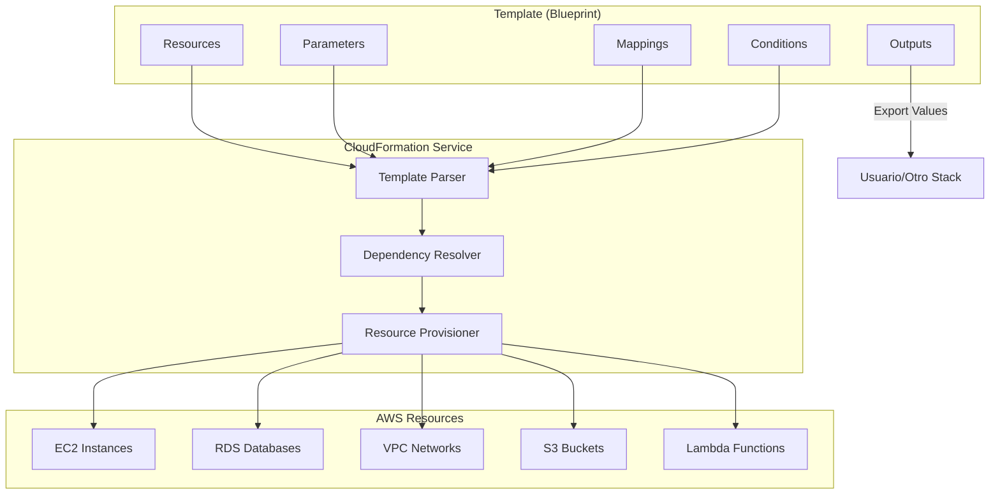
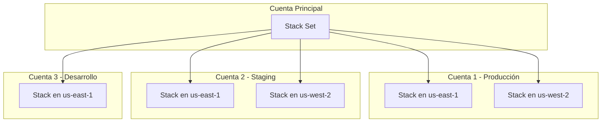
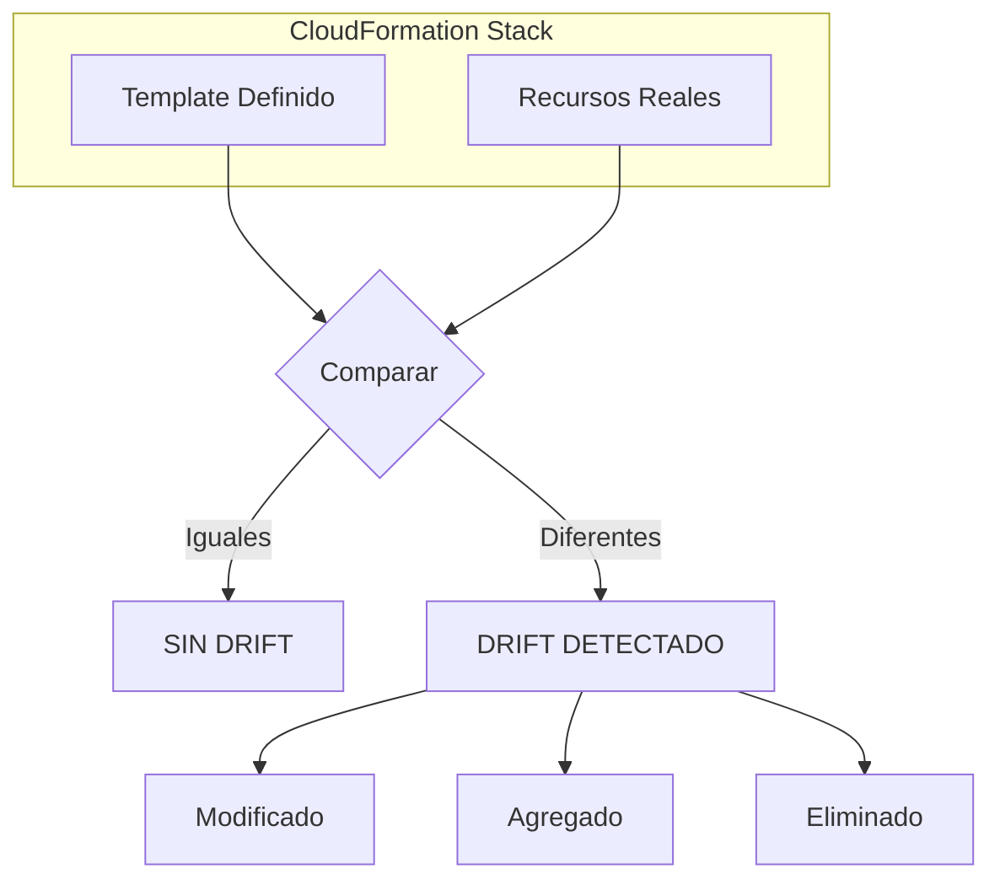
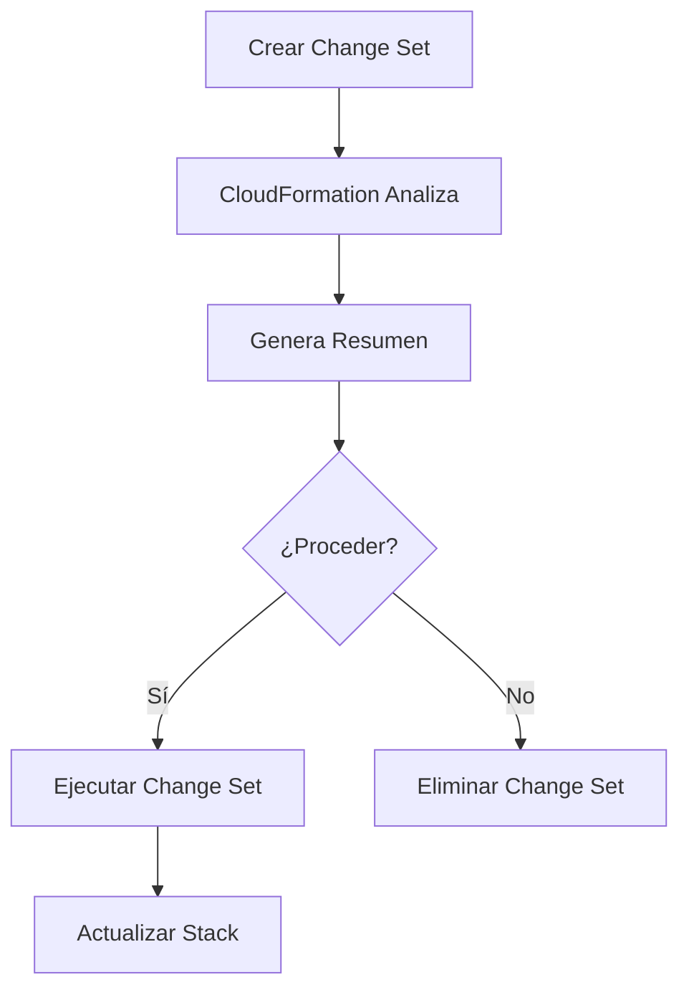
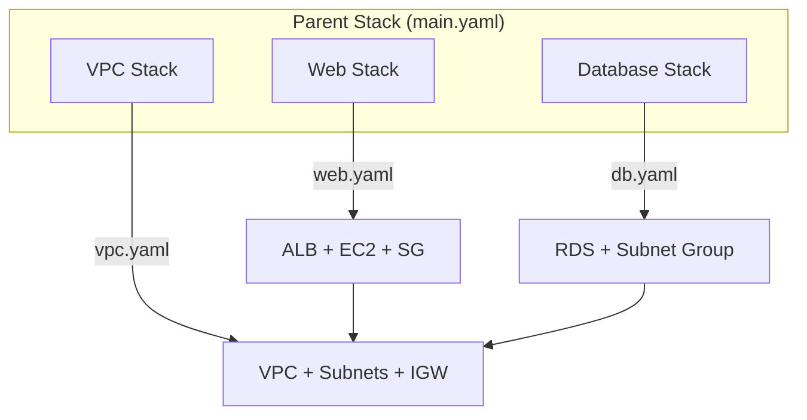

# AWS CloudFormation - Infrastructure as Code

## ¿Qué es AWS CloudFormation?

AWS CloudFormation es un servicio que permite modelar y configurar tus recursos de AWS usando archivos de configuración llamados **templates**. Es Infrastructure as Code (IaC) en su forma más nativa de AWS.

**Analogía:** CloudFormation es como un **libro de recetas** para tu infraestructura. Así como un libro de recetas te dice exactamente qué ingredientes necesitas (recursos), en qué orden cocinarlos (dependencias), y cómo presentar el plato final (outputs), CloudFormation te dice qué recursos crear, cómo configurarlos y cómo interconectarse.



---

## Estructura de un Template

Un template de CloudFormation puede estar en formato YAML o JSON. La estructura principal es:

```yaml
AWSTemplateFormatVersion: "2010-09-09"
Description: "Descripción del template"

Metadata:
  AWS::CloudFormation::Interface:
    ParameterGroups:
      - Label:
          default: "Network Configuration"
        Parameters:
          - VpcCIDR
          - SubnetCIDR

Parameters:
  EnvironmentName:
    Type: String
    Default: "production"
    AllowedValues:
      - production
      - staging
      - development
    Description: "Nombre del entorno"

Mappings:
  RegionMap:
    us-east-1:
      AMI: "ami-0c02fb55956c7d316"
      InstanceType: "t3.micro"
    us-west-2:
      AMI: "ami-0def43b4056c7d316"
      InstanceType: "t3.small"

Conditions:
  IsProduction: !Equals [!Ref EnvironmentName, "production"]
  CreateSubnet: !Not [!Condition IsProduction]

Resources:
  MiRecurso:
    Type: AWS::EC2::Instance
    Properties:
      # ...

Outputs:
  InstanceId:
    Value: !Ref MiRecurso
    Export:
      Name: !Sub "${AWS::StackName}-InstanceId"
```

### Secciones Explicadas

| Sección | Descripción | Obligatoria |
|---|---|---|
| **AWSTemplateFormatVersion** | Versión del formato del template | No |
| **Description** | Descripción del template | No |
| **Metadata** | Información adicional del template | No |
| **Parameters** | Valores que el usuario proporciona al crear el stack | No |
| **Mappings** | Tablas de valores fijos (como lookup tables) | No |
| **Conditions** | Condiciones para crear recursos condicionalmente | No |
| **Resources** | Los recursos AWS a crear (OBLIGATORIO) | Sí |
| **Outputs** | Valores que CloudFormation exporta al finalizar | No |

---

## Resources, Outputs, Parameters, Mappings y Conditions

### Resources (Recursos)

```yaml
Resources:
  MiEC2:
    Type: AWS::EC2::Instance
    Properties:
      InstanceType: t3.micro
      ImageId: ami-0c02fb55956c7d316
      KeyName: !Ref MiKeyPair
      SubnetId: !Ref MiSubnet
      SecurityGroupIds:
        - !Ref MiSecurityGroup
      Tags:
        - Key: Name
          Value: "Mi Servidor"
      Metadata:
        AWS::CloudFormation::Init:
          config:
            packages:
              yum:
                nginx: []
            services:
              sysvinit:
                nginx:
                  enabled: true
                  ensureRunning: true
```

### Parameters (Parámetros)

```yaml
Parameters:
  InstanceType:
    Type: String
    Default: "t3.micro"
    AllowedValues:
      - t3.micro
      - t3.small
      - t3.medium
      - t3.large
    Description: "Tipo de instancia EC2"
    ConstraintDescription: "Debe ser un tipo de instancia válido de EC2"
  
  VpcCIDR:
    Type: String
    Default: "10.0.0.0/16"
    AllowedPattern: "([0-9]{1,3})\\.([0-9]{1,3})\\.([0-9]{1,3})\\.([0-9]{1,3})/([0-9]{1,2})"
    Description: "CIDR block para la VPC"
    ConstraintDescription: "Debe ser un CIDR válido (ej: 10.0.0.0/16)"
  
  KeyPairName:
    Type: AWS::EC2::KeyPair::KeyName
    Description: "Nombre del Key Pair para SSH"
  
  LatestAmiId:
    Type: AWS::SSM::Parameter::Value<AWS::EC2::Image::Id>
    Default: "/aws/service/ami-amazon-linux-latest/amzn2-ami-hvm-x86_64-gp2"
```

### Mappings (Mapeos)

```yaml
Mappings:
  RegionMap:
    us-east-1:
      AMI: "ami-0c02fb55956c7d316"
      InstanceType: "t3.micro"
      VolumeType: "gp3"
    us-west-2:
      AMI: "ami-0def43b4056c7d316"
      InstanceType: "t3.small"
      VolumeType: "gp3"
    eu-west-1:
      AMI: "ami-0f43b4056c7d316ab"
      InstanceType: "t3.medium"
      VolumeType: "gp3"
  
  EnvMap:
    production:
      InstanceCount: 3
      InstanceType: "t3.large"
    staging:
      InstanceCount: 1
      InstanceType: "t3.micro"
    development:
      InstanceCount: 1
      InstanceType: "t3.nano"
```

### Conditions (Condiciones)

```yaml
Conditions:
  IsProduction: !Equals [!Ref EnvironmentName, "production"]
  IsStaging: !Equals [!Ref EnvironmentName, "staging"]
  IsDevelopment: !Equals [!Ref EnvironmentName, "development"]
  CreateBackup: !Or
    - !Condition IsProduction
    - !Condition IsStaging
  UseStandardInstance: !Not [!Condition IsDevelopment]

# Uso en Resources:
Resources:
  BackupVault:
    Type: AWS::Backup::BackupVault
    Condition: CreateBackup
    Properties:
      BackupVaultName: !Sub "${AWS::StackName}-backup"
```

### Outputs (Outputs)

```yaml
Outputs:
  VpcId:
    Description: "ID de la VPC"
    Value: !Ref MiVPC
    Export:
      Name: !Sub "${AWS::StackName}-VpcId"
  
  PublicSubnetId:
    Description: "ID de la Subnet Pública"
    Value: !Ref PublicSubnet
    Export:
      Name: !Sub "${AWS::StackName}-PublicSubnet"
  
  LoadBalancerDNS:
    Description: "DNS del Load Balancer"
    Value: !GetAtt MiALB.DNSName
    Export:
      Name: !Sub "${AWS::StackName}-ALB-DNS"
  
  DatabaseEndpoint:
    Description: "Endpoint de la base de datos"
    Value: !GetAtt MiRDS.Endpoint.Address
    Condition: IsProduction
```

---

## Intrinsic Functions

Las funciones intrínsecas son el "lenguaje de programación" de CloudFormation.

### Funciones Principales

| Función | Descripción | Ejemplo |
|---|---|---|
| `!Ref` | Referencia a un recurso o parámetro | `!Ref MiRecurso` |
| `!Sub` | Sustitución de variables | `!Sub "Hello ${Name}"` |
| `!GetAtt` | Obtener atributo de un recurso | `!GetAtt MiVPC.VpcId` |
| `!Join` | Unir strings | `!Join ["-", ["a", "b"]]` |
| `!Select` | Seleccionar elemento de una lista | `!Select [0, ["a", "b"]]` |
| `!Split` | Dividir string en lista | `!Split [",", "a,b,c"]` |
| `!GetAZs` | Obtener AZs de una región | `!GetAZs "us-east-1"` |
| `!ImportValue` | Importar valor de otro stack | `!ImportValue "SharedVpcId"` |

### Ejemplos de Funciones Intrínsecas

```yaml
Resources:
  # Ref - Referenciar parámetros y recursos
  MiInstancia:
    Type: AWS::EC2::Instance
    Properties:
      InstanceType: !Ref InstanceType
      ImageId: !Ref LatestAmiId
      SubnetId: !Ref MiSubnet

  # Sub - Sustitución de variables
  MiBucket:
    Type: AWS::S3::Bucket
    Properties:
      BucketName: !Sub "${AWS::StackName}-bucket-${AWS::AccountId}"
      Tags:
        - Key: Name
          Value: !Sub "Bucket de ${EnvironmentName} en ${AWS::Region}"

  # GetAtt - Obtener atributos
  MiSecurityGroup:
    Type: AWS::EC2::SecurityGroup
    Properties:
      GroupDescription: "Security Group"
      VpcId: !Ref MiVPC

  MiRecursoDependiente:
    Type: AWS::EC2::Instance
    Properties:
      SecurityGroups:
        - !GetAtt MiSecurityGroup.GroupId

  # Join - Unir strings
  MiUserData:
    Type: AWS::EC2::Instance
    Properties:
      UserData:
        Fn::Base64: !Sub |
          #!/bin/bash
          yum update -y
          yum install -y nginx
          echo "Server=${ServerAddress}" >> /etc/nginx/nginx.conf
          echo "Port=${ServerPort}" >> /etc/nginx/nginx.conf
          systemctl start nginx

  # Select - Seleccionar de una lista
  MiSubnet:
    Type: AWS::EC2::Subnet
    Properties:
      AvailabilityZone: !Select [0, !GetAZs "us-east-1"]

  # Conditional con If
  MiAlarma:
    Type: AWS::CloudWatch::Alarm
    Properties:
      AlarmName: !If
        - IsProduction
        - "Production-CPU-Alarm"
        - "Development-CPU-Alarm"
      Threshold: !If
        - IsProduction
        - 80
        - 90
```

---

## Stacks y Stack Sets

### Stacks

Un stack es una colección de recursos que CloudFormation gestiona como una unidad.

```bash
# Crear un stack
aws cloudformation create-stack \
  --stack-name mi-stack-produccion \
  --template-body file://template.yaml \
  --parameters ParameterKey=EnvironmentName,ParameterValue=production \
  --capabilities CAPABILITY_NAMED_IAM \
  --tags Key=Environment,Value=production

# Actualizar un stack
aws cloudformation update-stack \
  --stack-name mi-stack-produccion \
  --template-body file://template-actualizado.yaml \
  --parameters ParameterKey=EnvironmentName,ParameterValue=production

# Verificar estado de un stack
aws cloudformation describe-stacks \
  --stack-name mi-stack-produccion

# Eliminar un stack
aws cloudformation delete-stack \
  --stack-name mi-stack-produccion
```

### Stack Sets

Stack Sets permite implementar un stack en múltiples cuentas y regiones.



```bash
# Crear Stack Set
aws cloudformation create-stack-set \
  --stack-set-name mi-stack-set \
  --template-body file://template.yaml \
  --permission-model SERVICE_MANAGED \
  --auto-deployment Enabled=TRUE,RetainStacksOnAccountRemoval=FALSE

# Desplegar en cuentas específicas
aws cloudformation create-stack-instances \
  --stack-set-name mi-stack-set \
  --accounts '["123456789012","987654321098"]' \
  --regions '["us-east-1","us-west-2"]'
```

---

## Drift Detection

El drift detection identifica cambios manuales en recursos gestionados por CloudFormation.



```bash
# Detectar drift
aws cloudformation detect-stack-drift \
  --stack-name mi-stack

# Verificar estado del drift
aws cloudformation describe-stack-drift-detection-status \
  --stack-drift-detection-id "id-del-detect"

# Ver recursos con drift
aws cloudformation describe-stack-resource-drifts \
  --stack-name mi-stack \
  --stack-resource-drift-status-filters MODIFIED DELETED
```

---

## Change Sets

Los Change Sets te permiten previsualizar cambios antes de aplicarlos.



```bash
# Crear Change Set
aws cloudformation create-change-set \
  --stack-name mi-stack \
  --change-set-name mi-cambio \
  --template-body file://template-actualizado.yaml \
  --capabilities CAPABILITY_NAMED_IAM

# Ver el Change Set
aws cloudformation describe-change-set \
  --stack-name mi-stack \
  --change-set-name mi-cambio

# Ejecutar el Change Set
aws cloudformation execute-change-set \
  --stack-name mi-stack \
  --change-set-name mi-cambio

# Eliminar el Change Set (si decides no aplicar)
aws cloudformation delete-change-set \
  --stack-name mi-stack \
  --change-set-name mi-cambio
```

---

## Nested Stacks

Los Nested Stacks permiten componer múltiples templates en uno solo.



```yaml
# Template principal (main.yaml)
Resources:
  VPCStack:
    Type: AWS::CloudFormation::Stack
    Properties:
      TemplateURL: https://s3.amazonaws.com/mi-bucket/templates/vpc.yaml
      Parameters:
        VpcCIDR: !Ref VpcCIDR
        EnvironmentName: !Ref EnvironmentName
  
  WebStack:
    Type: AWS::CloudFormation::Stack
    Properties:
      TemplateURL: https://s3.amazonaws.com/mi-bucket/templates/web.yaml
      Parameters:
        VpcId: !GetAtt VPCStack.Outputs.VpcId
        PublicSubnet: !GetAtt VPCStack.Outputs.PublicSubnetId
  
  DatabaseStack:
    Type: AWS::CloudFormation::Stack
    Properties:
      TemplateURL: https://s3.amazonaws.com/mi-bucket/templates/database.yaml
      Parameters:
        VpcId: !GetAtt VPCStack.Outputs.VpcId
        PrivateSubnet1: !GetAtt VPCStack.Outputs.PrivateSubnet1Id
        PrivateSubnet2: !GetAtt VPCStack.Outputs.PrivateSubnet2Id
```

---

## Custom Resources

Las Custom Resources extienden CloudFormation con lógica personalizada.

```yaml
Resources:
  MiCustomResource:
    Type: Custom::MiCustomResource
    Properties:
      ServiceToken: !GetAtt MiLambdaFunction.Arn
      Parametro1: "valor1"
      Parametro2: "valor2"
```

---

## Template Completo: VPC + EC2 + RDS

```yaml
AWSTemplateFormatVersion: "2010-09-09"
Description: >
  Template completo que crea una VPC con subnets públicas/privadas,
  un ALB, una instancia EC2 y una base de datos RDS PostgreSQL.

Parameters:
  EnvironmentName:
    Type: String
    Default: "production"
    AllowedValues: [production, staging, development]
  
  VpcCIDR:
    Type: String
    Default: "10.0.0.0/16"
  
  PublicSubnet1CIDR:
    Type: String
    Default: "10.0.1.0/24"
  
  PublicSubnet2CIDR:
    Type: String
    Default: "10.0.2.0/24"
  
  PrivateSubnet1CIDR:
    Type: String
    Default: "10.0.3.0/24"
  
  PrivateSubnet2CIDR:
    Type: String
    Default: "10.0.4.0/24"
  
  InstanceType:
    Type: String
    Default: "t3.micro"
    AllowedValues: [t3.micro, t3.small, t3.medium]
  
  KeyPairName:
    Type: AWS::EC2::KeyPair::KeyName
    Description: "Key pair para SSH access"
  
  DBName:
    Type: String
    Default: "appdb"
    AllowedPattern: "[a-zA-Z][a-zA-Z0-9]*"
  
  DBUsername:
    Type: String
    NoEcho: true
    MinLength: 8
    MaxLength: 64
  
  DBPassword:
    Type: String
    NoEcho: true
    MinLength: 8
    MaxLength: 64

Mappings:
  RegionMap:
    us-east-1:
      AMI: "ami-0c02fb55956c7d316"
    us-west-2:
      AMI: "ami-0def43b4056c7d316"

Conditions:
  IsProduction: !Equals [!Ref EnvironmentName, "production"]

Resources:
  # ==================== VPC ====================
  VPC:
    Type: AWS::EC2::VPC
    Properties:
      CidrBlock: !Ref VpcCIDR
      EnableDnsSupport: true
      EnableDnsHostnames: true
      Tags:
        - Key: Name
          Value: !Sub "${EnvironmentName}-VPC"

  InternetGateway:
    Type: AWS::EC2::InternetGateway
    Properties:
      Tags:
        - Key: Name
          Value: !Sub "${EnvironmentName}-IGW"

  InternetGatewayAttachment:
    Type: AWS::EC2::VPCGatewayAttachment
    Properties:
      InternetGatewayId: !Ref InternetGateway
      VpcId: !Ref VPC

  # ==================== SUBNETS ====================
  PublicSubnet1:
    Type: AWS::EC2::Subnet
    Properties:
      VpcId: !Ref VPC
      AvailabilityZone: !Select [0, !GetAZs ""]
      CidrBlock: !Ref PublicSubnet1CIDR
      MapPublicIpOnLaunch: true
      Tags:
        - Key: Name
          Value: !Sub "${EnvironmentName}-PublicSubnet1"

  PublicSubnet2:
    Type: AWS::EC2::Subnet
    Properties:
      VpcId: !Ref VPC
      AvailabilityZone: !Select [1, !GetAZs ""]
      CidrBlock: !Ref PublicSubnet2CIDR
      MapPublicIpOnLaunch: true
      Tags:
        - Key: Name
          Value: !Sub "${EnvironmentName}-PublicSubnet2"

  PrivateSubnet1:
    Type: AWS::EC2::Subnet
    Properties:
      VpcId: !Ref VPC
      AvailabilityZone: !Select [0, !GetAZs ""]
      CidrBlock: !Ref PrivateSubnet1CIDR
      MapPublicIpOnLaunch: false
      Tags:
        - Key: Name
          Value: !Sub "${EnvironmentName}-PrivateSubnet1"

  PrivateSubnet2:
    Type: AWS::EC2::Subnet
    Properties:
      VpcId: !Ref VPC
      AvailabilityZone: !Select [1, !GetAZs ""]
      CidrBlock: !Ref PrivateSubnet2CIDR
      MapPublicIpOnLaunch: false
      Tags:
        - Key: Name
          Value: !Sub "${EnvironmentName}-PrivateSubnet2"

  # ==================== ROUTING ====================
  PublicRouteTable:
    Type: AWS::EC2::RouteTable
    Properties:
      VpcId: !Ref VPC
      Tags:
        - Key: Name
          Value: !Sub "${EnvironmentName}-PublicRT"

  DefaultPublicRoute:
    Type: AWS::EC2::Route
    DependsOn: InternetGatewayAttachment
    Properties:
      RouteTableId: !Ref PublicRouteTable
      DestinationCidrBlock: "0.0.0.0/0"
      GatewayId: !Ref InternetGateway

  PublicSubnet1RouteTableAssociation:
    Type: AWS::EC2::SubnetRouteTableAssociation
    Properties:
      SubnetId: !Ref PublicSubnet1
      RouteTableId: !Ref PublicRouteTable

  PublicSubnet2RouteTableAssociation:
    Type: AWS::EC2::SubnetRouteTableAssociation
    Properties:
      SubnetId: !Ref PublicSubnet2
      RouteTableId: !Ref PublicRouteTable

  # ==================== SECURITY GROUPS ====================
  ALBSecurityGroup:
    Type: AWS::EC2::SecurityGroup
    Properties:
      GroupDescription: "SG para ALB - permite HTTP/HTTPS"
      VpcId: !Ref VPC
      SecurityGroupIngress:
        - IpProtocol: tcp
          FromPort: 80
          ToPort: 80
          CidrIp: "0.0.0.0/0"
        - IpProtocol: tcp
          FromPort: 443
          ToPort: 443
          CidrIp: "0.0.0.0/0"
      Tags:
        - Key: Name
          Value: !Sub "${EnvironmentName}-ALB-SG"

  EC2SecurityGroup:
    Type: AWS::EC2::SecurityGroup
    Properties:
      GroupDescription: "SG para EC2 - permite desde ALB"
      VpcId: !Ref VPC
      SecurityGroupIngress:
        - IpProtocol: tcp
          FromPort: 80
          ToPort: 80
          SourceSecurityGroupId: !Ref ALBSecurityGroup
        - IpProtocol: tcp
          FromPort: 22
          ToPort: 22
          CidrIp: "0.0.0.0/0"
      Tags:
        - Key: Name
          Value: !Sub "${EnvironmentName}-EC2-SG"

  # ==================== ALB ====================
  ALB:
    Type: AWS::ElasticLoadBalancingV2::LoadBalancer
    Properties:
      Name: !Sub "${EnvironmentName}-ALB"
      Scheme: internet-facing
      Subnets:
        - !Ref PublicSubnet1
        - !Ref PublicSubnet2
      SecurityGroups:
        - !Ref ALBSecurityGroup
      Tags:
        - Key: Name
          Value: !Sub "${EnvironmentName}-ALB"

  ALBTargetGroup:
    Type: AWS::ElasticLoadBalancingV2::TargetGroup
    Properties:
      Name: !Sub "${EnvironmentName}-TG"
      Protocol: HTTP
      Port: 80
      VpcId: !Ref VPC
      HealthCheckPath: "/health"
      HealthCheckIntervalSeconds: 30
      HealthCheckTimeoutSeconds: 5
      HealthyThresholdCount: 3
      UnhealthyThresholdCount: 3

  ALBListener:
    Type: AWS::ElasticLoadBalancingV2::Listener
    Properties:
      LoadBalancerArn: !Ref ALB
      Port: 80
      Protocol: HTTP
      DefaultActions:
        - Type: forward
          TargetGroupArn: !Ref ALBTargetGroup

  # ==================== EC2 ====================
  EC2Instance:
    Type: AWS::EC2::Instance
    Properties:
      InstanceType: !Ref InstanceType
      ImageId: !FindInMap [RegionMap, !Ref "AWS::Region", AMI]
      KeyName: !Ref KeyPairName
      SubnetId: !Ref PrivateSubnet1
      SecurityGroupIds:
        - !GetAtt EC2SecurityGroup.GroupId
      Tags:
        - Key: Name
          Value: !Sub "${EnvironmentName}-WebServer"
      UserData:
        Fn::Base64: !Sub |
          #!/bin/bash
          yum update -y
          yum install -y httpd
          systemctl start httpd
          echo "<h1>Hello from ${EnvironmentName}</h1>" > /var/www/html/index.html

  EC2InstanceRole:
    Type: AWS::IAM::Role
    Properties:
      AssumeRolePolicyDocument:
        Version: "2012-10-17"
        Statement:
          - Effect: Allow
            Principal:
              Service: ec2.amazonaws.com
            Action: sts:AssumeRole
      ManagedPolicyArns:
        - arn:aws:iam::aws:policy/AmazonSSMManagedInstanceCore

  EC2InstanceProfile:
    Type: AWS::IAM::InstanceProfile
    Properties:
      Roles:
        - !Ref EC2InstanceRole

  # ==================== RDS ====================
  DBSubnetGroup:
    Type: AWS::RDS::DBSubnetGroup
    Properties:
      DBSubnetGroupDescription: "Subnet group para RDS"
      SubnetIds:
        - !Ref PrivateSubnet1
        - !Ref PrivateSubnet2

  RDSInstance:
    Type: AWS::RDS::DBInstance
    Properties:
      DBInstanceIdentifier: !Sub "${EnvironmentName}-database"
      DBName: !Ref DBName
      DBInstanceClass: !If [IsProduction, "db.t3.medium", "db.t3.micro"]
      Engine: postgres
      EngineVersion: "15.4"
      MasterUsername: !Ref DBUsername
      MasterUserPassword: !Ref DBPassword
      AllocatedStorage: !If [IsProduction, 100, 20]
      StorageType: gp3
      StorageEncrypted: true
      MultiAZ: !If [IsProduction, true, false]
      PubliclyAccessible: false
      DBSubnetGroupName: !Ref DBSubnetGroup
      VPCSecurityGroups:
        - !Ref RDSSecurityGroup
      BackupRetentionPeriod: !If [IsProduction, 7, 1]
      DeletionProtection: !If [IsProduction, true, false]
      Tags:
        - Key: Name
          Value: !Sub "${EnvironmentName}-RDS"

  RDSSecurityGroup:
    Type: AWS::EC2::SecurityGroup
    Properties:
      GroupDescription: "SG para RDS - permite desde EC2"
      VpcId: !Ref VPC
      SecurityGroupIngress:
        - IpProtocol: tcp
          FromPort: 5432
          ToPort: 5432
          SourceSecurityGroupId: !GetAtt EC2SecurityGroup.GroupId

Outputs:
  VPCId:
    Description: "VPC ID"
    Value: !Ref VPC
    Export:
      Name: !Sub "${AWS::StackName}-VPCId"

  ALBDNSName:
    Description: "DNS del Load Balancer"
    Value: !GetAtt ALB.DNSName

  RDSEndpoint:
    Description: "Endpoint de la base de datos"
    Value: !GetAtt RDSInstance.Endpoint.Address
    Export:
      Name: !Sub "${AWS::StackName}-RDSEndpoint"

  EC2InstanceId:
    Description: "Instance ID del servidor web"
    Value: !Ref EC2Instance
```

---

## CloudFormation Designer

CloudFormation Designer es una herramienta visual que te permite ver la arquitectura de tu template gráficamente. Accede a través de la consola de AWS o como VS Code extension.

---

## Pricing

| Concepto | Costo |
|---|---|
| **CloudFormation** | **GRATIS** - no hay costo por usar CloudFormation |
| **Recursos creados** | Pagas por los recursos AWS que CloudFormation crea |
| **API calls** | $0.0006 por llamada (después de las 1,000 gratuitas) |
| **Change Sets** | Gratis |
| **Stack Sets** | Gratis (pagas por las llamadas API) |

---

## Mejores Prácticas

1. **Usa YAML** en lugar de JSON (más legible, soporta comentarios)
2. **Siempre usa Change Sets** antes de actualizar stacks en producción
3. **Versiona tus templates** en un repositorio de código
4. **Usa parámetros** para valores que cambian entre entornos
5. **Implementa Tags** en todos los recursos para gestión de costos
6. **Usa Nested Stacks** para templates grandes y complejos
7. **Habilita termination protection** en stacks de producción
8. **Configura backups** de CloudTrail para auditoría
9. **Usa Stack Sets** para despliegues multi-cuenta/multi-región
10. **Implementa drift detection** periódicamente

---

## Errores Comunes

1. **No especificar `DependsOn`** cuando hay dependencias implícitas
2. **Hardcodear valores** en lugar de usar parámetros
3. **No usar `Condition`** para recursos condicionales
4. **Olvidar `Export` en outputs** que otros stacks necesitan importar
5. **No validar con `cfn-lint`** antes de desplegar
6. **Usar nombres hardcoded** que causan conflictos
7. **No configurar `DeletionProtection`** en stacks críticos

---

## Consejos para Entrevistas

1. **Explica la diferencia** entre `Ref` y `Fn::GetAtt`
2. **Conoce las intrinsic functions** más comunes y cuándo usarlas
3. **Entiende Drift Detection** y por qué es importante
4. **Sabe cuándo usar Nested Stacks** vs Cross-Stack References
5. **Conoce CloudFormation Stack Sets** para despliegues multi-cuenta
6. **Explica Change Sets** como mecanismo de seguridad antes de updates
7. **Entiende el lifecycle de un stack** (CREATE, UPDATE, DELETE, ROLLBACK)

---

## Preguntas Frecuentes (FAQ)

**¿Cuál es la diferencia entre CloudFormation y Terraform?**
CloudFormation es nativo de AWS y solo gestiona recursos de AWS. Terraform es multi-cloud y usa un lenguaje propio (HCL). CloudFormation es gratuito; Terraform tiene licencia open source pero requiere un state backend.

**¿Cómo funcionan los Rollbacks?**
Si falla la creación de un recurso, CloudFormation revierte todos los cambios realizados hasta ese punto. Puedes habilitar `DisableRollback` para mantener los recursos parciales (útil para debugging).

**¿Puedo importar recursos existentes?**
Sí, desde 2021 CloudFormation soporta importación de recursos existentes en stacks.

**¿Qué es drift y cómo lo resuelvo?**
Drift son cambios manuales hechos a recursos gestionados por CloudFormation. Puedes revertir los cambios manualmente o usar `import` para actualizar el template.

**¿Puedo usar CloudFormation con servicios que no son de AWS?**
No directamente, pero puedes usar Custom Resources con Lambda para interactuar con servicios externos.

**¿Cómo manejo secrets como contraseñas?**
Usa `NoEcho: true` en parámetros y almacena secrets en AWS Secrets Manager o SSM Parameter Store, referenciándolos con dynamic references.

---

## Resumen

AWS CloudFormation es la herramienta nativa de IaC de AWS que permite:

- **Templates** declarativos que describen la infraestructura deseada
- **Stacks** que gestionan colecciones de recursos como unidades
- **Parámetros** y **Mappings** para flexibilidad y reutilización
- **Funciones intrínsecas** para lógica dentro de templates
- **Change Sets** para previsualizar cambios antes de aplicarlos
- **Drift Detection** para identificar cambios no autorizados
- **Stack Sets** para despliegues multi-cuenta y multi-región
- **Nested Stacks** para componer arquitecturas complejas

CloudFormation es ideal cuando tu infraestructura es 100% AWS y necesitas una solución gratuita, segura y profundamente integrada con todos los servicios de AWS.

---
