# Amazon Cognito

**Amazon Cognito** es el servicio de AWS para gestionar la **identidad** de los usuarios de una aplicación: quién es cada usuario, cómo se registra, cómo inicia sesión y qué puede hacer dentro de tu sistema y dentro de la propia AWS. Para quien está aprendiendo Cloud Computing, Cognito es el puente entre dos mundos que hasta ahora se han tratado por separado: el mundo de la aplicación (frontend, backend, APIs) y el mundo de la plataforma AWS (IAM, S3, DynamoDB, API Gateway).

Una aplicación moderna rara vez tiene un solo usuario y una sola forma de entrar. Tiene clientes web y móviles, usuarios que llegan con Google o con su email y contraseña, perfiles con permisos distintos (cliente, administrador, invitado) y, a veces, necesidad de acceder a servicios de AWS en nombre de esos usuarios. Gestionar todo eso a mano es costoso y propenso a errores de seguridad. Cognito lo empaqueta como un **servicio gestionado**: el mismo tipo de abstracción que ya viste en el modelo *Backend as a Service* (BaaS) en el documento de [Serverless](/guide/fundamentals-cloud-computing/serverles).

:::tip Analogía: la recepción de un gimnasio
Imagina un gimnasio con piscina, sala de pesas y área VIP.

Sin recepción, cada socio tendría que guardar su carnet, recordar las reglas de cada sala y el gimnasio no podría controlar quién entra ni impedir que un socio básico use el área VIP. Peor aún: cada sala tendría que verificar por su cuenta el carnet de cada visitante.

Con una **recepción central** (Cognito), el socio muestra su carnet una vez. La recepción lo verifica (**autenticación**), comprueba qué áreas tiene contratadas (**autorización**) y le entrega las llaves de las zonas permitidas. Si además el socio contrata "acceso directo a la piscina municipal" (un servicio AWS), la recepción le entrega una credencial temporal de invitado para ese gimnasio externo, sin revelarle las llaves maestras del edificio.

- Autenticación = ¿quién es este socio?
- Autorización = ¿a qué áreas puede entrar?
- Credencial temporal = llave de invitado que caduca, no la llave maestra.
:::

---

## 1. ¿Qué es Amazon Cognito?

### 1.1 Definición

**Amazon Cognito** es un servicio de identidad gestionado que proporciona **registro, inicio de sesión y control de acceso** para aplicaciones web y móviles. Con él puedes:

- Crear un **directorio de usuarios** propio (con email/contraseña, atributos de perfil y grupos).
- Autenticar con **proveedores externos**: Google, Facebook, Apple, Microsoft o cualquier proveedor OIDC/SAML.
- Emitir **tokens** (JWT) que las aplicaciones utilizan para identificar al usuario y llamar a sus APIs.
- Entregar **credenciales temporales de AWS** para que la aplicación acceda a servicios como S3 o DynamoDB en nombre del usuario.

Cognito pertenece a la categoría de servicios de **identidad y acceso** de AWS, junto a IAM. La diferencia esencial es a quién sirve cada uno: IAM gestiona identidades **internas de AWS** (personas o servicios de tu cuenta AWS), mientras que Cognito gestiona las identidades de los **usuarios finales de tu aplicación**, que pueden ser millones y no tienen por qué existir dentro de tu cuenta AWS.

### 1.2 Las dos piezas: User Pool e Identity Pool

Cognito resuelve dos problemas distintos con dos componentes que se usan por separado o combinados:

| Componente | Resuelve | Pregunta que responde |
|---|---|---|
| **User Pool** (pool de usuarios) | Autenticación | ¿Quién es el usuario? |
| **Identity Pool** (pool de identidades) | Autorización sobre AWS | ¿Qué servicios de AWS puede usar? |

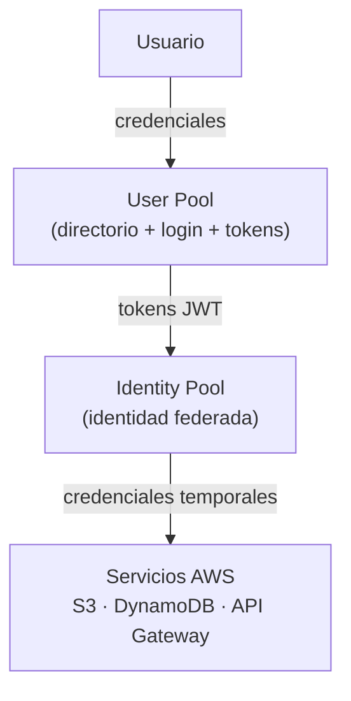

:::info Idea clave
Amazon Cognito = **User Pool** (autenticación: quién eres) + **Identity Pool** (acceso a AWS: qué puedes hacer). El User Pool emite tokens; el Identity Pool los intercambia por credenciales temporales de AWS.
:::

---

## 2. ¿Qué problema resuelve? ¿Por qué existe?

### 2.1 El problema de construir autenticación desde cero

Antes de Cognito (y de soluciones similares), añadir usuarios a una aplicación implicaba escribir y mantener todo el sistema de identidad. Cada una de estas tareas es en sí misma un proyecto:

| Tarea | Qué implica hacerla a mano |
|---|---|
| **Almacenar contraseñas** | Hash con sal (bcrypt/argon2), protección contra fuerza bruta, rotación. Un error aquí expone todas las cuentas. |
| **Gestionar sesiones** | Tokens, expiración, cierre de sesión, revocación en todos los dispositivos. |
| **Registro y confirmación** | Formularios, verificación de email/teléfono, prevención de cuentas falsas. |
| **Recuperación de contraseña** | Envío de enlaces/códigos, expiración, invalidación tras el cambio. |
| **MFA** | Generación de códigos TOTP, SMS, registro de dispositivos, recuperación de cuentas con MFA perdida. |
| **Login social** | Integración con cada proveedor, manejo de tokens de terceros, unificación de cuentas. |
| **Bloqueo de cuentas** | Detección de intentos fallidos, backoff, notificaciones. |
| **Escalabilidad y seguridad** | El sistema debe aguantar picos de registro/login y cumplir estándares de seguridad. |

Cada una de estas funciones es un punto de fallo de seguridad. Los atacantes atacan precisamente estos flujos: enumeración de usuarios, fuerza bruta, fuga de hashes, phishing con la recuperación de contraseña. **Cognito existe para no tener que escribir, auditar y mantener todo eso.**

### 2.2 Lo que aporta un servicio gestionado

Al delegar la identidad en Cognito, el equipo conserva el control de **lo que los usuarios pueden hacer** (a través de grupos, atributos y roles) y transfiere a AWS la responsabilidad operativa de **cómo se verifica la identidad**: almacenamiento seguro de contraseñas, emisión y validación de tokens, MFA, bloqueo de cuentas y escalado automático ante millones de usuarios.

Esto encaja con el **modelo de responsabilidad compartida**: AWS asegura la plataforma de Cognito (los centros de datos, el servicio, la infraestructura) y tu equipo asegura la configuración (políticas de contraseña, MFA obligatorio, permisos de los roles). Ver el documento [Modelo de Responsabilidad Compartida](/guide/fundamentals-cloud-computing/09-responsabilidad-compartida) para el contexto general.

### 2.3 ¿Cuándo utilizar Cognito?

| Señal | Por qué encaja |
|---|---|
| Tu aplicación web o móvil tiene **usuarios finales** que se registran e inician sesión. | Es el caso de uso principal de los User Pools. |
| Necesitas **login social** (Google, Facebook, Apple) o federación con un IdP corporativo. | Cognito integra proveedores OIDC y SAML. |
| Quieres **MFA, recuperación de contraseña y verificación de email** sin implementarlos. | Son funcionalidades integradas. |
| La aplicación debe **acceder a servicios AWS** (S3, DynamoDB, API Gateway) en nombre del usuario. | El Identity Pool entrega credenciales temporales. |
| Esperas un volumen de usuarios **impredecible o muy grande**. | Cognito escala automáticamente. |

| Señal de NO utilizarlo | Alternativa |
|---|---|
| Solo necesitas gestionar identidades **internas** de tu cuenta AWS (tu equipo, tus servicios). | IAM (ver [IAM](/guide/aws/security/iam)). |
| Ya tienes un sistema corporativo de identidad (Active Directory, Okta) para empleados. | IAM Identity Center o federación SAML hacia Cognito. |
| Necesitas un flujo de autenticación **extremadamente personalizado** que escape a lo configurable. | Lambda triggers (avanzado) u otra solución de identidad. |

:::info Idea clave
Cognito existe porque la autenticación es difícil, repetitiva y de alto riesgo. Al usarlo dejas de implementar y parchear funciones de seguridad estándar y te centras en las reglas de negocio de tu aplicación.
:::

---

## 3. Conceptos fundamentales: autenticación y autorización

Antes de entrar en los componentes de Cognito, conviene fijar los conceptos de identidad sobre los que se apoya. La confusión entre ellos es la causa de la mayoría de los errores de seguridad en aplicaciones.

### 3.1 Identidad, credenciales y verificación

- **Identidad**: un actor con características propias. Puede ser una persona (Ana), pero también una máquina o un servicio. Cognito modela identidades de usuarios finales.
- **Credencial**: la prueba que presenta una identidad para demostrar que es quien dice ser. Ejemplos: email + contraseña, un código MFA, un token.
- **Verificación**: el proceso de comprobar que las credenciales son válidas. Cuando Cognito verifica una contraseña o un código MFA, está **autenticando**.
- **Claim**: una afirmación sobre la identidad ("email = ana@correo.com", "rol = admin"). Los claims viajan dentro de los tokens.

### 3.2 Autenticación vs Autorización

| Concepto | Autenticación | Autorización |
|---|---|---|
| Pregunta | **¿Quién eres?** | **¿Qué puedes hacer?** |
| Objetivo | Probar la identidad | Decidir permisos sobre recursos |
| Orden temporal | Primero | Después de autenticar |
| Dónde ocurre en Cognito | User Pool | Identity Pool / tokens + políticas |
| Token asociado | ID Token (identidad) | Access Token (permisos) |
| Ejemplo | Ana introduce su contraseña | Ana puede leer `GET /api/pedidos` y escribir en el bucket `s3://mis-docs` |

Una regla sencilla: **primero se autentica, después se autoriza**. Un sistema puede autenticar a alguien y aun así denegarle todo acceso (identidad verificada, permisos nulos). Confundir ambos pasos produce aplicaciones en las que "estar logueado" equivale a "poder hacerlo todo".

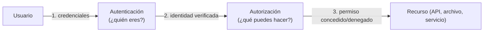

:::tip Analogía: el aeropuerto
Pasar el control de pasaportes es **autenticación**: verificas que eres tú. Entrar en la sala VIP es **autorización**: una verificación posterior que consulta si tu billete te da derecho a esa zona. Tener un pasaporte válido no te garantiza acceso a la sala VIP.
:::

### 3.3 Identity Provider (IdP)

Un **Identity Provider (IdP)** es un servicio que **autentica a los usuarios** y emite una declaración verificable sobre ellos (un token). Google, Facebook y Cognito son IdPs. Cuando una aplicación delega la autenticación en un IdP, no almacena contraseñas: recibe del IdP la confirmación de quién es el usuario. Cognito actúa como IdP propio (para usuarios de su User Pool) y como **intermediario** (proxy) de IdPs externos en el login social.

### 3.4 Token y claims

Un **token** es el vehículo de la identidad verificada. Cognito emite **tokens JWT** firmados: la aplicación o el backend pueden confiar en su contenido sin preguntar a Cognito cada vez, porque la firma demuestra que el token fue emitido por Cognito y no fue alterado. Los **claims** del token (email, `sub`, grupos) son los datos que el backend usa para autorizar. En la sección de tokens se detallan sus tipos y usos.

> **Nota**: en el contexto AWS, el punto donde se valida la identidad y se decide el acceso está repartido: Cognito autentica usuarios finales, IAM autoriza el acceso a servicios AWS, y el API Gateway valida tokens en el borde de tus APIs. Ver [API Gateway](/guide/fundamentals-cloud-computing/api-gateway) (sección de autenticación y autorización) e [IAM](/guide/aws/security/iam) para profundizar en cada pieza.

:::info Idea clave
La identidad tiene tres piezas: **quién eres** (identidad), **qué pruebas presentas** (credenciales) y **qué se te permite** (autorización). Cognito autentica con el User Pool y materializa la autorización mediante tokens, grupos y, para servicios AWS, con el Identity Pool.
:::

---

## 4. User Pool vs Identity Pool: las dos caras de Cognito

Como ambos componentes se llaman "pool", es el punto donde más se confunden los conceptos. La tabla resume las diferencias:

| Aspecto | User Pool | Identity Pool |
|---|---|---|
| Rol principal | **Autenticación** (¿quién eres?) | **Autorización en AWS** (¿qué servicios puedes usar?) |
| Qué contiene | Directorio de usuarios, contraseñas, atributos, grupos, MFA | Catálogo de identidades federadas |
| Qué emite | Tokens JWT (ID, Access, Refresh) | Credenciales temporales de AWS (AccessKey + SecretKey + SessionToken) |
| Con quién se integra | La aplicación, IdPs sociales, OIDC/SAML | IAM (roles), STS, servicios AWS (S3, DynamoDB...) |
| Puede usarse solo | Sí (solo login y APIs propias) | Sí (por ejemplo, para usuarios anónimos o federados) |
| Se suele usar combinado | El User Pool alimenta al Identity Pool | El Identity Pool consume los tokens del User Pool |

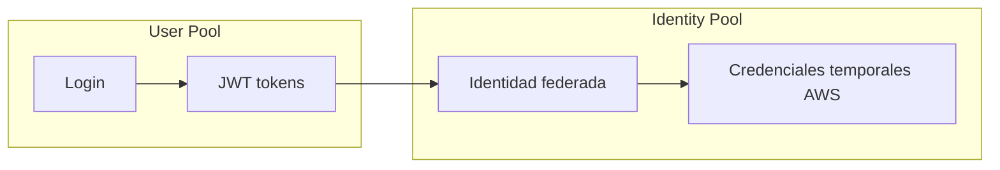

La regla práctica: si solo necesitas que tus usuarios **inicien sesión en tu aplicación**, un User Pool basta. Si además necesitan **acceder a servicios de AWS** (subir un archivo a S3, escribir en DynamoDB), conectas un Identity Pool que intercambie los tokens del User Pool por credenciales temporales.

:::info Idea clave
User Pool = **identidad de tu aplicación**. Identity Pool = **identidad dentro de AWS**. El User Pool responde "¿quién es este usuario?"; el Identity Pool responde "¿qué credenciales de AWS puede usar?".
:::

---

## 5. Amazon Cognito User Pools

### 5.1 Qué es y para qué sirve

Un **User Pool** es un **directorio de usuarios gestionado** para aplicaciones web y móviles. Desde el punto de vista de tu aplicación es un proveedor de identidad **OpenID Connect (OIDC)**: guarda a los usuarios y sus atributos, ejecuta los flujos de registro, inicio de sesión, MFA y recuperación de contraseña, y emite tokens JWT al final de un login exitoso.

Para qué sirve concretamente:

- **Registrar usuarios** (auto-registro o creación solo por administrador).
- **Autenticar** con email/contraseña, nombre de usuario, SMS/email OTP o passkeys.
- **Gestionar atributos**: email, teléfono, nombre, dirección y atributos personalizados (`custom:*`).
- **Agrupar usuarios** para aplicar permisos por grupos.
- **Federar** con IdPs externos (Google, Facebook, Apple, SAML, OIDC).
- **Emitir tokens** firmados para que el resto de tu sistema confíe en la identidad.

### 5.2 Usuarios y atributos

Cada usuario del User Pool tiene un identificador estable llamado **`sub`** (un UUID), un **nombre de usuario** (normalmente el email, configurable) y un conjunto de **atributos**. Los atributos se dividen en:

- **Estándar**: `email`, `phone_number`, `name`, `preferred_username`, `address`, etc. Algunos tienen un par de verificación (`email_verified`, `phone_number_verified`).
- **Personalizados**: se definen con el prefijo `custom:` (por ejemplo `custom:department`). Son útiles para datos propios de la aplicación.

Los atributos son los **claims** que viajarán en el ID Token: cuando el backend recibe el token, lee ahí los datos del usuario. Es importante no guardar en atributos datos confidenciales que no deban salir en cada token.

### 5.3 Grupos

Un **grupo** es una colección de usuarios que comparte un significado de autorización (por ejemplo `admin`, `cliente`, `editor`). Los grupos simplifican la gestión de permisos:

- En el **Access Token** aparece el claim `cognito:groups`, que el backend o el API Gateway pueden usar para autorizar (¿este usuario pertenece al grupo `admin`?).
- En un **Identity Pool**, los grupos pueden **mapearse a roles IAM** distintos: un `admin` recibe un rol con más permisos que un `cliente`.

Los grupos equivalen conceptualmente a los grupos IAM, pero operan en planos distintos: los grupos Cognito pertenecen a la aplicación; los grupos IAM, a la cuenta AWS. Ver [IAM](/guide/aws/security/iam).

### 5.4 Registro (sign-up)

El registro tiene un patrón estándar: **crear la cuenta → confirmar la identidad → usar la cuenta**. La confirmación evita cuentas con emails o teléfonos falsos.

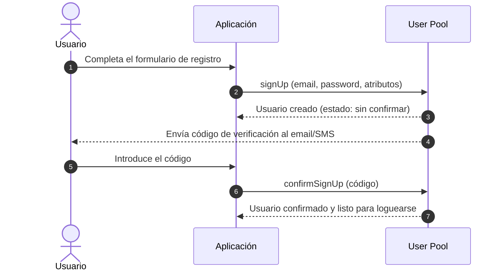

Detalles importantes del flujo:

- El **User Pool puede enviar el código de verificación automáticamente** (email/SMS) o delegar el envío a un Lambda trigger (`CustomMessage`) para personalizarlo.
- La **auto-confirmación** se puede habilitar o deshabilitar: hay aplicaciones que requieren aprobación manual o una verificación posterior.
- Si el registro es solo vía administrador (sin auto-registro), el administrador crea al usuario y Cognito envía una invitación con contraseña temporal.

### 5.5 Inicio de sesión (sign-in)

En el login, la aplicación envía las credenciales al User Pool; si son válidas (y el MFA se supera), Cognito responde con los **tres tokens**: ID Token, Access Token y Refresh Token.

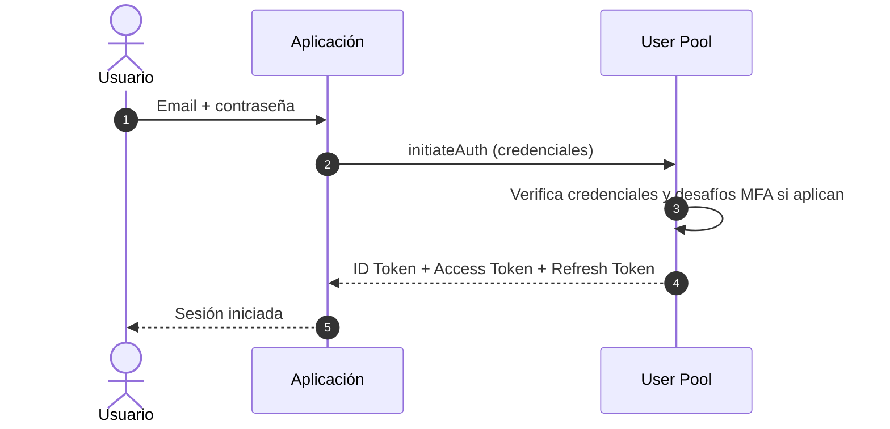

El protocolo recomendado entre la app y el User Pool se llama **SRP (Secure Remote Password)**: permite demostrar el conocimiento de la contraseña sin enviarla por la red (ni a Cognito), de modo que la contraseña nunca viaja en claro. La aplicación solo recibe y guarda los **tokens**, nunca la contraseña.

### 5.6 Políticas de contraseña (password policies)

El User Pool permite definir reglas de complejidad de contraseña: longitud mínima, necesidad de mayúsculas/minúsculas, números y símbolos. Puedes aplicar distintas políticas a distintos **clientes de app** de un mismo pool. Una política robusta reduce el riesgo de fuerza bruta y de relleno de credenciales, pero debe equilibrarse con la experiencia de usuario y combinarse siempre con MFA.

### 5.7 MFA (autenticación multifactor)

Cognito soporta **MFA** pidiendo un segundo factor además de la contraseña:

- **TOTP (Time-based One-Time Password)**: código de seis dígitos generado por una app autenticadora (Google Authenticator, Authy). Es el método recomendado.
- **SMS**: código enviado por mensaje de texto. Fácil de usar pero más vulnerable (interceptación del SMS, coste, dependencia de la red móvil).

El MFA puede ser **opcional** (cada usuario lo activa), **obligatorio** para todos, o usarse como **MFA adaptativo** con las funciones avanzadas de seguridad (que evalúan el riesgo de cada login). Además de la contraseña, Cognito permite flujos **sin contraseña** con OTP por email/SMS y **passkeys (WebAuthn)**, ideales para reducir la dependencia de contraseñas.

### 5.8 Recuperación de contraseña

El flujo de recuperación permite al usuario restablecer una contraseña olvidada sin la asistencia de un administrador:

1. El usuario solicita la recuperación desde la aplicación.
2. Cognito envía un **código de verificación** al email o teléfono confirmado (se configura qué vía es válida y su prioridad).
3. El usuario entrega el código y la nueva contraseña.
4. Cognito valida el código, aplica la política de contraseñas y actualiza la credencial.

Es importante elegir bien el **canal de recuperación**: si solo se valida por email y el email está comprometido, la cuenta también lo está. La recuperación se puede combinar con MFA y con las funciones avanzadas de seguridad.

### 5.9 Verificación de email y teléfono

Cognito puede **verificar automáticamente** el email o el teléfono de un usuario en el registro, enviando un código que el usuario debe introducir. La verificación se refleja en los atributos `email_verified` y `phone_number_verified`. Estos atributos son la base de los flujos de recuperación de contraseña y de los envíos de códigos: un email o teléfono **no verificado** no debería ser canal válido para recuperar una cuenta.

### 5.10 Federated Identity Providers y social login

La **federación de identidad** permite a los usuarios autenticarse con una identidad **que ya poseen** en otro proveedor, en lugar de crear una cuenta nueva. En el **social login** típico, Cognito delega la autenticación al IdP externo y actúa como intermediario:

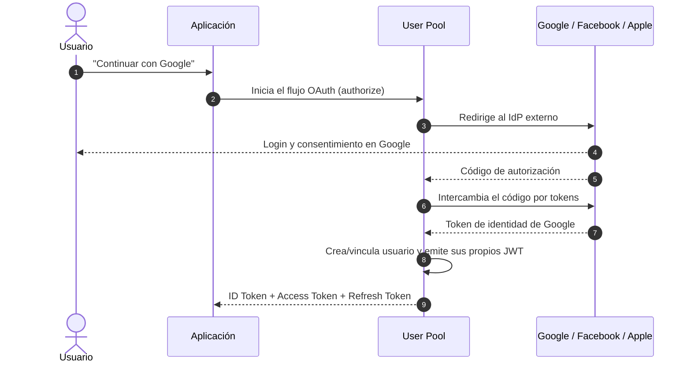

Después del flujo, **la aplicación solo ve los tokens de Cognito**, no los de Google: Cognito traduce la identidad externa a una identidad propia del User Pool. La cuenta de Google queda **vinculada** al perfil de Cognito (se puede permitir vincular varias identidades a un mismo usuario).

Además de los proveedores sociales, el User Pool acepta **IdPs SAML** (habituales en entornos corporativos con Active Directory) y **proveedores OIDC** personalizados, mediante la configuración de federación.

### 5.11 Tokens emitidos por el User Pool

Al final de un login exitoso, el User Pool emite tres tokens JWT: **ID Token**, **Access Token** y **Refresh Token**. Son la moneda de cambio de toda la autenticación posterior y se explican en detalle en la sección [Tokens de Cognito](#7-tokens-de-cognito-id-access-y-refresh).

### 5.12 Personalización: Lambda triggers y Hosted UI

- **Lambda triggers**: funciones que Cognito invoca en puntos del ciclo de vida (registro, login, confirmación, emisión de tokens) para personalizar el comportamiento: validar datos de registro, enriquecer el token con claims, migrar usuarios de otro sistema o enviar mensajes personalizados.
- **Hosted UI / Managed Login**: páginas de login y registro preconstruidas y alojadas por Cognito, personalizables en aspecto y marca, para no construir el frontend de autenticación desde cero.

> **Nota**: la configuración técnica detallada (CLI, SDK, triggers, Hosted UI) se encuentra en la [Guía técnica de Amazon Cognito](/guide/aws/security/cognito). Este documento se centra en los conceptos.

:::info Idea clave
El User Pool es el "banco de identidades" de tu aplicación: gestiona registro, login, contraseñas, MFA, recuperación, verificación de contacto y federación social, y entrega tokens JWT al terminar. Los grupos y atributos son las palancas de autorización que la aplicación consume a través de los tokens.
:::

---

## 6. Amazon Cognito Identity Pools

### 6.1 Qué es y para qué sirve

Un **Identity Pool** es un **catálogo de identidades federadas** que la aplicación intercambia por **credenciales temporales de AWS**. Mientras el User Pool responde "¿quién es este usuario?", el Identity Pool responde "¿qué permisos de AWS se le dan?".

Sirve para que una aplicación acceda a servicios de AWS **en nombre del usuario final**, sin crear cuentas IAM para cada usuario (algo inviable a gran escala) y sin guardar claves AWS permanentes en el cliente (un riesgo de seguridad inaceptable).

### 6.2 Identidades autenticadas y no autenticadas

Un Identity Pool distingue dos tipos de identidad:

| Tipo | Qué significa | Ejemplo de uso |
|---|---|---|
| **Autenticada** | El usuario demostró su identidad (User Pool, Google, Facebook, SAML, OIDC) | Subir su avatar a S3, leer sus datos de DynamoDB |
| **No autenticada (invitado)** | El usuario no inició sesión; se le da una identidad anónima temporal | Navegar el catálogo público, cargar una vista previa |

Cada tipo se asocia a un **rol IAM distinto**: el rol de invitado debe tener permisos mínimos (solo lectura de lo público), y el de autenticado, permisos para lo propio del usuario. La distinción autenticado/invitado es un punto de seguridad frecuente: un invitado nunca debe heredar permisos de autenticado.

### 6.3 Integración con IAM

La autorización final sobre servicios AWS la ejecuta **IAM**, no Cognito. El Identity Pool actúa como puente: selecciona un **rol IAM** según la identidad (autenticada/no autenticada, grupo, atributos) y entrega las credenciales de ese rol.

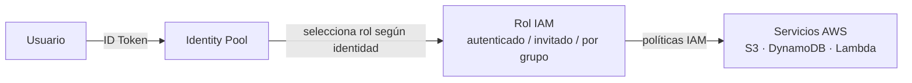

El **rol IAM** define los permisos con sus políticas (qué acciones y sobre qué recursos). El Identity Pool establece con el rol una **relación de confianza (trust policy)** que autoriza a Cognito a asumir ese rol en nombre del usuario. Ver [IAM](/guide/aws/security/iam) para el funcionamiento de roles, políticas y el principio de mínimo privilegio.

### 6.4 Cómo se emiten las credenciales temporales

Las credenciales temporales las produce **AWS STS (Security Token Service)**, el servicio de AWS para emitir credenciales de corta duración:

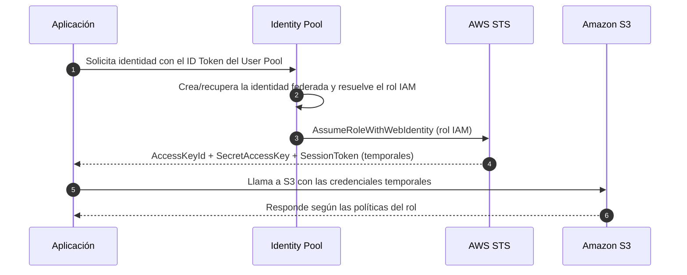

Lo relevante del flujo:

- Las credenciales son **temporales**: expiran (habitualmente entre 1 y 12 horas, configurable) y se renuevan automáticamente.
- El cliente **nunca guarda claves permanentes**: cada sesión pide credenciales nuevas.
- La app no necesita saber qué permisos tiene: los servicios AWS evalúan las políticas del rol en cada llamada.
- Si el usuario cambia de grupo o se le revoca el acceso, la nueva petición de credenciales refleja el cambio (las credenciales ya emitidas expiran por sí solas).

### 6.5 Resolución de roles

Además del par básico autenticado/invitado, el Identity Pool permite **reglas de resolución de roles** por claim: por ejemplo, si `cognito:groups` contiene `admin`, se asume un rol con más permisos. Es una forma de autorización basada en la identidad sin tocar el backend.

:::info Idea clave
El Identity Pool es el puente entre la identidad de la aplicación y la autorización de AWS: cambia tokens por **credenciales temporales** emitidas por STS mediante **roles IAM**, distinguiendo usuarios autenticados e invitados. Con él, el cliente accede a S3, DynamoDB u otros servicios sin guardar nunca claves permanentes.
:::

---

## 7. Tokens de Cognito: ID, Access y Refresh

### 7.1 Qué es un JWT

Un **JWT (JSON Web Token)** es un token firmado formado por tres partes codificadas en Base64URL separadas por puntos: **header** (algoritmo de firma), **payload** (los claims) y **firma** (que garantiza que el token no fue alterado). Cognito firma sus tokens con el algoritmo asimétrico **RS256**.

```txt
eyJhbGciOiJSUzI1NiJ9.eyJzdWIiOiIxMjM0NTY3ODkwIn0.XKd...firma
┌─────────────────┐ ┌───────────────────────────┐ ┌──────────────┐
│ Header          │ │ Payload (claims)          │ │ Firma        │
│ { "alg": "RS256"}│ │ { "sub": "...", ... }     │ │ (RS256)      │
└─────────────────┘ └───────────────────────────┘ └──────────────┘
```

Gracias a la firma, un backend puede **verificar el token sin llamar a Cognito**: descarga la clave pública (JWKS), comprueba la firma y la validez temporal, y confía en los claims.

### 7.2 ID Token

El **ID Token** responde a la pregunta **"¿quién es este usuario?"**. Contiene los claims de perfil: `sub` (identificador único), `email`, `email_verified`, `name`, `phone_number`, `cognito:username`, atributos personalizados, `auth_time`, `iss` (emisor) y `aud` (audiencia: el cliente de app). 

- Se consume en el **frontend** para mostrar quién está logueado y en el **backend** para conocer el perfil del usuario.
- Contiene información de identidad **legible**: por eso no debe incluir datos que no quieras exponer en cada llamada.
- Validez por defecto: **1 hora**.

### 7.3 Access Token

El **Access Token** responde a la pregunta **"¿qué puede hacer este usuario?"**. Contiene claims orientados a la autorización: `scope` (ámbitos OAuth solicitados), `client_id`, `username`, `cognito:groups`, y `token_use: access`. 

- Se envía en la cabecera `Authorization: Bearer <token>` en cada llamada a la API.
- El **API Gateway** lo valida con el authorizer de Cognito y entrega los claims al backend.
- Puede contener **ámbitos personalizados** (scopes) si se definen *resource servers* en el pool, para autorización fina por ámbito.
- Validez por defecto: **1 hora**.

### 7.4 Refresh Token

El **Refresh Token** es el token de larga duración (por defecto **30 días**) que permite obtener **nuevos tokens** cuando el Access Token caduca, sin pedir al usuario la contraseña otra vez.

- Es un token **opaco** (no es un JWT descifrable): la aplicación lo guarda y lo envía a Cognito en el flujo `REFRESH_TOKEN_AUTH`.
- Cada renovación devuelve un nuevo ID y Access Token; la sesión del usuario se mantiene sin fricción.
- Para reducir el riesgo si el token se filtra, Cognito soporta **rotación de refresh tokens** (cada renovación emite un refresh nuevo e invalida el anterior).

### 7.5 Tabla comparativa

| Token | Formato | Pregunta que responde | Quién lo usa | Validez por defecto |
|---|---|---|---|---|
| **ID Token** | JWT | ¿Quién es el usuario? | Frontend (perfil) y backend (identidad) | 1 hora |
| **Access Token** | JWT | ¿Qué puede hacer? | API Gateway y backend (autorización) | 1 hora |
| **Refresh Token** | Opaco | Renovar los otros tokens | La aplicación (en segundo plano) | 30 días |

> **Consejo**: el ID Token y el Access Token son JWT y se pueden validar en cualquier backend; el Refresh Token **solo** se usa contra Cognito. Nunca envíes el Refresh Token a tus propias APIs: es la llave para renovar la sesión y debe permanecer en el cliente.

### 7.6 Anatomía de un ID Token

```json
{
    "sub": "a1b2c3d4-e5f6-7890-abcd-ef1234567890",
    "email": "ana@correo.com",
    "email_verified": true,
    "name": "Ana García",
    "cognito:username": "ana@correo.com",
    "cognito:groups": ["cliente"],
    "custom:plan": "premium",
    "iss": "https://cognito-idp.us-east-1.amazonaws.com/us-east-1_XXXXX",
    "aud": "1234567890abcdef",
    "token_use": "id",
    "auth_time": 1710000000,
    "iat": 1710000000,
    "exp": 1710003600
}
```

### 7.7 Cómo valida el backend un token

Cualquier backend (Lambda, un servidor NestJS, etc.) puede validar un token de Cognito sin llamadas de red a AWS:

1. Extrae el token de la cabecera `Authorization: Bearer ...`.
2. Descarga las claves públicas del pool en el endpoint JWKS (`https://cognito-idp.<region>.amazonaws.com/<user-pool-id>/.well-known/jwks.json`).
3. Verifica la **firma**, el emisor `iss`, la audiencia `aud` (cliente de app) y la expiración `exp`.
4. Lee los claims para identificar y autorizar al usuario (`sub`, `cognito:groups`, scopes).

Este proceso está integrado en el API Gateway con el **authorizer de Cognito** (sección siguiente), de modo que tu Lambda recibe la petición ya validada con los claims del usuario en el contexto.

:::info Idea clave
Los tres tokens tienen roles distintos: el **ID Token** identifica, el **Access Token** autoriza y el **Refresh Token** renueva. Los JWT se verifican con claves públicas (JWKS) sin depender de Cognito en cada petición.
:::

---

## 8. Flujo completo de autenticación

### 8.1 El recorrido completo

Una petición típica recorre: **Usuario → Cognito → Tokens → Aplicación → API Gateway → Backend**.

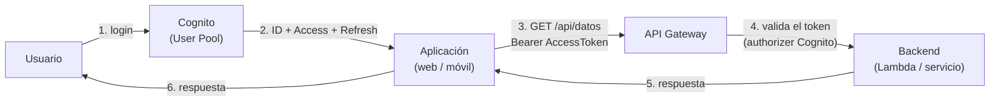

### 8.2 Qué ocurre cuando el usuario se registra

El usuario rellena el formulario. La aplicación llama a la API de sign-up del User Pool; Cognito crea el usuario en estado *no confirmado*, envía el código de verificación (email/SMS) y guarda las contraseñas con hash seguro en su directorio. Cuando el usuario introduce el código, Cognito confirma la cuenta y la deja lista para iniciar sesión. Hasta entonces, ningún token se emite y el usuario no puede autenticarse.

### 8.3 Qué ocurre cuando inicia sesión

La aplicación llama a `initiateAuth` con las credenciales (idealmente vía SRP). Cognito valida la contraseña, comprueba si el usuario está confirmado y si aplica MFA (si está activo, devuelve el desafío y espera el código). Tras superar todos los desafíos, Cognito emite el trío de tokens. La aplicación guarda el Refresh Token y mantiene el ID y Access Token en memoria.

### 8.4 Qué ocurre cuando obtiene sus tokens

Con los tokens en mano, la aplicación ya tiene identidad verificada. El ID Token le dice quién es el usuario; el Access Token le da derecho a llamar a las APIs autorizadas. Cuando el Access Token expira (típicamente a la hora), la aplicación usa el Refresh Token para pedir un trío nuevo sin molestar al usuario con otro login. Las llamadas que reciben un token expirado responden con `401 Unauthorized`.

### 8.5 Qué ocurre cuando accede a una API

La aplicación envía `Authorization: Bearer <Access Token>` en cada petición al API Gateway. El Gateway valida el token (firma, expiración, audiencia) mediante el **authorizer de Cognito** y, si es válido, reenvía la petición al backend con los claims del usuario (por ejemplo `sub`, `email`, `cognito:groups`). El backend autoriza sobre esos claims: ¿el usuario tiene el grupo que permite esta acción? Si el token no es válido o el usuario no tiene permiso, la respuesta es `401` o `403`.

### 8.6 Qué ocurre cuando obtiene permisos para recursos AWS

Cuando la aplicación necesita acceder a un servicio AWS (subir un archivo a S3, por ejemplo), la secuencia es: **Usuario → Cognito → Identity Pool → IAM → Servicio AWS**.

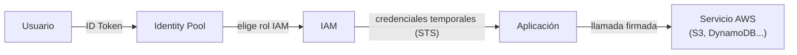

La aplicación intercambia el ID Token (o el Access Token) por credenciales temporales del rol asociado, y usa esas credenciales para llamar al servicio. El servicio evalúa las políticas del rol y concede o deniega la operación. Todo esto ocurre sin que la aplicación conozca secretos permanentes.

:::info Idea clave
El flujo de identidad tiene dos ramas: **hacia tus APIs** (Access Token validado por el API Gateway) y **hacia AWS** (ID Token intercambiado por credenciales temporales vía Identity Pool e IAM). Entender cuándo se usa cada rama es la clave para diseñar bien la autenticación.
:::

---

## 9. Integración con aplicaciones frontend y backend

### 9.1 Frontend: SDK y Hosted UI

En el cliente, la integración se hace normalmente con el **SDK Amplify** (JavaScript, React Native, iOS, Android), que encapsula los flujos de registro, login, MFA y renovación de tokens:

```js
// Ejemplo con AWS Amplify (frontend)
import { signIn, signUp, confirmSignUp } from 'aws-amplify/auth';

const { isSignedIn } = await signIn({ username: email, password });
// Amplify guarda y renueva los tokens automáticamente

await signUp({
    username: email,
    password,
    options: { userAttributes: { email, name: 'Ana García' } },
});
await confirmSignUp({ username: email, confirmationCode: codigo });
```

Para no construir la interfaz de login, Cognito ofrece el **Hosted UI (Managed Login)**: páginas alojadas por AWS, personalizables en marca, que implementan registro, login, MFA y recuperación. La app redirige al usuario al dominio de Cognito y recibe los tokens de vuelta mediante el flujo OAuth.

> **Nota**: el secreto de cliente de un app client **nunca debe ir en el frontend**. Las aplicaciones públicas (web y móvil) se configuran **sin secreto**, usando SRP o flujos de código de autorización con PKCE.

### 9.2 Backend: validación de tokens

El backend confía en los tokens, no en la sesión del frontend. Cada petición trae el Access Token y el backend (o el API Gateway antes de él) verifica la firma, la expiración y la audiencia. Tras la validación, usa los claims para:

- Identificar al usuario (`sub`).
- Comprobar pertenencia a grupos (`cognito:groups`).
- Aplicar autorización por recurso y por ámbito (scopes).

Si el backend necesita datos del usuario no presentes en el token, puede llamar a la API de Cognito `AdminGetUser` (solo desde servidor, con credenciales de la cuenta AWS).

:::info Idea clave
En el frontend, Amplify o el Hosted UI absorben la complejidad de los flujos. En el backend, la regla es clara: **nunca confíes en la sesión del cliente, valida el token** en cada petición.
:::

---

## 10. Integración con API Gateway y Lambda

### 10.1 El authorizer de Cognito

El **API Gateway** puede validar los tokens de Cognito de forma nativa con un **authorizer de tipo `COGNITO_USER_POOLS`**: el Gateway verifica la firma y la expiración del token de cada petición y, si es válido, pasa los claims al backend. De este modo la validación ocurre **en el borde**, antes de invocar tu Lambda, tal como recomienda el documento de [API Gateway](/guide/fundamentals-cloud-computing/api-gateway) (autenticación y autorización centralizadas en el Gateway).

### 10.2 Flujo con Lambda

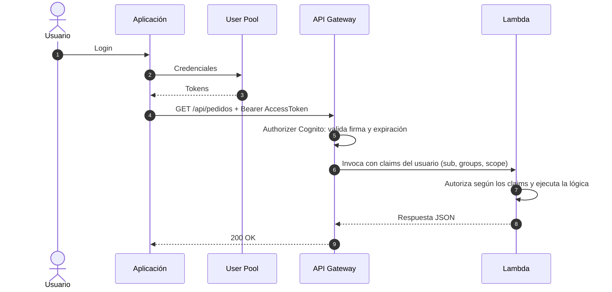

Consideraciones de diseño:

- El authorizer de Cognito **valida** el token, pero la **autorización fina** (¿puede este grupo ejecutar esta acción?) puede hacerse en el propio Gateway (recursos protegidos por grupo) o en la Lambda leyendo `cognito:groups`.
- Para lógica de autorización más compleja, el API Gateway ofrece **Lambda authorizers** personalizados que devuelven políticas IAM de acceso por petición (ver la [Guía técnica de Amazon Cognito](/guide/aws/security/cognito)).
- Combinar el authorizer con **rate limiting** y control de tráfico del Gateway protege las funciones de abuso (ver [API Gateway](/guide/fundamentals-cloud-computing/api-gateway)).

:::info Idea clave
Con el authorizer de Cognito, la validación de tokens se centraliza en el API Gateway: tu Lambda recibe peticiones ya autenticadas, con los claims del usuario en el contexto, y solo tiene que ocuparse de la lógica y de la autorización fina.
:::

---

## 11. Integración con IAM

### 11.1 Roles y relación de confianza

La integración con IAM se produce a través del **Identity Pool**: este asume un **rol IAM** en nombre del usuario y le entrega credenciales temporales. El rol tiene dos partes:

- **Trust policy**: declara quién puede asumir el rol. Para el Identity Pool, el principal de confianza es `cognito-identity.amazonaws.com`, de modo que el pool puede asumir el rol por el usuario.
- **Políticas de permisos**: las acciones y recursos permitidos (por ejemplo, `s3:PutObject` sobre `arn:aws:s3:::mi-bucket/${cognito-identity.amazonaws.com:sub}/*`).

```json
{
    "Version": "2012-10-17",
    "Statement": [
        {
            "Sid": "AccesoDelUsuarioASusArchivos",
            "Effect": "Allow",
            "Action": ["s3:GetObject", "s3:PutObject"],
            "Resource": "arn:aws:s3:::mi-bucket/${cognito-identity.amazonaws.com:sub}/*"
        }
    ]
}
```

En el ejemplo, el permiso se restringe al prefijo del bucket que coincide con el `sub` del usuario: cada usuario solo toca sus propios archivos. Es una aplicación directa del **principio de mínimo privilegio** (ver [IAM](/guide/aws/security/iam)).

### 11.2 Reglas para un diseño seguro

- Usa **roles distintos** para autenticados y para invitados, con permisos mínimos en ambos.
- **Acota los recursos** en las políticas (nunca `"Resource": "*"` sin necesidad).
- **Aísla por usuario** usando claims del contexto (`${cognito-identity.amazonaws.com:sub}`) en las políticas de recursos.
- No des a Cognito más permisos que los estrictamente necesarios; el Identity Pool solo necesita `cognito-identity:*` sobre su propio pool.

:::info Idea clave
Cognito e IAM se complementan: **Cognito autentica al usuario final**, **IAM define sus permisos**. El Identity Pool une ambos mundos asumiendo un rol IAM y entregando credenciales temporales limitadas a los recursos que ese usuario debe tocar.
:::

---

## 12. OAuth 2.0 y OpenID Connect en el contexto de Cognito

### 12.1 OAuth 2.0

**OAuth 2.0** es un estándar de **autorización** que permite a una aplicación acceder a recursos de un usuario sin recibir sus contraseñas. Introduce roles: el **resource owner** (usuario), el **client** (la aplicación), el **resource server** (el servicio que guarda los datos) y el **authorization server** (quien emite tokens). OAuth define **scopes** (ámbitos) que acotan lo que el cliente puede hacer, y varios **flujos (grants)** para obtener el token.

En el contexto de Cognito, el User Pool actúa como **authorization server**: emite Access Tokens con scopes para que la aplicación acceda a tus APIs.

### 12.2 OpenID Connect (OIDC)

**OpenID Connect (OIDC)** construye autenticación sobre OAuth 2.0 añadiendo el **ID Token**: además de un Access Token, el IdP entrega una identidad verificada del usuario. OIDC introduce el **Relying Party** (la aplicación que confía) y el **OpenID Provider** (quien autentica). Cognito es un **OpenID Provider**: expone un endpoint de *discovery* (`/.well-known/openid-configuration`) con los datos de los endpoints y las claves públicas.

Regla mnemotécnica: **OAuth 2.0 = autorización; OIDC = autenticación construida sobre OAuth 2.0**.

### 12.3 Flujos y scopes

| Concepto | Descripción |
|---|---|
| **Authorization code** | Flujo recomendado para apps web: el cliente intercambia un código por tokens; con PKCE es seguro también en apps móviles y SPA. |
| **Client credentials** | Flujo máquina a máquina (M2M): un servicio obtiene un Access Token para llamar a APIs sin usuario intermedio. |
| **Scopes** | Ámbitos solicitados: `openid` (obtener ID Token), `email`, `profile`, `phone`, y scopes personalizados de resource servers. |
| **Discovery** | Endpoint que publica configuración y claves: `https://cognito-idp.<region>.amazonaws.com/<user-pool-id>/.well-known/openid-configuration`. |

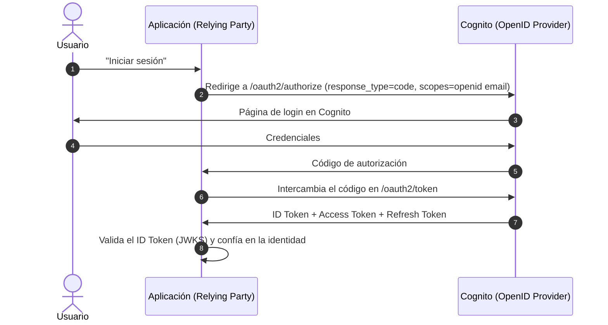

> **Nota**: el documento [API Gateway](/guide/fundamentals-cloud-computing/api-gateway) ya introduce OAuth2/OIDC como mecanismos de autenticación en el borde; aquí se aplican al rol de Cognito como proveedor de identidad.

:::info Idea clave
Cognito implementa los estándares: es un **authorization server OAuth 2.0** (emite Access Tokens y scopes) y un **OpenID Provider** (emite el ID Token que autentica al usuario). El flujo de código de autorización con PKCE es el patrón recomendado para aplicaciones modernas.
:::

---

## 13. Ejemplos de arquitecturas comunes

### 13.1 App web/móvil con backend serverless

La arquitectura típica de una API protegida: Cognito autentica, el API Gateway valida y Lambda ejecuta la lógica.

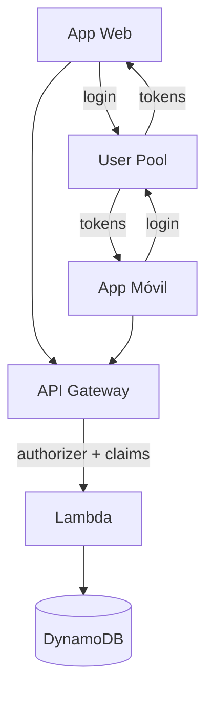

### 13.2 App con acceso directo a servicios AWS

Cuando el usuario sube archivos o necesita datos almacenados en AWS, el Identity Pool entrega credenciales temporales para S3 o DynamoDB sin pasar por un backend propio.

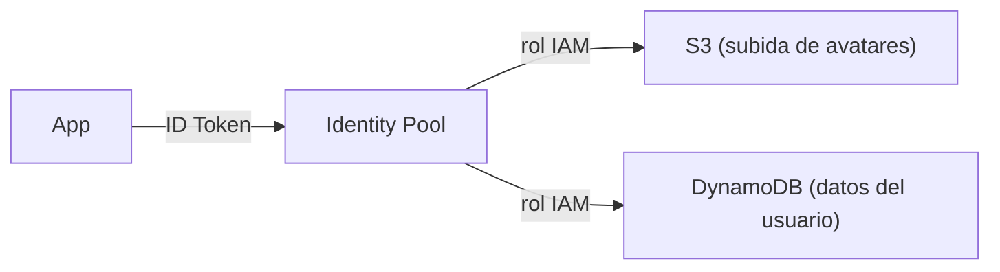

### 13.3 Aplicación empresarial con login social y SSO

Una plataforma SaaS combina usuario propio (email/contraseña), login con Google y acceso corporativo vía SAML (Active Directory). Todos los flujos terminan en el mismo User Pool, que emite tokens unificados para el resto del sistema. Para empleados que gestionan la infraestructura AWS, se usa IAM Identity Center (no Cognito).

:::info Idea clave
Tres arquitecturas de referencia: **API serverless** (User Pool + API Gateway + Lambda), **acceso directo a AWS** (User Pool + Identity Pool + S3/DynamoDB) y **plataforma con múltiples IdPs** (federación unificada en un User Pool).
:::

---

## 14. Ventajas y desventajas

### 14.1 Ventajas

| Ventaja | Descripción |
|---|---|
| **Funcionalidades de seguridad integradas** | MFA, política de contraseñas, bloqueo de cuentas, verificación de contacto y recuperación de contraseña listas para usar. |
| **Escalado automático** | Absorbe millones de usuarios y picos de login sin aprovisionar infraestructura. |
| **Federación y social login** | Integración con Google, Facebook, Apple, SAML y OIDC sin escribir clientes OAuth. |
| **Integración nativa con AWS** | Tokens validados por API Gateway, credenciales temporales para S3/DynamoDB vía Identity Pool e IAM. |
| **Menos superficie de código propia** | El equipo no mantiene hashing, sesiones ni flujos de recuperación. |
| **Estándares abiertos** | JWT, OAuth 2.0 y OIDC facilitan integrarse con cualquier frontend o backend. |

### 14.2 Desventajas

| Desventaja | Mitigación |
|---|---|
| **Vendor lock-in** | Los estándares (OIDC/JWT) permiten migrar; la migración de usuarios requiere planificación. |
| **Complejidad de modelos** | Confundir User Pool e Identity Pool produce diseños incorrectos; requiere entender ambos. |
| **Costo variable** | Se cobra por usuarios activos mensuales (MAU) y actos de autenticación; a gran escala hay que presupuestarlo. |
| **Personalización limitada** | Flujos muy específicos requieren Lambda triggers o una solución propia. |
| **Dependencia de un punto de autenticación** | Si el servicio falla, el login se ve afectado; AWS ofrece alta disponibilidad regional. |

:::info Idea clave
Cognito compra **seguridad y velocidad de desarrollo** a cambio de **dependencia del servicio y coste por usuario**. El balance suele ser favorable para casi cualquier aplicación que necesite usuarios finales.
:::

---

## 15. Casos de uso reales

| Caso de uso | Cómo usa Cognito |
|---|---|
| **E-commerce** | Registro, login social, MFA en pagos, grupos para clientes/premium, acceso a su historial vía API Gateway. |
| **App de salud o banca** | MFA obligatorio, verificación de email/teléfono, recuperación segura y auditoría de acceso. |
| **Plataforma SaaS multi-tenant** | Un User Pool por aplicación (o con grupos por inquilino) y roles IAM por plan contratado. |
| **App con subida de archivos** | Identity Pool entrega credenciales temporales para que el usuario suba directamente a S3 sin pasar por el backend. |
| **Marketplace con federación** | Login con Apple/Google para clientes y SAML corporativo para vendedores, unificados en un mismo pool. |
| **Campañas con picos de usuarios** | El escalado automático aguanta oleadas de registro/login en lanzamientos. |

---

## 16. Buenas prácticas de seguridad

- **Habilita MFA** (preferiblemente TOTP) y considéralo obligatorio para cuentas sensibles o privilegiadas.
- **Aplica una política de contraseñas razonable** y combínala con MFA; una contraseña imposible sin MFA molesta al usuario sin ganar seguridad proporcional.
- **Configura el bloqueo de cuentas** ante intentos fallidos y usa las funciones avanzadas de seguridad (detección de riesgo) si tu presupuesto lo permite.
- **Nunca expongas el secreto del cliente en el frontend**: usa clientes públicos con SRP o Authorization Code + PKCE.
- **No guardes el Refresh Token en APIs propias**: debe vivir en el cliente y renovarse contra Cognito; activa la **rotación de refresh tokens**.
- **Usa grupos para la autorización** y valida `cognito:groups` en el backend o en el API Gateway, nunca solo en el frontend.
- **Aplica el mínimo privilegio en los roles IAM** del Identity Pool y aísla recursos por usuario (prefijos con `sub`).
- **Valida siempre los tokens en el backend**: no confíes en el `isSignedIn` del frontend; verifica firma, `iss`, `aud` y `exp`.
- **Elige bien el canal de recuperación** y los canales de verificación: un email sin verificar no debe servir para recuperar una cuenta.
- **Audita** los eventos de login/registro con CloudTrail y revisa los logs periódicamente.
- **Aísla entornos**: usa pools y clientes de app distintos para desarrollo, staging y producción.

---

## 17. Errores y conceptos que suelen confundirse

| Confusión | Aclaración |
|---|---|
| **User Pool = Identity Pool** | El primero autentica y emite tokens; el segundo cambia tokens por credenciales de AWS. Se usan juntos, pero son cosas distintas. |
| **Autenticación = autorización** | Autenticar prueba quién eres; autorizar decide qué puedes hacer. Ambos pasos son independientes. |
| **Un usuario Cognito es un usuario IAM** | No. Los usuarios del User Pool pertenecen a tu aplicación; los usuarios IAM a tu cuenta AWS. Solo el Identity Pool traduce unos a otros. |
| **ID Token para autorizar APIs** | El ID Token identifica. Para autorizar llamadas usa el Access Token (con scopes y grupos). |
| **Enviar el Refresh Token al backend propio** | El Refresh Token es la llave de renovación y solo se intercambia con Cognito; no debe ir en cada petición a tu API. |
| **Guardar la contraseña en el cliente** | La app solo guarda tokens. Con SRP, la contraseña ni siquiera viaja por la red. |
| **Confiar en el frontend para autorizar** | Cualquier cosa visible en el navegador es manipulable. La autorización se decide en el backend y en IAM. |
| **El Access Token vale para siempre** | Expira (1 hora por defecto). La aplicación lo renueva con el Refresh Token. |
| **`cognito:username` = `sub`** | `sub` es el identificador estable e inmutable; `cognito:username` puede variar (por ejemplo, si se usa el email como nombre de usuario). Usa `sub` como clave. |

---

## 18. Cognito vs autenticación tradicional implementada manualmente

| Aspecto | Autenticación manual | Cognito |
|---|---|---|
| Almacenamiento de contraseñas | Hash con sal implementado y auditado por tu equipo | Hash gestionado por AWS |
| Sesiones y tokens | Framework propio (expiración, renovación, revocación) | JWT estándar con renovación y rotación opcional |
| MFA | Integración manual con TOTP/SMS | Integrado, con configuración por pool |
| Login social | Cliente OAuth por cada proveedor | Federación configurable |
| Recuperación de contraseña | Flujo y envíos de correo propios | Integrado con verificación de contacto |
| Escalado | Servidores y bases de datos propios | Escalado automático gestionado |
| Seguridad | Responsable de cada detalle | AWS asegura la plataforma; tú la configuración |
| Personalización | Total (es tu código) | Limitada (Lambda triggers, managed login) |
| Coste | Horas de desarrollo y operación | Precio por MAU y actos de autenticación |

La decisión se reduce a **costo de desarrollo vs flexibilidad**: para la mayoría de las aplicaciones, las funciones estándar de Cognito cubren lo necesario y liberan recursos para el negocio. Una solución manual solo se justifica cuando los requisitos de identidad son tan específicos que exceden lo configurable.

---

## 19. Cognito vs otros proveedores de identidad

Comparación conceptual con los competidores más habituales (Auth0 y Firebase Authentication) para situar a Cognito, no como juicio de calidad sino de encaje:

| Aspecto | Amazon Cognito | Auth0 | Firebase Authentication |
|---|---|---|---|
| Proveedor | AWS | Okta (independiente) | Google |
| Modelo | Servicio AWS con free tier | SaaS con precios por usuario activo | Servicio de Firebase con free tier |
| Integración con AWS | Nativa (API Gateway, IAM, S3) | Vía estándares (OIDC/JWT), no nativa | Vía estándares, no nativa |
| User pools / directorio | Sí (User Pool) | Sí | Sí (más básico) |
| Login social y federación | Sí (OIDC/SAML) | Muy amplio | Sí (especialmente Google) |
| Acceso a servicios cloud propios | Credenciales temporales vía Identity Pool | No (requiere capa propia) | No (limitado) |
| Complejidad conceptual | Alta (dos pools) | Media | Baja |
| Cómo elegir | Ya estás en AWS y quieres integración nativa | Necesitas un IdP independiente del cloud | Ya usas el ecosistema Firebase/Google |

Los tres resuelven el mismo problema central —no implementar autenticación a mano— y comparten estándares (OAuth 2.0, OIDC, JWT) que facilitan cambiar de uno a otro. La ventaja diferencial de Cognito es su **integración nativa con el resto de AWS**: autorizers en API Gateway, Identity Pools para credenciales temporales y coherencia con el modelo IAM. La ventaja de Auth0 o Firebase es su madurez de producto independiente del proveedor cloud y, en el caso de Firebase, su ecosistema de desarrollo móvil.

---

## 20. Glosario de términos

| Término | Definición |
|---|---|
| **Cognito User Pool** | Directorio gestionado de usuarios finales con registro, login, MFA y emisión de tokens JWT. |
| **Cognito Identity Pool** | Catálogo de identidades federadas que intercambia tokens por credenciales temporales de AWS. |
| **Autenticación** | Verificar **quién** es el usuario mediante credenciales. |
| **Autorización** | Decidir **qué** puede hacer el usuario sobre los recursos. |
| **Identity Provider (IdP)** | Servicio que autentica y emite tokens de identidad (Cognito, Google, etc.). |
| **JWT** | Token firmado con claims, compuesto por header, payload y firma. |
| **ID Token** | Token de identidad del usuario (perfil, `sub`). |
| **Access Token** | Token de acceso a APIs con scopes y grupos. |
| **Refresh Token** | Token de larga duración para renovar ID y Access Tokens. |
| **Claim** | Afirmación sobre el usuario dentro de un token (email, grupos, `sub`). |
| **STS** | AWS Security Token Service: emite credenciales temporales al asumir un rol. |
| **Rol IAM** | Entidad con permisos que se asume para obtener credenciales temporales. |
| **SRP** | Protocolo de autenticación que no envía la contraseña por la red. |
| **MFA** | Autenticación multifactor: un segundo factor además de la contraseña. |
| **Federación** | Delegar la autenticación en un IdP externo y vincular su identidad. |
| **OAuth 2.0** | Estándar de autorización con scopes y flujos (authorization code, client credentials). |
| **OIDC** | Capa de identidad sobre OAuth 2.0 que añade el ID Token. |
| **JWKS** | Conjunto de claves públicas para validar la firma de los tokens. |
| **Hosted UI / Managed Login** | Páginas de login/registro alojadas y personalizables de Cognito. |
| **Lambda trigger** | Función que Cognito invoca para personalizar el ciclo de vida del usuario. |

---

## 21. Contenido relacionado

- [Guía técnica de Amazon Cognito](/guide/aws/security/cognito) — configuración detallada con AWS CLI, SDKs, Lambda triggers y Hosted UI.
- [IAM](/guide/aws/security/iam) — roles, políticas y el modelo de permisos de AWS.
- [API Gateway](/guide/fundamentals-cloud-computing/api-gateway) — validación de tokens en el borde y authorizers.
- [Serverless](/guide/fundamentals-cloud-computing/serverles) — Cognito como servicio BaaS dentro de arquitecturas serverless.
- [Modelo de Responsabilidad Compartida](/guide/fundamentals-cloud-computing/09-responsabilidad-compartida) — quién asegura qué en la nube.
