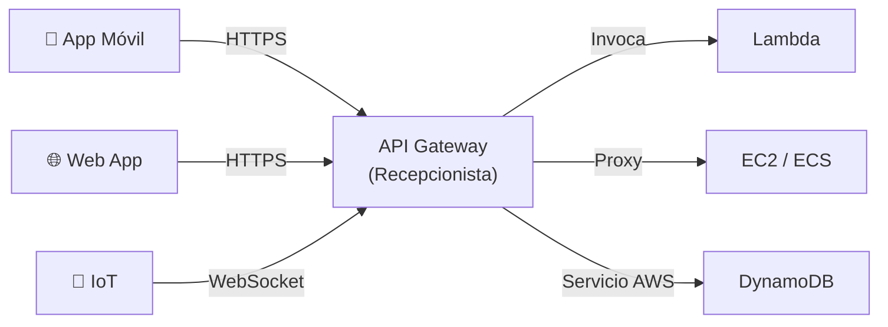
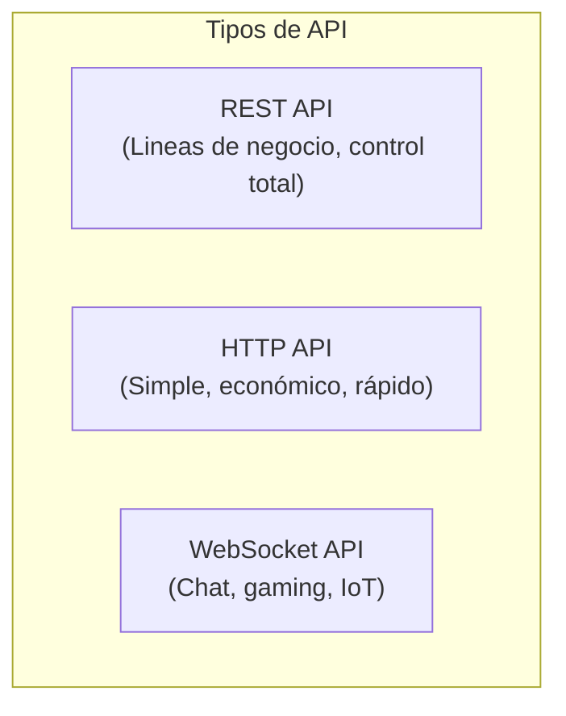
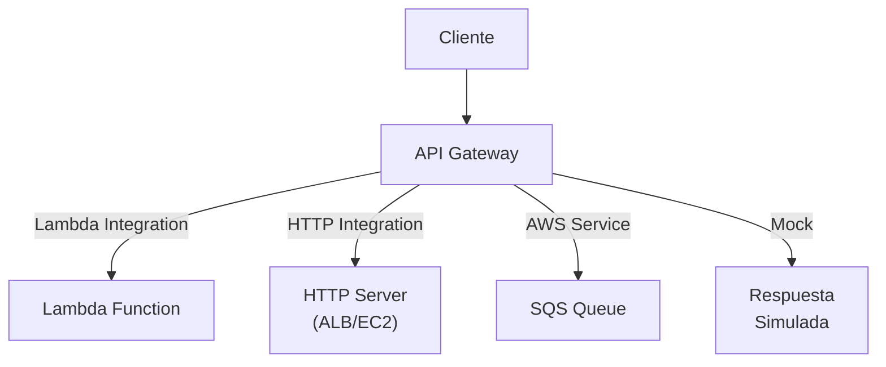
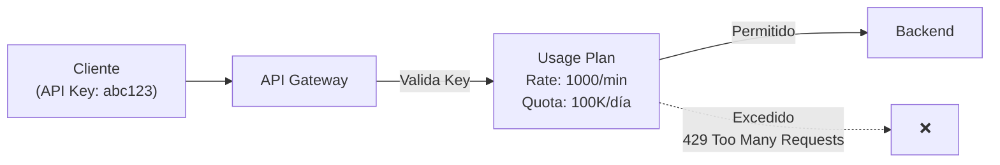
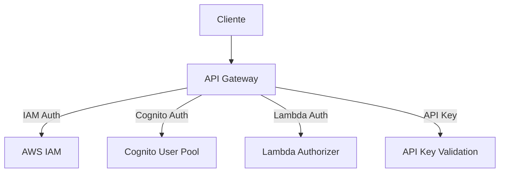
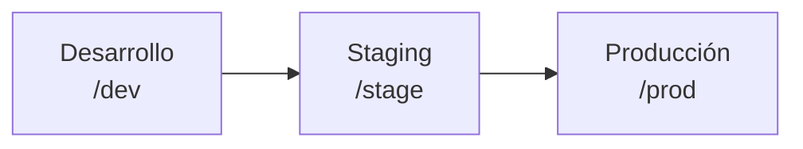
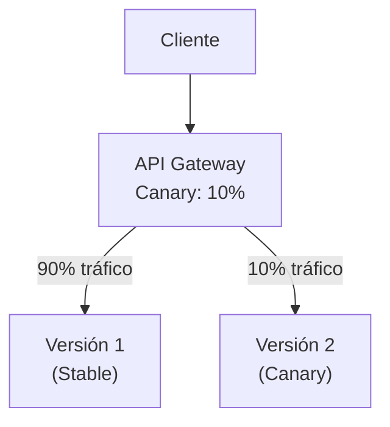

# Amazon API Gateway

## ¿Qué es API Gateway?

Imagina que tienes una oficina con muchas personas que ofrecen servicios diferentes (Lambda, EC2, bases de datos). En lugar de dar tu número personal a cada cliente, contratas un **recepcionista** que atiende todas las llamadas, valida quién eres, decide a quién transferir y cobra por el servicio. **Amazon API Gateway** es ese recepcionista para tus APIs: recibe solicitudes, las autentica, las enruta, las valida y las registra.



:::tip
API Gateway actúa como **puerta de entrada unificada** para todas tus APIs, eliminando la necesidad de gestionar múltiples endpoints.
:::

## REST API vs HTTP API vs WebSocket API

| Característica | REST API | HTTP API | WebSocket API |
|---|---|---|---|
| Capa | L7 HTTP | L7 HTTP | L7 WebSocket |
| Protocolo | HTTP/HTTPS | HTTP/HTTPS | WebSocket (full-duplex) |
| Costo | $3.50/millón | $1.00/millón | $1.00/millón + $0.25/millón de mensajes |
| Latencia | ~29ms | ~10ms | Variable |
| WAF | Sí | No | No |
| Caché | Sí | No | No |
| API Keys | Sí | No | Sí |
| Usage Plans | Sí | No | Sí |
| Canary Deployments | Sí | No | No |
| Request Validators | Sí | No | No |
| Custom Domains | Sí | Sí | Sí |
| Authorization | IAM, Cognito, Lambda | IAM, Cognito, JWT | IAM, Lambda |
| Uso típico | APIs empresariales | Microservicios simples | Chat, gaming, tiempo real |



```bash
# Crear REST API
aws apigateway create-rest-api \
  --name "Mi REST API" \
  --description "API para mi aplicación" \
  --endpoint-configuration types=REGIONAL

# Crear HTTP API
aws apigatewayv2 create-api \
  --name "Mi HTTP API" \
  --protocol-type HTTP

# Crear WebSocket API
aws apigatewayv2 create-api \
  --name "Mi WebSocket API" \
  --protocol-type WEBSOCKET \
  --route-selection-expression '$request.body.action'
```

## Recursos, Métodos e Integración

### Recursos

Un **recurso** es un punto de acceso en tu API (como una ruta URL):

```
GET  /users         → Listar usuarios
POST /users         → Crear usuario
GET  /users/{id}    → Obtener usuario
PUT  /users/{id}    → Actualizar usuario
DELETE /users/{id}  → Eliminar usuario
```

### Métodos HTTP

| Método | Propósito | Body | Idempotente |
|---|---|---|---|
| GET | Leer recurso | No | Sí |
| POST | Crear recurso | Sí | No |
| PUT | Actualizar/reemplazar | Sí | Sí |
| PATCH | Actualizar parcialmente | Sí | Sí |
| DELETE | Eliminar recurso | No | Sí |
| OPTIONS | CORS preflight | No | Sí |
| HEAD | Igual que GET sin body | No | Sí |

## Tipos de Integración

| Tipo | Descripción | Ejemplo |
|---|---|---|
| **Lambda** | Invoca una función Lambda | CRUD → Lambda → DynamoDB |
| **HTTP** | Proxy a servidor HTTP/HTTPS | API Gateway → ALB, EC2 |
| **AWS Service** | Llama directamente a un servicio AWS | API Gateway → SQS, S3 |
| **Mock** | Respuesta simulada (sin backend) | Testing, documentación |



### Lambda Integration

```bash
# Integrar Lambda con REST API
aws apigateway put-integration \
  --rest-api-id abc123 \
  --resource-id def456 \
  --http-method GET \
  --type AWS_PROXY \
  --integration-http-method POST \
  --uri arn:aws:apigateway:us-east-1:lambda:path/2015-03-31/functions/arn:aws:lambda:us-east-1:123456789012:function:MiFuncion/invocations

# HTTP API con Lambda
aws apigatewayv2 create-integration \
  --api-id abc123 \
  --integration-type AWS_PROXY \
  --integration-uri arn:aws:lambda:us-east-1:123456789012:function:MiFuncion \
  --payload-format-version 2.0
```

## Request/Response Mapping

**Mapping Templates** transforman la solicitud antes de llegar al backend y la respuesta antes de llegar al cliente.

```text
## Velocity Template: Transformar request
#set($inputRoot = $input.path('$'))
{
  "userId": "$inputRoot.userId",
  "timestamp": "$context.requestTime",
  "source": "$context.identity.userAgent"
}
```

## Usage Plans y API Keys

**Usage Plans** definen límites de velocidad y cuotas para clientes que consumen tu API.



```bash
# Crear Usage Plan
aws apigateway create-usage-plan \
  --name "Plan Básico" \
  --throttle burstLimit=100,rateLimit=50 \
  --quota limit=10000,period=DAY

# Crear API Key
aws apigateway create-api-key \
  --name "Cliente-ABC" \
  --enabled

# Asociar Usage Plan con API Key
aws apigateway create-usage-plan-key \
  --usage-plan-id abc123 \
  --key-id key123 \
  --key-type API_KEY
```

## Throttling y Rate Limiting

| Parámetro | Descripción | Default |
|---|---|---|
| Burst Limit | Número máximo de solicitudes simultáneas | 5,000 |
| Rate Limit | Solicitudes por segundo | 10,000 |
| Quota Limit | Límite total por período (día/mes) | Ilimitado |

```bash
# Configurar throttling en stage
aws apigateway update-stage \
  --rest-api-id abc123 \
  --stage-name prod \
  --patch-operations op=replace,path=/throttle/*/rateLimit,value=1000 op=replace,path=/throttle/*/burstLimit,value=2000
```

## Caching

API Gateway puede **cachear respuestas** para evitar llamadas al backend.

```bash
# Habilitar caché en stage
aws apigateway update-stage \
  --rest-api-id abc123 \
  --stage-name prod \
  --patch-operations op=replace,path=/cacheClusterEnabled,value=true op=replace,path=/cacheClusterSize,value=0.5

# Cachear método específico
aws apigateway update-method \
  --rest-api-id abc123 \
  --resource-id def456 \
  --http-method GET \
  --patch-operations op=replace,path=/caching/enabled,value=true op=replace,path=/caching/ttlInSeconds,value=300
```

| Parámetro | Descripción |
|---|---|
| TTL | Tiempo que la respuesta se mantiene en caché |
| Cache Cluster Size | 0.5 GB a 237 GB |
| X-Cache-Header | Indica si la respuesta vino del caché (HIT/MISS) |

## CORS Configuration

**CORS (Cross-Origin Resource Sharing)** permite que tu API sea accesible desde dominios diferentes.

```bash
# Habilitar CORS en REST API
aws apigateway put-method \
  --rest-api-id abc123 \
  --resource-id def456 \
  --http-method OPTIONS \
  --authorization-type NONE

aws apigateway put-integration \
  --rest-api-id abc123 \
  --resource-id def456 \
  --http-method OPTIONS \
  --type MOCK \
  --request-templates '{"application/json": "{\"statusCode\": 200}"}'

aws apigateway put-method-response \
  --rest-api-id abc123 \
  --resource-id def456 \
  --http-method OPTIONS \
  --status-code 200 \
  --response-parameters '{
    "method.response.header.Access-Control-Allow-Headers": false,
    "method.response.header.Access-Control-Allow-Methods": false,
    "method.response.header.Access-Control-Allow-Origin": false
  }'
```

## Custom Domains

```bash
# Crear Custom Domain
aws apigateway create-domain-name \
  --domain-name api.mi-app.com \
  --regional-certificate-arn arn:aws:acm:us-east-1:123456789012:certificate/abc123 \
  --endpoint-configuration types=REGIONAL

# Mapear Base Path
aws apigateway create-base-path-mapping \
  --domain-name api.mi-app.com \
  --rest-api-id abc123 \
  --stage prod \
  --base-path v1
```

## Authorization

| Método | Descripción | Complejidad |
|---|---|---|
| **IAM** | Credenciales AWS (SigV4) | Baja |
| **Cognito** | User pools de Cognito | Media |
| **Lambda Authorizer** | Función Lambda custom | Alta |
| **API Key** | Simple key-value | Baja |



```bash
# Configurar Cognito Authorizer
aws apigateway create-authorizer \
  --rest-api-id abc123 \
  --name "MiCognito" \
  --type COGNITO_USER_POOLS \
  --provider-arns arn:aws:cognito-idp:us-east-1:123456789012:userpool/us-east-1_abc123 \
  --identity-source method.request.header.Authorization

# Configurar Lambda Authorizer
aws apigateway create-authorizer \
  --rest-api-id abc123 \
  --name "MiLambdaAuth" \
  --type TOKEN \
  --authorizer-uri arn:aws:apigateway:us-east-1:lambda:path/2015-03-31/functions/arn:aws:lambda:us-east-1:123456789012:function:Authorizer/invocations \
  --authorizer-result-ttl-in-seconds 300
```

## Deployment Stages



```bash
# Crear deployment
aws apigateway create-deployment \
  --rest-api-id abc123 \
  --stage-name prod \
  --stage-description "Producción" \
  --description "Deploy v1.2.0"

# Variables de stage
aws apigateway update-stage \
  --rest-api-id abc123 \
  --stage-name prod \
  --patch-operations \
    op=replace,path=/variables/environment,value=production \
    op=replace,path=/variables/logLevel,value=INFO
```

## Canary Deployments

```bash
# Canary Deployment
aws apigateway create-deployment \
  --rest-api-id abc123 \
  --canary-settings '{
    "percentTraffic": 10,
    "useStageCache": false
  }' \
  --stage-name prod
```



## Request Validators

```bash
# Crear Request Validator
aws apigateway create-request-validator \
  --rest-api-id abc123 \
  --name "Validar todo" \
  --validate-request-body \
  --validate-request-parameters
```

Valida:
- Body del request (schema JSON)
- Query string parameters
- Headers
- Path parameters

## Logging (CloudWatch)

```bash
# Habilitar logging
aws apigateway update-stage \
  --rest-api-id abc123 \
  --stage-name prod \
  --patch-operations \
    op=replace,path=/accessLogSettings/destinationArn,value=arn:aws:logs:us-east-1:123456789012:log-group:API-Gateway-Access-Logs \
    op=replace,path=/accessLogSettings/format,'{"requestId":"$context.requestId","ip":"$context.identity.sourceIp","requestTime":"$context.requestTime","httpMethod":"$context.httpMethod","routeKey":"$context.routeKey","status":"$context.status","protocol":"$context.protocol","responseLength":"$context.responseLength"}'

# Method-level logging
aws apigateway update-stage \
  --rest-api-id abc123 \
  --stage-name prod \
  --patch-operations \
    op=replace,path=/methods/GET/logging/loglevel,value=INFO \
    op=replace,path=/methods/GET/metrics/enabled,value=true
```

## Precio

| Concepto | REST API | HTTP API |
|---|---|---|
| Primer 333M requests/mes | $3.50/millón | $1.00/millón |
| Siguientes requests | $2.80/millón | $1.00/millón |
| Caché | $3.80/hora (0.5GB) | N/A |
| WebSocket | N/A | $1.00/millón + $0.25/millón mensajes |

## Mejores Prácticas

1. **Usa HTTP APIs** para microservicios simples (más barato, más rápido)
2. **Usa REST APIs** para APIs empresariales (WAF, caché, usage plans)
3. **Implementa throttling** para proteger tu backend
4. **Usa WAF** en REST APIs para proteger contra ataques
5. **Valida requests** con JSON schemas
6. **Usa stages separados** para dev/staging/prod
7. **Implementa canary deployments** para releases seguros
8. **Monitorea con CloudWatch** y X-Ray
9. **Usa custom domains** con certificados ACM
10. **Habilita access logs** para troubleshooting

## Errores Comunes

| Error | Consecuencia | Solución |
|---|---|---|
| Sin throttling | Backend sobrecargado | Configurar rate limits |
| CORS no configurado | App web no puede llamar API | Configurar OPTIONS method |
| Sin logging | No puedes diagnosticar problemas | Habilitar CloudWatch logs |
| API Key sin usage plan | No hay límites de uso | Asociar usage plan |
| Lambda integration sin permisos | 403 Forbidden | Dar permiso API Gateway a Lambda |

## Preguntas Frecuentes (FAQ)

**¿Cuándo usar HTTP API vs REST API?**
HTTP API es más barato y rápido. REST API tiene más features (WAF, caché, usage plans).

**¿Puedo migrar de HTTP a REST?**
No directamente. Necesitas recrear la API, pero el cliente no cambia si mantienes las mismas rutas.

**¿API Gateway reemplaza a ALB?**
No. API Gateway es para APIs REST. ALB es para balanceo de carga HTTP general.

**¿Puedo usar WebSocket con ALB?**
Sí, pero API Gateway WebSocket tiene más features para aplicaciones de chat/gaming.

## Tips para Entrevistas

1. **API Gateway = Puerta de entrada para APIs**, no para tráfico web general
2. **HTTP API vs REST API:** HTTP más barato/rápido, REST más features
3. **Throttling** protege tu backend de abusos
4. **Lambda Authorizer** para custom auth, Cognito para user pools
5. **Canary Deployments** para releases graduales
6. **Caching** reduce llamadas al backend pero increase costos

## Resumen

| Componente | Descripción |
|---|---|
| REST API | API completa con WAF, caché, usage plans |
| HTTP API | API simple y económica |
| WebSocket API | Conexión bidireccional en tiempo real |
| Resource | Ruta URL (/users, /orders) |
| Method | Operación HTTP (GET, POST, PUT, DELETE) |
| Integration | Backend (Lambda, HTTP, AWS Service, Mock) |
| Usage Plan | Límites de velocidad y cuota |
| Stage | Entorno de despliegue (dev, staging, prod) |
| Canary | Despliegue gradual (10% → 50% → 100%) |
| Authorizer | Autenticación (IAM, Cognito, Lambda) |
