# Patrones de Arquitectura en AWS

## Visión General

Este documento describe los patrones de arquitectura más comunes y recomendados en AWS, con diagramas Mermaid detallados, ventajas, desventajas, consideraciones de costo y cuándo usar cada uno.

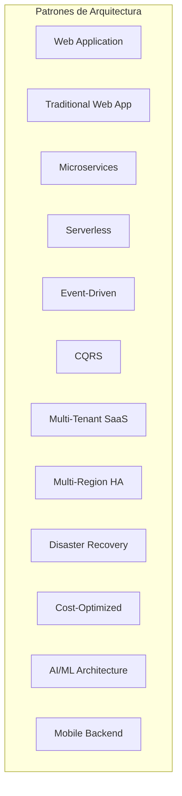

---

## 1. Web Application (React + API Gateway + Lambda + DynamoDB)

### Descripción
Arquitectura serverless moderna para aplicaciones web SPA (Single Page Application) con backend serverless.

### Cuándo Usar
- Aplicaciones de inicio o MVP
- APIs RESTful o GraphQL
- Cargas de trabajo con tráfico variable
- Cuando quieres minimizar costos operativos

### Diagrama

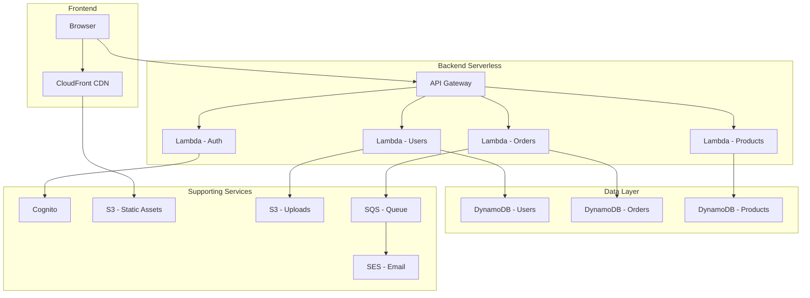

### Componentes Principales

| Componente | Servicio AWS | Propósito |
|---|---|---|
| Frontend | S3 + CloudFront | Hosting SPA + CDN global |
| Auth | Cognito | Autenticación y autorización |
| API | API Gateway | Routing y rate limiting |
| Compute | Lambda | Lógica de negocio serverless |
| Database | DynamoDB | Base de datos NoSQL |
| Cola | SQS | Desacoplamiento async |
| Email | SES | Envío de emails |

### Ejemplo de CDK TypeScript

```typescript
import { App, Stack, RemovalPolicy, CfnOutput } from 'aws-cdk-lib';
import { Construct } from 'constructs';
import { RestApi, LambdaIntegration, Cors } from 'aws-cdk-lib/aws-apigateway';
import { NodejsFunction } from 'aws-cdk-lib/aws-lambda-nodejs';
import { Runtime } from 'aws-cdk-lib/aws-lambda';
import { Table, BillingMode, AttributeType } from 'aws-cdk-lib/aws-dynamodb';
import { UserPool, UserPoolClient } from 'aws-cdk-lib/aws-cognito';
import { Bucket } from 'aws-cdk-lib/aws-s3';
import { Distribution, OriginAccessIdentity } from 'aws-cdk-lib/aws-cloudfront';
import { S3Origin } from 'aws-cdk-lib/aws-cloudfront-origins';
import * as path from 'path';

export class ServerlessWebAppStack extends Stack {
  constructor(scope: Construct, id: string) {
    super(scope, id);

    // DynamoDB Tables
    const usersTable = new Table(this, 'UsersTable', {
      partitionKey: { name: 'userId', type: AttributeType.STRING },
      billingMode: BillingMode.PAY_PER_REQUEST,
      removalPolicy: RemovalPolicy.DESTROY,
    });

    const ordersTable = new Table(this, 'OrdersTable', {
      partitionKey: { name: 'orderId', type: AttributeType.STRING },
      sortKey: { name: 'createdAt', type: AttributeType.STRING },
      billingMode: BillingMode.PAY_PER_REQUEST,
      removalPolicy: RemovalPolicy.DESTROY,
    });

    // Cognito
    const userPool = new UserPool(this, 'UserPool', {
      selfSignUpEnabled: true,
      signInAliases: { email: true },
      autoVerify: { email: true },
    });

    const userPoolClient = new UserPoolClient(this, 'UserPoolClient', {
      userPool,
    });

    // Lambda Functions
    const authLambda = new NodejsFunction(this, 'AuthFunction', {
      runtime: Runtime.NODEJS_18_X,
      handler: 'handler',
      entry: path.join(__dirname, '../lambda/auth/handler.ts'),
      environment: {
        USER_POOL_ID: userPool.userPoolId,
      },
    });

    const usersLambda = new NodejsFunction(this, 'UsersFunction', {
      runtime: Runtime.NODEJS_18_X,
      handler: 'handler',
      entry: path.join(__dirname, '../lambda/users/handler.ts'),
      environment: {
        USERS_TABLE: usersTable.tableName,
      },
    });

    const ordersLambda = new NodejsFunction(this, 'OrdersFunction', {
      runtime: Runtime.NODEJS_18_X,
      handler: 'handler',
      entry: path.join(__dirname, '../lambda/orders/handler.ts'),
      environment: {
        ORDERS_TABLE: ordersTable.tableName,
      },
    });

    // API Gateway
    const api = new RestApi(this, 'Api', {
      defaultCorsPreflightOptions: {
        allowOrigins: ['*'],
        allowMethods: Cors.ALL_METHODS,
      },
    });

    const authResource = api.root.addResource('auth');
    authResource.addMethod('POST', new LambdaIntegration(authLambda));

    const usersResource = api.root.addResource('users');
    usersResource.addMethod('GET', new LambdaIntegration(usersLambda));
    usersResource.addMethod('POST', new LambdaIntegration(usersLambda));

    const ordersResource = api.root.addResource('orders');
    ordersResource.addMethod('GET', new LambdaIntegration(ordersLambda));
    ordersResource.addMethod('POST', new LambdaIntegration(ordersLambda));

    // Permissions
    usersTable.grantReadWriteData(usersLambda);
    ordersTable.grantReadWriteData(ordersLambda);

    // Outputs
    new CfnOutput(this, 'ApiUrl', { value: api.url });
    new CfnOutput(this, 'UserPoolId', { value: userPool.userPoolId });
    new CfnOutput(this, 'UserPoolClientId', { value: userPoolClient.userPoolClientId });
  }
}
```

### Pros y Contras

| Pros | Contras |
|---|---|
| Escalabilidad automática | Cold starts en Lambda |
| Costo bajo (pago por uso) | Complejidad de debugging |
| Sin gestión de servidores | Limitaciones de Lambda (15 min timeout) |
| Deploy simple | Vendor lock-in con AWS |
| Seguridad integrada | DynamoDB tiene curva de aprendizaje |

### Consideraciones de Costo
- **Tráfico bajo:** $5-20/mes
- **Tráfico medio:** $50-200/mes
- **Tráfico alto:** $200-1000+/mes
- La mayor parte del costo viene de API Gateway y Lambda invocations

---

## 2. Traditional Web App (ALB + EC2 + RDS)

### Descripción
Arquitectura clásica de tres capas con servidores gestionados, ideal para aplicaciones monolíticas o que requieren control total del servidor.

### Cuándo Usar
- Aplicaciones legacy migradas a la nube
- Apps que necesitan software específico instalado en el servidor
- Bases de datos relacionales complejas
- Cuando necesitas control total del OS

### Diagrama

```mermaid
graph TB
    subgraph "Internet"
        USER[Usuario]
    end
    
    subgraph "DMZ / Public"
        ALB[Application Load Balancer]
        WAF[WAF]
    end
    
    subgraph "Private Subnet"
        EC2_1[EC2 - Web Server 1]
        EC2_2[EC2 - Web Server 2]
        EC2_3[EC2 - App Server]
    end
    
    subgraph "Data Subnet"
        RDS Primary[RDS Primary]
        RDS Standby[RDS Standby]
        REDIS[ElastiCache Redis]
    end
    
    USER --> WAF
    WAF --> ALB
    ALB --> EC2_1
    ALB --> EC2_2
    EC2_1 --> EC2_3
    EC2_2 --> EC2_3
    EC2_3 --> RDS Primary
    EC2_3 --> REDIS
    RDS Primary --> RDS Standby
```

### CDK TypeScript

```typescript
import { App, Stack, CfnOutput, Tags, RemovalPolicy } from 'aws-cdk-lib';
import { Construct } from 'constructs';
import {
  Vpc, SubnetType, SecurityGroup, Peer, Port,
  Instance, InstanceType, InstanceClass, MachineImage,
  AmazonLinuxGeneration, UserData,
} from 'aws-cdk-lib/aws-ec2';
import {
  LoadBalancer, ApplicationProtocol, TargetType,
  ApplicationTargetGroup, ListenerCondition,
} from 'aws-cdk-lib/aws-elasticloadbalancingv2';
import {
  DatabaseInstance, DatabaseInstanceEngine,
  PostgresEngineVersion, Credentials, BackupRetention,
} from 'aws-cdk-lib/aws-rds';

export class TraditionalWebAppStack extends Stack {
  constructor(scope: Construct, id: string) {
    super(scope, id);

    const vpc = new Vpc(this, 'Vpc', {
      maxAzs: 2,
      subnetConfiguration: [
        { name: 'Public', subnetType: SubnetType.PUBLIC, cidrMask: 24 },
        { name: 'Private', subnetType: SubnetType.PRIVATE_WITH_EGRESS, cidrMask: 24 },
        { name: 'Data', subnetType: SubnetType.PRIVATE_ISOLATED, cidrMask: 24 },
      ],
    });

    // Security Groups
    const albSg = new SecurityGroup(this, 'ALBSG', { vpc });
    albSg.addIngressRule(Peer.anyIpv4(), Port.tcp(80));
    albSg.addIngressRule(Peer.anyIpv4(), Port.tcp(443));

    const webSg = new SecurityGroup(this, 'WebSG', { vpc });
    webSg.addIngressRule(albSg, Port.tcp(80));

    const dbSg = new SecurityGroup(this, 'DBSG', { vpc });
    dbSg.addIngressRule(webSg, Port.tcp(5432));

    // EC2 Instances
    const userData = UserData.forLinux();
    userData.addCommands(
      'yum update -y',
      'yum install -y httpd php php-pgsql',
      'systemctl start httpd',
      'systemctl enable httpd',
    );

    const webServers: Instance[] = [];
    for (let i = 0; i < 2; i++) {
      webServers.push(new Instance(this, `WebServer${i + 1}`, {
        instanceType: InstanceType.of(InstanceClass.T3, InstanceSize.MEDIUM),
        machineImage: MachineImage.latestAmazonLinux2(),
        vpc,
        vpcSubnets: { subnetType: SubnetType.PRIVATE_WITH_EGRESS },
        securityGroup: webSg,
        userData,
      }));
    }

    // ALB
    const alb = new LoadBalancer(this, 'ALB', {
      vpc,
      internetFacing: true,
      securityGroup: albSg,
    });

    const listener = alb.addListener('Listener', { port: 80 });
    listener.addTargets('WebTargetGroup', {
      port: 80,
      protocol: ApplicationProtocol.HTTP,
      targets: webServers,
    });

    // RDS
    const database = new DatabaseInstance(this, 'Database', {
      engine: DatabaseInstanceEngine.postgres({
        version: PostgresEngineVersion.VER_15_4,
      }),
      instanceType: InstanceType.of(InstanceClass.T3, InstanceSize.MEDIUM),
      credentials: Credentials.fromGeneratedSecret('dbadmin'),
      vpc,
      vpcSubnets: { subnetType: SubnetType.PRIVATE_ISOLATED },
      securityGroups: [dbSg],
      multiAz: true,
      backupRetention: BackupRetention.days(7),
      allocatedStorage: 100,
      storageEncrypted: true,
    });

    Tags.of(this).add('Environment', 'production');
  }
}
```

### Pros y Contras

| Pros | Contras |
|---|---|
| Control total del servidor | Gestión manual de servidores |
| Sin limitaciones de Lambda | Costo fijo mensual alto |
| Compatible con cualquier app | Requiere escalado manual o auto-scaling |
| Base de datos relacional completa | Más operaciones de mantenimiento |
| Easy debugging | Menos resiliente que serverless |

### Consideraciones de Costo
- **Mínimo recomendado:** ~$100-300/mes (2 t3.medium + RDS + ALB)
- **Producción típica:** $500-2000/mes
- Incluye costos fijos de EC2 + RDS + ALB +数据传输

---

## 3. Microservices Architecture

### Descripción
Aplicación descompuesta en servicios pequeños e independientes, cada uno con su propia base de datos y ciclo de vida.

### Cuándo Usar
- Equipos grandes que trabajan en partes diferentes
- Cuando necesitas escalabilidad independiente por servicio
- Aplicaciones con múltiples dominios de negocio
- Cuando diferentes servicios tienen diferentes requisitos de performance

### Diagrama

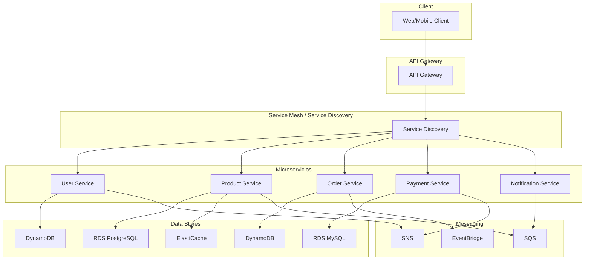

### Ejemplo de CDK - User Service

```typescript
import { Construct } from 'constructs';
import { Stack, StackProps, RemovalPolicy, CfnOutput } from 'aws-cdk-lib';
import { NodejsFunction } from 'aws-cdk-lib/aws-lambda-nodejs';
import { Runtime } from 'aws-cdk-lib/aws-lambda';
import { RestApi, LambdaIntegration } from 'aws-cdk-lib/aws-apigateway';
import { Table, BillingMode, AttributeType } from 'aws-cdk-lib/aws-dynamodb';
import { Topic } from 'aws-cdk-lib/aws-sns';
import { Queue } from 'aws-cdk-lib/aws-sqs';
import * as path from 'path';

export class UserServiceStack extends Stack {
  constructor(scope: Construct, id: string, props?: StackProps) {
    super(scope, id, props);

    // DynamoDB
    const usersTable = new Table(this, 'UsersTable', {
      partitionKey: { name: 'userId', type: AttributeType.STRING },
      billingMode: BillingMode.PAY_PER_REQUEST,
      removalPolicy: RemovalPolicy.DESTROY,
    });

    // SNS for events
    const userEventsTopic = new Topic(this, 'UserEvents', {
      topicName: 'user-events',
    });

    // SQS for async processing
    const notificationQueue = new Queue(this, 'NotificationQueue', {
      queueName: 'user-notifications',
    });

    // Lambda
    const userLambda = new NodejsFunction(this, 'UserFunction', {
      runtime: Runtime.NODEJS_18_X,
      handler: 'handler',
      entry: path.join(__dirname, '../lambda/users/handler.ts'),
      environment: {
        USERS_TABLE: usersTable.tableName,
        USER_EVENTS_TOPIC: userEventsTopic.topicArn,
      },
    });

    usersTable.grantReadWriteData(userLambda);
    userEventsTopic.grantPublish(userLambda);
    notificationQueue.grantConsumeMessages(userLambda);

    // API
    const api = new RestApi(this, 'UserServiceApi');
    const users = api.root.addResource('users');
    users.addMethod('GET', new LambdaIntegration(userLambda));
    users.addMethod('POST', new LambdaIntegration(userLambda));
    const user = users.addResource('{userId}');
    user.addMethod('GET', new LambdaIntegration(userLambda));

    new CfnOutput(this, 'ApiUrl', { value: api.url });
  }
}
```

### Pros y Contras

| Pros | Contras |
|---|---|
| Independencia de despliegue | Complejidad operacional |
| Escalabilidad por servicio | Comunicación inter-servicios compleja |
| Polyglot (cada servicio su lenguaje) | Testing de integración difícil |
| Aislamiento de fallos | Consistencia de datos distribuida |
| Equipes autónomos | Más infraestructura needed |

---

## 4. Serverless Architecture

### Descripción
Arquitectura completamente serverless donde no gestionas ningún servidor. Todo se ejecuta en funciones gestionadas.

### Diagrama

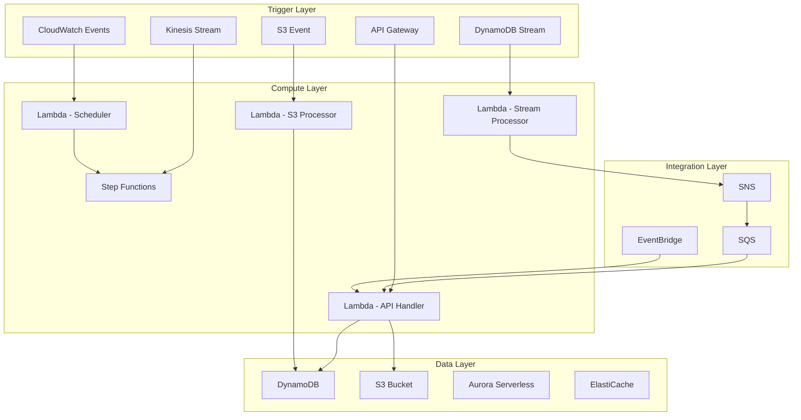

### Pros y Contras

| Pros | Contras |
|---|---|
| Escalabilidad infinita | Cold starts |
| Cero mantenimiento | Limitaciones de timeout |
| Pago solo por uso | Vendor lock-in |
| Deploy instantáneo | Debugging complejo |
| Alta disponibilidad | Testing local difícil |

### Consideraciones de Costo
- **Tráfico bajo:** $1-10/mes
- **Tráfico medio:** $10-100/mes
- **Tráfico alto:** $100-500+/mes
- Muy costo-efectivo para cargas de trabajo variables

---

## 5. Event-Driven Architecture

### Descripción
Arquitectura basada en eventos donde los servicios se comunican de forma asíncrona a través de eventos.

### Diagrama

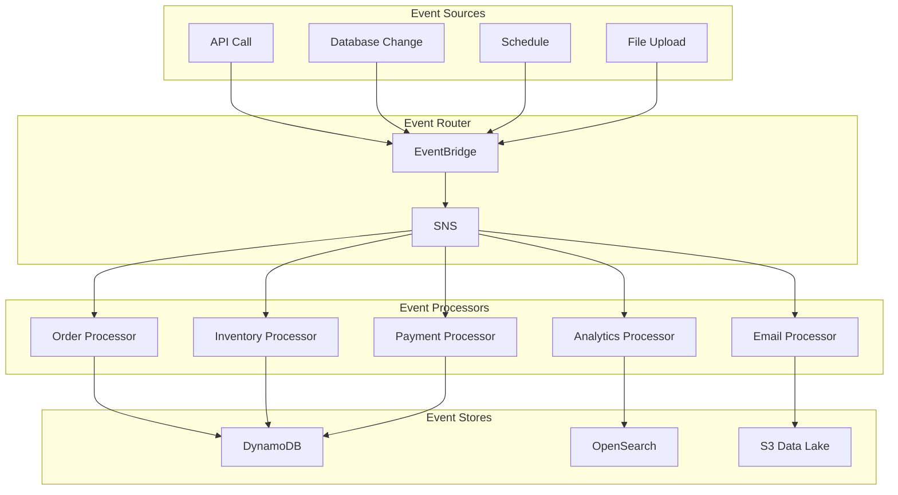

### EventBridge Rule Example

```typescript
import { Rule, EventBus, Schedule } from 'aws-cdk-lib/aws-events';
import { LambdaFunction } from 'aws-cdk-lib/aws-events-targets';

// Rule para eventos de DynamoDB
const orderRule = new Rule(this, 'OrderCreatedRule', {
  eventBus: EventBus.fromEventBusArn(this, 'CustomBus', eventBusArn),
  eventPattern: {
    source: ['com.miapp.orders'],
    detailType: ['OrderCreated'],
  },
});
orderRule.addTarget(new LambdaFunction(orderProcessor));

// Rule para schedule
const reportRule = new Rule(this, 'DailyReport', {
  schedule: Schedule.cron({ minute: '0', hour: '8' }),
});
reportRule.addTarget(new LambdaFunction(reportGenerator));
```

### Pros y Contras

| Pros | Contras |
|---|---|
| Desacoplamiento total | Flujo de control complejo |
| Escalabilidad por evento | Debugging difícil |
| Resiliencia | Eventual consistency |
| Extensible | Testing complejo |
| Procesamiento asíncrono | Posible duplicate processing |

---

## 6. CQRS Pattern

### Descripción
Command Query Responsibility Segregation: separa las operaciones de lectura (query) de las de escritura (command) en diferentes modelos.

### Diagrama

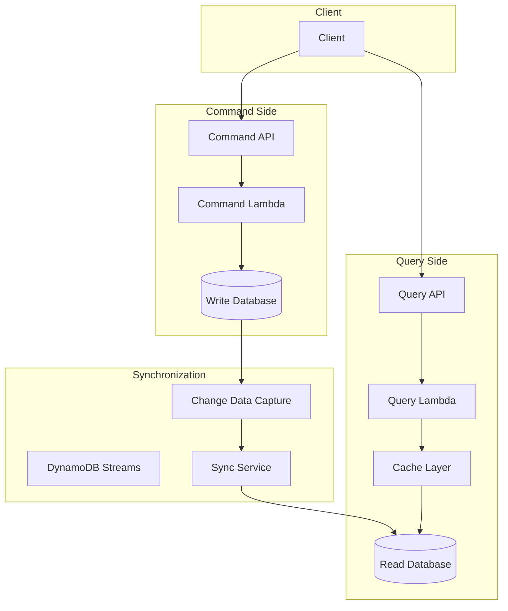

### Ejemplo con DynamoDB Streams

```typescript
import { Table, BillingMode, AttributeType, StreamViewType } from 'aws-cdk-lib/aws-dynamodb';
import { EventSourceMapping, StartingPosition } from 'aws-cdk-lib/aws-lambda';
import { NodejsFunction } from 'aws-cdk-lib/aws-lambda-nodejs';

// Write Table (Command)
const writeTable = new Table(this, 'WriteTable', {
  partitionKey: { name: 'PK', type: AttributeType.STRING },
  stream: StreamViewType.NEW_AND_OLD_IMAGES,
  billingMode: BillingMode.PAY_PER_REQUEST,
});

// Read Table (Query)
const readTable = new Table(this, 'ReadTable', {
  partitionKey: { name: 'PK', type: AttributeType.STRING },
  sortKey: { name: 'SK', type: AttributeType.STRING },
  billingMode: BillingMode.PAY_PER_REQUEST,
});

// Sync Lambda
const syncLambda = new NodejsFunction(this, 'SyncFunction', {
  runtime: Runtime.NODEJS_18_X,
  handler: 'handler',
  entry: path.join(__dirname, '../lambda/sync/handler.ts'),
  environment: {
    READ_TABLE: readTable.tableName,
  },
});

// DynamoDB Stream → Lambda
new EventSourceMapping(this, 'StreamMapping', {
  eventSourceArn: writeTable.tableStreamArn,
  target: syncLambda,
  startingPosition: StartingPosition.TRIM_HORIZON,
  batchSize: 100,
});

writeTable.grantStreamRead(syncLambda);
readTable.grantWriteData(syncLambda);
```

### Pros y Contras

| Pros | Contras |
|---|---|
| Escalabilidad independiente de reads/writes | Complejidad de implementación |
| Optimización de cada lado | Consistencia eventual |
| Reads optimizados | Sincronización entre modelos |
| Writes optimizados | Más infraestructura |

---

## 7. Multi-Tenant SaaS Architecture

### Descripción
Arquitectura que sirve a múltiples clientes (tenants) desde una sola instancia de la aplicación, con aislamiento de datos.

### Diagrama

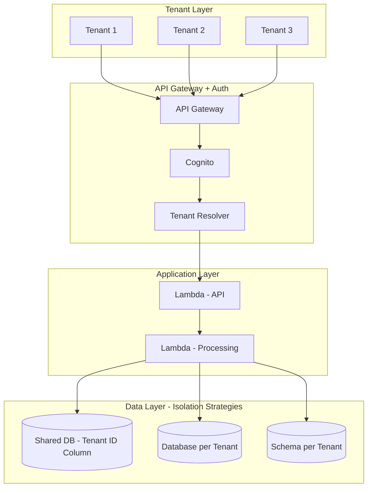

### Tenant Resolver Lambda

```typescript
// lambda/tenant-resolver/handler.ts
export const handler = async (event: any) => {
  const claims = event.requestContext.authorizer.claims;
  const tenantId = claims['custom:tenantId'];
  
  return {
    statusCode: 200,
    headers: {
      'X-Tenant-ID': tenantId,
      'Content-Type': 'application/json',
    },
    body: JSON.stringify({ tenantId }),
  };
};
```

### Pros y Contras

| Pros | Contras |
|---|---|
| Eficiencia de costos compartida | Complejidad de aislamiento |
| Escalabilidad centralizada | Riesgo de noisy neighbor |
| Mantenimiento simplificado | Diferentes requirements por tenant |
| Deploy统一 | Compliance challenges |

---

## 8. Multi-Region High Availability

### Descripción
Arquitectura desplegada en múltiples regiones para alta disponibilidad y baja latencia global.

### Diagrama

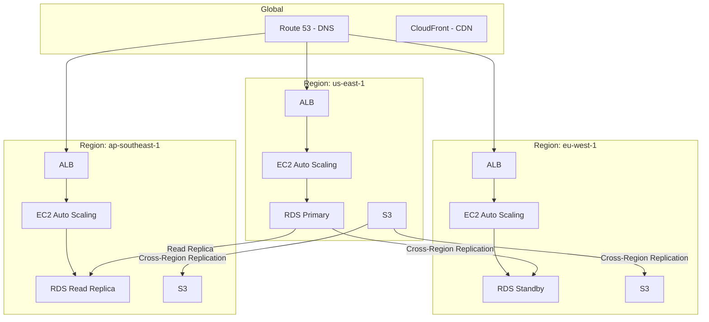

### Route 53 Configuration

```typescript
import { HostedZone, RecordSet, RecordType, RoutingPolicy } from 'aws-cdk-lib/aws-route53';

// Latency-based routing
new RecordSet(this, 'MultiRegionRecord', {
  zone: hostedZone,
  recordName: 'api.miapp.com',
  recordType: RecordType.A,
  target: RecordTarget.fromAlias(new LoadBalancerTarget(alb1)),
  region: 'us-east-1',
  routingPolicy: RoutingPolicy.latency(),
});

// Failover routing
new RecordSet(this, 'PrimaryRecord', {
  zone: hostedZone,
  recordName: 'api.miapp.com',
  recordType: RecordType.A,
  target: RecordTarget.fromAlias(new LoadBalancerTarget(alb1)),
  failover: RecordFailover.PRIMARY,
});

new RecordSet(this, 'SecondaryRecord', {
  zone: hostedZone,
  recordName: 'api.miapp.com',
  recordType: RecordType.A,
  target: RecordTarget.fromAlias(new LoadBalancerTarget(alb2)),
  failover: RecordFailover.SECONDARY,
});
```

### Pros y Contras

| Pros | Contras |
|---|---|
| Alta disponibilidad (99.99%+) | Complejidad operacional alta |
| Baja latencia global | Costo significativamente mayor |
| Disaster recovery | Sincronización de datos compleja |
| Cumplimiento de data residency | Requiere expertise multi-region |

---

## 9. Disaster Recovery Patterns

### Diagrama Comparativo

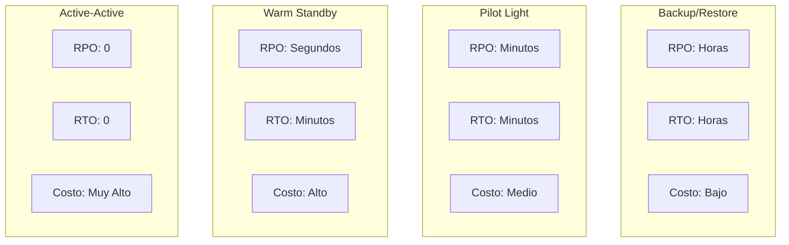

### Backup/Restore

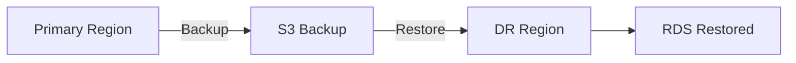

### Pilot Light

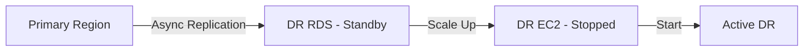

### Warm Standby

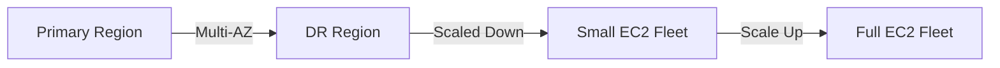

### Active-Active

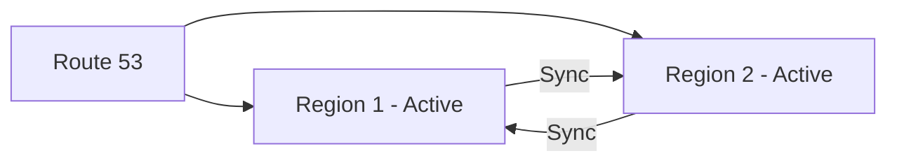

---

## 10. Cost-Optimized Architecture

### Diagrama

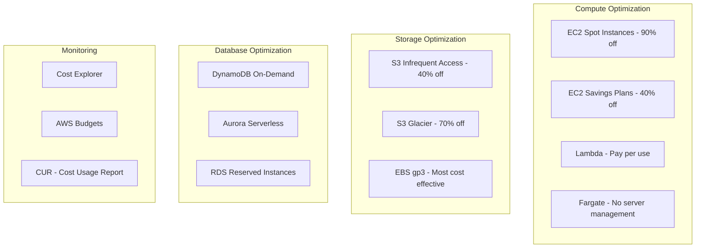

---

## 11. AI/ML Architecture with SageMaker

### Diagrama

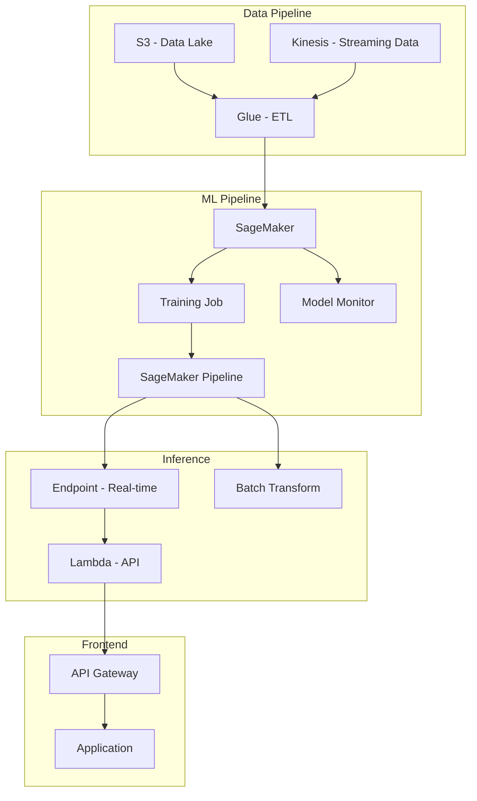

---

## 12. Mobile Backend Architecture

### Diagrama

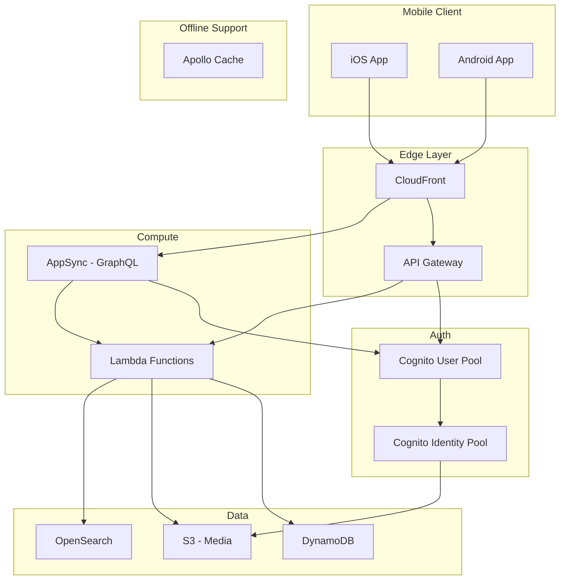

### Pros y Contras (Mobile Backend)

| Pros | Contras |
|---|---|
| GraphQL nativo (AppSync) | Complejidad de AppSync |
| Soporte offline integrado | Vendor lock-in |
| Sync automático | Learning curve alta |
| Escalabilidad automática | Costos de sync |
| Real-time subscriptions | Debugging difícil |

---

## Resumen Comparativo

| Patrón | Complejidad | Costo | Escalabilidad | Ideal Para |
|---|---|---|---|---|
| Web App Serverless | Baja | Bajo | Alta | MVPs, APIs |
| Traditional Web App | Media | Medio | Media | Apps legacy |
| Microservices | Alta | Medio-Alto | Muy Alta | Apps grandes |
| Serverless | Baja | Bajo | Infinita | Event-driven |
| Event-Driven | Media | Bajo-Medio | Alta | Desacoplamiento |
| CQRS | Alta | Medio | Muy Alta | Reads/Writes intensivos |
| Multi-Tenant SaaS | Alta | Bajo | Alta | SaaS products |
| Multi-Region | Muy Alta | Alto | Muy Alta | Global apps |
| Disaster Recovery | Media | Variable | Alta | Business continuity |
| AI/ML | Alta | Alto | Variable | ML workloads |
| Mobile Backend | Media | Bajo-Medio | Alta | Mobile apps |

---
