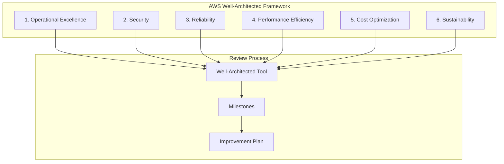
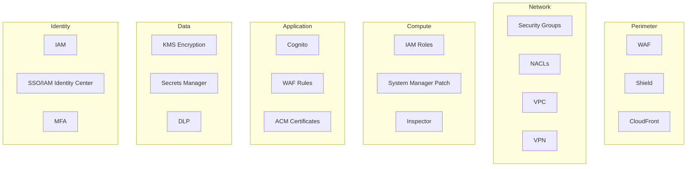
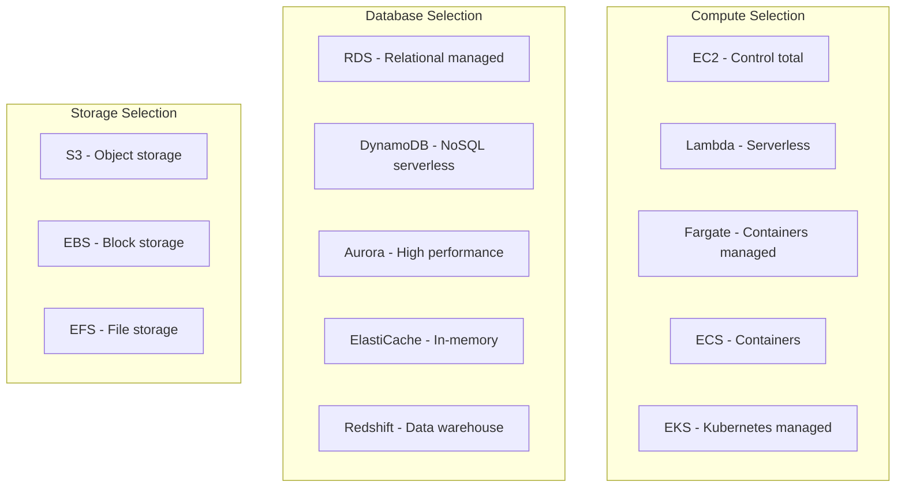
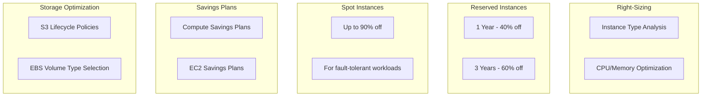
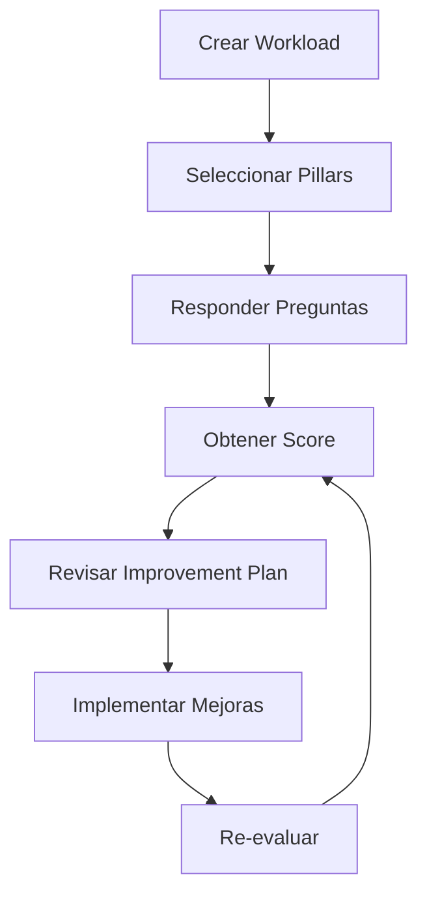

# AWS Well-Architected Framework

## ¿Qué es el Well-Architected Framework?

El AWS Well-Architected Framework es un conjunto de **principios de diseño, mejores prácticas y guías** que ayudan a los clientes a evaluar y mejorar sus arquitecturas en la nube. Fue desarrollado por AWS basándose en años de experiencia trabajando con miles de clientes.

**Analogía:** El Well-Architected Framework es como un **checklist de construcción de edificios**. Así como un arquitecto verifica que un edificio cumpla con normas de seguridad, eficiencia energética, accesibilidad y durabilidad, el framework verifica que tu arquitectura en la nube sea segura, confiable, eficiente y escalable.



---

## Los 6 Pilares en Profundidad

### 1. Operational Excellence

**Definición:** Ejecutar y monitorear sistemas para entregar valor de negocio y mejorar continuamente los procesos y procedimientos.

#### Principios de Diseño

1. **Perform operations as code** - Automatiza todo lo que puedas
2. **Make frequent, small, reversible changes** - Cambios pequeños y reversibles
3. **Refine operations procedures frequently** - Mejora continuamente
4. **Anticipate failure** - Planifica para el fallo
5. **Learn from all operational failures** - Aprende de cada error

#### Mejores Prácticas

| Área | Mejor Práctica | AWS Services |
|---|---|---|
| **IaC** | Usa CloudFormation o CDK | CloudFormation, CDK |
| **CI/CD** | Implementa pipelines automatizados | CodePipeline, CodeBuild |
| **Monitoreo** | Logs centralizados y métricas | CloudWatch, CloudTrail |
| **Runbooks** | Documenta procedimientos operativos | Systems Manager |
| **Incident Response** | Plan de respuesta a incidentes | EventBridge, SNS |
| **Configuration** | Gestión centralizada de configs | SSM Parameter Store, Secrets Manager |

#### Ejemplo: Runbook con Systems Manager

```yaml
# Documento de Systems Manager Automation
schemaVersion: "0.3"
description: "Runbook para responder a alta utilización de CPU"
parameters:
  InstanceId:
    type: String
    description: "ID de la instancia EC2"
mainSteps:
  - name: getInstanceMetrics
    action: aws:executeAwsApi
    inputs:
      Service: cloudwatch
      Api: GetMetricStatistics
      Namespace: AWS/EC2
      MetricName: CPUUtilization
      Dimensions:
        - Name: InstanceId
          Value: "{{InstanceId}}"
      StartTime: "{{date-time}}"
      EndTime: "{{date-time}}"
      Period: 300
      Statistics:
        - Average
    outputs:
      - Name: CpuUtilization
        Selector: "$.Datapoints[0].Average"
        Type: Number
  - name: rebootInstance
    action: aws:rebootInstance
    inputs:
      InstanceId: "{{InstanceId}}"
    condition:
      stringEquals:
        - "{{CpuUtilization}}"
        - "95"
```

---

### 2. Security

**Definición:** Proteger datos, sistemas y activos para entregar valor de negocio y mantener la confianza de los clientes.

#### Principios de Diseño

1. **Implement a strong identity foundation** - Identidad sólida
2. **Maintain traceability** - Trazabilidad completa
3. **Apply security at all layers** - Seguridad en todas las capas
4. **Automate security best practices** - Automatiza seguridad
5. **Protect data in transit and at rest** - Protege datos en tránsito y en reposo
6. **Keep people away from data** - Mantén personas lejos de datos sensibles
7. **Prepare for security events** - Prepara para eventos de seguridad

#### Mejores Prácticas por Capa



| Capa | Servicios | Acciones |
|---|---|---|
| **Identity** | IAM, SSO, MFA | Least privilege, MFA enforced |
| **Perimeter** | WAF, Shield, CloudFront | DDoS protection, rate limiting |
| **Network** | VPC, SG, NACLs | Micro-segmentation, private subnets |
| **Compute** | EC2 SSM, Inspector | Patching, vulnerability scanning |
| **Application** | WAF, ACM, Cognito | Input validation, encryption |
| **Data** | KMS, Secrets Manager | Encryption at rest and in transit |

#### Ejemplo: KMS Encryption

```typescript
import { Key } from 'aws-cdk-lib/aws-kms';
import { Bucket, BucketEncryption } from 'aws-cdk-lib/aws-s3';
import { DatabaseInstance } from 'aws-cdk-lib/aws-rds';

// KMS Key for S3
const s3Key = new Key(this, 'S3Key', {
  alias: 's3-encryption-key',
  enableKeyRotation: true,
  description: 'Key for S3 bucket encryption',
});

const bucket = new Bucket(this, 'SecureBucket', {
  encryption: BucketEncryption.KMS,
  encryptionKey: s3Key,
  enforceSSL: true,
  blockPublicAccess: BlockPublicAccess.BLOCK_ALL,
});

// RDS with KMS encryption
const database = new DatabaseInstance(this, 'SecureDB', {
  engine: DatabaseInstanceEngine.postgres({ version: PostgresEngineVersion.VER_15_4 }),
  storageEncrypted: true,
  encryptionKey: s3Key,
});
```

---

### 3. Reliability

**Definición:** Recuperarse de fallos y satisfacer la demanda de los usuarios. Enfocado en disaster recovery, disponibilidad y mitigación de fallos.

#### Principios de Diseño

1. **Automatically recover from failure** - Recuperación automática
2. **Test recovery procedures** - Prueba procedimientos de recuperación
3. **Scale horizontally to increase availability** - Escala horizontalmente
4. **Stop guessing capacity** - No adivines la capacidad
5. **Manage change in automation** - Gestiona cambios en automatización

#### Disponibilidad por Architectural Pattern

| Patrón | Disponibilidad | RTO | RPO | Costo |
|---|---|---|---|---|
| Single AZ | 99.5% | Horas | Horas | $ |
| Multi-AZ | 99.95% | Minutos | Minutos | $$ |
| Multi-Region Active-Passive | 99.99% | Minutos | Segundos | $$$ |
| Multi-Region Active-Active | 99.999% | Segundos | 0 | $$$$ |

#### Auto Scaling Configuration

```typescript
import { AutoScalingGroup } from 'aws-cdk-lib/aws-autoscaling';
import { ScalingPolicy, TargetTrackingScalingPolicy } from 'aws-cdk-lib/aws-autoscaling';
import { InstanceType, InstanceClass, Vpc, MachineImage } from 'aws-cdk-lib/aws-ec2';

const asg = new AutoScalingGroup(this, 'ASG', {
  vpc,
  instanceType: InstanceType.of(InstanceClass.T3, InstanceSize.MEDIUM),
  machineImage: MachineImage.latestAmazonLinux2(),
  minCapacity: 2,
  maxCapacity: 10,
  desiredCapacity: 3,
  healthCheck: HealthCheck.elb({
    grace: Duration.minutes(5),
  }),
  vpcSubnets: { subnetType: SubnetType.PRIVATE_WITH_EGRESS },
});

// Target tracking scaling policy
asg.scaleOnCpuUtilization('CpuScaling', {
  targetUtilizationPercent: 70,
  scaleInCooldown: Duration.minutes(5),
  scaleOutCooldown: Duration.minutes(1),
});

// Custom scaling policy
asg.scaleOnMetric('RequestScaling', {
  metric: new Metric({
    namespace: 'AWS/ApplicationELB',
    metricName: 'RequestCountPerTarget',
    dimensionsMap: {
      TargetGroup: targetGroup.targetGroupFullName,
    },
  }),
  scalingSteps: [
    { lower: 0, change: -1 },
    { lower: 100, change: 0 },
    { lower: 1000, change: 2 },
    { lower: 5000, change: 4 },
  ],
  adjustmentType: AdjustmentType.EXACT_CAPACITY,
});
```

---

### 4. Performance Efficiency

**Definición:** Usar recursos de computación de manera eficiente para satisfacer los requisitos del sistema y mantener la eficiencia a medida que cambian las tecnologías.

#### Principios de Diseño

1. **Democratize advanced technologies** - Tecnologías avanzadas accesibles
2. **Use a managed service** - Usa servicios managed
3. **Experiment more often** - Experimenta frecuentemente
4. **Consider performance in cost** - Considera performance en costo
5. **Use profiling to improve** - Usa profiling para mejorar

#### Decisiones de Performance



| Necesidad | Servicio Recomendado | Cuándo Usar |
|---|---|---|
| API con tráfico variable | Lambda + API Gateway | Tráfico unpredictable, event-driven |
| Base de datos relacional | Aurora | MySQL/PostgreSQL compatible, high performance |
| Base de datos NoSQL | DynamoDB | Key-value, serverless, auto-scaling |
| Cache | ElastiCache (Redis) | Low latency, session management |
| Búsqueda full-text | OpenSearch | Analytics, logging, search |
| Data warehouse | Redshift | Analytics, BI, reporting |
| Storage estático | S3 | Assets, backups, data lake |

---

### 5. Cost Optimization

**Definición:** Ejecutar sistemas para entregar valor de negocio al menor costo posible.

#### Principios de Diseño

1. **Implement cloud financial management** - Gestión financiera en la nube
2. **Adopt a consumption model** - Modelo de consumo
3. **Measure overall efficiency** - Mide la eficiencia general
4. **Stop spending money on undifferentiated work** - No gastes en trabajo no diferenciado
5. **Analyze and attribute expenditure** - Analiza y atribuye gastos

#### Estrategias de Ahorro



| Estrategia | Ahorro | Aplicabilidad |
|---|---|---|
| **Right-sizing** | 30-60% | Todas las instancias |
| **Reserved Instances (1yr)** | 40% | Workloads steady-state |
| **Reserved Instances (3yr)** | 60% | Workloads a largo plazo |
| **Spot Instances** | 90% | Fault-tolerant, batch jobs |
| **Savings Plans** | 40-60% | Flexible across instance types |
| **S3 Lifecycle** | 40-70% | Data with aging patterns |
| **Graviton Instances** | 20% | ARM-compatible workloads |

#### Ejemplo: S3 Lifecycle Policy

```yaml
Type: AWS::S3::Bucket
Properties:
  BucketName: "mi-data-lake"
  LifecycleConfiguration:
    Rules:
      - Id: "MoveToIA"
        Status: Enabled
        Transitions:
          - TransitionInDays: 30
            StorageClass: STANDARD_IA
          - TransitionInDays: 90
            StorageClass: GLACIER
          - TransitionInDays: 180
            StorageClass: DEEP_ARCHIVE
        ExpirationInDays: 365
      - Id: "AbortIncompleteMultipartUpload"
        Status: Enabled
        AbortIncompleteMultipartUpload:
          DaysAfterInitiation: 7
```

#### Cost Explorer Dashboard

```bash
# Ver costos por servicio
aws ce get-cost-and-usage \
  --time-period Start=2024-01-01,End=2024-01-31 \
  --granularity MONTHLY \
  --metrics "BlendedCost" \
  --group-by Type=DIMENSION,Key=SERVICE

# Ver costos por tag
aws ce get-cost-and-usage \
  --time-period Start=2024-01-01,End=2024-01-31 \
  --granularity MONTHLY \
  --metrics "BlendedCost" \
  --group-by Type=TAG,Key=Environment
```

---

### 6. Sustainability

**Definición:** Minimizar el impacto ambiental de las cargas de trabajo en la nube.

#### Principios de Diseño

1. **Understand your impact** - Entiende tu impacto
2. **Establish sustainability goals** - Establece metas de sostenibilidad
3. **Maximize utilization** - Maximiza la utilización
4. **Anticipate new, more efficient hardware** - Anticipa hardware más eficiente
5. **Use managed services** - Usa servicios managed
6. **Reduce downstream impact** - Reduce el impacto downstream

#### Mejores Prácticas

| Área | Acción | Impacto |
|---|---|---|
| **Compute** | Usa Graviton (ARM) | 60% menos energía |
| **Compute** | Usa Spot Instances | Mejor utilización de hardware |
| **Storage** | Lifecycle policies | Menos almacenamiento redundante |
| **Network** | CloudFront caching | Menos transferencia de datos |
| **Data** | Compresión y deduplicación | Menos almacenamiento |
| **Architecture** | Serverless | Escala a cero cuando no se usa |

#### Ejemplo: ARN Graviton

```typescript
import { InstanceType, InstanceClass, MachineImage, CpuCredits } from 'aws-cdk-lib/aws-ec2';

// Instancia Graviton (ARM) - 60% menos energía
const gravitonInstance = new Instance(this, 'GravitonServer', {
  instanceType: InstanceType.of(InstanceClass.T4G, InstanceSize.MEDIUM),
  machineImage: MachineImage.latestAmazonLinux2023({
    cpuType: AmazonLinuxCpuType.ARM_64,
  }),
  // ...
});
```

---

## AWS Well-Architected Tool

El Well-Architected Tool es una herramienta gratuita en la consola de AWS que te permite revisar tu arquitectura contra los 6 pilares.

### Proceso de Revisión



### Steps

1. **Accede al Well-Architected Tool** en la consola de AWS
2. **Crea un workload** describiendo tu arquitectura
3. **Responde las preguntas** de cada pilar (High/Medium/Low risk)
4. **Obtén un score** por pilar (0-100)
5. **Revisa el improvement plan** con acciones recomendadas
6. **Implementa las mejoras** priorizadas
7. **Crea milestones** para trackear progreso
8. **Re-evalúa** periódicamente

### Scores por Pilar

| Pilar | Score Mínimo Recomendado | Acción |
|---|---|---|
| Operational Excellence | 70+ | Implementar monitoreo y automatización |
| Security | 80+ | Revisar IAM, encryption, networking |
| Reliability | 70+ | Multi-AZ, auto-scaling, DR testing |
| Performance Efficiency | 70+ | Right-sizing, managed services |
| Cost Optimization | 70+ | Reserved Instances, Spot, lifecycle |
| Sustainability | 60+ | Graviton, serverless, optimization |

---

## Well-Architected Lenses

Además de los 6 pilares principales, existen lenses específicos para workload types:

| Lens | Enfoque |
|---|---|
| **Serverless** | Lambda, API Gateway, DynamoDB |
| **SaaS** | Multi-tenant architecture |
| **IoT** | Dispositivos, edge computing |
| **Machine Learning** | ML pipelines, SageMaker |
| **Game Tech** | Gaming workloads |
| **Data Analytics** | Analytics pipelines |
| **Migration** | Cloud migration strategies |

---

## Resumen de Pilares

| Pilar | Pregunta Clave | Servicios Clave |
|---|---|---|
| **Operational Excellence** | ¿Cómo operamos y mejoramos? | CloudFormation, CodePipeline, CloudWatch, Systems Manager |
| **Security** | ¿Cómo protegemos todo? | IAM, KMS, WAF, Shield, Secrets Manager, GuardDuty |
| **Reliability** | ¿Cómo nos recuperamos de fallos? | Route 53, ELB, Auto Scaling, Multi-AZ, CloudWatch |
| **Performance Efficiency** | ¿Usamos recursos eficientemente? | Lambda, Aurora, ElastiCache, CloudFront, Graviton |
| **Cost Optimization** | ¿Evitamos costos innecesarios? | Cost Explorer, Reserved Instances, Spot, S3 Lifecycle |
| **Sustainability** | ¿Minimizamos impacto ambiental? | Graviton, Serverless, Spot, CloudFront |

---

## Consejos para Entrevistas

1. **Nombra los 6 pilares** y explica brevemente cada uno
2. **Conoce el Well-Architected Tool** y cómo se usa
3. **Sabe la diferencia** entre un pillar y un lens
4. **Entiende que el framework es iterativo** - no es un check de una vez
5. **Conoce servicios clave** que soportan cada pilar
6. **Puede dar ejemplos prácticos** de mejora en cada pilar
7. **Entiende que Security y Reliability** suelen ser los más importantes

---

## Preguntas Frecuentes (FAQ)

**¿El Well-Architected Framework es obligatorio?**
No, es un framework de mejores prácticas. Sin embargo, las revisiones son altamente recomendadas y a veces requeridas para certificaciones o programas de socios.

**¿Cuánto cuesta el Well-Architected Tool?**
Es gratuito. Solo pagas por los servicios de AWS que uses para implementar las mejoras.

**¿Con qué frecuencia debo hacer una revisión?**
AWS recomienda al menos una vez al trimestre, o después de cambios significativos en la arquitectura.

**¿Puedo hacer una revisión yo solo?**
Sí, pero AWS recomienda trabajar con un socio certificado en Well-Architected para obtener una perspectiva externa.

**¿Qué pasa si mi score es bajo?**
No hay penalización. El score es solo una métrica para identificar áreas de mejora. AWS ofrece créditos para implementar mejoras críticas.

**¿El framework aplica a todas las cargas de trabajo?**
Sí, los 6 pilares son universales. Los lenses proporcionan orientación específica para tipos de workload.

---

## Resumen Final

El AWS Well-Architected Framework es la guía definitiva para construir arquitecturas en la nube. Sus 6 pilares cubren todos los aspectos de una arquitectura exitosa:

- **Operational Excellence** - Ejecuta y mejora continuamente
- **Security** - Protege todo en todas las capas
- **Reliability** - Recupérate de fallos automáticamente
- **Performance Efficiency** - Usa recursos de forma eficiente
- **Cost Optimization** - Minimiza costos sin comprometer calidad
- **Sustainability** - Reduce el impacto ambiental

El Well-Architected Tool proporciona un proceso estructurado para evaluar y mejorar tu arquitectura, con scores medibles y planes de mejora concretos.

---
