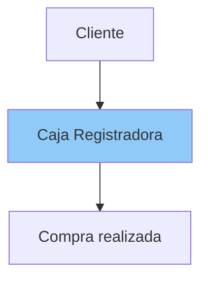
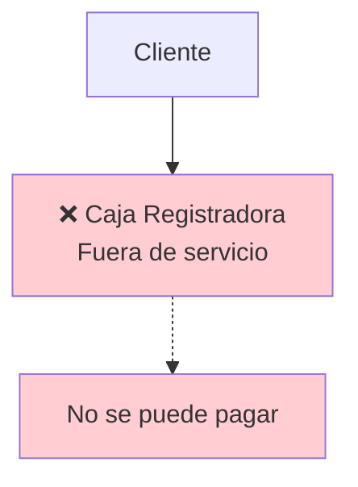
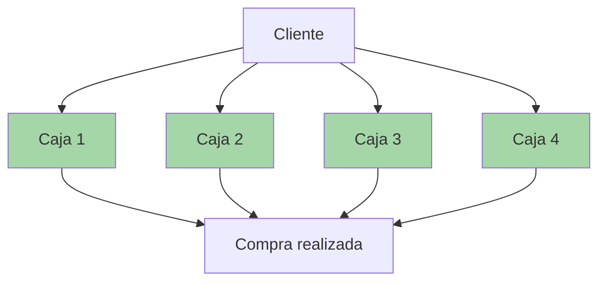
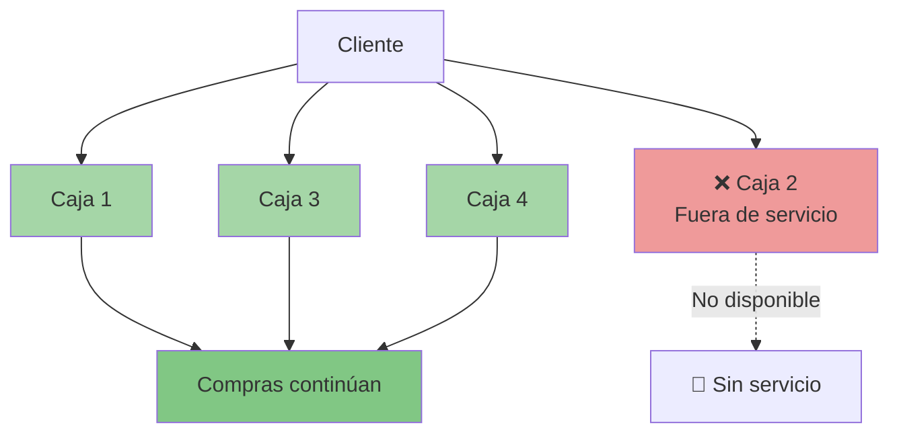
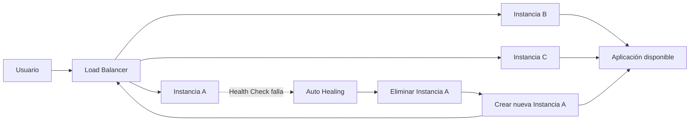

import { Tab, Tabs } from '@rspress/core/theme';

# Alta Disponibilidad

La **alta disponibilidad** en cloud computing es una estrategia de diseño para que una aplicación o servicio siga funcionando aunque falle una parte de la infraestructura. Su objetivo es reducir al máximo el tiempo de caída y mantener el servicio accesible para el usuario casi todo el tiempo.

A diferencia de los sistemas tradicionales locales (on-premise), la alta disponibilidad en la nube aprovecha la elasticidad, la distribución geográfica y la automatización que ofrecen los proveedores de servicios en la nube (como AWS, Microsoft Azure o Google Cloud Platform).

## 1. ¿Qué es la Alta Disponibilidad?

La Alta Disponibilidad (High Availability - HA) es la capacidad de un sistema para seguir funcionando de manera continua incluso cuando alguno de sus componentes falla.

En otras palabras:

>El servicio permanece disponible para los usuarios la mayor parte del tiempo, minimizando las interrupciones.

El objetivo principal es:

- reducir caídas del sistema
- minimizar tiempos de inactividad (Downtime)
- garantizar continuidad del negocio

## 2. Cómo funciona

La idea central es evitar puntos únicos de fallo. Para eso se usan varias técnicas: balanceo de carga, réplicas de servidores, bases de datos replicadas, conmutación por error automática y despliegue en múltiples zonas de disponibilidad o regiones.

:::tip Ejemplo sencillo
Imagina un supermercado. Tiene una sola caja registradora.



**¿Qué ocurre si la caja deja de funcionar?**

Todos los clientes dejan de comprar. El supermercado queda prácticamente detenido.



Ahora imagina que existen cuatro cajas.



**Si una caja falla**:



- las demás continúan atendiendo
- los clientes casi no perciben el problema

Eso es Alta Disponibilidad.
:::

## 3. ¿Por qué es importante?

Hoy prácticamente todo funciona mediante Internet: bancos, Netflix, Amazon, Uber, WhatsApp, hospitales. Si alguno deja de funcionar durante algunos minutos puede perder:

- dinero
- clientes
- reputación
- información
- confianza

Por eso las empresas invierten millones para que sus servicios permanezcan disponibles.


## 4. Elementos clave de Alta Disponibilidad

La **Alta Disponibilidad (High Availability)** busca que una aplicación o servicio permanezca disponible durante el mayor tiempo posible, incluso cuando ocurren fallos.

Para conseguirlo, AWS utiliza conceptos como **redundancia, balanceo, health checks, Auto Scaling, replicación y Availability Zones**.

### 4.1 Downtime

**Downtime** significa **tiempo de inactividad**. Es el período (tiempo) durante el cual un servicio, aplicación o sistema **no está disponible para los usuarios**.

Por ejemplo:

```text
09:00 → Servidor funcionando
09:10 → Servidor falla
09:10 ───────── 09:40 → Servicio caído
09:40 → Servidor recuperado (Servicio disponible nuevamente)
```

**¿Qué puede provocar downtime?**

* Fallos de hardware.
* Cortes eléctricos.
* Errores humanos.
* Problemas de red.
* Errores de software.
* Actualizaciones defectuosas.
* Fallos en una infraestructura.

La Alta Disponibilidad busca reducir este tiempo al mínimo.

>**Downtime = tiempo en que un servicio no está disponible.**

### 4.2 Redundancia

La **redundancia** consiste en tener **recursos adicionales o duplicados** para evitar que la falla de un único componente provoque la caída del servicio.

Por ejemplo, en lugar de:

```text
        Aplicación
            │
        Servidor A
```

tener:

```text
        Aplicación
            │
     ┌──────┼──────┐
     ↓      ↓      ↓
  Server A Server B Server C
```

Si **Servidor A** falla. La aplicación puede continuar funcionando.

**Ejemplos de redundancia**

Puedes tener redundancia de:

* servidores
* bases de datos
* discos
* conexiones de red
* componentes de infraestructura
* Availability Zones

>**Redundancia = tener recursos adicionales para que exista un respaldo cuando uno falla.**

### 4.3 Load Balancer

Un **Load Balancer (balanceador de carga)** distribuye las solicitudes de los usuarios entre varios recursos, normalmente servidores o instancias. Si un servidor deja de responder, el balanceador simplemente deja de enviar tráfico hacia él.

Por ejemplo:

```text
              Usuarios
                  │
                  ▼
          ┌──────────────┐
          │ Load Balancer│
          └──────┬───────┘
                 │
        ┌────────┼────────┐
        ▼        ▼        ▼
      EC2-A    EC2-B    EC2-C
```

En lugar de que todos los usuarios lleguen a un único servidor, el tráfico se distribuye entre varios.

**¿Qué ocurre si un servidor falla?**

El Load Balancer puede dejar de enviar solicitudes a ese servidor y continuar utilizando  los otros servidores.

Esto ayuda a:

* distribuir la carga;
* evitar la saturación de un servidor;
* mejorar la disponibilidad;
* utilizar múltiples servidores.

> **Load Balancer = distribuye el tráfico entre múltiples recursos.**

### 4.4 Health Checks

Los **Health Checks (comprobaciones de estado)** son comprobaciones que permiten determinar si un recurso está funcionando correctamente.

**¿Cómo sabe el balanceador si un servidor está funcionando?**

Imagina que tienes:

```text
Load Balancer
      │
      ├── EC2-A
      ├── EC2-B
      └── EC2-C
```

El Load Balancer puede comprobar periódicamente el estado de las instancias. Cada pocos segundos pregunta: ¿Estás vivo? Si el servidor responde: **`200 OK`**, continúa enviándole tráfico. Si responde: **`500 Error`**, o no responde. Lo elimina temporalmente.

Por ejemplo:

```text
EC2-A → Health Check → ✅ Healthy
EC2-B → Health Check → ✅ Healthy
EC2-C → Health Check → ❌ Unhealthy
```

Si **`EC2-C`** no responde correctamente, el Load Balancer puede dejar de enviarle tráfico.

>El Health Check **detecta el problema**. No necesariamente significa que él mismo repare el servidor.
>
>**Health Check = comprobar si un recurso está saludable/disponible.**

### 4.5 Auto Healing

**Auto Healing (reparación automática)** significa que la infraestructura puede **detectar un recurso que ha fallado y reemplazarlo automáticamente**.




Por ejemplo:

```text
EC2-A
  ↓
Health Check
  ↓
❌ Falló
  ↓
Sistema detecta el fallo
  ↓
Elimina/reemplaza la instancia
  ↓
Nueva instancia
  ↓
✅ Servicio continúa
```

>La idea es: **Detectar → reemplazar → recuperar**

**Diferencia con Health Check**

| Concepto         | Función                                            |
| ---------------- | -------------------------------------------------- |
| **Health Check** | Detecta si algo está funcionando                   |
| **Auto Healing** | Reacciona al fallo y reemplaza/recupera el recurso |


>**Auto Healing = recuperación/reemplazo automático de recursos que fallan.**

### 4.6 Auto Scaling

**Auto Scaling** permite ajustar automáticamente la cantidad de recursos disponibles según la demanda.

Supongamos que normalmente tienes:

```text
              100 usuarios
                  ↓
                EC2
```

Pero de repente tienes:

```text
              10.000 usuarios
                  ↓
             ¿1 servidor?
```

Ese servidor podría saturarse. Con Auto Scaling:

```text
Demanda aumenta
       ↓
Auto Scaling
       ↓
Agrega instancias
       ↓
EC2 + EC2 + EC2 + EC2
       ↓
Load Balancer
       ↓
Carga distribuida
```

Cuando la demanda disminuye:

```text
Demanda disminuye
       ↓
Auto Scaling
       ↓
Reduce instancias
       ↓
EC2 + EC2
```

>**Auto Scaling** ayuda a conseguir **elasticidad**.

**Ventajas**

* Manejar picos de tráfico.
* Evitar sobrecargar servidores.
* Adaptar la capacidad a la demanda.
* Evitar mantener recursos innecesarios.
* Mejorar disponibilidad.

> **Auto Scaling = aumentar o reducir automáticamente los recursos según la demanda.**

### 4.7 Replicación de datos

La **replicación** consiste en mantener **copias de los datos en diferentes recursos**.

Por ejemplo:

```text
          Base de datos
               │
        ┌──────┴──────┐
        ▼             ▼
      BD A           BD B
    Principal        Réplica
```

Si ocurre un problema con la base principal, una réplica puede utilizarse dependiendo de la arquitectura y del servicio.

**¿Por qué es importante?**

Porque tener varios servidores no sirve de mucho si **todos dependen de una única base de datos que puede fallar**.

Por ejemplo:

```text
          Load Balancer
          /     |     \
        EC2    EC2    EC2
          \     |     /
           \    |    /
             BD
              ❌
```

Aunque tengas tres servidores, la aplicación puede verse afectada si la única base de datos deja de estar disponible.

Con una arquitectura redundante:

```text
          EC2    EC2    EC2
             \    |    /
              \   |   /
               BD A
                 │
              Réplica
               BD B
```

La replicación puede ayudar a mejorar la **disponibilidad y durabilidad**, aunque los detalles dependen del servicio de base de datos utilizado.

> **Replicación = mantener copias de los datos para reducir el impacto de un fallo.**

### 4.8 Availability Zones (AZ)

Una **Availability Zone (AZ)** es una ubicación aislada dentro de una **AWS Region**. Una región normalmente está formada por **múltiples Availability Zones**.

Por ejemplo:

```text
             AWS Region
                 │
       ┌─────────┼─────────┐
       ▼         ▼         ▼
      AZ-A      AZ-B      AZ-C
```

Las AZ están diseñadas para estar **aisladas entre sí**, con infraestructura independiente para aspectos como energía y conectividad, reduciendo el riesgo de que un problema afecte a todas simultáneamente.

**¿Por qué son importantes?**

Porque puedes distribuir tus recursos entre varias AZ. Por ejemplo:

```text
             Load Balancer
                   │
          ┌────────┼────────┐
          ▼        ▼        ▼
        AZ-A     AZ-B     AZ-C
         │        │        │
       EC2-A    EC2-B    EC2-C
```

Si una AZ presenta un problema: Los recursos de las otras AZ pueden continuar atendiendo las solicitudes, si la aplicación está correctamente diseñada para ello.

> **Availability Zone = ubicación aislada dentro de una región de AWS.**

:::info Cómo se relacionan todos
Estos conceptos no están aislados. Pueden trabajar juntos para construir una arquitectura altamente disponible:


:::

## 5. ¿Cómo se mide la Alta Disponibilidad?

La **Alta Disponibilidad (High Availability)** se mide principalmente mediante el **porcentaje de tiempo que un servicio permanece disponible** durante un período determinado. La métrica más importante es el **Availability (%)**.

### 5.1 Disponibilidad (Availability)

La disponibilidad indica **qué porcentaje del tiempo un servicio está funcionando y accesible**.

La fórmula básica es:

```txt
Disponibilidad = Tiempo funcionando
                 ----------------------
                 Tiempo total
```

Por ejemplo, si durante un mes un servicio estuvo disponible durante 29 días y tuvo 1 día de caída:

```text
Disponibilidad = 29 / 30 × 100
               ≈ 96.67%
```
Mientras más cercano esté al `100%`, mejor. Por lo tanto:

> **Mayor disponibilidad = menor tiempo de inactividad.**

### 5.2 Los famosos "nueves"

La alta disponibilidad se cuantifica comúnmente mediante **"nueves"** (nines), que representan el porcentaje de tiempo de actividad (uptime) esperado en un año.

>La disponibilidad indica qué porcentaje del tiempo un sistema permanece funcionando correctamente.

**Por ejemplo**: un servicio estuvo disponible, **`364`** días de un año.

```
Disponibilidad = 364 / 365 = 99.72%
```

Mientras más cercano esté al **`100%`**, mejor.

En Cloud Computing se habla constantemente de los "**Nueves**" (Availability Nines).

| Disponibilidad (%) | Tiempo de inactividad permitido (al año) |
| -------------- | -------------------: |
| 99%            |            3 días y 15 horas |
| 99.9%          |           8 horas y 45 minutos |
| 99.99%         |        52 minutos|
| 99.999%        |         5 minutos y 26 segundos |

La mayoría de las arquitecturas críticas en la nube apuntan al menos a **`99.99%`** o más. Por ejemplo:

<Tabs>
  <Tab label="99.9%">
    Significa que, teóricamente, el servicio puede estar disponible el **99.9% del tiempo** y tener aproximadamente:

    ```text
    8 horas 45 minutos
            ↓
    Downtime máximo aproximado por año
    ```
  </Tab>
  <Tab label="99.99%">
  Significa que, teóricamente, el servicio puede estar disponible el **99.99% del tiempo** y tener aproximadamente:

    ```text
    99.99%
    ↓
    ≈ 52 minutos
    ↓
    Downtime aproximado por año
    ```
  </Tab>
  <Tab label="99.999%">
  Significa que, teóricamente, el servicio puede estar disponible el **99.999% del tiempo** y tener aproximadamente:

    ```text
    99.999%
        ↓
    ≈ 5 minutos
        ↓
    Downtime aproximado por año
    ```
  </Tab>
</Tabs>

### 5.3 SLA (Service Level Agreement)

Un **SLA (Acuerdo de nivel de servicio)** es un compromiso contractual de disponibilidad que un proveedor de servicios establece para un servicio.

El SLA establece un **compromiso** bajo determinadas condiciones; no significa que el servicio vaya a estar exactamente ese porcentaje de tiempo disponible en todo momento.

### 5.4 Disponibilidad vs. Durabilidad

- Disponibilidad. Pregunta: **"¿Puedo acceder al servicio ahora?"**
- Durabilidad. Pregunta: **"¿Mis datos sobrevivirán a un fallo?"**

**Por ejemplo**, un sistema podría tener: **Alta disponibilidad**, pero si no tiene mecanismos adecuados de protección de datos, eso **no garantiza por sí mismo** que los datos estén protegidos.

## 6. ¿Cómo se logra la Alta Disponibilidad?

No existe una única tecnología. Se consigue mediante varias estrategias combinadas.

- **Arquitectura distribuida**: si falla un nodo, otro ocupa su lugar de forma transparente para el usuario.

- **No dependemos de un servidor físico**: en línea con el punto anterior, el servidor no podrá “caerse”, ya que no existe como tal.

- **Capacidad de ampliar recursos**: sin tener que desconectar el sistema.

:::info ¿Cómo consigue AWS una alta disponibilidad?

Aquí se conectan los conceptos que acabamos de estudiar:

```text
              ALTA DISPONIBILIDAD
                       │
        ┌──────────────┼──────────────┐
        ▼              ▼              ▼
   Redundancia    Multi-AZ       Load Balancer
        │              │              │
        ▼              ▼              ▼
  Más recursos     Aislamiento    Distribución
  de respaldo      de fallos       de tráfico
        │              │              │
        └──────────────┼──────────────┘
                       ▼
                Menos downtime
                       │
                       ▼
              Mayor disponibilidad
```

También pueden intervenir:

* **Health Checks**
* **Auto Scaling**
* **Auto Healing**
* **Replicación**
* **Multi-AZ**

:::

## 7. Pilares fundamentales de la Alta Disponibilidad en la Nube
Para lograr que una aplicación en la nube sea altamente disponible, se deben implementar cuatro principios arquitectónicos esenciales:

1. **Eliminación de puntos únicos de fallo (Single Points of Failure - SPOF)**

Si un componente crítico (un servidor, una base de datos o un cable de red) falla y hace caer todo el sistema, existe un SPOF. Para evitarlo, todos los componentes esenciales deben estar duplicados (redundancia).

2. **Redundancia e Infraestructura Multi-AZ**

Los proveedores de nube dividen sus regiones geográficas en Zonas de Disponibilidad (Availability Zones o AZs). Una AZ es uno o más centros de datos discretos con energía, refrigeración y redes independientes.

>**Estrategia**: Desplegar instancias de tus aplicaciones en múltiples AZs simultáneamente. Si una zona sufre un apagón o un desastre natural, el tráfico se enruta automáticamente hacia las zonas restantes que siguen operativas.

**3. Tolerancia a fallos y conmutación por error (Failover)**

Cuando un componente activo falla, el sistema debe ser capaz de detectar la falla y cambiar de forma automática a un recurso secundario de respaldo sin intervención humana perceptible para el usuario final. Esto se divide en:

- **Activo Pasivo**: El servidor secundario está encendido pero inactivo, esperando a que el primario falle.

- **Activo Activo**: Múltiples servidores procesan solicitudes de manera simultánea, distribuyendo la carga.

**4. Balanceo de carga (Load Balancing)**

Los balanceadores de carga actúan como "puertas de entrada" inteligentes que distribuyen el tráfico de red entrante entre múltiples servidores, contenedores o bases de datos. Si un servidor deja de responder, el balanceador deja de enviarle tráfico de inmediato.

## 8. Buenas prácticas

- Desplegar recursos en múltiples Zonas de Disponibilidad.
- Evitar puntos únicos de fallo (Single Point of Failure).
- Utilizar balanceadores de carga.
- Configurar Health Checks.
- Automatizar el reemplazo de instancias.
- Replicar bases de datos y realizar copias de seguridad.
- Supervisar continuamente con herramientas de monitoreo y alertas.
- Probar periódicamente los procedimientos de recuperación.

:::info
La **Alta Disponibilidad** busca que una aplicación permanezca operativa el mayor tiempo posible, incluso cuando algunos componentes fallan. Para lograrlo se combinan mecanismos como la redundancia, los balanceadores de carga, las comprobaciones de estado, el escalado automático, la replicación de datos y la distribución de recursos entre múltiples Zonas de Disponibilidad. Cuanto mejor se diseñe la arquitectura, menor será el tiempo de inactividad y mayor la continuidad del negocio.
:::
