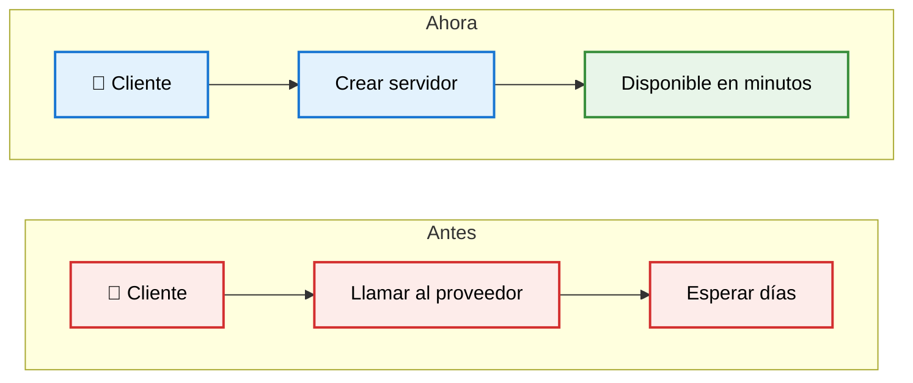
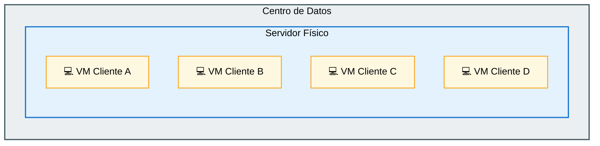
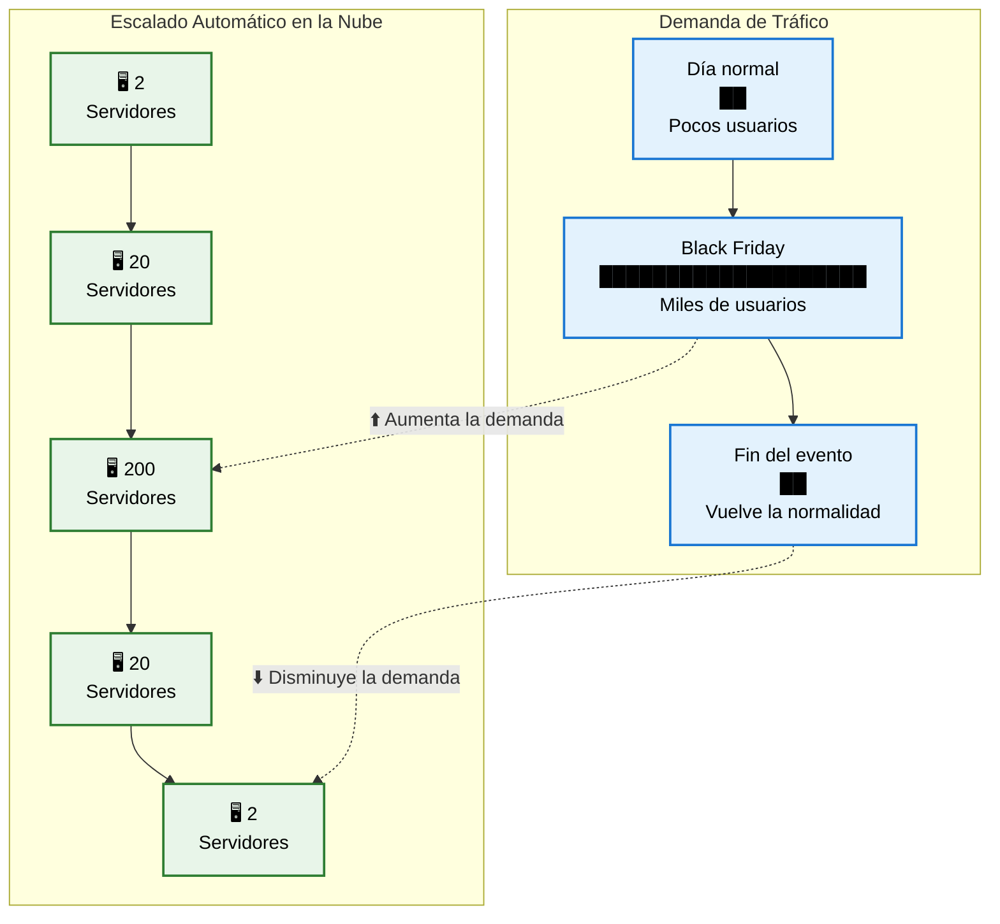

# Características del Cloud Computing

El **`NIST`** (National Institute of Standards and Technology, por sus siglas en inglés) define el Cloud Computing a través de cinco características esenciales que un servicio debe cumplir para ser considerado oficialmente como computación en la nube.

## 1. Autoservicio bajo demanda (On-Demand Self-Service)

Es la capacidad que tiene un usuario de obtener recursos informáticos cuando los necesita, sin tener que contactar a una persona del proveedor.

El usuario puede crear, modificar o eliminar recursos mediante una interfaz web, una aplicación o una API. Todo el proceso ocurre de forma automática.

**Por ejemplo**: En **`AWS`** puedes crear un servidor EC2 en menos de cinco minutos desde la consola o mediante una API.

**Beneficios**:

- Rapidez
- Automatización
- Independencia
- Menor tiempo de espera.
- Mayor productividad.
- Menos intervención humana.

## 2. Acceso amplio a la red (Broad Network Access)

Los servicios en la nube deben estar disponibles a través de la red y poder accederse desde diferentes dispositivos utilizando protocolos estándar de Internet.

No importa si utilizas:

- Computadora
- Celular
- Tablet
- Laptop
- Smart TV

Siempre podrás acceder al servicio desde cualquier lugar con conexión a Internet.

**Beneficios**

- Acceso desde cualquier lugar.
- Compatibilidad con múltiples dispositivos.
- Trabajo remoto.
- Colaboración global.

## 3. Agrupación de recursos (Resource pooling)

El proveedor agrupa todos sus recursos físicos y virtuales para atender simultáneamente a múltiples clientes. Los recursos se asignan dinámicamente según la demanda.

**¿Qué significa?**

AWS, Azure y Google Cloud poseen millones de servidores. Todos esos servidores forman un enorme conjunto de recursos.

Cuando solicitas una máquina virtual, el proveedor toma uno de esos recursos disponibles y te lo asigna automáticamente. No sabes exactamente cuál servidor físico estás utilizando.

>**Multi-Tenancy**: Muchos clientes comparten la misma infraestructura física de forma segura.

**Beneficios**:

- Menor costo
- Mayor eficiencia
- Mejor utilización del hardware
- Escalabilidad.
- Compartición segura.

## 4. Elasticidad rápida (Rapid elasticity)

Los recursos pueden aumentar o disminuir automáticamente según la demanda. El usuario percibe que los recursos disponibles son prácticamente ilimitados.

**¿Qué significa?**

- **Si tu aplicación recibe muchos usuarios**: el proveedor agrega servidores automáticamente.
- **Cuando baja el tráfico**: elimina los servidores que ya no son necesarios.

Todo ocurre en minutos o incluso segundos.

**Por ejemplo**: Una tienda en línea recibe:

- 500 usuarios normalmente.
- 100 000 usuarios durante el Black Friday.

La nube puede aumentar automáticamente el número de servidores para soportar el tráfico y reducirlos cuando termina el evento.

**Beneficios**:

- Mejor experiencia para los usuarios
- Evita caídas del sistema.
- Mejor rendimiento.
- Pago únicamente por lo utilizado.
- Escalabilidad automática.

## 5. Servicio medido (Measured service)

El uso de los recursos es monitoreado, medido y registrado automáticamente. Esto permite aplicar un modelo de pago por uso (**Pay-as-you-go**), donde solo se factura estrictamente lo que se consume, garantizando métricas precisas para la gestión de costos.

**¿Qué significa?**

El proveedor mide continuamente aspectos como:

- Horas de uso de máquinas virtuales.
- Almacenamiento utilizado.
- Tráfico de red.
- Uso de CPU.
- Uso de memoria.
- Solicitudes realizadas.

Con base en estas métricas genera la facturación.

**Por jemplo**: Si utilizas un servidor durante 10 horas, solo pagas esas 10 horas.

**Beneficios**:

- Pago por uso (Pay-as-you-go).
- Transparencia en el consumo.
- Optimización de costos.
- Control del presupuesto.
- Monitoreo continuo.

## Cómo se relacionan entre sí

Estas cinco características no funcionan de manera aislada; se complementan para ofrecer la experiencia de la nube:

- **On-Demand Self-Service** permite crear recursos cuando los necesitas.
- **Broad Network Access** hace que esos recursos estén disponibles desde cualquier lugar y dispositivo.
- **Resource Pooling** permite que el proveedor comparta eficientemente su infraestructura entre muchos clientes.
- **Rapid Elasticity** ajusta automáticamente la cantidad de recursos según la demanda.
- **Measured Service** registra el consumo para que pagues solo por lo que utilizas.

**Por ejemplo**, imagina que lanzas una aplicación web en la nube. Tú mismo despliegas un servidor en minutos (On-Demand Self-Service), lo administras desde tu portátil o celular (Broad Network Access), el servidor utiliza infraestructura compartida con otros clientes sin comprometer la seguridad (Resource Pooling), durante una campaña de marketing la plataforma agrega más instancias para soportar el aumento de usuarios (Rapid Elasticity) y, al finalizar el mes, recibes una factura basada en las horas de cómputo, el almacenamiento y el tráfico realmente consumidos (Measured Service).