# Serverless


Cuando comenzó la computación, las empresas tenían que comprar sus propios servidores. Luego apareció la virtualización y las máquinas virtuales. Más adelante llegaron los contenedores.

Finalmente apareció un modelo donde el desarrollador **ya no administra servidores**. Ese modelo se llama **Serverless Computing**. Pero aquí ocurre algo curioso: **los servidores siguen existiendo**. Lo que cambia es **quién los administra**.

Toda la infraestructura subyacente es administrada por el proveedor de servicios en la nube (como AWS, Azure o Google Cloud). Tú solo te encargas de **escribir y desplegar el código**.

## 1. ¿Qué es Serverless?

**Serverless**, o **arquitectura sin servidor**, es un modelo de ejecución en la nube en el cual el proveedor de servicios gestiona automáticamente la **infraestructura, el escalado y el mantenimiento** necesarios para ejecutar el código de una aplicación.

En lugar de aprovisionar, escalar y administrar servidores, los desarrolladores escriben y despliegan **funciones**: bloques pequeños y específicos de código que:

- se ejecutan **bajo demanda** (solo cuando ocurre un evento),
- son **escaladas automáticamente** por el proveedor,
- se **apagan cuando terminan** (no cobran por tiempo ocioso).

El término también se refiere a este modelo en el que los detalles del servidor están **completamente abstraídos** del desarrollador: no simplifica solo el proceso de desarrollo, sino que **reduce el coste** al facturar únicamente por el tiempo de ejecución y los recursos realmente utilizados.


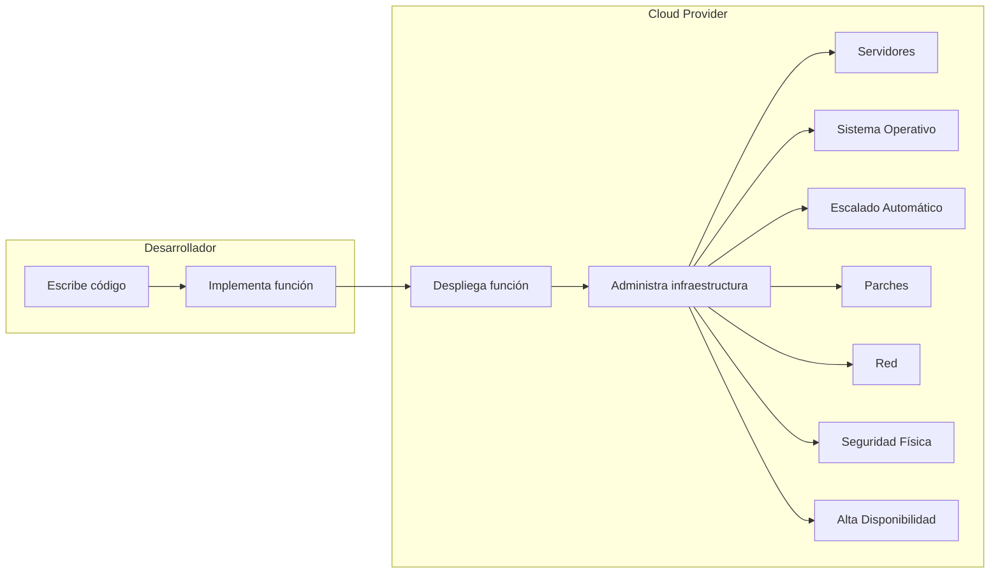

### 1.1 Dos pilares del Serverless

| Pilar | Sigla | Qué es | Ejemplos |
|---|---|---|---|
| **Función como Servicio** | FaaS | Ejecutas **tu propio código** en respuesta a eventos, sin servidores. | AWS Lambda, Azure Functions, Google Cloud Functions |
| **Backend como Servicio** | BaaS | Usas **servicios gestionados** ya construidos (auth, base de datos, almacenamiento) sin escribir su código. | Cognito, DynamoDB, S3, Firebase Auth |

> **Nota**: cuando hablamos de "funciones serverless" nos referimos al modelo **FaaS**; cuando la app usa servicios gestionados sin servidores propios, hablamos de **BaaS**. Las arquitecturas serverless reales combinan ambos.

:::info Idea clave
Serverless = **FaaS** (tu código ejecutado bajo demanda) + **BaaS** (servicios gestionados). El proveedor se encarga de servidores, escalado y parches; tú pagas por ejecución y por uso real.
:::


## 2. ¿Por qué surgió Serverless?

El Serverless no nació por capricho: resolvió problemas reales que el modelo de servidores (físicos, virtuales o en contenedores) no podía resolver bien.

### 2.1 Los problemas del modelo tradicional

| Problema | Explicación |
|---|---|
| **Sobredimensionamiento** | Aprovisionas un servidor para el "peor día" y pagas por capacidad que casi nunca usas. |
| **Capacidad ociosa** | Los servidores están encendidos 24/7 aunque el tráfico real sea mínimo. |
| **Escalado manual** | Añadir servidores requiere previsión, configuración y tiempo. |
| **Gestión continua** | Parches, actualizaciones de SO, seguridad y monitoreo del servidor son trabajo constante. |
| **Coste fijo** | Pagas por la capacidad, no por el uso. Un servidor vacío cuesta igual que uno a plena carga. |
| **Fricción para el desarrollador** | El foco se desplaza a la infraestructura en lugar del código. |

### 2.2 Lo que Serverless resuelve

- **Pago por uso real**: si nadie llama a tu función, cuesta **0$**.
- **Escalado automático**: de 0 a miles de ejecuciones simultáneas sin intervención.
- **Cero gestión**: no hay SO que parchear ni servidor que vigilar.
- **Foco en el código**: el desarrollador publica una función y termina.

> **Importante**: Serverless no elimina el coste de infraestructura; lo **traslada** al proveedor y lo **reparte** entre todos los clientes. Por eso el precio por ejecución puede ser tan bajo.

:::info Idea clave
Serverless surgió para eliminar los tres grandes males del modelo tradicional: **capacidad ociosa, escalado manual y gestión de servidores**. Su propuesta es simple: paga solo por lo que ejecutas y deja que el proveedor escale por ti.
:::


## 3. Evolución de la infraestructura

Para entender Serverless hay que ver de dónde viene. Cada etapa resolvió los problemas de la anterior, pero introdujo nuevos retos.

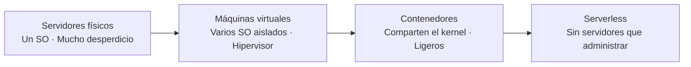

### 3.1 Servidores físicos

Un servidor físico ejecuta **un solo sistema operativo**. Si la aplicación solo usa el 20% de su capacidad, el 80% se desperdicia.

- **Ventaja**: control total.
- **Problema**: subutilización, coste fijo alto, aprovisionamiento lento (semanas).

### 3.2 Máquinas virtuales

La **virtualización** permite ejecutar varios sistemas operativos aislados en el mismo hardware, gestionados por un **hipervisor**.

- **Ventaja**: mejor aprovechamiento del hardware, aislamiento.
- **Problema**: cada VM sigue siendo un SO completo que hay que administrar, parchear y dimensionar; el arranque toma minutos.

### 3.3 Contenedores

Los **contenedores** comparten el **kernel** del host y aíslan la aplicación con sus dependencias. Son mucho más ligeros que una VM.

- **Ventaja**: arranque casi instantáneo, alta densidad, portabilidad.
- **Problema**: el desarrollador aún gestiona clústeres (si usa Kubernetes), redes, volúmenes y monitoreo de los contenedores.

### 3.4 Serverless

Con Serverless desaparece el último escalón que gestionaba el desarrollador: **el servidor (físico, virtual o contenedor)**. El proveedor ejecuta la función en el contenedor que mejor le convenga, lo escala y lo apaga por ti.

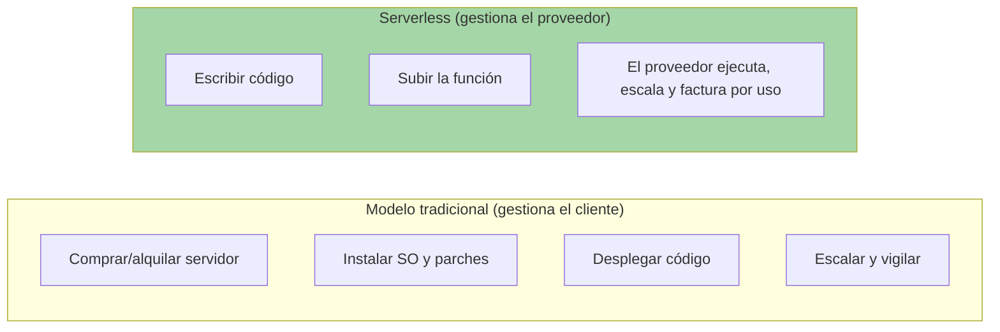

| Etapa | Quién administra el servidor | Quién escala | Unidad de ejecución | Aprovisionamiento |
|---|---|---|---|---|
| Servidor físico | Tú | Tú | Máquina completa | Semanas |
| Máquina virtual | Tú | Tú | VM completa | Minutos |
| Contenedor | Tú (parcial) | Tú / orquestador | Proceso aislado | Segundos |
| **Serverless** | **El proveedor** | **El proveedor** | **Función** | **Automático** |

:::info Idea clave
La evolución **Servidor físico → VM → contenedor → serverless** es una historia de **abstracción creciente**: cada etapa le quita al desarrollador responsabilidades de infraestructura hasta dejarlo con una sola tarea: escribir código.
:::


## 4. ¿Qué significa realmente "Serverless"?

Es la pregunta más confusa del tema, y la respuesta es casi una paradoja:

>Serverless **NO significa que no existan servidores**. Los servidores siempre existen. Significa que **no los administras tú**.

### 4.1 Qué está oculto detrás de una función

Cuando subes una función a AWS Lambda, por debajo hay:

- un **servidor** físico del proveedor,
- una **máquina virtual** (o un entorno Firecracker/microVM) aislada,
- un **contenedor** o runtime que ejecuta tu código,
- un **SO** con parches y actualizaciones,
- una **red** y un sistema de **escalado automático**.

Todo eso lo gestiona el proveedor. Tú solo interactúas con la función.

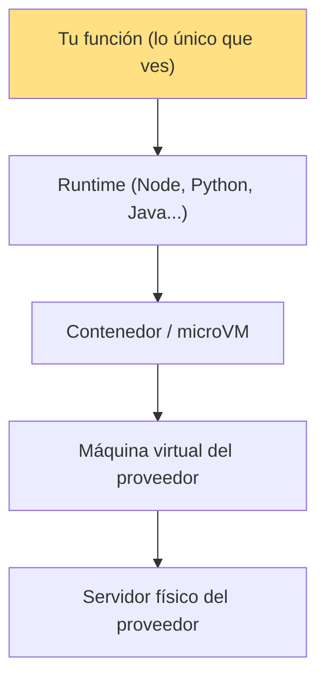

### 4.2 El término "sin servidor" en dos sentidos

| Interpretación | Significado |
|---|---|
| **Sin servidores que administrar** | No provisionas, parcheas ni escalas ningún servidor. |
| **Sin servidores siempre encendidos** | El código se ejecuta solo cuando ocurre un evento y se apaga al terminar. |

:::info Idea clave
"Serverless" se refiere a la **experiencia** del desarrollador, no a la tecnología: los servidores existen, pero el proveedor los abstrae por completo. Tú escribes código; el proveedor se ocupa de **todo lo demás**.
:::

## 5. Cómo funciona internamente una arquitectura Serverless

Cuando ocurre un evento, el proveedor debe ejecutar tu función. El proceso interno, simplificado, es:

1. **Llega el evento** (una petición HTTP, un archivo subido a S3, un mensaje en una cola, un cron).
2. El **controlador** del proveedor detecta el evento y decide qué función debe ejecutarse.
3. Busca (o crea) un **entorno de ejecución** disponible (un contenedor con tu runtime y tu código).
4. **Inyecta el evento** como entrada (JSON) en la función.
5. Tu función se ejecuta con una **memoria y tiempo máximos** configurados.
6. El resultado se devuelve al origen del evento (o a otro servicio).
7. El entorno se **recicla**: se mantiene un tiempo para reutilizarlo (warm) y luego se **destruye**.
8. El proveedor **factura** los recursos usados y registra logs y métricas.

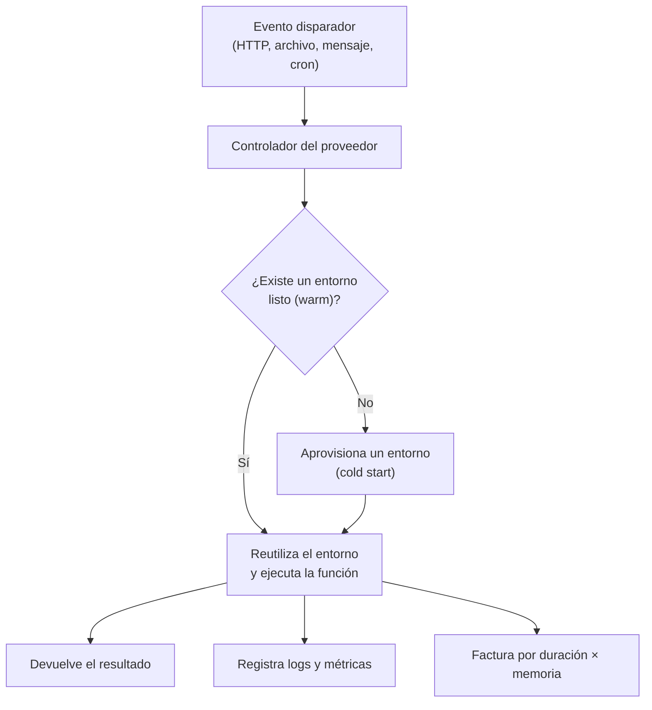

> **Nota**: la función **no tiene dirección IP propia ni acceso directo a la red de tu VPC** por defecto; el proveedor la aísla. Cuando se necesita acceder a una red privada (una base de datos interna), se configura una **VPC** (en AWS) o integraciones equivalentes.

:::info Idea clave
Internamente, una arquitectura serverless es un **orquestador de entornos de ejecución**: un evento llega → el proveedor encuentra o crea un contenedor → ejecuta tu función → devuelve el resultado → destruye o recicla el entorno → factura y registra todo. Tú solo ves la función.
:::


## 6. Componentes principales

Una arquitectura serverless no es solo "funciones". Se compone de piezas que trabajan juntas:

| Componente | Rol | Ejemplos |
|---|---|---|
| **Función (FaaS)** | El código que se ejecuta bajo demanda. | AWS Lambda, Azure Functions, Google Cloud Functions |
| **Trigger / Event source** | El evento que dispara la función. | HTTP, S3, colas, cron, IoT |
| **API Gateway** | Expone funciones como APIs HTTP públicas. | Amazon API Gateway, Azure API Management, Cloud API Gateway |
| **Base de datos gestionada** | Almacena datos sin administrar servidores de BD. | DynamoDB, Aurora Serverless, Cosmos DB, Firestore |
| **Almacenamiento de objetos** | Archivos, imágenes y estáticos. | S3, Blob Storage, Cloud Storage |
| **Mensajería / colas** | Desacopla servicios y procesa de forma asíncrona. | SQS, SNS, EventBridge, Event Grid, Pub/Sub |
| **Autenticación** | Identidad y control de acceso. | Cognito, Entra ID (Azure AD), Firebase Auth |
| **Observabilidad** | Logs, métricas y trazas. | CloudWatch, Application Insights, Cloud Logging |

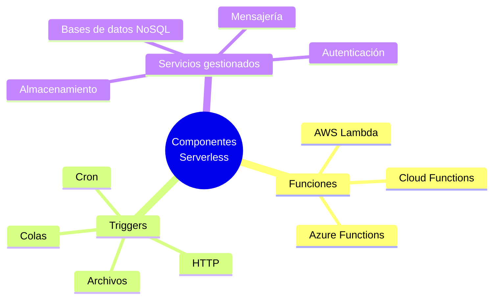

:::info Idea clave
Serverless es un **ecosistema**, no una pieza suelta: funciones (FaaS) + disparadores + servicios gestionados (BaaS) + API Gateway + observabilidad. El valor está en cómo estas piezas se **conectan por eventos**.
:::


## 7. Arquitectura general

### 7.1 Arquitectura Serverless típica

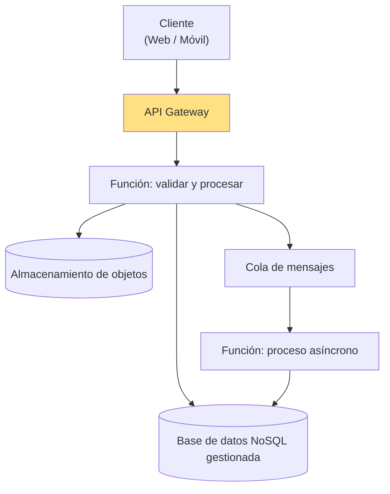

### 7.2 Flujo de una petición HTTP hacia una función

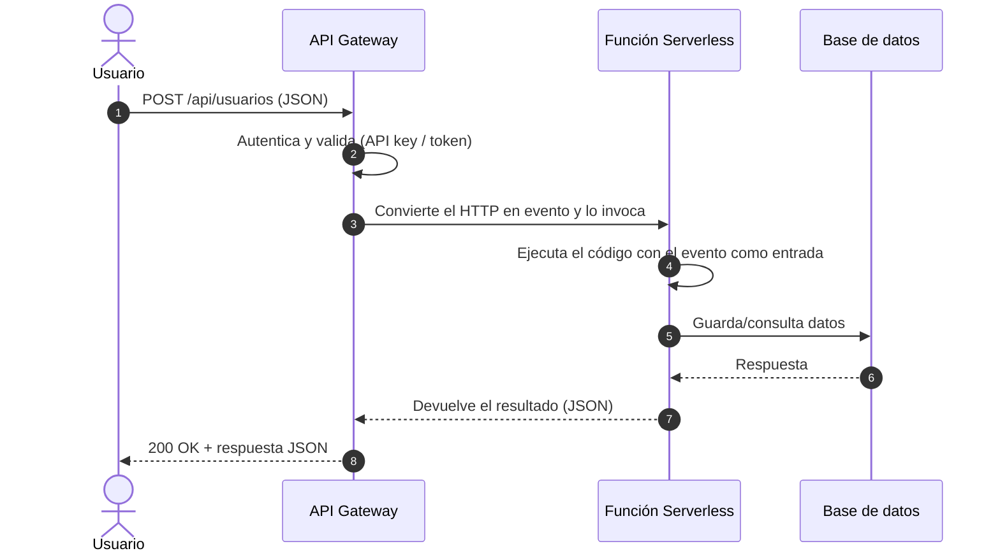

:::info Idea clave
La arquitectura serverless es **evento → función → servicios gestionados**: el API Gateway expone el HTTP, las funciones contienen la lógica y las bases de datos/colas/almacenamiento se consumen como servicios sin servidores propios.
:::


## 8. Modelo de ejecución basado en eventos (Event-Driven)

El corazón de Serverless es el **evento**: cualquier suceso del sistema que puede disparar código.

### 8.1 Qué es un evento

Un evento es una **notificación estructurada** de que algo ha ocurrido. En el mundo serverless casi todo es un evento:

| Evento | Ejemplo concreto | Función que se dispara |
|---|---|---|
| Petición HTTP | `POST /api/pedidos` | Procesa el pedido |
| Archivo subido | Un PDF llega a S3 | Extrae el texto y lo indexa |
| Mensaje en cola | Se encola un trabajo | Procesa el trabajo en background |
| Cambio en base de datos | Se inserta una fila | Actualiza un índice o notifica |
| Programado (cron) | Todos los días a las 02:00 | Genera un informe |
| Evento IoT | Un sensor envía datos | Analiza y almacena la lectura |

### 8.2 Arquitectura basada en eventos

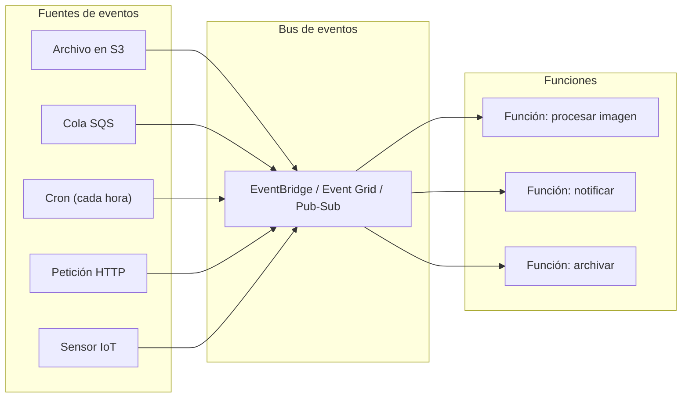

### 8.3 Desacoplamiento y procesamiento asíncrono

Gracias a los eventos, los servicios **no se llaman directamente**: publican eventos y las funciones reaccionan. Esto desacopla el sistema:

- El productor no necesita saber quién consume el evento.
- Se pueden añadir nuevos consumidores sin tocar a los existentes.
- Los trabajos pesados se mueven a **procesos asíncronos** (colas) que no bloquean la respuesta al usuario.

:::info Idea clave
Serverless es **nativo de eventos**: tu código no "corre todo el tiempo", reacciona. Los eventos (HTTP, archivos, colas, cron, IoT) llegan, disparan funciones y el sistema se mantiene desacoplado y escalable.
:::

## 9. Cómo escala una función

Cada **invocación simultánea** crea una ejecución nueva. Si llegan 1.000 peticiones a la vez, el proveedor ejecuta tu función **1.000 veces en paralelo**, repartiendo la carga.

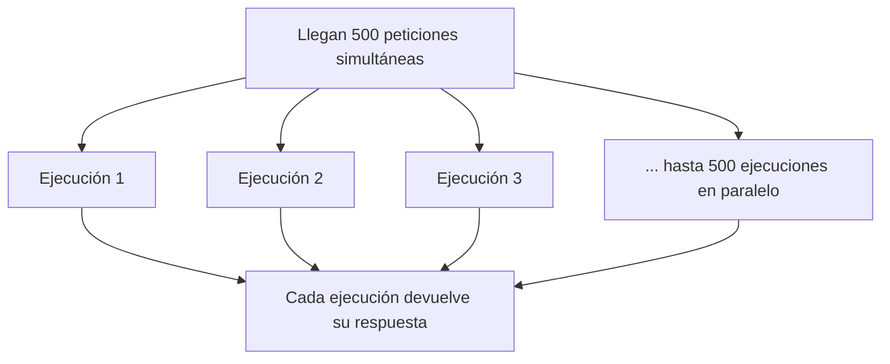

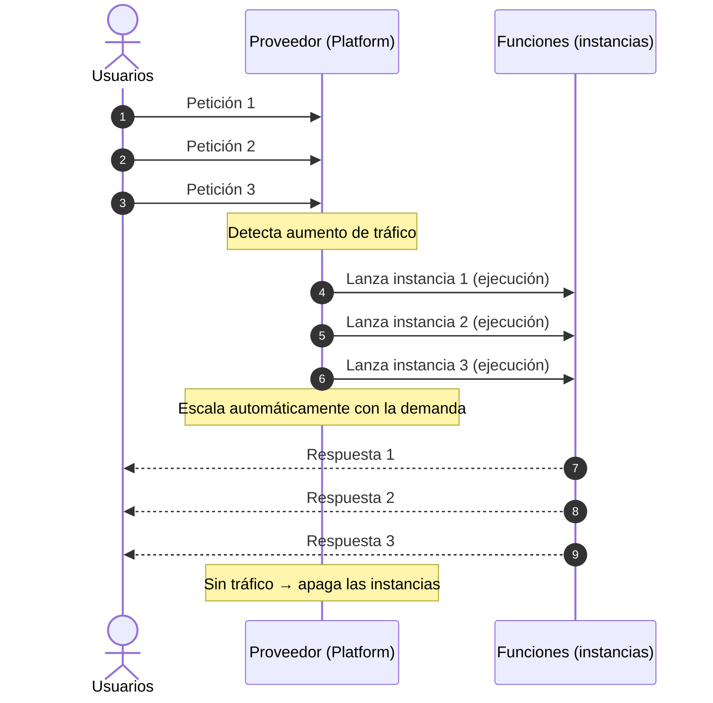

> **Nota**: el escalado automático tiene límites configurables (cuotas de concurrencia). Si se superan, las peticiones esperan o reciben error `429`. No es "escalado infinito gratuito".

:::info Idea clave
Serverless escala **de 0 a miles de ejecuciones en paralelo automáticamente**: cada petición simultánea genera una ejecución nueva. No hace falta prever la demanda ni dimensionar servidores: el proveedor lo hace en tiempo real.
:::

## 10. Pago por uso (Pay-as-you-go)

En un servicio FaaS típico (AWS Lambda), se factura:

1. **Número de invocaciones** (cada ejecución de la función).
2. **Duración** (tiempo de ejecución, redondeado al milisegundo o al incremento configurado).
3. **Memoria asignada** (cuanta más memoria, más caro por segundo).
4. **Transferencia de datos** hacia Internet.

```txt
Coste ≈ invocaciones × duración × memoria asignada + transferencia de datos
```

> **Consejo**: "serverless no cuesta nada" es falso. Cuesta **poco cuando hay poco tráfico y caro cuando hay muchísimo**. Con volúmenes altos y sostenidos, una VM o un contenedor puede salir más barato. El coste hay que calcularlo, no asumirlo.

:::info Idea clave
Serverless introduce el modelo **pago por ejecución**: sin invocaciones = sin coste. Pero el coste total depende del volumen real, la duración y la memoria; para cargas altas y constantes conviene compararlo con VMs o contenedores antes de decidir.
:::

## 11. Ciclo de vida de una función Serverless

Cada invocación recorre un ciclo: **crear entorno → ejecutar → devolver resultado → reciclar**.

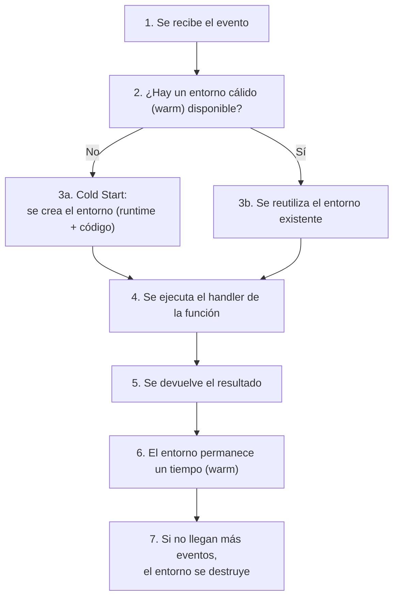

| Fase | Qué ocurre |
|---|---|
| **Inicialización** | El proveedor crea el entorno: carga el runtime y tu código. |
| **Ejecución** | Se llama a tu función (handler) con el evento de entrada. |
| **Finalización** | Se devuelve el resultado y se registran logs/métricas. |
| **Reciclado** | El entorno se mantiene caliente un tiempo; si no se usa, se destruye. |

> **Importante**: una función no es un servidor "siempre encendido". Su **tiempo máximo de ejecución está limitado** (en AWS Lambda, 15 minutos por invocación). Los trabajos que duran horas **no** son adecuados para FaaS.

:::info Idea clave
El ciclo de vida de una función es **crear → ejecutar → responder → reciclar**. Los entornos se reutilizan mientras haya tráfico (warm) y se destruyen en reposo. Y recuerda: cada invocación tiene un **tiempo máximo** (15 min en Lambda).
:::

## 12. Cold Start y Warm Start

Uno de los conceptos de rendimiento más importantes en Serverless.

### 12.1 Cold Start (arranque en frío)

Ocurre cuando llega una petición y **no hay ningún entorno listo** para ejecutar la función. El proveedor debe:

1. Reservar un contenedor/entorno.
2. Cargar el **runtime** (Node.js, Python, Java...).
3. Cargar tu **código**.
4. Inicializar dependencias y variables.

Todo eso añade latencia extra (desde decenas de milisegundos hasta varios segundos) **antes** de ejecutar tu función.

### 12.2 Warm Start (arranque en caliente)

Ocurre cuando la función se ejecutó **recientemente** y el entorno sigue **caliente** en el proveedor. La ejecución es inmediata.

### 12.3 Diagrama de flujo

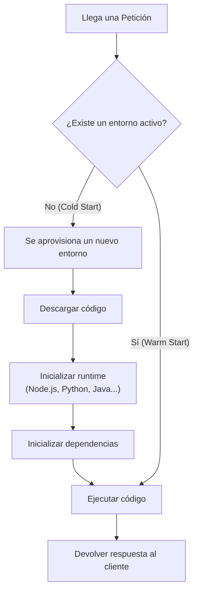

| Aspecto | Cold Start | Warm Start |
|---|---|---|
| Qué es | Primera invocación (o tras reposo) | Invocación con entorno ya cargado |
| Latencia extra | Alta (ms a segundos) | Casi nula |
| Causa principal | No existe entorno listo | Tráfico constante |
| Cómo reducirlo | Provisioned Concurrency, runtime ligero, menos dependencias | Mantener tráfico constante |

> **Consejo**: para aplicaciones sensibles a la latencia (una API de login, una pasarela de pago), los cold starts importan. Se mitigan con **concurrencia provisionada** (entornos siempre encendidos) o eligiendo runtimes más rápidos.

:::info Idea clave
El **cold start** es la latencia de "primera vez" que paga Serverless por no tener servidores siempre encendidos: el proveedor crea el entorno al vuelo. El **warm start** ocurre cuando el entorno ya está caliente y la ejecución es inmediata. Es la principal desventaja de rendimiento a gestionar.
:::

## 13. Stateless vs Stateful

### 13.1 Stateless (sin estado)

Las funciones serverless son, por diseño, **stateless**: **no guardan información entre invocaciones**.

- Cada invocación recibe un evento y devuelve un resultado.
- No puedes confiar en que la memoria de una ejecución persista para la siguiente (el entorno puede reciclarse en cualquier momento).
- Todo dato que necesites conservar debe vivir en un **servicio externo**: base de datos, almacenamiento, caché.

### 13.2 Stateful (con estado)

Los sistemas **stateful** guardan estado entre llamadas: un servidor con sesiones en memoria, una base de datos, un sistema de archivos.

### 13.3 Comparación

| Aspecto | Stateless (Función) | Stateful (Servidor) |
|---|---|---|
| Estado entre llamadas | No | Sí |
| Escalado | Cada invocación es independiente | Hay que gestionar la sesión |
| Fallo de una instancia | No pierde nada relevante | Puede perder sesión |
| Dónde se guarda el estado | Servicio externo (BD, caché) | En memoria local |
| Analogía | Un cajero de supermercado: atiende, cobra y "olvida" | Una secretaria que recuerda todo sobre cada cliente |

> **Consejo**: si necesitas estado entre invocaciones, usa **DynamoDB/Redis** como capa de estado compartido y deja la función sin estado. Así escala sin problemas.

:::info Idea clave
Las funciones serverless son **stateless por diseño**: no confían en memoria entre invocaciones. El estado se externaliza a bases de datos, cachés o almacenamiento. Esa es la clave para que el escalado automático funcione sin errores.
:::

## 14. Ventajas y desventajas

### 14.1 Ventajas

| Ventaja | Descripción |
|---|---|
| **Cero gestión de infraestructura** | Sin SO, parches, servidores ni clústeres que administrar. |
| **Escalado automático** | De 0 a miles de ejecuciones sin intervención. |
| **Pago por uso** | Sin tráfico = sin coste. Ideal para cargas variables. |
| **Menor tiempo de comercialización** | El desarrollador se centra en el código, no en infraestructura. |
| **Alta disponibilidad** | El proveedor replica y protege el servicio por defecto. |
| **Desacoplamiento por eventos** | Sistemas más fáciles de ampliar y mantener. |

### 14.2 Desventajas

| Desventaja | Descripción |
|---|---|
| **Cold start** | Latencia en la primera invocación. |
| **Límite de tiempo de ejecución** | Máx. 15 minutos por invocación en AWS Lambda. |
| **Coste a gran escala** | Con tráfico altísimo y constante, puede superar a una VM. |
| **Menos control** | No eliges el SO, el runtime ni el hardware. |
| **Vendor lock-in** | Migrar de Lambda a Functions cuesta esfuerzo. |
| **Complejidad de depuración** | Es difícil reproducir localmente el entorno del proveedor. |
| **Arranques y estados** | Hay que diseñar sin estado y tolerar reintentos. |

:::info Idea clave
Serverless ofrece **agilidad, escala y coste bajo con poca carga**, a cambio de **control, límites de ejecución y riesgo de vendor lock-in**. La decisión de usarlo es un **análisis de compensaciones**, no una moda.
:::

## 15. Casos de uso reales

- **APIs y backends web/móvil**: REST API con API Gateway + funciones, ideal para arranques.
- **Procesamiento de archivos**: cuando un archivo sube a S3, se genera un thumbnail, se extrae texto o se convierte formato.
- **Tareas programadas (cron)**: informes diarios, limpieza de datos, backups, notificaciones.
- **Procesamiento de streams en tiempo real**: datos de IoT, análisis de clics, telemetría.
- **Integraciones y webhooks**: reaccionar a eventos de Stripe, GitHub o cualquier webhook externo.
- **Chatbots y asistentes de voz**: lógica conversacional sin servidores.
- **Automatización de operaciones**: guardias de seguridad, remediación, envío de correos.
- **ETL y transformación de datos**: mover y transformar datos entre servicios.
- **Aplicaciones de comercio electrónico**: manejar picos estacionales sin sobreaprovisionar.


## 16. Cuándo utilizar Serverless

| Señal | Por qué encaja |
|---|---|
| Carga **variable o impredecible** | El escalado automático absorbe picos sin coste fijo. |
| Eventos **intermitentes** (cron, webhooks, archivos) | No hay coste cuando no hay eventos. |
| Arranques con poco equipo | Cero operaciones, foco en el producto. |
| Funciones de **corta duración** | Dentro del límite de tiempo por invocación. |
| Necesidad de **alta disponibilidad rápida** | El proveedor la aporta por defecto. |
| **Prototipos y MVPs** | Iteración rápida con coste mínimo. |

## 17. Cuándo NO utilizar Serverless

| Señal | Por qué no encaja |
|---|---|
| Carga **constante y muy alta** | Una VM o contenedor sale más barato a gran escala. |
| **Trabajos de larga duración** | El límite de 15 min por invocación lo impide. |
| **Latencia ultrabaja** | Los cold starts afectan a cada nuevo burst. |
| **Requisito de control del entorno** | SO, runtime o hardware específicos que el proveedor no ofrece. |
| **Aplicaciones con estado intenso** | Difícil de modelar sin servidores con memoria. |
| **Cumplimiento o residencia estricta** | Datos que deben quedarse en sitios donde el proveedor no opera. |
| **Dependencias muy pesadas** | Empaquetar modelos de ML o librerías enormes es complicado. |

> **Consejo rápido**: "Serverless para lo corto, variable e intermitente; servidores para lo largo, constante y predecible."

:::info Idea clave
Serverless brilla con **cargas variables, funciones cortas y eventos intermitentes**; sufre con **cargas constantes y altas, trabajos largos y requisitos estrictos de control o latencia**. Elegir cuándo usarlo es parte del diseño.
:::

## 18. Buenas prácticas

- **Diseña funciones stateless**: todo el estado en servicios externos.
- **Mantén las funciones pequeñas y con una sola responsabilidad**.
- **Reduce el tamaño del paquete** (dependencias mínimas): menos paquete = menos cold start.
- **Usa concurrencia provisionada** para funciones críticas con latencia sensible.
- **Configura timeouts y memoria adecuados**: ni demasiado altos (coste) ni demasiado bajos (errores).
- **Maneja errores y reintentos**: las invocaciones pueden repetirse; el código debe ser idempotente.
- **Protege secretos**: usa servicios de gestión de secretos (Secrets Manager), nunca variables en el código.
- **Aplica el principio de mínimo privilegio**: el rol de la función solo con los permisos necesarios.
- **Usa colas para trabajo asíncrono**: no bloquees la respuesta al usuario con procesos pesados.
- **Monitoriza desde el día uno**: logs estructurados, métricas personalizadas y alarmas.
- **Mide los cold starts** antes de optimizar: no los optimices si no son un problema real.

## 19. Errores comunes

- **Guardar estado en variables de la función** (memoria entre invocaciones).
- **Exceder el tiempo máximo de ejecución** con procesos largos dentro de la función.
- **Ignorar los cold starts** y descubrirlos con tráfico real.
- **Dar permisos de más** al rol de la función (seguridad).
- **Cachear secretos en el código o en el paquete**.
- **No manejar reintentos**: si un evento se repite, el proceso debe ser idempotente.
- **Asumir que el entorno se mantiene entre invocaciones** (no es así).
- **Subir dependencias enormes** que alargan cada invocación.
- **No probar localmente** y desplegar funciones que fallan en el entorno del proveedor.
- **Escalar a ciegas**: no configurar límites de concurrencia para evitar facturas sorpresa.

## 20. Seguridad en arquitecturas Serverless

Aunque el proveedor gestiona la infraestructura, la seguridad **no desaparece**: cambia de responsabilidad (modelo de responsabilidad compartida).

### 20.2 Riesgos específicos de Serverless

| Riesgo | Explicación |
|---|---|
| **Permisos excesivos** | Roles de la función demasiado amplios (ej. acceso a todos los buckets). |
| **Inyección de eventos** | Los datos de entrada (JSON) pueden contener código malicioso. |
| **Secretos expuestos** | Claves en variables de entorno o en el paquete. |
| **Dependencias vulnerables** | Librerías con vulnerabilidades dentro de tu función. |
| **Denial of service** | Abuso de API Gateway / funciones sin rate limiting. |
| **Vendor lock-in de seguridad** | Confiar en configuraciones específicas difíciles de migrar. |

### 20.3 Buenas prácticas de seguridad

- **Principio de mínimo privilegio**: el rol de cada función solo con lo necesario.
- **Valida y sanitiza** todas las entradas (eventos, JSON, URLs).
- **Gestiona secretos** con un servicio dedicado (AWS Secrets Manager, Azure Key Vault, GCP Secret Manager).
- **Escanea dependencias** y mantén los runtimes actualizados.
- **Configura rate limiting** en el API Gateway.
- **Cifra los datos** en reposo y en tránsito.
- **Usa VPC** solo cuando la función deba alcanzar recursos privados, con la menor exposición posible.

> **Nota**: el modelo de responsabilidad compartida sigue vigente. El proveedor asegura la **plataforma**; tú aseguras tu **código, datos y permisos**.

:::info Idea clave
Serverless no elimina la seguridad, la **reubica**: el proveedor protege la plataforma y tú proteges **código, datos, permisos y secretos**. El mínimo privilegio y la validación de eventos son tus defensas principales.
:::

## 21. Monitoreo y observabilidad

Sin servidores visibles, **¿cómo sabes qué pasa?** La respuesta: observabilidad nativa del proveedor.

### 21.1 Qué observar

| Señal | Qué detecta |
|---|---|
| Invocaciones (éxito/error) | Salud de la función |
| Duración (p50/p99) | Rendimiento y cold starts |
| Errores y excepciones | Fallos de código o integración |
| Cold starts | Latencia de "primera vez" |
| Tiempo de espera en colas | Acumulación de trabajo |
| Coste por función | Gastos inesperados |

### 21.2 Las tres columnas de la observabilidad

1. **Métricas**: números agregados (duración, errores, invocaciones).
2. **Logs**: registros estructurados por invocación.
3. **Trazas distribuidas**: el recorrido de una petición entre Gateway, función y base de datos (X-Ray, Application Insights, Cloud Trace).

| Proveedor | Métricas | Trazas |
|---|---|---|
| AWS | CloudWatch | AWS X-Ray |
| Azure | Application Insights | Application Insights |
| Google Cloud | Cloud Logging / Monitoring | Cloud Trace |

> **Consejo**: añade un `logger` estructurado en cada función e incluye el `requestId`/`traceId` en cada log. Sin eso, diagnosticar es adivinar.

:::info Idea clave
En Serverless la observabilidad es **tu única ventana al sistema**: métricas, logs y trazas nativas del proveedor (CloudWatch, Application Insights, Cloud Logging). Si no monitorizas invocaciones, errores, duración y coste, estás operando a ciegas.
:::

## 22. Implementaciones en la nube

### 22.1 AWS

| Servicio | Rol |
|---|---|
| **AWS Lambda** | Función como servicio (FaaS) |
| **Amazon API Gateway** | Expone las funciones como APIs HTTP |
| **Amazon EventBridge** | Bus de eventos que conecta servicios |
| **Amazon DynamoDB** | Base de datos NoSQL gestionada |
| **Amazon S3** | Almacenamiento de objetos |

Ejemplo típico:

```txt
API Gateway → Lambda → DynamoDB
```

- **Lambda**: código en Node, Python, Java, Go, .NET, Ruby, etc. Límite: 15 min por invocación. Concurrencia provisionada para reducir cold starts.
- **API Gateway**: recibe el HTTP, autentica (IAM, Cognito, API keys, Lambda authorizers) e invoca Lambda con el evento.
- **EventBridge**: ruta los eventos de los servicios (S3, DynamoDB, cron, servicios SaaS) hacia las funciones.
- **DynamoDB**: base de datos clave-valor y documentos, con **Streams** que disparan funciones ante cambios.
- **S3**: eventos de subida/borrado de objetos que invocan funciones.

### 22.2 Microsoft Azure

| Servicio | Rol |
|---|---|
| **Azure Functions** | Función como servicio (FaaS) |
| **Azure API Management / Functions triggers** | Exposición HTTP |
| **Azure Event Grid** | Bus de eventos |
| **Azure Cosmos DB** | Base de datos NoSQL gestionada |
| **Azure Blob Storage** | Almacenamiento de objetos |

Ejemplo típico:

```txt
HTTP trigger → Azure Function → Cosmos DB
```

- **Azure Functions** admite triggers de HTTP, Blob, Queue, Timer, Event Grid, Event Hubs, Service Bus y más.
- **Consumption Plan** (pago por ejecución) o **Premium Plan** (sin cold starts, más control).
- **Durable Functions**: extienden el modelo para orquestar flujos de larga duración.

### 22.3 Google Cloud

| Servicio | Rol |
|---|---|
| **Google Cloud Functions** | Función como servicio (FaaS) |
| **Cloud Run** | Contenedores serverless (sin nodos que administrar) |
| **Cloud API Gateway / Cloud Endpoints** | Exposición HTTP |
| **Cloud Pub/Sub** | Mensajería y eventos |
| **Firestore / Cloud Firestore** | Base de datos NoSQL gestionada |
| **Cloud Storage** | Almacenamiento de objetos |

Ejemplo típico:

```txt
Cloud Functions (HTTP trigger) → Cloud Firestore
```

- **Cloud Functions**: función por evento (HTTP, Cloud Storage, Pub/Sub, Firestore, cron).
- **Cloud Run**: contenedor "serverless": despliegas una imagen y el proveedor escala los contenedores automáticamente. Es el puente entre contenedores y serverless.
- **Cloud Pub/Sub**: bus de mensajería que conecta servicios y funciones.
