# Virtualización

La **virtualización** es una de las tecnologías más importantes que hicieron posible el nacimiento y crecimiento del Cloud Computing. Sin ella, servicios como Amazon EC2, Azure Virtual Machines o Google Compute Engine no existirían tal como los conocemos.

En pocas palabras:

>La **virtualización** permite que un solo servidor físico se comporte como si fueran varios servidores independientes.

Gracias a esto, un proveedor de nube puede aprovechar mucho mejor su infraestructura y ofrecer recursos bajo demanda a millones de usuarios.


## 1. ¿Qué es la virtualización?

### 1.1 Definición

La **virtualización** es una tecnología que permite crear una **versión virtual (lógica) de un recurso físico**. Ese recurso puede ser:

- un servidor (CPU y memoria RAM)
- un disco de almacenamiento
- una tarjeta de red o la propia red
- un sistema operativo
- una aplicación

En lugar de depender completamente del hardware físico, los recursos son administrados por una capa de software llamada **hipervisor**, que los divide y los asigna de forma segura a cada entorno virtual.

:::tip Ejemplo sencillo: la casa de apartamentos
Imagina que tienes una casa enorme. Normalmente esa casa sería ocupada por una sola familia.

```txt
┌────────────────────────────┐
│          CASA              │
│                            │
│      Una sola familia      │
└────────────────────────────┘
```

Ahora decides dividir la casa. Construyes paredes internas y haces apartamentos independientes.

```txt
┌────────────────────────────┐
│ Apartamento A │Apartamento B│
│───────────────┼─────────────│
│ Apartamento C │Apartamento D│
└────────────────────────────┘
```

Ahora:

- cada familia tiene su propio espacio
- cada una tiene su cocina y su baño
- viven de forma independiente y sin molestarse

Pero realmente todas siguen dentro de la **misma casa**. Eso mismo hace la virtualización: la casa es el **servidor físico** y los apartamentos son las **máquinas virtuales**.
:::

### 1.2 ¿Por qué existe?

Antes de la virtualización, un servidor físico ejecutaba **un solo sistema operativo** con sus aplicaciones. Ese modelo tenía graves problemas:

- **Subutilización**: un servidor que usaba solo el 20% de su capacidad desperdiciaba el 80% restante.
- **Costes elevados**: cada aplicación necesitaba su propio hardware, energía, refrigeración y espacio en el centro de datos.
- **Despliegue lento**: aprovisionar un nuevo servidor podía llevar semanas (pedido, instalación, configuración).
- **Aislamiento pobre**: si una aplicación fallaba o era vulnerable, podía afectar a todo el servidor.

La virtualización nació para resolver estos problemas, permitiendo ejecutar **varios sistemas operativos aislados sobre un mismo hardware**.

### 1.3 Conceptos fundamentales

Antes de profundizar, es imprescindible dominar el vocabulario básico:

| Término | Significado |
|---|---|
| **Host (anfitrión)** | El servidor físico real que aporta los recursos (CPU, RAM, disco, red). |
| **Máquina Virtual (VM)** | Un "computador" lógico creado por software sobre el host, con su propio sistema operativo, memoria, CPU virtual y discos. |
| **Guest (huésped)** | El sistema operativo que se ejecuta **dentro** de una máquina virtual (ej. Linux dentro de una VM en Windows). |
| **Hipervisor / VMM** | El software que crea, ejecuta y administra las máquinas virtuales, repartiendo el hardware del host. |
| **Recursos virtualizados** | CPU, RAM, disco y red presentados a la VM como si fueran hardware real (vCPU, vRAM, vDisk, vNIC). |
| **Imagen de disco virtual** | Archivo (`.vmdk`, `.vhdx`, `.qcow2`, `.vhd`) que contiene el disco de la VM. |
| **Plantilla (template)** | Imagen de una VM preconfigurada que se usa para clonar muchas VM idénticas rápidamente. |

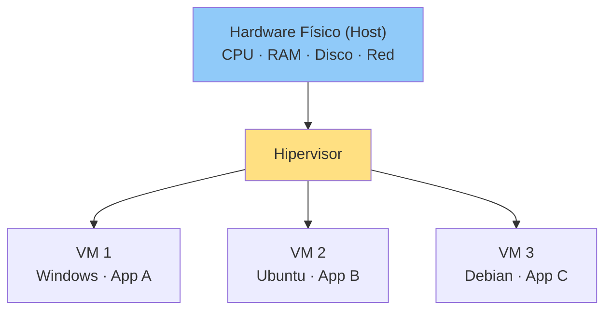

> **Idea clave**: cada VM cree que tiene su propio servidor físico completo, pero en realidad todas comparten el hardware real que reparte el hipervisor.

:::info Resumen
La virtualización separa el **hardware físico** del **software** mediante una capa intermedia (el hipervisor). Esto permite ejecutar múltiples sistemas operativos aislados en un solo servidor, aprovechando mejor la infraestructura.
:::

## 2. ¿Cómo funciona la virtualización?

### 2.1 La capa del hipervisor

La virtualización funciona con una pieza de software llamada **hipervisor** (o *Virtual Machine Monitor*, VMM), que se coloca **entre el hardware físico y los sistemas operativos guest**.

Su trabajo es:

- **Crear** y **eliminar** máquinas virtuales.
- **Repartir** la CPU, la memoria, el disco y la red entre las VM.
- **Aislar** cada VM para que ninguna interfiera con las demás.
- **Traducir** las peticiones de hardware de las VM al hardware real.

### 2.2 El problema que resuelve: las instrucciones privilegiadas

Los sistemas operativos están diseñados para ejecutarse con **privilegios totales sobre el hardware**. Para hacer posible que varios SO compartan una misma CPU, las arquitecturas modernas definen **niveles de privilegio (anillos)**:

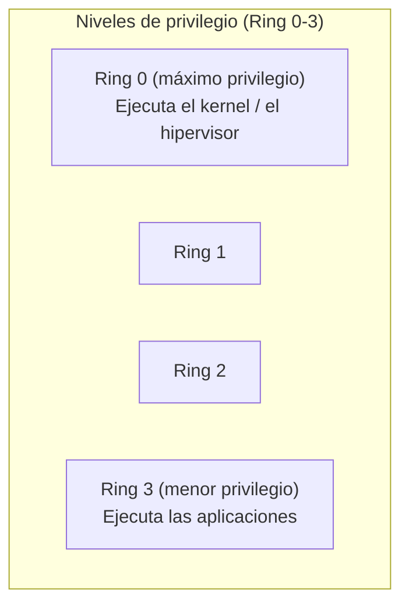

- El **hipervisor** ocupa el nivel más privilegiado (Ring 0 o modo *root*).
- Las **máquinas virtuales** ejecutan sus sistemas operativos en un nivel inferior (o en el modo *no-root* que añaden Intel VT-x / AMD-V).

Cuando una VM intenta ejecutar una instrucción privilegiada (como acceder a la memoria o al disco), el hardware **intercepta la instrucción (trap)** y se la entrega al hipervisor. El hipervisor la ejecuta en nombre de la VM y le devuelve el resultado. Esta técnica se llama **trap-and-emulate** y es el corazón de la virtualización.

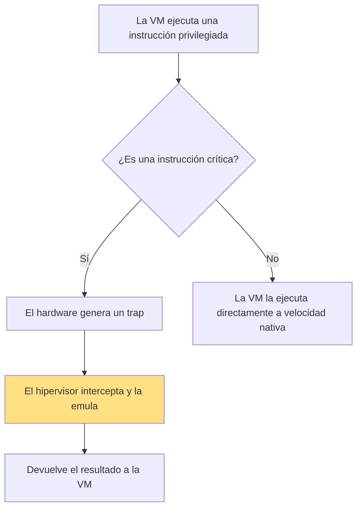

### 2.3 Ciclo de vida de una máquina virtual

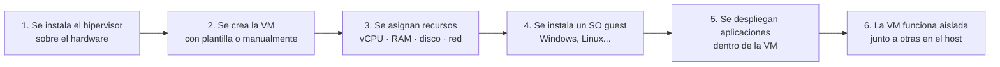

:::tip Ejemplo sencillo: repartir el servidor
Tienes un servidor físico con **16 CPU y 64 GB de RAM**. El hipervisor puede repartirlo así:

| VM | vCPU | RAM | SO |
|---|---|---|---|
| VM1 | 4 | 16 GB | Windows Server |
| VM2 | 8 | 32 GB | Ubuntu |
| VM3 | 4 | 16 GB | Debian |

Cada VM cree que tiene su propio hardware. En realidad, el hipervisor va **intercalando** el uso de las 16 CPU físicas entre las 16 vCPU de las tres VM.
:::

:::info Resumen
El **hipervisor** se sitúa entre el hardware y las VM. Intercepta las instrucciones privilegiadas de cada guest, las emula sobre el hardware real y reparte los recursos físicos, manteniendo a todas las VM **aisladas** entre sí.
:::


## 4. Funcionamiento interno: cómo se virtualiza cada recurso

### 4.1 CPU virtual (vCPU)

Una **vCPU** no es una CPU física: es una **cuota de tiempo de ejecución** sobre una (o varias) CPU físicas del host.

- El hipervisor actúa como un **planificador (scheduler)**: reparte los núcleos físicos entre todas las VM según un algoritmo de tiempo compartido.
- Si hay más vCPU que CPU físicas (overcommitment), las vCPU se turnan para usar los núcleos.
- Una VM puede tener **múltiples vCPU** (SMP virtual) para que su SO aproveche el paralelismo real del host.

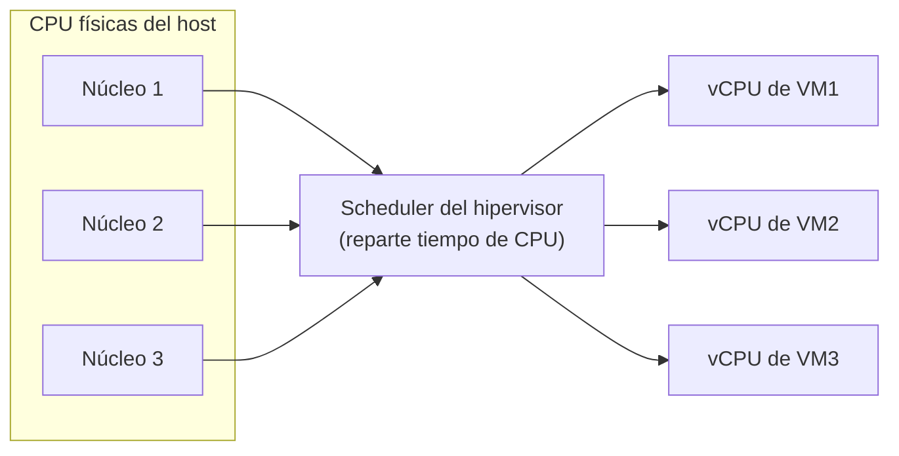

> **Consejo**: asignar más vCPU que las que la aplicación necesita no acelera nada; puede incluso empeorar el rendimiento por el coste de planificación entre núcleos.

### 4.2 Memoria virtual (vRAM)

La memoria virtual de una VM es espacio de RAM del host que el hipervisor **mapea** hacia la memoria física real. Para ello existen dos técnicas principales:

1. **Shadow Page Tables (tablas de páginas sombra)**: el hipervisor mantiene, en software, un mapa que traduce las direcciones de memoria de la VM hacia las del host. Funciona, pero añade overhead.
2. **EPT/NPT (Extendida/Nested Page Tables)**: con Intel EPT o AMD NPT, la **traducción la hace directamente el hardware**, sin intervención del hipervisor. Es la técnica moderna y mucho más rápida.

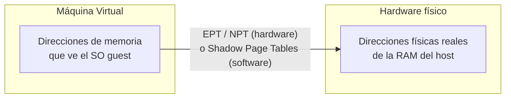

Cuando el hipervisor permite asignar más memoria a las VM que la que tiene el host, se habla de **overcommitment de memoria** (se explica en la sección 9).

### 4.3 Virtualización de entrada/salida (I/O)

Los discos y las tarjetas de red también se virtualizan. Existen tres enfoques, de menor a mayor rendimiento:

| Técnica | Cómo funciona | Rendimiento | Ejemplos |
|---|---|---|---|
| **Emulación de dispositivos** | El hipervisor presenta un dispositivo genérico; todas las operaciones pasan por el software del hipervisor. | Bajo | Discos IDE genéricos, VirtualBox por defecto |
| **Drivers paravirtualizados** | El SO guest usa un driver especial que se comunica directamente con el hipervisor (sin emular hardware). | Alto | Virtio (KVM), enlightened drivers (Hyper-V), vmxnet3 (VMware) |
| **Passthrough / SR-IOV** | Un dispositivo físico real se asigna directamente a la VM; el hipervisor apenas interviene. | Máximo | NVIDIA GPU para IA, NVMe dedicado, SR-IOV en redes |

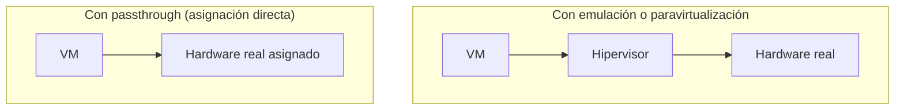

:::warning Advertencia
El passthrough da el mejor rendimiento, pero **impide** migrar la VM en caliente (live migration), porque la VM queda "pegada" al hardware físico concreto. Se usa solo cuando el rendimiento lo justifica (GPU, HPC, bases de datos de alto rendimiento).
:::

## 5. Técnicas de virtualización de CPU

Existen tres grandes técnicas para virtualizar la CPU. Es un tema clásico de certificaciones:

### 5.1 Virtualización completa (Full Virtualization)

- El SO guest **no se modifica**: se ejecuta tal cual.
- Antes de las extensiones de hardware, se usaba **traducción binaria**: el hipervisor reescribía las instrucciones problemáticas en tiempo de ejecución.
- Hoy se apoya en **Intel VT-x / AMD-V**, por lo que el rendimiento es casi nativo.
- **Ejemplos**: VMware ESXi, VirtualBox, Hyper-V (con la ayuda del hardware).

### 5.2 Paravirtualización

- El SO guest **sí se modifica**: se instala un "kernel paravirtualizado" que sustituye las instrucciones problemáticas por llamadas directas al hipervisor (**hypercalls**).
- Evita el coste de la emulación, mejorando el rendimiento en hardware sin extensiones.
- Requiere recompilar o adaptar el SO, lo que limita su portabilidad.
- **Ejemplo clásico**: Xen. Los drivers paravirtualizados modernos (virtio) conservan la idea, pero ya no requieren modificar el kernel.

### 5.3 Virtualización asistida por hardware (Hardware-Assisted)

- Las CPUs modernas (Intel VT-x, AMD-V, ARM v8.1-A) incorporan instrucciones diseñadas **específicamente para virtualizar**.
- Se añade un modo *root* (hipervisor) y un modo *no-root* (VM), sin necesidad de modificar el SO guest.
- Es la técnica predominante en la actualidad: combina compatibilidad total con rendimiento casi nativo.
- **Ejemplos**: KVM, Hyper-V, VMware ESXi moderno, Xen (modo HVM).

| Criterio | Full Virtualization | Paravirtualización | Asistida por hardware |
|---|---|---|---|
| ¿Se modifica el SO guest? | No | Sí | No |
| ¿Requiere hardware especial? | No (pero lo aprovecha) | No | Sí (VT-x / AMD-V) |
| Rendimiento | Alto (con HW assist) | Alto | Casi nativo |
| Compatibilidad | Muy alta | Limitada a SO modificados | Muy alta |
| Overhead | Medio | Bajo | Bajo |
| Ejemplo histórico | VMware Workstation (BT) | Xen | KVM, Hyper-V |

> **Nota**: en la práctica, los hipervisores modernos **combinan** estas técnicas: asistencia por hardware para CPU y memoria, más drivers paravirtualizados (virtio) para discos y red.

## 6. Hipervisores: tipos y funcionamiento interno

### 6.1 Hipervisor Tipo 1 (Bare-Metal)

Se ejecuta **directamente sobre el hardware físico**, sin necesidad de un sistema operativo subyacente. Es el más usado en centros de datos y nubes porque ofrece máximo rendimiento y estabilidad.

- **Ejemplos**: VMware ESXi, Microsoft Hyper-V, KVM, Xen, Citrix Hypervisor, Proxmox VE (basado en KVM), Nutanix AHV.

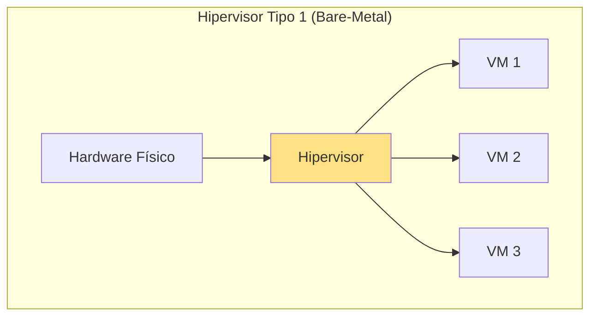

### 6.2 Hipervisor Tipo 2 (Hospedado / Hosted)

Se ejecuta **sobre un sistema operativo host** (Windows, Linux, macOS). Ideal para pruebas, desarrollo y estaciones de trabajo, pero con algo más de overhead por la capa extra.

- **Ejemplos**: Oracle VirtualBox, VMware Workstation/Fusion, Parallels Desktop, QEMU (sin aceleración KVM).

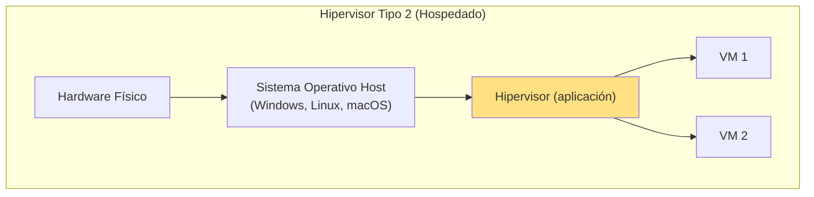

### 6.3 Comparación Tipo 1 vs Tipo 2

| Criterio | Tipo 1 (Bare-Metal) | Tipo 2 (Hospedado) |
|---|---|---|
| Dónde se ejecuta | Directamente sobre el hardware | Sobre un sistema operativo host |
| Rendimiento | Máximo | Algo menor (capa intermedia) |
| Overhead | Mínimo | Mayor |
| Estabilidad | Muy alta (sin SO que "romper") | Depende del SO host |
| Escala de uso | Centros de datos, producción, nubes | Desarrollo, pruebas, uso personal |
| Gestión | Consolas centralizadas (vCenter, System Center) | Aplicación de escritorio |
| Ejemplos | ESXi, Hyper-V, KVM, Xen | VirtualBox, VMware Workstation, Parallels |

> **Consejo**: para estudiar y probar, VirtualBox o VMware Workstation son perfectos. Para producción o certificaciones cloud, recuerda que los proveedores usan **Tipo 1**.

### 6.4 Funcionamiento interno de un hipervisor

Un hipervisor de Tipo 1 es en realidad un **microsistema operativo especializado**. Sus componentes principales son:

| Componente | Función |
|---|---|
| **Scheduler de CPU** | Reparte los núcleos físicos entre las vCPU de las VM. |
| **Gestor de memoria** | Traduce y aísla la memoria de cada VM (EPT/NPT, overcommitment). |
| **Modelo de dispositivos (device model)** | Emula o paravirtualiza discos, tarjetas de red y controladores. |
| **Drivers del hardware físico** | Comunican el hipervisor con la CPU, RAM, controladoras y NIC reales. |
| **Gestor de VM / consola** | Crea, inicia, detiene, clona y monitoriza las VM (vCenter, Hyper-V Manager, `virsh`/`libvirt`). |
| **APIs de automatización** | Permiten integrar el hipervisor con orquestadores (vSphere API, OpenStack, Terraform, Ansible). |

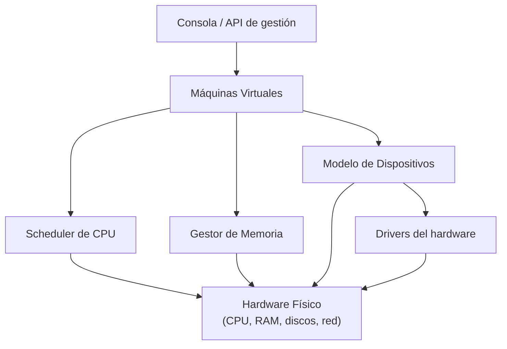

> **Importante**: el hipervisor **no es un sistema operativo completo** (no instala aplicaciones de usuario ni dispone de una interfaz gráfica al uso). Es un software minimalista cuyo único propósito es virtualizar y administrar recursos.

## 7. Tipos de virtualización

La virtualización no se limita a los servidores: se puede virtualizar casi cualquier recurso de TI.

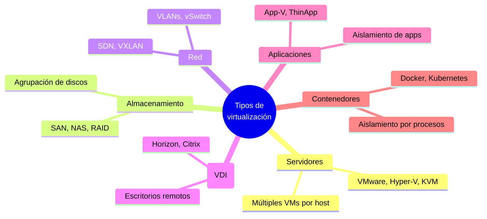

### 7.1 Virtualización de servidores

- **Qué es**: crear múltiples **servidores virtuales (VMs)** a partir de un único servidor físico. Es el tipo más conocido y la base del cloud.
- **Para qué sirve**: consolidación de cargas de trabajo, aislamiento, agilidad en el aprovisionamiento.
- **Ejemplos**: VMware ESXi, Hyper-V, KVM, Xen, Proxmox VE.

### 7.2 Virtualización de almacenamiento

- **Qué es**: agrupar múltiples discos físicos y presentarlos como un **pool de almacenamiento lógico** que se reparte entre los servidores y las VM.
- **Cómo**: mediante redes SAN (Fibre Channel), NAS/NFS/iSCSI, RAID y software de pooling.
- **Para qué sirve**: centralizar la gestión, aprovechar mejor el espacio, permitir mover VM entre hosts (storage migration).
- **Ejemplos**: SAN/FC, NFS/iSCSI, VMware vSAN, Ceph, ZFS.

### 7.3 Virtualización de red

- **Qué es**: crear **redes lógicas independientes** sobre un único cableado físico.
- **Cómo**: con conmutadores virtuales (vSwitch), VLAN, redes superpuestas (VXLAN) y **redes definidas por software (SDN)**.
- **Para qué sirve**: aislar tráfico por seguridad, segmentar entornos (producción vs pruebas) y automatizar la configuración de red.
- **Ejemplos**: vSphere Distributed Switch, Open vSwitch, VMware NSX, Azure Virtual Network.

### 7.4 Virtualización de escritorios (VDI)

- **Qué es**: ejecutar los **escritorios de los usuarios en servidores centrales** y entregarlos como sesiones remotas.
- **Para qué sirve**: trabajo remoto, dispositivos variados (portátil, tablet, thin client), control centralizado y seguridad de los datos (la información nunca sale del centro de datos).
- **Ejemplos**: VMware Horizon, Citrix Virtual Apps and Desktops, Microsoft Azure Virtual Desktop (AVD), Proxmox VE.

### 7.5 Virtualización de aplicaciones

- **Qué es**: aislar **aplicaciones individuales** del sistema operativo, empaquetándolas con su entorno, sin necesidad de instalar ni virtualizar todo un SO.
- **Para qué sirve**: ejecutar aplicaciones incompatibles entre sí o con versiones antiguas de sistemas.
- **Ejemplos**: Microsoft App-V, VMware ThinApp, aplicaciones portables.

### 7.6 Virtualización de contenedores (a nivel de sistema operativo)

- **Qué es**: **aislamiento por procesos** sobre un mismo kernel del host, sin virtualizar el hardware.
- **Para qué sirve**: empaquetar aplicaciones con sus dependencias, arranque casi instantáneo, máxima densidad.
- **Ejemplos**: Docker, containerd, Podman; orquestados con **Kubernetes**.
- Se desarrolla en profundidad en la sección 8.

| Tipo | Recurso virtualizado | Ejemplos |
|---|---|---|
| Servidores | CPU, RAM, disco, red | VMware ESXi, Hyper-V, KVM |
| Almacenamiento | Discos y SAN/NAS | vSAN, Ceph, iSCSI |
| Red | Redes y conmutadores | VLAN, VXLAN, NSX, SDN |
| Escritorios | Escritorios completos | Horizon, Citrix, Azure Virtual Desktop |
| Aplicaciones | Aplicaciones individuales | App-V, ThinApp |
| Contenedores | Procesos del SO | Docker, Kubernetes |

## 8. Máquinas virtuales vs Contenedores

Los **contenedores** son una forma de virtualización a nivel de sistema operativo: comparten el **kernel del host**, pero aíslan los procesos y el sistema de archivos de cada aplicación.

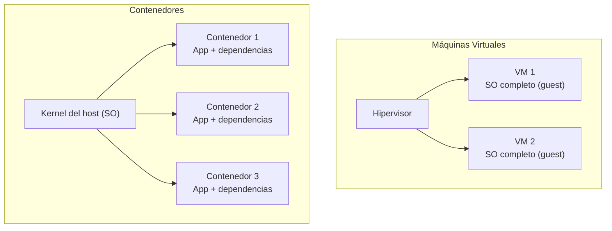

| Criterio | Máquina Virtual | Contenedor |
|---|---|---|
| Qué se virtualiza | Hardware completo | Sistema operativo (procesos) |
| SO | Cada VM tiene su propio SO guest | Comparte el kernel del host |
| Aislamiento | Fuerte (fronteras de hardware) | Débil a medio (mismo kernel) |
| Tamaño | GB (SO completo + app) | MB (solo app + dependencias) |
| Tiempo de arranque | Minutos | Milisegundos / segundos |
| Densidad por servidor | Decenas | Cientos o miles |
| Rendimiento | Casi nativo (con HW assist) | Casi nativo |
| Portabilidad | De un hipervisor a otro | Imagen estándar (OCI) |
| Seguridad | Mayor aislamiento | Menor (kernel compartido) |
| Ejemplos | ESXi, Hyper-V, KVM | Docker, containerd, Podman |

> **Nota**: no son excluyentes. En la práctica se usan **contenedores dentro de máquinas virtuales**: el hipervisor aísla los hosts y Docker/Kubernetes aísla las aplicaciones. Así lo hacen AWS (ECS/EKS) y Azure (AKS) sobre sus VMs.

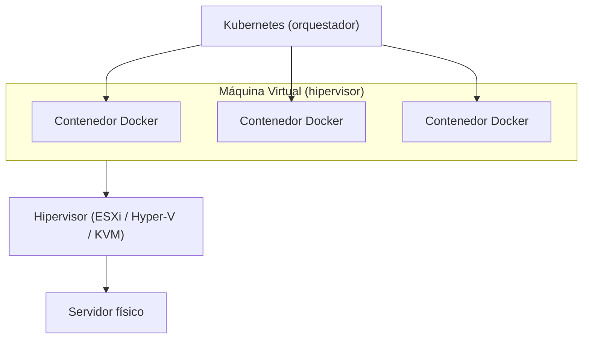

## 9. Características operativas de las máquinas virtuales

Estos conceptos distinguen a la virtualización "de juguete" de la de nivel empresarial y aparecen constantemente en certificaciones cloud.

### 9.1 Overcommitment (sobreasignación)

Consiste en asignar **más recursos virtuales de los que existen físicamente**, asumiendo que las VM no los usan todos al mismo tiempo.

- **CPU**: se asignan más vCPU que núcleos físicos. El scheduler las va turnando.
- **Memoria**: se asigna más vRAM que RAM física. El hipervisor la recupera con técnicas como *page sharing* (compartir páginas idénticas), *ballooning* (el guest "cede" memoria libre) y *swapping*.

> **Importante**: un overcommitment excesivo provoca **lentitud generalizada** (thrashing). Es una decisión de equilibrio que depende del uso real de cada carga.

### 9.2 Snapshots

Un **snapshot** es una **fotografía del estado completo de una VM** en un instante: memoria, discos y configuración.

- Sirven para **volver atrás** antes de aplicar un cambio arriesgado (parche, actualización, instalación).
- No sustituyen a las copias de seguridad: los snapshots **no** están pensados para recuperación a largo plazo ni se deben mantener durante mucho tiempo (consumen espacio).

### 9.3 Clonación

Consiste en **copiar una VM** para crear una o varias idénticas en minutos. Existen dos variantes:

| Tipo de clon | Descripción | Uso típico |
|---|---|---|
| **Completo (full clone)** | Copia independiente del 100% de los datos | Producción, entornos aislados |
| **Vinculado (linked clone)** | Comparte el disco base con la original | Lab, pruebas rápidas, despliegues masivos |

Las **plantillas (templates)** son clonación a escala: una imagen maestra con SO y herramientas preconfiguradas que permite desplegar decenas de VM en minutos.

### 9.4 Live Migration (migración en caliente)

Permite **mover una VM de un host a otro sin apagarla** ni interrumpir el servicio. Es clave para el mantenimiento sin cortes.

Cómo funciona, de forma simplificada:

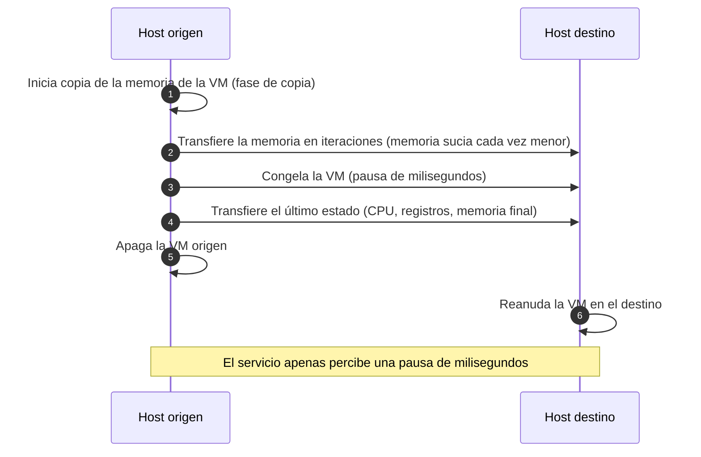

- **Ejemplos**: VMware **vMotion**, Microsoft **Live Migration** (Hyper-V), migración en caliente de **KVM/libvirt**, Google Compute Engine, AWS (con ciertas restricciones).

### 9.5 Alta disponibilidad (High Availability - HA)

Si un host físico falla, **HA reinicia automáticamente sus VMs en otro host** del clúster, sin intervención humana.

- El clúster monitoriza continuamente la salud de los hosts.
- Requiere almacenamiento compartido (SAN/NAS/vSAN) para que la VM sea accesible desde cualquier host.
- **Ejemplos**: vSphere HA, Hyper-V Failover Clustering, Proxmox HA, AWS/Azure (los servicios cloud implementan HA automática).

### 9.6 Balanceo de carga

Distribuye las VMs y sus cargas para **evitar hosts saturados** y hosts ociosos:

- **A nivel de VM**: el orquestador decide en qué host ubicar cada VM (ej. VMware **DRS**).
- **A nivel de aplicación**: un balanceador de red reparte el tráfico entre varias VM (ej. AWS ELB, Azure Load Balancer).

### 9.7 Escalabilidad

- **Escalado vertical (scale up)**: aumentar los recursos de una VM (más vCPU, más RAM). Requiere reiniciar en muchos casos.
- **Escalado horizontal (scale out)**: agregar más VMs y repartir el tráfico entre ellas. Es el enfoque preferido en cloud por su elasticidad y tolerancia a fallos.

## 10. Ejemplos reales: quién usa cada tecnología

| Tecnología | Tipo | Categoría | ¿Por qué pertenece a esa categoría? |
|---|---|---|---|
| **VMware ESXi** | Hipervisor Tipo 1 | Virtualización de servidores | Se instala directamente sobre el hardware sin SO host; líder en centros de datos. |
| **Microsoft Hyper-V** | Hipervisor Tipo 1 | Virtualización de servidores | Se ejecuta bajo el hypervisor de Windows Server; base de Azure. |
| **KVM** | Hipervisor Tipo 1 | Virtualización de servidores | Módulo del kernel de Linux; estándar abierto, base de OpenStack y de la mayoría de nubes (AWS Nitro, GCP, IBM). |
| **Xen** | Hipervisor Tipo 1 | Virtualización de servidores | Nació con la paravirtualización; fue la base original de AWS EC2. |
| **VirtualBox** | Hipervisor Tipo 2 | Virtualización de servidores (dev) | Aplicación que corre sobre Windows/Linux/macOS; ideal para pruebas. |
| **VMware Workstation / Fusion** | Hipervisor Tipo 2 | Virtualización de servidores (dev) | Aplicación de escritorio sobre el SO host para desarrolladores. |
| **Docker** | Contenedor | Virtualización de SO | Aísla procesos y dependencias sobre el kernel del host, sin hipervisor. |
| **Kubernetes** | Orquestador | Gestión de contenedores | No virtualiza recursos; automatiza el despliegue, escala y recuperación de contenedores. |
| **AWS EC2** | Servicio cloud | VMs bajo demanda | Expone VMs (sobre KVM/Nitro) como servicio: instancias alquiladas por hora. |
| **Azure Virtual Machines** | Servicio cloud | VMs bajo demanda | VMs sobre Hyper-V gestionadas como servicio. |
| **Google Compute Engine** | Servicio cloud | VMs bajo demanda | VMs sobre KVM con migración en caliente automática. |
| **Proxmox VE** | Plataforma | Virtualización de servidores | Distribución basada en KVM + contenedores LXC con gestión web. |
| **Citrix Hypervisor / Nutanix AHV** | Hipervisor Tipo 1 | Virtualización de servidores | Bare-metal usado en entornos empresariales y hiperconvergidos. |

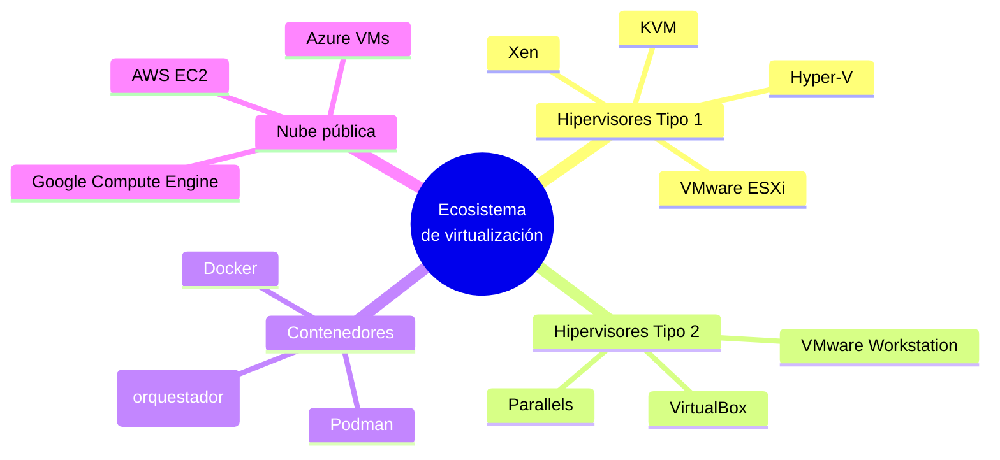

> **Consejo para estudiar**: instala **VirtualBox** o **VMware Workstation** en tu PC y crea una VM Ubuntu. Luego levanta **Docker** dentro. Habrás tocado personalmente las dos grandes familias: hipervisores y contenedores.

## 11. Ventajas y desventajas de la virtualización

### Ventajas

- **Mejor aprovechamiento del hardware**: se consolida la carga de varios servidores en uno solo.
- **Reducción de costes**: menos hardware, energía, refrigeración y espacio físico.
- **Aislamiento**: cada VM es independiente; un fallo o una vulnerabilidad en una no afecta a las demás.
- **Agilidad**: se crea una VM en minutos desde una plantilla, no en semanas.
- **Portabilidad**: las VM son archivos; se copian, se mueven y se restauran fácilmente.
- **Recuperación ante desastres**: snapshots, clones y migración en caliente simplifican los planes de continuidad.
- **Entornos de prueba**: se simulan redes y sistemas completos sin comprar hardware.
- **Base del Cloud Computing**: permite el multi-tenancy y el pago por uso.

### Desventajas

- **Overhead de rendimiento**: siempre existe un pequeño coste por la capa de virtualización (mínimo con hardware moderno).
- **Riesgo de consolidación**: si un solo host concentra demasiadas VMs, su fallo afecta a muchos servicios (punto único de fallo).
- **Efecto "vecino ruidoso" (noisy neighbor)**: una VM que abusa de los recursos degrada a las demás del mismo host.
- **Complejidad**: hipervisores, clústeres, almacenamiento compartido y migración requieren administradores especializados.
- **Licenciamiento**: el software de virtualización empresarial (VMware, etc.) y los SO guest añaden costes.
- **Sprawl (proliferación)**: es tan fácil crear VMs que sin control se generan "zombis" que consumen recursos de forma invisible.

## 12. Virtualización vs Cloud Computing

Es la confusión más común entre estudiantes. Vamos a separarlo con claridad:

> **La virtualización es una tecnología.** La **nube (cloud) es un modelo de servicio y negocio** que usa esa tecnología (y otras) como base.

### 12.1 Relación

El Cloud Computing **se apoya en la virtualización**: cuando alquilas una instancia en AWS, Azure o GCP, en realidad recibes una VM creada sobre un servidor físico mucho más grande que comparte sus recursos con otras VMs de forma segura y aislada.

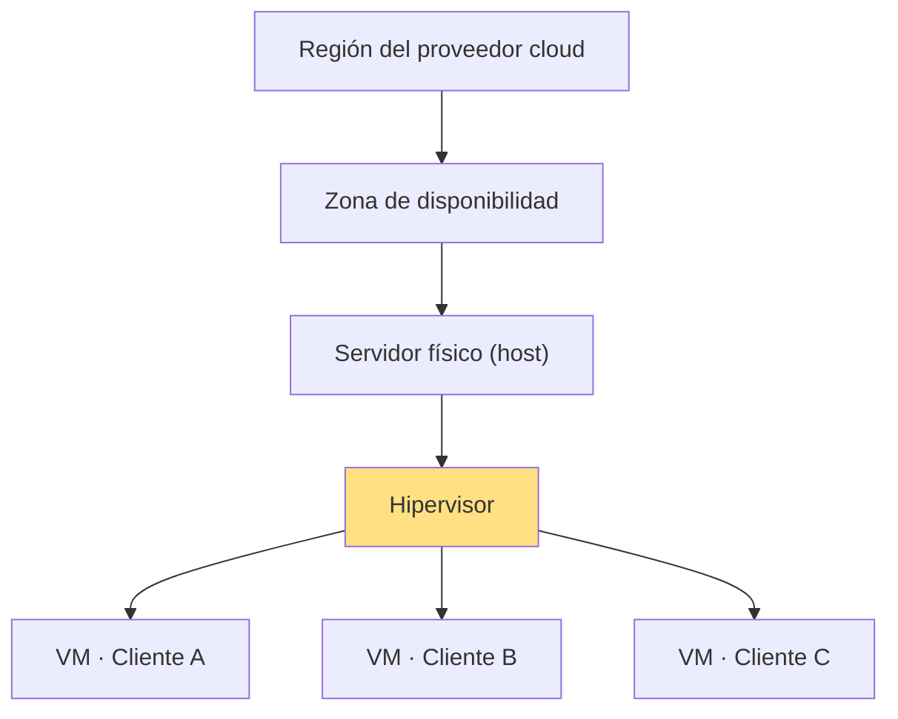

Cada cliente siente que tiene su propio servidor, aunque todos compartan el mismo hardware físico.

### 12.2 Diferencias clave

| Criterio | Virtualización | Cloud Computing |
|---|---|---|
| Qué es | Una tecnología | Un modelo de servicio y negocio |
| Unidad | Máquina virtual sobre un host | Servicios bajo demanda (compute, storage, DB...) |
| ¿Quién lo usa? | Empresas o personas con sus propios hosts | Cualquier usuario conectado a Internet |
| Auto-servicio | Manual (consola del hipervisor) | Autoservicio bajo demanda (consola web/API) |
| Pago | Coste de hardware y licencias | Pago por uso (OPEX) |
| Escalado | Añadir VM/vCPU manualmente | Elástico y en muchos casos automático |
| Acceso | Red interna del centro de datos | Acceso desde Internet/API |
| Medición | No se factura por consumo | Servicio medido (CPU/hora, GB/mes) |
| Ejemplos | ESXi, Hyper-V, KVM | AWS, Azure, GCP |

> **Importante**: puedes tener **virtualización sin cloud** (un servidor ESXi en tu empresa) y **cloud sin ver la virtualización** (usar una función serverless como AWS Lambda). El cloud añade a la virtualización el autoservicio, la elasticidad, la medición y el pago por uso.


## 13. Buenas prácticas

- **Dimensiona correctamente**: asigna a cada VM solo los recursos que necesita; sobreaprovisionar es tan malo como quedarse corto.
- **Usa plantillas**: centraliza la configuración del SO, los parches y las herramientas en imágenes maestras.
- **Controla el overcommitment**: monitoriza el uso real antes de sobreasignar CPU o memoria.
- **Haz copias de seguridad**: los snapshots no son backups; establece un plan de backups real y pruébalo.
- **No acumules snapshots**: consúmelos pronto o degradarán el rendimiento y el espacio.
- **Planifica la alta disponibilidad**: clústeres con almacenamiento compartido y anti-affinity (no poner VMs críticas en el mismo host).
- **Parchea el hipervisor**: es el software más privilegiado; mantenerlo actualizado es crítico para la seguridad.
- **Minimiza la superficie de ataque**: desactiva servicios no usados en el host y aplica el principio de mínimo privilegio.
- **Monitorea y alerta**: supervisa CPU, memoria, I/O y latencia de cada VM y host.
- **Usa etiquetas y nomenclatura**: identifica propietario, entorno (prod/test/dev) y coste de cada VM para evitar el sprawl.
- **Considera contenedores** para cargas que no necesiten un SO completo: mayor densidad y menor coste.


## 14. Errores comunes

- **Pensar que una máquina virtual es un servidor físico.**

Una VM depende del hardware del host y del hipervisor. Si el host se cae, las VMs (sin HA) caen con él.

- **Creer que toda la nube utiliza únicamente máquinas virtuales.**

Los proveedores también usan contenedores, funciones serverless (Lambda, Cloud Functions) y otros mecanismos de aislamiento.

- **Pensar que las VMs no comparten recursos.**

Comparten el hardware físico. Cada una dispone de recursos virtuales asignados y aislamiento lógico, pero todas compiten por la misma CPU, memoria e I/O del host.

- **Confundir virtualización con emulación.**

La virtualización ejecuta el mismo conjunto de instrucciones de la CPU física con ayuda del hardware moderno: rendimiento casi nativo. La emulación reproduce una arquitectura distinta (ej. ejecutar Windows en un M1) y es mucho más lenta.

- **Creer que el hipervisor es un sistema operativo completo.**

Administra recursos y VMs, pero no instala aplicaciones de usuario ni funciona como un SO de propósito general.

- **Confundir la nube con la virtualización.**

Son conceptos distintos: una es tecnología y la otra es un modelo de servicio (ver sección 13).

- **Hacer overcommitment de memoria "a ciegas".**

Sin monitorización, se llega al *thrashing* y todas las VMs del host se degradan.

- **Poner todas las VMs críticas en un solo host.**

Es un punto único de fallo. Hay que usar clústeres con HA y reglas de anti-affinity.

:::info Resumen

- La **virtualización** crea versiones lógicas de recursos físicos y permite ejecutar múltiples sistemas operativos aislados sobre un mismo servidor.
- El **hipervisor** es la pieza central: reparte CPU, memoria, disco y red entre las VMs e intercepta sus instrucciones privilegiadas.
- Existen tres técnicas de CPU: **full virtualization**, **paravirtualización** y **virtualización asistida por hardware** (la moderna, con VT-x/AMD-V).
- Hay **hipervisores Tipo 1** (bare-metal: ESXi, Hyper-V, KVM, Xen) y **Tipo 2** (hospedados: VirtualBox, VMware Workstation).
- La virtualización abarca **servidores, almacenamiento, red, escritorios, aplicaciones y contenedores**.
- Los **contenedores** virtualizan el sistema operativo (comparten el kernel) y son más ligeros que las VMs; ambos conviven.
- Conceptos clave de nivel empresarial: **overcommitment, snapshots, clonación, live migration, HA, balanceo de carga y escalabilidad**.
- La **virtualización es la base tecnológica del Cloud Computing**, pero el cloud es mucho más: autoservicio, elasticidad, medición y pago por uso.

:::