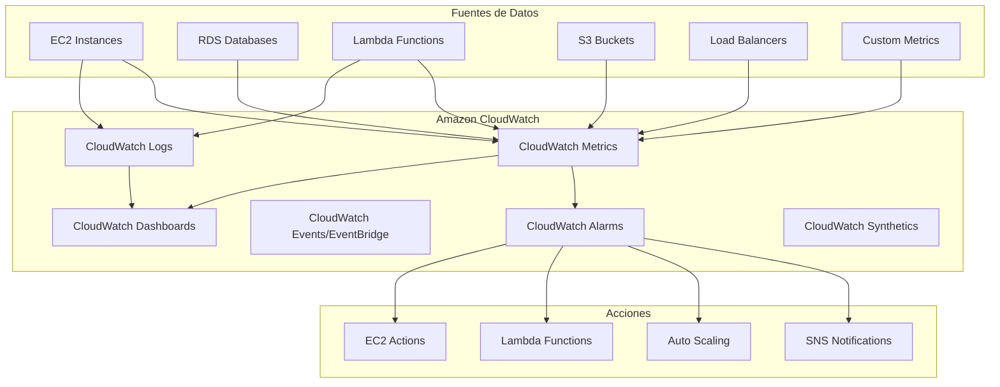
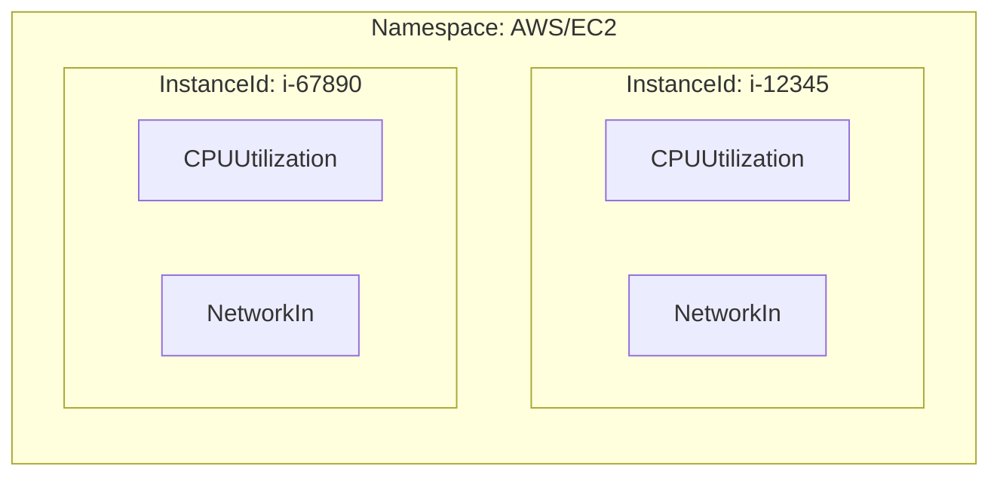
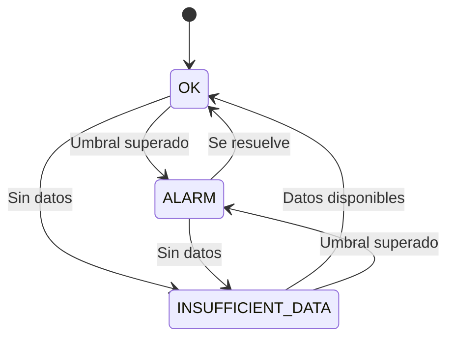
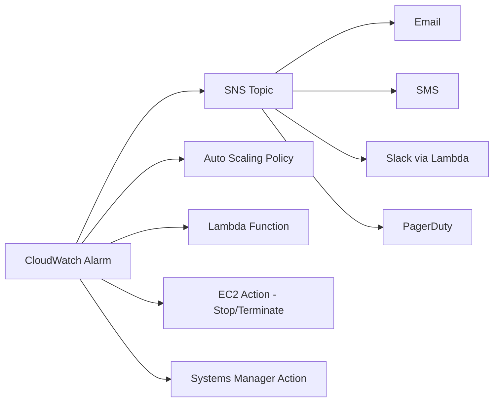
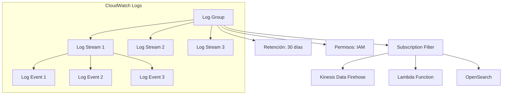
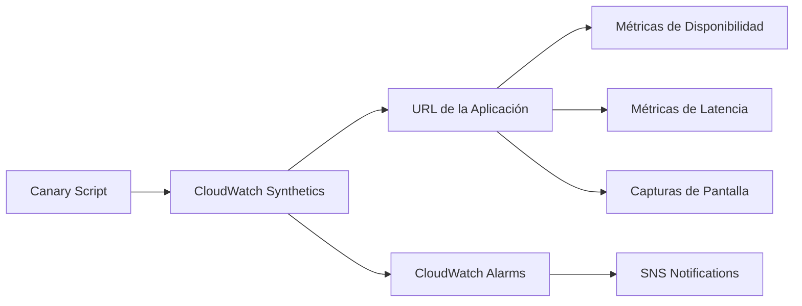
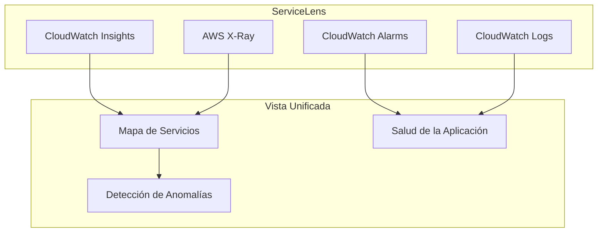
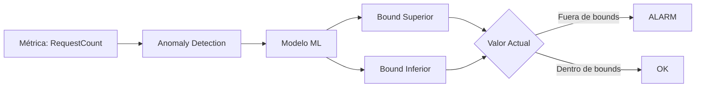

# Amazon CloudWatch - Observabilidad

## ¿Qué es Amazon CloudWatch?

Amazon CloudWatch es el servicio de **observabilidad** de AWS que permite monitorear, recopilar métricas, registrar archivos de log, establecer alarmas y tomar acciones automatizadas en respuesta a cambios en tus recursos de AWS y aplicaciones.

**Analogía:** CloudWatch es como un **sistema de cámaras de seguridad** para tu infraestructura en la nube. Así como las cámaras graban todo lo que sucede en un edificio (quién entra, qué horas, si hay incidentes), CloudWatch graba todo lo que sucede en tus servidores, bases de datos, aplicaciones y redes. Si algo inusual ocurre (como un intruso o un servidor sobrecargado), el sistema te alerta automáticamente.



---

## Métricas de CloudWatch

Las métricas son el corazón de CloudWatch. Representan mediciones numéricas de tus recursos a lo largo del tiempo.

### Métricas Estándar vs Alto Résolución

| Característica | Métricas Estándar | Métricas Alto Résolución |
|---|---|---|
| **Granularidad** | 1 minuto (default 5 min) | 1 segundo |
| **Costo** | Gratis para métricas de AWS | Costo adicional |
| **Retención** | 15 meses (agregadas) | 15 días (raw) |
| **Precisión** | Menor (punto único por intervalo) | Mayor (múltiples puntos) |
| **Uso ideal** | Monitoreo general | Detección precisa de anomalías |

### Métricas Estándar de AWS

Cada servicio de AWS envía métricas automáticamente. Ejemplos:

- **EC2:** `CPUUtilization`, `NetworkIn`, `NetworkOut`, `StatusCheckFailed`
- **RDS:** `CPUUtilization`, `FreeableMemory`, `DatabaseConnections`, `ReadLatency`
- **Lambda:** `Invocations`, `Errors`, `Duration`, `Throttles`, `IteratorAge`
- **ALB:** `RequestCount`, `TargetResponseTime`, `HTTPCode_Target_5XX_Count`
- **S3:** `BucketSizeBytes`, `NumberOfObjects`, `AllRequests`

### Namespaces y Dimensiones



- **Namespace:** Contenedor lógico de métricas (ej: `AWS/EC2`, `AWS/RDS`, `MiApp/Métricas`)
- **Dimensiones:** Etiquetas que filtran métricas (ej: `InstanceId`, `AutoScalingGroupName`)

---

## CloudWatch Agent

El CloudWatch Agent permite recopilar métricas personalizadas y logs de servidores (on-premises o EC2) que no se recopilan automáticamente.

### Instalación y Configuración

**Linux (via SSM):**

```bash
# Instalar el agente en EC2 via SSM
aws ssm send-command \
  --document-name "AWS-ConfigureAWSPackage" \
  --parameters '{"action":["Install"],"name":["AmazonCloudWatchAgent"]}' \
  --targets "Key=tag:Environment,Values=Production"
```

**Archivo de configuración del agente (`amazon-cloudwatch-agent.json`):**

```json
{
  "agent": {
    "metrics_collection_interval": 60,
    "run_as_user": "root"
  },
  "metrics": {
    "namespace": "MiApp/CustomMetrics",
    "metrics_collected": {
      "cpu": {
        "resources": ["*"],
        "measurement": [
          "cpu_usage_idle",
          "cpu_usage_iowait",
          "cpu_usage_system",
          "cpu_usage_user"
        ],
        "metrics_collection_interval": 60
      },
      "disk": {
        "resources": ["/"],
        "measurement": ["used_percent", "free"],
        "metrics_collection_interval": 60
      },
      "mem": {
        "measurement": ["mem_used_percent", "mem_available"],
        "metrics_collection_interval": 60
      },
      "net": {
        "resources": ["eth0"],
        "measurement": ["bytes_sent", "bytes_recv"]
      }
    },
    "aggregation_dimensions": [["InstanceId"]]
  },
  "logs": {
    "logs_collected": {
      "files": {
        "collect_list": [
          {
            "file_path": "/var/log/nginx/access.log",
            "log_group_name": "/aws/ec2/nginx/access",
            "log_stream_name": "{instance_id}",
            "timezone": "UTC"
          },
          {
            "file_path": "/var/log/application/app.log",
            "log_group_name": "/aws/ec2/app/application",
            "log_stream_name": "{instance_id}",
            "timezone": "America/Mexico_City"
          }
        ]
      }
    }
  }
}
```

**Iniciar el agente:**

```bash
sudo /opt/aws/amazon-cloudwatch-agent/bin/amazon-cloudwatch-agent-ctl \
  -a fetch-config \
  -m ec2 \
  -c file:/tmp/amazon-cloudwatch-agent.json \
  -s
```

### Métricas Personalizadas via API

```bash
# Publicar métrica personalizada
aws cloudwatch put-metric-data \
  --namespace "MiApp/Pedidos" \
  --metric-name "PedidosProcesados" \
  --value 42 \
  --unit Count \
  --dimensions "Region=us-east-1,Environment=Production"

# Publicar métrica con timestamp
aws cloudwatch put-metric-data \
  --namespace "MiApp/Pedidos" \
  --metric-name "TiempoProcesamiento" \
  --value 125.3 \
  --unit Milliseconds \
  --timestamp $(date -u +%Y-%m-%dT%H:%M:%SZ)
```

---

## CloudWatch Alarms

Las alarmas monitorean métricas y ejecutan acciones cuando se cumplen condiciones específicas.

### Estados de una Alarma



### Tipos de Alarmas

| Tipo | Descripción | Ejemplo |
|---|---|---|
| **Metric Alarm** | Monitorea una métrica individual | CPU > 80% |
| **Composite Alarm** | Combina múltiples alarmas con AND/OR | CPU > 80% Y RequestCount > 1000 |
| **Anomaly Detection** | Detecta desviaciones del patrón normal | Tráfico inusual |

### Ejemplo de Alarma Métrica

```yaml
# CloudFormation - Alarma de CPU
Type: AWS::CloudWatch::Alarm
Properties:
  AlarmName: "EC2-High-CPU-Alarm"
  AlarmDescription: "Alerta cuando CPU supera 80%"
  Namespace: "AWS/EC2"
  MetricName: "CPUUtilization"
  Dimensions:
    - Name: "InstanceId"
      Value: "i-1234567890abcdef0"
  Statistic: "Average"
  Period: 300
  EvaluationPeriods: 2
  Threshold: 80
  ComparisonOperator: "GreaterThanThreshold"
  AlarmActions:
    - !Ref HighCPUAlertSNSTopic
  OKActions:
    - !Ref HighCPURecoverySNSTopic
  TreatMissingData: "missing"
```

### Acciones de Alarmas



### Expresiones Matemáticas en Alarmas

CloudWatch permite crear alarmas con expresiones matemáticas complejas:

```yaml
# Alarma con expresión matemática
Type: AWS::CloudWatch::Alarm
Properties:
  AlarmName: "High-Error-Rate-Percentage"
  Metrics:
    - Id: "errors"
      MetricStat:
        Metric:
          Namespace: "AWS/Lambda"
          MetricName: "Errors"
          Dimensions:
            - Name: "FunctionName"
              Value: "MiFuncion"
        Period: 300
        Stat: "Sum"
    - Id: "invocations"
      MetricStat:
        Metric:
          Namespace: "AWS/Lambda"
          MetricName: "Invocations"
          Dimensions:
            - Name: "FunctionName"
              Value: "MiFuncion"
        Period: 300
        Stat: "Sum"
    - Id: "error_rate"
      Expression: "errors / invocations * 100"
      Label: "Error Rate %"
  Threshold: 5
  ComparisonOperator: "GreaterThanThreshold"
  EvaluationPeriods: 3
  TreatMissingData: "notBreaching"
```

### Expresión Math con Filtros

```yaml
# Filtro de métricas con expresión math
Metrics:
  - Id: "m1"
    MetricStat:
      Metric:
        Namespace: "AWS/ApplicationELB"
        MetricName: "RequestCount"
        Dimensions:
          - Name: "LoadBalancer"
            Value: "app/mi-alb/1234567890"
      Period: 60
      Stat: "Sum"
  - Id: "m2"
    MetricStat:
      Metric:
        Namespace: "AWS/ApplicationELB"
        MetricName: "HTTPCode_Target_5XX_Count"
        Dimensions:
          - Name: "LoadBalancer"
            Value: "app/mi-alb/1234567890"
      Period: 60
      Stat: "Sum"
  - Id: "e1"
    Expression: "m2 / m1 * 100"
    Label: "5XX Error Rate"
```

---

## CloudWatch Logs

CloudWatch Logs permite recopilar, almacenar y acceder a logs de aplicaciones e infraestructura.

### Conceptos Clave



- **Log Group:** Contenedor de logs con misma política de retención y permisos
- **Log Stream:** Secuencia de eventos de log de una fuente específica
- **Log Event:** Registro individual con timestamp y mensaje

### Configuración de Retención

```bash
# Establecer retención de 30 días
aws logs put-retention-policy \
  --log-group-name "/aws/ec2/application" \
  --retention-in-days 30

# Configurar retención ilimitada (nunca eliminar)
aws logs put-retention-policy \
  --log-group-name "/aws/ec2/critical-app" \
  --retention-in-days 9999
```

### Subscription Filters

Los subscription filters envían logs en tiempo real a otros servicios:

```bash
# Crear subscription filter para enviar a Lambda
aws logs put-subscription-filter \
  --log-group-name "/aws/ec2/application" \
  --filter-name "ErrorFilter" \
  --filter-pattern "ERROR WARN" \
  --destination-arn "arn:aws:lambda:us-east-1:123456789012:function:LogProcessor"

# Crear subscription filter para Kinesis Firehose
aws logs put-subscription-filter \
  --log-group-name "/aws/ec2/application" \
  --filter-name "AllLogs" \
  --filter-pattern "" \
  --destination-arn "arn:aws:firehose:us-east-1:123456789012:delivery-stream:MyStream"
```

### Filtros de Patrones

```
# Filtros de patrones en CloudWatch Logs
# Literal: "ERROR"
# Filtros de métricas: ?=case-insensitive ?-wildcard
# Eventos JSON: { $.eventType = "ERROR" }
# Filtros numéricos: { $.latency > 1000 }
# Combinación: { $.level = "ERROR" && $.latency > 500 }
```

---

## CloudWatch Logs Insights

Logs Insights es un motor de consultas interactivo que permite analizar logs de forma rápida.

### Ejemplos de Consultas

```sql
-- Buscar errores en los últimos 15 minutos
fields @timestamp, @message
| filter @message like /ERROR/
| sort @timestamp desc
| limit 50

-- Contar errores por tipo
fields @timestamp, @message
| filter @message like /ERROR/
| parse @message "ErrorType: *" as errorType
| stats count(*) as errorCount by errorType
| sort errorCount desc

-- Analizar tiempos de respuesta
fields @timestamp, @duration
| filter @duration > 1000
| stats avg(@duration) as avgDuration,
        max(@duration) as maxDuration,
        min(@duration) as minDuration
        by bin(5m)

-- Logs de Lambda con errores
fields @timestamp, @requestId, @message
| filter @message like /ERROR/
| sort @timestamp desc
| limit 20
```

### Métricas de Logs

```yaml
# Métrica de filtro de logs
Type: AWS::CloudWatch::MetricFilter
Properties:
  LogGroupName: "/aws/ec2/application"
  FilterPattern: "[timestamp, requestId, level, message]"
  MetricTransformations:
    - MetricNamespace: "MiApp/Logs"
      MetricName: "ErrorCount"
      MetricValue: "1"
      DefaultValue: 0
```

---

## CloudWatch Dashboards

Los dashboards proporcionan una vista visual de tus métricas y logs.

### Dashboard con CloudFormation

```yaml
Type: AWS::CloudWatch::Dashboard
Properties:
  DashboardName: "Infraestructura-Production"
  DashboardBody: |
    {
      "widgets": [
        {
          "type": "metric",
          "x": 0,
          "y": 0,
          "width": 12,
          "height": 6,
          "properties": {
            "metrics": [
              ["AWS/EC2", "CPUUtilization", "InstanceId", "i-12345"]
            ],
            "period": 300,
            "stat": "Average",
            "region": "us-east-1",
            "title": "CPU Utilization"
          }
        },
        {
          "type": "log",
          "x": 0,
          "y": 6,
          "width": 12,
          "height": 6,
          "properties": {
            "query": "SOURCE '/aws/ec2/application' | fields @timestamp, @message | filter @message like /ERROR/ | sort @timestamp desc | limit 20",
            "region": "us-east-1",
            "stacked": false,
            "title": "Application Errors"
          }
        }
      ]
    }
```

---

## CloudWatch Synthetics (Canaries)

CloudWatch Synthetics ejecuta scripts de monitoreo que simulan la experiencia del usuario en tu aplicación.



### Ejemplo de Canary

```javascript
// canary-script.js
const { URL } = require('url');
const { HttpClient } = require('Synthetics');

const page = await HttpClient.launch();
await page.goto('https://mi-aplicacion.com');
await page.waitForSelector('#login-button');
await page.screenshot({ path: 'screenshots/homepage.png' });

// Verificar que la página cargó correctamente
const title = await page.title();
if (!title.includes('Mi Aplicación')) {
    throw new Error('Page did not load correctly');
}
```

### Configuración del Canary

```yaml
Type: AWS::Synthetics::Canary
Properties:
  Name: "MiAplicacion-HealthCheck"
  Code:
    Handler: "apiCanary.handler"
    S3Bucket: "mi-bucket-canaries"
    S3Key: "canary.zip"
  ArtifactS3Location: "s3://mi-bucket-canaries/artifacts/"
  ExecutionRoleArn: !GetAtt CanaryRole.Arn
  Schedule:
    Expression: "rate(5 minutes)"
  RuntimeVersion: "syn-python-selenium-3.0"
  SuccessRetentionPeriod: 31
  FailureRetentionPeriod: 31
  VpcConfig:
    SubnetIds:
      - !Ref PrivateSubnet1
      - !Ref PrivateSubnet2
    SecurityGroupIds:
      - !Ref CanarySecurityGroup
```

---

## CloudWatch ServiceLens

ServiceLens proporciona una vista unificada de la salud de tus aplicaciones, combinando métricas, traces y logs.



---

## Contributor Insights

Contributor Insights identifica quiénes o qué están contribuyendo a un patrón en tus datos.

```bash
# Crear regla de Contributor Insights
aws cloudwatch put-insight-rule \
  --rule-name "TopErrorContributors" \
  --rule-definition '{
    "Schema": "CloudWatchLogRule",
    "LogGroupArns": ["arn:aws:logs:us-east-1:123456789012:log-group:/aws/ec2/application:*"],
    "LogFormat": "JSON",
    "Contribution": {
        "Keys": ["errorCode"],
        "ValueOf": "@requestCount",
        "SortBy": "ValueDesc"
    },
    "FilterPattern": "{ $.level = \"ERROR\" }"
  }'
```

---

## Anomaly Detection

Anomaly Detection utiliza machine learning para detectar desviaciones del patrón normal de tus métricas.



### Configurar Anomaly Detection

```yaml
# Alarma con Anomaly Detection
Type: AWS::CloudWatch::Alarm
Properties:
  AlarmName: "RequestCount-Anomaly"
  Metrics:
    - Id: "m1"
      MetricStat:
        Metric:
          Namespace: "AWS/ApplicationELB"
          MetricName: "RequestCount"
          Dimensions:
            - Name: "LoadBalancer"
              Value: "app/mi-alb/1234567890"
        Period: 300
        Stat: "Sum"
    - Id: "ad1"
      Expression: "ANOMALY_DETECTION_BAND(m1, 2)"
      Label: "Anomaly Detection Band"
  ThresholdMetricId: "ad1"
  ComparisonOperator: "GreaterThanUpperThreshold"
  EvaluationPeriods: 3
```

### Personalización de Anomaly Detection

```bash
# Crear modelo de Anomaly Detection personalizado
aws cloudwatch put-anomaly-detector \
  --namespace "MiApp/Métricas" \
  --metric-name "RequestCount" \
  --dimensions Name=ServiceName,Value=MiServicio \
  --stat "Average"

# Eliminar detector de anomalías
aws cloudwatch delete-anomaly-detector \
  --namespace "MiApp/Métricas" \
  --metric-name "RequestCount"
```

---

## Pricing de CloudWatch

| Servicio | Precio |
|---|---|
| **Métricas estándar de AWS** | Gratis (primeros 10 métricas custom) |
| **Métricas personalizadas** | $0.30/mes por métrica |
| **Métricas alto résolución** | $0.30/mes por métrica (con carga adicional) |
| **Alarmas** | $0.10/alarm/mes (primeros 10 alarmas gratis) |
| **Logs - Ingestión** | $0.50/GB (primeros 10GB gratis) |
| **Logs - Almacenamiento** | $0.03/GB/mes |
| **Logs - Escaneo** | $0.005/GB (Logs Insights) |
| **Dashboards** | $3.00/dashboard/mes |
| **Synthetics** | $0.0012/minuto ejecutado |
| **Canary runs** | $0.0012/ejecución |

---

## Mejores Prácticas

### 1. Organización de Métricas y Logs

```
# Estructura recomendada de Log Groups
/aws/ec2/{servicio}/{tipo}
/aws/lambda/{funcion}
/aws/rds/{instancia}
/mi-app/{entorno}/{servicio}
```

### 2. Alarmas Inteligentes

```yaml
# Usar Composite Alarms para reducir "alarm fatigue"
Type: AWS::CloudWatch::CompositeAlarm
Properties:
  AlarmName: "Critical-ServiceDown"
  AlarmRule: |
    ALARM("EC2-High-CPU") AND
    ALARM("ALB-5XX-Errors") AND
    ALARM("RDS-CPU-Critical")
  AlarmActions:
    - !Ref PagerDutySNSTopic
```

### 3. Optimización de Costos

- Usa **metric filters** en lugar de Logs Insights para conteos simples
- Configura **retención de logs** apropiada (no uses retención ilimitada)
- Usa **Anomaly Detection** en lugar de alarmas estáticas para métricas variables
- **Agrega métricas** cuando sea posible para reducir cardinalidad

### 4. Tags en Recursos

```yaml
# Siempre etiqueta tus recursos de CloudWatch
Tags:
  - Key: "Environment"
    Value: "Production"
  - Key: "Service"
    Value: "MiAplicacion"
  - Key: "CostCenter"
    Value: "IT-12345"
```

---

## Errores Comunes

1. **No configurar retención de logs** → Costos inesperados por almacenamiento ilimitado
2. **Alarmas demasiado sensibles** → "Alarm fatigue" y alertas innecesarias
3. **No usar métricas de alarmas compuestas** → Difícil entender la salud general
4. **Ignorar TreatMissingData** → Alarmas falsas cuando no hay datos
5. **No usar Anomaly Detection** → Alarmas estáticas que no se adaptan a patrones
6. **Metricas con alta cardinalidad** → Costos excesivos y rendimiento degradado
7. **No configurar Subscription Filters** → Logs no se procesan en tiempo real

---

## Consejos para Entrevistas

1. **Explica la diferencia** entre métricas estándar y alto résolución cuando te pregunten sobre granularidad
2. **Conoce los estados de una alarma** (OK, ALARM, INSUFFICIENT_DATA) y sus transiciones
3. **Entiende las expresiones matemáticas** en alarmas para métricas derivadas
4. **Sabe cuándo usar Logs Insights** vs Metric Filters (análisis ad-hoc vs métricas en tiempo real)
5. **Conoce CloudWatch Synthetics** para monitoreo de aplicaciones web
6. **Explica Anomaly Detection** como alternativa inteligente a alarmas estáticas
7. **Entiende la estructura** de Log Groups → Log Streams → Log Events

---

## Preguntas Frecuentes (FAQ)

**¿Cuál es la diferencia entre CloudWatch Metrics y Logs?**
Las métricas son datos numéricos estructurados que se pueden graficar y alarmar. Los logs son registros de texto que contienen detalles específicos de eventos.

**¿Puedo enviar métricas personalizadas a CloudWatch?**
Sí, puedes usar la API `put-metric-data` o el CloudWatch Agent para publicar métricas personalizadas.

**¿Cómo funciona Anomaly Detection?**
Utiliza machine learning para aprender el patrón normal de una métrica y crea bandas dinámicas. Cuando el valor sale de la banda, se considera anómalo.

**¿Qué es un Composite Alarm?**
Una alarma que combina múltiples alarmas usando operadores lógicos (AND, OR, NOT) para reducir alarmas falsas.

**¿Cuánto cuesta CloudWatch?**
Las primeras 10 métricas personalizadas y 10 alarmas son gratis. Los logs tienen 10GB/mes de ingestión gratis. Los dashboards cuestan $3/mes cada uno.

**¿Puedo monitorear recursos on-premises con CloudWatch?**
Sí, instalando el CloudWatch Agent en tus servidores on-premises y configurando las credenciales de AWS.

---

## Resumen

Amazon CloudWatch es la plataforma central de observabilidad en AWS. Proporciona:

- **Métricas** para monitorear el rendimiento de tus recursos
- **Logs** para almacenar y analizar registros de aplicaciones
- **Alarmas** para alertarte cuando algo sale mal
- **Dashboards** para visualizar la salud de tu infraestructura
- **Anomaly Detection** para identificar comportamientos inusuales
- **Synthetics** para monitorear la experiencia del usuario
- **ServiceLens** para una vista unificada de tus servicios

La clave del éxito con CloudWatch es establecer una estrategia de observabilidad desde el principio: define métricas clave, configura alarmas inteligentes, usa logs estructurados y aprovecha las funcionalidades de ML como Anomaly Detection.

---
