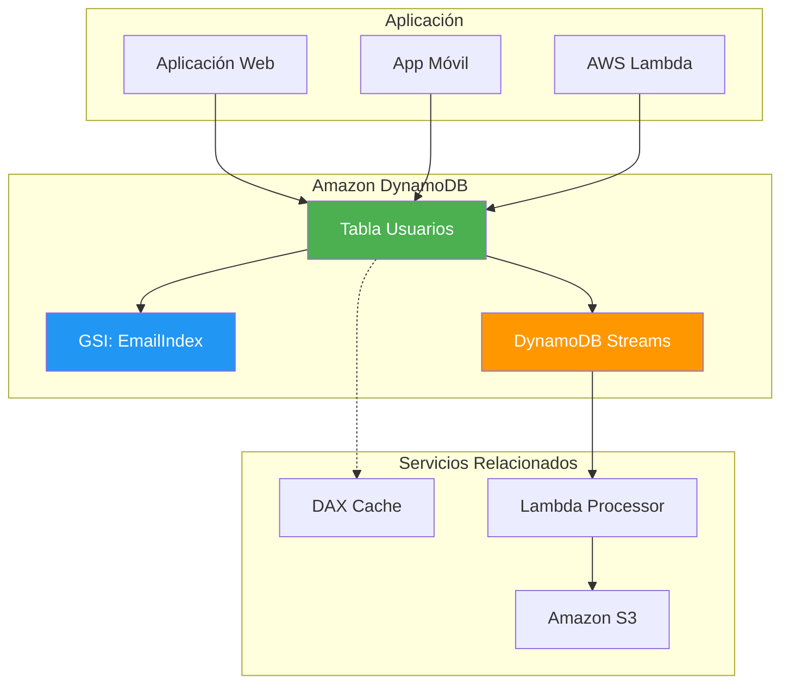
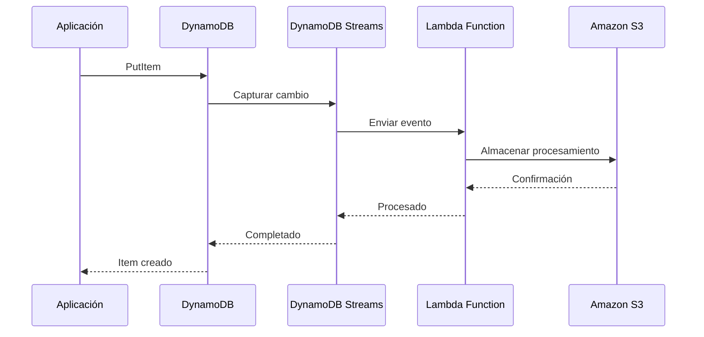
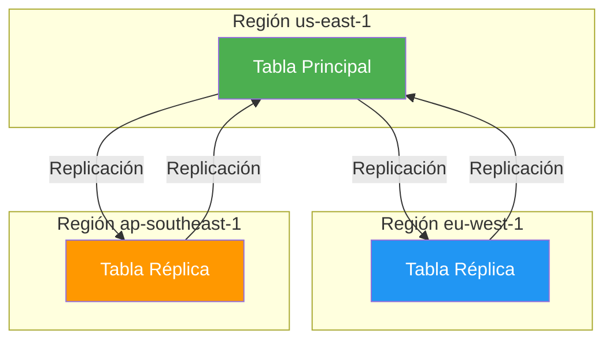
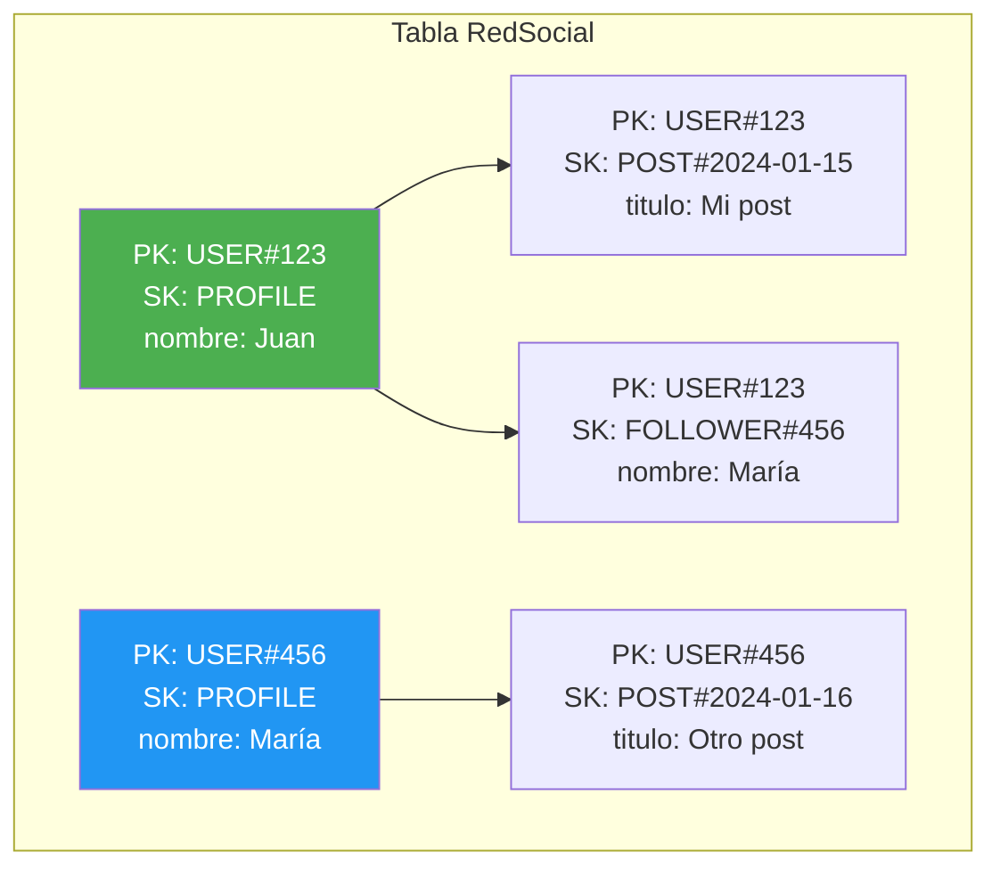

# Amazon DynamoDB - NoSQL Database

## Tabla de contenidos

- [¿Qué es Amazon DynamoDB?](#qué-es-amazon-dynamodb)
- [Tablas, Items y Atributos](#tablas-items-y-atributos)
- [Claves Primarias](#claves-primarias)
- [GSI y LSI](#gsi-y-lsi)
- [DynamoDB Streams](#dynamodb-streams)
- [DynamoDB Accelerator (DAX)](#dynamodb-accelerator-dax)
- [DynamoDB TTL](#dynamodb-ttl)
- [On-Demand vs Provisioned Capacity](#on-demand-vs-provisioned-capacity)
- [Auto Scaling para DynamoDB](#auto-scaling-para-dynamodb)
- [DynamoDB Global Tables](#dynamodb-global-tables)
- [Transacciones](#transacciones)
- [PartiQL](#partiql)
- [Diseño de tabla única](#diseño-de-tabla-única)
- [Seguridad](#seguridad)
- [Modelo de precios](#modelo-de-precios)
- [Mejores prácticas](#mejores-prácticas)
- [Errores comunes](#errores-comunes)
- [Cuándo usar vs RDS](#cuándo-usar-vs-rds)
- [Ejemplos de código](#ejemplos-de-código)
- [Diagramas Mermaid](#diagramas-mermaid)
- [Preguntas frecuentes (FAQ)](#preguntas-frecuentes-faq)
- [Consejos para entrevistas](#consejos-para-entrevistas)
- [Resumen](#resumen)

---

## ¿Qué es Amazon DynamoDB?

Amazon DynamoDB es una base de datos NoSQL completamente gestionada que ofrece rendimiento de un solo dígito de milisegundos a cualquier escala. Piensa en DynamoDB como un **diccionario super-rápido**: puedes buscar cualquier elemento instantáneamente sin importar cuántos datos tengas almacenados.

DynamoDB está diseñado para aplicaciones que requieren latencia consistente y baja, escalabilidad masiva y disponibilidad alta.

### Características principales

| Característica | Descripción |
|----------------|-------------|
| **Rendimiento** | Latencia de un solo dígito de milisegundos |
| **Escalabilidad** | Escala automáticamente a cualquier tamaño |
| **Disponibilidad** | 99.999% de disponibilidad |
| **Durabilidad** | Los datos se almacenan en múltiples AZs |
| **Gestión completa** | Sin infraestructura que administrar |
| **Event-driven** | DynamoDB Streams para procesamiento de eventos |
| **Global** | Global Tables para replicación multi-región |

---

## Tablas, Items y Atributos

### Estructura de datos

```text
Tabla (Table)
├── Item 1
│   ├── Atributo 1 (Partition Key)
│   ├── Atributo 2 (Sort Key)
│   └── Atributo 3 (Atributo adicional)
├── Item 2
│   ├── Atributo 1 (Partition Key)
│   ├── Atributo 2 (Sort Key)
│   └── Atributo 3 (Atributo adicional)
└── Item 3
    ├── Atributo 1 (Partition Key)
    ├── Atributo 2 (Sort Key)
    └── Atributo 3 (Atributo adicional)
```

### Tablas

Una **tabla** es una colección de items. Es como una hoja de cálculo o una tabla de base de datos.

```bash
# Crear tabla
aws dynamodb create-table \
  --table-name Usuarios \
  --attribute-definitions \
    AttributeName=usuario_id,AttributeType=N \
    AttributeName=fecha_registro,AttributeType=S \
  --key-schema \
    AttributeName=usuario_id,KeyType=HASH \
    AttributeName=fecha_registro,KeyType=RANGE \
  --billing-mode PAY_PER_REQUEST \
  --tags Key=Name,Value=TablaUsuarios
```

### Items

Un **item** es una colección de atributos. Es como una fila en una tabla de base de datos. Cada item es único dentro de la tabla.

```json
{
  "usuario_id": 123,
  "nombre": "Juan Pérez",
  "email": "juan@ejemplo.com",
  "fecha_registro": "2024-01-15T10:30:00Z",
  "activo": true,
  "preferencias": {
    "idioma": "es",
    "moneda": "USD"
  }
}
```

### Atributos

Un **atributo** es un dato fundamental en un item. DynamoDB soporta los siguientes tipos de datos:

| Tipo | Descripción | Ejemplo |
|------|-------------|---------|
| `S` | String | `"Hola"` |
| `N` | Number | `123` |
| `B` | Binary | `dGhpcyBpcyBhIHRlc3Q=` |
| `BOOL` | Boolean | `true` |
| `NULL` | Null | `null` |
| `L` | List | `["a", "b", "c"]` |
| `M` | Map | `{"key": "value"}` |
| `SS` | String Set | `["a", "b", "c"]` |
| `NS` | Number Set | `[1, 2, 3]` |
| `BS` | Binary Set | `["base64", "base64"]` |

---

## Claves Primarias

DynamoDB ofrece dos tipos de claves primarias para organizar y acceder a los datos.

### Partition Key (Clave de partición)

La **partition key** es un atributo que se usa para distribuir los datos entre las particiones de DynamoDB. Es como el **índice principal** de tu tabla.

```json
{
  "usuario_id": 123,  // Partition Key
  "nombre": "Juan Pérez",
  "email": "juan@ejemplo.com"
}
```

### Sort Key (Clave de ordenación)

La **sort key** es un atributo opcional que se usa para ordenar los items dentro de una partición. Es como un **índice secundario** dentro de cada partición.

```json
{
  "usuario_id": 123,  // Partition Key
  "fecha_registro": "2024-01-15T10:30:00Z",  // Sort Key
  "nombre": "Juan Pérez"
}
```

### Composite Primary Key

La **composite primary key** combina partition key y sort key para crear una clave única para cada item.

```bash
# Crear tabla con composite primary key
aws dynamodb create-table \
  --table-name Pedidos \
  --attribute-definitions \
    AttributeName=usuario_id,AttributeType=N \
    AttributeName=pedido_id,AttributeType=S \
  --key-schema \
    AttributeName=usuario_id,KeyType=HASH \
    AttributeName=pedido_id,KeyType=RANGE \
  --billing-mode PAY_PER_REQUEST
```

---

## GSI y LSI

Los índices secundarios permiten buscar datos por atributos que no son la clave primaria.

### Global Secondary Index (GSI)

Un **GSI** es un índice con una partition key y sort key diferentes a la clave primaria de la tabla. Es como un **índice global** que puede ser consultado de forma independiente.

```bash
# Crear GSI
aws dynamodb update-table \
  --table-name Usuarios \
  --attribute-definitions \
    AttributeName=email,AttributeType=S \
    AttributeName=fecha_registro,AttributeType=S \
  --global-secondary-index-updates '[
    {
      "Create": {
        "IndexName": "EmailIndex",
        "KeySchema": [
          {"AttributeName": "email", "KeyType": "HASH"},
          {"AttributeName": "fecha_registro", "KeyType": "RANGE"}
        ],
        "Projection": {"ProjectionType": "ALL"},
        "ProvisionedThroughput": {
          "ReadCapacityUnits": 5,
          "WriteCapacityUnits": 5
        }
      }
    }
  ]'
```

### Local Secondary Index (LSI)

Un **LSI** es un índice con la misma partition key que la clave primaria, pero una sort key diferente. Es como un **índice local** dentro de cada partición.

```bash
# Crear LSI (solo al crear la tabla)
aws dynamodb create-table \
  --table-name Pedidos \
  --attribute-definitions \
    AttributeName=usuario_id,AttributeType=N \
    AttributeName=pedido_id,AttributeType=S \
    AttributeName=fecha_pedido,AttributeType=S \
  --key-schema \
    AttributeName=usuario_id,KeyType=HASH \
    AttributeName=pedido_id,KeyType=RANGE \
  --local-secondary-indexes '[
    {
      "IndexName": "FechaPedidoIndex",
      "KeySchema": [
        {"AttributeName": "usuario_id", "KeyType": "HASH"},
        {"AttributeName": "fecha_pedido", "KeyType": "RANGE"}
      ],
      "Projection": {"ProjectionType": "ALL"}
    }
  ]' \
  --billing-mode PAY_PER_REQUEST
```

### Comparación GSI vs LSI

| Característica | GSI | LSI |
|----------------|-----|-----|
| **Partition Key** | Puede ser diferente | Debe ser la misma |
| **Sort Key** | Puede ser diferente | Debe ser diferente |
| **Creación** | En cualquier momento | Solo al crear la tabla |
| **Límite** | 20 por tabla | 5 por tabla |
| **Escalabilidad** | Independiente | Comparte con la tabla |

---

## DynamoDB Streams

**DynamoDB Streams** captura un registro de las modificaciones de datos en tu tabla. Es como un **historial de cambios** que puedes usar para procesamiento de eventos.

### Casos de uso

- **Replicación de datos**: Sincronizar con otras bases de datos
- **Procesamiento de eventos**: Trigger de Lambda para cada cambio
- **Auditoría**: Registrar cambios en los datos
- **Cache invalidation**: Invalidar caché cuando los datos cambian

### Configurar DynamoDB Streams

```bash
# Habilitar DynamoDB Streams
aws dynamodb update-table \
  --table-name Usuarios \
  --stream-specification StreamEnabled=true,StreamViewType=NEW_AND_OLD_IMAGES
```

### Tipos de StreamViewType

| Tipo | Descripción |
|------|-------------|
| `KEYS_ONLY` | Solo las claves de los items modificados |
| `NEW_IMAGE` | El item después de la modificación |
| `OLD_IMAGE` | El item antes de la modificación |
| `NEW_AND_OLD_IMAGES` | Ambos: antes y después |

### Ejemplo de procesamiento con Lambda

```javascript
// Lambda function para procesar DynamoDB Streams
const AWS = require('aws-sdk');

exports.handler = async (event) => {
    for (const record of event.Records) {
        if (record.eventName === 'INSERT') {
            const newImage = AWS.DynamoDB.Converter.unmarshall(
                record.dynamodb.NewImage
            );
            console.log('Nuevo item insertado:', newImage);
            
            // Procesar el nuevo item
            await procesarNuevoItem(newImage);
        }
        
        if (record.eventName === 'MODIFY') {
            const oldImage = AWS.DynamoDB.Converter.unmarshall(
                record.dynamodb.OldImage
            );
            const newImage = AWS.DynamoDB.Converter.unmarshall(
                record.dynamodb.NewImage
            );
            console.log('Item modificado:', { old: oldImage, new: newImage });
        }
        
        if (record.eventName === 'REMOVE') {
            const oldImage = AWS.DynamoDB.Converter.unmarshall(
                record.dynamodb.OldImage
            );
            console.log('Item eliminado:', oldImage);
        }
    }
};
```

---

## DynamoDB Accelerator (DAX)

**DAX** es una caché completamente gestionada para DynamoDB que ofrece rendimiento de microsegundos para lecturas repetidas.

### Características

- **Caché en memoria**: Respuestas en microsegundos
- **Compatible con DynamoDB**: Cambios mínimos en la aplicación
- **Escalable**: Se escala automáticamente
- **Multi-AZ**: Alta disponibilidad

```bash
# Crear clúster DAX
aws dynamodb create-cache-cluster \
  --cache-cluster-name mi-cache-dax \
  --cache-node-type cache.r5.large \
  --num-cache-nodes 2 \
  --replication-factor 2 \
  --iam-role-arn arn:aws:iam::123456789012:role/rol-dax
```

---

## DynamoDB TTL

**TTL (Time to Live)** elimina automáticamente items después de un período específico. Es como poner una **fecha de caducidad** en tus datos.

### Casos de uso

- **Sesiones de usuario**: Eliminar sesiones expiradas
- **Tokens temporales**: Eliminar tokens caducados
- **Logs**: Eliminar logs antiguos
- **Datos temporales**: Eliminar datos que ya no necesitas

### Configurar TTL

```bash
# Habilitar TTL
aws dynamodb update-time-to-live \
  --table-name SesionesUsuario \
  --time-to-live-specification '{
    "Enabled": true,
    "AttributeName": "fecha_expiracion"
  }'
```

---

## On-Demand vs Provisioned Capacity

DynamoDB ofrece dos modelos de capacidad para diferentes patrones de uso.

### On-Demand (PAY_PER_REQUEST)

- **Sin capacidad provisionada**: DynamoDB escala automáticamente
- **Cobro por uso**: Pagas por cada lectura y escritura
- **Ideal para**: Cargas de trabajo impredecibles, prototipos

### Provisioned

- **Capacidad provisionada**: Defines lecturas y escrituras por segundo
- **Cobro por capacidad**: Pagas por la capacidad provisionada
- **Ideal para**: Cargas de trabajo predecibles, optimización de costos

### Comparación

| Característica | On-Demand | Provisioned |
|----------------|-----------|-------------|
| **Escalabilidad** | Automática | Manual o Auto Scaling |
| **Costo** | Por uso | Por capacidad |
| **Ideal para** | Cargas impredecibles | Cargas predecibles |
| **Límites** | Sin límites | Límites por tabla |
| **Throttling** | Raro | Posible |

---

## Auto Scaling para DynamoDB

**Auto Scaling** ajusta automáticamente la capacidad de lectura y escritura de una tabla según la demanda.

```bash
# Configurar Auto Scaling
aws application-autoscaling register-scalable-target \
  --service-namespace dynamodb \
  --resource-id table/Usuarios \
  --scalable-dimension dynamodb:table:ReadCapacityUnits \
  --min-capacity 5 \
  --max-capacity 1000

# Configurar política de escalado
aws application-autoscaling put-scaling-policy \
  --service-namespace dynamodb \
  --scalable-dimension dynamodb:table:ReadCapacityUnits \
  --resource-id table/Usuarios \
  --policy-name LecturaAutoScaling \
  --policy-type TargetTrackingScaling \
  --target-tracking-scaling-policy-configuration '{
    "TargetValue": 70.0,
    "PredefinedMetricSpecification": {
      "PredefinedMetricType": "DynamoDBReadCapacityUtilization"
    },
    "ScaleInCooldown": 60,
    "ScaleOutCooldown": 60
  }'
```

---

## DynamoDB Global Tables

**Global Tables** replican automáticamente tu tabla DynamoDB en múltiples regiones de AWS. Es como tener **copias de tu tabla en todo el mundo**.

### Características

- **Replicación multi-región**: Datos cercanos a tus usuarios
- **Replicación bidireccional**: Escrituras en cualquier región
- **Baja latencia**: Acceso local en cada región
- **Alta disponibilidad**: Failover automático entre regiones

### Configurar Global Tables

```bash
# Habilitar Global Tables
aws dynamodb update-table \
  --table-name Usuarios \
  --replica-updates '[
    {
      "Create": {
        "RegionName": "eu-west-1",
        "KMSMasterKeyId": "arn:aws:kms:eu-west-1:123456789012:key/12345678-1234-1234-1234-123456789012"
      }
    },
    {
      "Create": {
        "RegionName": "ap-southeast-1",
        "KMSMasterKeyId": "arn:aws:kms:ap-southeast-1:123456789012:key/12345678-1234-1234-1234-123456789012"
      }
    }
  ]'
```

---

## Transacciones

DynamoDB soporta **transacciones** que permiten realizar múltiples operaciones de forma atómica. Es como un **paquete completo**: o todas las operaciones se ejecutan, o ninguna se ejecuta.

### Operaciones transaccionales

- `TransactWriteItems`: Escrituras atómicas
- `TransactGetItems`: Lecturas atómicas

```javascript
// Ejemplo de transacción
const params = {
    TransactItems: [
        {
            Put: {
                TableName: 'Pedidos',
                Item: {
                    pedido_id: { S: 'pedido-123' },
                    usuario_id: { N: '123' },
                    total: { N: '150.00' }
                }
            }
        },
        {
            Update: {
                TableName: 'Inventario',
                Key: {
                    producto_id: { S: 'producto-456' }
                },
                UpdateExpression: 'SET stock = stock - :cantidad',
                ExpressionAttributeValues: {
                    ':cantidad': { N: '1' }
                }
            }
        },
        {
            Put: {
                TableName: 'Pagos',
                Item: {
                    pago_id: { S: 'pago-789' },
                    pedido_id: { S: 'pedido-123' },
                    monto: { N: '150.00' }
                }
            }
        }
    ]
};

await dynamodb.transactWrite(params).promise();
```

---

## PartiQL

**PartiQL** es un lenguaje de consultas compatible con SQL para DynamoDB. Es como usar **SQL familiar** pero para bases de datos NoSQL.

```sql
-- Seleccionar items
SELECT * FROM Usuarios WHERE usuario_id = 123;

-- Insertar item
INSERT INTO Usuarios VALUES {
    'usuario_id': 123,
    'nombre': 'Juan Pérez',
    'email': 'juan@ejemplo.com'
};

-- Actualizar item
UPDATE Usuarios SET email = 'nuevo@ejemplo.com' WHERE usuario_id = 123;

-- Eliminar item
DELETE FROM Usuarios WHERE usuario_id = 123;
```

---

## Diseño de tabla única

El **diseño de tabla única** es un patrón de diseño en DynamoDB donde almacenas múltiples tipos de entidades en una sola tabla. Es como tener **todas las piezas de un rompecabezas en una sola caja**.

### Ejemplo: Tabla de redes sociales

```json
{
  "PK": "USER#123",
  "SK": "PROFILE",
  "nombre": "Juan Pérez",
  "email": "juan@ejemplo.com"
}
{
  "PK": "USER#123",
  "SK": "POST#2024-01-15",
  "titulo": "Mi primera publicación",
  "contenido": "Hola mundo"
}
{
  "PK": "USER#123",
  "SK": "FOLLOWER#456",
  "nombre": "María García"
}
{
  "PK": "USER#123",
  "SK": "FOLLOWING#789",
  "nombre": "Carlos López"
}
```

### Consultas con tabla única

```javascript
// Obtener perfil de usuario
const params = {
    TableName: 'RedSocial',
    KeyConditionExpression: 'PK = :pk AND SK = :sk',
    ExpressionAttributeValues: {
        ':pk': 'USER#123',
        ':sk': 'PROFILE'
    }
};

// Obtener todas las publicaciones de un usuario
const params = {
    TableName: 'RedSocial',
    KeyConditionExpression: 'PK = :pk AND begins_with(SK, :sk)',
    ExpressionAttributeValues: {
        ':pk': 'USER#123',
        ':sk': 'POST#'
    }
};

// Obtener seguidores de un usuario
const params = {
    TableName: 'RedSocial',
    KeyConditionExpression: 'PK = :pk AND begins_with(SK, :sk)',
    ExpressionAttributeValues: {
        ':pk': 'USER#123',
        ':sk': 'FOLLOWER#'
    }
};
```

---

## Seguridad

### IAM

```json
{
  "Version": "2012-10-17",
  "Statement": [
    {
      "Effect": "Allow",
      "Action": [
        "dynamodb:GetItem",
        "dynamodb:PutItem",
        "dynamodb:Query"
      ],
      "Resource": "arn:aws:dynamodb:us-east-1:123456789012:table/Usuarios"
    }
  ]
}
```

### VPC Endpoints

```bash
# Crear VPC Endpoint para DynamoDB
aws ec2 create-vpc-endpoint \
  --vpc-id vpc-0123456789abcdef0 \
  --service-name com.amazonaws.us-east-1.dynamodb \
  --route-table-ids rtb-0123456789abcdef0
```

### Cifrado

```bash
# Crear tabla con cifrado KMS
aws dynamodb create-table \
  --table-name UsuariosCifrada \
  --attribute-definitions \
    AttributeName=usuario_id,AttributeType=N \
  --key-schema \
    AttributeName=usuario_id,KeyType=HASH \
  --sse-specification '{
    "Enabled": true,
    "SSEType": "KMS",
    "KMSMasterKeyId": "arn:aws:kms:us-east-1:123456789012:key/12345678-1234-1234-1234-123456789012"
  }' \
  --billing-mode PAY_PER_REQUEST
```

---

## Modelo de precios

DynamoDB cobra por:

1. **Almacenamiento**: Por GB-mes
2. **Lecturas**: Por Read Capacity Unit (RCU)
3. **Escrituras**: Por Write Capacity Unit (WCU)
4. **Transferencia**: Por GB transferido fuera de la región
5. **DAX**: Por nodo de caché
6. **Streams**: Por GB de datos de streams
7. **Backups**: Por GB-mes para backups de tablas

### Unidades de capacidad

| Unidad | Descripción | Equivalencia |
|--------|-------------|--------------|
| **RCU** | Read Capacity Unit | 1 item de 4 KB por segundo |
| **WCU** | Write Capacity Unit | 1 item de 1 KB por segundo |

### Ejemplo de costos

```text
Tabla On-Demand:
- Almacenamiento: 10 GB × $0.25/GB = $2.50/mes
- Lecturas: 1,000,000 RCU × $0.00013 = $130.00/mes
- Escrituras: 500,000 WCU × $0.00065 = $325.00/mes
- Total estimado: $457.50/mes

Tabla Provisioned:
- Almacenamiento: 10 GB × $0.25/GB = $2.50/mes
- Lecturas: 100 RCU × $0.00013 × 730 = $9.49/mes
- Escrituras: 50 WCU × $0.00065 × 730 = $23.73/mes
- Total estimado: $35.72/mes
```

---

## Mejores prácticas

### Diseño de tablas

1. **Diseñar para las consultas**: Define tablas según las consultas de tu aplicación
2. **Usar composite keys**: Para consultas eficientes
3. **Evitar hot spots**: Distribuye la carga entre particiones
4. **Usar GSI para consultas secundarias**: No escanees la tabla completa

### Rendimiento

1. **Usar DynamoDB Streams**: Para procesamiento de eventos
2. **Implementar caché con DAX**: Para lecturas repetidas
3. **Usar batch operations**: Para múltiples operaciones
4. **Evitar scans**: Usar queries siempre que sea posible

### Costos

1. **Elegir el modo correcto**: On-Demand o Provisioned
2. **Usar Auto Scaling**: Para cargas variables
3. **Monitorear consumo**: Usar CloudWatch
4. **Eliminar tablas no utilizadas**: Reducir costos

### Seguridad

1. **Usar IAM**: Principio de menor privilegio
2. **Habilitar cifrado**: En reposo y en tránsito
3. **Usar VPC endpoints**: Para acceso privado
4. **Habilitar point-in-time recovery**: Para recuperación de datos

---

## Errores comunes

### 1. Usar scans en lugar de queries

```text
❌ "Mi consulta es lenta porque escaneo toda la tabla"
✅ Usar queries con partition key y sort key
```

### 2. No diseñar para las consultas

```text
❌ "Mi tabla no soporta las consultas que necesito"
✅ Diseñar la tabla según las consultas de la aplicación
```

### 3. No usar batch operations

```text
❌ "Mis operaciones son lentas porque las hago una por una"
✅ Usar batch operations para múltiples operaciones
```

### 4. No monitorear consumo

```text
❌ "Mi factura de DynamoDB es inesperadamente alta"
✅ Usar CloudWatch para monitorear RCU y WCU
```

### 5. No usar DAX para lecturas repetidas

```text
❌ "Mis lecturas son lentas para datos que se repiten"
✅ Implementar DAX para caché en memoria
```

---

## Cuándo usar vs RDS

### Cuándo usar DynamoDB

- **Datos semi-estructurados o no estructurados**
- **Escalabilidad masiva**: Millones de requests por segundo
- **Latencia consistente**: Un solo dígito de milisegundos
- **Esquema flexible**: Atributos variables entre items
- **Event-driven**: Procesamiento de eventos con Streams
- **Global**: Replicación multi-región con Global Tables

### Cuándo usar RDS

- **Datos estructurados**: Relaciones claras entre tablas
- **Transacciones complejas**: Múltiples operaciones atómicas
- **Consultas SQL complejas**: JOINs, subconsultas, agregaciones
- **Reportes**: Consultas analíticas complejas
- **Legado**: Aplicaciones que requieren SQL

### Comparación

| Característica | DynamoDB | RDS |
|----------------|----------|-----|
| **Modelo de datos** | Key-Value, Document | Relacional |
| **Escalabilidad** | Automática | Manual |
| **Latencia** | Un solo dígito ms | Variable |
| **Consultas** | Simple, indexadas | SQL complejo |
| **Transacciones** | Soportadas | Soportadas |
| **Costo** | Por uso | Por instancia |

---

## Ejemplos de código

### Ejemplo 1: Node.js SDK - Operaciones básicas

```javascript
const { DynamoDBClient } = require('@aws-sdk/client-dynamodb');
const { 
    DynamoDBDocumentClient, 
    PutCommand, 
    GetCommand, 
    QueryCommand, 
    UpdateCommand, 
    DeleteCommand 
} = require('@aws-sdk/lib-dynamodb');

const client = new DynamoDBClient({ region: 'us-east-1' });
const docClient = DynamoDBDocumentClient.from(client);

async function crearItem(tabla, item) {
    const command = new PutCommand({
        TableName: tabla,
        Item: item
    });
    
    await docClient.send(command);
    console.log('Item creado:', item);
}

async function obtenerItem(tabla, key) {
    const command = new GetCommand({
        TableName: tabla,
        Key: key
    });
    
    const response = await docClient.send(command);
    return response.Item;
}

async function consultarItems(tabla, partitionKeyValue, sortKeyBeginsWith) {
    const command = new QueryCommand({
        TableName: tabla,
        KeyConditionExpression: 'PK = :pk AND begins_with(SK, :sk)',
        ExpressionAttributeValues: {
            ':pk': partitionKeyValue,
            ':sk': sortKeyBeginsWith
        }
    });
    
    const response = await docClient.send(command);
    return response.Items;
}

async function actualizarItem(tabla, key, updateExpression, expressionValues) {
    const command = new UpdateCommand({
        TableName: tabla,
        Key: key,
        UpdateExpression: updateExpression,
        ExpressionAttributeValues: expressionValues,
        ReturnValues: 'ALL_NEW'
    });
    
    const response = await docClient.send(command);
    return response.Attributes;
}

async function eliminarItem(tabla, key) {
    const command = new DeleteCommand({
        TableName: tabla,
        Key: key
    });
    
    await docClient.send(command);
    console.log('Item eliminado');
}

// Ejemplo de uso
async function main() {
    await crearItem('Usuarios', {
        usuario_id: 123,
        nombre: 'Juan Pérez',
        email: 'juan@ejemplo.com'
    });
    
    const usuario = await obtenerItem('Usuarios', { usuario_id: 123 });
    console.log('Usuario:', usuario);
    
    const publicaciones = await consultarItems('Publicaciones', 123, 'POST#');
    console.log('Publicaciones:', publicaciones);
}

main().catch(console.error);
```

### Ejemplo 2: AWS CLI - Crear y gestionar DynamoDB

```bash
# Crear tabla
aws dynamodb create-table \
  --table-name Usuarios \
  --attribute-definitions \
    AttributeName=usuario_id,AttributeType=N \
    AttributeName=email,AttributeType=S \
  --key-schema \
    AttributeName=usuario_id,KeyType=HASH \
  --global-secondary-indexes '[
    {
      "IndexName": "EmailIndex",
      "KeySchema": [
        {"AttributeName": "email", "KeyType": "HASH"}
      ],
      "Projection": {"ProjectionType": "ALL"},
      "ProvisionedThroughput": {
        "ReadCapacityUnits": 5,
        "WriteCapacityUnits": 5
      }
    }
  ]' \
  --provisioned-throughput '{
    "ReadCapacityUnits": 5,
    "WriteCapacityUnits": 5
  }'

# Insertar item
aws dynamodb put-item \
  --table-name Usuarios \
  --item '{
    "usuario_id": {"N": "123"},
    "nombre": {"S": "Juan Pérez"},
    "email": {"S": "juan@ejemplo.com"},
    "activo": {"BOOL": true}
  }'

# Obtener item
aws dynamodb get-item \
  --table-name Usuarios \
  --key '{"usuario_id": {"N": "123"}}'

# Consultar items
aws dynamodb query \
  --table-name Usuarios \
  --key-condition-expression "usuario_id = :id" \
  --expression-attribute-values '{":id": {"N": "123"}}'

# Actualizar item
aws dynamodb update-item \
  --table-name Usuarios \
  --key '{"usuario_id": {"N": "123"}}' \
  --update-expression "SET email = :email" \
  --expression-attribute-values '{":email": {"S": "nuevo@ejemplo.com"}}'

# Eliminar item
aws dynamodb delete-item \
  --table-name Usuarios \
  --key '{"usuario_id": {"N": "123"}}'
```

### Ejemplo 3: Consulta con PartiQL

```javascript
const { DynamoDBClient } = require('@aws-sdk/client-dynamodb');
const { 
    DynamoDBDocumentClient, 
    ExecuteStatementCommand 
} = require('@aws-sdk/lib-dynamodb');

const client = new DynamoDBClient({ region: 'us-east-1' });
const docClient = DynamoDBDocumentClient.from(client);

async function consultarConPartiQL() {
    // Seleccionar items
    const selectCommand = new ExecuteStatementCommand({
        Statement: 'SELECT * FROM Usuarios WHERE usuario_id = ?',
        Parameters: [123]
    });
    
    const selectResult = await docClient.send(selectCommand);
    console.log('Resultado SELECT:', selectResult.Items);
    
    // Insertar item
    const insertCommand = new ExecuteStatementCommand({
        Statement: 'INSERT INTO Usuarios VALUES {\'usuario_id\': ?, \'nombre\': ?, \'email\': ?}',
        Parameters: [456, 'María García', 'maria@ejemplo.com']
    });
    
    await docClient.send(insertCommand);
    
    // Actualizar item
    const updateCommand = new ExecuteStatementCommand({
        Statement: 'UPDATE Usuarios SET email = ? WHERE usuario_id = ?',
        Parameters: ['nuevo@ejemplo.com', 123]
    });
    
    await docClient.send(updateCommand);
    
    // Eliminar item
    const deleteCommand = new ExecuteStatementCommand({
        Statement: 'DELETE FROM Usuarios WHERE usuario_id = ?',
        Parameters: [456]
    });
    
    await docClient.send(deleteCommand);
}

consultarConPartiQL().catch(console.error);
```

---

## Diagramas Mermaid

### Arquitectura de DynamoDB



### Flujo de DynamoDB Streams



### Global Tables



### Diseño de tabla única



---

## Preguntas frecuentes (FAQ)

### ¿Cuál es la diferencia entre DynamoDB y RDS?
DynamoDB es una base de datos NoSQL key-value/document con escalabilidad automática y latencia de un solo dígito de milisegundos. RDS es una base de datos relacional con SQL completo, ideal para consultas complejas y transacciones.

### ¿Cuánto cuesta DynamoDB?
Los costos varían según el modo (On-Demand o Provisioned), el almacenamiento y las operaciones. Consulta la [página de precios de DynamoDB](https://aws.amazon.com/dynamodb/pricing/) para obtener información actualizada.

### ¿DynamoDB es escalable?
Sí, DynamoDB escala automáticamente para manejar cualquier carga de trabajo. Puede manejar millones de requests por segundo con latencia consistente.

### ¿Puedo usar SQL con DynamoDB?
Sí, DynamoDB soporta PartiQL, que es un lenguaje compatible con SQL para operaciones simples. Sin embargo, no soporta JOINs ni consultas SQL complejas.

### ¿Qué es DynamoDB Accelerator (DAX)?
DAX es una caché completamente gestionada para DynamoDB que ofrece rendimiento de microsegundos para lecturas repetidas.

### ¿DynamoDB es seguro?
Sí, DynamoDB ofrece cifrado en reposo y en tránsito, IAM, VPC endpoints y punto en el tiempo de recuperación.

### ¿Puedo usar DynamoDB con contenedores?
Sí, DynamoDB puede ser usado con ECS, EKS y Docker. Es ideal para aplicaciones que necesitan latencia baja y alta disponibilidad.

### ¿Qué es DynamoDB Streams?
DynamoDB Streams captura un registro de las modificaciones de datos en tu tabla, permitiendo procesamiento de eventos y replicación de datos.

### ¿Puedo replicar DynamoDB entre regiones?
Sí, DynamoDB Global Tables replican automáticamente tu tabla en múltiples regiones de AWS.

### ¿Cuándo debo usar DynamoDB?
Usa DynamoDB cuando necesites latencia baja y consistente, escalabilidad masiva, datos semi-estructurados o procesamiento de eventos.

---

## Consejos para entrevistas

### Preguntas técnicas comunes

1. **¿Cuál es la diferencia entre DynamoDB y RDS?**
   - DynamoDB: NoSQL, escalabilidad automática, latencia baja
   - RDS: Relacional, SQL completo, consultas complejas

2. **¿Qué es un GSI y cuándo usarlo?**
   - GSI es un índice secundario global con partition key diferente
   - Usar cuando necesites consultar por atributos que no son la clave primaria

3. **¿Cómo evitar hot spots en DynamoDB?**
   - Distribuir partition keys uniformemente
   - Usar prefijos de tiempo o aleatorios
   - Monitorear métricas de throughput

4. **¿Qué es DynamoDB Streams y cuándo usarlo?**
   - Streams capturan cambios en la tabla
   - Usar para procesamiento de eventos, replicación, auditoría

5. **¿Cómo diseñar una tabla única en DynamoDB?**
   - Definir PK y SK para soportar todas las consultas
   - Usar prefijos para diferentes tipos de entidades
   - Diseñar para las consultas, no para los datos

### Buenas respuestas

- Menciona la **diferencia entre On-Demand y Provisioned**
- Explica la importancia de **diseñar para las consultas**
- Describe cómo **DAX** mejora el rendimiento
- Habla sobre **Global Tables** para replicación
- Menciona **PartiQL** para consultas SQL

---

## Resumen

Amazon DynamoDB es una base de datos NoSQL completamente gestionada que ofrece rendimiento de un solo dígito de milisegundos a cualquier escala.

| Concepto | Descripción |
|----------|-------------|
| **Tablas** | Colecciones de items |
| **Items** | Colecciones de atributos |
| **Claves** | Partition Key y Sort Key |
| **GSI/LSI** | Índices secundarios |
| **Streams** | Captura de cambios |
| **DAX** | Caché en memoria |
| **TTL** | Expiración automática |
| **Global Tables** | Replicación multi-región |

### Checklist de implementación

- [ ] Diseñar tabla según consultas de la aplicación
- [ ] Elegir modo de capacidad adecuado
- [ ] Crear GSI para consultas secundarias
- [ ] Habilitar DynamoDB Streams si es necesario
- [ ] Implementar caché con DAX para lecturas repetidas
- [ ] Configurar cifrado
- [ ] Implementar punto en el tiempo de recuperación
- [ ] Monitorear métricas de CloudWatch
- [ ] Documentar diseño de tablas

---

*Última actualización: 2024*
