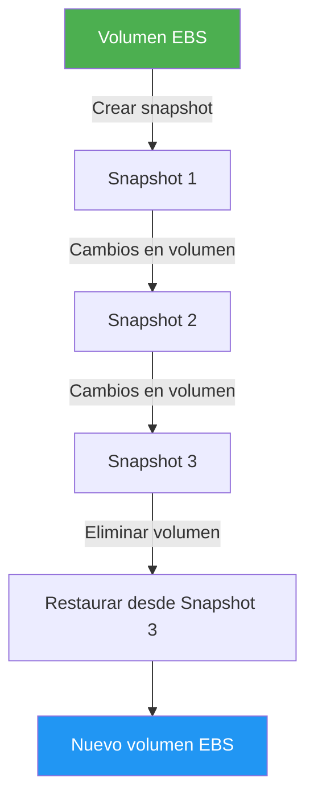
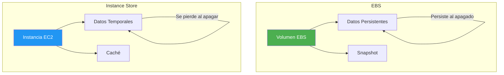
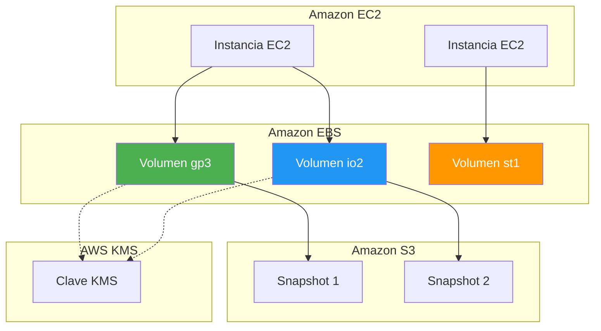
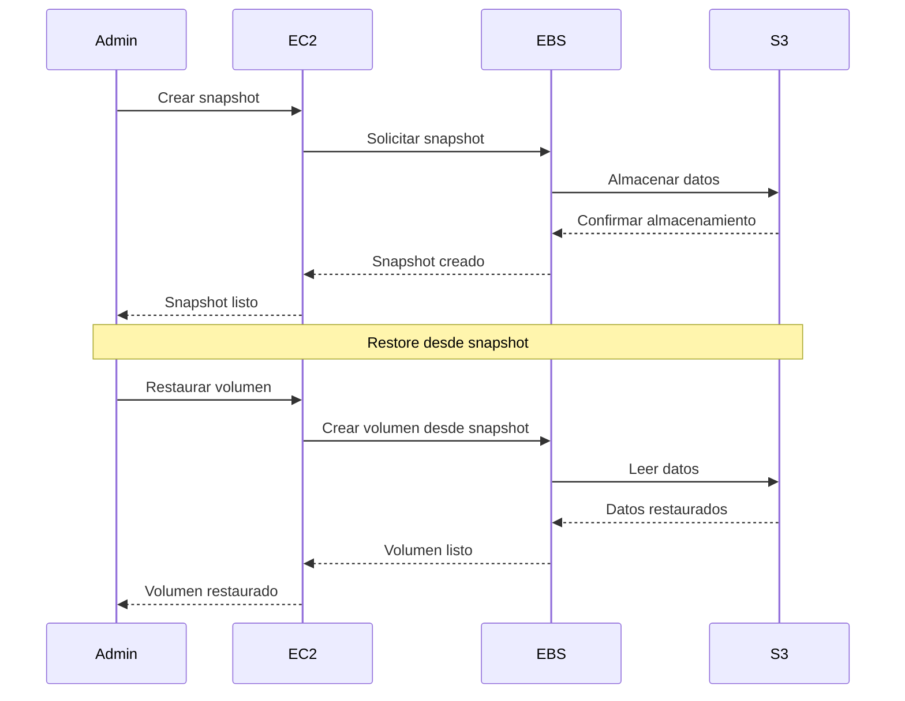
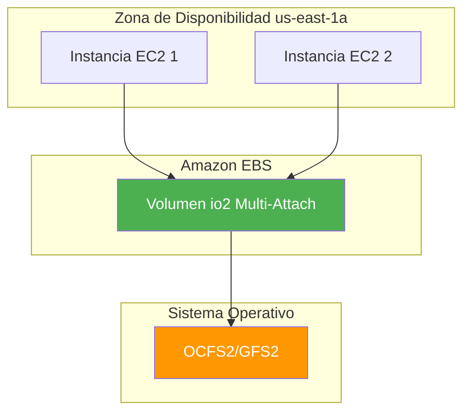

# Amazon EBS - Elastic Block Store

## Tabla de contenidos

- [¿Qué es Amazon EBS?](#qué-es-amazon-ebs)
- [Conceptos fundamentales](#conceptos-fundamentales)
- [Tipos de volumen](#tipos-de-volumen)
- [Snapshots](#snapshots)
- [Encriptación](#encriptación)
- [Multi-Attach](#multi-attach)
- [Fast Restore](#fast-restore)
- [Métricas de rendimiento](#métricas-de-rendimiento)
- [EBS vs Instance Store](#ebs-vs-instance-store)
- [Modelo de precios](#modelo-de-precios)
- [Mejores prácticas](#mejores-prácticas)
- [Errores comunes](#errores-comunes)
- [Ejemplos de código](#ejemplos-de-código)
- [Diagramas Mermaid](#diagramas-mermaid)
- [Preguntas frecuentes (FAQ)](#preguntas-frecuentes-faq)
- [Consejos para entrevistas](#consejos-para-entrevistas)
- [Resumen](#resumen)

---

## ¿Qué es Amazon EBS?

Amazon Elastic Block Store (EBS) es un servicio de almacenamiento de bloques que proporciona almacenamiento persistente para instancias EC2. Piensa en EBS como un **disco duro externo** que conectas a tu servidor virtual: puedes desconectarlo de una instancia y conectarlo a otra, pero los datos se mantienen intactos.

EBS está diseñado para casos de uso que requieren bajo latencia y alto rendimiento, como bases de datos, sistemas de archivos y aplicaciones empresariales.

### Características principales

| Característica | Descripción |
|----------------|-------------|
| **Persistente** | Los datos sobreviven al apagado de la instancia EC2 |
| **Escalable** | Puedes cambiar el tamaño y tipo de volumen en cualquier momento |
| **Snapshots** | Copias de seguridad incrementales en S3 |
| **Encriptación** | Encriptación automática de datos en reposo |
| **Disponibilidad** | 99.99% de disponibilidad |
| **Multi-Attach** | Conectar un volumen a múltiples instancias (solo io2) |

---

## Conceptos fundamentales

### Volúmenes

Un **volumen EBS** es un dispositivo de almacenamiento de bloques que se adjunta a una instancia EC2. Cada volumen se comporta como un disco duro bruto no formateado.

```text
┌─────────────────────────────────────────┐
│           Instancia EC2                 │
│  ┌─────────────────────────────────┐    │
│  │     Sistema Operativo           │    │
│  │  ┌─────────────────────────┐    │    │
│  │  │   Volumen EBS (raíz)   │    │    │
│  │  │   /dev/xvda             │    │    │
│  │  └─────────────────────────┘    │    │
│  └─────────────────────────────────┘    │
│  ┌─────────────────────────────────┐    │
│  │   Volumen EBS (datos)           │    │
│  │   /dev/xvdf                     │    │
│  └─────────────────────────────────┘    │
└─────────────────────────────────────────┘
```

### Dispositivos de bloque

Cada volumen EBS se presenta a la instancia como un dispositivo de bloque. Los nombres de los dispositivos varían según el sistema operativo:

| Sistema operativo | Nombre del dispositivo |
|-------------------|----------------------|
| Linux | `/dev/xvda`, `/dev/xvdf`, `/dev/xvdg` |
| Windows | `C:`, `D:`, `E:` |

### Puntos de montaje

En Linux, los volúmenes EBS se montan en directorios específicos:

```bash
# Crear sistema de archivos
sudo mkfs.ext4 /dev/xvdf

# Crear punto de montaje
sudo mkdir /mnt/datos

# Montar el volumen
sudo mount /dev/xvdf /mnt/datos

# Montaje automático al reiniciar
echo '/dev/xvdf /mnt/datos ext4 defaults,nofail 0 2' | sudo tee -a /etc/fstab
```

---

## Tipos de volumen

AWS ofrece diferentes tipos de volúmenes EBS optimizados para diferentes casos de uso. La elección correcta es crucial para el rendimiento y los costos.

### Tabla comparativa

| Tipo | Nombre completo | Capacidad | IOPS máx. | Throughput máx. | Uso ideal |
|------|----------------|-----------|-----------|-----------------|-----------|
| **gp3** | General Purpose SSD | 1 GiB - 16 TiB | 16,000 | 1,000 MB/s | Trabajo general, costo-eficiente |
| **gp2** | General Purpose SSD | 1 GiB - 16 TiB | 16,000 | 250 MB/s | Trabajo general (legado) |
| **io2** | Provisioned IOPS SSD | 4 GiB - 16 TiB | 64,000 | 1,000 MB/s | Bases de datos de misión crítica |
| **io1** | Provisioned IOPS SSD | 4 GiB - 16 TiB | 64,000 | 1,000 MB/s | Bases de datos de misión crítica (legado) |
| **st1** | Throughput Optimized HDD | 500 GiB - 16 TiB | 500 | 500 MB/s | Datos de acceso frecuente, big data |
| **sc1** | Cold HDD | 500 GiB - 16 TiB | 250 | 250 MB/s | Datos de acceso menos frecuente |

### Detalle de cada tipo

#### gp3 (General Purpose SSD)

El tipo más reciente y recomendado para la mayoría de los casos de uso. Ofrece un 30% más de precio por IOPS que gp2 y permite configurar IOPS y throughput de forma independiente.

```text
Costo base: $0.08/GB-mes
IOPS base: 3,000 (incluso sin pago adicional)
Throughput base: 125 MB/s
```

**Ideal para:** Sistemas de archivos de boot, bases de datos de tamaño pequeño a mediano, aplicaciones empresariales.

#### gp2 (General Purpose SSD)

El tipo general anterior, aún ampliamente utilizado pero reemplazado por gp3 para nuevos volúmenes.

```text
Costo: $0.10/GB-mes
IOPS: 3-16,000 (escala con el tamaño del volumen)
Throughput: Hasta 250 MB/s
```

#### io2 (Provisioned IOPS SSD)

El tipo de mayor rendimiento para aplicaciones de misión crítica que requieren IOPS consistentes y bajos tiempos de respuesta.

```text
Costo: $0.125/GB-mes + $0.065/IOPS-mes
IOPS: 100-64,000
Throughput: Hasta 1,000 MB/s
Durabilidad: 99.999%
```

**Ideal para:** Bases de datos Oracle, SQL Server, bases de datos SAP, aplicaciones transaccionales de alta frecuencia.

#### io1 (Provisioned IOPS SSD)

Predecesor de io2, aún disponible pero reemplazado por io2 para nuevos volúmenes.

#### st1 (Throughput Optimized HDD)

Disco de estado sólido optimizado para throughput, ideal para big data y cargas de trabajo secuenciales.

```text
Costo: $0.045/GB-mes
IOPS: Hasta 500
Throughput: Hasta 500 MB/s
```

**Ideal para:** Data warehouses, big data, logs, cargas de trabajo secuenciales.

#### sc1 (Cold HDD)

La opción más económica para datos que se acceden raramente.

```text
Costo: $0.015/GB-mes
IOPS: Hasta 250
Throughput: Hasta 250 MB/s
```

**Ideal para:** Datos de acceso menos frecuente, backups, datos históricos.

---

## Snapshots

Los **snapshots** de EBS son copias de seguridad incrementales almacenadas en Amazon S3. Son como **fotografías del estado de tu volumen** en un momento dado.

### Características de los snapshots

- **Incrementales**: Solo se almacenan los bloques que han cambiado desde el último snapshot
- **Point-in-time**: Capturan el estado del volumen en un momento específico
- **Automáticos**: Puedes programar snapshots con AWS Backup
- **Regionales**: Almacenan en la región de AWS donde se crean
- **Compartidos**: Puedes compartir snapshots entre cuentas de AWS

### Crear un snapshot

```bash
# Crear snapshot de un volumen
aws ec2 create-snapshot \
  --volume-id vol-0123456789abcdef0 \
  --description "Snapshot de backup diario" \
  --tag-specifications 'ResourceType=snapshot,Tags=[{Key=Name,Value=Backup-Diario}]'
```

### Restaurar un volumen desde un snapshot

```bash
# Crear volumen desde snapshot
aws ec2 create-volume \
  --snapshot-id snap-0123456789abcdef0 \
  --availability-zone us-east-1a \
  --volume-type gp3 \
  --encrypted
```

### Ciclo de vida de snapshots



---

## Encriptación

EBS ofrece encriptación automática de datos en reposo (at rest) usando AWS Key Management Service (KMS).

### Opciones de encriptación

| Opción | Descripción | Uso |
|--------|-------------|-----|
| **Encriptación predeterminada** | Habilitar encriptación por defecto en la región | Recomendado para todos los volúmenes |
| **Encriptación por volumen** | Habilitar encriptación en volúmenes específicos | Control granular |
| **Snapshot encriptado** | Crear snapshots encriptados | Proteger backups |
| **Encrypted boot volume** | Volumen de sistema encriptado | Seguridad del sistema operativo |

### Habilitar encriptación predeterminada

```bash
# Habilitar encriptación predeterminada en la región
aws ec2 enable-ebs-encryption-by-default

# Verificar si está habilitado
aws ec2 get-ebs-encryption-by-default
```

### Crear volumen encriptado

```bash
# Crear volumen encriptado con KMS
aws ec2 create-volume \
  --availability-zone us-east-1a \
  --size 100 \
  --volume-type gp3 \
  --encrypted \
  --kms-key-id arn:aws:kms:us-east-1:123456789012:key/12345678-1234-1234-1234-123456789012
```

### Cifrar un volumen existente

```bash
# Crear snapshot del volumen existente
aws ec2 create-snapshot --volume-id vol-0123456789abcdef0

# Crear volumen encriptado desde el snapshot
aws ec2 create-volume \
  --snapshot-id snap-0123456789abcdef0 \
  --encrypted \
  --availability-zone us-east-1a

# Detener la instancia
aws ec2 stop-instances --instance-ids i-0123456789abcdef0

# Desvincular el volumen original
aws ec2 detach-volume --volume-id vol-0123456789abcdef0

# Vincular el nuevo volumen encriptado
aws ec2 attach-volume \
  --volume-id vol-0987654321fedcba0 \
  --instance-id i-0123456789abcdef0 \
  --device /dev/xvda
```

---

## Multi-Attach

**Multi-Attach** permite adjuntar un volumen EBS io2 a múltiples instancias EC2 en la misma zona de disponibilidad. Es como tener un **disco duro compartido** entre varios servidores.

### Requisitos

- Solo para volúmenes **io2**
- Las instancias deben estar en la **misma zona de disponibilidad**
- Las instancias deben ser instancias **Nitro**
- El sistema operativo debe soportar **clustering** (OCFS2, GFS2)

### Casos de uso

- **Bases de datos de clúster**: Oracle RAC, Microsoft SQL Server FCI
- **Aplicaciones de alto rendimiento**: Sistemas de archivos compartidos
- **Aplicaciones de conmutación por error**: Failover automático

### Configurar Multi-Attach

```bash
# Vincular volumen a múltiples instancias
aws ec2 attach-volume \
  --volume-id vol-0123456789abcdef0 \
  --instance-id i-0123456789abcdef0 \
  --device /dev/xvdf

aws ec2 attach-volume \
  --volume-id vol-0123456789abcdef0 \
  --instance-id i-0987654321fedcba0 \
  --device /dev/xvdf
```

---

## Fast Restore

**Fast Restore** permite restaurar volúmenes EBS desde snapshots en minutos en lugar de horas. Es como tener una **copia rápida de tu disco** lista para usar.

### Cómo funciona

Fast Restore crea copias del snapshot en múltiples zonas de disponibilidad, permitiendo restauraciones paralelas.

```bash
# Habilitar Fast Restore en un snapshot
aws ec2 modify-snapshot-attribute \
  --snapshot-id snap-0123456789abcdef0 \
  --attribute-name fastRestore \
  --operation-type add \
  --user-ids 123456789012

# Restaurar volumen con Fast Restore
aws ec2 create-volume \
  --snapshot-id snap-0123456789abcdef0 \
  --availability-zone us-east-1a \
  --fast-restored
```

---

## Métricas de rendimiento

### IOPS (Input/Output Operations Per Second)

Los **IOPS** miden cuántas operaciones de lectura/escritura puede realizar un volumen por segundo. Es como la **velocidad de lectura/escritura** de tu disco.

| Tipo de volumen | IOPS base | IOPS máximos |
|-----------------|-----------|-------------|
| gp3 | 3,000 | 16,000 |
| gp2 | 3 (por GB) | 16,000 |
| io2 | 100 | 64,000 |
| io1 | 100 | 64,000 |
| st1 | 500 | 500 |
| sc1 | 250 | 250 |

### Throughput

El **throughput** mide la cantidad de datos transferidos por segundo (en MB/s). Es como la **anchura de banda** de tu disco.

| Tipo de volumen | Throughput base | Throughput máximo |
|-----------------|-----------------|-------------------|
| gp3 | 125 MB/s | 1,000 MB/s |
| gp2 | 125 MB/s | 250 MB/s |
| io2 | 128 MB/s | 1,000 MB/s |
| io1 | 128 MB/s | 1,000 MB/s |
| st1 | 500 MB/s | 500 MB/s |
| sc1 | 250 MB/s | 250 MB/s |

### Dimensiones de las métricas de CloudWatch

| Métrica | Descripción | Unidad |
|---------|-------------|--------|
| `VolumeReadBytes` | Bytes leídos | Bytes |
| `VolumeWriteBytes` | Bytes escritos | Bytes |
| `VolumeReadOps` | Operaciones de lectura | Count |
| `VolumeWriteOps` | Operaciones de escritura | Count |
| `VolumeTotalReadTime` | Tiempo total de lectura | Seconds |
| `VolumeTotalWriteTime` | Tiempo total de escritura | Seconds |
| `VolumeIdleTime` | Tiempo idle del volumen | Seconds |
| `VolumeQueueLength` | Longitud de la cola de operaciones | Count |
| `VolumeThroughputPercentage` | Porcentaje de throughput usado | Percent |
| `VolumeConsumedReadWriteOps` | IOPS consumidos | Count |

### Calcular los IOPS necesarios

```bash
# Ejemplo: Calcular IOPS para una base de datos
# Si tu base de datos realiza 10,000 operaciones por segundo
# y cada operación es de 16 KB:

IOPS = 10,000 operaciones/segundo
Tamaño operación = 16 KB
Throughput necesario = 10,000 × 16 KB = 160,000 KB/s = 156 MB/s

# Usar gp3 con IOPS y throughput personalizados
aws ec2 create-volume \
  --volume-type gp3 \
  --size 100 \
  --iops 10000 \
  --throughput 200 \
  --availability-zone us-east-1a
```

---

## EBS vs Instance Store

La diferencia entre EBS y Instance Store es crucial para entender cuándo usar cada uno.

### Comparación

| Característica | EBS | Instance Store |
|----------------|-----|----------------|
| **Persistencia** | Persistente (sobrevive al apagado) | Temporal (se pierde al apagar) |
| **Acceso** | A través de la red | Directamente al hardware |
| **Latencia** | Microsegundos (a través de la red) | Nanosegundos (directo) |
| **Escalabilidad** | Puedes cambiar tamaño y tipo | Limitado al tipo de instancia |
| **Costo** | Cobro por uso | Incluido en la instancia |
| **Uso ideal** | Datos persistentes | Caché, datos temporales |
| **Disponibilidad** | Zona de disponibilidad específica | Zona de disponibilidad específica |

### Cuándo usar EBS

- **Datos persistentes**: Bases de datos, archivos de usuario
- **Datos que necesitan sobrevivir**: Al apagarse la instancia
- **Tamaño configurable**: Necesitas cambiar el tamaño dinámicamente
- **Snapshots**: Necesitas copias de seguridad incrementales

### Cuándo usar Instance Store

- **Caché**: Datos temporales que pueden reconstruirse
- **Procesamiento por lotes**: Datos de procesamiento temporal
- **Almacenamiento temporal**: Datos que no persisten entre ejecuciones
- **Alto rendimiento**: Aplicaciones que requieren latencia ultra-baja



---

## Modelo de precios

EBS cobra por:

1. **Almacenamiento**: Por GB-mes
2. **IOPS provisionados**: Por IOPS-mes (solo io1/io2)
3. **Throughput provisionado**: Por MB/s-mes (solo gp3)
4. **Snapshots**: Por GB-mes en S3
5. **Transferencia**: Por GB transferido fuera de la zona de disponibilidad

### Ejemplo de costos

```text
Volumen gp3 de 100 GB:
- Almacenamiento: 100 GB × $0.08/GB = $8.00/mes
- IOPS: 3,000 (incluidos) = $0.00
- Throughput: 125 MB/s (incluido) = $0.00
- Total: $8.00/mes

Volumen io2 de 100 GB con 10,000 IOPS:
- Almacenamiento: 100 GB × $0.125/GB = $12.50/mes
- IOPS: 10,000 × $0.065/IOPS = $650.00/mes
- Total: $662.50/mes
```

---

## Mejores prácticas

### Selección de tipo de volumen

1. **Usar gp3 para nuevos volúmenes**: Mejor rendimiento y costo que gp2
2. **Usar io2 solo cuando sea necesario**: Para bases de datos de misión crítica
3. **Usar st1 para big data**: Para cargas de trabajo secuenciales
4. **Evitar sc1 para datos críticos**: Solo para datos de acceso menos frecuente

### Rendimiento

1. **Monitorear métricas de CloudWatch**: Identificar cuellos de botella
2. **Ajustar IOPS y throughput**: Según las necesidades de la aplicación
3. **Usar EBS-Optimized instances**: Para mejor rendimiento de red
4. **Evitar over-provisioning**: Pagar solo por lo que necesitas

### Seguridad

1. **Habilitar encriptación predeterminada**: Para todos los volúmenes
2. **Usar snapshots encriptados**: Para copias de seguridad
3. **Restringir acceso a snapshots**: Con políticas de IAM
4. **Habilitar delete on termination**: Para volúmenes temporales

### Gestión

1. **Usar tags**: Para clasificar y gestionar costos
2. **Eliminar volúmenes no utilizados**: Reducir costos
3. **Programar snapshots**: Con AWS Backup
4. **Documentar configuración**: Tipos de volumen, tamaño, encriptación

### Errores comunes

1. **No usar EBS-Optimized instances**: Resulta en rendimiento de red limitado
2. **No monitorear rendimiento**: Detectar problemas antes de que afecten a los usuarios
3. **No eliminar volúmenes**: Generan costos innecesarios
4. **No usar snapshots**: Pérdida de datos por no tener copias de seguridad

---

## Errores comunes

### 1. No usar snapshots

```text
❌ "Mi volumen se corrompió y no tengo backup"
✅ Programar snapshots automáticos con AWS Backup
```

### 2. No monitorear rendimiento

```text
❌ "Mi base de datos está lenta pero no sé por qué"
✅ Usar CloudWatch para monitorear IOPS y throughput
```

### 3. No eliminar volúmenes

```text
❌ "Tengo 50 volúmenes sin usar que me están costando dinero"
✅ Eliminar volúmenes de instancias terminadas
```

### 4. No usar encriptación

```text
❌ "Mis datos están sin encriptar y no cumplen normativas"
✅ Habilitar encriptación predeterminada en la región
```

### 5. No usar EBS-Optimized instances

```text
❌ "Mi volumen tiene buen rendimiento pero la instancia es lenta"
✅ Usar instancias EBS-Optimized para mejor rendimiento
```

---

## Ejemplos de código

### Ejemplo 1: AWS CLI - Crear y gestionar volúmenes

```bash
# Crear volumen gp3
aws ec2 create-volume \
  --volume-type gp3 \
  --size 100 \
  --availability-zone us-east-1a \
  --tag-specifications 'ResourceType=volume,Tags=[{Key=Name,Value=Datos-Produccion}]'

# Crear volumen io2 con IOPS provisionados
aws ec2 create-volume \
  --volume-type io2 \
  --size 200 \
  --iops 10000 \
  --throughput 1000 \
  --availability-zone us-east-1a \
  --encrypted

# Listar volúmenes
aws ec2 describe-volumes \
  --filters "Name=status,Values=available"

# Vincular volumen a instancia
aws ec2 attach-volume \
  --volume-id vol-0123456789abcdef0 \
  --instance-id i-0123456789abcdef0 \
  --device /dev/xvdf

# Desvincular volumen
aws ec2 detach-volume --volume-id vol-0123456789abcdef0

# Eliminar volumen
aws ec2 delete-volume --volume-id vol-0123456789abcdef0

# Crear snapshot
aws ec2 create-snapshot \
  --volume-id vol-0123456789abcdef0 \
  --description "Snapshot antes de actualización"

# Listar snapshots
aws ec2 describe-snapshots \
  --owner-ids self

# Eliminar snapshot
aws ec2 delete-snapshot --snapshot-id snap-0123456789abcdef0
```

### Ejemplo 2: AWS CLI - Monitorear rendimiento

```bash
# Obtener métricas de IOPS
aws cloudwatch get-metric-statistics \
  --namespace AWS/EBS \
  --metric-name VolumeReadOps \
  --dimensions Name=VolumeId,Value=vol-0123456789abcdef0 \
  --start-time 2024-01-01T00:00:00Z \
  --end-time 2024-01-01T23:59:59Z \
  --period 3600 \
  --statistics Sum

# Obtener métricas de throughput
aws cloudwatch get-metric-statistics \
  --namespace AWS/EBS \
  --metric-name VolumeThroughputPercentage \
  --dimensions Name=VolumeId,Value=vol-0123456789abcdef0 \
  --start-time 2024-01-01T00:00:00Z \
  --end-time 2024-01-01T23:59:59Z \
  --period 3600 \
  --statistics Average
```

### Ejemplo 3: Script de gestión de volúmenes

```bash
#!/bin/bash

# Script para crear volumen, vincularlo y formatearlo
VOLUME_SIZE=100
VOLUME_TYPE=gp3
INSTANCE_ID=i-0123456789abcdef0
DEVICE=/dev/xvdf
MOUNT_POINT=/mnt/datos

# Crear volumen
VOLUME_ID=$(aws ec2 create-volume \
  --volume-type $VOLUME_TYPE \
  --size $VOLUME_SIZE \
  --availability-zone us-east-1a \
  --query 'VolumeId' \
  --output text)

echo "Volumen creado: $VOLUME_ID"

# Esperar a que el volumen esté disponible
aws ec2 wait volume-available --volume-ids $VOLUME_ID
echo "Volumen disponible"

# Vincular volumen a instancia
aws ec2 attach-volume \
  --volume-id $VOLUME_ID \
  --instance-id $INSTANCE_ID \
  --device $DEVICE

# Esperar a que el volumen esté vinculado
sleep 10

# Formatear volumen
ssh -i mi-key.pem ec2-user@public-dns "sudo mkfs.ext4 $DEVICE"

# Crear punto de montaje
ssh -i mi-key.pem ec2-user@public-dns "sudo mkdir -p $MOUNT_POINT"

# Montar volumen
ssh -i mi-key.pem ec2-user@public-dns "sudo mount $DEVICE $MOUNT_POINT"

# Montaje automático
ssh -i mi-key.pem ec2-user@public-dns "echo '$DEVICE $MOUNT_POINT ext4 defaults,nofail 0 2' | sudo tee -a /etc/fstab"

echo "Volumen listo para usar en $MOUNT_POINT"
```

---

## Diagramas Mermaid

### Arquitectura de EBS



### Flujo de snapshot



### Multi-Attach con io2



---

## Preguntas frecuentes (FAQ)

### ¿Cuál es la diferencia entre EBS y S3?
EBS es un servicio de almacenamiento de bloques para instancias EC2, ideal para bases de datos y aplicaciones que requieren bajo latencia. S3 es un servicio de almacenamiento de objetos para archivos, imágenes y datos no estructurados.

### ¿Cuánto tiempo se conservan los snapshots de EBS?
Los snapshots de EBS se conservan indefinidamente hasta que los elimines. Sin embargo, los snapshots incrementales pueden generar costos de almacenamiento acumulativos.

### ¿Puedo cambiar el tipo de volumen de EBS?
Sí, puedes cambiar el tipo de volumen (de gp2 a io2, por ejemplo) sin desconectar el volumen de la instancia. Sin embargo, algunos cambios pueden requerir un reinicio.

### ¿EBS es compatible con múltiples instancias?
Solo los volúmenes io2 admiten Multi-Attach, que permite conectar un volumen a múltiples instancias en la misma zona de disponibilidad. Los demás tipos de volumen solo pueden conectarse a una instancia a la vez.

### ¿Cuánto cuesta EBS?
Los costos varían según el tipo de volumen, el tamaño y los IOPS provisionados. Consulta la [página de precios de EBS](https://aws.amazon.com/ebs/pricing/) para obtener información actualizada.

### ¿Puedo encriptar un volumen existente?
Sí, puedes encriptar un volumen existente creando un snapshot encriptado y restaurándolo como un nuevo volumen encriptado.

### ¿Cuál es la diferencia entre gp2 y gp3?
gp3 es el tipo más reciente y ofrece un 30% más de precio por IOPS que gp2. gp3 también permite configurar IOPS y throughput de forma independiente, lo que puede reducir costos significativamente.

### ¿Cuándo debería usar io2 en lugar de gp3?
Usa io2 cuando necesites IOPS provisionados superiores a 16,000 o necesites una durabilidad del 99.999%. Para la mayoría de los casos de uso, gp3 es más que suficiente.

### ¿Puedo mover un volumen EBS a otra región?
No, los volúmenes EBS no se pueden mover directamente entre regiones. Sin embargo, puedes crear un snapshot en una región y restaurarlo en otra región.

### ¿Qué sucede con el volumen EBS cuando termino una instancia?
Depende de la configuración de "DeleteOnTermination". Si está habilitado, el volumen se elimina automáticamente. Si está deshabilitado, el volumen persiste pero sigue generando costos.

---

## Consejos para entrevistas

### Preguntas técnicas comunes

1. **¿Cuál es la diferencia entre EBS y Instance Store?**
   - EBS: Persistente, a través de la red, configurable
   - Instance Store: Temporal, directo al hardware, incluido en la instancia

2. **¿Cuándo usarías io2 en lugar de gp3?**
   - Cuando necesites más de 16,000 IOPS
   - Cuando necesites durabilidad del 99.999%
   - Para bases de datos de misión crítica con requisitos estrictos

3. **¿Cómo protegerías los datos en un volumen EBS?**
   - Usar encriptación con KMS
   - Programar snapshots automáticos
   - Usar tags para clasificar datos
   - Implementar políticas de retención

4. **¿Qué es Multi-Attach y cuándo usarlo?**
   - Multi-Attach permite conectar un volumen io2 a múltiples instancias
   - Usar para bases de datos de clúster (Oracle RAC)
   - Para aplicaciones que requieren failover automático

5. **¿Cómo monitorearías el rendimiento de un volumen EBS?**
   - Usar métricas de CloudWatch (IOPS, throughput, latencia)
   - Configurar alarmas para métricas críticas
   - Analizar patrones de uso para optimizar costos

### Buenas respuestas

- Menciona la **diferencia entre tipos de volumen** y sus casos de uso
- Explica la importancia de **snapshots** para recuperación ante desastres
- Describe cómo la **encriptación** protege los datos
- Habla sobre **Multi-Attach** para alta disponibilidad
- Menciona **CloudWatch** para monitoreo y optimización

---

## Resumen

Amazon EBS es el servicio de almacenamiento de bloques de AWS para instancias EC2. Aquí están los puntos clave:

| Concepto | Descripción |
|----------|-------------|
| **Volúmenes** | Dispositivos de almacenamiento de bloques persistentes |
| **Tipos** | gp3, gp2, io2, io1, st1, sc1 |
| **Snapshots** | Copias de seguridad incrementales en S3 |
| **Encriptación** | Protección de datos con KMS |
| **Multi-Attach** | Conexión a múltiples instancias (io2) |
| **Fast Restore** | Restauración rápida desde snapshots |
| **IOPS** | Operaciones de entrada/salida por segundo |
| **Throughput** | Cantidad de datos transferidos por segundo |

### Checklist de implementación

- [ ] Seleccionar tipo de volumen adecuado
- [ ] Configurar IOPS y throughput necesarios
- [ ] Habilitar encriptación
- [ ] Programar snapshots automáticos
- [ ] Monitorear métricas de rendimiento
- [ ] Eliminar volúmenes no utilizados
- [ ] Documentar configuración
- [ ] Implementar políticas de retención

---

*Última actualización: 2024*
