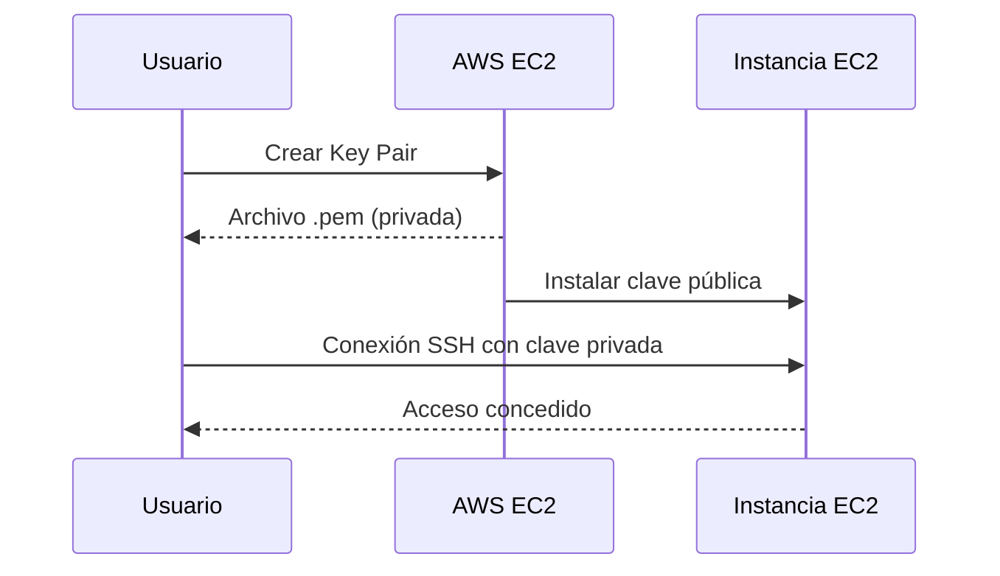
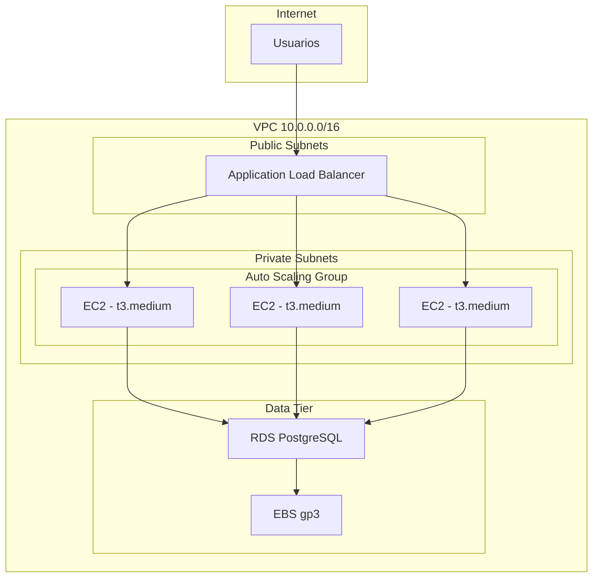
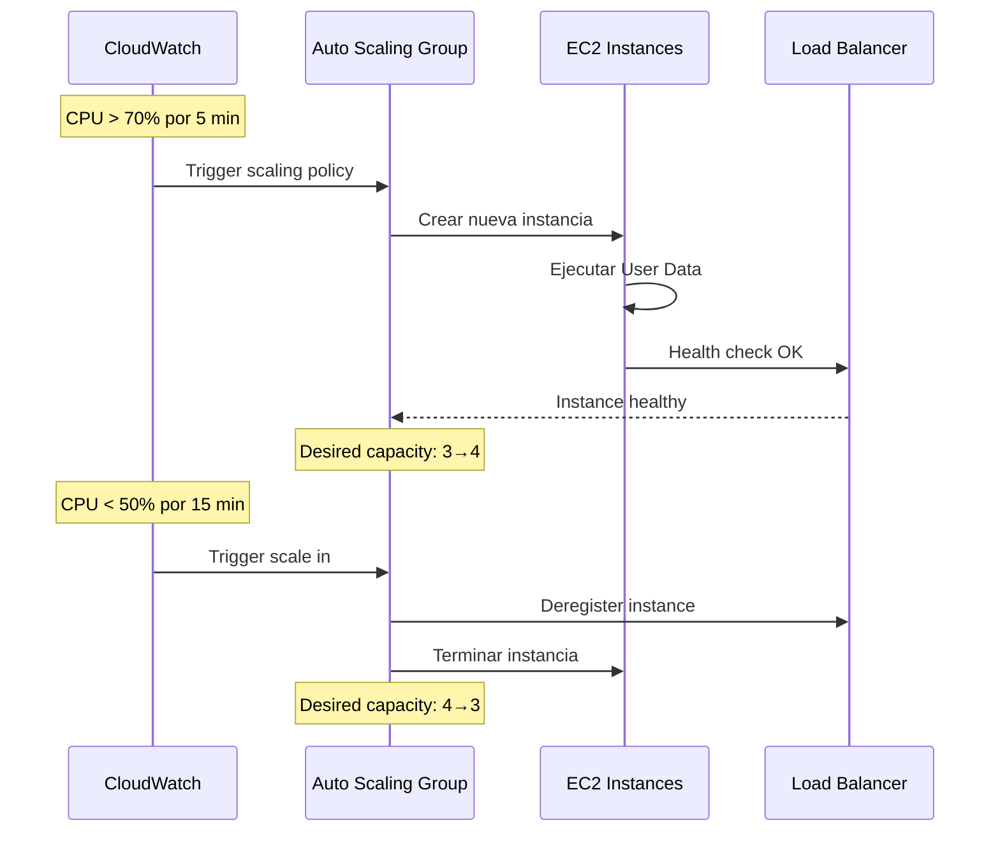
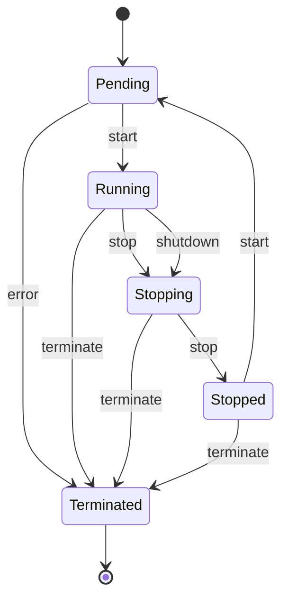

# Amazon EC2 - Elastic Compute Cloud

## Tabla de contenidos

- [¿Qué es Amazon EC2?](#qué-es-amazon-ec2)
- [Familias de instancias](#familias-de-instancias)
- [Tipos de instancias](#tipos-de-instancias)
- [Amazon Machine Images (AMIs)](#amazon-machine-images-amis)
- [Key Pairs](#key-pairs)
- [Security Groups para EC2](#security-groups-para-ec2)
- [Elastic IP Addresses](#elastic-ip-addresses)
- [User Data scripts](#user-data-scripts)
- [Instance Store vs EBS](#instance-store-vs-ebs)
- [Placement Groups](#placement-groups)
- [Elastic Network Interfaces (ENIs)](#elastic-network-interfaces-enis)
- [SSM Session Manager](#ssm-session-manager)
- [Launch Templates](#launch-templates)
- [Auto Scaling Groups](#auto-scaling-groups)
- [Monitoreo con CloudWatch](#monitoreo-con-cloudwatch)
- [Modelo de precios](#modelo-de-precios)
- [Estrategias de optimización de costos](#estrategias-de-optimización-de-costos)
- [Mejores prácticas](#mejores-prácticas)
- [Errores comunes](#errores-comunes)
- [Ejemplos de código](#ejemplos-de-código)
- [Diagramas Mermaid](#diagramas-mermaid)
- [Preguntas frecuentes (FAQ)](#preguntas-frecuentes-faq)
- [Consejos para entrevistas](#consejos-para-entrevistas)
- [Resumen](#resumen)

---

## ¿Qué es Amazon EC2?

Amazon Elastic Compute Cloud (EC2) es un servicio que proporciona capacidad de computación escalable en la nube de AWS. Piensa en EC2 como **alquilar un ordenador en la nube**: en lugar de comprar y mantener servidores físicos, puedes levantar una máquina virtual en segundos, configurarla a tu medida y pagar solo por el tiempo que la uses.

EC2 es uno de los servicios fundacionales de AWS y el bloque de construcción de prácticamente toda infraestructura en la nube. Desde servidores web simples hasta clústeres de aprendizaje automático de alta potencia, EC2 proporciona la flexibilidad necesaria para cualquier caso de uso.

### Características principales

| Característica | Descripción |
|----------------|-------------|
| **Escalabilidad** | Escala de una instancia a miles en minutos |
| **Flexibilidad** | Múltiples familias y tipos de instancias |
| **Control** | Acceso root completo a la instancia |
| **Integración** | Se integra con VPC, EBS, S3, IAM, CloudWatch |
| **Disponibilidad** | 99.99% de disponibilidad por región |
| **Seguridad** | Control de tráfico con Security Groups y NACLs |

### Ventajas clave

- **No hay compromiso de hardware inicial**: no necesitas comprar servidores.
- **Escalado elástico**: agrega o elimina instancias según la demanda.
- **Múltiples opciones de precios**: On-Demand, Reserved, Spot y Savings Plans.
- **Completamente programable**: controla tu infraestructura como código con CloudFormation, CDK o Terraform.
- **Acceso root**: tienes control total sobre el sistema operativo de la instancia.

---

## Familias de instancias

AWS organiza las instancias EC2 en familias diseñadas para casos de uso específicos. Cada familia está optimizada para un tipo particular de carga de trabajo.

| Familia | Uso principal | Ejemplos | Caso de uso típico |
|---------|---------------|----------|---------------------|
| **General Purpose (M, T)** | Equilibrio entre CPU, memoria y red | t3, m5, m6i, m7g | Servidores web, aplicaciones de desarrollo, entornos de prueba |
| **Compute Optimized (C)** | Procesamiento intensivo de CPU | c5, c6i, c7g, c7a | Renderizado, modelado científico, juegos, codificación de video |
| **Memory Optimized (R, X, z)** | Trabajos que requieren mucha memoria | r5, r6i, x1e, z1d | Bases de datos en memoria, análisis de big data, caché distribuida |
| **Storage Optimized (D, I, h)** | Acceso rápido a datos locales | d3, i3, i4i, h1 | Data warehousing, procesamiento de logs, Hadoop |
| **Accelerated Computing (P, G, Trn, Inf)** | GPUs y aceleradores de hardware | p4d, g5, trn1, inf2 | Machine learning, gráficos 3D, computación de alto rendimiento |

### Detalle de familias populares

| Familia | Generación | Procesador | Uso óptimo |
|---------|------------|------------|------------|
| **t3** | 3ª | Intel Xeon | Workloads con burst, bajo uso promedio |
| **t4g** | 4ª | AWS Graviton2 | Igual que t3 pero con mejor rendimiento/costo |
| **m5** | 5ª | Intel Xeon | General purpose con buen rendimiento sostenido |
| **m6i** | 6ª | Intel Ice Lake | General purpose, mejor precio que m5 |
| **m7g** | 7ª | AWS Graviton3 | General purpose, mejor eficiencia energética |
| **c5** | 5ª | Intel Xeon | CPU intensivo, buen precio por core |
| **c6i** | 6ª | Intel Ice Lake | CPU intensivo mejorado |
| **c7g** | 7ª | AWS Graviton3 | CPU intensivo, mejor relación costo/rendimiento |
| **r5** | 5ª | Intel Xeon | Bases de datos en memoria, big data |
| **r6i** | 6ª | Intel Ice Lake | Bases de datos mejoradas |
| **p4d** | 4ª | NVIDIA A100 | Deep learning, entrenamiento de modelos |
| **g5** | 5ª | NVIDIA A10G | Inferencia ML, renderizado gráfico |
| **inf2** | 2ª | AWS Inferentia2 | Inferencia de ML optimizada en costo |

---

## Tipos de instancias

Dentro de cada familia, AWS ofrece tipos de instancias con diferentes cantidades de vCPUs, memoria, almacenamiento y rendimiento de red.

| Tipo | vCPU | Memoria (GiB) | Almacenamiento | Rendimiento de red | Uso recomendado |
|------|------|---------------|----------------|--------------------|-----------------|
| **t3.micro** | 2 | 1 | EBS only | Hasta 5 Gbps | Micro-servicios, dev |
| **t3.medium** | 2 | 4 | EBS only | Hasta 5 Gbps | Aplicaciones pequeñas |
| **m5.large** | 2 | 8 | EBS only | Hasta 10 Gbps | Servidor web general |
| **m5.xlarge** | 4 | 16 | EBS only | Hasta 10 Gbps | App tier mediano |
| **c5.large** | 2 | 4 | EBS only | Hasta 10 Gbps | Procesamiento batch |
| **c5.4xlarge** | 16 | 32 | EBS only | Hasta 10 Gbps | Computación pesada |
| **r5.large** | 2 | 16 | EBS only | Hasta 10 Gbps | Base de datos en memoria |
| **r5.2xlarge** | 8 | 64 | EBS only | Hasta 10 Gbps | Cache distribuido |
| **i3.xlarge** | 4 | 30.5 | 1x 950 NVMe SSD | Hasta 10 Gbps | Base de datos transaccional |

### Instance naming convention

El nombre de una instancia sigue el patrón: `{familia}{generación}.{tamaño}`

Ejemplo: **m6i.xlarge** = familia M, generación 6 (Intel Ice Lake), tamaño xlarge (4 vCPU, 16 GiB).

Los tamaños van desde `nano` (1/8 de vCPU) hasta `metal` (instancia bare-metal dedicada).

---

## Amazon Machine Images (AMIs)

Una AMI es una plantilla que contiene la información necesaria para lanzar una instancia. Piensa en ella como el **disco de instalación** de tu servidor virtual.

### Tipos de AMIs

| Tipo | Descripción | Ejemplo |
|------|-------------|---------|
| **Amazon Linux 2** | AMI oficial de AWS, optimizada para EC2 | `amzn2-ami-hvm-*-x86_64-gp2` |
| **Amazon Linux 2023** | Versión más reciente de Amazon Linux | `al2023-ami-*-x86_64` |
| **Ubuntu** | Distribución popular para servidores | `ubuntu/images/hvm-ssd/ubuntu-jammy-*` |
| **Windows Server** | AMI oficial de Microsoft Windows | `Windows_Server-2022-*` |
| **AMI personalizada** | Creada desde una instancia snapshot | Custom AMI |

### Crear AMIs personalizadas

```bash
# Crear AMI desde una instancia en ejecución
aws ec2 create-image \
  --instance-id i-0abc123def456789 \
  --name "mi-app-v1.2" \
  --description "AMI con Node.js 20 y app configurada" \
  --no-reboot

# Listar AMIs propias
aws ec2 describe-images \
  --owners self \
  --query 'Images[*].[ImageId,Name,CreationDate]' \
  --output table
```

### Parámetros importantes de AMIs

- **Virtualization type**: `hvm` (Hardware Virtual Machine) es el estándar, `paravirtual` está deprecado.
- **Root device type**: `ebs` (recomendado, persistente) o `instance store` (temporal).
- **Architecture**: `x86_64` (Intel/AMD) o `arm64` (AWS Graviton).

---

## Key Pairs

Los Key Pairs son pares de claves criptográficas utilizadas para autenticarte al conectarte a una instancia EC2 mediante SSH.

### Flujo de autenticación



### Gestión de Key Pairs

```bash
# Crear un nuevo Key Pair
aws ec2 create-key-pair \
  --key-name mi-llave-ec2 \
  --query 'KeyMaterial' \
  --output text > mi-llave-ec2.pem

# Establecer permisos correctos (Linux/Mac)
chmod 400 mi-llave-ec2.pem

# Listar Key Pairs existentes
aws ec2 describe-key-pairs --query 'KeyPairs[*].[KeyName,KeyPairId]' --output table

# Eliminar un Key Pair
aws ec2 delete-key-pair --key-name mi-llave-ec2
```

### Mejores prácticas para Key Pairs

- **Nunca** compartas tu archivo `.pem` ni lo subas a repositorios.
- Usa un Key Pair diferente por ambiente (dev, staging, production).
- Utiliza **AWS Systems Manager Session Manager** para evitar necesitar Key Pairs.
- Usa **EC2 Instance Connect** para conexiones temporales sin gestionar claves.

---

## Security Groups para EC2

Un Security Group actúa como un **firewall virtual** que controla el tráfico entrante y saliente de tu instancia.

### Reglas de Security Groups

| Tipo de tráfico | Protocolo | Puerto | Origen/Destino | Ejemplo |
|------------------|-----------|--------|----------------|---------|
| SSH (entrante) | TCP | 22 | IP específica | Acceso administrativo |
| HTTP (entrante) | TCP | 80 | 0.0.0.0/0 | Tráfico web |
| HTTPS (entrante) | TCP | 443 | 0.0.0.0/0 | Tráfico web seguro |
| RDP (entrante) | TCP | 3389 | IP específica | Acceso Windows |
| MySQL (entrante) | TCP | 3306 | SG de app | Acceso a BD |
| Todo saliente | -1 | Todas | 0.0.0.0/0 | Salida a internet |

### Crear Security Groups

```bash
# Crear Security Group para servidor web
aws ec2 create-security-group \
  --group-name web-server-sg \
  --description "SG para servidor web" \
  --vpc-id vpc-0abc123def456789

# Permitir HTTP desde cualquier lugar
aws ec2 authorize-security-group-ingress \
  --group-id sg-0abc123def456789 \
  --protocol tcp \
  --port 80 \
  --cidr 0.0.0.0/0

# Permitir HTTPS desde cualquier lugar
aws ec2 authorize-security-group-ingress \
  --group-id sg-0abc123def456789 \
  --protocol tcp \
  --port 443 \
  --cidr 0.0.0.0/0

# Permitir SSH solo desde IP específica
aws ec2 authorize-security-group-ingress \
  --group-id sg-0abc123def456789 \
  --protocol tcp \
  --port 22 \
  --cidr 203.0.113.50/32

# Permitir tráfico desde otro Security Group (patrón de capas)
aws ec2 authorize-security-group-ingress \
  --group-id sg-db1234 \
  --protocol tcp \
  --port 3306 \
  --source-group sg-0abc123def456789
```

### Reglas importantes de Security Groups

- **Solo reglas de entrada (ingress)**: las reglas de salida (egress) permiten todo por defecto.
- **Stateful**: el tráfico de retorno se permite automáticamente.
- **Sin reglas de bloqueo explícitas**: solo se definen reglas de permitir.
- **Referencias dinámicas**: puedes referenciar otros Security Groups como origen/destino.
- **Evaluación completa**: todas las reglas se evalúan, no se detiene en la primera coincidencia.

---

## Elastic IP Addresses

Una Elastic IP es una dirección IP estática pública que puedes asociar a cualquier instancia EC2. Es útil cuando necesitas una dirección IP que no cambie al detener/arrancar instancias.

### Uso típico

```bash
# Asociar Elastic IP a una instancia
aws ec2 allocate-address --domain vpc
# Resultado: AllocationId: eipalloc-0abc123def456789
#            PublicIp: 203.0.113.100

aws ec2 associate-address \
  --instance-id i-0abc123def456789 \
  --allocation-id eipalloc-0abc123def456789

# Desasociar
aws ec2 disassociate-address --association-id eipassoc-0abc123

# Liberar Elastic IP
aws ec2 release-address --allocation-id eipalloc-0abc123def456789
```

### Consideraciones de precio

- **Gratis** cuando está asociada a una instancia en ejecución.
- **Cobrado** cuando está sin asociar o asociada a una instancia detenida.
- AWS cobra por Elastic IPs no utilizados como incentivo a liberar direcciones desperdiciadas.

---

## User Data scripts

User Data permite ejecutar un script al iniciar una instancia. Es la forma más simple de automatizar la configuración inicial.

### Script de ejemplo

```bash
#!/bin/bash
yum update -y
yum install -y httpd
systemctl start httpd
systemctl enable httpd

# Crear página web de ejemplo
cat << 'EOF' > /var/www/html/index.html
<!DOCTYPE html>
<html>
<head><title>Mi servidor EC2</title></head>
<body>
  <h1>¡Hola desde EC2 con User Data!</h1>
  <p>Instancia configurada automáticamente.</p>
</body>
</html>
EOF

# Instalar CloudWatch Agent
yum install -y amazon-cloudwatch-agent

# Configurar logging
echo "$(date) - Instancia iniciada y configurada" >> /var/log/user-data.log
```

### Limitaciones de User Data

- **Máximo 16 KB** para el script.
- Se ejecuta **una sola vez** al iniciar la instancia (a menos que se reinicie).
- Se ejecuta como **root**.
- Los errores no detienen la creación de la instancia.

### Patrón avanzado: usar un script de bootstrap externo

```bash
#!/bin/bash
yum update -y
# Descargar script de configuración desde S3
aws s3 cp s3://mi-bucket-config/scripts/bootstrap.sh /tmp/bootstrap.sh
chmod +x /tmp/bootstrap.sh
/tmp/bootstrap.sh 2>&1 | tee /var/log/bootstrap.log
```

---

## Instance Store vs EBS

| Característica | Instance Store | EBS |
|----------------|----------------|-----|
| **Persistencia** | Temporal (se pierde al detener) | Persistente |
| **Rendimiento** | Muy alto (NVMe local) | Alto (con provisioned IOPS) |
| **Tamaño** | Limitado por hardware | Hasta 64 TiB |
| **Uso ideal** | Caché, datos temporales, swap | Datos persistentes, OS |
| **Costo** | Incluido en precio de instancia | Cobro adicional por GiB |
| **Disponibilidad** | No disponible en todas las instancias | Disponible en la mayoría |
| **Snapshots** | No | Sí |

### Cuándo usar cada uno

- **Instance Store**: buffers de procesamiento, datos reprocesables, bases de datos con réplicas externas.
- **EBS**: datos de usuario, bases de datos primarias, almacenamiento de sistema operativo, datos que no deben perderse.

---

## Placement Groups

Un Placement Group controla cómo se colocan las instancias en la infraestructura física de AWS.

| Estrategia | Descripción | Uso ideal |
|------------|-------------|-----------|
| **Cluster** | Instancias cercas físicamente | HPC, juegos de baja latencia |
| **Spread** | Instancias en hardware diferente (máx 7 por AZ) | Aplicaciones críticas, base de datos |
| **Partition** | Instancias en racks separados | Hadoop, Kafka, cassandra |

### Ejemplo de Placement Group

```bash
# Crear Placement Group cluster
aws ec2 create-placement-group \
  --group-name mi-cluster-hpc \
  --strategy cluster \
  --region us-east-1

# Lanzar instancia en el Placement Group
aws ec2 run-instances \
  --image-id ami-0abc123 \
  --instance-type c5n.18xlarge \
  --placement "GroupName=mi-cluster-hpc,Affinity=host" \
  --key-name mi-llave \
  --security-group-ids sg-0abc123
```

---

## Elastic Network Interfaces (ENI)

Una ENI es una tarjeta de red virtual que puedes crear y adjuntar a una instancia EC2.

### Casos de uso

- **Multi-attach**: adjuntar una ENI a múltiples instancias (failover rápido).
- **IP estático**: mantener una IP privada al migrar entre instancias.
- **Seguridad**: aislar tráfico de gestión del tráfico de la aplicación.

```bash
# Crear ENI
aws ec2 create-network-interface \
  --subnet-id subnet-0abc123 \
  --description "ENI para base de datos" \
  --groups sg-db1234

# Adjuntar ENI a una instancia
aws ec2 attach-network-interface \
  --network-interface-id eni-0abc123def456789 \
  --instance-id i-0abc123def456789 \
  --device-index 1
```

---

## SSM Session Manager

AWS Systems Manager Session Manager te permite conectarte a instancias EC2 **sin abrir puertos SSH**, sin gestionar Key Pairs y sin necesitar un Bastion Host.

### Ventajas

- **Sin puertos abiertos**: se comunica a través de AWS Systems Manager.
- **Auditoría**: todas las sesiones se registran en CloudTrail.
- **Control de acceso**: se integra con IAM para autenticación y autorización.
- **Comando**: ejecuta comandos remotos de forma segura.

### Configuración

```bash
# Conectarse a una instancia con SSM
aws ssm start-session --target i-0abc123def456789

# Ejecutar un comando en múltiples instancias
aws ssm send-command \
  --instance-ids "i-0abc123" "i-0def456" \
  --document-name "AWS-RunShellScript" \
  --parameters 'commands=["df -h","free -m"]'
```

### Requisitos

- El **IAM Role** de la instancia debe tener la política `AmazonSSMManagedInstanceCore`.
- El agente SSM debe estar instalado (pre-instalado en Amazon Linux 2 y Ubuntu).
- La instancia debe tener salida a internet o acceso a los **VPC Endpoints** de SSM.

---

## Launch Templates

Un Launch Template es una plantilla de configuración que contiene los parámetros para crear instancias EC2. Es la evolución de Launch Configurations y es requerido para Auto Scaling Groups.

### Elementos de un Launch Template

- AMI ID
- Tipo de instancia
- Key Pair
- Security Groups
- Roles IAM
- User Data
- Almacenamiento (EBS volumes)
- Tags
- Configuración de red

```bash
# Crear Launch Template
aws ec2 create-launch-template \
  --launch-template-name mi-template-web \
  --version-description "Servidor web v1.2" \
  --launch-template-data '{
    "ImageId": "ami-0abc123def456789",
    "InstanceType": "t3.medium",
    "KeyName": "mi-llave",
    "SecurityGroupIds": ["sg-0abc123"],
    "IamInstanceProfile": {"Name": "ec2-web-role"},
    "UserData": "IyEvYmluL2Jhc2gKZWNobyAiSG9sYSI=",
    "BlockDeviceMappings": [{
      "DeviceName": "/dev/xvda",
      "Ebs": {
        "VolumeSize": 30,
        "VolumeType": "gp3",
        "Encrypted": true
      }
    }],
    "Monitoring": {"Enabled": true},
    "TagSpecifications": [{
      "ResourceType": "instance",
      "Tags": [{"Key": "Environment", "Value": "production"}]
    }]
  }'
```

---

## Auto Scaling Groups

Un Auto Scaling Group (ASG) mantiene un número de instancias EC2 ejecutándose automáticamente. Se ajusta según la demanda y reemplaza instancias no saludables.

### Configuración básica

```bash
# Crear Auto Scaling Group
aws autoscaling create-auto-scaling-group \
  --auto-scaling-group-name mi-asg-web \
  --launch-template LaunchTemplateName=mi-template-web,Version='$Latest' \
  --min-size 2 \
  --max-size 10 \
  --desired-capacity 3 \
  --vpc-zone-identifier "subnet-0abc,subnet-0def" \
  --target-group-arns arn:aws:elasticloadbalancing:us-east-1:123456789:targetgroup/mi-tg/abc123 \
  --health-check-type ELB \
  --health-check-grace-period 300

# Configurar política de escalado
aws autoscaling put-scaling-policy \
  --auto-scaling-group-name mi-asg-web \
  --policy-name scale-out-cpu \
  --policy-type TargetTrackingScaling \
  --target-tracking-configuration '{
    "PredefinedMetricSpecification": {
      "PredefinedMetricType": "ASGAverageCPUUtilization"
    },
    "TargetValue": 70.0
  }'
```

### Estrategias de scaling

| Estrategia | Descripción |
|------------|-------------|
| **Target Tracking** | Mantiene una métrica objetivo (ej: 70% CPU) |
| **Step Scaling** | Escala en pasos según umbrales de CloudWatch |
| **Simple Scaling** | Escala una cantidad fija tras un período de enfriamiento |
| **Scheduled Scaling** | Escala según cronograma (ej: horario laboral) |
| **Predictive Scaling** | Usa ML para predecir cargas futuras |

---

## Monitoreo con CloudWatch

### Métricas estándar de EC2

| Métrica | Descripción | Acción sugerida |
|---------|-------------|-----------------|
| `CPUUtilization` | Porcentaje de CPU utilizado | Alerta > 80% sostenido |
| `StatusCheckFailed` | Fallo de sistema o instancia | Reemplazar instancia |
| `NetworkIn/Out` | Tráfico de red | Verificar anomalias |
| `DiskReadOps/WriteOps` | Operaciones de disco | Verificar rendimiento EBS |
| `CPUCreditUsage` | Uso de créditos (t3) | Verificar tipo de instancia |

### Habilitar metricas detalladas

```bash
# Habilitar metricas detalladas (cobro adicional)
aws ec2 monitor-instances --instance-ids i-0abc123def456789

# Crear alarma de CPU
aws cloudwatch put-metric-alarm \
  --alarm-name "ec2-cpu-high" \
  --alarm-description "CPU > 80% por 5 minutos" \
  --metric-name CPUUtilization \
  --namespace AWS/EC2 \
  --statistic Average \
  --period 300 \
  --threshold 80 \
  --comparison-operator GreaterThanThreshold \
  --dimensions Name=InstanceId,Value=i-0abc123def456789 \
  --evaluation-periods 1 \
  --alarm-actions arn:aws:sns:us-east-1:123456789:notificaciones
```

---

## Modelo de precios

| Modelo de precio | Descripción | Descuento | Compromiso | Uso ideal |
|------------------|-------------|-----------|------------|-----------|
| **On-Demand** | Pago por segundo sin compromiso | 0% | Ninguno | Cargas de trabajo impredecibles, desarrollo |
| **Reserved (1 año)** | Compromiso de 1 año | 30-40% | 1 año | Workloads estables de 1+ años |
| **Reserved (3 años)** | Compromiso de 3 años | 50-60% | 3 años | Infraestructura base a largo plazo |
| **Savings Plans** | Compromiso de uso $/hora | 30-72% | 1 o 3 años | Uso comprometido con flexibilidad |
| **Spot** | Instancias sobrantes de AWS | 60-90% | Ninguno | Procesamiento batch, CI/CD, HPC |
| **Dedicated** | Hardware físico dedicado | 0% | 1 año | Regulaciones, licencias |

### Comparativa de precios (ejemplo: m5.large en us-east-1)

| Modelo | Precio/hora | Precio/mes | Ahorro vs On-Demand |
|--------|-------------|------------|---------------------|
| On-Demand | $0.096 | $69.12 | - |
| Reserved 1 año (No Upfront) | $0.061 | $43.92 | ~36% |
| Reserved 3 años (All Upfront) | $0.040 | $28.80 | ~43% |
| Spot (promedio) | $0.030 | $21.60 | ~56% |

### Instancia Spot

```bash
# Solicitar instancia Spot
aws ec2 run-instances \
  --image-id ami-0abc123 \
  --instance-type m5.large \
  --instance-market-options '{
    "MarketType": "spot",
    "SpotOptions": {
      "MaxPrice": "0.05",
      "SpotInstanceType": "persistent",
      "InstanceInterruptionBehavior": "stop"
    }
  }'

# Configurar Spot Fleet
aws ec2 request-spot-fleet \
  --spot-fleet-request-config '{
    "IamFleetRole": "arn:aws:iam::123456789:role/aws-ec2-spot-fleet",
    "TargetCapacity": 10,
    "AllocationStrategy": "capacityOptimized",
    "LaunchSpecifications": [{
      "ImageId": "ami-0abc123",
      "InstanceType": ["m5.large", "m5a.large", "m5d.large"],
      "SubnetId": "subnet-0abc123",
      "SecurityGroups": [{"GroupId": "sg-0abc123"}]
    }]
  }'
```

---

## Estrategias de optimización de costos

| Estrategia | Ahorro potencial | Complejidad |
|------------|------------------|-------------|
| Usar **Graviton (ARM)** en lugar de Intel | 20% | Baja |
| Usar **Spot Instances** para workloads flexibles | 60-90% | Media |
| **Right-sizing** con Compute Optimizer | 30% | Baja |
| **Scheduled Scaling** para horarios conocidos | 40-60% | Baja |
| **Reserved Instances** o Savings Plans | 30-72% | Baja |
| Usar **T3/T4g** con burst para cargas variables | 10-20% | Baja |
| **Terminate** instancias idle | 100% | Baja |

```bash
# Rekomendasi de Compute Optimizer
aws compute-optimizer get-ec2-instance-recommendations \
  --output table \
  --query 'instanceRecommendations[*].[instanceArn,currentInstanceType,recommendedInstanceType,finding]'

# Identificar instancias subutilizadas con Cost Explorer
aws ce get-cost-and-usage \
  --time-period Start=2024-01-01,End=2024-01-31 \
  --granularity MONTHLY \
  --metrics "UnblendedCost" \
  --group-by Type=DIMENSION,Key=SERVICE \
  --filter Dimensions={Key=SERVICE,Values=["Amazon Elastic Compute Cloud - Compute"]}
```

---

## Mejores prácticas

1. **Usa Security Groups minimalistas**: abre solo los puertos necesarios.
2. **Habilita CloudWatch Detailed Monitoring** para instancias críticas.
3. **Usa IMDSv2** para proteger contra ataques SSRF y metadatos.
4. **Añade tags** a todas las instancias para gestión de costos y organización.
5. **Usa SSM Session Manager** en lugar de SSH directo.
6. **Automatiza con Launch Templates + Auto Scaling Groups**.
7. **Right-size regularmente** con Compute Optimizer.
8. **Cambia a Graviton (ARM)** cuando sea compatible.
9. **Usa EBS gp3** en lugar de gp2 para mejor rendimiento y costo.
10. **Configura alarms** de CloudWatch para detectar anomalías.

---

## Errores comunes

| Error | Causa | Solución |
|-------|-------|----------|
| "Instance not found" | ID incorrecto o instancia terminada | Verificar con `describe-instances` |
| "InsufficientInstanceCapacity" | No hay capacidad en la AZ | Probar otra AZ o tipo de instancia |
| "VPCIdNotSpecified" | Falta especificar VPC al crear SG | Incluir `--vpc-id` |
| "InvalidKeyPair" | Key Pair no existe en la región | Verificar con `describe-key-pairs` |
| "SecurityGroupRuleLimitExceeded" | Demasiadas reglas en el SG | Consolidar reglas o crear SG adicional |
| "Instance terminates immediately" | Error en User Data o EBS | Revisar logs con `get-console-output` |
| "No instances passed the health check" | ASG health check fallando | Verificar aplicación y Security Groups |
| "EBS volume not in state available" | Volumen adjunto a otra instancia | Desasociar primero |

---

## Ejemplos de código

### Ejemplo básico: Lanzar instancia EC2 con AWS CLI

```bash
#!/bin/bash
# Script: lanzar-ec2-basico.sh
# Descripción: Lanza una instancia EC2 básica con Amazon Linux 2023

# Variables
AMI_ID="ami-0c02fb55956c7d316"  # Amazon Linux 2023 (us-east-1)
INSTANCE_TYPE="t3.micro"
KEY_NAME="mi-llave-ec2"
SECURITY_GROUP_ID="sg-0abc123def456789"

# Lanzar instancia
INSTANCE_ID=$(aws ec2 run-instances \
  --image-id "$AMI_ID" \
  --instance-type "$INSTANCE_TYPE" \
  --key-name "$KEY_NAME" \
  --security-group-ids "$SECURITY_GROUP_ID" \
  --tag-specifications 'ResourceType=instance,Tags=[{Key=Name,Value=MiServidorWeb},{Key=Environment,Value=dev}]' \
  --query 'Instances[0].InstanceId' \
  --output text)

echo "Instancia lanzada: $INSTANCE_ID"

# Esperar a que esté running
aws ec2 wait instance-running --instance-ids "$INSTANCE_ID"
echo "Instancia en estado Running"

# Obtener IP pública
PUBLIC_IP=$(aws ec2 describe-instances \
  --instance-ids "$INSTANCE_ID" \
  --query 'Reservations[0].Instances[0].PublicIpAddress' \
  --output text)

echo "IP pública: $PUBLIC_IP"
echo "Conecta con: ssh -i mi-llave-ec2.pem ec2-user@$PUBLIC_IP"
```

### Ejemplo intermedio: Servidor web con Auto Scaling

```bash
#!/bin/bash
# Script: configurar-asg-web.sh
# Descripción: Configura un ASG completo con ALB para una app web

# 1. Crear Launch Template con User Data
aws ec2 create-launch-template \
  --launch-template-name web-app-template \
  --version-description "v1.0 - App web Node.js" \
  --launch-template-data '{
    "ImageId": "ami-0c02fb55956c7d316",
    "InstanceType": "t3.medium",
    "KeyName": "mi-llave",
    "SecurityGroupIds": ["sg-web"],
    "IamInstanceProfile": {"Name": "ec2-web-profile"},
    "UserData": "'$(base64 -w0 <<'USERDATA'
#!/bin/bash
yum update -y
curl -fsSL https://rpm.nodesource.com/setup_20.x | bash -
yum install -y nodejs
mkdir -p /app
cd /app
cat > package.json << "PKGJSON"
{
  "name": "mi-app-web",
  "version": "1.0.0",
  "main": "server.js",
  "scripts": {
    "start": "node server.js"
  }
}
PKGJSON
cat > server.js << "SERVERJS"
const http = require("http");
const os = require("os");
const server = http.createServer((req, res) => {
  res.writeHead(200, {"Content-Type": "application/json"});
  res.end(JSON.stringify({
    message: "Hola desde EC2",
    hostname: os.hostname(),
    ip: os.networkInterfaces().eth0[0].address,
    uptime: process.uptime()
  }));
});
server.listen(3000, () => console.log("Servidor en puerto 3000"));
SERVERJS
npm install pm2 -g
pm2 start server.js
pm2 startup
pm2 save
systemctl enable amazon-cloudwatch-agent
USERDATA
)',
    "BlockDeviceMappings": [{
      "DeviceName": "/dev/xvda",
      "Ebs": {
        "VolumeSize": 30,
        "VolumeType": "gp3",
        "Iops": 3000,
        "Throughput": 125,
        "Encrypted": true
      }
    }],
    "Monitoring": {"Enabled": true}
  }'

# 2. Crear Target Group
TG_ARN=$(aws elbv2 create-target-group \
  --name web-app-tg \
  --protocol HTTP \
  --port 3000 \
  --vpc-id vpc-0abc123 \
  --target-type instance \
  --health-check-path /health \
  --health-check-interval-seconds 30 \
  --query 'TargetGroups[0].TargetGroupArn' \
  --output text)

# 3. Crear ALB
ALB_ARN=$(aws elbv2 create-load-balancer \
  --name web-app-alb \
  --subnets subnet-0abc subnet-0def \
  --security-groups sg-alb \
  --scheme internet-facing \
  --type application \
  --query 'LoadBalancers[0].LoadBalancerArn' \
  --output text)

# 4. Crear Listener
aws elbv2 create-listener \
  --load-balancer-arn "$ALB_ARN" \
  --protocol HTTPS \
  --port 443 \
  --certificates CertificateArn=arn:aws:acm:us-east-1:123:certificate/abc-123 \
  --default-actions Type=forward,TargetGroupArn="$TG_ARN"

# 5. Crear Auto Scaling Group
aws autoscaling create-auto-scaling-group \
  --auto-scaling-group-name web-app-asg \
  --launch-template LaunchTemplateName=web-app-template,Version='$Latest' \
  --min-size 2 \
  --max-size 8 \
  --desired-capacity 3 \
  --vpc-zone-identifier "subnet-0abc,subnet-0def" \
  --target-group-arns "$TG_ARN" \
  --health-check-type ELB \
  --health-check-grace-period 300 \
  --tags Key=Name,Value=web-app-instance,PropagateAtLaunch=true

# 6. Política de escalado
aws autoscaling put-scaling-policy \
  --auto-scaling-group-name web-app-asg \
  --policy-name scale-out-cpu \
  --policy-type TargetTrackingScaling \
  --target-tracking-configuration '{
    "PredefinedMetricSpecification": {
      "PredefinedMetricType": "ASGAverageCPUUtilization"
    },
    "TargetValue": 70.0,
    "ScaleInCooldown": 300,
    "ScaleOutCooldown": 60
  }'

echo "ASG configurado correctamente"
```

### Ejemplo profesional: Infraestructura completa con observabilidad

```bash
#!/bin/bash
# Script: infra-completa-ec2.sh
# Descripción: Infraestructura profesional de EC2 con monitoreo, seguridad y alta disponibilidad

set -euo pipefail

REGION="us-east-1"
ENVIRONMENT="production"
APP_NAME="api-gateway"

# ============================================
# 1. NETWORKING
# ============================================

# Crear VPC
VPC_ID=$(aws ec2 create-vpc \
  --cidr-block 10.0.0.0/16 \
  --tag-specifications 'ResourceType=vpc,Tags=[{Key=Name,Value='"$APP_NAME"'-vpc},{Key=Environment,Value='"$ENVIRONMENT"'}]' \
  --query 'Vpc.VpcId' --output text)

# Crear subnets en 3 AZs
for i in 1 2 3; do
  SUBNET_IDS[$i]=$(aws ec2 create-subnet \
    --vpc-id "$VPC_ID" \
    --cidr-block "10.0.${i}.0/24" \
    --availability-zone "${REGION}$(echo {a,b,c} | cut -d' ' -f$i)" \
    --tag-specifications 'ResourceType=subnet,Tags=[{Key=Name,Value='"$APP_NAME"'-subnet-'${i}'}]' \
    --query 'Subnet.SubnetId' --output text)
done

# Internet Gateway
IGW_ID=$(aws ec2 create-internet-gateway \
  --tag-specifications 'ResourceType=internet-gateway,Tags=[{Key=Name,Value='"$APP_NAME"'-igw}]' \
  --query 'InternetGateway.InternetGatewayId' --output text)

aws ec2 attach-internet-gateway --internet-gateway-id "$IGW_ID" --vpc-id "$VPC_ID"

# Route Table
RT_ID=$(aws ec2 create-route-table --vpc-id "$VPC_ID" \
  --tag-specifications 'ResourceType=route-table,Tags=[{Key=Name,Value='"$APP_NAME"'-rt}]' \
  --query 'RouteTable.RouteTableId' --output text)

aws ec2 create-route --route-table-id "$RT_ID" --destination-cidr-block 0.0.0.0/0 --gateway-id "$IGW_ID"

for SUBNET_ID in "${SUBNET_IDS[@]}"; do
  aws ec2 associate-route-table --route-table-id "$RT_ID" --subnet-id "$SUBNET_ID"
done

# ============================================
# 2. SECURITY GROUPS
# ============================================

# SG para ALB
ALB_SG=$(aws ec2 create-security-group \
  --group-name "$APP_NAME"-alb-sg \
  --description "SG para ALB" \
  --vpc-id "$VPC_ID" \
  --query 'GroupId' --output text)

aws ec2 authorize-security-group-ingress --group-id "$ALB_SG" --protocol tcp --port 80 --cidr 0.0.0.0/0
aws ec2 authorize-security-group-ingress --group-id "$ALB_SG" --protocol tcp --port 443 --cidr 0.0.0.0/0

# SG para EC2 instances
EC2_SG=$(aws ec2 create-security-group \
  --group-name "$APP_NAME"-ec2-sg \
  --description "SG para EC2 instances" \
  --vpc-id "$VPC_ID" \
  --query 'GroupId' --output text)

aws ec2 authorize-security-group-ingress --group-id "$EC2_SG" --protocol tcp --port 3000 --source-group "$ALB_SG"
aws ec2 authorize-security-group-ingress --group-id "$EC2_SG" --protocol tcp --port 22 --cidr 10.0.0.0/16

# SG para RDS (si aplica)
DB_SG=$(aws ec2 create-security-group \
  --group-name "$APP_NAME"-db-sg \
  --description "SG para RDS" \
  --vpc-id "$VPC_ID" \
  --query 'GroupId' --output text)

aws ec2 authorize-security-group-ingress --group-id "$DB_SG" --protocol tcp --port 5432 --source-group "$EC2_SG"

# ============================================
# 3. IAM ROLE PARA EC2
# ============================================

cat > /tmp/ec2-trust-policy.json << 'EOF'
{
  "Version": "2012-10-17",
  "Statement": [{
    "Effect": "Allow",
    "Principal": {"Service": "ec2.amazonaws.com"},
    "Action": "sts:AssumeRole"
  }]
}
EOF

cat > /tmp/ec2-permissions-policy.json << 'EOF'
{
  "Version": "2012-10-17",
  "Statement": [
    {
      "Effect": "Allow",
      "Action": [
        "ssm:GetParameter",
        "ssm:GetParameters",
        "secretsmanager:GetSecretValue",
        "cloudwatch:PutMetricData",
        "logs:CreateLogGroup",
        "logs:CreateLogStream",
        "logs:PutLogEvents"
      ],
      "Resource": "*"
    }
  ]
}
EOF

aws iam create-role \
  --role-name "$APP_NAME"-ec2-role \
  --assume-role-policy-document file:///tmp/ec2-trust-policy.json

aws iam put-role-policy \
  --role-name "$APP_NAME"-ec2-role \
  --policy-name ec2-permissions \
  --policy-document file:///tmp/ec2-permissions-policy.json

aws iam create-instance-profile --instance-profile-name "$APP_NAME"-ec2-profile
aws iam add-role-to-instance-profile \
  --instance-profile-name "$APP_NAME"-ec2-profile \
  --role-name "$APP_NAME"-ec2-role

# Esperar propagación
sleep 10

# ============================================
# 4. LAUNCH TEMPLATE
# ============================================

USER_DATA=$(cat << 'SCRIPT' | base64 -w0
#!/bin/bash
set -x
yum update -y
curl -fsSL https://rpm.nodesource.com/setup_20.x | bash -
yum install -y nodejs amazon-cloudwatch-agent
npm install -g pm2

# Crear aplicación
mkdir -p /app && cd /app
cat > server.js << 'EOFJS'
const http = require("http");
const hostname = require("os").hostname();
const server = http.createServer((req, res) => {
  if (req.url === "/health") {
    res.writeHead(200);
    return res.end("OK");
  }
  res.writeHead(200, {"Content-Type": "application/json"});
  res.end(JSON.stringify({ status: "healthy", host: hostname, version: "1.0.0" }));
});
server.listen(3000, () => console.log(`Servidor en puerto 3000 - ${hostname}`));
EOFJS

pm2 start server.js --name api-gateway
pm2 startup && pm2 save

# CloudWatch Agent
cat > /opt/aws/amazon-cloudwatch-agent/etc/config.json << 'EOFCW'
{
  "agent": {"run_as_user": "root"},
  "metrics": {
    "namespace": "Custom/APIGateway",
    "metrics_collected": {
      "mem": {"measurement": ["mem_used_percent"]},
      "disk": {"measurement": ["used_percent"], "resources": ["*"]}
    }
  }
}
EOFCW
/opt/aws/amazon-cloudwatch-agent/bin/amazon-cloudwatch-agent-ctl \
  -a fetch-config -m ec2 \
  -c file:/opt/aws/amazon-cloudwatch-agent/etc/config.json -s
SCRIPT
)

aws ec2 create-launch-template \
  --launch-template-name "$APP_NAME"-template \
  --version-description "Production v1.0" \
  --launch-template-data "{
    \"ImageId\": \"ami-0c02fb55956c7d316\",
    \"InstanceType\": \"t3.medium\",
    \"KeyName\": \"mi-llave-prod\",
    \"SecurityGroupIds\": [\"$EC2_SG\"],
    \"IamInstanceProfile\": {\"Name\": \"$APP_NAME-ec2-profile\"},
    \"UserData\": \"$USER_DATA\",
    \"BlockDeviceMappings\": [{
      \"DeviceName\": \"/dev/xvda\",
      \"Ebs\": {\"VolumeSize\": 30, \"VolumeType\": \"gp3\", \"Encrypted\": true}
    }],
    \"Monitoring\": {\"Enabled\": true},
    \"TagSpecifications\": [{
      \"ResourceType\": \"instance\",
      \"Tags\": [
        {\"Key\": \"Name\", \"Value\": \"$APP_NAME-instance\"},
        {\"Key\": \"Environment\", \"Value\": \"$ENVIRONMENT\"},
        {\"Key\": \"ManagedBy\", \"Value\": \"auto-scaling\"}
      ]
    }]
  }"

# ============================================
# 5. AUTO SCALING GROUP
# ============================================

# Target Group
TG_ARN=$(aws elbv2 create-target-group \
  --name "$APP_NAME"-tg \
  --protocol HTTP --port 3000 \
  --vpc-id "$VPC_ID" \
  --target-type instance \
  --health-check-path /health \
  --health-check-interval-seconds 15 \
  --healthy-threshold-count 2 \
  --unhealthy-threshold-count 3 \
  --query 'TargetGroups[0].TargetGroupArn' --output text)

# ALB
ALB_ARN=$(aws elbv2 create-load-balancer \
  --name "$APP_NAME"-alb \
  --subnets "${SUBNET_IDS[@]}" \
  --security-groups "$ALB_SG" \
  --scheme internet-facing \
  --type application \
  --query 'LoadBalancers[0].LoadBalancerArn' --output text)

# Listener HTTPS
aws elbv2 create-listener \
  --load-balancer-arn "$ALB_ARN" \
  --protocol HTTPS --port 443 \
  --certificates CertificateArn=arn:aws:acm:$REGION:123456789:certificate/abc-def \
  --default-actions Type=forward,TargetGroupArn="$TG_ARN"

# ASG
aws autoscaling create-auto-scaling-group \
  --auto-scaling-group-name "$APP_NAME"-asg \
  --launch-template LaunchTemplateName="$APP_NAME"-template,Version='$Latest' \
  --min-size 3 \
  --max-size 12 \
  --desired-capacity 3 \
  --vpc-zone-identifier "$(IFS=,; echo "${SUBNET_IDS[*]}")" \
  --target-group-arns "$TG_ARN" \
  --health-check-type ELB \
  --health-check-grace-period 300 \
  --termination-policies "OldestInstance" "Default" \
  --tags Key=Name,Value="$APP_NAME",PropagateAtLaunch=true Key=Environment,Value="$ENVIRONMENT",PropagateAtLaunch=true

# Policies
aws autoscaling put-scaling-policy \
  --auto-scaling-group-name "$APP_NAME"-asg \
  --policy-name cpu-target-tracking \
  --policy-type TargetTrackingScaling \
  --target-tracking-configuration '{
    "PredefinedMetricSpecification": {"PredefinedMetricType": "ASGAverageCPUUtilization"},
    "TargetValue": 65.0,
    "ScaleInCooldown": 300,
    "ScaleOutCooldown": 60
  }'

aws autoscaling put-scaling-policy \
  --auto-scaling-group-name "$APP_NAME"-asg \
  --policy-name requests-target-tracking \
  --policy-type TargetTrackingScaling \
  --target-tracking-configuration '{
    "PredefinedMetricSpecification": {
      "PredefinedMetricType": "ALBRequestCountPerTarget",
      "ResourceLabel": "'$(echo $ALB_ARN | cut -d: -f6)'/'$(echo $TG_ARN | cut -d: -f6)'"
    },
    "TargetValue": 1000.0
  }'

# ============================================
# 6. CLOUDWATCH ALARMS
# ============================================

aws cloudwatch put-metric-alarm \
  --alarm-name "$APP_NAME-cpu-high" \
  --alarm-description "CPU > 85% por 5 minutos" \
  --metric-name CPUUtilization --namespace AWS/EC2 \
  --statistic Average --period 300 --threshold 85 \
  --comparison-operator GreaterThanThreshold \
  --dimensions Name=AutoScalingGroupName,Value="$APP_NAME-asg" \
  --evaluation-periods 1 \
  --alarm-actions arn:aws:sns:$REGION:123456789:alerts-critical

aws cloudwatch put-metric-alarm \
  --alarm-name "$APP_NAME-unhealthy-hosts" \
  --alarm-description "Hosts unhealthy en Target Group" \
  --metric-name UnHealthyHostCount --namespace AWS/ApplicationELB \
  --statistic Average --period 60 --threshold 1 \
  --comparison-operator GreaterThanOrEqualToThreshold \
  --dimensions Name=LoadBalancer,Value="$ALB_ARN" Name=TargetGroup,Value="$TG_ARN" \
  --evaluation-periods 2 \
  --alarm-actions arn:aws:sns:$REGION:123456789:alerts-critical

echo "============================================"
echo "Infraestructura desplegada:"
echo "VPC: $VPC_ID"
echo "ALB: $ALB_ARN"
echo "ASG: $APP_NAME-asg"
echo "============================================"
```

---

## Diagramas Mermaid

### Arquitectura típica de EC2 con ALB



### Flujo de escalado automático



### Estados de una instancia EC2



---

## Preguntas frecuentes (FAQ)

**¿Cuál es la diferencia entre terminar y detener una instancia?**
Detener (stop) mantiene el almacenamiento EBS y la IP pública (si es Elastic IP). Terminar destruye todo. Al detener se deja de pagar por la instancia pero se sigue pagando por EBS.

**¿Puedo cambiar el tipo de instancia de una en ejecución?**
No directamente. Debes detener la instancia, cambiar el tipo y volver a iniciarla. Si usa Instance Store, los datos se perderán.

**¿Qué es IMDSv2 y por qué es importante?**
IMDSv2 es la versión 2 del servicio de metadatos. Utiliza tokens temporales para prevenir ataques SSRF que puedan rolar credenciales de la instancia.

**¿Cuándo elegir Graviton (ARM) vs Intel/AMD (x86)?**
Cuando la aplicación sea compatible con ARM y busques mejor costo/rendimiento. La mayoría de los lenguajes modernos y Docker images soportan ARM nativamente.

**¿Cómo protejo mis instancias de terminating accidental?**
Usa la opción "Termination Protection" y políticas de IAM restrictivas que impidan `ec2:TerminateInstances`.

**¿Cuál es la diferencia entre Security Groups y NACLs?**
Security Groups son stateful y operan a nivel de instancia. NACLs son stateless y operan a nivel de subnet. Los Security Groups solo permiten reglas de ingreso, las NACLs permiten tanto ingreso como egreso.

**¿Puedo adjuntar múltiples EBS a una instancia?**
Sí, hasta 40 volúmenes EBS por instancia (dependiendo del tipo). Puedes adjuntar tantos como el tipo de instancia permita.

---

## Consejos para entrevistas

1. **Explica EC2 con analogías**: "EC2 es como alquilar un ordenador en la nube en lugar de comprar uno".
2. **Diferencia los modelos de precio**: conoce los casos de uso de On-Demand vs Reserved vs Spot.
3. **Conoce las familias de instancias**: saber cuándo usar General, Compute, Memory o Accelerated.
4. **Entiende Security Groups vs NACLs**: stateful vs stateless, instancia vs subnet.
5. **Conoce Auto Scaling Groups**: configuración, políticas de escalado y health checks.
6. **Explica Instance Store vs EBS**: persistencia, rendimiento y casos de uso.
7. **Menciona SSM Session Manager**: como alternativa segura a SSH.
8. **Conoce Launch Templates vs Launch Configurations**: Templates son más flexibles y son el estándar actual.
9. **Entiende Placement Groups**: cuándo usar cluster, spread o partition.
10. **Habla de costos**: menciona right-sizing, Compute Optimizer y Reserved Instances como herramientas de optimización.

---

## Resumen

Amazon EC2 es el servicio de computación fundamental de AWS que permite crear máquinas virtuales bajo demanda. Las familias de instancias están optimizadas para diferentes casos de uso: General Purpose para equilibrio, Compute Optimized para CPU, Memory Optimized para RAM, y Accelerated Computing para GPUs.

Los conceptos clave incluyen AMIs (plantillas de instancias), Key Pairs (autenticación SSH), Security Groups (firewalls virtuales), EBS (almacenamiento persistente) y Auto Scaling Groups (escalado automático). Para seguridad, IMDSv2 y SSM Session Manager son prácticas recomendadas.

En precios, los modelos van desde On-Demand (flexible) hasta Spot (hasta 90% de descuento) pasando por Reserved Instances y Savings Plans. La optimización de costos se logra mediante right-sizing, Graviton, Spot Instances y Scheduled Scaling.

EC2 es un servicio versátil que, bien configurado con Auto Scaling, ALB y CloudWatch, proporciona una infraestructura robusta, escalable y segura para prácticamente cualquier aplicación en la nube.
