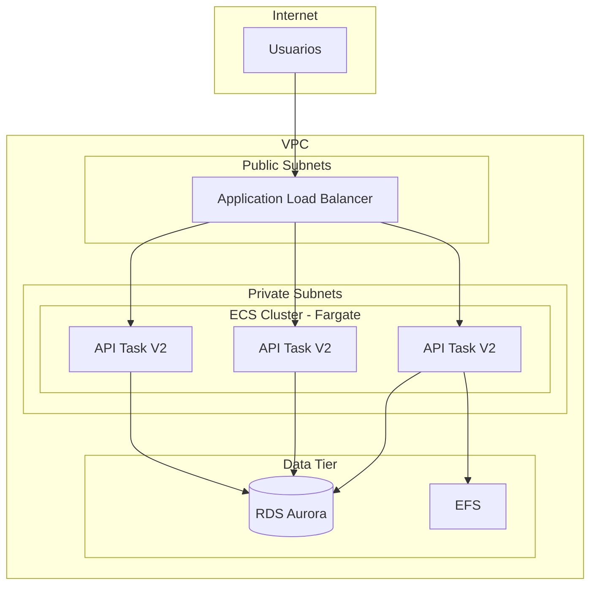
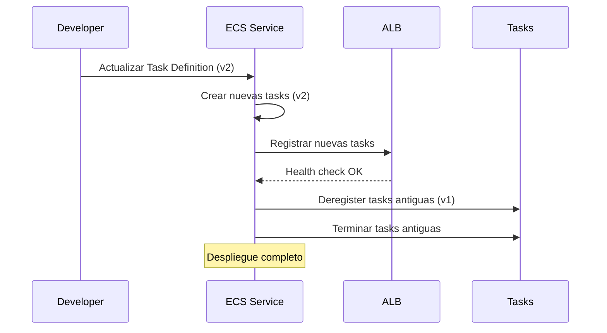
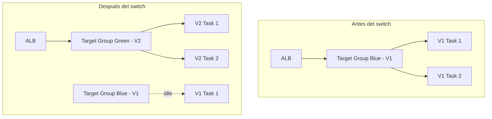
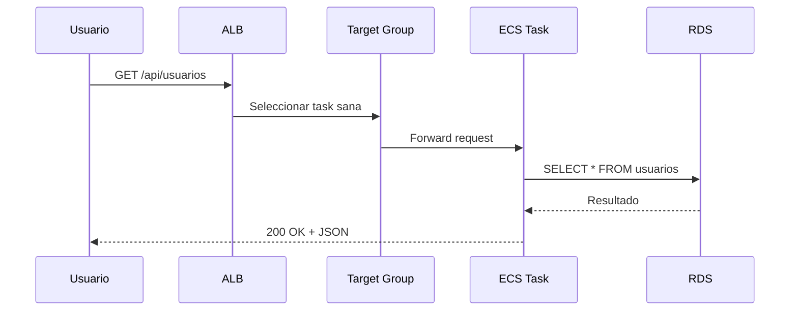

# Amazon ECS - Elastic Container Service

## Tabla de contenidos

- [¿Qué es Amazon ECS?](#qué-es-amazon-ecs)
- [ECS vs Docker Compose vs Kubernetes](#ecs-vs-docker-compose-vs-kubernetes)
- [EC2 Launch Type vs Fargate Launch Type](#ec2-launch-type-vs-fargate-launch-type)
- [Task Definitions](#task-definitions)
- [Services](#services)
- [Clusters](#clusters)
- [Task IAM Roles vs Execution IAM Roles](#task-iam-roles-vs-execution-iam-roles)
- [Service Discovery con Cloud Map](#service-discovery-con-cloud-map)
- [Estrategias de despliegue](#estrategias-de-despliegue)
- [Integración con ALB](#integración-con-alb)
- [Modelo de precios](#modelo-de-precios)
- [Mejores prácticas](#mejores-prácticas)
- [Errores comunes](#errores-comunes)
- [Ejemplos de código](#ejemplos-de-código)
- [Diagramas Mermaid](#diagramas-mermaid)
- [Preguntas frecuentes (FAQ)](#preguntas-frecuentes-faq)
- [Consejos para entrevistas](#consejos-para-entrevistas)
- [Resumen](#resumen)

---

## ¿Qué es Amazon ECS?

Amazon Elastic Container Service (ECS) es un servicio de orquestación de contenedores completamente gestionado que ejecuta y escala contenedores Docker en la nube de AWS. Piensa en ECS como **un gerente para tus contenedores**: le dices cuántos contenedores quieres ejecutar, cómo deben configurarse y qué hacer si fallan, y ECS se encarga de todo lo demás.

ECS es la solución de AWS para ejecutar aplicaciones empaquetadas en Docker sin necesidad de instalar y operar tu propio software de orquestación. Es una alternativa directa a Kubernetes, pero con la ventaja de estar profundamente integrada con el ecosistema de AWS.

### Características principales

| Característica | Descripción |
|----------------|-------------|
| **Gestionado** | AWS administra el plano de control |
| **Flexibilidad** | EC2 Launch Type o Fargate (serverless) |
| **Integración nativa** | IAM, ALB, CloudWatch, Service Connect |
| **Escalado automático** | Auto Scaling basado en métricas |
| **Despliegues seguros** | Rolling, Blue/Green, Canary |
| **Multi-AZ** | Alta disponibilidad automática |
| **Service Connect** | Comunicación entre servicios con service mesh |

---

## ECS vs Docker Compose vs Kubernetes

| Característica | ECS | Docker Compose | Kubernetes (EKS) |
|----------------|-----|----------------|-------------------|
| **Gestión** | AWS gestionado | Local/simple | Auto-gestionado o EKS |
| **Escalabilidad** | Miles de contenedores | Pocos contenedores | Miles de contenedores |
| **Curva de aprendizaje** | Media | Baja | Alta |
| **Ecosistema** | AWS nativo | Docker Hub | Open source extenso |
| **Multi-cloud** | No (solo AWS) | Sí | Sí |
| **Service mesh** | Service Connect | No | Istio, Linkerd |
| **Auto-scaling** | Nativo | No | HPA, VPA, KEDA |
| **CI/CD** | CodePipeline, GitHub Actions | Manual | Flux, ArgoCD |
| **Costo de administración** | Bajo | Muy bajo | Alto (requiere expertise) |
| **Caso de uso ideal** | Apps en AWS | Desarrollo local | Apps multi-cloud complejas |

### Cuándo elegir cada uno

- **ECS**: Aplicaciones en AWS que necesitan escalabilidad y gestión mínima. El equilibrio perfecto entre control y simplificación.
- **Docker Compose**: Desarrollo local, prototipos rápidos, entornos de testing pequeños.
- **Kubernetes (EKS)**: Aplicaciones multi-cloud, ecosistema extenso necesario, equipo con experiencia en K8s, requerimientos avanzados de red o políticas.

---

## EC2 Launch Type vs Fargate Launch Type

| Característica | EC2 Launch Type | Fargate Launch Type |
|----------------|-----------------|---------------------|
| **Gestión de infraestructura** | Tú administras EC2 | AWS la administra |
| **Tipo de servidor** | Instancias EC2 dedicadas | Serverless (sin EC2) |
| **Planificación de pods** | Tú decides dónde ejecutar | AWS decide automáticamente |
| **Ahorro de costo** | Mejor para workloads estables | Mejor para workloads variables |
| **Memoria/CPU** | Limitada por tipo de instancia | Configurable por task (128 MB - 30 GB) |
| **Persistent Storage** | EBS, EFS nativo | EFS (no EBS directamente) |
| **GPU** | Sí (instancias P/G) | Sí (desde 2023, limitado) |
| **SSH a la instancia** | Sí | No (usar ECS Exec) |
| **Modelo de precios** | Pago por instancia EC2 | Pago por vCPU/hora + memoria/hora |
| **Cold start** | No | Posible (~30s) |
| **Ideal para** | Workloads predecibles, alta CPU | Apps pequeñas, batch, desarrollo |

### Comparativa de precios (ejemplo: 2 vCPU, 4 GB)

| Componente | EC2 (t3.large) | Fargate |
|------------|----------------|---------|
| Compute | $0.0832/hora | $0.04048/hora (2 vCPU) |
| Memoria | Incluida | $0.004445/GB-hora (4 GB = $0.01778) |
| Total/hora | $0.0832 | $0.05826 |
| **Total/mes** | **~$60** | **~$42** |
| **Cuando la instancia está idle** | **$60** (se sigue pagando) | **$0** (Fargate se detiene) |

> **Nota**: EC2 es más barato si la instancia está siempre al 100%. Fargate es más barato si hay variabilidad en el uso.

---

## Task Definitions

Una Task Definition es una plantilla que describe cómo ejecutar un contenedor. Es como la **receta de cocina** de tu aplicación: define qué imagen Docker usar, cuánta memoria/CPU asignar, qué puertos abrir y qué variables de entorno configurar.

### Task Definition completa

```json
{
  "family": "api-backend",
  "networkMode": "awsvpc",
  "executionRoleArn": "arn:aws:iam::123456789:role/ecsTaskExecutionRole",
  "taskRoleArn": "arn:aws:iam::123456789:role/ecsTaskRole",
  "cpu": "512",
  "memory": "1024",
  "containerDefinitions": [
    {
      "name": "api",
      "image": "123456789.dkr.ecr.us-east-1.amazonaws.com/api-backend:v1.2.0",
      "essential": true,
      "portMappings": [
        {
          "containerPort": 3000,
          "hostPort": 3000,
          "protocol": "tcp"
        }
      ],
      "environment": [
        { "name": "NODE_ENV", "value": "production" },
        { "name": "PORT", "value": "3000" }
      ],
      "secrets": [
        {
          "name": "DATABASE_URL",
          "valueFrom": "arn:aws:ssm:us-east-1:123456789:parameter/prod/db-url"
        }
      ],
      "logConfiguration": {
        "logDriver": "awslogs",
        "options": {
          "awslogs-group": "/ecs/api-backend",
          "awslogs-region": "us-east-1",
          "awslogs-stream-prefix": "api",
          "awslogs-create-group": "true"
        }
      },
      "healthCheck": {
        "command": ["CMD-SHELL", "curl -f http://localhost:3000/health || exit 1"],
        "interval": 30,
        "timeout": 5,
        "retries": 3,
        "startPeriod": 60
      }
    }
  ],
  "volumes": [
    {
      "name": "app-cache",
      "efsVolumeConfiguration": {
        "fileSystemId": "fs-0abc123def456789",
        "rootDirectory": "/cache",
        "transitEncryption": "ENABLED"
      }
    }
  ]
}
```

### Registrar Task Definition

```bash
aws ecs register-task-definition --cli-input-json file://task-definition.json

aws ecs describe-task-definition \
  --task-definition api-backend \
  --query 'taskDefinition.{family:family,revision:revision,status:status}'
```

### Elementos clave de Task Definitions

| Campo | Descripción | Opciones |
|-------|-------------|----------|
| `networkMode` | Modo de red | `awsvpc` (recomendado), `bridge`, `host`, `none` |
| `cpu` | CPU asignada | 256 (.25 vCPU), 512 (.5), 1024 (1), 2048 (2), 4096 (4) |
| `memory` | Memoria asignada | 512 MB - 30 GB (varía según CPU) |
| `essential` | Si falla, termina la task | `true` / `false` |
| `logDriver` | Driver de logs | `awslogs` (recomendado), `json-file`, `fluentd` |
| `healthCheck` | Verificación de salud | Comando, intervalo, timeout, reintentos |

---

## Services

Un Service mantiene un número deseado de tareas ejecutándose y las reemplaza si fallan. Es el componente que garantiza la **disponibilidad continua** de tu aplicación.

### Configuración de Service

```bash
aws ecs create-service \
  --cluster mi-cluster \
  --service-name api-service \
  --task-definition api-backend:1 \
  --desired-count 3 \
  --launch-type FARGATE \
  --network-configuration '{
    "awsvpcConfiguration": {
      "subnets": ["subnet-abc", "subnet-def"],
      "securityGroups": ["sg-ecs"],
      "assignPublicIp": "DISABLED"
    }
  }' \
  --load-balancers '[
    {
      "targetGroupArn": "arn:aws:elasticloadbalancing:us-east-1:123:targetgroup/api-tg/abc",
      "containerName": "api",
      "containerPort": 3000
    }
  ]' \
  --deployment-configuration '{
    "maximumPercent": 200,
    "minimumHealthyPercent": 100,
    "deploymentCircuitBreaker": {
      "enable": true,
      "rollback": true
    }
  }' \
  --health-check-grace-period-seconds 60
```

### Configuración de Service

| Parámetro | Descripción | Valor típico |
|-----------|-------------|--------------|
| `desiredCount` | Número de tareas deseado | 2-10 (según tráfico) |
| `maximumPercent` | Máximo de tareas durante despliegue | 200% (duplica durante deploy) |
| `minimumHealthyPercent` | Mínimo de tareas durante despliegue | 100% (no reduce durante deploy) |
| `deploymentCircuitBreaker` | Revierte si el despliegue falla | Habilitado con rollback |
| `healthCheckGracePeriod` | Tiempo antes de verificar salud | 60-300 segundos |

### Auto Scaling para Services

```bash
aws application-autoscaling register-scalable-target \
  --service-namespace ecs \
  --scalable-dimension ecs:service:DesiredCount \
  --resource-id service/mi-cluster/api-service \
  --min-capacity 2 \
  --max-capacity 10

aws application-autoscaling put-scaling-policy \
  --service-namespace ecs \
  --scalable-dimension ecs:service:DesiredCount \
  --resource-id service/mi-cluster/api-service \
  --policy-name cpu-target-tracking \
  --policy-type TargetTrackingScaling \
  --target-tracking-scaling-policy-configuration '{
    "TargetValue": 70.0,
    "PredefinedMetricSpecification": {
      "PredefinedMetricType": "ECSServiceAverageCPUUtilization"
    },
    "ScaleInCooldown": 300,
    "ScaleOutCooldown": 60
  }'
```

---

## Clusters

Un ECS Cluster es un agrupamiento lógico de services y tasks. Es el **contenedor principal** donde ejecutas todo.

### Tipos de cluster

| Tipo | Descripción |
|------|-------------|
| **EC2 Cluster** | Usa instancias EC2 que tú administras |
| **Fargate Cluster** | Serverless, sin EC2 que gestionar |
| **Mixed** | Combina EC2 y Fargate en el mismo cluster |

```bash
aws ecs create-cluster \
  --cluster-name mi-cluster \
  --capacity-providers FARGATE FARGATE_SPOT \
  --default-capacity-provider-strategy '[
    {"capacityProvider": "FARGATE", "weight": 1, "base": 2},
    {"capacityProvider": "FARGATE_SPOT", "weight": 3}
  ]' \
  --settings name=containerInsights,value=enabled
```

### Container Insights

```bash
aws ecs update-cluster-settings \
  --cluster mi-cluster \
  --settings name=containerInsights,value=enabled

aws cloudwatch get-metric-statistics \
  --namespace ECS/ContainerInsights \
  --metric-name CpuUtilized \
  --dimensions Name=ClusterName,Value=mi-cluster \
  --start-time 2024-01-01T00:00:00Z \
  --end-time 2024-01-01T23:59:59Z \
  --period 300 \
  --statistics Average
```

---

## Task IAM Roles vs Execution IAM Roles

| Aspecto | Task IAM Role | Execution IAM Role |
|---------|---------------|---------------------|
| **Propósito** | Permisos de la aplicación | Permisos del agente ECS |
| **Uso típico** | Acceder a S3, DynamoDB | Pull de imágenes ECR, escribir logs |
| **Se asigna a** | La tarea (task definition) | El agente ECS en la instancia |
| **Ejemplo** | Leer de S3, escribir en DynamoDB | Descargar imagen de ECR, enviar logs |

### Configurar Execution Role

```json
{
  "Version": "2012-10-17",
  "Statement": [{
    "Effect": "Allow",
    "Action": [
      "ecr:GetAuthorizationToken",
      "ecr:BatchCheckLayerAvailability",
      "ecr:GetDownloadUrlForLayer",
      "ecr:BatchGetImage",
      "logs:CreateLogStream",
      "logs:PutLogEvents",
      "ssm:GetParameters",
      "secretsmanager:GetSecretValue"
    ],
    "Resource": "*"
  }]
}
```

### Configurar Task Role

```json
{
  "Version": "2012-10-17",
  "Statement": [{
    "Effect": "Allow",
    "Action": [
      "s3:GetObject",
      "s3:PutObject",
      "dynamodb:PutItem",
      "dynamodb:GetItem"
    ],
    "Resource": [
      "arn:aws:s3:::mi-bucket/*",
      "arn:aws:dynamodb:us-east-1:123456789:table/mi-tabla"
    ]
  }]
}
```

---

## Service Discovery con Cloud Map

Cloud Map permite que los servicios se descubran entre sí usando nombres de DNS en lugar de IPs.

### Service Connect (evolución de Cloud Map)

Service Connect soporta retries, timeouts y mTLS entre servicios.

```bash
aws ecs update-service \
  --cluster mi-cluster \
  --service api-service \
  --service-connect-configuration '{
    "enabled": true,
    "namespace": "arn:aws:servicediscovery:us-east-1:123456789:namespace/ns-abc",
    "services": [{
      "discoveryName": "api",
      "portName": "api-port",
      "clientAliases": [{"port": 3000, "dnsName": "api"}],
      "timeoutSettings": {
        "idleTimeoutSeconds": 60,
        "perRequestTimeoutSeconds": 30
      }
    }]
  }'
```

---

## Estrategias de despliegue

### Rolling Update

El strategy más común. Reemplaza tareas antiguas gradualmente.

```bash
aws ecs update-service \
  --cluster mi-cluster \
  --service api-service \
  --deployment-configuration '{
    "maximumPercent": 200,
    "minimumHealthyPercent": 100,
    "deploymentCircuitBreaker": {"enable": true, "rollback": true}
  }'
```

### Blue/Green con CodeDeploy

```bash
aws ecs create-service \
  --cluster mi-cluster \
  --service-name api-blue-green \
  --task-definition api-backend:2 \
  --desired-count 3 \
  --launch-type FARGATE \
  --deployment-controller '{"type": "CODE_DEPLOY"}' \
  --load-balancers '[{
    "targetGroupArn": "arn:aws:elasticloadbalancing:us-east-1:123:targetgroup/api-tg-blue/abc",
    "containerName": "api",
    "containerPort": 3000
  }]'
```

### Canary

Canary envía un pequeño porcentaje del tráfico a la nueva versión antes de hacer el cambio completo. Se configura con AWS App Mesh o ALB weighted target groups.

---

## Integración con ALB

```bash
# Crear Target Group (target-type: ip para ECS awsvpc)
TG_ARN=$(aws elbv2 create-target-group \
  --name api-ecs-tg \
  --protocol HTTP --port 3000 \
  --vpc-id vpc-0abc123 \
  --target-type ip \
  --health-check-path /health \
  --query 'TargetGroups[0].TargetGroupArn' --output text)

# Crear ALB
ALB_ARN=$(aws elbv2 create-load-balancer \
  --name api-ecs-alb \
  --subnets subnet-abc subnet-def \
  --security-groups sg-alb \
  --scheme internet-facing --type application \
  --query 'LoadBalancers[0].LoadBalancerArn' --output text)

# Crear Listener
aws elbv2 create-listener \
  --load-balancer-arn "$ALB_ARN" \
  --protocol HTTPS --port 443 \
  --certificates CertificateArn=arn:aws:acm:us-east-1:123:certificate/abc \
  --default-actions Type=forward,TargetGroupArn="$TG_ARN"
```

> **Importante**: ECS con `awsvpc` networking usa `target-type: ip`, no `instance`. Cada task tiene su propia IP en la VPC.

---

## Modelo de precios

### Fargate Pricing (us-east-1)

| Recurso | Precio |
|---------|--------|
| **vCPU** | $0.04048/hora |
| **Memoria** | $0.004445/GB-hora |
| **Almacenamiento EFS** | $0.30/GB-mes |
| **Data Transfer** | $0.09/GB (salida) |

### Ejemplo de costo mensual (Fargate)

```
3 tareas con 0.5 vCPU y 1 GB cada una, 24/7:
vCPU: 3 x 0.5 x $0.04048 x 730h = $44.12
Memoria: 3 x 1 x $0.004445 x 730h = $9.73
Total: ~$53.85/mes

Con FARGATE_SPOT (70% descuento): ~$16.16/mes
```

---

## Mejores prácticas

1. **Usa Fargate** para la mayoría de workloads (menos operaciones).
2. **Habilita deployment circuit breaker** para despliegues seguros.
3. **Usa ECR** para almacenar imágenes Docker (integración nativa).
4. **Configura health checks** tanto en Task Definition como en ALB.
5. **Usa `awsvpc` networking** (el estándar moderno para ECS).
6. **Implementa Service Connect** para comunicación entre servicios.
7. **Habilita Container Insights** para métricas detalladas.
8. **Usa SSM Parameter Store o Secrets Manager** para secretos.
9. **Configura Auto Scaling** en todos los Services de producción.
10. **Implementa logging centralizado** con CloudWatch Logs Insights.

---

## Errores comunes

| Error | Causa | Solución |
|-------|-------|----------|
| **FAILED state** | Task Definition mal configurado | Revisar permisos IAM y logs |
| **Tasks repeatedly stopped** | Imagen no accesible | Verificar ECR, IAM Execution Role |
| **Service steady state timeout** | Recursos insuficientes | Aumentar cuota o capacidad |
| **CannotPullContainerError** | IAM Execution Role sin permisos ECR | Agregar políticas ECR a Execution Role |
| **Health check failing** | App no responde en startPeriod | Aumentar startPeriod o HealthCheck Grace Period |
| **ENOMEM** | Memoria insuficiente para la task | Aumentar memoria en Task Definition |

---

## Ejemplos de código

### Ejemplo básico: Desplegar app Node.js con Fargate

```bash
# 1. Crear ECR Repository
aws ecr create-repository --repository-name mi-app

# 2. Login a ECR
aws ecr get-login-password --region us-east-1 | \
  docker login --username AWS --password-stdin 123456789.dkr.ecr.us-east-1.amazonaws.com

# 3. Build y push
docker build -t mi-app .
docker tag mi-app:latest 123456789.dkr.ecr.us-east-1.amazonaws.com/mi-app:latest
docker push 123456789.dkr.ecr.us-east-1.amazonaws.com/mi-app:latest

# 4. Crear ECS Cluster
aws ecs create-cluster --cluster-name mi-cluster

# 5. Registrar Task Definition
cat > task-def.json << 'EOF'
{
  "family": "mi-app",
  "networkMode": "awsvpc",
  "requiresCompatibilities": ["FARGATE"],
  "cpu": "256",
  "memory": "512",
  "executionRoleArn": "arn:aws:iam::123456789:role/ecsTaskExecutionRole",
  "containerDefinitions": [{
    "name": "app",
    "image": "123456789.dkr.ecr.us-east-1.amazonaws.com/mi-app:latest",
    "portMappings": [{"containerPort": 3000, "protocol": "tcp"}],
    "logConfiguration": {
      "logDriver": "awslogs",
      "options": {
        "awslogs-group": "/ecs/mi-app",
        "awslogs-region": "us-east-1",
        "awslogs-stream-prefix": "app"
      }
    }
  }]
}
EOF
aws ecs register-task-definition --cli-input-json file://task-def.json

# 6. Crear Service
aws ecs create-service \
  --cluster mi-cluster \
  --service-name mi-app-service \
  --task-definition mi-app \
  --desired-count 2 \
  --launch-type FARGATE \
  --network-configuration '{
    "awsvpcConfiguration": {
      "subnets": ["subnet-abc"],
      "securityGroups": ["sg-ecs"],
      "assignPublicIp": "ENABLED"
    }
  }'
```

### Ejemplo intermedio: Microservicios con ALB

```bash
#!/bin/bash
set -euo pipefail

CLUSTER="microservices-cluster"
REGION="us-east-1"

# Crear cluster
aws ecs create-cluster \
  --cluster-name "$CLUSTER" \
  --capacity-providers FARGATE FARGATE_SPOT \
  --default-capacity-provider-strategy \
    '[{"capacityProvider":"FARGATE","weight":1,"base":2},{"capacityProvider":"FARGATE_SPOT","weight":3}]'

# ALB
ALB_SG=$(aws ec2 create-security-group --group-name alb-sg --description "ALB SG" --vpc-id vpc-0abc --query 'GroupId' --output text)
aws ec2 authorize-security-group-ingress --group-id "$ALB_SG" --protocol tcp --port 80 --cidr 0.0.0.0/0

ALB_ARN=$(aws elbv2 create-load-balancer --name micro-alb --subnets subnet-abc subnet-def \
  --security-groups "$ALB_SG" --scheme internet-facing --type application \
  --query 'LoadBalancers[0].LoadBalancerArn' --output text)

# Servicios
declare -A SERVICES=(
  ["api-gateway"]="8080:8080"
  ["users-service"]="3001:3001"
  ["orders-service"]="3002:3002"
)

for SVC in "${!SERVICES[@]}"; do
  IFS=':' read -r CONTAINER_PORT HOST_PORT <<< "${SERVICES[$SVC]}"

  # Target Group
  TG=$(aws elbv2 create-target-group --name "$SVC-tg" --protocol HTTP --port "$CONTAINER_PORT" \
    --vpc-id vpc-0abc --target-type ip --health-check-path /health \
    --query 'TargetGroups[0].TargetGroupArn' --output text)

  # Listener (solo para api-gateway)
  if [ "$SVC" = "api-gateway" ]; then
    aws elbv2 create-listener --load-balancer-arn "$ALB_ARN" --protocol HTTP --port 80 \
      --default-actions Type=forward,TargetGroupArn="$TG"
  fi

  # Task Definition
  aws ecs register-task-definition --cli-input-json "{
    \"family\": \"$SVC\",
    \"networkMode\": \"awsvpc\",
    \"requiresCompatibilities\": [\"FARGATE\"],
    \"cpu\": \"256\",
    \"memory\": \"512\",
    \"executionRoleArn\": \"arn:aws:iam::123456789:role/ecsTaskExecutionRole\",
    \"containerDefinitions\": [{
      \"name\": \"$SVC\",
      \"image\": \"123456789.dkr.ecr.us-east-1.amazonaws.com/$SVC:latest\",
      \"portMappings\": [{\"containerPort\": $CONTAINER_PORT, \"protocol\": \"tcp\"}],
      \"environment\": [{\"name\": \"SERVICE_NAME\", \"value\": \"$SVC\"}],
      \"logConfiguration\": {
        \"logDriver\": \"awslogs\",
        \"options\": {\"awslogs-group\": \"/ecs/$SVC\", \"awslogs-region\": \"$REGION\", \"awslogs-stream-prefix\": \"svc\"}
      }
    }]
  }"

  # Service
  LB_CONFIG=""
  if [ "$SVC" = "api-gateway" ]; then
    TG_ARN=$(aws elbv2 describe-target-groups --names "$SVC-tg" --query 'TargetGroups[0].TargetGroupArn' --output text)
    LB_CONFIG="--load-balancers [{\"targetGroupArn\":\"$TG_ARN\",\"containerName\":\"$SVC\",\"containerPort\":$CONTAINER_PORT}]"
  fi

  aws ecs create-service \
    --cluster "$CLUSTER" \
    --service-name "$SVC" \
    --task-definition "$SVC" \
    --desired-count 2 \
    --launch-type FARGATE \
    --network-configuration '{"awsvpcConfiguration":{"subnets":["subnet-abc","subnet-def"],"securityGroups":["sg-ecs"],"assignPublicIp":"DISABLED"}}' \
    $LB_CONFIG

  echo "Servicio $SVC desplegado"
done
```

### Ejemplo profesional: Arquitectura completa de microservicios

```yaml
# ecs-stack.yaml (CloudFormation)
AWSTemplateFormatVersion: '2010-09-09'
Description: Arquitectura ECS completa con microservicios

Parameters:
  Environment:
    Type: String
    Default: production
  VpcId:
    Type: AWS::EC2::VPC::Id
  Subnets:
    Type: List<AWS::EC2::Subnet::Id>

Resources:
  # ECS Cluster
  ECSCluster:
    Type: AWS::ECS::Cluster
    Properties:
      ClusterName: !Sub 'microservices-${Environment}'
      ClusterSettings:
        - Name: containerInsights
          Value: enabled
      Configuration:
        ExecuteCommandConfiguration:
          Logging: DEFAULT

  # Log Groups
  ApiLogsGroup:
    Type: AWS::Logs::LogGroup
    Properties:
      LogGroupName: !Sub '/ecs/api-${Environment}'
      RetentionInDays: 30

  # ALB Security Group
  ALBSecurityGroup:
    Type: AWS::EC2::SecurityGroup
    Properties:
      GroupDescription: ALB Security Group
      VpcId: !Ref VpcId
      SecurityGroupIngress:
        - IpProtocol: tcp
          FromPort: 80
          ToPort: 80
          CidrIp: 0.0.0.0/0
        - IpProtocol: tcp
          FromPort: 443
          ToPort: 443
          CidrIp: 0.0.0.0/0

  # ECS Tasks Security Group
  ECSTasksSecurityGroup:
    Type: AWS::EC2::SecurityGroup
    Properties:
      GroupDescription: ECS Tasks Security Group
      VpcId: !Ref VpcId
      SecurityGroupIngress:
        - IpProtocol: tcp
          FromPort: 3000
          ToPort: 3000
          SourceSecurityGroupId: !Ref ALBSecurityGroup

  # Application Load Balancer
  ALB:
    Type: AWS::ElasticLoadBalancingV2::LoadBalancer
    Properties:
      Name: !Sub 'api-alb-${Environment}'
      Scheme: internet-facing
      Type: application
      SecurityGroups:
        - !Ref ALBSecurityGroup
      Subnets: !Ref Subnets

  # Target Group
  DefaultTargetGroup:
    Type: AWS::ElasticLoadBalancingV2::TargetGroup
    Properties:
      Name: !Sub 'api-tg-${Environment}'
      Port: 3000
      Protocol: HTTP
      VpcId: !Ref VpcId
      TargetType: ip
      HealthCheckPath: /health
      HealthCheckIntervalSeconds: 15
      HealthyThresholdCount: 2
      UnhealthyThresholdCount: 3

  # HTTPS Listener
  HTTPSListener:
    Type: AWS::ElasticLoadBalancingV2::Listener
    Properties:
      LoadBalancerArn: !Ref ALB
      Port: 443
      Protocol: HTTPS
      Certificates:
        - CertificateArn: !Ref CertificateArn
      DefaultActions:
        - Type: forward
          TargetGroupArn: !Ref DefaultTargetGroup

  # Task Definition - API
  APITaskDefinition:
    Type: AWS::ECS::TaskDefinition
    Properties:
      Family: !Sub 'api-${Environment}'
      NetworkMode: awsvpc
      RequiresCompatibilities:
        - FARGATE
      Cpu: '512'
      Memory: '1024'
      ExecutionRoleArn: !GetAtt ExecutionRole.Arn
      TaskRoleArn: !GetAtt TaskRole.Arn
      ContainerDefinitions:
        - Name: api
          Image: !Sub '${AWS::AccountId}.dkr.ecr.${AWS::Region}.amazonaws.com/api:latest'
          Essential: true
          PortMappings:
            - ContainerPort: 3000
              Protocol: tcp
          Environment:
            - Name: NODE_ENV
              Value: !Ref Environment
            - Name: PORT
              Value: '3000'
          Secrets:
            - Name: DATABASE_URL
              ValueFrom: !Sub 'arn:aws:ssm:${AWS::Region}:${AWS::AccountId}:parameter/${Environment}/db-url'
          LogConfiguration:
            LogDriver: awslogs
            Options:
              awslogs-group: !Ref ApiLogsGroup
              awslogs-region: !Ref AWS::Region
              awslogs-stream-prefix: api
          HealthCheck:
            Command:
              - CMD-SHELL
              - curl -f http://localhost:3000/health || exit 1
            Interval: 30
            Timeout: 5
            Retries: 3
            StartPeriod: 60

  # ECS Service
  APIService:
    Type: AWS::ECS::Service
    DependsOn: HTTPSListener
    Properties:
      Cluster: !Ref ECSCluster
      ServiceName: !Sub 'api-service-${Environment}'
      TaskDefinition: !Ref APITaskDefinition
      DesiredCount: 3
      LaunchType: FARGATE
      DeploymentConfiguration:
        MaximumPercent: 200
        MinimumHealthyPercent: 100
        DeploymentCircuitBreaker:
          Enable: true
          Rollback: true
      NetworkConfiguration:
        AwsvpcConfiguration:
          Subnets: !Ref Subnets
          SecurityGroups:
            - !Ref ECSTasksSecurityGroup
          AssignPublicIp: DISABLED
      LoadBalancers:
        - ContainerName: api
          ContainerPort: 3000
          TargetGroupArn: !Ref DefaultTargetGroup
      HealthCheckGracePeriodSeconds: 60

  # Auto Scaling
  ScalableTarget:
    Type: AWS::ApplicationAutoScaling::ScalableTarget
    Properties:
      MaxCapacity: 10
      MinCapacity: 3
      ResourceId: !Sub 'service/${ECSCluster}/${APIService.Name}'
      ScalableDimension: ecs:service:DesiredCount
      ServiceNamespace: ecs
      RoleARN: !Sub 'arn:aws:iam::${AWS::AccountId}:role/aws-service-role/ecs.application-autoscaling.amazonaws.com/AWSServiceRoleForApplicationAutoScaling_ECSService'

  ScalingPolicy:
    Type: AWS::ApplicationAutoScaling::ScalingPolicy
    Properties:
      PolicyName: cpu-scaling
      PolicyType: TargetTrackingScaling
      ScalingTargetId: !Ref ScalableTarget
      TargetTrackingScalingPolicyConfiguration:
        TargetValue: 70.0
        PredefinedMetricSpecification:
          PredefinedMetricType: ECSServiceAverageCPUUtilization
        ScaleInCooldown: 300
        ScaleOutCooldown: 60

  # IAM Roles
  ExecutionRole:
    Type: AWS::IAM::Role
    Properties:
      AssumeRolePolicyDocument:
        Version: '2012-10-17'
        Statement:
          - Effect: Allow
            Principal:
              Service: ecs-tasks.amazonaws.com
            Action: sts:AssumeRole
      ManagedPolicyArns:
        - arn:aws:iam::aws:policy/service-role/AmazonECSTaskExecutionRolePolicy

  TaskRole:
    Type: AWS::IAM::Role
    Properties:
      AssumeRolePolicyDocument:
        Version: '2012-10-17'
        Statement:
          - Effect: Allow
            Principal:
              Service: ecs-tasks.amazonaws.com
            Action: sts:AssumeRole
      Policies:
        - PolicyName: app-permissions
          PolicyDocument:
            Version: '2012-10-17'
            Statement:
              - Effect: Allow
                Action:
                  - ssm:GetParameter
                  - secretsmanager:GetSecretValue
                Resource: '*'

Outputs:
  ClusterName:
    Value: !Ref ECSCluster
  ServiceName:
    Value: !Ref APIService
  ALBEndpoint:
    Value: !GetAtt ALB.DNSName
```

---

## Diagramas Mermaid

### Arquitectura completa de ECS con Fargate



### Despliegue Rolling Update



### Blue/Green Deployment



### Fljo de request en ECS



---

## Preguntas frecuentes (FAQ)

**¿Cuándo usar ECS vs Lambda?**
ECS para contenedores que necesitan ejecución continua (>15 min), alto rendimiento de red, o stateful. Lambda para event-driven, ejecución corta, y workloads variables con escalado a cero.

**¿Qué es Fargate y cuándo usarlo?**
Fargate es el launch type serverless de ECS. No administras EC2. Es ideal para la mayoría de workloads modernos. Úsalo cuando quieras menos operaciones y tu aplicación es stateless.

**¿Puedo usar EBS con Fargate?**
No directamente. Fargate soporta EFS para almacenamiento persistente. Para EBS, usa el EC2 launch type.

**¿Cuál es la diferencia entre awsvpc y bridge networking?**
`awsvpc` asigna una ENI por task (recomendado, mejor rendimiento y seguridad). `bridge` usa puertos del host (más contenedores pero menos aislamiento). `awsvpc` es el estándar moderno.

**¿Cómo escalo automáticamente mis services?**
Usa Application Auto Scaling con Target Tracking basado en CPU, memoria o ALB Request Count. Configura min/max capacity y las políticas de escalado.

**¿Qué es ECS Exec?**
ECS Exec permite ejecutar comandos dentro de contenedores en ejecución, similar a SSH pero sin abrir puertos. Usa SSM Session Manager por debajo.

**¿Cómo gestiono secretos en ECS?**
Usa SSM Parameter Store o Secrets Manager, referenciándolos en la Task Definition con `secrets` en lugar de `environment`. La Execution Role debe tener permisos para leerlos.

---

## Consejos para entrevistas

1. **Explica ECS con la analogía del gerente**: "ECS es como un gerente que asegura que siempre haya N contenedores ejecutándose".
2. **Diferencia EC2 vs Fargate**: EC2 = tú administras, Fargate = serverless. Conoce cuándo usar cada uno.
3. **Conoce Task Definitions**: son las "recetas" que definen cómo ejecutar un contenedor.
4. **Entiende Execution Role vs Task Role**: Execution = para ECS (pull imágenes, logs). Task = para la app (acceder a servicios).
5. **Explica deployment strategies**: Rolling (gradual), Blue/Green (switch instantáneo), Canary (tráfico parcial).
6. **Conoce Service Connect**: la evolución de Service Discovery con retry, timeout y mTLS.
7. **Menciona `awsvpc` networking**: el estándar moderno, cada task tiene su propia IP.
8. **Habla de Auto Scaling**: Target Tracking con métricas de CPU, memoria o ALB requests.
9. **Entiende Fargate Spot**: ahorra 70% pero puede ser interrumpido. Ideal para batch jobs y dev.
10. **Conoce ECS Exec**: alternativa a SSH para debuggear contenedores en producción.

---

## Resumen

Amazon ECS es el servicio de orquestación de contenedores de AWS que ejecuta y escala aplicaciones Docker. Ofrece dos launch types: EC2 (tú administras las instancias) y Fargate (serverless, sin gestión de infraestructura). Para la mayoría de workloads modernos, Fargate es la opción recomendada.

Los conceptos clave incluyen Task Definitions (plantillas de configuración), Services (mantienen tareas ejecutándose), Clusters (agrupamientos lógicos), y las dos IAM Roles (Execution Role para ECS, Task Role para la aplicación). Service Connect es la evolución de Service Discovery con soporte para retries y timeouts.

Las estrategias de despliegue incluyen Rolling Update (el más común), Blue/Green (switch instantáneo con CodeDeploy), y Canary (tráfico parcial). Auto Scaling se configura con Application Auto Scaling basado en métricas de CPU, memoria o ALB.

ECS brilla en arquitecturas de microservicios en AWS, con integración nativa con ALB, IAM, CloudWatch y ECR. Para aplicaciones multi-cloud o que requieren el ecosistema extenso de Kubernetes, considera EKS.
