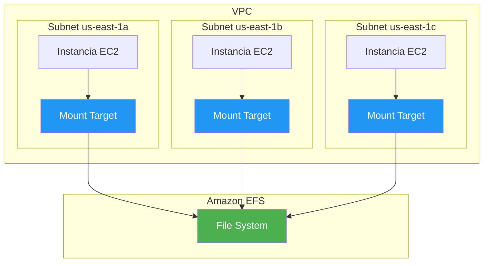
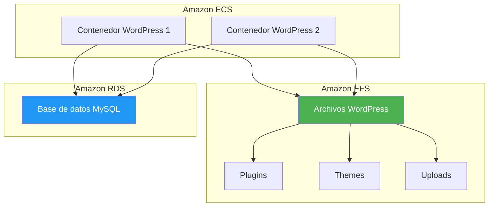
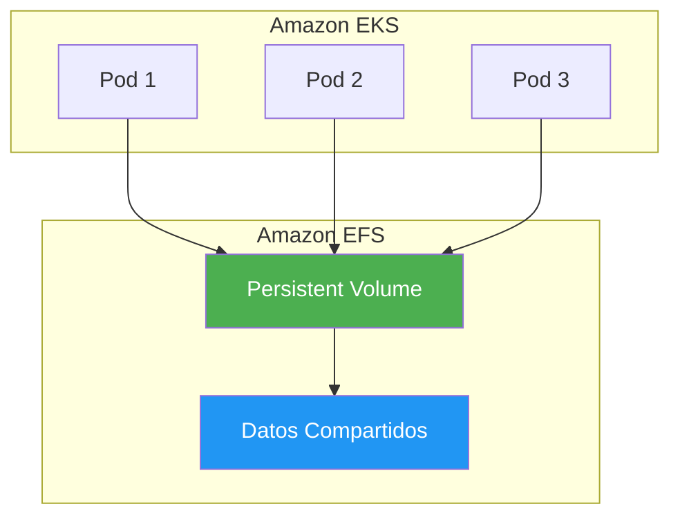
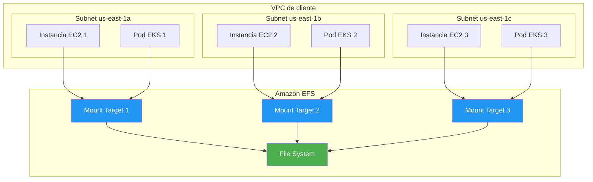
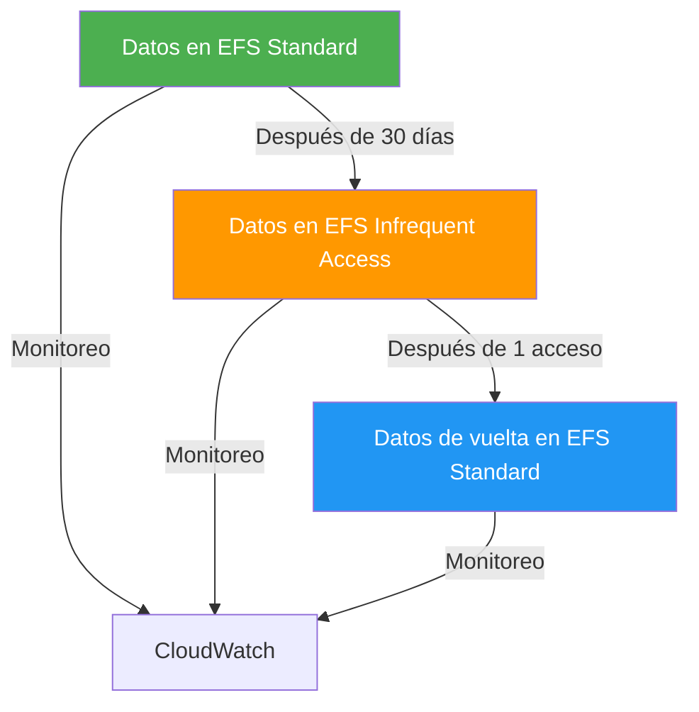
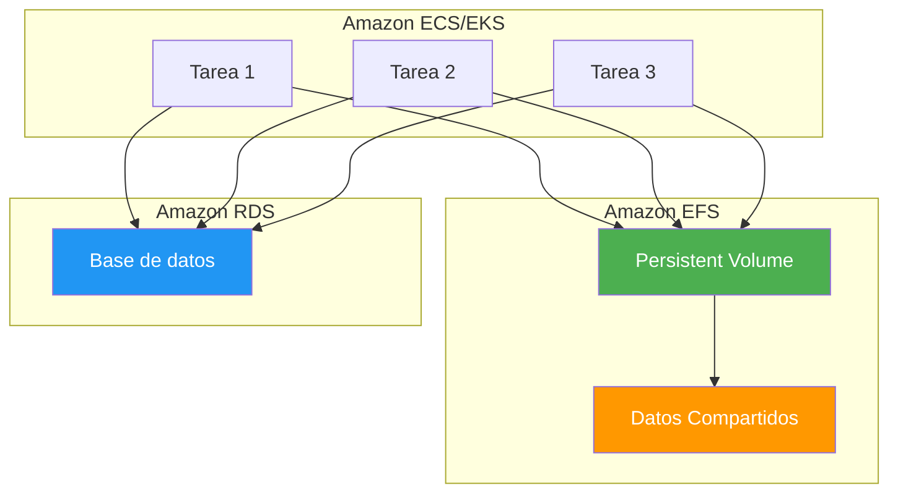

# Amazon EFS - Elastic File System

## Tabla de contenidos

- [¿Qué es Amazon EFS?](#qué-es-amazon-efs)
- [Conceptos fundamentales](#conceptos-fundamentales)
- [EFS Standard vs EFS Infrequent Access](#efs-standard-vs-efs-infrequent-access)
- [Modos de rendimiento](#modos-de-rendimiento)
- [Modos de throughput](#modos-de-throughput)
- [Cifrado](#cifrado)
- [Access Points](#access-points)
- [Mount Targets y VPC](#mount-targets-y-vpc)
- [Comparación EFS vs EBS vs S3](#comparación-efs-vs-ebs-vs-s3)
- [Casos de uso](#casos-de-uso)
- [Modelo de precios](#modelo-de-precios)
- [Mejores prácticas](#mejores-prácticas)
- [Errores comunes](#errores-comunes)
- [Ejemplos de código](#ejemplos-de-código)
- [Diagramas Mermaid](#diagramas-mermaid)
- [Preguntas frecuentes (FAQ)](#preguntas-frecuentes-faq)
- [Consejos para entrevistas](#consejos-para-entrevistas)
- [Resumen](#resumen)

---

## ¿Qué es Amazon EFS?

Amazon Elastic File System (EFS) es un sistema de archivos elástico, escalable y totalmente gestionado en la nube. Piensa en EFS como una **unidad USB compartida** a la que pueden acceder múltiples computadoras simultáneamente: todos los dispositivos ven los mismos archivos en tiempo real.

EFS está diseñado para proporcionar almacenamiento de archivos compartido que puede ser montado por múltiples instancias EC2, contenedores ECS/EKS y usuarios on-premises a través de VPN o AWS Direct Connect.

### Características principales

| Característica | Descripción |
|----------------|-------------|
| **Elástico** | Crece y se contrae automáticamente según la demanda |
| **Escalable** | Soporta hasta petabytes de datos |
| **Compartido** | Múltiples instancias pueden acceder simultáneamente |
| **Persistente** | Los datos sobreviven al apagado de las instancias |
| **Completamente gestionado** | No necesitas administrar infraestructura |
| **Compatible con POSIX** | Sistema de archivos estándar para Linux |

---

## Conceptos fundamentales

### File systems

Un **file system** de EFS es el contenedor principal que almacena tus datos. Es similar a un disco de red que puede ser montado por múltiples clientes.

```text
efs://mi-filesystem-unico
```

### Mount points

Los **mount points** son los puntos donde se monta el file system de EFS en una instancia EC2. Es como conectar un cable de red a tu servidor para acceder a archivos compartidos.

```bash
# Montar EFS en Linux
sudo mount -t efs -o tls fs-0123456789abcdef0:/ /mnt/efs

# Montaje automático en /etc/fstab
echo 'fs-0123456789abcdef0:/ /mnt/efs efs _netdev,tls 0 0' | sudo tee -a /etc/fstab
```

### Permisos POSIX

EFS respeta los permisos POSIX estándar de Linux, incluyendo:
- **Propietario** (owner)
- **Grupo** (group)
- **Permisos** (read, write, execute)

---

## EFS Standard vs EFS Infrequent Access

EFS ofrece dos clases de almacenamiento optimizadas para diferentes patrones de acceso.

### Comparación

| Característica | EFS Standard | EFS Infrequent Access |
|----------------|--------------|----------------------|
| **Disponibilidad** | 99.99% | 99.9% |
| **Durabilidad** | 99.999999999% | 99.999999999% |
| **Costo de almacenamiento** | $0.30/GB-mes | $0.016/GB-mes |
| **Costo de operaciones** | $0.005/100K operaciones | $0.01/100K operaciones |
| **Latencia** | Milisegundos | Milisegundos |
| **Uso ideal** | Datos accedidos frecuentemente | Datos accedidos menos frecuentemente |

###生命周期管理

Puedes usar **lifecycle policies** para mover automáticamente datos entre EFS Standard y EFS Infrequent Access:

```json
{
  "LifecyclePolicies": [
    {
      "TransitionToIA": "AFTER_30_DAYS",
      "TransitionToPrimaryStorageClass": "AFTER_1_ACCESS"
    }
  ]
}
```

---

## Modos de rendimiento

EFS ofrece dos modos de rendimiento para diferentes casos de uso.

### General Purpose

El modo predeterminado, ideal para la mayoría de los casos de uso.

| Característica | Valor |
|----------------|-------|
| **IOPS máximos** | 7,000 |
| **Throughput máx. por GB** | 100 MB/s |
| **Throughput máximo** | 3,000 MB/s |
| **Operaciones por segundo** | Hasta 35,000 |
| **Latencia** | Baja |

### Max I/O

Optimizado para aplicaciones que requieren alto rendimiento paralelo.

| Característica | Valor |
|----------------|-------|
| **IOPS máximos** | 500,000+ |
| **Throughput máx. por GB** | 100 MB/s |
| **Throughput máximo** | 3,000+ MB/s |
| **Operaciones por segundo** | Hasta 500,000+ |
| **Latencia** | Mayor que General Purpose |

### Cuándo usar cada modo

```text
General Purpose:
- Aplicaciones web
- CMS (WordPress, Drupal)
- Herramientas de desarrollo
- Contenedores Docker

Max I/O:
- Análisis de big data
- Procesamiento de medios
- Simulaciones científicas
- Aplicaciones de alto rendimiento paralelo
```

---

## Modos de throughput

EFS ofrece tres modos de throughput para controlar la velocidad de transferencia de datos.

### Bursting

El modo predeterminado, basado en el tamaño del file system.

```text
Throughput base = 50 MB/s + 100 MB/s por TB almacenado
Máximo = 3,000 MB/s
```

### Provisioned

Permite provisionar un throughput específico independiente del tamaño del file system.

```text
Throughput provisionado = Valor específico (ej: 1,000 MB/s)
```

### Elastic

El modo más reciente, que escala automáticamente el throughput según la demanda.

```text
Throughput = Se ajusta dinámicamente entre 1 y 3,000+ MB/s
Costo = Por GB transferido
```

### Comparación de modos de throughput

| Modo | Throughput | Costo | Uso ideal |
|------|-----------|-------|-----------|
| **Bursting** | 50 MB/s + 100 MB/s por TB | Por GB transferido | La mayoría de los casos |
| **Provisioned** | Valor específico | Por MB/s provisionado | Throughput constante |
| **Elastic** | 1-3,000+ MB/s | Por GB transferido | Throughput variable |

---

## Cifrado

EFS ofrece cifrado de datos en reposo y en tránsito.

### Cifrado en reposo (At Rest)

- Usa AWS Key Management Service (KMS) para cifrar datos
- Cifrado automático de todos los datos
- Compatible con claves KMS administradas por el cliente

```bash
# Crear file system cifrado
aws efs create-file-system \
  --performance-mode generalPurpose \
  --throughput-mode bursting \
  --encrypted \
  --kms-key-id arn:aws:kms:us-east-1:123456789012:key/12345678-1234-1234-1234-123456789012 \
  --tags Key=Name,Value=MiFileSystemCifrado
```

### Cifrado en tránsito (In Transit)

- Usa TLS (Transport Layer Security) para proteger datos en tránsito
- Requiere un certificado TLS o usa el certificado de AWS
- Se configura al montar el file system

```bash
# Montar con cifrado TLS
sudo mount -t efs -o tls fs-0123456789abcdef0:/ /mnt/efs
```

---

## Access Points

Los **Access Points** de EFS son puntos de acceso simplificados que facilitan el acceso a datos en EFS a través de reglas predefinidas. Es como crear **puertas de entrada diferentes** a tu sistema de archivos, cada una con sus propias reglas.

### Casos de uso

- **Acceso multi-equipos**: Diferentes equipos acceden a diferentes directorios
- **Contenedores**: Acceso simplificado desde ECS/EKS
- **Aislamiento de datos**: Separar datos de diferentes departamentos

### Crear un Access Point

```bash
# Crear Access Point
aws efs create-access-point \
  --file-system-id fs-0123456789abcdef0 \
  --posix-user Uid=1000,Gid=1000 \
  --root-directory '{
    "Path": "/datos/equipo-desarrollo",
    "CreationInfo": {
      "OwnerUid": 1000,
      "OwnerGid": 1000,
      "Permissions": "755"
    }
  }' \
  --tags Key=Name,Value=EquipoDesarrollo
```

### Montar usando Access Point

```bash
# Montar usando Access Point
sudo mount -t efs -o tls,accesspoint=fsap-0123456789abcdef0 fs-0123456789abcdef0:/ /mnt/efs
```

---

## Mount Targets y VPC

Los **mount targets** son los puntos de conexión entre tu file system de EFS y tu VPC. Cada mount target está asociado a una subred específica.

### Arquitectura



### Crear mount targets

```bash
# Crear mount target en subred
aws efs create-mount-target \
  --file-system-id fs-0123456789abcdef0 \
  --subnet-id subnet-0123456789abcdef0 \
  --security-groups sg-0123456789abcdef0

# Listar mount targets
aws efs describe-mount-targets --file-system-id fs-0123456789abcdef0
```

### Security Groups

Los security groups controlan el tráfico entre las instancias EC2 y los mount targets de EFS.

```bash
# Crear security group para EFS
aws ec2 create-security-group \
  --group-name efs-security-group \
  --description "Security group for EFS" \
  --vpc-id vpc-0123456789abcdef0

# Agregar regla de entrada para NFS
aws ec2 authorize-security-group-ingress \
  --group-id sg-0123456789abcdef0 \
  --protocol tcp \
  --port 2049 \
  --source-group sg-0123456789abcdef0
```

---

## Comparación EFS vs EBS vs S3

### Tabla comparativa

| Característica | EFS | EBS | S3 |
|----------------|-----|-----|-----|
| **Tipo de almacenamiento** | Sistema de archivos | Bloques | Objetos |
| **Acceso** | Compartido (múltiples instancias) | Individual (una instancia) | Web (API REST) |
| **Protocolo** | NFS v4.0/v4.1 | SCSI | HTTP/HTTPS |
| **Escalabilidad** | Automática (1 PB+) | Manual (hasta 16 TB) | Ilimitada |
| **Latencia** | Milisegundos | Microsegundos | Milisegundos |
| **Durabilidad** | 99.999999999% | 99.999% | 99.999999999% |
| **Disponibilidad** | 99.99% | 99.99% | 99.99% |
| **Costo** | $$$ | $$ | $ |
| **Caso de uso ideal** | Archivos compartidos | Bases de datos, boot | Archivos estáticos |

### Cuándo usar cada servicio

```text
EFS:
- Archivos compartidos entre múltiples instancias
- CMS como WordPress
- Contenedores Docker/Kubernetes
- Herramientas de desarrollo compartidas
- Home directories

EBS:
- Bases de datos transaccionales
- Sistemas de archivos de boot
- Aplicaciones que requieren bajo latencia
- Datos que necesitan persistir

S3:
- Almacenamiento de objetos
- Sitios web estáticos
- Backups a largo plazo
- Data lakes
- Archivos multimedia
```

---

## Casos de uso

### 1. CMS compartido (WordPress)



### 2. Almacenamiento para contenedores



### 3. Herramientas de desarrollo compartidas

```text
Equipo de Desarrollo → EFS → Repositorios de código
Equipo de QA → EFS → Scripts de testing
Equipo de DevOps → EFS → Configuraciones de CI/CD
```

---

## Modelo de precios

EFS cobra por:

1. **Almacenamiento**: Por GB-mes
2. **Transferencia de datos**: Por GB transferido
3. **Operaciones**: Por 100K operaciones (Standard y IA)
4. **Cifrado**: Sin costo adicional por cifrado

### Ejemplo de costos

```text
EFS Standard: 500 GB × $0.30/GB = $150.00/mes
EFS Infrequent Access: 200 GB × $0.016/GB = $3.20/mes
Transferencia: 100 GB × $0.09/GB = $9.00/mes
Total estimado: $162.20/mes
```

### Optimización de costos

1. **Usar lifecycle policies**: Mover datos a EFS IA después de 30 días
2. **Monitorear uso**: Eliminar archivos no utilizados
3. **Usar elastic throughput**: Para patrones de uso variables
4. **Compartir file systems**: Reducir el número de file systems

---

## Mejores prácticas

### Seguridad

1. **Usar VPC endpoints**: Para acceso privado sin internet
2. **Configurar security groups**: Restringir tráfico NFS
3. **Habilitar cifrado**: En reposo y en tránsito
4. **Usar Access Points**: Para control de acceso granular
5. **Implementar IAM policies**: Controlar acceso a EFS

### Rendimiento

1. **Elegir modo de rendimiento adecuado**: General Purpose para la mayoría
2. **Usar mount targets en cada AZ**: Para baja latencia
3. **Distribuir archivos**: Evitar hotspots de rendimiento
4. **Usar caché local**: Para datos de acceso frecuente
5. **Monitorear métricas**: Usar CloudWatch para identificar problemas

### Gestión

1. **Usar tags**: Para clasificar y gestionar costos
2. **Implementar lifecycle policies**: Para optimizar almacenamiento
3. **Programar backups**: Usar AWS Backup para protección de datos
4. **Documentar configuración**: Mount points, security groups, etc.
5. **Probar rendimiento**: Antes de producción

### Errores comunes

1. **No usar mount targets en cada AZ**: Latencia alta
2. **No configurar security groups**: Acceso bloqueado
3. **No usar lifecycle policies**: Costos innecesarios
4. **No monitorear rendimiento**: Problemas no detectados
5. **No usar Access Points**: Acceso complejo

---

## Errores comunes

### 1. No configurar mount targets en cada AZ

```text
❌ "Las instancias en otras AZs no pueden acceder al EFS"
✅ Crear mount targets en cada AZ donde tengas instancias
```

### 2. No usar lifecycle policies

```text
❌ "Estoy pagando por almacenamiento que no uso"
✅ Implementar lifecycle policies para mover datos a EFS IA
```

### 3. No usar cifrado

```text
❌ "Mis datos están sin cifrar y no cumplen normativas"
✅ Habilitar cifrado en reposo y en tránsito
```

### 4. No monitorear rendimiento

```text
❌ "Mi aplicación es lenta pero no sé por qué"
✅ Usar CloudWatch para monitorear métricas de EFS
```

### 5. No usar Access Points

```text
❌ "El acceso a EFS es complejo y difícil de gestionar"
✅ Usar Access Points para simplificar el acceso
```

---

## Ejemplos de código

### Ejemplo 1: AWS CLI - Crear y gestionar EFS

```bash
# Crear file system
aws efs create-file-system \
  --performance-mode generalPurpose \
  --throughput-mode elastic \
  --encrypted \
  --tags Key=Name,Value=MiFileSystem

# Listar file systems
aws efs describe-file-systems

# Crear mount target
aws efs create-mount-target \
  --file-system-id fs-0123456789abcdef0 \
  --subnet-id subnet-0123456789abcdef0 \
  --security-groups sg-0123456789abcdef0

# Crear Access Point
aws efs create-access-point \
  --file-system-id fs-0123456789abcdef0 \
  --posix-user Uid=1000,Gid=1000 \
  --root-directory '{
    "Path": "/datos",
    "CreationInfo": {
      "OwnerUid": 1000,
      "OwnerGid": 1000,
      "Permissions": "755"
    }
  }'

# Eliminar file system
aws efs delete-file-system --file-system-id fs-0123456789abcdef0
```

### Ejemplo 2: Montar EFS en Linux

```bash
# Instalar cliente EFS
sudo yum install -y amazon-efs-utils

# Crear punto de montaje
sudo mkdir -p /mnt/efs

# Montar file system
sudo mount -t efs -o tls fs-0123456789abcdef0:/ /mnt/efs

# Montaje automático en /etc/fstab
echo 'fs-0123456789abcdef0:/ /mnt/efs efs _netdev,tls 0 0' | sudo tee -a /etc/fstab

# Montar usando Access Point
sudo mount -t efs -o tls,accesspoint=fsap-0123456789abcdef0 fs-0123456789abcdef0:/ /mnt/efs

# Verificar montaje
df -h
mount | grep efs
```

### Ejemplo 3: Kubernetes Persistent Volume

```yaml
apiVersion: v1
kind: PersistentVolume
metadata:
  name: efs-pv
spec:
  capacity:
    storage: 100Gi
  volumeMode: Filesystem
  accessModes:
    - ReadWriteMany
  persistentVolumeReclaimPolicy: Retain
  storageClassName: efs-sc
  csi:
    driver: efs.csi.aws.com
    volumeHandle: fs-0123456789abcdef0
    volumeAttributes:
      path: /datos
---
apiVersion: v1
kind: PersistentVolumeClaim
metadata:
  name: efs-pvc
spec:
  accessModes:
    - ReadWriteMany
  storageClassName: efs-sc
  resources:
    requests:
      storage: 100Gi
---
apiVersion: apps/v1
kind: Deployment
metadata:
  name: mi-aplicacion
spec:
  replicas: 3
  selector:
    matchLabels:
      app: mi-aplicacion
  template:
    metadata:
      labels:
        app: mi-aplicacion
    spec:
      containers:
        - name: mi-aplicacion
          image: nginx
          volumeMounts:
            - name: efs-volume
              mountPath: /usr/share/nginx/html
      volumes:
        - name: efs-volume
          persistentVolumeClaim:
            claimName: efs-pvc
```

---

## Diagramas Mermaid

### Arquitectura general de EFS



### Flujo de lifecycle policy



### Arquitectura de contenedores con EFS



---

## Preguntas frecuentes (FAQ)

### ¿Cuál es la diferencia entre EFS y EBS?
EFS es un sistema de archivos compartido que puede ser accedido por múltiples instancias simultáneamente. EBS es un almacenamiento de bloques que solo puede ser accedido por una instancia a la vez (excepto io2 Multi-Attach).

### ¿Cuántos archivos puedo almacenar en EFS?
EFS puede almacenar hasta 1 PB de datos y soportar miles de conexiones concurrentes. El límite de archivos es de 25,000 por file system.

### ¿EFS es compatible con Windows?
No, EFS está diseñado para Linux y está basado en NFS (Network File System). Para Windows, considera Amazon FSx for Windows File Server.

### ¿Cuánto cuesta EFS?
Los costos varían según el almacenamiento utilizado, la transferencia de datos y las operaciones. Consulta la [página de precios de EFS](https://aws.amazon.com/efs/pricing/) para obtener información actualizada.

### ¿Puedo usar EFS con contenedores?
Sí, EFS es compatible con Amazon ECS, Amazon EKS y Docker. Es ideal para almacenamiento persistente en contenedores.

### ¿EFS es seguro?
Sí, EFS ofrece cifrado en reposo y en tránsito, integración con IAM, y compatibilidad con VPC endpoints para acceso privado.

### ¿Puedo migrar datos de EBS a EFS?
Sí, puedes copiar datos de EBS a EFS usando herramientas como `rsync` o `cp`. También puedes usar AWS DataSync para migraciones a gran escala.

### ¿EFS es adequado para bases de datos?
EFS no está optimizado para bases de datos transaccionales que requieren bajo latencia. Para bases de datos, considera Amazon RDS, Aurora o DynamoDB.

### ¿Puedo usar EFS con On-Premises?
Sí, EFS puede ser accesible desde instalaciones on-premises a través de VPN o AWS Direct Connect.

### ¿Qué es el modo throughput elastic?
El modo throughput elastic ajusta automáticamente el throughput según la demanda, permitiendo picos de rendimiento sin necesidad de provisionar capacidad fija.

---

## Consejos para entrevistas

### Preguntas técnicas comunes

1. **¿Cuál es la diferencia entre EFS, EBS y S3?**
   - EFS: Sistema de archivos compartido (NFS)
   - EBS: Almacenamiento de bloques (SCSI)
   - S3: Almacenamiento de objetos (HTTP)

2. **¿Cuándo usarías EFS en lugar de EBS?**
   - Cuando necesitas almacenamiento compartido entre múltiples instancias
   - Para contenedores que necesitan persistencia
   - Para CMS como WordPress

3. **¿Cómo protegerías los datos en EFS?**
   - Cifrado en reposo y en tránsito
   - Security groups para control de acceso
   - VPC endpoints para acceso privado
   - Lifecycle policies para optimización

4. **¿Qué es un mount target y por qué es importante?**
   - Un mount target es el punto de conexión entre EFS y tu VPC
   - Es importante para establecer la conectividad
   - Debes crear mount targets en cada AZ donde tengas instancias

5. **¿Cómo optimizarías el rendimiento de EFS?**
   - Elegir el modo de rendimiento adecuado
   - Distribuir archivos para evitar hotspots
   - Usar caché local para datos de acceso frecuente
   - Monitorear métricas de CloudWatch

### Buenas respuestas

- Menciona la **diferencia entre EFS, EBS y S3**
- Explica la importancia de **mount targets** en cada AZ
- Describe cómo el **cifrado** protege los datos
- Habla sobre **lifecycle policies** para optimizar costos
- Menciona **Access Points** para simplificar el acceso

---

## Resumen

Amazon EFS es un sistema de archivos elástico, escalable y completamente gestionado en la nube. Aquí están los puntos clave:

| Concepto | Descripción |
|----------|-------------|
| **File System** | Contenedor principal para datos |
| **Mount Targets** | Puntos de conexión con VPC |
| **Access Points** | Puntos de acceso simplificados |
| **Performance Modes** | General Purpose y Max I/O |
| **Throughput Modes** | Bursting, Provisioned y Elastic |
| **Cifrado** | En reposo y en tránsito |
| **Lifecycle Policies** | Movimiento automático entre Standard e IA |

### Checklist de implementación

- [ ] Crear file system de EFS
- [ ] Configurar mount targets en cada AZ
- [ ] Configurar security groups
- [ ] Habilitar cifrado
- [ ] Crear Access Points si es necesario
- [ ] Implementar lifecycle policies
- [ ] Monitorear métricas de CloudWatch
- [ ] Documentar configuración
- [ ] Realizar pruebas de rendimiento

---

*Última actualización: 2024*
