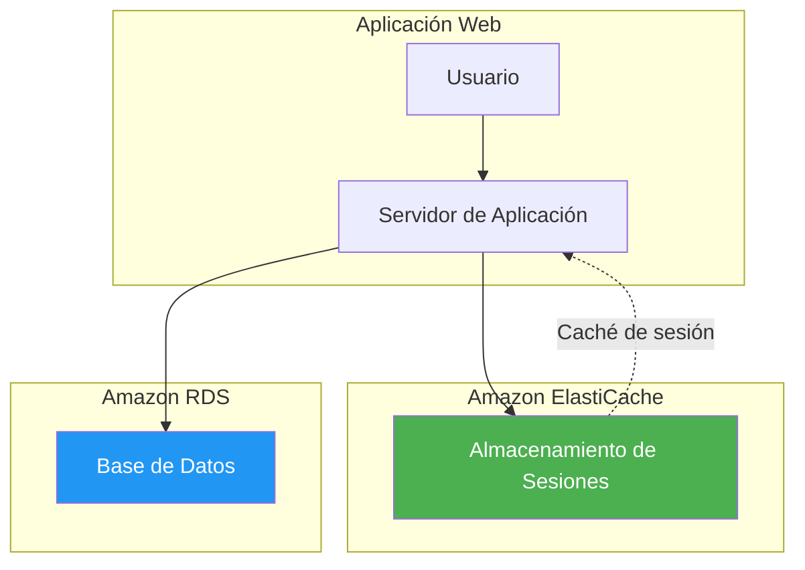
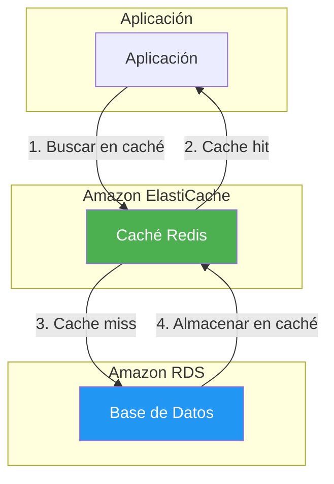
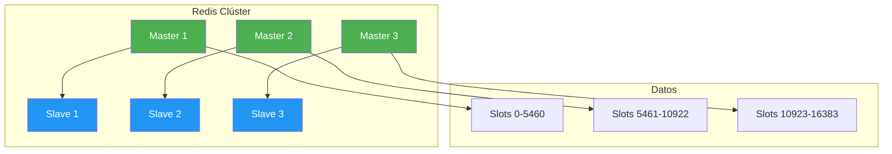
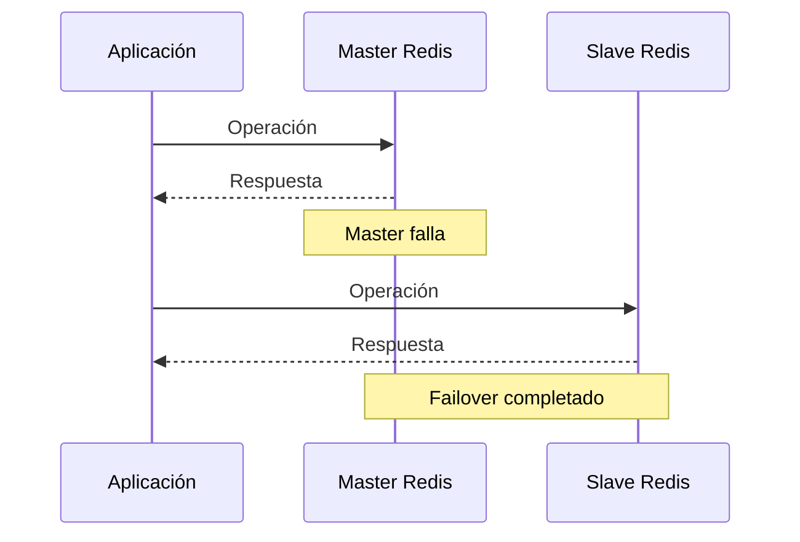
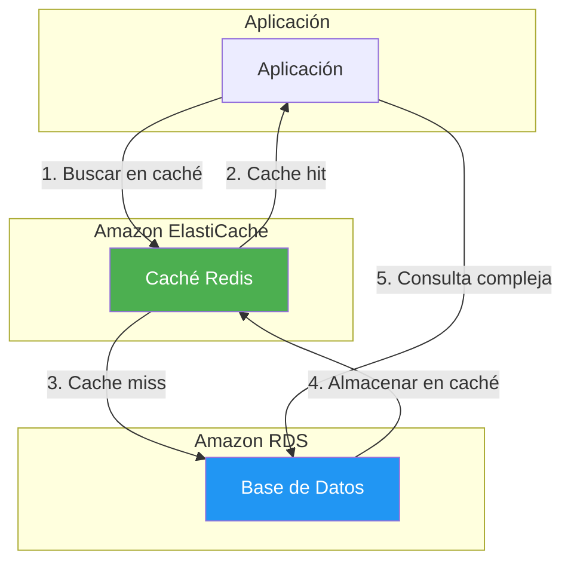
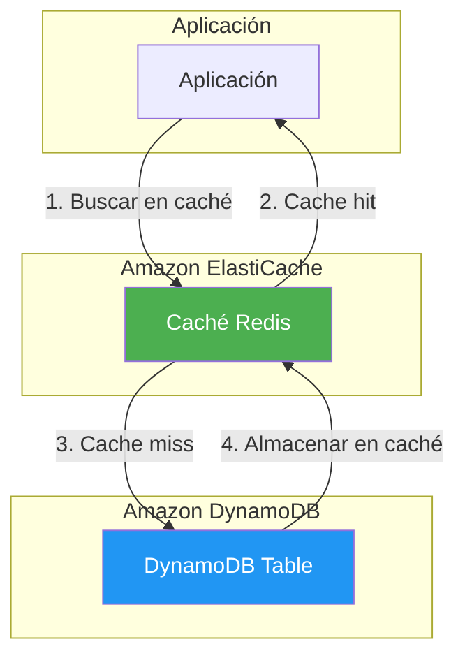
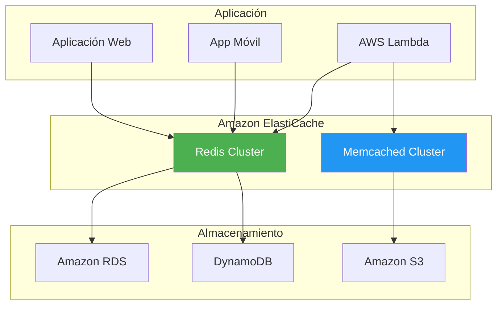
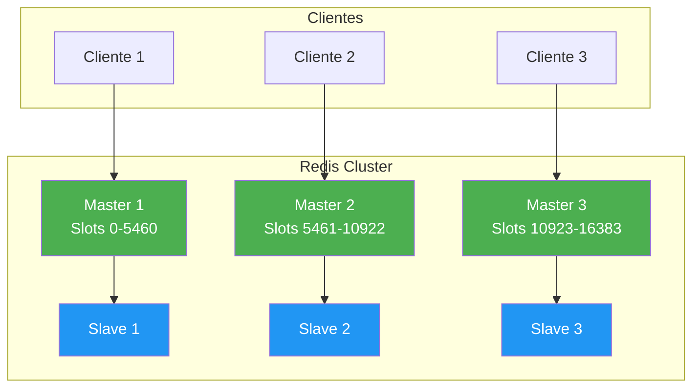
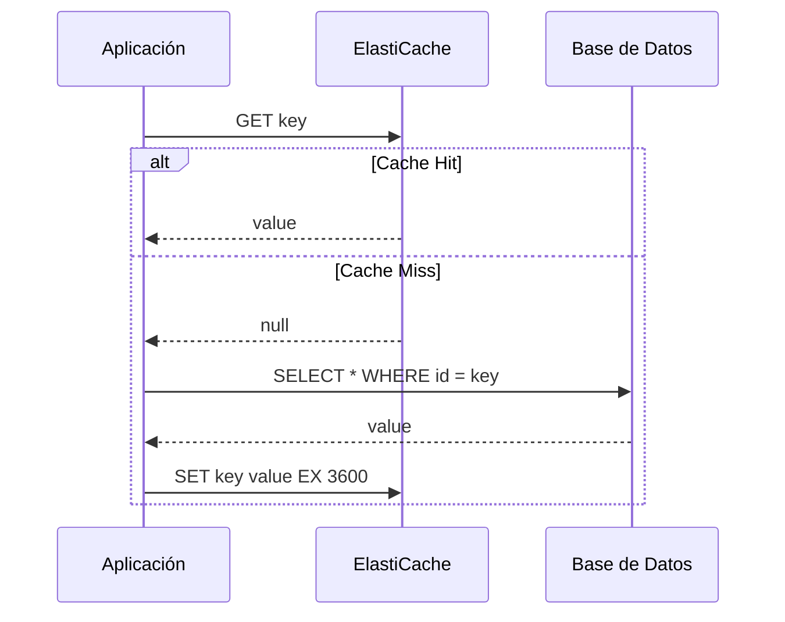

# Amazon ElastiCache

## Tabla de contenidos

- [¿Qué es Amazon ElastiCache?](#qué-es-amazon-elasticache)
- [Redis vs Memcached](#redis-vs-memcached)
- [Casos de uso](#casos-de-uso)
- [Características específicas de Redis](#características-específicas-de-redis)
- [Modo clúster](#modo-clúster)
- [Cifrado](#cifrado)
- [Autenticación](#autenticación)
- [Failover y Multi-AZ](#failover-y-multi-az)
- [Parameter Groups](#parameter-groups)
- [Snapshots y backups](#snapshots-y-backups)
- [Modelo de precios](#modelo-de-precios)
- [Mejores prácticas](#mejores-prácticas)
- [Integración con otros servicios](#integración-con-otros-servicios)
- [Ejemplos de código](#ejemplos-de-código)
- [Diagramas Mermaid](#diagramas-mermaid)
- [Preguntas frecuentes (FAQ)](#preguntas-frecuentes-faq)
- [Consejos para entrevistas](#consejos-para-entrevistas)
- [Resumen](#resumen)

---

## ¿Qué es Amazon ElastiCache?

Amazon ElastiCache es un servicio de caché en la nube completamente gestionado. Piensa en ElastiCache como **notas adhesivas súper rápidas** para datos a los que se accede con frecuencia: en lugar de buscar información en una base de datos lenta, la guardas en ElastiCache para recuperarla instantáneamente.

ElastiCache soporta dos motores de caché: **Redis** y **Memcached**. Ambos ofrecen latencia de microsegundos y mejoran significativamente el rendimiento de las aplicaciones.

### Características principales

| Característica | Descripción |
|----------------|-------------|
| **Rendimiento** | Latencia de microsegundos |
| **Escalabilidad** | Escalar horizontal y verticalmente |
| **Disponibilidad** | Multi-AZ con failover automático |
| **Seguridad** | Cifrado en reposo y en tránsito |
| **Gestión completa** | Sin infraestructura que administrar |
| **Compatible** | API compatible con Redis y Memcached |

---

## Redis vs Memcached

La elección entre Redis y Memcached depende de tus requisitos específicos. Aquí tienes una comparación detallada:

| Característica | Redis | Memcached |
|----------------|-------|-----------|
| **Estructura de datos** | String, List, Set, Sorted Set, Hash, Bitmap, HyperLogLog | String simple |
| **Persistencia** | Sí (RDB, AOF) | No |
| **Replicación** | Sí (master-slave) | No |
| **Clúster** | Sí (sharding) | Sí (distribución) |
| **Transacciones** | Sí | No |
| **Pub/Sub** | Sí | No |
| **Lua Scripting** | Sí | No |
| **Geospatial** | Sí | No |
| **TTL** | Sí | Sí |
| **Tamaño máximo** | 512 MB por key | 1 MB por key |
| **Memoria** | No eficiente | Muy eficiente |
| **Caso de uso ideal** | Datos complejos, persistencia | Caché simple, alto rendimiento |

### Cuándo usar Redis

- **Datos estructurados**: Listas, conjuntos, objetos complejos
- **Persistencia**: Necesitas que los datos sobrevivan reinicios
- **Pub/Sub**: Sistema de mensajería
- **Geospatial**: Búsquedas geográficas
- **Transacciones**: Operaciones atómicas múltiples

### Cuándo usar Memcached

- **Caché simple**: Key-value straightforward
- **Alto rendimiento**: Máxima eficiencia de memoria
- **Escalabilidad horizontal**: Distribución simple
- **Objetos grandes**: Hasta 1 MB por valor

---

## Casos de uso

### 1. Almacenamiento de sesiones



### 2. Caché de base de datos



### 3. Tabla de clasificación (Leaderboard)

```javascript
// Redis: Tabla de clasificación
await redis.zadd('leaderboard', 100, 'jugador1');
await redis.zadd('leaderboard', 200, 'jugador2');
await redis.zadd('leaderboard', 150, 'jugador3');

// Obtener top 10
const top10 = await redis.zrevrange('leaderboard', 0, 9, 'WITHSCORES');

// Obtener ranking de un jugador
const rank = await redis.zrevrank('leaderboard', 'jugador1');
```

### 4. Conteo en tiempo real

```javascript
// Redis: Conteo de visitas
await redis.incr('visitas:pagina:home');
await redis.incr('visitas:pagina:about');

// Obtener visitas
const visitas = await redis.get('visitas:pagina:home');

// Conteo con expiración
await redis.set('visitas:hora:2024-01-15T10:00:00Z', 1, 'EX', 3600);
await redis.incr('visitas:hora:2024-01-15T10:00:00Z');
```

### 5. Cola de mensajes

```javascript
// Redis: Cola de mensajes
await redis.lpush('cola:tareas', JSON.stringify({
    tipo: 'enviar_email',
    para: 'usuario@ejemplo.com',
    asunto: 'Bienvenido'
}));

// Procesar tarea
const tarea = await redis.rpop('cola:tareas');
const tareaParseada = JSON.parse(tarea);
```

---

## Características específicas de Redis

### Estructuras de datos

| Estructura | Descripción | Ejemplo |
|------------|-------------|---------|
| **String** | Valor simple | `SET key value` |
| **List** | Lista ordenada | `LPUSH list item` |
| **Set** | Conjunto único | `SADD set item` |
| **Sorted Set** | Conjunto ordenado | `ZADD sortedset score member` |
| **Hash** | Mapa key-value | `HSET hash field value` |
| **Bitmap** | Mapa de bits | `SETBIT key offset value` |
| **HyperLogLog** | Conteo aproximado | `PFADD key element` |
| **Stream** | Log de eventos | `XADD stream * field value` |

### Persistencia

Redis ofrece dos métodos de persistencia:

- **RDB (Redis Database)**: Snapshots periódicos
- **AOF (Append Only File)**: Registro de cada operación

```bash
# Configurar persistencia RDB
redis-cli CONFIG SET save "900 1 300 10 60 10000"

# Configurar persistencia AOF
redis-cli CONFIG SET appendonly yes
redis-cli CONFIG SET appendfsync everysec
```

### Pub/Sub

Redis implementa un sistema de mensajería publish/subscribe:

```javascript
// Suscriptor
await redis.subscribe('canal:notificaciones');
redis.on('message', (canal, mensaje) => {
    console.log(`Mensaje en ${canal}: ${mensaje}`);
});

// Publicador
await redis.publish('canal:notificaciones', 'Nuevo mensaje');
```

### Lua Scripting

Redis soporta scripts Lua para operaciones atómicas:

```lua
-- Script Lua para transferencia atómica
local saldo_origen = tonumber(redis.call('GET', KEYS[1]))
local saldo_destino = tonumber(redis.call('GET', KEYS[2]))
local cantidad = tonumber(ARGV[1])

if saldo_origen >= cantidad then
    redis.call('DECRBY', KEYS[1], cantidad)
    redis.call('INCRBY', KEYS[2], cantidad)
    return 1
else
    return 0
end
```

### Geospatial

Redis soporta datos geográficos:

```javascript
// Agregar ubicación
await redis.geoadd('ubicaciones', -3.7038, 40.4168, 'Madrid');
await redis.geoadd('ubicaciones', 2.3522, 48.8566, 'París');

// Calcular distancia
const distancia = await redis.geodist('ubicaciones', 'Madrid', 'París', 'km');

// Buscar nearby
const cercanos = await redis.geosearch('ubicaciones', 
    'FROMLONLAT', -3.7038, 40.4168, 
    'BYRADIUS', 1000, 'km',
    'ASC', 'COUNT', 10
);
```

---

## Modo clúster

El **modo clúster** de Redis distribuye datos entre múltiples nodos para escalar horizontalmente.

### Arquitectura



### Características

- **Sharding automático**: 16,384 slots distribuidos entre nodos
- **Replicación**: Cada master tiene al menos un slave
- **Failover automático**: Si un master falla, su slave lo reemplaza
- **Escalabilidad**: Agregar más nodos para mayor capacidad

### Configurar clúster

```bash
# Crear clúster Redis
aws elasticache create-cache-cluster \
  --cache-cluster-id mi-cluster-redis \
  --engine redis \
  --cache-node-type cache.r6g.large \
  --num-cache-nodes 3 \
  --replication-group-id mi-replication-group \
  --engine-version 7.0
```

---

## Cifrado

ElastiCache ofrece cifrado de datos en reposo y en tránsito.

### Cifrado en reposo (At Rest)

- Usa AWS Key Management Service (KMS) para cifrar datos
- Compatible con claves KMS administradas por el cliente

```bash
# Crear clúster con cifrado en reposo
aws elasticache create-cache-cluster \
  --cache-cluster-id mi-cluster-cifrado \
  --engine redis \
  --cache-node-type cache.r6g.large \
  --at-rest-encryption-enabled \
  --kms-key-id arn:aws:kms:us-east-1:123456789012:key/12345678-1234-1234-1234-123456789012
```

### Cifrado en tránsito (In Transit)

- Usa TLS para cifrar datos en tránsito
- Compatible con certificados personalizados

```bash
# Crear clúster con cifrado en tránsito
aws elasticache create-cache-cluster \
  --cache-cluster-id mi-cluster-tls \
  --engine redis \
  --cache-node-type cache.r6g.large \
  --transit-encryption-enabled
```

---

## Autenticación

### Redis AUTH

Redis AUTH permite autenticar clientes con una contraseña:

```bash
# Crear clúster con AUTH
aws elasticache create-cache-cluster \
  --cache-cluster-id mi-cluster-auth \
  --engine redis \
  --cache-node-type cache.r6g.large \
  --auth-token mi-token-seguro-12345678901234567890
```

### IAM Authentication

ElastiCache soporta autenticación IAM para Redis:

```bash
# Habilitar IAM authentication
aws elasticache create-cache-cluster \
  --cache-cluster-id mi-cluster-iam \
  --engine redis \
  --cache-node-type cache.r6g.large \
  --auth-type IAM
```

---

## Failover y Multi-AZ

### Failover automático



### Configurar Multi-AZ

```bash
# Crear replication group Multi-AZ
aws elasticache create-replication-group \
  --replication-group-id mi-replication-group \
  --replication-group-description "Grupo Multi-AZ" \
  --num-cache-clusters 2 \
  --automatic-failover-enabled \
  --multi-az enabled
```

---

## Parameter Groups

Los **Parameter Groups** controlan la configuración de ElastiCache.

```bash
# Crear parameter group
aws elasticache create-cache-parameter-group \
  --cache-parameter-group-family redis7 \
  --cache-parameter-group-name mi-parameter-group \
  --description "Parameter group para mi aplicación"

# Modificar parámetros
aws elasticache modify-cache-parameter-group \
  --cache-parameter-group-name mi-parameter-group \
  --parameter-name-values '{
    "Name": "maxmemory-policy",
    "Value": "allkeys-lru"
  }'

# Aplicar a clúster
aws elasticache modify-cache-cluster \
  --cache-cluster-id mi-cluster \
  --cache-parameter-group-name mi-parameter-group
```

---

## Snapshots y backups

### Snapshots

```bash
# Crear snapshot
aws elasticache create-snapshot \
  --cache-cluster-id mi-cluster \
  --snapshot-name mi-snapshot

# Restaurar desde snapshot
aws elasticache restore-cache-cluster-from-snapshot \
  --cache-cluster-id mi-cluster-restaurado \
  --snapshot-name mi-snapshot
```

### Backup automático

```bash
# Configurar backup automático
aws elasticache modify-cache-cluster \
  --cache-cluster-id mi-cluster \
  --snapshot-retention-limit 7 \
  --preferred-maintenance-window sun:05:00-sun:06:00
```

---

## Modelo de precios

ElastiCache cobra por:

1. **Instancia**: Por hora de uso
2. **Almacenamiento**: Por GB-mes (para Redis)
3. **Transferencia**: Por GB transferido fuera de la región
4. **Snapshots**: Por GB-mes
5. **Cifrado**: Sin costo adicional

### Ejemplo de costos

```text
Redis Clúster (3 nodos):
- Instancia cache.r6g.large: $0.226/hora × 730 horas × 3 = $496.86/mes
- Almacenamiento: 50 GB × $0.13/GB = $6.50/mes
- Total estimado: $503.36/mes

Memcached (2 nodos):
- Instancia cache.r6g.large: $0.226/hora × 730 horas × 2 = $331.24/mes
- Total estimado: $331.24/mes
```

---

## Mejores prácticas

### Selección de motor

1. **Usar Redis para datos complejos**: Listas, conjuntos, objetos
2. **Usar Memcached para caché simple**: Key-value straightforward
3. **Considerar persistencia**: Solo Redis ofrece persistencia
4. **Evaluar necesidades de Pub/Sub**: Solo Redis

### Rendimiento

1. **Elegir instancia adecuada**: Según la carga de trabajo
2. **Distribuir datos**: Evitar hot spots
3. **Usar Pipeline**: Para múltiples operaciones
4. **Implementar caché de lectura**: Para datos de acceso frecuente
5. **Monitorear métricas**: CPU, memoria, conexiones

### Seguridad

1. **Habilitar cifrado**: En reposo y en tránsito
2. **Usar AUTH o IAM**: Para autenticación
3. **Configurar Security Groups**: Restringir acceso
4. **Usar VPC endpoints**: Para acceso privado
5. **Rotar credenciales**: Regularmente

### Gestión

1. **Usar Parameter Groups**: Para configuración
2. **Programar snapshots**: Para recuperación
3. **Implementar monitoreo**: CloudWatch
4. **Documentar configuración**: Parámetros, security groups
5. **Probar failover**: Regularmente

---

## Integración con otros servicios

### RDS + ElastiCache



### DynamoDB + ElastiCache



### Lambda + ElastiCache

```javascript
// Lambda function para conectar a ElastiCache
const Redis = require('ioredis');

const redis = new Redis({
    host: 'mi-cluster.abc123.0001.use1.cache.amazonaws.com',
    port: 6379,
    tls: {}
});

exports.handler = async (event) => {
    const key = event.key;
    
    // Buscar en caché
    let value = await redis.get(key);
    
    if (!value) {
        // Cache miss: obtener de la fuente original
        value = await obtenerDeFuenteOriginal(key);
        
        // Almacenar en caché
        await redis.set(key, value, 'EX', 3600);
    }
    
    return { value };
};
```

---

## Ejemplos de código

### Ejemplo 1: Node.js - Conectar a ElastiCache Redis

```javascript
const Redis = require('ioredis');

// Conexión simple
const redis = new Redis({
    host: 'mi-cluster.abc123.0001.use1.cache.amazonaws.com',
    port: 6379,
    password: 'mi-password',
    tls: {}
});

// Conexión con clúster
const cluster = new Redis.Cluster([
    { host: 'master-1.abc123.0001.use1.cache.amazonaws.com', port: 6379 },
    { host: 'master-2.abc123.0001.use1.cache.amazonaws.com', port: 6379 },
    { host: 'master-3.abc123.0001.use1.cache.amazonaws.com', port: 6379 }
], {
    redisOptions: {
        password: 'mi-password',
        tls: {}
    }
});

// Operaciones básicas
async function operacionesBasicas() {
    // String
    await redis.set('nombre', 'Juan Pérez');
    const nombre = await redis.get('nombre');
    console.log('Nombre:', nombre);
    
    // List
    await redis.lpush('tareas', 'Tarea 1');
    await redis.lpush('tareas', 'Tarea 2');
    const tareas = await redis.lrange('tareas', 0, -1);
    console.log('Tareas:', tareas);
    
    // Set
    await redis.sadd('etiquetas', 'javascript');
    await redis.sadd('etiquetas', 'nodejs');
    const etiquetas = await redis.smembers('etiquetas');
    console.log('Etiquetas:', etiquetas);
    
    // Sorted Set (Leaderboard)
    await redis.zadd('leaderboard', 100, 'jugador1');
    await redis.zadd('leaderboard', 200, 'jugador2');
    await redis.zadd('leaderboard', 150, 'jugador3');
    const topJugadores = await redis.zrevrange('leaderboard', 0, 2, 'WITHSCORES');
    console.log('Top jugadores:', topJugadores);
    
    // Hash
    await redis.hset('usuario:123', 'nombre', 'Juan');
    await redis.hset('usuario:123', 'email', 'juan@ejemplo.com');
    const usuario = await redis.hgetall('usuario:123');
    console.log('Usuario:', usuario);
}

// Caché de base de datos
async function obtenerConCaché(id) {
    const cacheKey = `producto:${id}`;
    
    // Buscar en caché
    let producto = await redis.get(cacheKey);
    
    if (producto) {
        console.log('Cache hit');
        return JSON.parse(producto);
    }
    
    console.log('Cache miss');
    
    // Obtener de la base de datos
    producto = await obtenerDeBaseDatos(id);
    
    // Almacenar en caché por 1 hora
    await redis.set(cacheKey, JSON.stringify(producto), 'EX', 3600);
    
    return producto;
}

// Pub/Sub
async function pubSub() {
    // Suscriptor
    redis.subscribe('canal:notificaciones');
    redis.on('message', (canal, mensaje) => {
        console.log(`Mensaje en ${canal}: ${mensaje}`);
    });
    
    // Publicador
    await redis.publish('canal:notificaciones', 'Nuevo mensaje');
}

// Transacción
async function transaccion() {
    const multi = redis.multi();
    multi.set('cuenta:1:saldo', 1000);
    multi.set('cuenta:2:saldo', 500);
    multi.incrby('cuenta:1:saldo', 100);
    multi.decrby('cuenta:2:saldo', 100);
    
    const resultados = await multi.exec();
    console.log('Resultados:', resultados);
}

operacionesBasicas().catch(console.error);
```

### Ejemplo 2: AWS CLI - Crear y gestionar ElastiCache

```bash
# Crear clúster Redis
aws elasticache create-cache-cluster \
  --cache-cluster-id mi-cluster-redis \
  --engine redis \
  --engine-version 7.0 \
  --cache-node-type cache.r6g.large \
  --num-cache-nodes 1 \
  --auth-token mi-token-seguro-12345678901234567890 \
  --at-rest-encryption-enabled \
  --transit-encryption-enabled

# Crear replication group
aws elasticache create-replication-group \
  --replication-group-id mi-replication-group \
  --replication-group-description "Grupo Redis para producción" \
  --num-cache-clusters 2 \
  --automatic-failover-enabled \
  --multi-az enabled \
  --at-rest-encryption-enabled \
  --transit-encryption-enabled

# Crear clúster Memcached
aws elasticache create-cache-cluster \
  --cache-cluster-id mi-cluster-memcached \
  --engine memcached \
  --cache-node-type cache.r6g.large \
  --num-cache-nodes 3

# Listar clústeres
aws elasticache describe-cache-clusters

# Eliminar clúster
aws elasticache delete-cache-cluster \
  --cache-cluster-id mi-cluster-redis
```

### Ejemplo 3: Python - Conectar a ElastiCache

```python
import redis
import json

# Conexión simple
r = redis.Redis(
    host='mi-cluster.abc123.0001.use1.cache.amazonaws.com',
    port=6379,
    password='mi-password',
    ssl=True,
    decode_responses=True
)

# Operaciones básicas
def operaciones_basicas():
    # String
    r.set('nombre', 'Juan Pérez')
    nombre = r.get('nombre')
    print(f'Nombre: {nombre}')
    
    # List
    r.lpush('tareas', 'Tarea 1')
    r.lpush('tareas', 'Tarea 2')
    tareas = r.lrange('tareas', 0, -1)
    print(f'Tareas: {tareas}')
    
    # Set
    r.sadd('etiquetas', 'python')
    r.sadd('etiquetas', 'redis')
    etiquetas = r.smembers('etiquetas')
    print(f'Etiquetas: {etiquetas}')
    
    # Sorted Set (Leaderboard)
    r.zadd('leaderboard', {'jugador1': 100, 'jugador2': 200, 'jugador3': 150})
    top_jugadores = r.zrevrange('leaderboard', 0, 2, withscores=True)
    print(f'Top jugadores: {top_jugadores}')
    
    # Hash
    r.hset('usuario:123', mapping={'nombre': 'Juan', 'email': 'juan@ejemplo.com'})
    usuario = r.hgetall('usuario:123')
    print(f'Usuario: {usuario}')

# Caché de base de datos
def obtener_con_cache(id):
    cache_key = f'producto:{id}'
    
    # Buscar en caché
    producto = r.get(cache_key)
    
    if producto:
        print('Cache hit')
        return json.loads(producto)
    
    print('Cache miss')
    
    # Obtener de la base de datos
    producto = obtener_de_base_datos(id)
    
    # Almacenar en caché por 1 hora
    r.set(cache_key, json.dumps(producto), ex=3600)
    
    return producto

# Pub/Sub
def pub_sub():
    # Suscriptor
    pubsub = r.pubsub()
    pubsub.subscribe('canal:notificaciones')
    
    for message in pubsub.listen():
        if message['type'] == 'message':
            print(f"Mensaje: {message['data']}")

# Pipeline
def pipeline():
    pipe = r.pipeline()
    pipe.set('clave1', 'valor1')
    pipe.set('clave2', 'valor2')
    pipe.set('clave3', 'valor3')
    resultados = pipe.execute()
    print(f'Resultados: {resultados}')

operaciones_basicas()
```

---

## Diagramas Mermaid

### Arquitectura general de ElastiCache



### Redis Cluster Architecture



### Flujo de caché



---

## Preguntas frecuentes (FAQ)

### ¿Cuál es la diferencia entre Redis y Memcached?
Redis soporta estructuras de datos complejas, persistencia, replicación y pub/sub. Memcached es más simple y eficiente en memoria, ideal para caché key-value straightforward.

### ¿Cuánto cuesta ElastiCache?
Los costos varían según el motor, tipo de instancia y número de nodos. Consulta la [página de precios de ElastiCache](https://aws.amazon.com/elasticache/pricing/) para obtener información actualizada.

### ¿ElastiCache es escalable?
Sí, ElastiCache es escalable horizontal y verticalmente. Puedes agregar más nodos o cambiar a un tipo de instancia mayor.

### ¿ElastiCache es seguro?
Sí, ElastiCache ofrece cifrado en reposo y en tránsito, AUTH, IAM authentication y VPC endpoints.

### ¿Puedo usar ElastiCache con contenedores?
Sí, ElastiCache puede ser usado con ECS, EKS y Docker. Es ideal para caché de aplicaciones en contenedores.

### ¿Qué es el modo clúster en Redis?
El modo clúster distribuye datos entre múltiples nodos para escalar horizontalmente. Cada nodo es responsable de un rango de slots.

### ¿Puedo usar ElastiCache con RDS?
Sí, ElastiCache es frecuentemente usado como caché para RDS, mejorando el rendimiento de consultas frecuentes.

### ¿Qué es DynamoDB Accelerator (DAX)?
DAX es una caché específica para DynamoDB, mientras que ElastiCache es un servicio de caché general que puede ser usado con cualquier base de datos.

### ¿Cuándo debo usar ElastiCache?
Usa ElastiCache cuando necesites caché de datos frecuentemente accedidos, sesiones de usuario, tablas de clasificación o colas de mensajes.

### ¿Puedo usar ElastiCache on-premises?
No, ElastiCache es un servicio de AWS Cloud. Para caché on-premises, considera Redis o Memcached auto-hospedados.

---

## Consejos para entrevistas

### Preguntas técnicas comunes

1. **¿Cuál es la diferencia entre Redis y Memcached?**
   - Redis: Estructuras complejas, persistencia, replicación, pub/sub
   - Memcached: Simple, eficiente, ideal para caché key-value

2. **¿Cuándo usarías ElastiCache en lugar de DynamoDB Accelerator (DAX)?**
   - ElastiCache: Caché general, estructuras complejas, pub/sub
   - DAX: Caché específica para DynamoDB, compatible con API de DynamoDB

3. **¿Cómo implementarías caché de base de datos con ElastiCache?**
   - Patrón cache-aside: Buscar en caché, si miss obtener de BD y almacenar
   - TTL para expiración automática
   - Invalidación de caché cuando los datos cambian

4. **¿Qué es el modo clúster en Redis y cuándo usarlo?**
   - Modo clúster: Sharding automático entre múltiples nodos
   - Usar para escalar horizontalmente
   - Para cargas de trabajo que exceden un solo nodo

5. **¿Cómo protegerías ElastiCache en producción?**
   - Cifrado en reposo y en tránsito
   - AUTH o IAM authentication
   - Security groups
   - VPC endpoints
   - Monitoreo con CloudWatch

### Buenas respuestas

- Menciona la **diferencia entre Redis y Memcached**
- Explica el **patrón cache-aside** para caché de BD
- Describe cómo **el modo clúster** escala horizontalmente
- Habla sobre **cifrado** y **autenticación** para seguridad
- Menciona **CloudWatch** para monitoreo

---

## Resumen

Amazon ElastiCache es un servicio de caché en la nube completamente gestionado que ofrece latencia de microsegundos para datos frecuentemente accedidos.

| Concepto | Descripción |
|----------|-------------|
| **Redis** | Estructuras complejas, persistencia, pub/sub |
| **Memcached** | Simple, eficiente, key-value |
| **Modo clúster** | Sharding horizontal |
| **Cifrado** | En reposo y en tránsito |
| **Autenticación** | AUTH e IAM |
| **Multi-AZ** | Failover automático |
| **Parameter Groups** | Configuración |

### Checklist de implementación

- [ ] Seleccionar motor adecuado (Redis o Memcached)
- [ ] Elegir tipo de instancia
- [ ] Configurar clúster o replicación
- [ ] Habilitar cifrado
- [ ] Configurar autenticación
- [ ] Implementar caché de lectura
- [ ] Monitorear métricas de CloudWatch
- [ ] Documentar configuración
- [ ] Probar failover

---

*Última actualización: 2024*
