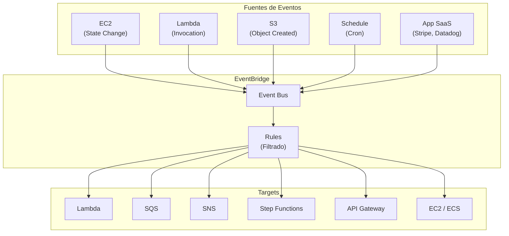
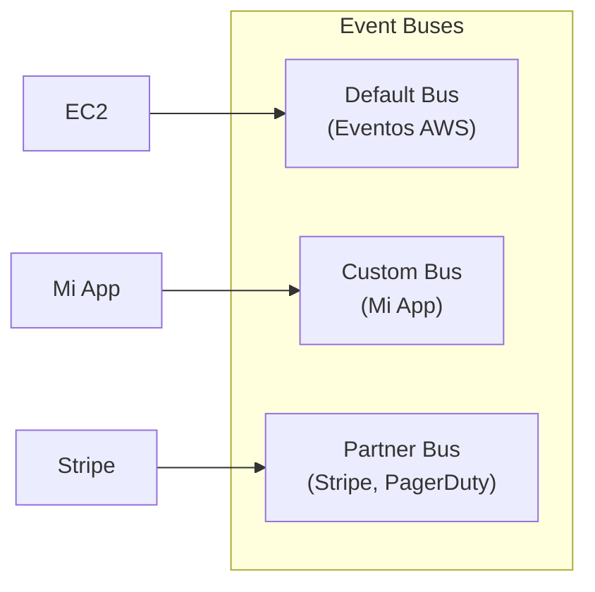
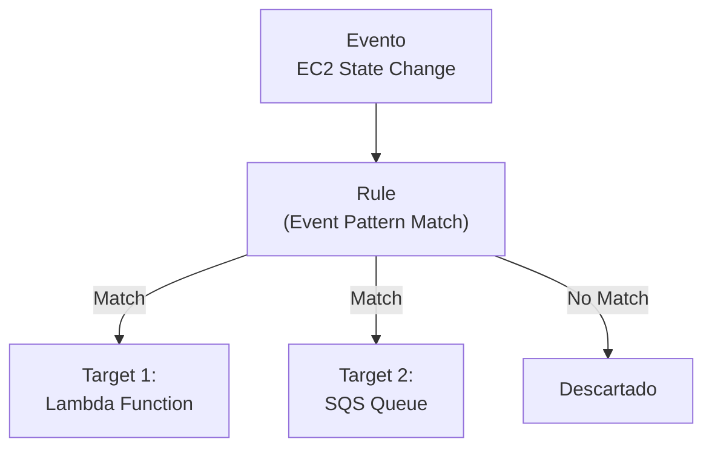
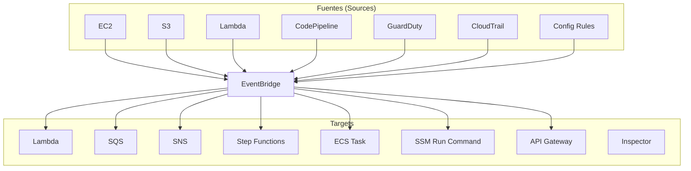
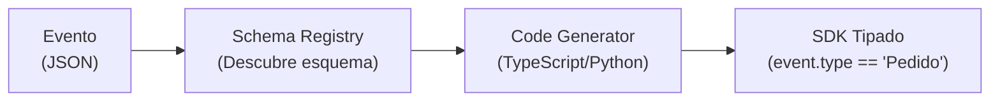
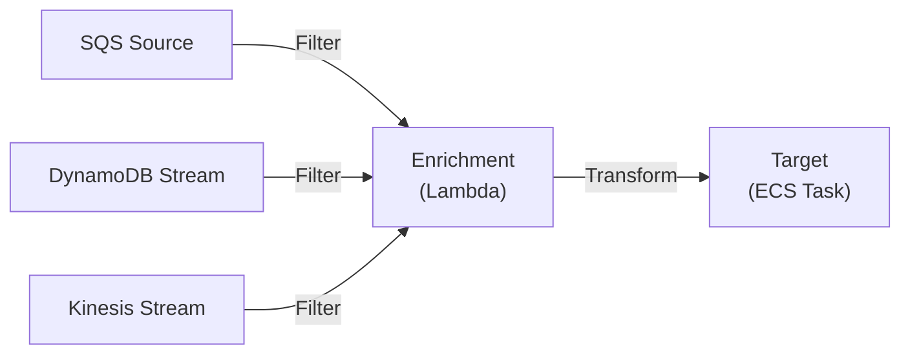
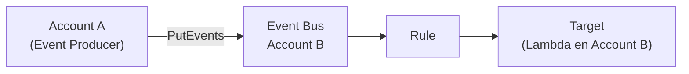
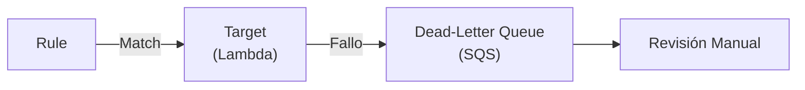
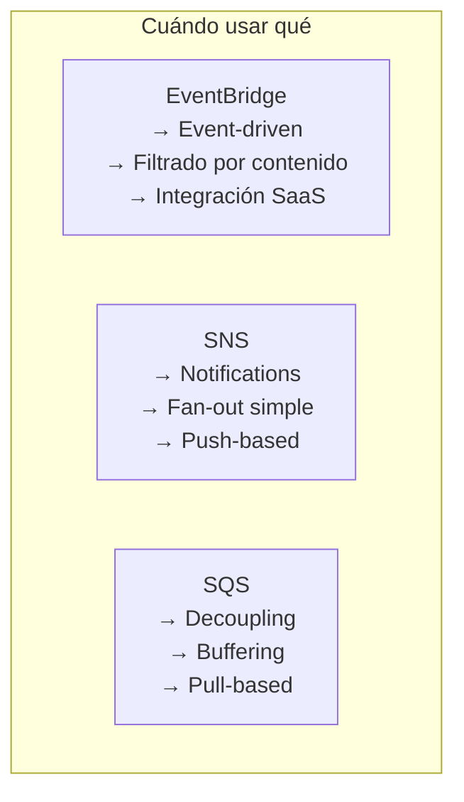

# Amazon EventBridge

## ¿Qué es EventBridge?

Imagina que tienes una **centralita telefónica inteligente** que recibe llamadas de múltiples fuentes (clientes, proveedores, empleados) y automáticamente las enruta a la persona correcta según reglas predefinidas. **Amazon EventBridge** es esa centralita para eventos: recibe eventos de más de 25 servicios AWS y aplicaciones SaaS, los filtra con reglas basadas en contenido y los envía a destinos apropiados.



:::tip
EventBridge es la evolución de **CloudWatch Events**. Ofrece más features: Schema Registry, Pipes, Scheduler, y soporte para eventos SaaS.
:::

## Event Buses

| Tipo | Descripción |
|---|---|
| **Default** | Bus principal de AWS. Recibe eventos de servicios AWS |
| **Custom** | Crea tus propios buses para eventos de tu aplicación |
| **Partner** | Eventos de aplicaciones SaaS (Stripe, Datadog, etc.) |



```bash
# Crear Event Bus Custom
aws events create-event-bus --name mi-event-bus

# Crear Event Bus con Archive
aws events create-event-bus \
  --name mi-event-bus-archived \
  --event-source-name com.mi-app.events
```

## Rules y Targets

Las **Rules** definen qué eventos buscar y a dónde enviarlos.



```bash
# Crear Rule con Event Pattern
aws events put-rule \
  --name "ec2-state-change" \
  --event-pattern '{
    "source": ["aws.ec2"],
    "detail-type": ["EC2 Instance State-change Notification"],
    "detail": {
      "state": ["stopped", "terminated"]
    }
  }' \
  --state ENABLED \
  --description "Detecta cuando EC2 se detiene o termina"

# Asociar Target (Lambda)
aws events put-targets \
  --rule "ec2-state-change" \
  --event-bus-name default \
  --targets '[{
    "Id": "target-lambda",
    "Arn": "arn:aws:lambda:us-east-1:123456789012:function:MiFuncion"
  }]'

# Asociar Target (SQS)
aws events put-targets \
  --rule "ec2-state-change" \
  --event-bus-name default \
  --targets '[{
    "Id": "target-sqs",
    "Arn": "arn:aws:sqs:us-east-1:123456789012:mi-cola"
  }]'
```

## Event Patterns

Los **Event Patterns** son filtros JSON que determinan qué eventos activan una rule.

### Ejemplos de Event Patterns

```json
{
  "source": ["aws.ec2"],
  "detail-type": ["EC2 Instance State-change Notification"],
  "detail": {
    "state": ["stopped", "terminated"],
    "instance-id": ["i-0abc1234def567890"]
  }
}
```

```json
{
  "source": ["mi-app.pedidos"],
  "detail-type": ["Pedido Creado"],
  "detail": {
    "amount": [{"numeric": [">=", 100]}],
    "priority": ["high", "critical"],
    "region": [{"prefix": "us-east"}]
  }
}
```

```json
{
  "source": ["aws.s3"],
  "detail-type": ["Object Created"],
  "detail": {
    "bucket": {
      "name": ["mi-bucket-uploads"]
    },
    "object": {
      "key": [{"prefix": "images/"}]
    }
  }
}
```

### Operadores de Event Pattern

| Operador | Descripción | Ejemplo |
|---|---|---|
| Exact match | Igualdad exacta | `"state": ["stopped"]` |
| Prefix | Prefijo del string | `"key": [{"prefix": "img/"}]` |
| Anything-but | Excluir valores | `"status": [{"anything-but": ["test"]}]` |
| Numeric | Comparaciones numéricas | `"amount": [{"numeric": [">=", 100]}]` |
| IP Address | Coincidencia de IP | `"source_ip": [{"cidr": "10.0.0.0/8"}]` |
| Exists | Campo existe | `"error_code": [{"exists": true}]` |
| AND/OR | Combinaciones | No soportado (usar arrays) |

## Integración con 25+ Servicios AWS



| Servicio AWS | Tipo de Evento |
|---|---|
| EC2 | State changes (running, stopped, terminated) |
| S3 | Object created, deleted |
| Lambda | Invocation results |
| CodePipeline | Pipeline state changes |
| GuardDuty | Security findings |
| CloudTrail | API calls |
| Config | Compliance changes |
| RDS | DB instance events |
| ECS | Task state changes |
| Auto Scaling | Scaling activities |
| CodeDeploy | Deployment state changes |
| Health | AWS Health events |

## Schema Registry

**Schema Registry** descubre automáticamente el esquema de tus eventos y genera código tipado.

```bash
# Descubrir schemas
aws events discover-schemas \
  --event-source arn:aws:events:us-east-1:123456789012:event-bus/mi-event-bus

# Exportar schema como OpenAPI
aws events export-discovered-schema \
  --event-source arn:aws:events:us-east-1:123456789012:event-bus/mi-event-bus \
  --schema-name com.mi-app.pedidos \
  --type OpenApi30
```



## Pipes

**EventBridge Pipes** conecta una fuente de eventos con un target, procesando el evento en el camino (filter, transform, enrich).



```bash
# Crear Pipe
aws pipes create-pipe \
  --name "mi-pipe" \
  --source arn:aws:sqs:us-east-1:123456789012:mi-cola \
  --source-parameters '{
    "sqsQueueParameters": {
      "BatchSize": 10
    },
    "filterCriteria": {
      "Filters": [{
        "Pattern": "{\"detail\": {\"event_type\": [\"pedido_creado\"]}}"
      }]
    }
  }' \
  --enrichment arn:aws:lambda:us-east-1:123456789012:function:EnrichFunction \
  --target arn:aws:ecs:us-east-1:123456789012:service/mi-cluster/mi-service
```

| Componente | Descripción |
|---|---|
| Source | SQS, Kinesis, DynamoDB Streams, MSK, Self-managed Kafka |
| Filter | Filtra eventos antes de procesar |
| Enrichment | Lambda o Step Functions para enriquecer datos |
| Target | SQS, Lambda, ECS, Step Functions, API Gateway, etc. |

## Scheduler

**EventBridge Scheduler** crea eventos basados en **cron o rate**, reemplazando a CloudWatch Events Rules para scheduling.

```bash
# Crear Schedule (cron: cada día a las 8am)
aws scheduler create-schedule \
  --name "reporte-diario" \
  --schedule-expression "cron(0 8 * * ? *)" \
  --flexible-time-window-mode OFF \
  --target '{
    "Arn": "arn:aws:lambda:us-east-1:123456789012:function:GenerarReporte",
    "RoleArn": "arn:aws:iam::123456789012:role/service-role/scheduler-role"
  }'

# Crear Schedule (rate: cada 5 minutos)
aws scheduler create-schedule \
  --name "limpieza-colas" \
  --schedule-expression "rate(5 minutes)" \
  --flexible-time-window-mode OFF \
  --target '{
    "Arn": "arn:aws:sqs:us-east-1:123456789012:mi-cola-limpieza",
    "RoleArn": "arn:aws:iam::123456789012:role/service-role/scheduler-role",
    "SqsParameters": {"MessageGroupId": "limpieza"}
  }'
```

## Cross-Account Events



```bash
# Permitir cross-account en Event Bus
aws events put-permission \
  --event-bus-name mi-event-bus \
  --action events:PutEvents \
  --principal 999888777666 \
  --statement-id cross-account-account-b
```

## Replay Capability

EventBridge puede **re-enviar eventos archivados** para debugging o re-procesamiento.

```bash
# Crear Archive
aws events create-archive \
  --archive-name mi-archive \
  --event-bus-name mi-event-bus \
  --retention-days 90

# Replay eventos
aws events start-replay \
  --replay-name mi-replay \
  --event-source-arn arn:aws:events:us-east-1:123456789012:archive/mi-archive \
  --event-start-time 2026-01-01T00:00:00Z \
  --event-end-time 2026-01-02T00:00:00Z \
  --destination '{
    "Arn": "arn:aws:events:us-east-1:123456789012:event-bus/mi-event-bus",
    "RoleArn": "arn:aws:iam::123456789012:role/service-role/replay-role"
  }'
```

## Dead-Letter Queues for Targets



```bash
# Configurar DLQ en Target
aws events put-targets \
  --rule "mi-rule" \
  --targets '[{
    "Id": "target-1",
    "Arn": "arn:aws:lambda:us-east-1:123456789012:function:MiFuncion",
    "DeadLetterConfig": {
      "Arn": "arn:aws:sqs:us-east-1:123456789012:mi-dlq"
    }
  }]'
```

## EventBridge vs SNS vs SQS

| Característica | EventBridge | SNS | SQS |
|---|---|---|---|
| Modelo | Event-driven | Pub-sub | Cola |
| Filtrado | Por contenido (pattern) | Por atributos | No |
| Integración AWS | 25+ servicios | Limitada | Limitada |
| SaaS | Sí (partner buses) | No | No |
| Schema Registry | Sí | No | No |
| Replay | Sí | No | No |
| Pipes | Sí | No | No |
| Throughput | Illimitado | Millones/seg | Illimitado |
| Costo | $1.00/millón | $0.50/millón | $0.40/millón |
| Uso típico | Event-driven architecture | Notifications | Decoupling, buffering |



## Precio

| Concepto | Costo |
|---|---|
| Eventos intradeAWS | Gratis (eventos de servicios AWS) |
| Eventos custom | $1.00 por millón de eventos |
| Eventos cross-region | $1.00 por millón + transferencia |
| Pipes | $0.40 por millón de eventos + $0.10/hora por pipe |
| Scheduler | Gratis (invocaciones a servicios AWS) |
| Archive | Gratis (almacenamiento $0.10/GB/mes) |
| Replay | Gratis |

## Mejores Prácticas

1. **Usa EventBridge** para event-driven architecture con filtrado avanzado
2. **Implementa DLQ** en targets para debugging
3. **Usa Archives** para retener eventos y permitir replay
4. **Crea Schemas** para documentar y generar código tipado
5. **Usa Pipes** para procesamiento simple entre source → target
6. **Implementa cross-account events** para arquitecturas multi-cuenta
7. **Monitorea con CloudWatch** (Invocations, FailedInvocations, ThrottledEvents)
8. **Usa tags** para gestión de costos

## Errores Comunes

| Error | Consecuencia | Solución |
|---|---|---|
| Event pattern mal formateado | No coincide ningún evento | Verificar JSON syntax |
| Sin DLQ en targets | Eventos fallidos se pierden | Configurar DLQ |
| Permisos insuficientes | Rule no puede invocar target | Agregar permisos IAM |
| Sin Archive | No puedes hacer replay | Crear Archive para eventos importantes |
| Mezclar CloudWatch Events y EventBridge | Confusión | Usar solo EventBridge (evolución de CloudWatch Events)

## Preguntas Frecuentes (FAQ)

**¿EventBridge vs SNS?**
EventBridge tiene filtrado por contenido, Schema Registry, y más integraciones AWS/SaaS. SNS es más simple para notificaciones directas.

**¿Puedo usar EventBridge con S3?**
Sí. EventBridge recibe eventos de S3 (Object Created, etc.) y puedes crear rules para procesarlos.

**¿Qué es el Default Event Bus?**
Es el bus que recibe eventos de todos los servicios AWS. No necesitas crearlo.

**¿Puedo hacer replay de eventos?**
Sí. Crea un Archive y usa Start-Replay para re-enviar eventos archivados.

## Tips para Entrevistas

1. **EventBridge = Centralita inteligente de eventos** con filtrado por contenido
2. **Event Pattern** es más potente que SNS Filter Policy (soporta numbérico, exists, prefix)
3. **Pipes** = SQS + Lambda simplificado (sin infraestructura)
4. **Schema Registry** genera código tipado para tus eventos
5. **Archives + Replay** son cruciales para debugging y compliance
6. **Cross-account events** son nativos en EventBridge

## Resumen

| Componente | Descripción |
|---|---|
| Event Bus | Canal de eventos (default, custom, partner) |
| Rule | Define qué eventos buscar |
| Event Pattern | Filtro JSON basado en contenido |
| Target | Destino del evento (Lambda, SQS, SNS, etc.) |
| Schema Registry | Descubre esquemas y genera código |
| Pipes | Conecta source → filter → enrich → target |
| Scheduler | Eventos cron/rate |
| Archive | Almacena eventos para replay |
| DLQ | Captura eventos fallidos de targets |
