# Infraestructura Global de AWS

> *"AWS no es solo una nube — es una red global de data centers diseñada para ofrecer baja latencia, alta disponibilidad y cumplimiento normativo en cualquier parte del mundo."*

AWS opera la infraestructura de cloud computing más grande y completa del mundo. Entender cómo está organizada esta infraestructura es fundamental para diseñar aplicaciones que sean rápidas, resilientes y conformes con las regulaciones locales.

---

## Visión General de la Infraestructura

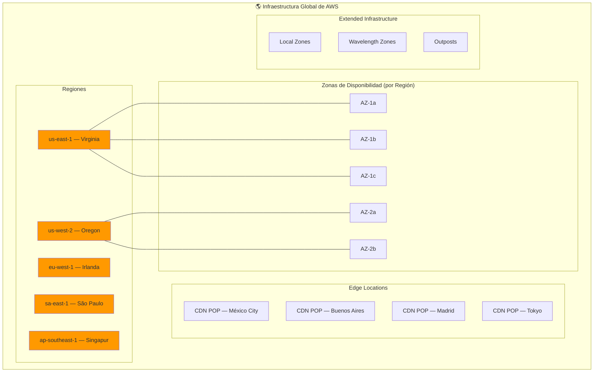

### Jerarquía de la infraestructura

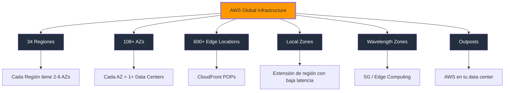

---

## AWS Regions (Regiones)

Una **Región de AWS** es una ubicación física en el mundo donde AWS tiene múltiples data centers agrupados. Cada región está completamente aislada de las demás regiones para maximizar la disponibilidad y la tolerancia a fallos.

### Características principales

| Característica | Detalle |
|----------------|---------|
| **Total actual** | 34 regiones en todo el mundo |
| **Mínimo de AZs** | 2 por región (máximo: 6) |
| **Aislamiento** | Las regiones son independientes entre sí |
| **Activación** | Algunas requieren solicitud explícita |
| **Costos** | Varían según la región |
| **Servicios** | No todos los servicios están disponibles en todas las regiones |

### Regiones disponibles (2026)

| Región | Código | Ubicación | Estado |
|--------|--------|-----------|--------|
| US East (N. Virginia) | us-east-1 | Virginia, EE.UU. | ✅ Disponible |
| US East (Ohio) | us-east-2 | Ohio, EE.UU. | ✅ Disponible |
| US West (N. California) | us-west-1 | California, EE.UU. | ✅ Disponible |
| US West (Oregon) | us-west-2 | Oregon, EE.UU. | ✅ Disponible |
| EU (Ireland) | eu-west-1 | Dublín, Irlanda | ✅ Disponible |
| EU (London) | eu-west-2 | Londres, UK | ✅ Disponible |
| EU (Paris) | eu-west-3 | París, Francia | ✅ Disponible |
| EU (Frankfurt) | eu-central-1 | Frankfurt, Alemania | ✅ Disponible |
| EU (Stockholm) | eu-north-1 | Estocolmo, Suecia | ✅ Disponible |
| EU (Milan) | eu-south-1 | Milán, Italia | ✅ Disponible |
| EU (Zurich) | eu-central-2 | Zúrich, Suiza | ✅ Disponible |
| Asia Pacific (Tokyo) | ap-northeast-1 | Tokio, Japón | ✅ Disponible |
| Asia Pacific (Seoul) | ap-northeast-2 | Seúl, Corea del Sur | ✅ Disponible |
| Asia Pacific (Osaka) | ap-northeast-3 | Osaka, Japón | ✅ Disponible |
| Asia Pacific (Singapore) | ap-southeast-1 | Singapur | ✅ Disponible |
| Asia Pacific (Sydney) | ap-southeast-2 | Sídney, Australia | ✅ Disponible |
| Asia Pacific (Mumbai) | ap-south-1 | Bombay, India | ✅ Disponible |
| Asia Pacific (Hong Kong) | ap-east-1 | Hong Kong | ✅ Disponible |
| South America (São Paulo) | sa-east-1 | São Paulo, Brasil | ✅ Disponible |
| Canada (Central) | ca-central-1 | Montreal, Canadá | ✅ Disponible |
| Middle East (Bahrain) | me-south-1 | Baréin | ✅ Disponible |
| Africa (Cape Town) | af-south-1 | Ciudad del Cabo, SA | ✅ Disponible |
| Israel (Tel Aviv) | il-central-1 | Tel Aviv, Israel | ✅ Disponible |
| Malaysia (Kuala Lumpur) | ap-southeast-5 | Kuala Lumpur | ✅ Disponible |
| Thailand (Bangkok) | ap-southeast-7 | Bangkok | ✅ Disponible |
| Mexico (Querétaro) | mx-central-1 | Querétaro, MX | ✅ Disponible |

### Cómo elegir una Región

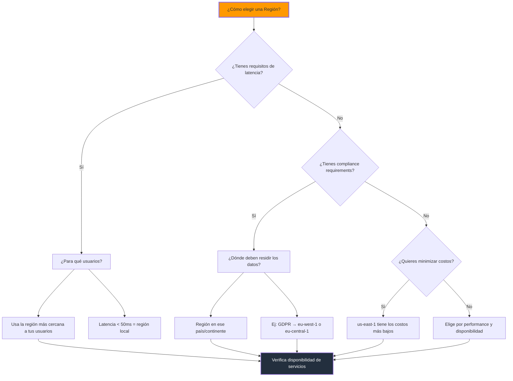

### Factores para elegir una región

| Factor | Prioridad | Acción |
|--------|-----------|--------|
| **Latencia para usuarios** | 🔴 Crítica | Elige la región más cercana a tu audiencia principal |
| **Compliance / Residencia de datos** | 🔴 Crítica | Verifica regulaciones locales (GDPR, PDPA, etc.) |
| **Disponibilidad de servicios** | 🟡 Alta | Confirma que todos los servicios que necesitas existan en la región |
| **Costos** | 🟡 Alta | Los precios varían hasta 25% entre regiones |
| **Alta disponibilidad** | 🟡 Alta | Algunas regiones tienen más AZs que otras |
| **Servicios de AI/ML** | 🟢 Media | Bedrock y otros servicios de IA no están en todas las regiones |
| **Desastres naturales** | 🟢 Media | Elige regiones con baja probabilidad de desastres |

### Ejemplo: Comparación de costos entre regiones

| Servicio | us-east-1 (Virginia) | eu-west-1 (Irlanda) | sa-east-1 (São Paulo) |
|----------|----------------------|---------------------|------------------------|
| EC2 t2.micro (hora) | $0.0116 | $0.0132 | $0.0185 |
| S3 (GB/mes std) | $0.023 | $0.025 | $0.027 |
| RDS db.t3.micro (hora) | $0.017 | $0.019 | $0.028 |
| Data Transfer OUT (GB) | $0.09 | $0.09 | $0.09 |

> **Nota:** `sa-east-1` (São Paulo) es la región más cercana para usuarios en Latinoamérica, pero sus costos son ~30-60% más altos que `us-east-1`. Para proyectos con presupuesto ajustado, `us-east-1` es la opción más económica.

---

## Availability Zones (Zonas de Disponibilidad)

Una **Availability Zone (AZ)** es una ubicación física discreta dentro de una región de AWS. Cada AZ consta de uno o más data centers independientes con energía, refrigeración y conectividad de red dedicadas.

### Características principales

| Característica | Detalle |
|----------------|---------|
| **Composición** | 1+ data centers por AZ |
| **Total global** | 108+ AZs en todas las regiones |
| **Conectividad** | Red de fibra óptica de alta velocidad entre AZs en la misma región |
| **Aislamiento** | Cada AZ es independiente en fallos (energía, refrigeración, red) |
| **Distancia** | ~60-100km entre AZs en la misma región |
| **Latencia inter-AZ** | < 2ms entre AZs en la misma región |

### Diagrama de AZs dentro de una Región

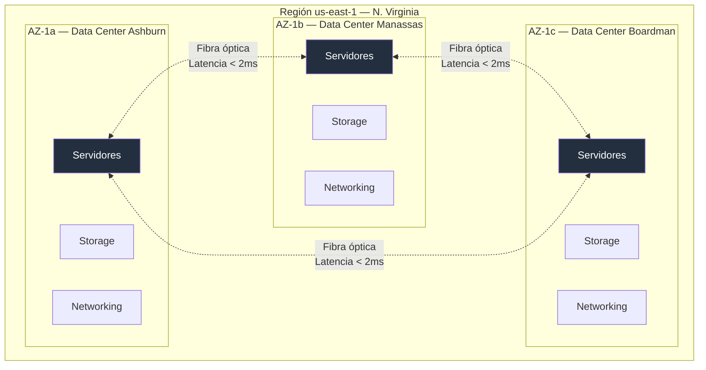

### Por qué las AZs importan

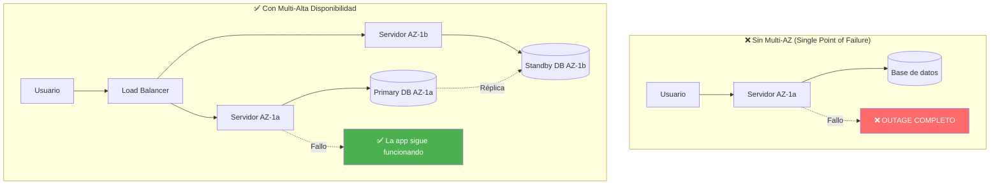

### Multi-AZ vs Multi-Region

| Estrategia | Objetivo | Latencia inter-AZ | Costo | Complejidad |
|------------|----------|-------------------|-------|-------------|
| **Single AZ** | Desarrollo/Pruebas | N/A | Bajo | Baja |
| **Multi-AZ** | Alta disponibilidad | < 2ms | Medio | Media |
| **Multi-Region** | Disaster Recovery / Baja latencia global | Variable (50-200ms) | Alto | Alta |

### Ejemplo: Desplegar EC2 Multi-AZ con Auto Scaling

```bash
# 1. Crear un Launch Template
aws ec2 create-launch-template \
    --launch-template-name mi-template \
    --version-description "v1" \
    --launch-template-data '{
        "ImageId": "ami-0c55b159cbfafe1f0",
        "InstanceType": "t2.micro",
        "SecurityGroupIds": ["sg-0123456789abcdef0"],
        "UserData": "IyEvYmluL2Jhc2gKZWNobyAiSGVsbG8gV29ybGQi"
    }'

# 2. Crear un Auto Scaling Group Multi-AZ
aws autoscaling create-auto-scaling-group \
    --auto-scaling-group-name mi-asg \
    --launch-template LaunchTemplateName=mi-template \
    --min-size 2 \
    --max-size 6 \
    --desired-capacity 2 \
    --vpc-zone-identifier "subnet-0123456789abcdef0,subnet-0123456789abcdef1" \
    --availability-zones "us-east-1a,us-east-1b,us-east-1c" \
    --target-group-arns "arn:aws:elasticloadbalancing:us-east-1:ACCOUNT:targetgroup/mi-tg/12345"

# 3. Verificar el estado
aws autoscaling describe-auto-scaling-groups \
    --auto-scaling-group-names mi-asg \
    --query 'AutoScalingGroups[0].{Min:MinSize,Max:MaxSize,Desired:DesiredCapacity,AZs:AvailabilityZones}'
```

---

## Edge Locations y CloudFront POPs

Las **Edge Locations** son puntos de presencia (POPs) de AWS distribuidos estratégicamente alrededor del mundo para entregar contenido con la menor latencia posible a los usuarios finales.

### Características principales

| Característica | Detalle |
|----------------|---------|
| **Total actual** | 600+ Edge Locations |
| **Propósito principal** | Entrega de contenido (CDN) y resolución DNS |
| **Servicio asociado** | Amazon CloudFront, Route 53 |
| **Distribución** | Ciudades densamente pobladas en todos los continentes |
| **Velocidad** | Cache de contenido estático cerca del usuario |

### Cómo funciona CloudFront con Edge Locations

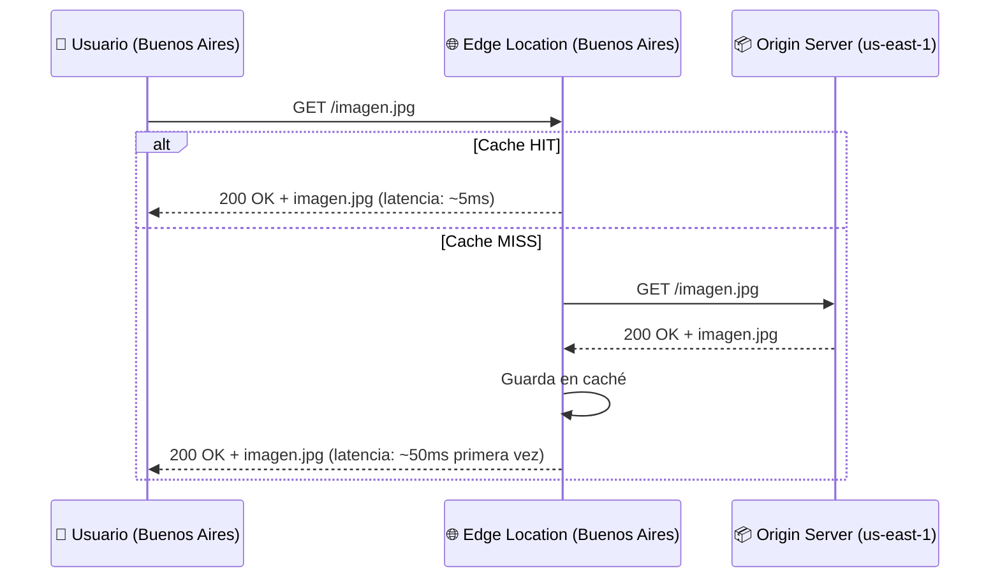

### Edge Locations en Latinoamérica

| Ciudad | País | Tipo |
|--------|------|------|
| Buenos Aires | Argentina | Edge Location |
| São Paulo | Brasil | Edge Location + Regional Edge Cache |
| Santiago | Chile | Edge Location |
| Bogotá | Colombia | Edge Location |
| Ciudad de México | México | Edge Location + Regional Edge Cache |
| Lima | Perú | Edge Location |
| Quito | Ecuador | Edge Location |

### Regional Edge Caches

Las **Regional Edge Caches** son ubicaciones intermedias entre Edge Locations y los orígenes. Tienen más capacidad de caché que las Edge Locations normales.

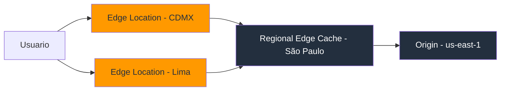

| Regional Edge Cache | Región | Cobertura |
|---------------------|--------|-----------|
| São Paulo | sa-east-1 | Sudamérica |
| Virginia | us-east-1 | Este de Norteamérica |
| Ohio | us-east-2 | Centro de Norteamérica |
| Oregon | us-west-2 | Oeste de Norteamérica |
| Londres | eu-west-2 | Europa occidental |
| Tokio | ap-northeast-1 | Asia-Pacífico |
| Singapur | ap-southeast-1 | Sudeste asiático |
| Sídney | ap-southeast-2 | Oceanía |

### Casos de uso de Edge Locations

| Caso de uso | Servicio | Beneficio |
|-------------|----------|-----------|
| Sitio web estático | CloudFront | Latencia < 50ms global |
| Streaming de video | CloudFront + MediaPackage | Entrega de baja latencia |
| Resolución DNS | Route 53 | DNS global de baja latencia |
| API Gateway | API Gateway + CloudFront | Aceleración de APIs |
| Actualizaciones de apps móviles | CloudFront | Descargas rápidas de binarios |
| IoT data ingestion | IoT Core + Edge | Procesamiento local |

### Ejemplo: Configurar CloudFront

```bash
# Crear una distribución de CloudFront
aws cloudfront create-distribution \
    --distribution-config '{
        "CallerReference": "mi-sitio-2026",
        "Origins": {
            "Quantity": 1,
            "Items": [
                {
                    "Id": "mi-origin-s3",
                    "DomainName": "mi-bucket-statisctico.s3.amazonaws.com",
                    "S3OriginConfig": {
                        "OriginAccessIdentity": ""
                    }
                }
            ]
        },
        "DefaultCacheBehavior": {
            "TargetOriginId": "mi-origin-s3",
            "ViewerProtocolPolicy": "redirect-to-https",
            "AllowedMethods": {
                "Quantity": 2,
                "Items": ["GET", "HEAD"]
            },
            "ForwardedValues": {
                "QueryString": false,
                "Cookies": {
                    "Forward": "none"
                }
            },
            "MinTTL": 0,
            "DefaultTTL": 86400,
            "MaxTTL": 31536000,
            "Compress": true
        },
        "Enabled": true,
        "Comment": "Distribucion para mi-sitio.com",
        "PriceClass": "PriceClass_All"
    }'
```

---

## AWS Local Zones

Las **Local Zones** son una extensión de una región de AWS que colocan computación, storage, databases y otros servicios selectos más cerca de centros de población grandes, industrias y centros de IT.

### Características principales

| Característica | Detalle |
|----------------|---------|
| **Propósito** | Baja latencia (< 10ms) para aplicaciones que requieren respuesta en tiempo real |
| **Conectividad** | Conectadas a la región padre mediante red privada de alta velocidad |
| **Servicios disponibles** | EC2, EBS, VPC, ELB, ECS (selección de servicios) |
| **Diferencia con AZ** | Las Local Zones son parte de una región pero más cercanas a usuarios específicos |

### Local Zones disponibles

| Local Zone | Región Padre | Ubicación |
|------------|-------------|-----------|
| us-east-1-atl-1 | us-east-1 | Atlanta, GA |
| us-east-1-bos-1 | us-east-1 | Boston, MA |
| us-east-1-chi-1 | us-east-1 | Chicago, IL |
| us-east-1-dfw-1 | us-east-1 | Dallas, TX |
| us-east-1-mia-1 | us-east-1 | Miami, FL |
| us-east-1-nyc-1 | us-east-1 | Nueva York, NY |
| us-west-2-lax-1 | us-west-2 | Los Ángeles, CA |
| us-west-2-phx-1 | us-west-2 | Phoenix, AZ |
| eu-west-1-amsterdam-1 | eu-west-1 | Ámsterdam |
| eu-central-1-berlin-1 | eu-central-1 | Berlín |
| ap-northeast-2-osaka-1 | ap-northeast-2 | Osaka |
| ap-southeast-1-manila-1 | ap-southeast-1 | Manila |

### Casos de uso

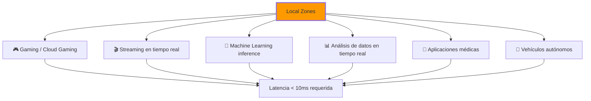

### Local Zones vs AZs

| Aspecto | Local Zone | AZ |
|---------|------------|-----|
| **Propósito** | Baja latencia para usuarios específicos | Alta disponibilidad |
| **Servicios** | Seleccionados (EC2, EBS, VPC) | Completos |
| **Conexión a región** | Red dedicada de baja latencia | Red regional de alta velocidad |
| **Uso típico** | Apps de baja latencia, edge computing | Apps de producción multi-AZ |
| **Disponibilidad** | Regiones específicas | Todas las regiones |

### Ejemplo: Usar Local Zones

```bash
# Listar Local Zones disponibles
aws ec2 describe-availability-zones \
    --filters "Name=opt-in-status,Values=opted-in" \
    --query 'AvailabilityZones[*].{Zone:ZoneName,Region:RegionName,Type:ZoneType}'

# Crear subred en una Local Zone
aws ec2 create-subnet \
    --vpc-id vpc-0123456789abcdef0 \
    --cidr-block 10.0.100.0/24 \
    --availability-zone us-east-1-nyc-1a

# Lanzar instancia en Local Zone
aws ec2 run-instances \
    --image-id ami-0c55b159cbfafe1f0 \
    --instance-type t3.micro \
    --subnet-id subnet-local-zone-0123456789abcdef0 \
    --tag-specifications 'ResourceType=instance,Tags=[{Key=Name,Value=LowLatency-Server}]'
```

---

## AWS Wavelength Zones

Las **Wavelength Zones** integran recursos de computación y storage de AWS dentro de las redes de telecomunicaciones de los proveedores de 5G, proporcionando latencia de un dígito en milisegundos a los dispositivos móviles.

### Características principales

| Característica | Detalle |
|----------------|---------|
| **Propósito** | Latencia ultra-baja para aplicaciones móviles y edge computing 5G |
| **Tecnología** | Integración con redes de telecomunicaciones 5G |
| **Latencia** | < 10ms (single-digit millisecond) |
| **Servicios** | EC2, EBS, VPC, ECS, EKS |
| **Proveedores de telecom** | Verizon, KDDI, SK Telecom, Vodafone |

### Diagrama de Wavelength

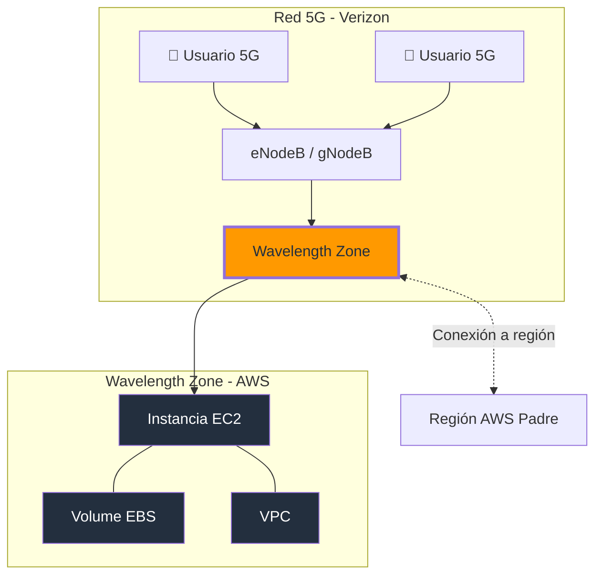

### Casos de uso de Wavelength

| Caso de uso | Descripción |
|-------------|-------------|
| **Cloud gaming** | Renderizado en la nube, streaming directo al móvil |
| **AR/VR** | Realidad aumentada y virtual en tiempo real |
| **IoT industrial** | Monitoreo y control de dispositivos en fábricas |
| **Vehículos autónomos** | Procesamiento de datos de sensores en tiempo real |
| **Telemedicina** | Transmisión de video médico de baja latencia |
| **CDN edge** | Entrega de contenido optimizada para dispositivos móviles |

### Wavelength vs Local Zones vs Edge Locations

| Aspecto | Wavelength Zone | Local Zone | Edge Location |
|---------|-----------------|------------|---------------|
| **Latencia** | < 10ms | < 10ms | < 50ms |
| **Conectividad** | Redes 5G | Red dedicada a región | Internet público |
| **Servicios** | EC2, EBS, VPC | EC2, EBS, VPC, ELB | CloudFront, Route 53 |
| **Uso** | Apps móviles 5G | Apps tiempo real | CDN, DNS |
| **Disponibilidad** | Muy limitada | Limitada | Global |

---

## AWS Outposts

**AWS Outposts** es un servicio completamente gestionado que extiende la infraestructura y los servicios de AWS a prácticamente cualquier data center, espacio de co-localización o instalación on-premise, con el mismo hardware, APIs y herramientas que en la nube de AWS.

### Características principales

| Característica | Detalle |
|----------------|---------|
| **Propósito** | Ejecutar servicios de AWS en tu propio data center (on-premise) |
| **Hardware** | Servidores físicos de AWS instalados en tu instalación |
| **Conectividad** | Requiere conexión continua a una región AWS |
| **Gestión** | AWS gestiona, monitorea y actualiza el hardware |
| **Servicios locales** | EC2, EBS, ECS, EKS, RDS, ElastiCache, EMR |
| **Formatos** | Outposts Rack (42U) o Outposts Server (1U/2U) |

### Diagrama de Outposts

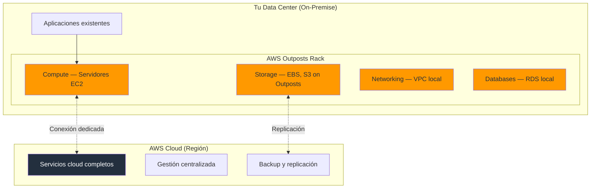

### Cuándo usar Outposts

| Escenario | Beneficio de Outposts |
|-----------|----------------------|
| **Latencia ultra-baja** | < 1ms para aplicaciones en tiempo real |
| **Procesamiento local de datos** | Datos que no pueden salir de la instalación |
| **Residencia de datos** | Regulaciones que requieren datos on-premise |
| **Integración con legacy** | Conectar con sistemas existentes sin migrar |
| **Edge computing** | Procesamiento en fábricas, hospitales, tiendas |

### Outposts Rack vs Outposts Server

| Aspecto | Outposts Rack | Outposts Server |
|---------|---------------|-----------------|
| **Tamaño** | Rack completo (42U) | 1U o 2U |
| **Capacidad** | Miles de vCPUs | 32-64 vCPUs |
| **Servicios** | EC2, EBS, S3, ECS, EKS, RDS, ElastiCache | EC2, EBS |
| **Uso** | Data centers grandes, campus | Tiendas, oficinas pequeñas |
| **Instalación** | Requiere espacio dedicado | Rack estándar de servidor |

### Ejemplo: Gestionar Outposts

```bash
# Listar Outposts en tu cuenta
aws outposts list-outposts \
    --query 'Outposts[*].{ID:OutpostId,Name:Name,Status:LifeCycleStatus}'

# Listar instancias EC2 en Outposts
aws ec2 describe-instances \
    --filters "Name=availability-zone,Values=us-east-1a-outpost-abc123" \
    --query 'Reservations[*].Instances[*].{ID:InstanceId,Type:InstanceType,State:State.Name}'

# Crear volumen EBS en Outposts
aws ec2 create-volume \
    --outpost-arn arn:aws:outposts:us-east-1:ACCOUNT:outpost/op-abc123 \
    --availability-zone us-east-1a-outpost-abc123 \
    --volume-type gp3 \
    --size 100 \
    --tag-specifications 'ResourceType=volume,Tags=[{Key=Name,Value=OutpostVolume}]'
```

---

## Estrategia de Selección de Región

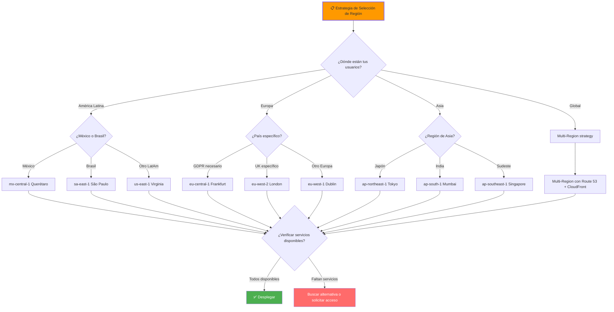

### Tabla de decisión de región

| Escenario | Región Recomendada | Razón |
|-----------|-------------------|-------|
| Startup global sin requisitos | us-east-1 | Menor costo, máximo servicios |
| Usuarios en México | mx-central-1 | Baja latencia, cumplimiento local |
| Usuarios en Brasil | sa-east-1 | Baja latencia, residencia de datos |
| GDPR requerido (Europa) | eu-central-1 | Cumplimiento GDPR, buena cobertura |
| App con usuarios globales | Multi-Region + CloudFront | Baja latencia worldwide |
| IA/ML (Bedrock, SageMaker) | us-east-1, us-west-2 | Mayor disponibilidad de modelos |
| Streaming de video | Regional con Edge Locations | CloudFront + MediaPackage |
| Latencia < 10ms requerida | Local Zone cercana | Extensión de región |
| Datos no pueden salir del país | Outposts on-premise | AWS en tu data center |

---

## Compliance y Residencia de Datos

### Regulaciones importantes

| Regulación | Región aplicable | Requisito principal |
|------------|------------------|---------------------|
| **GDPR** (Europa) | eu-* | Datos de ciudadanos UE deben permanecer en la UE o tener transferencia adequada |
| **CCPA** (California) | Cualquier región | Derechos de privacidad de datos personales |
| **LGPD** (Brasil) | sa-east-1 | Residencia de datos personales en Brasil |
| **PDPA** (Singapur) | ap-southeast-1 | Protección de datos personales |
| **PIPEDA** (Canadá) | ca-central-1 | Protección de información personal |
| **HIPAA** (EE.UU.) | Cualquier región | Datos de salud con BAA |

### Cómo AWS ayuda con compliance

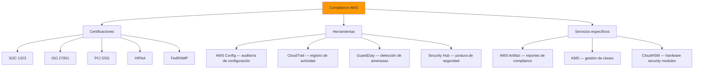

---

## Consideraciones de Latencia

### Latencia típica entre regiones

| Origen | Destino | Latencia estimada |
|--------|---------|-------------------|
| us-east-1 (Virginia) | eu-west-1 (Irlanda) | 70-90ms |
| us-east-1 (Virginia) | ap-northeast-1 (Tokio) | 150-180ms |
| us-east-1 (Virginia) | sa-east-1 (São Paulo) | 100-130ms |
| eu-west-1 (Irlanda) | ap-southeast-1 (Singapur) | 160-190ms |
| sa-east-1 (São Paulo) | eu-west-1 (Irlanda) | 180-210ms |
| us-east-1 (Virginia) | mx-central-1 (Querétaro) | 40-60ms |
| AZ-1a | AZ-1b (misma región) | < 2ms |

### Estrategias para reducir latencia

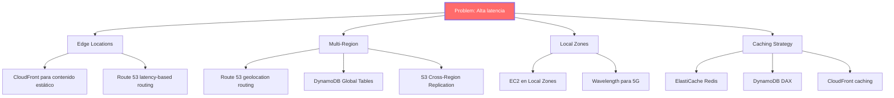

### Route 53: Enrutamiento basado en latencia

```bash
# Crear hosted zone
aws route53 create-hosted-zone \
    --name mi-dominio.com \
    --caller-reference $(date +%s)

# Crear registro con enrutamiento basado en latencia
aws route53 change-resource-record-sets \
    --hosted-zone-id Z1234567890 \
    --change-batch '{
        "Changes": [{
            "Action": "CREATE",
            "ResourceRecordSet": {
                "Name": "api.mi-dominio.com",
                "Type": "A",
                "SetIdentifier": "us-east-1",
                "Region": "us-east-1",
                "AliasTarget": {
                    "HostedZoneId": "Z35SXDOTRQ7X7K",
                    "DNSName": "dualstack.mialb-123456.us-east-1.elb.amazonaws.com",
                    "EvaluateTargetHealth": true
                }
            }
        }]
    }'
```

---

## Preguntas Frecuentes (FAQ)

### ¿Cuál es la diferencia entre una Región y una Availability Zone?

Una **Región** es una ubicación geográfica amplia (ej. us-east-1 en Virginia). Una **Availability Zone** es un data center o grupo de data centers dentro de esa región (ej. us-east-1a). Cada región tiene múltiples AZs para alta disponibilidad. Si un AZ falla, las aplicaciones en otros AZs de la misma región siguen funcionando.

### ¿Puedo mover datos entre regiones?

Sí, pero con consideraciones. AWS ofrece servicios como **S3 Cross-Region Replication**, **DynamoDB Global Tables**, y **Data Migration Service**. Sin embargo, la transferencia de datos entre regiones tiene un costo (data transfer pricing) y debes considerar latencia y compliance.

### ¿Todas las regiones tienen el mismo número de AZs?

No. Algunas regiones tienen 2 AZs (como ap-southeast-1) y otras hasta 6 (como us-east-1). Para alta disponibilidad, AWS recomienda al menos 2 AZs por aplicación en producción.

### ¿Qué son las Edge Locations y cuándo las necesito?

Las **Edge Locations** son centros de distribución de contenido (CDN) de AWS. Las necesitas cuando quieres entregar contenido estático (imágenes, CSS, JS, video) con la menor latencia posible a usuarios en cualquier parte del mundo. Se usan con **CloudFront**.

### ¿Cuándo debo usar Local Zones vs AZs?

Usa **AZs** para alta disponibilidad (Multi-AZ). Usa **Local Zones** cuando necesites latencia < 10ms para usuarios específicos que están lejos de la región padre (ej. usuarios en LA que necesitan latencia baja y la región más cercana es Oregon).

### ¿AWS Outposts es lo mismo que tener un data center propio?

Casi. Outposts es un rack o servidor de AWS instalado en TU data center. AWS gestiona el hardware y el software, pero está en tu instalación. Es ideal cuando necesitas los servicios de AWS pero con restricciones de residencia de datos o latencia ultra-baja.

### ¿Cómo afecta la región elegida al costo de mi aplicación?

Los precios varían significativamente entre regiones. Por ejemplo, un EC2 t2.micro cuesta $0.0116/h en us-east-1 pero $0.0185/h en sa-east-1 (60% más). Para optimizar costos, considera: (1) servicios en us-east-1 cuando no haya restricciones, (2) Reserved Instances, (3) Right-sizing, y (4) S3 Lifecycle policies.

### ¿Puedo usar servicios de AWS en regiones donde no están disponibles?

No directamente. Si un servicio no está disponible en tu región, debes elegir otra región, solicitar acceso anticipado, o usar alternativas. Por ejemplo, Bedrock (IA generativa) solo está disponible en unas pocas regiones seleccionadas.

---

## Tips para Entrevistas Técnicas

### Pregunta: "¿Cómo diseñarías una arquitectura altamente disponible en AWS?"

**Respuesta sugerida:**
> "Diseñaría usando Multi-AZ como base: load balancer distribuyendo tráfico entre al menos 2 AZs, Auto Scaling Groups que abarcan múltiples AZs, bases de datos RDS con Multi-AZ para failover automático, y ElastiCache para reducir carga. Para disaster recovery a nivel global, usaría Route 53 con latency-based routing y DynamoDB Global Tables para replicación entre regiones. Todo definido con CloudFormation para que sea reproducible."

### Pregunta: "¿Qué factores considerarías al elegir una región de AWS?"

**Respuesta sugerida:**
> "Primero, la latencia para los usuarios principales. Segundo, los requisitos de compliance — si GDPR, los datos deben estar en Europa. Tercero, la disponibilidad de servicios necesarios, ya que no todos los servicios existen en todas las regiones. Cuarto, los costos, que varían significativamente entre regiones. Y quinto, el número de AZs disponibles, ya que más AZs significan mayor resiliencia potencial."

### Pregunta: "Explica la diferencia entre Multi-AZ y Multi-Region"

**Respuesta sugerida:**
> "Multi-AZ usa múltiples data centers dentro de la misma región para alta disponibilidad — si un AZ falla, la aplicación sigue en otros AZs con latencia < 2ms. Multi-Region distribuye la aplicación entre diferentes regiones geográficas para disaster recovery y baja latencia global. Multi-AZ protege contra fallos de data center; Multi-Region protege contra fallos de región completa. Multi-AZ es un patrón de arquitectura; Multi-Region es una estrategia de negocio."

### Pregunta: "¿Qué es una Edge Location y cómo se diferencia de una AZ?"

**Respuesta sugerida:**
> "Una Edge Location es un punto de presencia de CloudFront para entregar contenido CDN con baja latencia — no ejecuta computación general. Una AZ es un data center completo donde puedes ejecutar EC2, bases de datos y cualquier servicio de AWS. Las Edge Locations están en ciudades alrededor del mundo (600+); las AZs están dentro de las regiones (108+)."

---

## Errores Comunes

| Error | Consecuencia | Cómo evitarlo |
|-------|-------------|---------------|
| **Elegir solo por costo** |us-east-1 es barata pero lejos de usuarios en LatAm | Evalúa latencia + costo juntos |
| **Ignorar compliance** | Multas regulatorias (GDPR: hasta 4% del facturado global) | Verifica requisitos de residencia ANTES de desplegar |
| **No usar Multi-AZ** | Outage si un AZ falla | Siempre despliega en al menos 2 AZs |
| **Asumir que todos los servicios existen** | Servicios como Bedrock no están en todas las regiones | Verifica la disponibilidad antes de diseñar |
| **No monitorear latencia** | Usuarios experimentan lentitud sin saberlo | Usa CloudWatch Synthetics y Route 53 health checks |
| **No planificar disaster recovery** | Pérdida de datos y downtime prolongado | Define RTO/RPO y despliega Multi-Region si es necesario |

---

## Mejores Prácticas

1. **Latencia primero:** Elige la región más cercana a tu audiencia principal como punto de partida.
2. **Multi-AZ siempre en producción:** Nunca despliegues producción con una sola AZ.
3. **CloudFront para contenido estático:** Siempre usa CDN para assets estáticos — reduce latencia y costos.
4. **Compliance como requisito:** Verifica regulaciones ANTES de elegir región — no después.
5. **Monitorea con Route 53:** Health checks y latency-based routing para apps globales.
6. **Tag everything:** Etiqueta todos tus recursos con región, ambiente y proyecto.
7. **Revisa disponibilidad de servicios:** Algunos servicios (Bedrock, SageMaker) solo están en regiones selectas.
8. **Planifica desde el inicio:** Si sabes que necesitarás multi-region, diseña tu app con eso en mente desde el primer día.

---

## Resumen

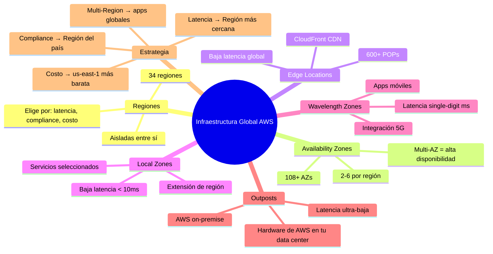

### Puntos clave para recordar

1. **34 regiones**, **108+ AZs**, **600+ Edge Locations** componen la infraestructura global de AWS.
2. **Una Región** = agrupación de data centers en una zona geográfica. **Una AZ** = un data center o grupo de data centers dentro de la región.
3. **Multi-AZ** es para alta disponibilidad (protege contra fallos de data center). **Multi-Region** es para disaster recovery (protege contra fallos de región).
4. **Edge Locations** se usan con CloudFront para entregar contenido estático con latencia mínima.
5. **Local Zones** extienden una región para latencia < 10ms sin necesidad de Multi-Region.
6. **Wavelength Zones** integran AWS con redes 5G para apps móviles de latencia ultra-baja.
7. **Outposts** lleva AWS a tu data center físico — ideal para compliance y latencia ultra-baja.
8. **Al elegir una región**, considera: latencia, compliance, disponibilidad de servicios, costos y número de AZs.
9. **Los costos varían entre regiones** hasta un 60% — siempre compara precios.
10. **Planifica compliance ANTES** de desplegar — mover datos después es caro y complejo.

---

> **Siguiente paso:** [IAM y Seguridad →](/guide/aws/security/iam)
