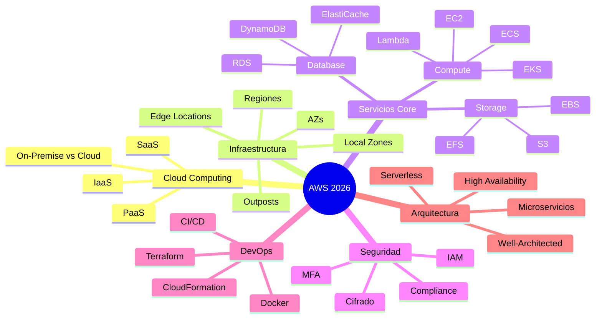

# Introducción a AWS

**Amazon Web Services (`AWS`)** es la plataforma de computación en la nube más completa y adoptada del mundo, ofreciendo más de 200 servicios integrales desde centros de datos distribuidos globalmente. Lanzada en 2006, AWS transformó la manera en que las organizaciones acceden a la tecnología al permitirles **reemplazar los gastos de infraestructura física por costos variables** bajos que se escalan según las necesidades del negocio.

En términos fundamentales, **`AWS`** es un conjunto de servicios de infraestructura y software que las empresas utilizan a través de internet para ejecutar sus aplicaciones y guardar datos **sin necesidad de comprar ni mantener servidores propios**. Los servicios de **`AWS`** están disponibles bajo demanda y se facturan mediante un **modelo de precios de pago por uso**, lo que significa que el cliente solo paga por los recursos específicos que consume durante el tiempo que los utiliza.

La plataforma se caracteriza por varios pilares clave:
*   **Mayor Funcionalidad:** Ofrece una variedad de herramientas mucho más amplia que cualquier otro proveedor, incluyendo desde bases de datos diseñadas para aplicaciones específicas hasta tecnologías de vanguardia como **inteligencia artificial generativa** y aprendizaje automático.
*   **Comunidad y Ecosistema:** Cuenta con millones de clientes activos y decenas de miles de socios globales que ayudan a las empresas a implementar soluciones de forma eficiente.
*   **Seguridad y Fiabilidad:** Está diseñada para satisfacer los requisitos de seguridad de organizaciones de alta sensibilidad, como bancos mundiales y fuerzas armadas, ofreciendo más de **300 servicios y funciones de seguridad**.
*   **Infraestructura Global:** Su red se extiende por decenas de **regiones geográficas y zonas de disponibilidad** en todo el mundo, lo que permite a las empresas reducir la latencia y garantizar la continuidad ante desastres.

Gracias a su madurez y ritmo constante de innovación, **`AWS`** permite a startups, grandes empresas y organismos gubernamentales **aumentar su agilidad y reducir costos**, permitiéndoles centrarse en su negocio principal en lugar del "**trabajo pesado"** de gestionar centros de datos.

## ¿Qué problema resuelve AWS?

El gran cambio es pasar de poseer infraestructura a consumirla bajo demanda. Eso resuelve varios dolores típicos:

- **La inversión inicial deja de ser una barrera**. No hay que adivinar cuánto hardware comprar para los próximos años; se empieza pequeño y se crece según la demanda real.
- **La capacidad se ajusta sola**. Si llega un pico de tráfico —una campaña, un cierre de mes—, los recursos escalan; cuando baja, también baja el gasto.
- **El tiempo de salida al mercado se acorta**. Levantar un entorno nuevo toma minutos en lugar de semanas de compras y configuración.

## Servicios principales de AWS

**`AWS`** ofrece cientos de servicios, pero casi toda solución se arma combinando unos pocos bloques fundamentales:

- **Cómputo**: servidores virtuales bajo demanda y opciones sin servidor que ejecutan código sin administrar máquinas.
- **Almacenamiento**: guardado de archivos y objetos de forma duradera y escalable, ideal para respaldos, contenido y datos de aplicaciones.
- **Bases de datos**: motores gestionados —relacionales y no relacionales— donde **`AWS`** se ocupa de las copias de seguridad, los parches y la alta disponibilidad.
- **Redes y seguridad**: redes privadas, control de acceso, cifrado y conexión segura entre los sistemas de la empresa y la nube.
- **Datos e inteligencia artificial**: servicios para analizar información, construir un data lake y crear soluciones de IA generativa.

## Tabla de Contenidos

### Fundamentos

- [Fundamentos de Cloud Computing](/guide/aws/introduction) — Qué es la nube, modelos de servicio, responsabilidad compartida y el Framework Well-Architected de AWS.

- [Infraestructura Global de AWS](/guide/aws/global-infrastructure) — Regiones, Zonas de Disponibilidad, Edge Locations y cómo diseñar para alta disponibilidad.

### Identidad y Seguridad

- [IAM y Seguridad](/guide/aws/security/iam) — Identity and Access Management, políticas, usuarios, grupos y roles.

### Networking

- [Networking en AWS](/guide/aws/networking/vpc) — VPC, subnets, Security Groups, NACLs y connectivity.

### Computación

- [Amazon EC2](/guide/aws/ec2) — Instancias virtuales, tipos, AMIs, grupos de seguridad y auto scaling.

- [AWS Lambda](/guide/aws/lambda) — Computación serverless, funciones, triggers y patrones de diseño.

- [Amazon ECS](/guide/aws/ecs) — Container orchestration con Docker y Fargate.

- [Amazon EKS](/guide/aws/eks) — Kubernetes gestionado en AWS.

### Almacenamiento

- [Amazon S3](/guide/aws/s3) — Object storage, buckets, políticas de acceso y lifecycle.

- [Amazon EBS](/guide/aws/ebs) — Block storage para EC2, snapshots y tipos de volumen.

- [Amazon EFS](/guide/aws/efs) — Elastic File System para almacenamiento compartido.

### Base de Datos

- [Amazon RDS](/guide/aws/rds) — Relational Database Service, Multi-AZ, read replicas.

- [Amazon DynamoDB](/guide/aws/dynamodb) — Base de datos NoSQL serverless de alta performance.

- [Amazon ElastiCache](/guide/aws/elasticache) — Caching con Redis y Memcached.

### Mensajería e Integración

- [Amazon API Gateway](/guide/aws/api-gateway) — Creación, publicación y gestión de APIs.

- [Amazon SQS](/guide/aws/sqs) — Colas de mensajería para desacoplamiento.

- [Amazon SNS](/guide/aws/sns) — Notificaciones pub/sub.

- [Amazon EventBridge](/guide/aws/eventbridge) — Bus de eventos para integraciones serverless.

### Monitoreo

- [Amazon CloudWatch](/guide/aws/cloudwatch) — Monitoreo, alertas y análisis de métricas.

### DevOps

- [DevOps en AWS](/guide/aws/devops/cloudformation) — CI/CD, CodePipeline, CodeBuild, CloudFormation y Terraform.

### Arquitecturas

- [Arquitecturas de Referencia](/guide/aws/architecture/patterns) — Patrones de arquitectura, microservicios y best practices.

### Referencia

- [Glosario de AWS](/guide/aws/glossary) — Términos y definiciones clave.

## AWS vs Otros Proveedores Cloud

| Característica | AWS | Microsoft Azure | Google Cloud |
|----------------|-----|-----------------|--------------|
| Año de lanzamiento | 2006 | 2010 | 2008 |
| Cuota de mercado | 32% | 23% | 11% |
| Servicios totales | 250+ | 200+ | 100+ |
| Regiones | 34 | 60+ | 40+ |
| Free Tier duración | 12 meses + siempre gratis | 12 meses + siempre gratis | $300 crédito 90 días |
| Mayor fortaleza | Ecosistema completo, madurez | Integración enterprise, .NET | IA/ML, BigQuery, Kubernetes |
| Certificaciones | 15 | 12 | 10 |
| Ecosistema serverless | Lambda (pionero) | Azure Functions | Cloud Functions |
| Kubernetes gestionado | EKS | AKS | GKE |

> **Nota:** AWS sigue siendo el líder indiscutible en cuota de mercado y variedad de servicios. Aprender AWS primero te da la base más sólida, ya que los conceptos son transferibles a otros proveedores.

## Resumen

### Puntos clave para recordar

1. **AWS es el líder del mercado cloud** con 250+ servicios y 34 regiones globales.
2. **Cloud Computing** elimina la inversión en hardware físico y ofrece escalabilidad bajo demanda.
3. **Los 3 modelos de servicio** son IaaS (tú gestionas todo), PaaS (AWS gestiona la plataforma) y SaaS (todo gestionado).
4. **El Shared Responsibility Model** define quién es responsable de qué: AWS cuida "de" la nube, tú cuidas "en" la nube.
5. **El Well-Architected Framework** tiene 6 pilares: excelencia operativa, seguridad, fiabilidad, eficiencia de performance, optimización de costos y sustentabilidad.
6. **Empieza con la Free Tier** pero siempre configura alertas de facturación.
