# Fundamentos de Cloud Computing

## ¿Qué es Cloud Computing?

El **Cloud Computing** (o computación en la nube) es la entrega bajo demanda de servicios de TI a través de internet con un modelo de precios de pago por uso. En lugar de que las empresas tengan que comprar, poseer y mantener sus propios servidores y centros de datos físicos, pueden acceder a potencia de cómputo, almacenamiento, bases de datos y otras tecnologías de forma remota en función de sus necesidades a través de un proveedor de la nube.

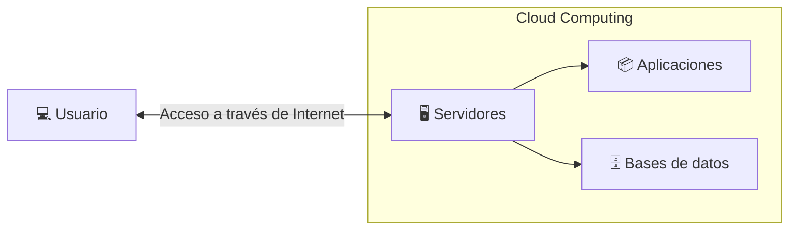

## Ventajas del cloud computing

El **cloud computing** supone un cambio con respecto a la forma tradicional de pensar de las empresas sobre los recursos de TI. Estas son las razones más comunes por las que las organizaciones recurren a la nube.

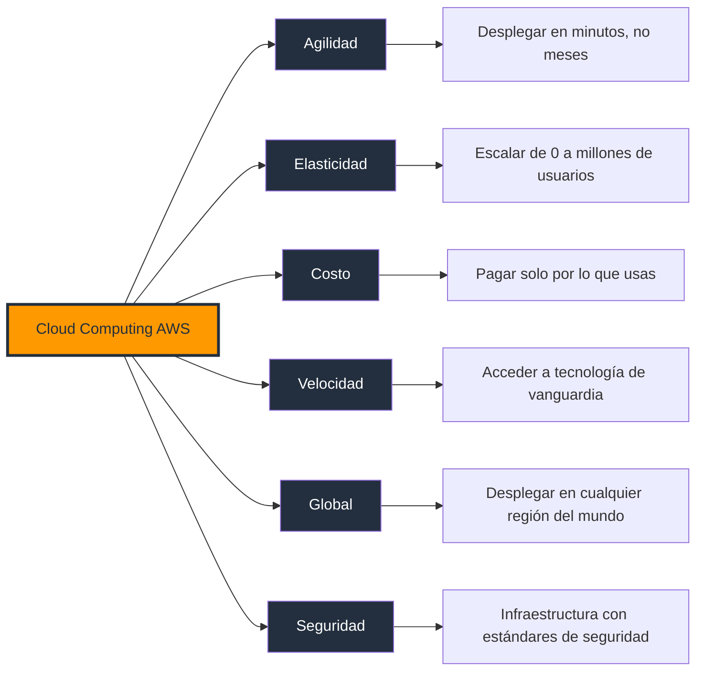

- **Coste**: el cloud computing elimina los gastos de capital y los recursos necesarios para ejecutar y gestionar su propia infraestructura. El precio y el coste del hardware, el software, las utilidades y la gestión in situ de los servidores aumentan rápidamente. 
- **Velocidad**: la mayoría de los servicios de cloud computing son de autoservicio y bajo demanda. Incluso se pueden aprovisionar grandes cantidades de recursos informáticos en cuestión de minutos, normalmente con unos pocos clics, lo que le proporciona una gran flexibilidad y reduce la presión de la planificación de la capacidad.
- **Escala mundial**: los servicios de cloud computing incluyen la capacidad de escala flexible. En la nube, esto significa proporcionar la cantidad adecuada de recursos de TI para sus cargas de trabajo. Por ejemplo, elegir más o menos potencia informática, almacenamiento o ancho de banda justo cuando se necesita y desde la ubicación geográfica adecuada.
- **Productividad**: los centros de datos in situ suelen requerir una configuración de hardware de apilamiento intensivo, parches de software y otras tareas de gestión de TI que requieren mucho tiempo. El cloud computing elimina la necesidad de realizar muchas de estas tareas, lo que permite a los equipos de TI trabajar en objetivos empresariales más importantes.
- **Rendimiento**: los servicios de cloud computing se ejecutan en una red mundial de centros de datos seguros que suelen utilizar un hardware informático de última generación. Esta red global proporciona a los usuarios de su aplicación la latencia de red reducida que esperan. A medida que su base de usuarios cambia geográficamente, su infraestructura de nube también puede hacerlo.
- **Seguridad**: los proveedores de nube pueden ofrecer un amplio conjunto de políticas, tecnologías y controles que refuerzan su estrategia de seguridad general. Estas herramientas protegen sus datos, aplicaciones, aplicaciones empresariales, datos confidenciales, usuarios finales e infraestructura frente a posibles amenazas.
- **Fiabilidad**: los proveedores de servicios en la nube pueden almacenar datos en varios sitios redundantes, lo que le proporciona un acceso fiable a sus recursos en la nube.
- **Movilidad**: el cloud computing ayuda a sus trabajadores ya que pone los recursos a disposición de sus usuarios en cualquier momento y lugar, y en cualquier dispositivo conectado a Internet.
- **Modernización**: los servicios en la nube pueden desempeñar un papel fundamental a la hora de ayudar a su organización a abandonar las engorrosas tecnologías heredadas y adoptar soluciones más innovadoras que automatizan los procesos, optimizan los flujos de trabajo y simplifican las operaciones de TI.

:::info Ejemplo
Antes de que existiera la red eléctrica, cada fábrica necesitaba su propia planta de energía. Si necesitaba más potencia, debía comprar más generadores. Si la planta fallaba, toda la producción se detenía. Era un modelo costoso, difícil de mantener y poco escalable.

Hoy todo es diferente. Simplemente conectas un aparato a un enchufe y pagas únicamente por la electricidad que consumes. No necesitas saber cómo funciona la planta de generación, darle mantenimiento o preocuparte por su capacidad.

**El Cloud Computing funciona exactamente con la misma idea.**

En lugar de comprar y mantener servidores propios, utilizas la infraestructura de un proveedor en la nube y pagas solo por los recursos que realmente utilizas.

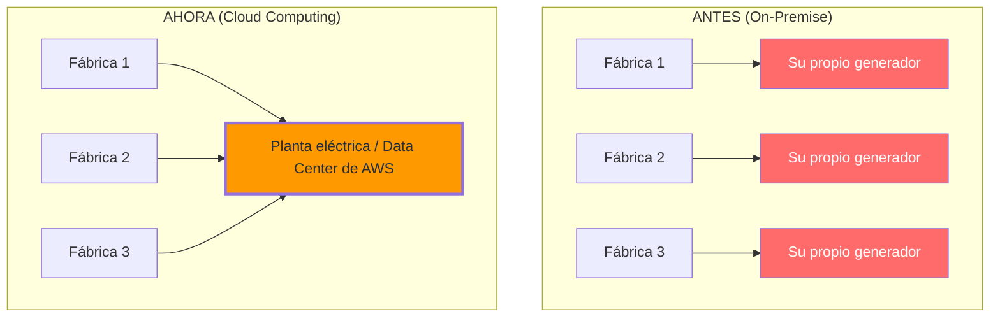

:::

## On-Premise vs Cloud Computing

| Característica | On-Premise | Cloud Computing |
|----------------|------------|-----------------|
| **Costo inicial** | Alto (hardware, data center, licencias) | Bajo (pago por uso) |
| **Escalabilidad** | Limitada (comprar más hardware) | Elástica (escalar en minutos) |
| **Mantenimiento** | Tu equipo lo gestiona todo | AWS gestiona la infraestructura física |
| **Velocidad de despliegue** | Semanas o meses | Minutos o horas |
| **Disponibilidad** | Depende de tu infraestructura | 99.99%+ con múltiples AZs |
| **Seguridad física** | Tu responsabilidad total | AWS gestiona data centers certificados |
| **Actualizaciones** | Tu equipo planifica e implementa | Automáticas e instantáneas |
| **Global reach** | Limitado a tus ubicaciones | 34 regiones globales |
| **Resiliencia** | Single point of failure | Multi-AZ, Multi-Region por diseño |
| **Conformidad (compliance)** | Tu responsabilidad completa | Certificaciones pre-aprobadas (SOC, PCI, HIPAA) |
| **Depreciación de activos** | Hardware se devalúa cada 3-5 años | Sin depreciación — siempre es nuevo |

### Cuándo usar On-Premise

- **Regulaciones estrictas** que requieren datos en ubicaciones específicas (banca, gobierno).
- **Latencia ultra-baja** requerida (< 1ms) para aplicaciones en tiempo real.
- **Legado (legacy)** que no puede ser migrado fácilmente.
- **Control total** sobre hardware y software (high-performance computing).

### Cuándo usar Cloud

- **Startups** que necesitan minimizar costos iniciales.
- **Aplicaciones con tráfico variable** (Black Friday, eventos virales).
- **Proyectos con tiempo limitado** de desarrollo.
- **Trabajo remoto** y colaboración distribuida.
- **Experimentación rápida** y proof of concepts.

## Modelos de Despliegue Cloud

Los modelos en la nube definen el tipo de implementación de recursos en la nube. Los tres principales modelos en la nube son: privados, públicos e híbridos.

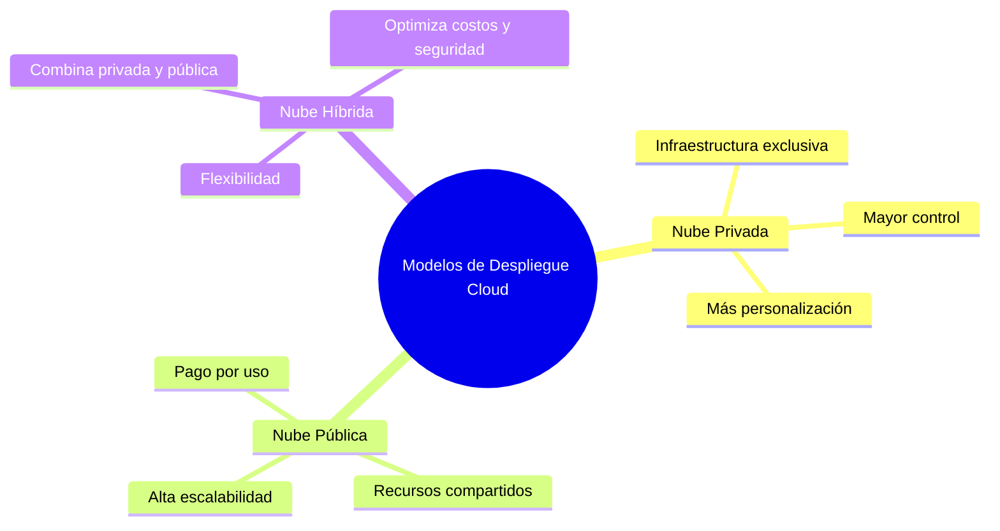

### Nube Pública

Es un tipo de cloud computing en el que un proveedor de servicios en la nube pone a disposición de los usuarios recursos de computación a través de Internet público. Entre ellos se incluyen aplicaciones SaaS, máquinas virtuales (VM) individuales, hardware de computación, infraestructuras completas de nivel empresarial y plataformas de desarrollo. Estos recursos pueden ser gratuitos o estar sujetos a modelos de suscripción o pago por uso.

El proveedor de servicios en la nube pública posee, gestiona y asume toda la responsabilidad de los centros de datos, el hardware y la infraestructura en los que se ejecutan las cargas de trabajo de sus clientes. Por lo general, proporciona conectividad de red de gran ancho de banda para ayudar a garantizar un alto rendimiento y un acceso rápido a las aplicaciones y los datos.

La nube pública es un entorno multiusuario en el que todos los clientes agrupan y comparten la infraestructura del centro de datos y otros recursos del proveedor de servicios en la nube. En el mundo de los principales proveedores de nube pública, como Amazon Web Services (AWS), Google Cloud, IBM Cloud, Microsoft Azure y Oracle Cloud, estos clientes pueden contarse por millones. 

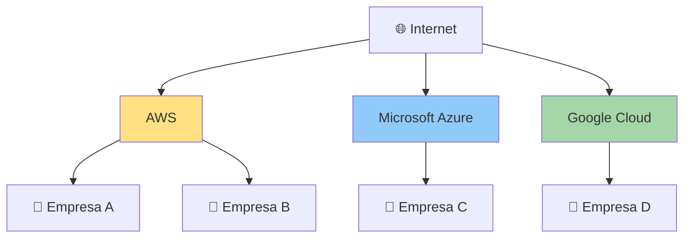
>Muchas empresas utilizan la misma infraestructura física administrada por el proveedor, aunque sus datos permanecen aislados.

- **Ventajas:** Costo bajo, escalabilidad inmediata, sin mantenimiento de hardware.
- **Desventajas:** Menos control sobre infraestructura, compliance limitado.

### Nube Privada

Es un modelo de implementación de cloud computing en el que todos los recursos en la nube se destinan a un solo cliente o usuario a la organización lo que comúnmente se denomina **"on-premise"**. Proporcionan más control, seguridad y gestión de datos, al mismo tiempo que permiten que los usuarios internos se beneficien de un conjunto compartido de recursos de computación, almacenamiento y redes.

La **nube privada** combina muchos beneficios del cloud computing (incluidas la elasticidad, la escalabilidad y la facilidad de prestación de servicios) con el control de acceso, la seguridad y la personalización de recursos de la infraestructura local.

Una nube privada suele alojarse en las instalaciones del centro de datos del cliente. Sin embargo, también puede alojarse en la infraestructura de un proveedor de servicios en la nube independiente o crearse en una infraestructura alquilada alojada en un centro de datos externo.

Muchas empresas eligen una nube privada en lugar de un entorno de nube pública para cumplir con los requisitos de cumplimiento normativo. Las entidades a gran escala, como las agencias gubernamentales, las organizaciones sanitarias y las instituciones financieras, a menudo optan por configuraciones de nube privada para cargas de trabajo que manejan documentos confidenciales, información de identificación personal, propiedad intelectual, historiales médicos, datos financieros u otros datos sensibles.

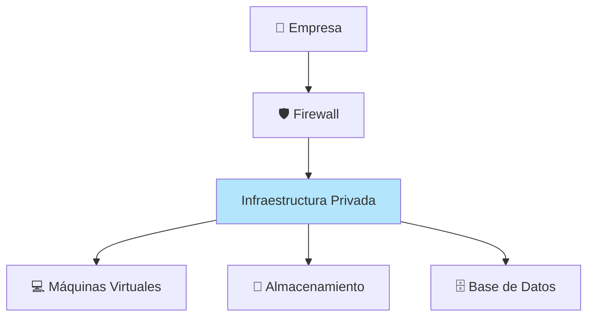

>Toda la infraestructura pertenece a una sola empresa, ofreciendo mayor control y seguridad.

- **Ventajas:** Control total, cumplimiento normativo, personalización profunda.
- **Desventajas:** Costo alto, requiere equipo de TI dedicado.

### Nube Híbrida

Es un entorno informático mixto donde las aplicaciones se ejecutan mediante una combinación de servicios de computación, almacenamiento y servicios en distintos entornos, como nubes públicas y nubes privadas, incluidos los centros de datos on‐premise, ubicaciones externas o independientes. Los enfoques de cloud computing híbrido están muy extendidos, ya que hoy en día casi nadie depende únicamente de una nube pública.

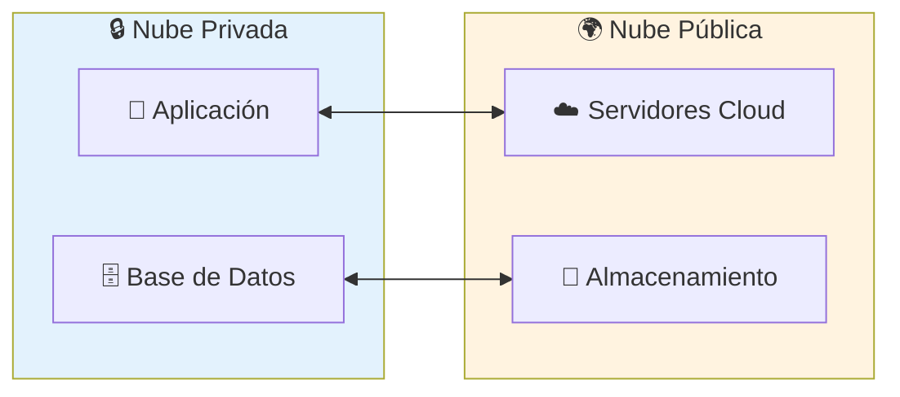

>La empresa mantiene los datos sensibles en su infraestructura privada y utiliza la nube pública para ampliar capacidad o ejecutar cargas de trabajo.

- **Ventajas:** Flexibilidad, optimización de costos, migración gradual.
- **Desventajas:** Complejidad de integración, requisitos de conectividad.

En la tabla siguiente se resaltan algunos aspectos comparativos clave entre los modelos de nube.

| Nube pública | Nube privada | Nube híbrida |
|--------------|--------------|--------------|
| No hay gastos de capital para escalar verticalmente. | Tiene control total sobre los recursos y la seguridad. | Proporciona la máxima flexibilidad. |
| Las aplicaciones pueden aprovisionarse y desaprovisionarse rápidamente. | Los datos no se intercalan con los datos de otros inquilinos. | Determina dónde ejecutar las aplicaciones. |
| Solo pagas por lo que usas. | Debe adquirirse hardware para la puesta en funcionamiento y el mantenimiento. | Tú controlas los requisitos de seguridad, cumplimiento o legales. |
| No tienes control total sobre los recursos y la seguridad. | Eres responsable del mantenimiento y las actualizaciones del hardware. | Combina los beneficios de la nube pública y privada según las necesidades del negocio. |

### Multi-nube (Multi-cloud)

Aunque no es un modelo de implementación física, el enfoque multi-nube implica utilizar múltiples proveedores de nube pública (por ejemplo, AWS y Azure a la vez) para evitar la dependencia de un solo proveedor o para aprovechar las fortalezas específicas de cada uno

## Modelos de Servicio Cloud

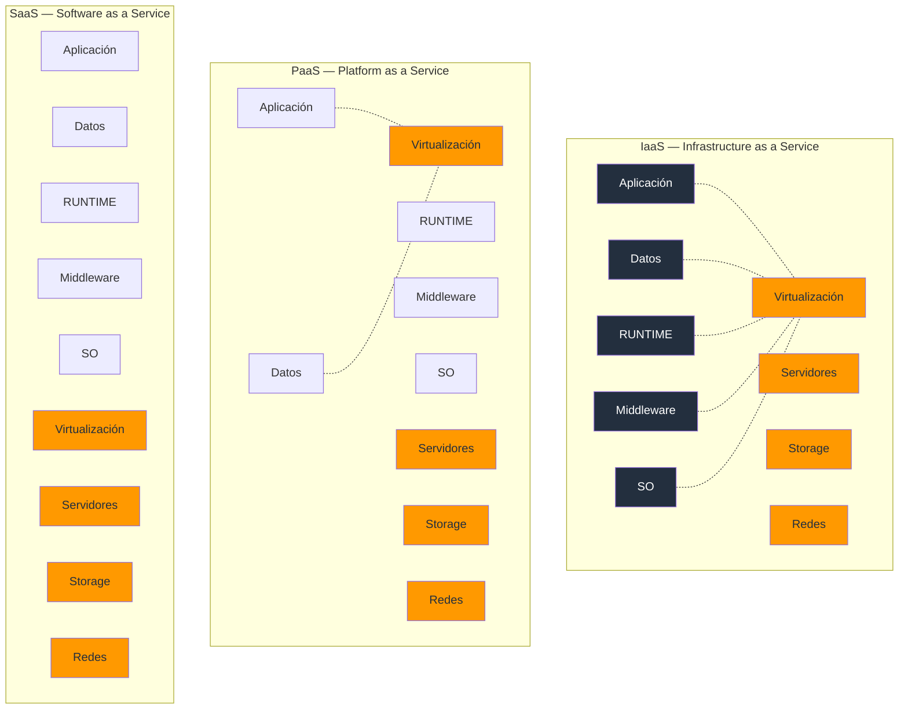

### IaaS — Infrastructure as a Service

**Qué es:** AWS te proporciona la infraestructura virtual (servidores, almacenamiento, redes) y tú gestionas el resto (SO, middleware, aplicaciones, datos).

| Característica | Descripción |
|----------------|-------------|
| **Tú gestionas** | SO, middleware, runtime, aplicaciones, datos |
| **AWS gestiona** | Hardware físico, virtualización, redes, data center |
| **Ejemplos AWS** | EC2, EBS, VPC, S3 |
| **Analogía** | Alquilar un terreno — tú construyes todo |

```bash
# Ejemplo: Crear una instancia EC2 (IaaS)
aws ec2 run-instances \
    --image-id ami-0c55b159cbfafe1f0 \
    --instance-type t2.micro \
    --key-name mi-key-pair \
    --security-group-ids sg-0123456789abcdef0 \
    --subnet-id subnet-0123456789abcdef0 \
    --tag-specifications 'ResourceType=instance,Tags=[{Key=Name,Value=MiServidor}]'
```

### PaaS — Platform as a Service

**Qué es:** AWS te proporciona la infraestructura Y la plataforma de ejecución. Tú solo te enfocas en tu código y datos.

| Característica | Descripción |
|----------------|-------------|
| **Tú gestionas** | Tu código, tus datos |
| **AWS gestura** | Hardware, SO, runtime, middleware, escalado |
| **Ejemplos AWS** | Elastic Beanstalk, RDS, Lambda, App Runner |
| **Analogía** | Alquilar un apartamento amueblado — solo traes tus cosas |

```bash
# Ejemplo: Desplegar con Elastic Beanstalk (PaaS)
eb init mi-app --platform node.js --region us-east-1
eb create mi-app-env
eb open
```

### SaaS — Software as a Service

**Qué es:** Software listo para usar a través de internet. No instalas, no gestionas, solo usas.

| Característica | Descripción |
|----------------|-------------|
| **Tú gestionas** | Solo tus datos y configuración |
| **AWS gestura** | Todo: infraestructura, aplicación, actualizaciones |
| **Ejemplos AWS** | Amazon WorkMail, Chime, QuickSight |
| **Analogía** | Netflix — solo abres la app y la usas |

### Comparación completa

| Aspecto | IaaS | PaaS | SaaS |
|---------|------|------|------|
| **Control** | Alto | Medio | Bajo |
| **Complejidad** | Alta | Media | Baja |
| **Escalabilidad** | Manual/Auto | Automática | Transparente |
| **Costo** | Variable | Predictible | Suscripción |
| **Desarrolladores** | Infra/DevOps | Desarrolladores | Usuarios finales |
| **Ejemplo día a día** | EC2 + tu config de Linux | Lambda + tu código | Gmail, Slack |
| **Tiempo de setup** | Horas | Minutos | Instantáneo |
| **Vendor lock-in** | Bajo | Medio | Alto |

## Modelo de Responsabilidad Compartida

El **Shared Responsibility Model** es el pilar fundamental de la seguridad en cloud. Define claramente qué es responsabilidad de AWS y qué es responsabilidad del cliente.

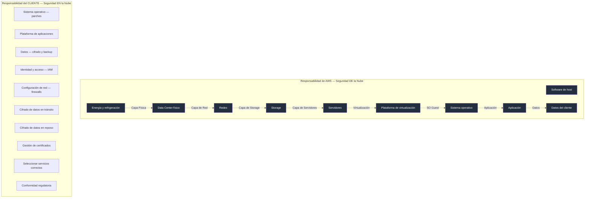

### Responsabilidad de AWS (Seguridad "DE" la Nube)

| Componente | Responsabilidad de AWS |
|------------|----------------------|
| Hardware físico | ✅ Completa |
| Data center | ✅ Completa (acceso biométrico, vigilancia 24/7) |
| Redes físicas | ✅ Completa |
| Servidores y storage | ✅ Completa |
| Hipervisor / virtualización | ✅ Completa |
| Capa de energía y refrigeración | ✅ Completa |

### Responsabilidad del Cliente (Seguridad "EN" la Nube)

| Componente | Responsabilidad del Cliente |
|------------|---------------------------|
| Datos y cifrado | ✅ Completa |
| Gestión de identidades (IAM) | ✅ Completa |
| Configuración de red (SGs, NACLs) | ✅ Completa |
| Parches del SO (si usas EC2) | ✅ Completa |
| Firewall de aplicaciones | ✅ Completa |
| Certificados SSL/TLS | ✅ Completa |
| Selección de servicios | ✅ Completa |
| Compliance regulatorio | ✅ Completa |

### Cómo cambia la responsabilidad según el servicio

| Servicio | AWS se encarga de | Tú te encargas de |
|----------|-------------------|-------------------|
| **EC2 (IaaS)** | Hardware, virtualización, red física | SO, parches, apps, datos, firewall |
| **RDS (PaaS)** | Hardware, SO, parches DB, backups automáticos | Datos, esquema, acceso IAM, cifrado |
| **Lambda (Serverless)** | Todo hasta el código | Tu código, permisos, configuración de triggers |
| **S3 (Managed)** | Hardware, redundancia, disponibilidad | Datos, políticas de acceso, cifrado, lifecycle |
| **SaaS (ej. WorkMail)** | Todo | Solo tus datos y configuración |

### Ejemplo práctico

```bash
# TÚ eres responsable de: configurar cifrado en S3
aws s3api put-bucket-encryption \
    --bucket mi-bucket-seguro \
    --server-side-encryption-configuration '{
        "Rules": [{
            "ApplyServerSideEncryptionByDefault": {
                "SSEAlgorithm": "aws:kms",
                "KMSMasterKeyID": "alias/mi-key"
            }
        }]
    }'

# AWS se encarga de: mantener la infraestructura del bucket
# - Replicación geográfica
# - Durabilidad 99.999999999% (11 9s)
# - Hardware y data center
```

---

## AWS Well-Architected Framework

El **Well-Architected Framework** es un conjunto de principios y mejores prácticas diseñados por AWS para ayudar a los arquitectos a construir infraestructura segura, de alto rendimiento, resiliente y eficiente.

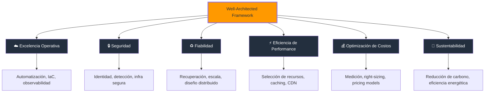

### Pilar 1: Excelencia Operativa

> *"Ejecutar y monitorear tus sistemas para entregar valor de negocio y mejorar continuamente los procesos y procedimientos."*

**Principios clave:**
- Implementar prácticas de operaciones como código (IaC).
- Automatizar cambios con CI/CD pipelines.
- Usar Infrastructure as Code (CloudFormation, Terraform).
- Medir la salud de la operación con métricas y alarmas.

**Servicios relevantes:**

| Servicio | Propósito |
|----------|-----------|
| CloudFormation | Infrastructure as Code |
| AWS Systems Manager | Gestión y automatización operativa |
| CloudWatch | Monitoreo y observabilidad |
| AWS Config | Evaluación de configuración |
| AWS Organizations | Gobernanza multi-cuenta |

**Ejemplo de Infrastructure as Code:**

```yaml
# cloudformation-template.yaml
AWSTemplateFormatVersion: '2010-09-09'
Description: 'Servidor web básico con excelencia operativa'

Resources:
  MiServidorWeb:
    Type: 'AWS::EC2::Instance'
    Properties:
      InstanceType: 't2.micro'
      ImageId: 'ami-0c55b159cbfafe1f0'
      Tags:
        - Key: Name
          Value: WebServer
        - Key: Environment
          Value: Production
        - Key: ManagedBy
          Value: CloudFormation

  MiAlarmaCPU:
    Type: 'AWS::CloudWatch::Alarm'
    Properties:
      AlarmName: HighCPUAlarm
      MetricName: CPUUtilization
      Namespace: AWS/EC2
      Statistic: Average
      Period: 300
      EvaluationPeriods: 2
      Threshold: 80
      ComparisonOperator: GreaterThanThreshold
      Dimensions:
        - Name: InstanceId
          Value: !Ref MiServidorWeb
```

### Pilar 2: Seguridad

> *"Proteger la información, los sistemas y los activos que generan valor利用 los controles de seguridad."*

**Principios clave:**
- Aplicar el principio de mínimo privilegio (least privilege).
- Implementar detección de amenazas y auditoría.
- Cifrar datos en tránsito y en reposo.
- Automatizar las mejores prácticas de seguridad.

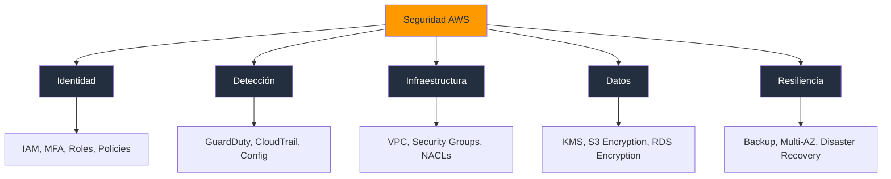

### Pilar 3: Fiabilidad (Reliability)

> *"La capacidad de un sistema para recuperarse de interrupciones de servicio y satisfacer la demanda."*

**Principios clave:**
- Recuperarse automáticamente de fallos (auto-healing).
- Diseñar para la tolerancia a fallos.
- Adaptarse a cambios en la demanda.
- Medir la disponibilidad (SLA/SLO).

**Métricas de fiabilidad:**

| Métrica | Descripción | AWS SLA típico |
|---------|-------------|----------------|
| Disponibilidad | % de tiempo que el servicio está operativo | 99.9% - 99.99% |
| Durabilidad | Probabilidad de no perder datos | 99.999999999% (S3) |
| Latencia | Tiempo de respuesta del servicio | Variable |
| Throughput | Capacidad de procesar solicitudes | Variable |
| Error Rate | % de solicitudes fallidas | < 0.1% |

**Estrategias de alta disponibilidad:**

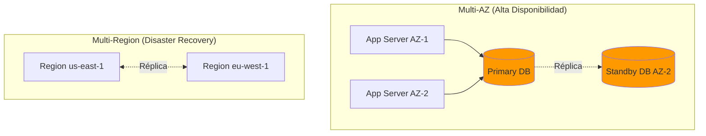

### Pilar 4: Eficiencia de Performance

> *"Usar recursos informáticos de manera eficiente para satisfacer los requisitos del sistema."*

**Principios clave:**
- Seleccionar el tipo y tamaño de recurso adecuado (right-sizing).
- Usar servicios managed cuando sea posible.
- Implementar caching y CDN.
- Medir el rendimiento y ajustar.

**Servicios de performance:**

| Servicio | Uso | Beneficio |
|----------|-----|-----------|
| CloudFront | CDN global | Latencia baja, caching |
| ElastiCache | Caching en memoria | Reducción de carga en DB |
| Auto Scaling | Escalado automático | Right-sizing dinámico |
| S3 Transfer Acceleration | Upload/download rápido | Transferencia global |
| DynamoDB DAX | Caching de DynamoDB | Microsegundos de latencia |

### Pilar 5: Optimización de Costos

> *"La capacidad de ejecutar sistemas que generen valor de negocio a un costo mínimo."*

**Principios clave:**
- Medir y monitorear costos continuamente.
- Implementar estrategias de pricing (Reserved, Spot, Savings Plans).
- Right-sizing de instancias.
- Eliminar recursos no utilizados.

**Estrategias de ahorro:**

| Estrategia | Ahorro | Dificultad | Ejemplo |
|------------|--------|------------|---------|
| Right-sizing | 30-60% | Baja | Cambiar m5.xlarge → t3.large |
| Reserved Instances | 30-75% | Media | Compromiso 1-3 años |
| Spot Instances | 60-90% | Alta | EC2 Spot, batch jobs |
| Savings Plans | 30-72% | Media | Compromiso de uso flexible |
| S3 Lifecycle | 40-70% | Baja | Mover a Glacier después de 90 días |
| Eliminar recursos | 100% del gasto | Baja | Detener EC2 sin usar |

```bash
# Ejemplo: Detener una instancia para ahorrar dinero
aws ec2 stop-instances --instance-ids i-0123456789abcdef0

# Ejemplo: Eliminar un volumen EBS no utilizado
aws ec2 delete-volume --volume-id vol-0123456789abcdef0

# Ejemplo: Ver el costo estimado de una instancia
aws pricing get-products \
    --service-code AmazonEC2 \
    --filters "InstanceType=t2.micro" "Location=US East (N. Virginia)" \
    --region us-east-1
```

### Pilar 6: Sustentabilidad

> *"Minimizar el impacto ambiental de las cargas de trabajo en la nube."*

**Principios clave:**
- Entender el impacto de las decisiones de diseño en la sustentabilidad.
- Maximizar la utilización de recursos.
- Usar servicios de AWS más eficientes energéticamente.
- Reducir la infraestructura subyacente necesaria.

**Compromiso de AWS:**
- Carbono neto cero para 2025 (✅ cumplido).
- 100% energía renovable para 2025.
- El cloud de AWS es 3.6 veces más eficiente energéticamente que un data center promedio on-premise.
- Migrar al cloud reduce la huella de carbono hasta un 80%.

---

## AWS Organizations y Cuentas

**AWS Organizations** te permite gestionar múltiples cuentas de AWS desde un solo lugar. Es fundamental para empresas y proyectos que necesitan separación de ambientes, control de costos y gobernanza de seguridad.

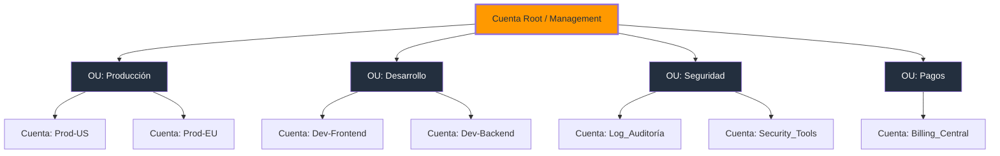

### Beneficios de AWS Organizations

| Beneficio | Descripción |
|-----------|-------------|
| **Separación de cuentas** | Un entorno por cuenta (prod, dev, staging) |
| **Control de costos** | Budgets y alertas por cuenta |
| **Seguridad centralizada** | Políticas SCP (Service Control Policies) |
| **Consolidación de facturación** | Una sola factura para todas las cuentas |
| **Automatización** | Crear cuentas automáticamente con Control Tower |

### Structure típica de cuentas

| Cuenta | Propósito | Servicios principales |
|--------|-----------|----------------------|
| Management | Gestión central, facturación | Organizations, IAM |
| Security | Auditoría y herramientas de seguridad | CloudTrail, GuardDuty, Security Hub |
| Network | Infraestructura de red compartida | VPC, Transit Gateway |
| Dev | Desarrollo y pruebas | EC2, Lambda, S3 |
| Staging | Validación pre-producción | Copia de prod reducida |
| Prod | Producción | Todo lo crítico |
| Data | Analytics y datos | Redshift, Glue, Athena |

---

## AWS Free Tier

La **Free Tier** de AWS te permite usar servicios populares sin costo durante los primeros 12 meses (y ciertos servicios "siempre gratis" dentro de límites generosos).

### Tipos de Free Tier

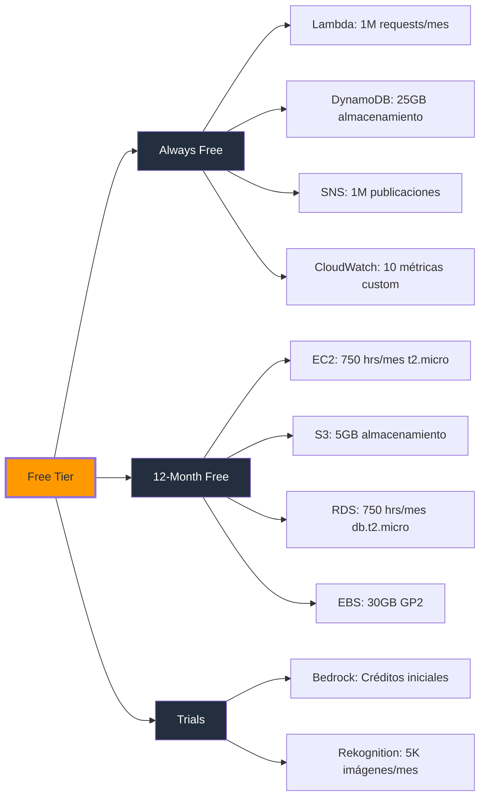

### Servicios principales en Free Tier

| Servicio | Límite Free Tier | Duración |
|----------|------------------|----------|
| **EC2** | 750 hrs/mes t2.micro (Linux/RHEL) | 12 meses |
| **S3** | 5GB Standard Storage, 20K GET, 2K PUT | 12 meses |
| **RDS** | 750 hrs/mes db.t2.micro, 20GB storage | 12 meses |
| **Lambda** | 1M requests, 400K GB-segs de compute | Siempre |
| **DynamoDB** | 25GB almacenamiento, 25 WCU, 25 RCU | Siempre |
| **SNS** | 1M publicaciones, 100K HTTP deliveries | Siempre |
| **CloudWatch** | 10 métricas custom, 10 alarmas | Siempre |
| **EBS** | 30GB GP2 o GP3 | 12 meses |
| **VPC** | Sin costo adicional | Siempre |
| **IAM** | Sin costo | Siempre |

### Cómo crear tu cuenta Free Tier

```bash
# 1. Ve a https://aws.amazon.com/free/
# 2. Click "Create a Free Account"
# 3. Ingresa tu email y selecciona "Personal"
# 4. Completa datos de facturación (requiere tarjeta)
# 5. Verifica tu identidad (teléfono o documento)
# 6. Selecciona "Basic Support Plan" (gratuito)
# 7. Configura MFA en la cuenta root
# 8. Configura AWS Budgets para alertas de gasto
```

**⚠️ Configuración crítica post-registro:**

```bash
# Activa MFA en la cuenta root (OBLIGATORIO)
aws iam enable-mfa-device \
    --user-name root \
    --serial-number arn:aws:iam::ACCOUNT_ID:mfa/root-account-mfa-device \
    --authentication-code1 123456 \
    --authentication-code2 789012

# Configura un Budget para alertarte si excedes $1
aws budgets create-budget \
    --account-id YOUR_ACCOUNT_ID \
    --budget '{
        "BudgetName": "Free-Tier-Alert",
        "BudgetLimit": {
            "Amount": "1",
            "Unit": "USD"
        },
        "BudgetType": "COST",
        "TimeUnit": "MONTHLY"
    }' \
    --notifications-with-subscribers '[
        {
            "Notification": {
                "NotificationType": "ACTUAL",
                "ComparisonOperator": "GREATER_THAN",
                "Threshold": 80
            },
            "Subscribers": [
                {
                    "SubscriptionType": "EMAIL",
                    "Address": "tu-email@ejemplo.com"
                }
            ]
        }
    ]'
```

---

## Preguntas Frecuentes (FAQ)

### ¿Cloud Computing es lo mismo que hosting web?

No. El hosting web es un servicio específico que te da espacio para un sitio web. Cloud computing es mucho más amplio: incluye servidores virtuales, bases de datos, redes, almacenamiento, IA, análisis de datos, y cientos de servicios más. AWS ofrece hosting ( Lightsail, Amplify), pero también EC2, Lambda, S3, y mucho más.

### ¿Qué significa "elasticidad" en cloud?

Elasticidad es la capacidad de un sistema para **crecer y reducir** automáticamente según la demanda. Si tu aplicación recibe más tráfico, AWS agrega más servidores automáticamente. Cuando el tráfico baja, esos servidores se liberan. Tú solo pagas por lo que usas.

### ¿Es seguro usar cloud computing?

Sí, y de hecho puede ser **más seguro** que on-premise para la mayoría de organizaciones. AWS invierte más de $1B USD anuales en seguridad, tiene certificaciones SOC, PCI, HIPAA, y su infraestructura física es más segura que la mayoría de data centers privados. Lo crítico es que **tú** debes configurar correctamente la seguridad "en" la nube (IAM, cifrado, redes).

### ¿Puedo usar AWS sin conocer programación?

Sí, especialmente para servicios gestionados como S3, RDS o Lightsail, que se configuran desde la consola gráfica. Sin embargo, para avanzar en tu carrera (y ser más valioso profesionalmente), aprender AWS CLI y al menos un SDK (Python o JavaScript) es altamente recomendable.

### ¿Qué es IaC y por qué importa?

**Infrastructure as Code** (IaC) significa definir infraestructura usando archivos de configuración en vez de hacerlo manualmente. En AWS se usa CloudFormation o Terraform. Es importante porque: es reproducible, versionada, auditada, y se puede desplegar en múltiples ambientes con un solo comando.

### ¿Cuánto cuesta realmente un proyecto en AWS?

Depende del uso. Un proyecto pequeño (una app web simple con EC2 + RDS) puede costar entre $50-$200 USD/mes. Un proyecto grande con múltiples servicios puede costar miles. La clave es: **monitorea con CloudWatch**, usa la Free Tier, y right-siza tus recursos regularmente.

### ¿Qué es el principio de mínimo privilegio?

Es un concepto de seguridad que dice: **dale a cada usuario o servicio solo los permisos que necesita para hacer su trabajo, ni más ni menos.** En AWS, esto se implementa con IAM policies. Es la práctica de seguridad más importante en la nube.

---

## Tips para Entrevistas Técnicas

### Pregunta: "¿Qué es cloud computing y por qué es importante?"

**Respuesta sugerida:**
> "Cloud computing es el suministro de recursos de TI a través de internet bajo demanda. Es importante porque elimina la inversión inicial en hardware, permite escalar según la demanda, ofrece alta disponibilidad con múltiples zonas de disponibilidad, y permite innovar más rápido al acceso a servicios de vanguardia como IA, ML y análisis de datos sin necesidad de construir la infraestructura desde cero."

### Pregunta: "Explica la diferencia entre IaaS, PaaS y SaaS"

**Respuesta sugerida:**
> "IaaS (EC2) te da control total pero más complejidad — gestionas todo desde el SO hasta la app. PaaS (Lambda, Elastic Beanstalk) te permite solo enfocarte en tu código — AWS gestiona la plataforma. SaaS (Gmail, Slack) es software listo para usar — solo lo consumes. La tendencia en la industria va de IaaS hacia PaaS y Serverless para reducir la carga operativa."

### Pregunta: "¿Cómo funcionaria el Shared Responsibility Model con RDS?"

**Respuesta sugerida:**
> "Con RDS, AWS se encarga del hardware, el SO, los parches del motor de base de datos, los backups automáticos y la replicación Multi-AZ. Yo como cliente soy responsable de: los datos (cifrado, esquema), el acceso (IAM, Security Groups), la configuración de red (VPC, subnets), y el cumplimiento normativo. La clave es que AWS gestiona la infraestructura de la base de datos, pero yo controlo quién accede y cómo se protegen los datos."

### Pregunta: "¿Por qué es importante Well-Architected?"

**Respuesta sugerida:**
> "Well-Architected es un framework de AWS con 6 pilares que guían el diseño de arquitecturas: excelencia operativa, seguridad, fiabilidad, performance, costos y sustentabilidad. Es importante porque proporciona un estándar para evaluar y mejorar arquitecturas, evita errores comunes, y facilita la comunicación entre equipos. Usarlo demuestra un enfoque profesional y estructurado."

---

## Errores Comunes al Empezar

| Error | Por qué ocurre | Cómo evitarlo |
|-------|----------------|---------------|
| **No activar MFA** | "Es solo una cuenta de práctica" | Activa MFA siempre — es gratis y toma 2 minutos |
| **Usar la cuenta root** | No saber cómo crear usuarios IAM | Crea un usuario IAM con admin para el día a día |
| **No configurar Budgets** | Confianza en la Free Tier | Crea un Budget con alerta al 80% desde el día 1 |
| **Ignorar los costos** | "Es solo una instancia pequeña" | Revisa Cost Explorer semanalmente |
| **Copiar configs sin entender** | Prisa por hacer que funcione | Entiende cada parámetro antes de desplegar |
| **No usar regiones adecuadas** | Desconocimiento de disponibilidad | Verifica qué servicios están disponibles en tu región |

---

## Mejores Prácticas

1. **Seguridad primero:** Activa MFA, usa IAM con mínimo privilegio, cifra datos en reposo y en tránsito.
2. **Infrastructure as Code:** Define todo con CloudFormation o Terraform — nunca hagas cambios manuales en producción.
3. **Monitorea siempre:** Configura CloudWatch dashboards y alarmas desde el primer servicio que despliegues.
4. **Optimiza costos:** Usa AWS Cost Explorer, Configura Budgets, y right-siza mensualmente.
5. **Documenta tu infraestructura:** Usa tags consistentes (Environment, Project, Owner) en todos los recursos.
6. **Planifica la recuperación:** Configura backups, usa Multi-AZ, y define un plan de Disaster Recovery.
7. **Aprende continuamente:** AWS lanza nuevos servicios y features cada semana — mantente actualizado.

---

## Resumen

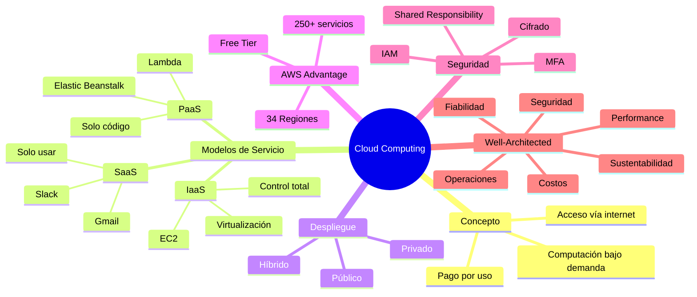

### Puntos clave para recordar

1. **Cloud computing** es como la electricidad: pagas por lo que usas, sin infraestructura propia.
2. **IaaS** (EC2) = tú gestionas todo; **PaaS** (Lambda) = solo tu código; **SaaS** (Gmail) = solo lo usas.
3. **El Shared Responsibility Model** es el pilar de la seguridad: AWS cuida "de" la nube, tú cuidas "en" la nube.
4. **Well-Architected Framework** tiene 6 pilares que guían todas las decisiones de arquitectura.
5. **La Free Tier** te permite experimentar gratis durante 12 meses — pero configura alertas de facturación SIEMPRE.
6. **AWS Organizations** te permite gestionar múltiples cuentas con gobernanza centralizada.
7. **Nunca uses la cuenta root** — crea usuarios IAM desde el primer día.
8. **Infrastructure as Code** es la práctica más importante para operaciones reproducibles y auditables.

---

> **Siguiente paso:** [Infraestructura Global de AWS →](/guide/aws/global-infrastructure)
