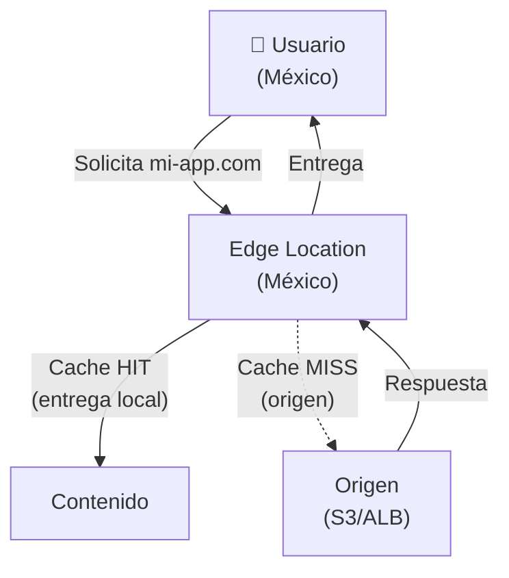
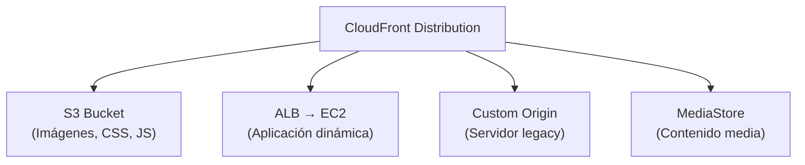
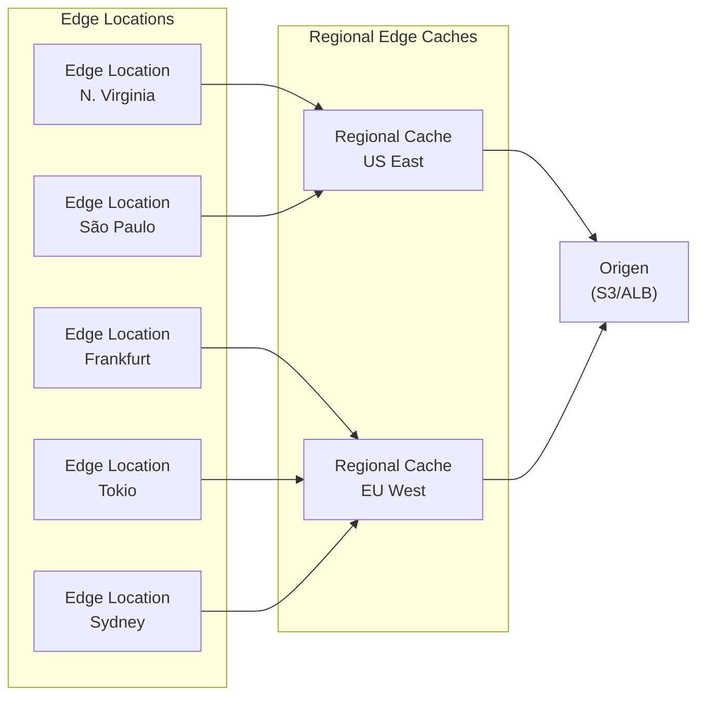
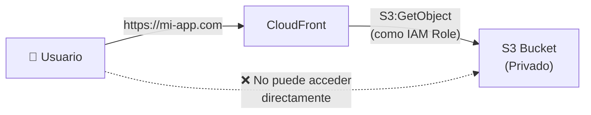

# Amazon CloudFront - CDN

## ¿Qué es CloudFront?

Imagina que tienes un almacén central en una ciudad, pero tus clientes están repartidos por todo el mundo. Enviar cada paquete desde el almacén central sería lento y costoso. **Amazon CloudFront** es como tener **oficinas de distribución (Edge Locations)** en cada ciudad del mundo: los productos más populares se almacenan cerca de los clientes para entrega rápida.

CloudFront es un **Content Delivery Network (CDN)** que distribuye contenido estático y dinámico desde orígenes cercanas a los usuarios finales.



:::tip
CloudFront **reduce latencia** (el contenido está más cerca del usuario), **reduce costos** (menos transferencia desde el origen) y **aumenta disponibilidad** (múltiples Edge Locations).
:::

## Distribuciones: Web vs RTMP

| Característica | Web Distribution | RTMP Distribution |
|---|---|---|
| Protocolo | HTTP/HTTPS | RTMP (Flash Media Streaming) |
| Contenido | Web, APIs, archivos estáticos | Streaming de video en vivo |
| Uso actual | 99% de los casos | Obsoleto (Flash ya no existe) |
| Orígenes | S3, ALB, EC2, HTTP | Solo S3 |

```bash
# Crear distribución Web con AWS CLI
aws cloudfront create-distribution \
  --distribution-config '{
    "CallerReference": "ref-$(date +%s)",
    "Origins": {
      "Quantity": 1,
      "Items": [{
        "Id": "S3-mi-app",
        "DomainName": "mi-app-bucket.s3.amazonaws.com",
        "S3OriginConfig": {
          "OriginAccessIdentity": ""
        }
      }]
    },
    "DefaultCacheBehavior": {
      "TargetOriginId": "S3-mi-app",
      "ViewerProtocolPolicy": "redirect-to-https",
      "ForwardedValues": {
        "QueryString": false,
        "Cookies": {"Forward": "none"}
      },
      "MinTTL": 0,
      "DefaultTTL": 86400,
      "MaxTTL": 31536000
    },
    "Enabled": true,
    "Comment": "Distribución para mi-app.com"
  }'
```

## Orígenes (Origins)

| Tipo de Origen | Caso de Uso | Ejemplo |
|---|---|---|
| **S3 Bucket** | Contenido estático (imágenes, CSS, JS) | `mi-bucket.s3.amazonaws.com` |
| **ALB** | Aplicaciones dinámicas | `mi-alb-123456.us-east-1.elb.amazonaws.com` |
| **EC2 Instance** | Servidor directo | `ec2-52-14-24-120.compute-1.amazonaws.com` |
| **Custom Origin** | Cualquier servidor HTTP/HTTPS | `mi-servidor.com:443` |



## Edge Locations y Caché

CloudFront tiene **450+ Edge Locations** en más de 90 ciudades de 50+ países.



### Proceso de Caché

1. **Primer request**: Edge → Regional Cache → Origin → respuesta → caché
2. **Request posterior**: Edge → respuesta directa del caché (sin ir al origen)
3. **TTL expira**: Edge vuelve a consultar el origen

| TTL | Descripción |
|---|---|
| MinTTL | TTL mínimo (override: `Cache-Control: s-maxage`) |
| DefaultTTL | TTL por defecto si no hay headers de caché |
| MaxTTL | TTL máximo permitido |

## Cache Invalidation

Cuando actualizas contenido en el origen, las Edge Locations pueden tener versiones antiguas en caché.

```bash
# Invalidar todo el contenido
aws cloudfront create-invalidation \
  --distribution-id E1234567890ABC \
  --paths "/*"

# Invalidar ruta específica
aws cloudfront create-invalidation \
  --distribution-id E1234567890ABC \
  --paths "/images/*" "/css/*"
```

| Opción | Costo | Velocidad |
|---|---|---|
| Invalidación | 1,000 gratis/mes, después $0.005 | Propagación en minutos |
| Versionado de objetos | Gratis | Inmediato |
| `Cache-Control: s-maxage` | Gratis | Inmediato |

:::tip
Usa **versionado de objetos** (`styles.v2.css`) en lugar de invalidaciones para cambios estáticos. Las invalidaciones son lentas y cuestan dinero después de las 1,000 gratis.
:::

## Price Classes

| Price Class | Regiones | Costo |
|---|---|---|
| **Price Class All** | Todas las Edge Locations | Más caro, mejor rendimiento |
| **Price Class 200** | Norteamérica, Europa, Asia, Medio Oriente, África | Intermedio |
| **Price Class 100** | Solo Norteamérica y Europa | Más barato |

```bash
# Configurar Price Class
# En DistributionConfig:
"PriceClass": "PriceClass_100"
```

## Lambda@Edge y CloudFront Functions

### CloudFront Functions (JavaScript, 50KB máx, 1ms de ejecución)

```javascript
// CloudFront Function: Redirect HTTP a HTTPS
function handler(event) {
  var request = event.request;
  if (request.headers['host'].value !== 'mi-app.com') {
    return {
      statusCode: 301,
      statusDescription: 'Moved Permanently',
      headers: {
        'location': { value: `https://mi-app.com${request.uri}` }
      }
    };
  }
  return request;
}
```

### Lambda@Edge (Node.js/Python, 50MB, 5-10s de ejecución)

```javascript
// Lambda@Edge: Añadir header de seguridad
exports.handler = async (event) => {
  const response = event.Records[0].cf.response;
  response.headers['strict-transport-security'] = [{ key: 'Strict-Transport-Security', value: 'max-age=31536000' }];
  response.headers['x-content-type-options'] = [{ key: 'X-Content-Type-Options', value: 'nosniff' }];
  return response;
};
```

| Característica | CloudFront Functions | Lambda@Edge |
|---|---|---|
| Lenguaje | Solo JavaScript | JavaScript, Python |
| Tamaño máximo | 50KB | 50MB |
| Tiempo ejecución | 1ms | 5-10s |
| Memoria | 2MB | 128MB-10GB |
| Costo | Muy barato | 3x Lambda normal |
| Uso | Headers, redirects, auth básica | Generación dinámica, A/B testing |

## Origin Access Control (OAC)

**OAC** reemplaza a **OAI** (Origin Access Identity) y es la forma segura de permitir que CloudFront acceda a tu S3 Bucket privado.



```bash
# 1. Crear OAC
aws cloudfront create-origin-access-control \
  --origin-access-control-config '{
    "Name": "OAC-S3-mi-app",
    "OriginAccessControlOriginType": "s3",
    "SigningBehavior": "always",
    "SigningProtocol": "sigv4"
  }'

# 2. Configurar bucket policy para permitir CloudFront
aws s3api put-bucket-policy \
  --bucket mi-app-bucket \
  --policy '{
    "Version": "2012-10-17",
    "Statement": [{
      "Sid": "AllowCloudFrontServicePrincipal",
      "Effect": "Allow",
      "Principal": {"Service": "cloudfront.amazonaws.com"},
      "Action": "s3:GetObject",
      "Resource": "arn:aws:s3:::mi-app-bucket/*",
      "Condition": {
        "StringEquals": {
          "AWS:SourceArn": "arn:aws:cloudfront::123456789012:distribution/E1234567890ABC"
        }
      }
    }]
  }'
```

## Signed URLs y Signed Cookies

**Signed URLs** y **Signed Cookies** protegen contenido restringido.

| Característica | Signed URL | Signed Cookie |
|---|---|---|
| Acceso a | Un archivo específico | Múltiples archivos |
| Uso | Descargas, contenido premium | Imágenes, CSS, JS de una página |
| Expiración | 1 URL × tiempo | 1 cookie × múltiples URLs |

```bash
# Generar Signed URL con CloudFront signer
aws cloudfront sign \
  --key-pair-id APKAEXAMPLE \
  --private-key file://private-key.pem \
  --resource "https://mi-app.com/video.mp4" \
  --date-less-than "2026-12-31"
```

```python
# Python: Generar Signed URL con Boto3
import boto3
from datetime import datetime

cf = boto3.client('cloudfront')
url = cf.generate_presigned_url(
    ClientMethod='get',
    Params={'Resource': 'https://mi-app.com/video.mp4'},
    ExpiresIn=3600  # 1 hora
)
```

## Field-Level Encryption

Protege datos sensibles a nivel de campo (ej: números de tarjeta de crédito).

```bash
# Configurar Field-Level Encryption en CloudFront
# Protege campos específicos del request antes de llegar al origen
```

## Integración con WAF

**AWS WAF (Web Application Firewall)** se integra con CloudFront para proteger contra:
- SQL Injection
- Cross-Site Scripting (XSS)
- Rate Limiting
- Geo-blocking

```bash
# Asociar WAF Web ACL con CloudFront
aws wafv2 associate-web-acl \
  --web-acl-arn "arn:aws:wafv2:us-east-1:123456789012:regional/webacl/mi-waf/abc123" \
  --resource-arn "arn:aws:cloudfront::123456789012:distribution/E1234567890ABC"
```

## Custom Error Pages

```bash
# Configurar página de error personalizada
# En DistributionConfig > CustomErrorResponses:
{
  "CustomErrorResponses": [{
    "ErrorCode": 404,
    "ResponsePagePath": "/errors/404.html",
    "ResponseCode": "404",
    "ErrorCachingMinTTL": 300
  }, {
    "ErrorCode": 500,
    "ResponsePagePath": "/errors/500.html",
    "ResponseCode": "500",
    "ErrorCachingMinTTL": 5
  }]
}
```

## Precio

| Concepto | Costo |
|---|---|
| Transferencia de datos (primera 10TB) | $0.085/GB (Norteamérica) |
| Peticiones HTTPS | $0.01 por 10,000 |
| Invalidaciones | 1,000 gratis/mes, después $0.005 |
| SSL/TLS (Custom Certificate) | Gratis con ACM |
| Lambda@Edge | $0.60 por millón de invocaciones + $0.00000625/128MB-s |

## Mejores Prácticas

1. **Usa OAC en lugar de OAI** para S3 (OAI está deprecated)
2. **Habilita compresión automática** (gzip, br) para CSS/JS/HTML
3. **Usa versionado de objetos** en vez de invalidaciones frecuentes
4. **Implementa cache keys** para contenido dinámico por usuario
5. **Configura Price Class** según tu audiencia
6. **Habilita WAF** para proteger contra ataques comunes
7. **Usa CloudFront Functions** para transformaciones simples (más barato que Lambda@Edge)
8. **Configura HTTPS** con certificado ACM (gratis)

## Errores Comunes

| Error | Consecuencia | Solución |
|---|---|---|
| S3 bucket público + CloudFront | Contenido accesible directamente via S3 | Usar OAC + bucket policy |
| TTL muy bajo | Muchas peticiones al origen, mayor costo | Aumentar TTL para contenido estático |
| Sin compresión | Páginas más lentas | Habilitar automatic compression |
| Price Class incorrecto | Costos innecesarios o mala experiencia | Elegir Price Class según audiencia |
| Sin health checks en origen | CloudFront sirve contenido de origen caído | Configurar health checks |

## Preguntas Frecuentes (FAQ)

**¿CloudFront cobra por las solicitudes que sirve?**
Sí, cobra por peticiones HTTPS ($0.01/10,000) y transferencia de datos.

**¿Puedo usar CloudFront con ALB?**
Sí. CloudFront puede usar ALB como origen, lo cual es útil para contenido dinámico.

**¿Qué es más barato, CloudFront o servir directamente desde S3?**
Depende del volumen. Para sitios con tráfico global, CloudFront suele ser más barato y más rápido.

**¿Puedo usar mi propio dominio con CloudFront?**
Sí. Configura un CNAME o Alias Record指向 la distribución CloudFront.

## Tips para Entrevistas

1. **CloudFront = CDN con 450+ Edge Locations** para baja latencia global
2. **OAC vs OAI:** OAC es la versión moderna (recomendada), OAI está deprecated
3. **Lambda@Edge vs CloudFront Functions:** Lambda@Edge es más potente pero más caro
4. **Cache Invalidation vs Versionado:** Versionado es inmediato y gratis
5. **Price Class:** Controla costos seleccionando qué Edge Locations usar
6. **Signed URLs vs Signed Cookies:** URLs para un archivo, cookies para múltiples

## Resumen

| Componente | Descripción |
|---|---|
| Distribution | Configuración de CDN para un dominio |
| Origin | Origen del contenido (S3, ALB, EC2, Custom) |
| Edge Location | Punto de caché cerca del usuario |
| OAC | Permite acceso seguro desde CloudFront a S3 |
| Lambda@Edge | Función ejecutable en Edge Locations |
| CloudFront Functions | Función ligera para transformaciones simples |
| Signed URL/Cookie | Protege contenido restringido |
| Field-Level Encryption | Protege datos sensibles a nivel de campo |
| Price Class | Controla costos según regiones |
