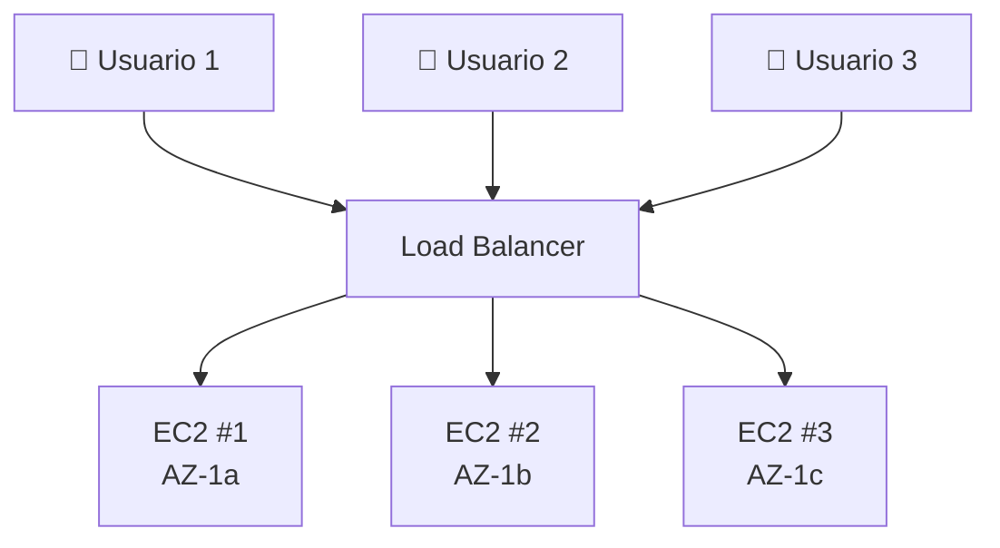
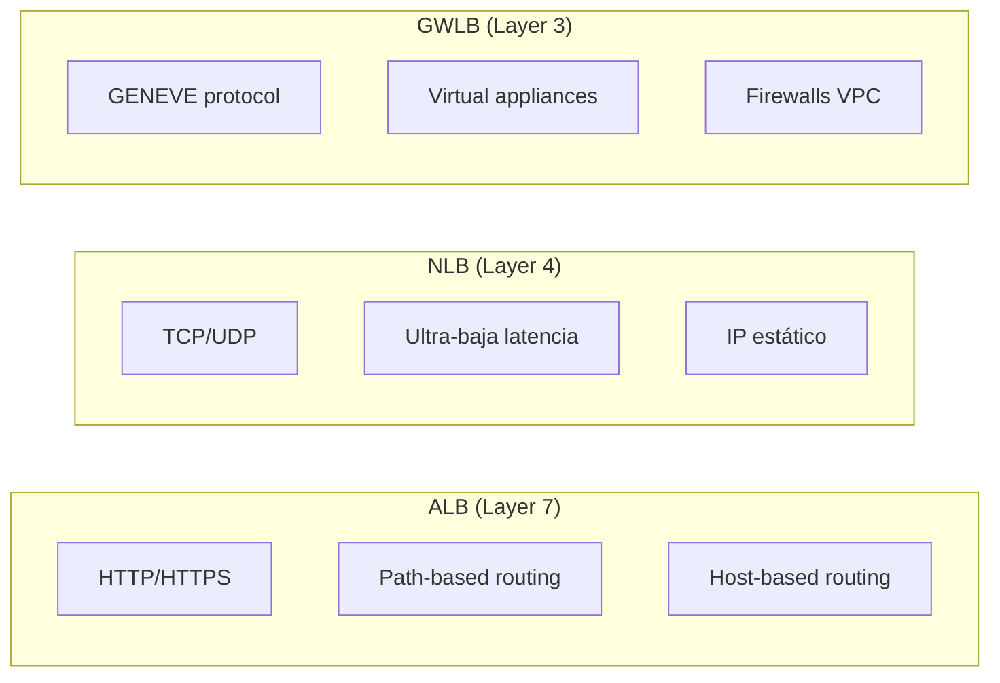
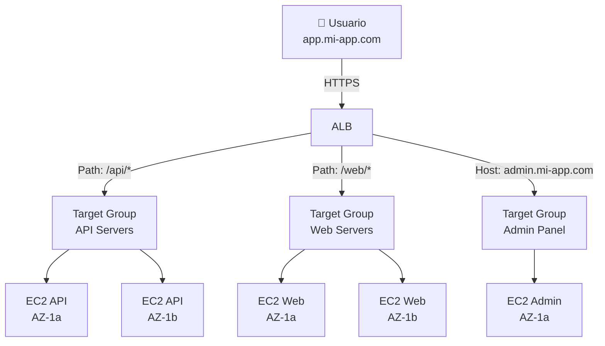
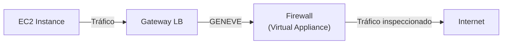
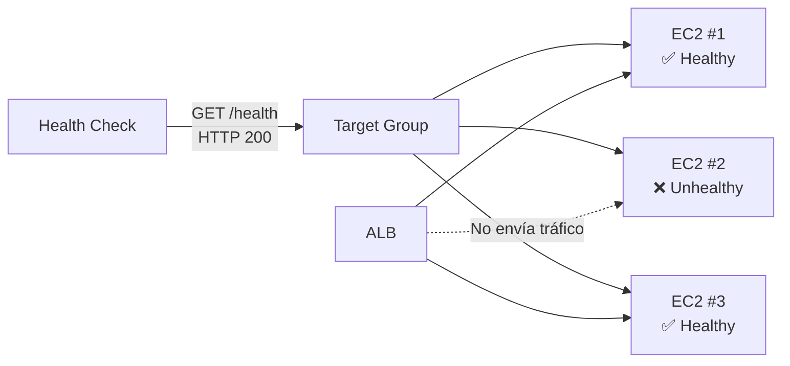
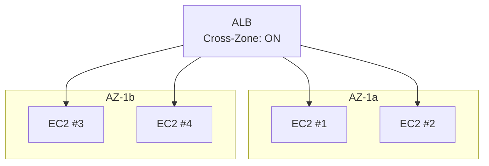

# AWS Elastic Load Balancing

## ¿Qué es Elastic Load Balancing?

Imagina que eres un **director de tráfico** en una autopista con múltiples carriles. Los vehículos (solicitudes de usuarios) llegan y tú decides a qué carril (servidor) enviarlos para que el tráfico fluya sin congestiones. **Elastic Load Balancing (ELB)** hace exactamente eso: distribuye el tráfico entrante entre múltiples destinos (EC2, contenedores, IPs) automáticamente.



:::tip
ELB es **managed**: AWS se encarga de la infraestructura, patches, y disponibilidad. Tú solo configuras las reglas de distribución.
:::

## Tipos de Load Balancer

| Característica | ALB | NLB | GWLB |
|---|---|---|---|
| Capa OSI | **Layer 7** (HTTP/HTTPS) | **Layer 4** (TCP/UDP) | **Layer 3** (IP/GENEVE) |
| Velocidad | ~100ms latencia | ~10μs latencia | ~10μs latencia |
| Throughput | ~35,000 rps | 10M+ rps | 10M+ rps |
| IP estático | No | Sí | Sí |
| WebSocket | Sí | Sí | No |
| HTTP/2 | Sí | No | No |
| GZIP | Sí | No | No |
| URL Path routing | Sí | No | No |
| Host-based routing | Sí | No | No |
| Costo | ~$0.0225/hr + LCUs | ~$0.0225/hr + NLCUs | ~$0.0225/hr + GWLUs |
| Caso típico | Web apps, microservicios | Gaming, IoT, ultra-baja latencia | Virtual appliances, firewalls |



## Application Load Balancer (ALB)

El ALB opera en **Layer 7** y es ideal para aplicaciones web y microservicios.

### Arquitectura ALB



### Características ALB

- **Path-based routing**: `/api/*` → un target group, `/web/*` → otro
- **Host-based routing**: `api.mi-app.com` → un target, `web.mi-app.com` → otro
- **HTTP methods**: Soporta GET, POST, PUT, DELETE, etc.
- **WebSocket**: Conexiones persistentes
- **HTTP/2**: Soporte nativo
- **Rewrite/Redirect**: Transformar URLs en el ALB

```bash
# Crear ALB
aws elbv2 create-load-balancer \
  --name mi-alb \
  --subnets subnet-0abc1234 subnet-0def5678 \
  --security-groups sg-0abc1234 \
  --scheme internet-facing \
  --type application

# Crear Target Group
aws elbv2 create-target-group \
  --name mi-tg-api \
  --protocol HTTP \
  --port 80 \
  --vpc-id vpc-0abc1234 \
  --health-check-path /health \
  --health-check-interval-seconds 30 \
  --health-check-timeout-seconds 5 \
  --healthy-threshold-count 2 \
  --unhealthy-threshold-count 3

# Crear Listener con reglas
aws elbv2 create-listener \
  --load-balancer-arn arn:aws:elasticloadbalancing:us-east-1:123456789012:loadbalancer/app/mi-alb/abc123 \
  --protocol HTTPS \
  --port 443 \
  --certificates CertificateArn=arn:aws:acm:us-east-1:123456789012:certificate/abc123 \
  --default-actions Type=forward,TargetGroupArn=arn:aws:elasticloadbalancing:us-east-1:123456789012:targetgroup/mi-tg/abc123
```

### Rules del ALB

```bash
# Regla: /api/* → Target Group API
aws elbv2 create-rule \
  --listener-arn arn:aws:elasticloadbalancing:us-east-1:123456789012:loadbalancer/app/mi-alb/abc123/listener/def456 \
  --priority 100 \
  --conditions '[{"Field": "path-pattern", "Values": ["/api/*"]}]' \
  --actions Type=forward,TargetGroupArn=arn:aws:elasticloadbalancing:us-east-1:123456789012:targetgroup/mi-tg-api/abc123

# Regla: Host = admin.mi-app.com → Admin Panel
aws elbv2 create-rule \
  --listener-arn arn:aws:elasticloadbalancing:us-east-1:123456789012:loadbalancer/app/mi-alb/abc123/listener/def456 \
  --priority 200 \
  --conditions '[{"Field": "host-header", "Values": ["admin.mi-app.com"]}]' \
  --actions Type=forward,TargetGroupArn=arn:aws:elasticloadbalancing:us-east-1:123456789012:targetgroup/mi-tg-admin/abc123
```

## Network Load Balancer (NLB)

El NLB opera en **Layer 4** y es ideal para aplicaciones que requieren **ultra-baja latencia** y **alto throughput**.

### Características NLB

- **IP estático**: Un IP fijo por AZ
- **Ultra-baja latencia**: ~10 microsegundos
- **Millones de requests por segundo**
- **WebSocket persistente**
- **UDP support**
- **Elastic IP** por AZ

```bash
# Crear NLB
aws elbv2 create-load-balancer \
  --name mi-nlb \
  --subnets subnet-0abc1234 subnet-0def5678 \
  --scheme internet-facing \
  --type network

# Target Group TCP
aws elbv2 create-target-group \
  --name mi-tg-tcp \
  --protocol TCP \
  --port 3306 \
  --vpc-id vpc-0abc1234 \
  --target-type instance
```

## Gateway Load Balancer (GWLB)

El GWLB opera en **Layer 3** y se usa para desplegar **virtual appliances** como firewalls, IDS/IPS.



```bash
# Crear GWLB
aws elbv2 create-load-balancer \
  --name mi-gwlb \
  --subnets subnet-0abc1234 subnet-0def5678 \
  --type gateway

# Target Group GENEVE
aws elbv2 create-target-group \
  --name mi-tg-geneve \
  --protocol GENEVE \
  --port 6081 \
  --vpc-id vpc-0abc1234 \
  --target-type ip
```

## Comparación Detallada

| Aspecto | ALB | NLB | GWLB |
|---|---|---|---|
| **Capa** | 7 (HTTP/HTTPS) | 4 (TCP/UDP) | 3 (IP/GENEVE) |
| **SSL/TLS termination** | Sí | Sí | No |
| **Path-based routing** | Sí | No | No |
| **WebSocket** | Sí | Sí | No |
| **IP estático** | No | Sí | Sí |
| **Health checks** | HTTP/TCP | TCP/HTTP | TCP |
| **Cross-zone** | Sí (default) | No (configurable) | No (configurable) |
| **Preserve source IP** | X-Forwarded-For | Sí (directo) | Sí (directo) |
| **Latencia** | ~100ms | ~10μs | ~10μs |
| **Throughput** | ~35K rps | 10M+ rps | 10M+ rps |
| **Costo** | Intermedio | Bajo | Bajo |

## Health Checks



| Parámetro | Descripción | Valor por defecto |
|---|---|---|
| Protocol | HTTP o TCP | HTTP |
| Path | Ruta a verificar | `/` |
| Port | Puerto a verificar | igual que listener |
| Interval | Frecuencia de check | 30s |
| Timeout | Tiempo de espera | 5s |
| Healthy Threshold | Checks exitosos antes de healthy | 5 |
| Unhealthy Threshold | Checks fallidos antes de unhealthy | 2 |

```bash
# Health check configurado
aws elbv2 modify-target-group \
  --target-group-arn arn:aws:elasticloadbalancing:us-east-1:123456789012:targetgroup/mi-tg/abc123 \
  --health-check-protocol HTTP \
  --health-check-path /health \
  --health-check-interval-seconds 15 \
  --health-check-timeout-seconds 5 \
  --healthy-threshold-count 3 \
  --unhealthy-threshold-count 2
```

## Cross-Zone Load Balancing

Distribuye tráfico entre **todas las AZs** registradas, no solo dentro de cada AZ.



| ALB | NLB |
|---|---|
| Habilitado por defecto | Deshabilitado por defecto |
| Gratis | Cuesta dinero (data processing charges) |

## SSL/TLS Termination

```bash
# Listener con SSL
aws elbv2 create-listener \
  --load-balancer-arn arn:aws:elasticloadbalancing:us-east-1:123456789012:loadbalancer/app/mi-alb/abc123 \
  --protocol HTTPS \
  --port 443 \
  --certificates CertificateArn=arn:aws:acm:us-east-1:123456789012:certificate/abc123 \
  --ssl-policy ELBSecurityPolicy-TLS-1-2-2017-01 \
  --default-actions Type=forward,TargetGroupArn=arn:aws:elasticloadbalancing:us-east-1:123456789012:targetgroup/mi-tg/abc123
```

### SSL Policies

| Policy | TLS 1.0 | TLS 1.1 | TLS 1.2 | TLS 1.3 |
|---|---|---|---|---|
| ELBSecurityPolicy-2016-08 | Sí | Sí | Sí | No |
| ELBSecurityPolicy-TLS-1-2-2017-01 | No | No | Sí | No |
| ELBSecurityPolicy-TLS-1-2-Res-2019-11 | No | No | Sí | Sí |
| ELBSecurityPolicy-FS-1-2-Res-2020-10 | No | No | Sí (FS) | Sí |

:::warning
Nunca uses TLS 1.0 o 1.1 en producción. Usa **ELBSecurityPolicy-TLS-1-2-Res-2019-11** o superior.
:::

## Sticky Sessions

Mantienen la sesión del usuario en el **mismo servidor** durante toda la conexión.

```bash
# Habilitar Sticky Sessions (ALB)
aws elbv2 modify-target-group-attributes \
  --target-group-arn arn:aws:elasticloadbalancing:us-east-1:123456789012:targetgroup/mi-tg/abc123 \
  --attributes Key=stickiness.enabled,Value=true \
  Key=stickiness.type,Value=lb_cookie \
  Key=stickiness.lb_cookie.duration_seconds,Value=86400
```

| Tipo | Descripción |
|---|---|
| lb_cookie | Cookie generada por ALB (default: `AWSALB`) |
| app_cookie | Cookie de la aplicación |

## Precio

| Componente | Costo |
|---|---|
| ALB | $0.0225/hr + $0.008/LCU-hour |
| NLB | $0.0225/hr + $0.006/NLCU-hour |
| GWLB | $0.0225/hr + $0.004/GWLU-hour |
| Data processed | $0.01/GB (cross-region) |
| Cross-zone | Gratis (ALB), $0.01/GB (NLB) |

## Mejores Prácticas

1. **Usa ALB** para aplicaciones web con rutas HTTP
2. **Usa NLB** para IoT, gaming, o ultra-baja latencia
3. **Siempre configura health checks** con path `/health`
4. **Usa 2+ AZs** para alta disponibilidad
5. **Habilita access logs** para análisis de tráfico
6. **Usa Security Groups** en el ALB (no NACLs)
7. **Configura SSL/TLS** con certificado ACM
8. **Evita sticky sessions** salvo que sea estrictamente necesario
9. **Monitorea con CloudWatch** las métricas de ALB/NLB

## Errores Comunes

| Error | Consecuencia | Solución |
|---|---|---|
| Health check path incorrecto | Todos los targets marcados unhealthy | Verificar que `/health` retorna 200 |
| Sin cross-zone enabled | Tráfico desbalanceado entre AZs | Habilitar cross-zone |
| Sticky sessions innecesarias | Carga desbalanceada | Evitar sticky sessions salvo necesario |
| Security Group sin reglas de entrada | ALB no recibe tráfico | Abrir puertos 80/443 en SG del ALB |
| NLB sin IP estático | Problemas con DNS caching | Asignar Elastic IPs |

## Preguntas Frecuentes (FAQ)

**¿Cuándo usar ALB vs NLB?**
ALB para HTTP/HTTPS con rutas. NLB para TCP/UDP puro, ultra-baja latencia o IP estático.

**¿Puedo usar ambos ALB y NLB?**
Sí. ALB para el tráfico web, NLB para bases de datos o servicios internos.

**¿Los health checks impactan rendimiento?**
Mínimamente. Las verificaciones son ligeras (una petición cada 30s).

**¿Cross-zone tiene costo extra?**
En ALB es gratis. En NLB cobra $0.01/GB por cross-zone data transfer.

## Tips para Entrevistas

1. **ALB = Layer 7 (HTTP), NLB = Layer 4 (TCP), GWLB = Layer 3 (IP)**
2. **ALB para path/host routing**, NLB para ultra-baja latencia, GWLB para firewalls
3. **Health checks** son cruciales: sin ellos, el LB envía tráfico a targets caídos
4. **Cross-zone** en ALB es gratis, en NLB cobra
5. **Sticky sessions** rompen el balanceo de carga evenly
6. **SGs en ALB**, NACLs para denies explícitos

## Resumen

| Componente | Descripción |
|---|---|
| ALB | Load balancer Layer 7 para HTTP/HTTPS |
| NLB | Load balancer Layer 4 para TCP/UDP |
| GWLB | Load balancer Layer 3 para virtual appliances |
| Target Group | Conjunto de destinos (EC2, IP, Lambda) |
| Listener | Reglas que evalúan peticiones |
| Health Check | Verifica que los targets estén saludables |
| Cross-Zone | Distribuye tráfico entre AZs |
| Sticky Sessions | Mantiene sesión en el mismo target |
| SSL/TLS Termination | Descifra HTTPS antes de llegar al target |
