# Amazon Route 53

## ¿Qué es Route 53?

Imagina que necesitas llamar a alguien pero solo tienes su nombre, no su dirección. Necesitas una **guía telefónica** que traduzca nombres en direcciones. **Amazon Route 53** es la guía telefónica de Internet: traduce nombres de dominio (`mi-app.com`) en direcciones IP (`52.14.24.120`) para que los usuarios puedan encontrar tus servicios.

El nombre "53" viene del puerto DNS estándar: **puerto 53**.

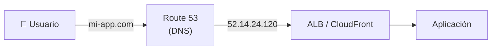

:::tip
Route 53 no solo resuelve DNS: también **registra dominios**, **verifica la salud** de endpoints y **enruta el tráfico** inteligentemente.
:::

## Registro de Dominios

Route 53 funciona como **registrar de dominios** oficial. Puedes comprar y gestionar dominios directamente.

```bash
# Registrar un dominio
aws route53 domains register-domain \
  --domain-name mi-app.com \
  --duration-in-years 1 \
  --admin-contact '{"FirstName":"Juan","LastName":"Pérez","Email":"admin@mi-app.com","CountryCode":"MX"}' \
  --registrant-contact '{"FirstName":"Juan","LastName":"Pérez","Email":"admin@mi-app.com","CountryCode":"MX"}' \
  --tech-contact '{"FirstName":"Juan","LastName":"Pérez","Email":"tech@mi-app.com","CountryCode":"MX"}'

# Transferir dominio desde otro registrador
aws route53 domains transfer-domain \
  --domain-name mi-app.com \
  --auth-code "ABC123xyz789"
```

### Registrar vs DNS Service

| Concepto | Descripción |
|---|---|
| Registrar (Registrar) | Empresa que vende dominios (Route 53, GoDaddy, Namecheap) |
| DNS Service | Servicio que resuelve nombres a IPs (Route 53, Cloudflare, Google DNS) |
| Pueden ser diferentes | Compras el dominio en GoDaddy pero usas Route 53 como DNS |

## Tipos de Registros DNS

| Tipo | Propósito | Ejemplo |
|---|---|---|
| **A** | Nombre → IPv4 | `mi-app.com → 52.14.24.120` |
| **AAAA** | Nombre → IPv6 | `mi-app.com → 2600:9000::1` |
| **CNAME** | Nombre → Otro nombre | `www.mi-app.com → mi-app.com` |
| **MX** | Correo electrónico | `mi-app.com → mail.mi-app.com` |
| **TXT** | Texto (verificación, SPF, DKIM) | `"v=spf1 include:_spf.google.com ~all"` |
| **NS** | Nameservers del dominio | `mi-app.com → ns-123.awsdns-15.com` |
| **SOA** | Start of Authority (info de zona) | Datos administrativos de la zona |
| **SRV** | Servicio → Host:Puerto | `_sip._tcp.mi-app.com → 5060` |
| **PTR** | IP → Nombre (reverse DNS) | `120.24.14.52 → mi-app.com` |
| **ALIAS** | Nombre → Recurso AWS (gratis) | `mi-app.com → ALB de CloudFront` |

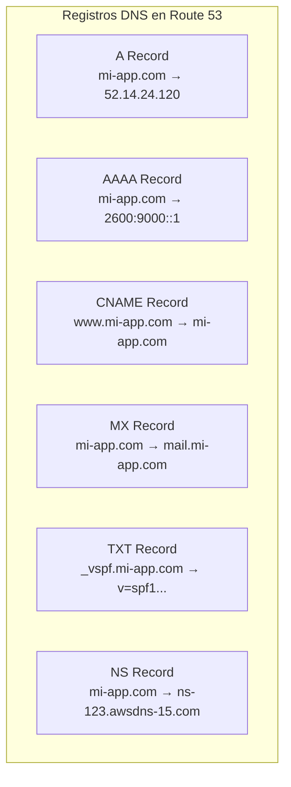

```bash
# Crear registro A
aws route53 change-resource-record-sets \
  --hosted-zone-id Z1234567890ABC \
  --change-batch '{
    "Changes": [{
      "Action": "CREATE",
      "ResourceRecordSet": {
        "Name": "mi-app.com",
        "Type": "A",
        "TTL": 300,
        "ResourceRecords": [{"Value": "52.14.24.120"}]
      }
    }]
  }'

# Crear registro CNAME
aws route53 change-resource-record-sets \
  --hosted-zone-id Z1234567890ABC \
  --change-batch '{
    "Changes": [{
      "Action": "CREATE",
      "ResourceRecordSet": {
        "Name": "www.mi-app.com",
        "Type": "CNAME",
        "TTL": 300,
        "ResourceRecords": [{"Value": "mi-app.com"}]
      }
    }]
  }'

# Crear registro MX
aws route53 change-resource-record-sets \
  --hosted-zone-id Z1234567890ABC \
  --change-batch '{
    "Changes": [{
      "Action": "CREATE",
      "ResourceRecordSet": {
        "Name": "mi-app.com",
        "Type": "MX",
        "TTL": 300,
        "ResourceRecords": [
          {"Value": "10 mail1.mi-app.com"},
          {"Value": "20 mail2.mi-app.com"}
        ]
      }
    }]
  }'
```

## Record Sets vs Alias Records

| Característica | Record Set (CNAME) | Alias Record |
|---|---|---|
|指向 | Cualquier dominio | Solo recursos AWS |
| Costo | Consultas DNS cobradas | **Gratis** (consultas a recursos AWS) |
| Root domain | No soportado (`mi-app.com`) | Sí soportado |
| TTL | Configurable | Automático |
| Uso típico | Dominios externos | ALB, CloudFront, S3, Route 53 zones |

:::warning
Los **CNAME no funcionan en el root domain** (`mi-app.com`). Para el root, usa **Alias Records** apuntando a un ALB, CloudFront o S3.
:::

## Políticas de Enrutamiento

### Simple Routing

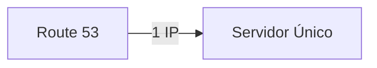

Una IP o registro simple. Sin lógica de enrutamiento.

### Weighted Routing

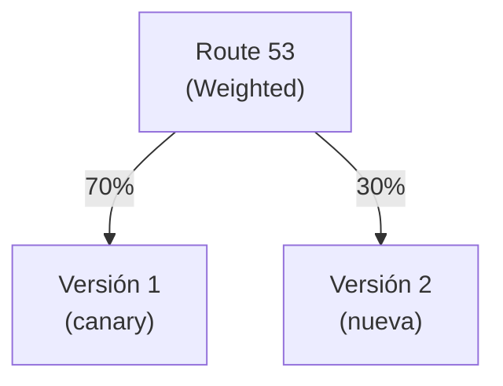

```bash
# Weighted: 70% al canary, 30% a nueva versión
# Cambio de ResourceRecordSet: "SetIdentifier": "canary-v1", "Weight": 70
# Cambio de ResourceRecordSet: "SetIdentifier": "nueva-v2", "Weight": 30
```

### Latency Routing

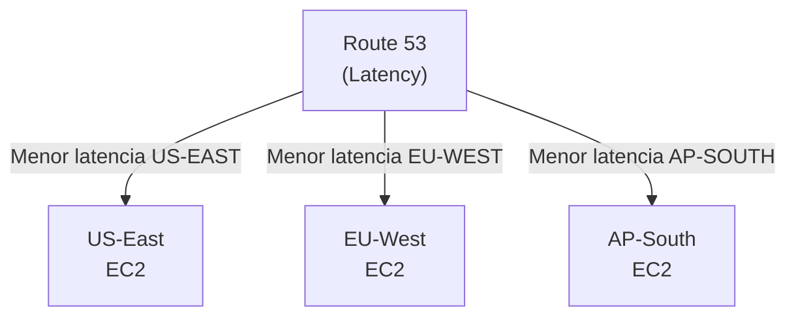

Enruta al endpoint con **menor latencia** desde la ubicación del usuario.

### Failover Routing

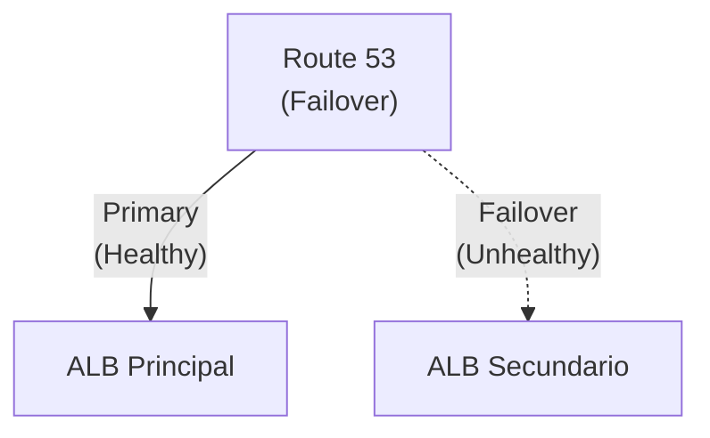

```bash
# Failover: Primary
# "SetIdentifier": "primary", "Failover": "PRIMARY"
# "HealthCheckId": "hc-abc123"

# Failover: Secondary
# "SetIdentifier": "secondary", "Failover": "SECONDARY"
# "HealthCheckId": "hc-def456"
```

### Geolocation Routing

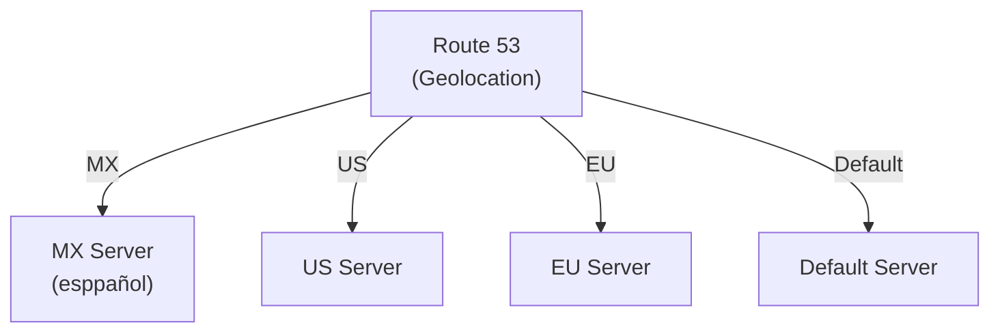

Enruta según la **ubicación geográfica** del usuario (país, continente).

### Geoproximity Routing

Similar a Geolocation pero con **bias**: puedes ajustar cuánto "empujas" el tráfico hacia una región.

### Multivalue Answer

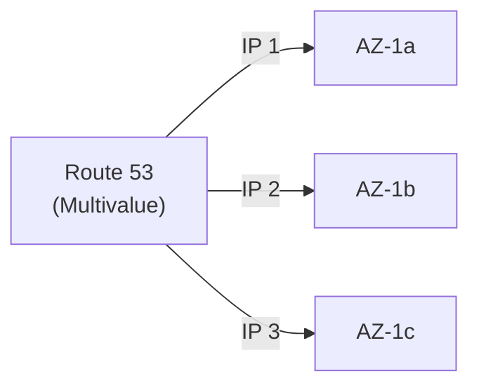

Devuelve **múltiples valores** y el cliente elige. Útil para balanceo de carga DNS.

| Política | Cuándo usarla |
|---|---|
| Simple | Un solo endpoint, sin lógica |
| Weighted | Canary releases, A/B testing |
| Latency | Múltiples regiones, optimizar latencia |
| Failover | Alta disponibilidad con primario/secundario |
| Geolocation | Contenido regional (idioma, regulaciones) |
| Geoproximity | Balanceo inteligente por región con bias |
| Multivalue | Balanceo de carga DNS simple |

## Health Checks

Route 53 verifica que tus endpoints estén **saludables** antes de enviarles tráfico.

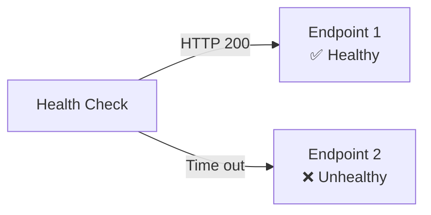

```bash
# Crear Health Check HTTP
aws route53 create-health-check \
  --caller-reference "ref-$(date +%s)" \
  --health-check-config '{
    "IPAddress": "52.14.24.120",
    "Port": 80,
    "Type": "HTTP",
    "ResourcePath": "/health",
    "RequestInterval": 30,
    "FailureThreshold": 3
  }'
```

| Parámetro | Descripción | Valores |
|---|---|---|
| Type | Protocolo | HTTP, HTTPS, TCP, HTTP_STR, HTTPS_STR |
| RequestInterval | Frecuencia de verificación | 10s (premium) o 30s (standard) |
| FailureThreshold | Fallos antes de marcar unhealthy | 1-10 |
| ResourcePath | Ruta a verificar | `/health`, `/api/status` |

## DNS Failover

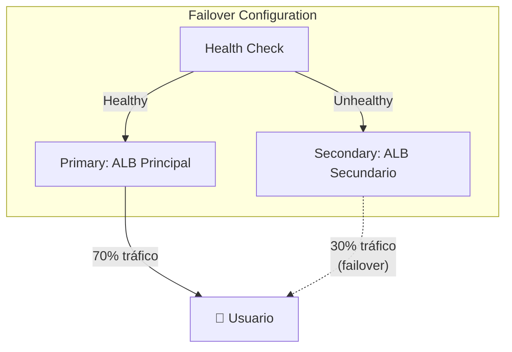

Para configurar DNS Failover necesitas:
1. **Health Check** en el endpoint primario
2. **Record Set primario** con `Failover: PRIMARY`
3. **Record Set secundario** con `Failover: SECONDARY`
4. **Ambos** con `SetIdentifier` único

## Traffic Flow

**Traffic Flow** es el editor visual de Route 53 para crear políticas de enrutamiento complejas combinando múltiples reglas.

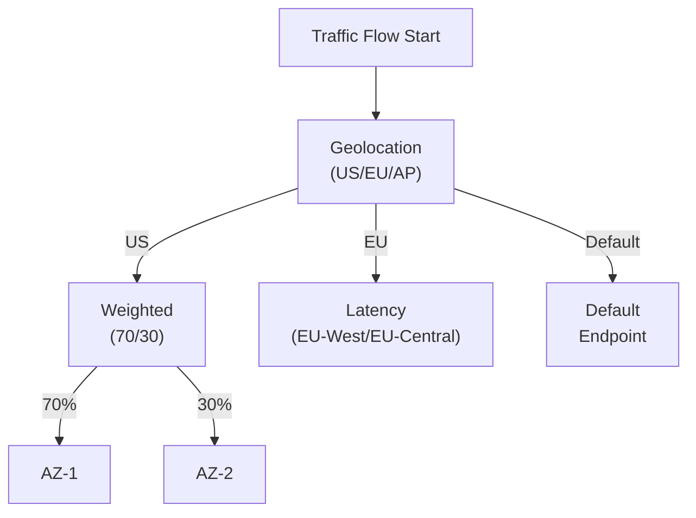

## Pricing

| Concepto | Costo |
|---|---|
| Hosted Zone | $0.50/mes por zona |
| Consultas DNS estándar | $0.40 por millón |
| Consultas Alias a ALB/CloudFront | Gratis |
| Health Check | $0.50-$1.00/mes |
| DNSSEC | $0.10 por zona/mes |
| Registro de dominio `.com` | ~$12/año |

## Mejores Prácticas

1. **Usa Alias Records** para recursos AWS (gratis, soporta root domain)
2. **Implementa Health Checks** en todos los endpoints de producción
3. **Configura TTL bajo** (60-300s) para failover rápido
4. **Usa Route 53 Resolver** para DNS híbrido (on-premises + cloud)
5. **Mantén registros NS actualizados** después de migrar DNS
6. **Usa DNSSEC** para prevenir envenenamiento de caché DNS
7. **Monitorea con CloudWatch** las métricas de Health Checks

## Errores Comunes

| Error | Consecuencia | Solución |
|---|---|---|
| TTL muy alto (86400) | Failover lento (hasta 24h) | Usar TTL bajo (60-300s) |
| CNAME en root domain | DNS no funciona | Usar Alias Record |
| Olvidar health check | Failover no activa | Siempre configurar health checks |
| NS no actualizado en registrar | DNS no resuelve | Actualizar NS en el registrador |
| Confundir ALIAS con CNAME | Costos innecesarios | ALIAS es gratis para recursos AWS |

## Preguntas Frecuentes (FAQ)

**¿Cuál es la diferencia entre Alias y CNAME?**
Alias es gratis y funciona con root domains. CNAME cobra consultas y no funciona en root.

**¿Puedo usar Route 53 con otro registrador?**
Sí. Solo necesitas apuntar los nameservers de tu dominio a los de Route 53.

**¿Route 53 es un load balancer?**
No. Route 53 hace DNS resolution. El load balancing lo hace ALB/NLB.

**¿Cuánto tarda un cambio DNS en propagarse?**
Depende del TTL. Con TTL de 300s, propagación completa en ~5-10 minutos.

## Tips para Entrevistas

1. **Route 53 = DNS + Registrar + Health Checks + Traffic Routing**
2. **Alias vs CNAME:** Alias funciona con root domain y es gratis para AWS resources
3. **Weighted + Health Check = Canary Releases:** Reduces gradualmente tráfico al endpoint viejo
4. **Failover Routing:** Primario con health check + secundario como backup
5. **TTL bajo = Failover rápido, TTL alto = Menos consultas DNS**
6. **DNSSEC** prevenir ataques de cache poisoning

## Resumen

| Componente | Descripción |
|---|---|
| Hosted Zone | Contenedor de registros DNS para un dominio |
| Record Set | Entrada DNS individual (A, CNAME, MX, etc.) |
| Alias Record | Record DNS指向 recursos AWS (gratis) |
| Health Check | Verifica salud de endpoints cada 10s/30s |
| Simple Routing | Una IP, sin lógica |
| Weighted | Distribución por porcentaje |
| Latency | Menor latencia desde ubicación del usuario |
| Failover | Primario → secundario si falla |
| Geolocation | Por país o continente |
| Traffic Flow | Editor visual de políticas complejas |
