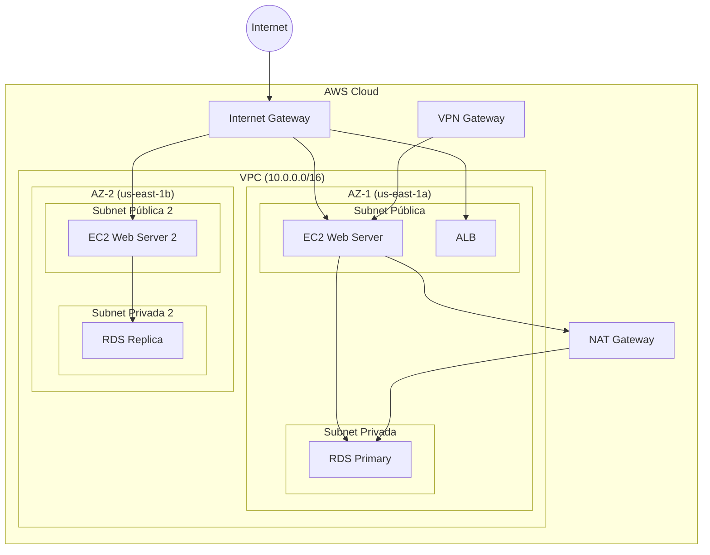
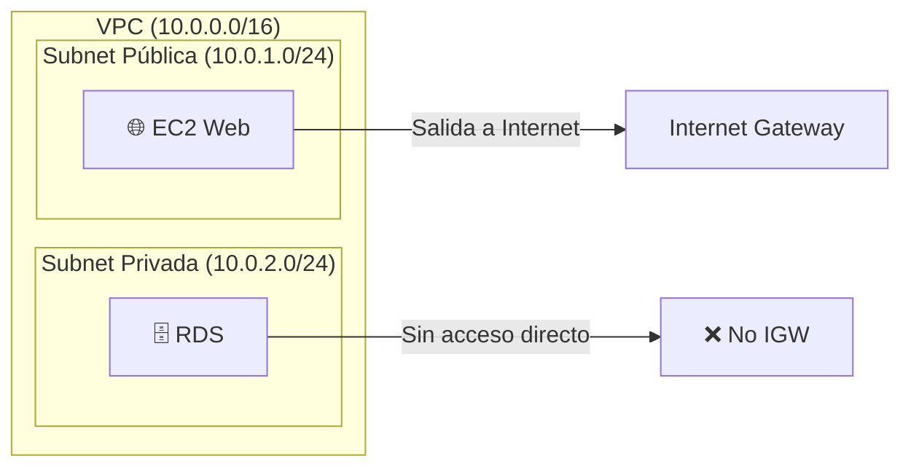
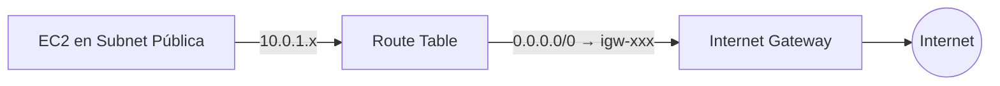
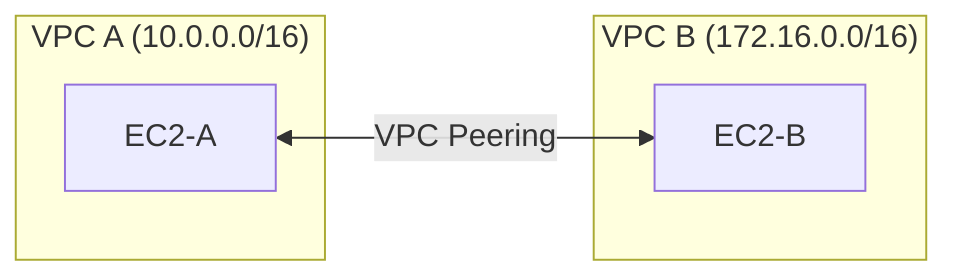
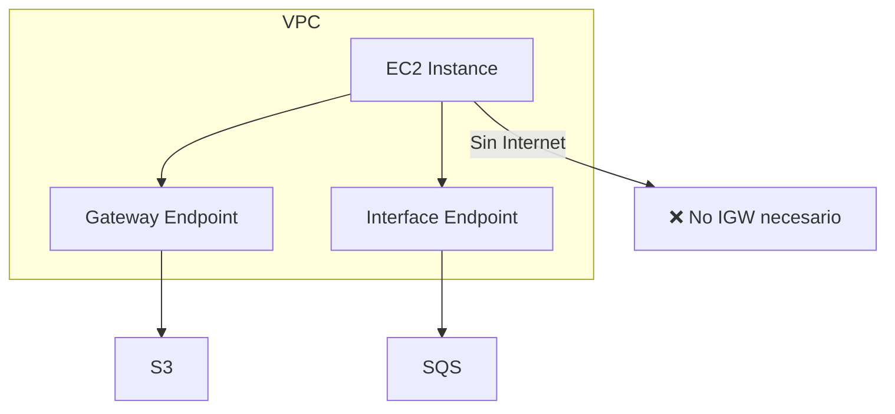
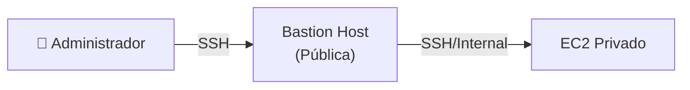
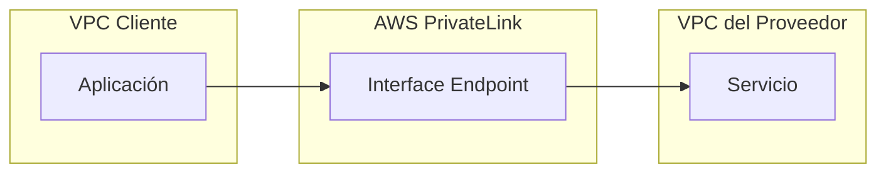
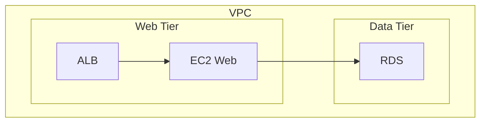
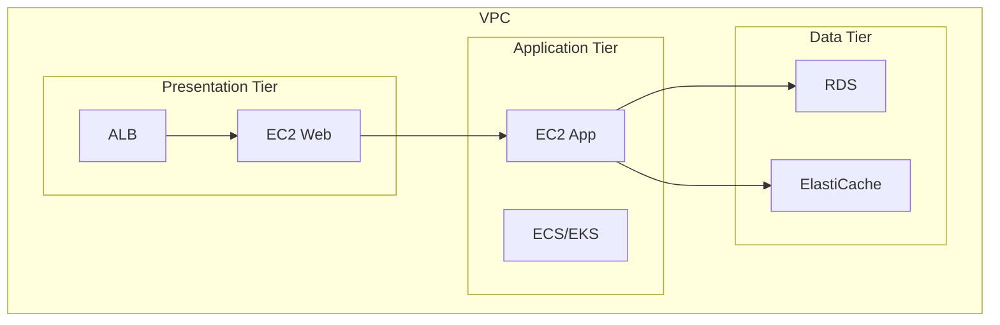

# Amazon VPC - Virtual Private Cloud

## ¿Qué es Amazon VPC?

Imagina que construyes tu propio **centro de datos privado** en la nube, pero sin tener que comprar servidores, cablear redes ni contratar un equipo de infraestructura. **Amazon VPC (Virtual Private Cloud)** es exactamente eso: tu red virtual aislada dentro de AWS donde puedes lanzar recursos como instancias EC2, bases de datos RDS y contenedores ECS con control total sobre el tráfico de red.



:::tip
Piensa en VPC como **tu propia oficina privada** dentro de un edificio corporativo (AWS). Tú controlas quién entra, quién sale y a quién se puede conectar dentro.
:::

## Bloques CIDR

Un bloque **CIDR (Classless Inter-Domain Routing)** define el rango de direcciones IP disponibles en tu VPC. Es como definir cuántas "direcciones postales" tienes disponibles.

| CIDR | Direcciones IP | Uso típico |
|---|---|---|
| /28 | 16 IPs | Labs, pruebas |
| /24 | 256 IPs | Pequeñas aplicaciones |
| /22 | 1,024 IPs | Aplicaciones medianas |
| /16 | 65,536 IPs | Producción grande |
| /8 | 16,777,216 IPs | Grandes enterprise |

```bash
# Crear una VPC con CloudFormation
Resources:
  MiVPC:
    Type: AWS::EC2::VPC
    Properties:
      CidrBlock: 10.0.0.0/16
      EnableDnsHostnames: true
      EnableDnsSupport: true
      InstanceTenancy: default
      Tags:
        - Key: Name
          Value: MiVPC-Produccion
```

```bash
# Crear VPC con AWS CLI
aws ec2 create-vpc \
  --cidr-block 10.0.0.0/16 \
  --tag-specifications 'ResourceType=vpc,Tags=[{Key=Name,Value=MiVPC}]'
```

:::warning
Una vez creada, **no puedes cambiar el CIDR** de una VPC. Elige sabiamente desde el inicio.
:::

## Subnets: Públicas vs Privadas

Las **subnets** son subdivisiones de tu VPC que determinan si los recursos pueden acceder a Internet.



| Característica | Subnet Pública | Subnet Privada |
|---|---|---|
| Ruta a Internet Gateway | Sí | No |
| IP público asignado | Automático (opcional) | No |
| Acceso a Internet saliente | A través de IGW | A través de NAT Gateway |
| Caso de uso | Web servers, ALB, Bastion | Bases de datos, workers |

```bash
# Crear subnet pública
aws ec2 create-subnet \
  --vpc-id vpc-0abc1234def567890 \
  --cidr-block 10.0.1.0/24 \
  --availability-zone us-east-1a \
  --tag-specifications 'ResourceType=subnet,Tags=[{Key=Name,Value=Public-1a}]'

# Crear subnet privada
aws ec2 create-subnet \
  --vpc-id vpc-0abc1234def567890 \
  --cidr-block 10.0.2.0/24 \
  --availability-zone us-east-1a \
  --tag-specifications 'ResourceType=subnet,Tags=[{Key=Name,Value=Private-1a}]'
```

## Route Tables

Las **tablas de rutas** determinan hacia dónde se envía el tráfico de red. Cada subnet debe estar asociada a una tabla de rutas.

| Destino | Target | Descripción |
|---|---|---|
| `10.0.0.0/16` | local | Tráfico dentro de la VPC |
| `0.0.0.0/0` | igw-xxx | Todo el tráfico sale por IGW (pública) |
| `0.0.0.0/0` | nat-xxx | Tráfico sale por NAT (privada) |

```bash
# Crear tabla de rutas para subnet pública
aws ec2 create-route-table \
  --vpc-id vpc-0abc1234def567890 \
  --tag-specifications 'ResourceType=route-table,Tags=[{Key=Name,Value=Public-RT}]'

# Agregar ruta al Internet Gateway
aws ec2 create-route \
  --route-table-id rtb-0abc1234def567890 \
  --destination-cidr-block 0.0.0.0/0 \
  --gateway-id igw-0abc1234def567890

# Asociar tabla de rutas a subnet
aws ec2 associate-route-table \
  --route-table-id rtb-0abc1234def567890 \
  --subnet-id subnet-0abc1234def567890
```

## Internet Gateway (IGW)

El **Internet Gateway** es el componente que permite la comunicación entre tu VPC y Internet. Es como la puerta principal de tu edificio.



- Es **redundante** (AWS lo maneja internamente)
- Se adjunta a una VPC específica
- Proporcia destino para rutas `0.0.0.0/0`
- **No cobra** por el IGW en sí, solo por el tráfico que pasa por él

## NAT Gateway vs NAT Instance

| Característica | NAT Gateway | NAT Instance |
|---|---|---|
| Disponibilidad | Alta (managed por AWS) | Depende de la instancia EC2 |
| Ancho de banda | Hasta 45 Gbps | Limitado por tipo de instancia |
| Mantenimiento | Automático | Manual (parches, actualizaciones) |
| Costo | ~$32.40/mes + datos | Variable (según instancia) |
| Seguridad | No se SSH | Puedes hacer SSH |
| Elastic IP | Sí | Sí |

```bash
# Crear NAT Gateway (requiere EIP previo)
aws ec2 allocate-address --domain vpc
aws ec2 create-nat-gateway \
  --subnet-id subnet-0abc1234def567890 \
  --allocation-id eipalloc-0abc1234def567890 \
  --tag-specifications 'ResourceType=natgateway,Tags=[{Key=Name,Value=MiNAT}]'
```

:::tip
Para producción, siempre usa **NAT Gateway**. Las NAT Instances son útiles solo para pruebas o presupuestos muy ajustados.
:::

## VPC Peering

**VPC Peering** conecta dos VPCs mediante la red de AWS, permitiendo que se comuniquen como si estuvieran en la misma red.



| Regla | Descripción |
|---|---|
| Sin traslape de CIDR | Los bloques IP no pueden solaparse |
| No transitivity | Si A peered con B y B con C, A **no** puede ver a C |
| Una por par | Cada peering conecta exactamente 2 VPCs |
| Misma o cross-region | Puede ser dentro de una región o entre regiones |

```bash
# Crear VPC Peering
aws ec2 create-vpc-peering-connection \
  --vpc-id vpc-0abc1234def567890 \
  --peer-vpc-id vpc-0def567890abc1234 \
  --peer-region us-east-1

# Aceptar el peering (desde la otra VPC)
aws ec2 accept-vpc-peering-connection \
  --vpc-peering-connection-id pcx-0abc1234def567890
```

## VPC Endpoints

Los **VPC Endpoints** permiten conectarte a servicios AWS **sin salir de la red de AWS**, eliminando la necesidad de Internet Gateway o NAT.

| Tipo | Servicios | IP | Costo |
|---|---|---|---|
| Gateway Endpoint | S3, DynamoDB | Dirección IP privada | Gratis |
| Interface Endpoint | SQS, SNS, Lambda, Secrets Manager, etc. | ENI con IP privado | ~$7/mes por AZ + datos |



```bash
# Crear Gateway Endpoint para S3
aws ec2 create-vpc-endpoint \
  --vpc-id vpc-0abc1234def567890 \
  --service-name com.amazonaws.us-east-1.s3 \
  --route-table-ids rtb-0abc1234def567890

# Crear Interface Endpoint para SQS
aws ec2 create-vpc-endpoint \
  --vpc-id vpc-0abc1234def567890 \
  --service-name com.amazonaws.us-east-1.sqs \
  --vpc-endpoint-type Interface \
  --subnet-ids subnet-0abc1234def567890 \
  --security-group-ids sg-0abc1234def567890
```

## Elastic Network Interfaces (ENI)

Una **ENI** es una tarjeta de red virtual que puedes adjuntar a una instancia EC2.

- Tiene una **dirección IP privada** fija en una subnet
- Puedes moverla entre instancias (útil para failover)
- Puede tener múltiples direcciones IP privadas
- Tiene su propio **security group** asociado

## Security Groups vs NACLs

| Característica | Security Groups | NACLs |
|---|---|---|
| Nivel | Instance-level | Subnet-level |
| Estado | **Stateful** (return traffic automático) | **Stateless** (debes permitir return) |
| Reglas | Solo reglas ALLOW | Reglas ALLOW y DENY |
| Evaluación | Todas las reglas se evalúan | Reglas en orden numérico |
| Asociación | Una o más SG por instancia | Una NACL por subnet |
| Default | Permite todo el tráfico saliente | Niega todo el tráfico |
| Reutilización | Puede compartirse entre instancias | Puede compartirse entre subnets |

```bash
# Crear Security Group
aws ec2 create-security-group \
  --group-name mi-sg-web \
  --description "SG para servidores web" \
  --vpc-id vpc-0abc1234def567890

# Agregar regla de entrada (HTTP)
aws ec2 authorize-security-group-ingress \
  --group-id sg-0abc1234def567890 \
  --protocol tcp \
  --port 80 \
  --cidr 0.0.0.0/0

# Agregar regla de salida (HTTPS)
aws ec2 authorize-security-group-egress \
  --group-id sg-0abc1234def567890 \
  --protocol tcp \
  --port 443 \
  --cidr 0.0.0.0/0
```

## Bastion Hosts / SSM Session Manager

**Bastion Host** es una instancia en una subnet pública que actúa como **puerta de entrada segura** a tus instancias privadas.



**SSM Session Manager** es la alternativa moderna (sin necesidad de Bastion ni SSH):

```bash
# Conectar con SSM (sin SSH, sin IP público)
aws ssm start-session \
  --target i-0abc1234def567890 \
  --document-name AWS-StartInteractiveCommand
```

:::tip
**SSM Session Manager** es la recomendación actual. Elimina la necesidad de Bastion Hosts, reduce superficie de ataque y genera logs de auditoría en CloudTrail.
:::

## Flow Logs

Los **VPC Flow Logs** capturan información sobre el tráfico IP que entra y sale de tu VPC.

```bash
# Crear Flow Log
aws ec2 create-flow-logs \
  --resource-type VPC \
  --resource-ids vpc-0abc1234def567890 \
  --traffic-type ALL \
  --log-destination-type cloud-watch-logs \
  --log-group-name /aws/vpc/flowlogs \
  --deliver-logs-permission-arn arn:aws:iam::123456789012:role/VPCFlowLogsRole
```

**Formato del log:**
```
2 123456789012 eni-0abc1234def567890 10.0.1.100 172.217.14.110 443 49152 6 10 5000 1625000000 1625000060 ACCEPT OK
```

| Campo | Descripción |
|---|---|
| version | Versión del formato |
| account-id | ID de la cuenta AWS |
| en-id | ID de la ENI |
| srcaddr | IP origen |
| dstaddr | IP destino |
| srcport | Puerto origen |
| dstport | Puerto destino |
| protocol | Protocolo (6=TCP, 17=UDP) |
| packets | Paquetes transferidos |
| bytes | Bytes transferidos |
| action | ACCEPT o REJECT |
| log-status | OK o NODATA |

## AWS PrivateLink

**PrivateLink** permite acceder a servicios de terceros o tus propios servicios de forma privada a través de **Interface Endpoints**.



- Datos nunca cruzan Internet
- Compatible con NLB para tus propios servicios
- Usado extensamente por servicios AWS (STS, ECR, etc.)

## VPN y Direct Connect

| Característica | VPN | Direct Connect |
|---|---|---|
| Conexión | A través de Internet (cifrado) | Dedicada (fibra óptica) |
| Ancho de banda | Hasta 1.25 Gbps | 1 Gbps a 100 Gbps |
| Latencia | Variable | Consistente y baja |
| Costo | Bajo | Alto (compromiso a largo plazo) |
| Tiempo de setup | Minutos | Semanas/meses |
| Uso típico | Sitios pequeños, DR | Enterprise, grandes volúmenes |

## Patrones de Diseño de VPC

### Arquitectura 2-Tier



### Arquitectura 3-Tier



## Mejores Prácticas

1. **Usa al menos 2 AZs** para alta disponibilidad
2. **Separa subnets públicas y privadas** por AZ
3. **Usa VPC Endpoints** para servicios AWS (S3, DynamoDB, SQS)
4. **Implementa Flow Logs** para auditoría y troubleshooting
5. **Usa SSM Session Manager** en lugar de Bastion Hosts
6. **Cuenta IPs:** `/28` = 16 IPs, `/24` = 256 IPs. Planifica para crecimiento
7. **No uses 10.0.0.0/8, 172.16.0.0/12, 192.168.0.0/16** si planeas VPN con tu data center
8. **Taggea todo:** VPC, subnets, SGs, NACLs para gestión de costos

## Errores Comunes

| Error | Consecuencia | Solución |
|---|---|---|
| CIDR solapado entre VPCs | VPC Peering falla | Planifica rangos IP antes de crear VPCs |
| Olvidar ruta 0.0.0.0/0 en subnet pública | Instancia sin acceso a Internet | Verificar route table asociada |
| NAT Gateway sin route en subnet privada | Instancias privadas sin Internet | Agregar ruta 0.0.0.0/0 → NAT |
| Security Group sin regla de retorno | Conexiones TCP fallan | SGs son stateful, pero verifica egress |
| Usar SGs como reglas de DENY | No se pueden crear reglas DENY en SGs | Usa NACLs para DENY explícitas |

## Preguntas Frecuentes (FAQ)

**¿Cuántas VPCs puedo crear por cuenta?**
5 por región por defecto (se puede solicitar aumento).

**¿Puedo cambiar el CIDR de una VPC?**
No. Si necesitas un CIDR diferente, debes crear una nueva VPC y migrar.

**¿Cuál es la diferencia entre Security Groups y NACLs?**
SGs son a nivel de instancia (stateful), NACLs a nivel de subnet (stateless). Usa SGs como primera línea y NACLs para DENY explícitos.

**¿Necesito un Bastion Host?**
No necesariamente. AWS recomienda **SSM Session Manager** como alternativa más segura y simple.

## Tips para Entrevistas

1. **Diferencia entre SGs y NACLs:** SGs = stateful, instance-level, solo ALLOW. NACLs = stateless, subnet-level, ALLOW + DENY
2. **VPC Peering no es transitive:** Si A peered B y B peered C, A no ve a C
3. **Gateway vs Interface Endpoints:** Gateway (S3, DynamoDB) = gratis, Interface = ~$7/mes
4. **NAT Gateway vs NAT Instance:** Managed vs self-managed, 45 Gbps vs limitado
5. **Flow Logs:** Útil para troubleshooting y compliance, no impacta rendimiento

## Resumen

| Concepto | Descripción |
|---|---|
| VPC | Red virtual aislada en AWS |
| Subnet | División de la VPC (pública/privada) |
| Route Table | Define hacia dónde va el tráfico |
| IGW | Puerta de salida a Internet |
| NAT Gateway | Permite salida a Internet desde subnets privadas |
| VPC Peering | Conexión entre dos VPCs (no transitive) |
| VPC Endpoint | Acceso privado a servicios AWS |
| Security Group | Firewall a nivel de instancia (stateful) |
| NACL | Firewall a nivel de subnet (stateless) |
| Flow Logs | Monitoreo del tráfico de red |
