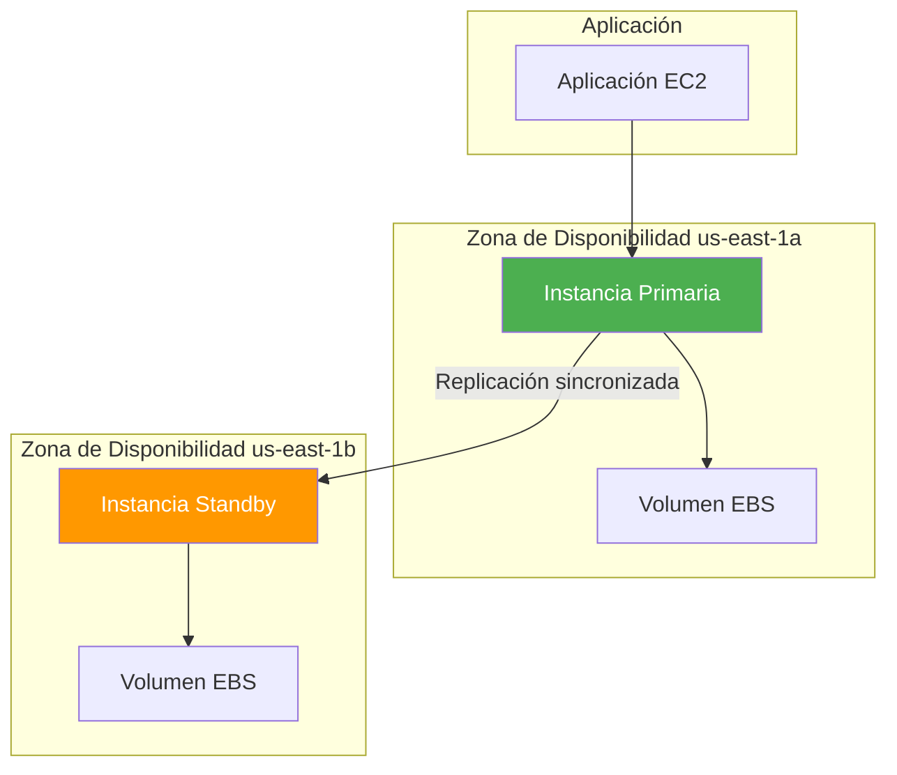
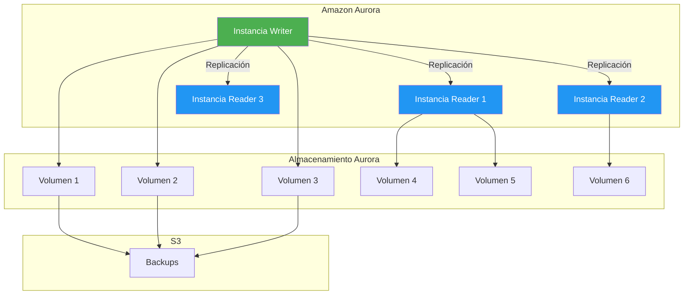
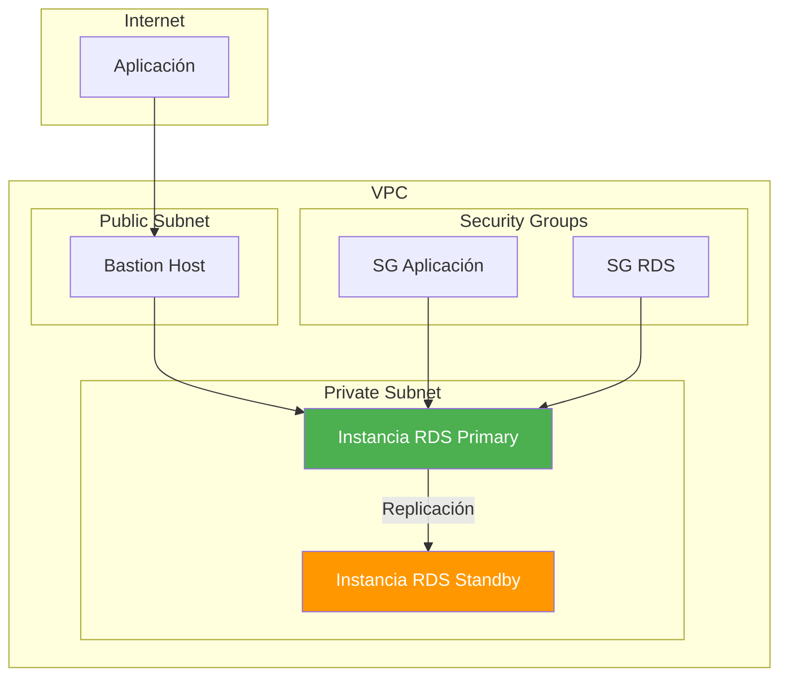
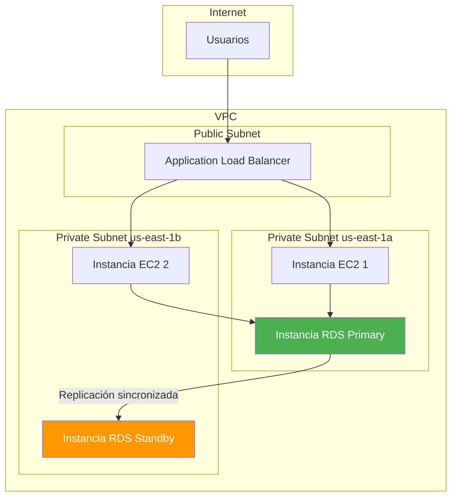
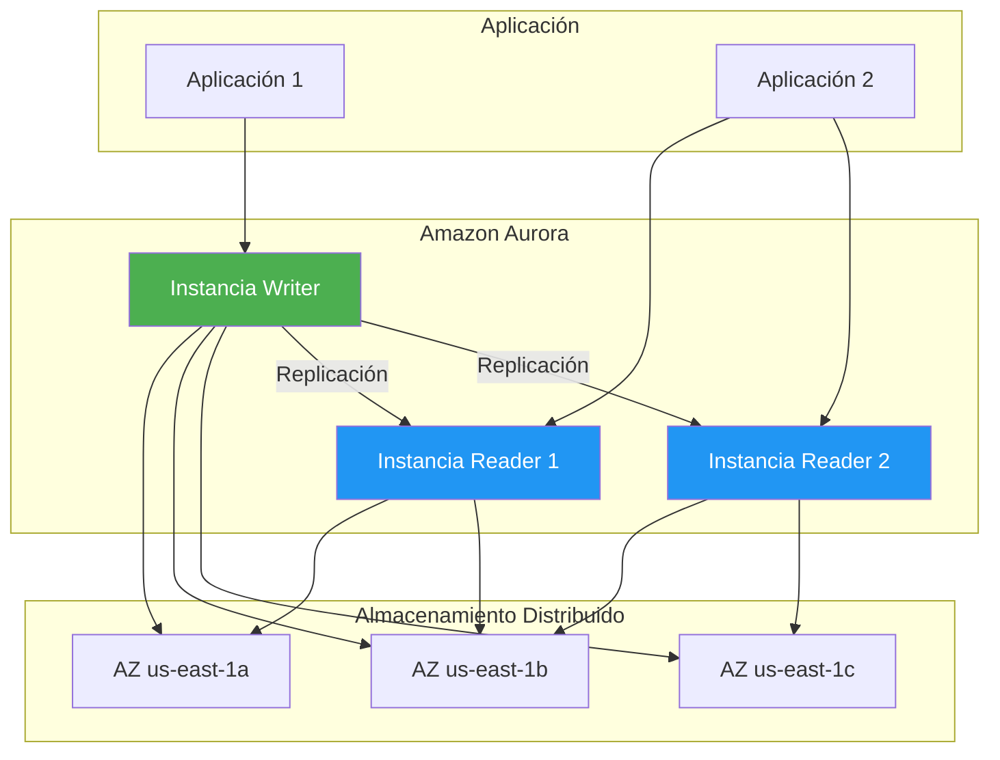
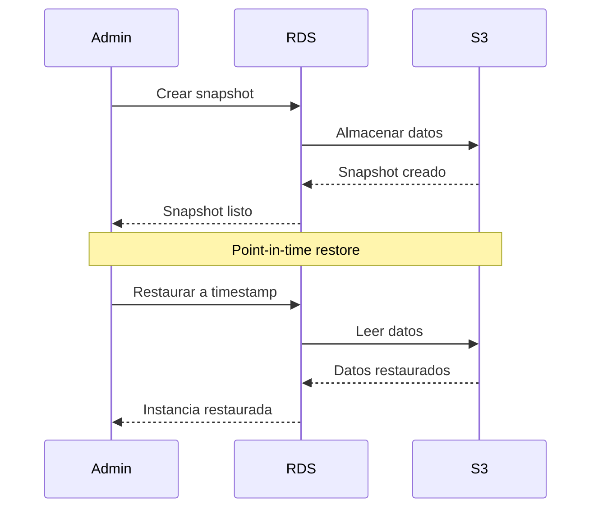

# Amazon RDS - Relational Database Service

## Tabla de contenidos

- [¿Qué es Amazon RDS?](#qué-es-amazon-rds)
- [Motores de bases de datos soportados](#motores-de-bases-de-datos-soportados)
- [Clases de instancias de BD](#clases-de-instancias-de-bd)
- [Despliegues Multi-AZ](#despliegues-multi-az)
- [Read Replicas](#read-replicas)
- [Amazon Aurora](#amazon-aurora)
- [Copias de seguridad y snapshots](#copias-de-seguridad-y-snapshots)
- [Cifrado](#cifrado)
- [Parameter Groups y Option Groups](#parameter-groups-y-option-groups)
- [VPC y Security Groups](#vpc-y-security-groups)
- [IAM Database Authentication](#iam-database-authentication)
- [Performance Insights](#performance-insights)
- [RDS Proxy](#rds-proxy)
- [Modelo de precios](#modelo-de-precios)
- [Mejores prácticas para producción](#mejores-prácticas-para-producción)
- [Errores comunes](#errores-comunes)
- [Ejemplos de código](#ejemplos-de-código)
- [Diagramas Mermaid](#diagramas-mermaid)
- [Preguntas frecuentes (FAQ)](#preguntas-frecuentes-faq)
- [Consejos para entrevistas](#consejos-para-entrevistas)
- [Resumen](#resumen)

---

## ¿Qué es Amazon RDS?

Amazon Relational Database Service (RDS) es un servicio de bases de datos relacionales completamente gestionado en la nube. Piensa en RDS como **alquilar un servidor de base de datos administrado**: tú defines la base de datos, pero AWS se encarga de las copias de seguridad, parches, replicación y alta disponibilidad.

RDS te permite ejecutar bases de datos en la nube sin preocuparte por la infraestructura subyacente, permitiéndote enfocarte en tu aplicación.

### Características principales

| Característica | Descripción |
|----------------|-------------|
| **Gestión completa** | AWS administra hardware, parches, backups |
| **Múltiples motores** | MySQL, PostgreSQL, MariaDB, Oracle, SQL Server, Aurora |
| **Alta disponibilidad** | Multi-AZ con failover automático |
| **Escalabilidad** | Escalar instancia y almacenamiento en cualquier momento |
| **Copias de seguridad** | Automáticas y manuales |
| **Seguridad** | Cifrado, VPC, IAM |
| **Monitoreo** | CloudWatch, Performance Insights |

---

## Motores de bases de datos soportados

RDS soporta múltiples motores de bases de datos, cada uno con sus propias características y casos de uso.

| Motor | Versión soportada | Caso de uso ideal |
|-------|-------------------|-------------------|
| **MySQL** | 5.7, 8.0 | Aplicaciones web, e-commerce |
| **PostgreSQL** | 12, 13, 14, 15, 16 | Aplicaciones empresariales, GIS |
| **MariaDB** | 10.x | Fork de MySQL, compatibilidad |
| **Oracle** | 19c, 21c | Aplicaciones empresariales Oracle |
| **SQL Server** | 2016, 2017, 2019 | Aplicaciones .NET, entornos Microsoft |
| **Aurora** | MySQL 5.6/5.7/8.0, PostgreSQL 10-16 | Rendimiento empresarial, escalabilidad |

### Comparación de motores

| Característica | MySQL | PostgreSQL | Aurora |
|----------------|-------|------------|--------|
| **Rendimiento** | Bueno | Bueno | Excelente (5x MySQL) |
| **Escalabilidad** | Buena | Buena | Excelente |
| **Funciones avanzadas** | Limitadas | Muy buenas | Muy buenas |
| **Costo** | Bajo | Bajo | Medio |
| **Comunidad** | Muy grande | Grande | Creciente |
| **Licencia** | Open source | Open source | Propietario |

---

## Clases de instancias de BD

Las instancias de RDS están disponibles en diferentes tamaños optimizados para diferentes cargas de trabajo.

### Familias de instancias

| Familia | Optimizado para | Uso ideal |
|---------|----------------|-----------|
| **db.r5** | Memoria | Cargas de trabajo general |
| **db.r6g** | Memoria (ARM) | Rendimiento mejorado, costo reducido |
| **db.m5** | Compute | Cargas de trabajo balanceadas |
| **db.t3** | Burstable | Desarrollo, pruebas |
| **db.r3** | Memoria | Cargas de trabajo anteriores |

### Tamaños de instancia

```text
db.t3.micro: 2 vCPU, 1 GB RAM
db.t3.small: 2 vCPU, 2 GB RAM
db.t3.medium: 2 vCPU, 4 GB RAM
db.r5.large: 2 vCPU, 16 GB RAM
db.r5.xlarge: 4 vCPU, 32 GB RAM
db.r5.2xlarge: 8 vCPU, 64 GB RAM
db.r5.4xlarge: 16 vCPU, 128 GB RAM
db.r5.8xlarge: 32 vCPU, 256 GB RAM
```

### Seleccionar la instancia correcta

```text
1. Identificar la carga de trabajo:
   - CPU intensivo → Familia m5
   - Memoria intensivo → Familia r5
   - Desarrollo/pruebas → Familia t3

2. Calcular recursos necesarios:
   - CPU: Basado en carga de trabajo
   - RAM: 1-2 GB por 1,000 conexiones
   - Almacenamiento: Crecimiento proyectado

3. Considerar escalabilidad:
   - Vertical: Cambiar tamaño de instancia
   - Horizontal: Read replicas
```

---

## Despliegues Multi-AZ

Los despliegues **Multi-AZ** proporcionan alta disponibilidad y tolerancia a fallos al crear una réplica de sincronización en una zona de disponibilidad diferente.

### ¿Cómo funciona?



### Características

- **Failover automático**: Si la instancia primaria falla, RDS cambia automáticamente a la standby
- **Replicación sincronizada**: Los datos se replican en tiempo real
- **Sin pérdida de datos**: La réplica standby está siempre sincronizada
- **IP de endpoint**: La aplicación usa el mismo endpoint sin cambios

### Configurar Multi-AZ

```bash
# Crear instancia Multi-AZ
aws rds create-db-instance \
  --db-instance-identifier mi-base-datos \
  --db-instance-class db.r5.large \
  --engine mysql \
  --master-username admin \
  --master-user-password mi-contraseña-segura \
  --allocated-storage 100 \
  --multi-az \
  --vpc-security-group-ids sg-0123456789abcdef0

# Convertir instancia existente a Multi-AZ
aws rds modify-db-instance \
  --db-instance-identifier mi-base-datos \
  --multi-az \
  --apply-immediately
```

---

## Read Replicas

Las **Read Replicas** son copias de solo lectura de tu instancia de base de datos. Son como **asistentes de tu base de datos principal** que manejan las consultas de lectura, reduciendo la carga del servidor principal.

### Características

- **Solo lectura**: Las replicas solo pueden ejecutar consultas SELECT
- **Replicación asíncrona**: No afecta el rendimiento de la instancia primaria
- **Escalabilidad**: Puedes crear hasta 5 replicas por instancia
- **Promoción**: Puedes convertir una replica en instancia primaria
- **Región diferente**: Puedes crear replicas en otras regiones

### Casos de uso

- **Escalabilidad de lectura**: Distribuir carga de consultas
- **Reporting**: Consultas analíticas sin afectar producción
- **Failover manual**: Promover una replica si la primaria falla
- **Replicación regional**: Datos cercanos a usuarios en otras regiones

### Configurar Read Replicas

```bash
# Crear Read Replica
aws rds create-db-instance-read-replica \
  --db-instance-identifier mi-base-datos-replica \
  --source-db-instance-identifier mi-base-datos \
  --db-instance-class db.r5.large

# Crear Read Replica en otra región
aws rds create-db-instance-read-replica \
  --db-instance-identifier mi-base-datos-replica-eu \
  --source-db-instance-identifier mi-base-datos \
  --source-region us-east-1 \
  --region eu-west-1
```

---

## Amazon Aurora

Amazon Aurora es un motor de base de datos relacional construido para la nube, compatible con MySQL y PostgreSQL. Aurora ofrece **5x el rendimiento de MySQL** y **3x el rendimiento de PostgreSQL** con la compatibilidad de código abierto.

### Arquitectura de Aurora



### Características de Aurora

| Característica | Descripción |
|----------------|-------------|
| **Rendimiento** | 5x MySQL, 3x PostgreSQL |
| **Almacenamiento** | Auto-escalable hasta 128 TB |
| **Durabilidad** | 6 copias en 3 AZs |
| **Replicación** | 15 Read Replicas |
| **Backups** | Automáticos e incrementales |
| **Restauración** | Point-in-time hasta 35 días |

### Aurora Serverless

Aurora Serverless escala automáticamente la capacidad de la base de datos según la demanda, ideal para cargas de trabajo variables.

```bash
# Crear Aurora Serverless v2
aws rds create-db-cluster \
  --db-cluster-identifier mi-cluster-aurora \
  --engine aurora-mysql \
  --engine-version 8.0 \
  --master-username admin \
  --master-user-password mi-contraseña-segura \
  --serverless-v2-scaling-configuration '{
    "MinCapacity": 0.5,
    "MaxCapacity": 16
  }'
```

### Aurora Global Database

Aurora Global Database permite replicar datos entre múltiples regiones con latencia de menos de 1 segundo.

```bash
# Crear Aurora Global Database
aws rds create-global-cluster \
  --global-cluster-identifier mi-global-cluster \
  --engine aurora-mysql \
  --engine-version 8.0 \
  --deletion-protection

# Agregar región secundaria
aws rds create-db-cluster \
  --db-cluster-identifier mi-cluster-eu \
  --engine aurora-mysql \
  --global-cluster-identifier mi-global-cluster \
  --region eu-west-1
```

---

## Copias de seguridad y snapshots

RDS ofrece múltiples opciones de respaldo para proteger tus datos.

### Backups automáticos

- **Activados por defecto**: RDS crea backups automáticamente
- **Ventana de backup**: Período diario configurable (30 minutos)
- **Retención**: De 1 a 35 días
- **Point-in-time restore**: Puedes restaurar a cualquier punto dentro del período de retención

```bash
# Configurar retención de backups
aws rds modify-db-instance \
  --db-instance-identifier mi-base-datos \
  --backup-retention-period 7 \
  --apply-immediately
```

### Snapshots manuales

Los snapshots son copias de la base de datos en un momento específico.

```bash
# Crear snapshot manual
aws rds create-db-snapshot \
  --db-instance-identifier mi-base-datos \
  --db-snapshot-identifier snapshot-antes-de-migracion

# Restaurar desde snapshot
aws rds restore-db-instance-from-db-snapshot \
  --db-instance-identifier mi-base-datos-restaurada \
  --db-snapshot-identifier snapshot-antes-de-migracion

# Listar snapshots
aws rds describe-db-snapshots \
  --db-instance-identifier mi-base-datos
```

### Copias de snapshots entre regiones

```bash
# Copiar snapshot a otra región
aws rds copy-db-snapshot \
  --source-db-snapshot-identifier arn:aws:rds:us-east-1:123456789012:snapshot:mi-snapshot \
  --target-db-snapshot-identifier mi-snapshot-eu \
  --source-region us-east-1 \
  --region eu-west-1
```

---

## Cifrado

RDS ofrece cifrado de datos en reposo y en tránsito.

### Cifrado en reposo (At Rest)

- Usa AWS Key Management Service (KMS) para cifrar datos
- Cifrado automático de backups, snapshots y logs
- Compatible con claves KMS administradas por el cliente

```bash
# Crear instancia cifrada
aws rds create-db-instance \
  --db-instance-identifier mi-base-datos-cifrada \
  --engine mysql \
  --db-instance-class db.r5.large \
  --master-username admin \
  --master-user-password mi-contraseña-segura \
  --allocated-storage 100 \
  --storage-encrypted \
  --kms-key-id arn:aws:kms:us-east-1:123456789012:key/12345678-1234-1234-1234-123456789012
```

### Cifrado en tránsito (In Transit)

- Usa SSL/TLS para cifrar datos en tránsito
- Configurable en el motor de la base de datos
- Compatible con certificados personalizados

```bash
# Forzar conexiones SSL
aws rds modify-db-instance \
  --db-instance-identifier mi-base-datos \
  --ca-certificate-identifier rds-ca-rsa2048-g1 \
  --apply-immediately
```

---

## Parameter Groups y Option Groups

### Parameter Groups

Los **Parameter Groups** son conjuntos de parámetros de configuración que controlan el comportamiento de la base de datos.

```bash
# Crear parameter group
aws rds create-db-parameter-group \
  --db-parameter-group-family mysql8.0 \
  --db-parameter-group-name mi-parameter-group \
  --description "Parameter group para mi aplicación"

# Modificar parámetros
aws rds modify-db-parameter-group \
  --db-parameter-group-name mi-parameter-group \
  --parameters '{
    "Name": "max_connections",
    "Value": "500",
    "ApplyMethod": "pending-reboot"
  }'

# Aplicar a instancia
aws rds modify-db-instance \
  --db-instance-identifier mi-base-datos \
  --db-parameter-group-name mi-parameter-group \
  --apply-immediately
```

### Option Groups

Los **Option Groups** permiten habilitar y configurar funciones adicionales del motor de la base de datos.

```bash
# Crear option group
aws rds create-option-group \
  --option-group-name mi-option-group \
  --engine-name mysql \
  --major-engine-version 8.0 \
  --description "Option group para mi aplicación"

# Habilitar opciones
aws rds add-option-to-option-group \
  --option-group-name mi-option-group \
  --options '{
    "OptionName": "MARIADB_AUDIT_PLUGIN",
    "OptionSettings": [
      {
        "Name": "SERVER_AUDIT_EVENTS",
        "Value": "CONNECT,QUERY_DDL,QUERY_DML"
      }
    ]
  }'
```

---

## VPC y Security Groups

### Configuración de red

RDS se ejecuta dentro de una VPC, lo que proporciona aislamiento de red y control de acceso.



### Security Groups para RDS

```bash
# Crear Security Group para RDS
aws ec2 create-security-group \
  --group-name rds-security-group \
  --description "Security group para RDS" \
  --vpc-id vpc-0123456789abcdef0

# Permitir tráfico desde aplicación
aws ec2 authorize-security-group-ingress \
  --group-id sg-0123456789abcdef0 \
  --protocol tcp \
  --port 3306 \
  --source-group sg-0987654321fedcba0

# Crear subnet group para RDS
aws rds create-db-subnet-group \
  --db-subnet-group-name mi-subnet-group \
  --db-subnet-group-description "Subnet group para RDS" \
  --subnet-ids subnet-0123456789abcdef0 subnet-0987654321fedcba0
```

---

## IAM Database Authentication

IAM Database Authentication permite autenticar usuarios de bases de datos usando credenciales de IAM en lugar de contraseñas tradicionales.

### Ventajas

- **Sin contraseñas en la aplicación**: Las credenciales se generan automáticamente
- **Rotación automática**: Las credenciales caducan después de 15 minutos
- **Integración con IAM**: Control de acceso centralizado
- **Auditoría**: Registro de accesos con CloudTrail

### Configurar IAM Authentication

```bash
# Habilitar IAM authentication
aws rds modify-db-instance \
  --db-instance-identifier mi-base-datos \
  --enable-iam-database-authentication \
  --apply-immediately

# Crear usuario con IAM authentication
aws rds create-db-instance \
  --db-instance-identifier mi-base-datos \
  --master-username admin \
  --enable-iam-database-authentication
```

### Conectar con IAM Authentication

```python
import boto3
import pymysql

# Generar token de autenticación
rds = boto3.client('rds', region_name='us-east-1')

token = rds.generate_db_auth_token(
    DBHostname='mi-base-datos.123456789012.us-east-1.rds.amazonaws.com',
    Port=3306,
    DBUsername='usuario_app'
)

# Conectar a la base de datos
connection = pymysql.connect(
    host='mi-base-datos.123456789012.us-east-1.rds.amazonaws.com',
    user='usuario_app',
    password=token,
    database='mi_base_datos',
    ssl={'ca': '/path/to/rds-ca.pem'}
)
```

---

## Performance Insights

**Performance Insights** es una herramienta de monitoreo de rendimiento que ayuda a identificar cuellos de botella en la base de datos.

### Características

- **Gratuito**: Nivel básico incluido sin costo adicional
- **Fácil de usar**: Visualización intuitiva del rendimiento
- **Identificación de problemas**: Detecta consultas lentas y bloqueos
- **Historial**: Hasta 7 días de datos (nivel gratuito)

```bash
# Habilitar Performance Insights
aws rds modify-db-instance \
  --db-instance-identifier mi-base-datos \
  --enable-performance-insights \
  --performance-insights-retention-period 7
```

---

## RDS Proxy

**RDS Proxy** es un proxy de base de datos completamente gestionado que mejora la escalabilidad y resiliencia de las aplicaciones.

### Beneficios

- **Pool de conexiones**: Reutiliza conexiones entre aplicaciones
- **Failover rápido**: Reduce el tiempo de failover de minutos a segundos
- **Seguridad**: Credenciales en Secrets Manager
- **Escalabilidad**: Maneja miles de conexiones simultáneas

```bash
# Crear RDS Proxy
aws rds create-db-proxy \
  --db-proxy-name mi-proxy \
  --engine-family MYSQL \
  --auth '{
    "AuthScheme": "SECRETS",
    "SecretArn": "arn:aws:secretsmanager:us-east-1:123456789012:secret:mi-secreto",
    "IAMAuth": "REQUIRED"
  }' \
  --vpc-subnet-ids subnet-0123456789abcdef0 subnet-0987654321fedcba0 \
  --vpc-security-group-ids sg-0123456789abcdef0

# Registrar target
aws rds register-db-proxy-targets \
  --db-proxy-name mi-proxy \
  --target-arns arn:aws:rds:us-east-1:123456789012:db:mi-base-datos
```

---

## Modelo de precios

RDS cobra por:

1. **Instancia**: Por hora de uso
2. **Almacenamiento**: Por GB-mes
3. **IOPS provisionados**: Por IOPS-mes (para io1/io2)
4. **Backups**: Por GB-mes más allá del almacenamiento gratuito
5. **Transferencia**: Por GB transferido fuera de la región
6. **Multi-AZ**: Doble costo para la instancia standby
7. **Read Replicas**: Costo por instancia adicional

### Ejemplo de costos

```text
Instancia db.r5.large: $0.48/hora × 730 horas = $350.40/mes
Almacenamiento: 100 GB × $0.115/GB = $11.50/mes
Multi-AZ: $350.40 × 1 = $350.40/mes (adición)
Backups: 50 GB × $0.095/GB = $4.75/mes
Total estimado: $717.05/mes
```

---

## Mejores prácticas para producción

### Seguridad

1. **Usar VPC**: Aislar la base de datos en subnets privadas
2. **Habilitar cifrado**: En reposo y en tránsito
3. **Usar Secrets Manager**: Para gestionar credenciales
4. **Implementar IAM Database Auth**: Sin contraseñas en la aplicación
5. **Configurar Security Groups**: Restringir acceso a IPs específicas

### Disponibilidad

1. **Usar Multi-AZ**: Para alta disponibilidad
2. **Crear Read Replicas**: Para escalabilidad de lectura
3. **Programar backups**: Automáticos y manuales
4. **Probar restauraciones**: Regularmente
5. **Implementar monitoreo**: CloudWatch y Performance Insights

### Rendimiento

1. **Elegir instancia adecuada**: Según la carga de trabajo
2. **Optimizar consultas**: Usar índices correctamente
3. **Configurar parámetros**: Ajustar según la carga
4. **Usar RDS Proxy**: Para pool de conexiones
5. **Monitorear métricas**: CPU, memoria, conexiones

### Gestión

1. **Usar Infrastructure as Code**: CloudFormation o Terraform
2. **Implementar CI/CD**: Para cambios de esquema
3. **Documentar configuración**: Parámetros, security groups, etc.
4. **Realizar pruebas de carga**: Antes de producción
5. **Planificar recuperación**: RTO y RPO definidos

---

## Errores comunes

### 1. No usar Multi-AZ

```text
❌ "Mi base de datos se cayó y estuvo horas fuera de servicio"
✅ Habilitar Multi-AZ para failover automático
```

### 2. No monitorear rendimiento

```text
❌ "Mi base de datos es lenta pero no sé por qué"
✅ Usar Performance Insights y CloudWatch
```

### 3. No programar backups

```text
❌ "Eliminé datos importantes y no tengo backup"
✅ Habilitar backups automáticos y crear snapshots manuales
```

### 4. No usar cifrado

```text
❌ "Mis datos están sin cifrar y no cumplen normativas"
✅ Habilitar cifrado en reposo y en tránsito
```

### 5. No usar RDS Proxy

```text
❌ "Mi aplicación tiene problemas de conexión bajo carga"
✅ Implementar RDS Proxy para pool de conexiones
```

---

## Ejemplos de código

### Ejemplo 1: Conectar con Node.js

```javascript
const mysql = require('mysql2/promise');
const AWS = require('aws-sdk');

async function connectToRDS() {
    // Configuración de conexión
    const connection = await mysql.createConnection({
        host: 'mi-base-datos.123456789012.us-east-1.rds.amazonaws.com',
        user: 'admin',
        password: 'mi-contraseña-segura',
        database: 'mi_base_datos',
        port: 3306,
        ssl: {
            rejectUnauthorized: true,
            ca: fs.readFileSync('/path/to/rds-ca.pem')
        }
    });

    console.log('Conectado a RDS');
    
    // Ejecutar consulta
    const [rows, fields] = await connection.execute(
        'SELECT * FROM usuarios WHERE id = ?',
        [1]
    );
    
    console.log('Resultado:', rows);
    
    await connection.end();
}

// Conectar con IAM Authentication
async function connectWithIAM() {
    const rds = new AWS.RDS({ region: 'us-east-1' });
    
    const token = await rds.generateDBAuthToken({
        DBHostname: 'mi-base-datos.123456789012.us-east-1.rds.amazonaws.com',
        Port: 3306,
        DBUsername: 'usuario_app'
    }).promise();
    
    const connection = await mysql.createConnection({
        host: 'mi-base-datos.123456789012.us-east-1.rds.amazonaws.com',
        user: 'usuario_app',
        password: token,
        database: 'mi_base_datos',
        port: 3306,
        ssl: {
            rejectUnauthorized: true,
            ca: fs.readFileSync('/path/to/rds-ca.pem')
        }
    });
    
    return connection;
}

connectToRDS().catch(console.error);
```

### Ejemplo 2: Crear RDS con AWS CLI

```bash
# Crear instancia RDS MySQL
aws rds create-db-instance \
  --db-instance-identifier mi-base-datos \
  --db-instance-class db.r5.large \
  --engine mysql \
  --engine-version 8.0 \
  --master-username admin \
  --master-user-password mi-contraseña-segura \
  --allocated-storage 100 \
  --storage-type gp3 \
  --storage-encrypted \
  --multi-az \
  --backup-retention-period 7 \
  --enable-performance-insights \
  --performance-insights-retention-period 7 \
  --deletion-protection \
  --vpc-security-group-ids sg-0123456789abcdef0 \
  --db-subnet-group-name mi-subnet-group \
  --tags Key=Environment,Value=Production

# Crear Aurora Serverless v2
aws rds create-db-cluster \
  --db-cluster-identifier mi-cluster-aurora \
  --engine aurora-mysql \
  --engine-version 8.0 \
  --master-username admin \
  --master-user-password mi-contraseña-segura \
  --serverless-v2-scaling-configuration '{
    "MinCapacity": 0.5,
    "MaxCapacity": 16
  }' \
  --backup-retention-period 7 \
  --deletion-protection

# Crear Read Replica
aws rds create-db-instance-read-replica \
  --db-instance-identifier mi-base-datos-replica \
  --source-db-instance-identifier mi-base-datos \
  --db-instance-class db.r5.large
```

### Ejemplo 3: Consulta con PartiQL (Aurora)

```sql
-- Crear tabla
CREATE TABLE usuarios (
    id INT PRIMARY KEY,
    nombre VARCHAR(100),
    email VARCHAR(100),
    fecha_registro TIMESTAMP
);

-- Insertar datos
INSERT INTO usuarios (id, nombre, email, fecha_registro)
VALUES (1, 'Juan Pérez', 'juan@ejemplo.com', CURRENT_TIMESTAMP);

-- Consultar datos
SELECT * FROM usuarios WHERE id = 1;

-- Actualizar datos
UPDATE usuarios SET email = 'nuevo@ejemplo.com' WHERE id = 1;

-- Eliminar datos
DELETE FROM usuarios WHERE id = 1;
```

---

## Diagramas Mermaid

### Arquitectura Multi-AZ



### Arquitectura Aurora



### Flujo de backup y restauración



---

## Preguntas frecuentes (FAQ)

### ¿Cuál es la diferencia entre RDS y Aurora?
RDS es un servicio gestionado que soporta múltiples motores (MySQL, PostgreSQL, etc.). Aurora es un motor de base de datos construido específicamente para la nube con 5x el rendimiento de MySQL y almacenamiento auto-escalable.

### ¿Cuánto cuesta RDS?
Los costos varían según la instancia, almacenamiento, Multi-AZ, Read Replicas y transferencia. Consulta la [página de precios de RDS](https://aws.amazon.com/rds/pricing/) para obtener información actualizada.

### ¿Puedo migrar de RDS a Aurora?
Sí, puedes crear una Read Replica de Aurora desde tu instancia RDS y luego promoverla como Aurora.

### ¿Qué es Multi-AZ y cuándo usarlo?
Multi-AZ crea una réplica de sincronización en otra zona de disponibilidad. Úsalo para alta disponibilidad y tolerancia a fallos.

### ¿Puedo usar RDS con contenedores?
Sí, RDS puede ser usado con ECS, EKS y Docker. Es ideal para bases de datos que necesitan persistencia.

### ¿RDS es seguro?
Sí, RDS ofrece cifrado en reposo y en tránsito, VPC, Security Groups, IAM y Secrets Manager.

### ¿Cuánto tiempo se conservan los backups automáticos?
Los backups automáticos se conservan de 1 a 35 días, según la configuración.

### ¿Puedo cambiar el motor de RDS?
No, no puedes cambiar el motor de una instancia RDS existente. Necesitas crear una nueva instancia con el motor deseado y migrar los datos.

### ¿Qué es Performance Insights?
Performance Insights es una herramienta de monitoreo de rendimiento que ayuda a identificar cuellos de botella en la base de datos.

### ¿Puedo usar RDS on-premises?
No, RDS es un servicio de AWS Cloud. Para bases de datos on-premises, considera Amazon RDS on VMware o RDS on Outposts.

---

## Consejos para entrevistas

### Preguntas técnicas comunes

1. **¿Cuál es la diferencia entre Multi-AZ y Read Replicas?**
   - Multi-AZ: Alta disponibilidad, failover automático, solo una réplica
   - Read Replicas: Escalabilidad de lectura, hasta 15 replicas, sin failover automático

2. **¿Cuándo usarías Aurora en lugar de RDS MySQL?**
   - Cuando necesites 5x el rendimiento
   - Para almacenamiento auto-escalable
   - Para alta disponibilidad mejorada
   - Para 15 Read Replicas

3. **¿Cómo protegerías una base de datos RDS en producción?**
   - Multi-AZ para alta disponibilidad
   - Cifrado en reposo y en tránsito
   - VPC con subnets privadas
   - Secrets Manager para credenciales
   - Backups automáticos y manuales

4. **¿Qué es RDS Proxy y cuándo usarlo?**
   - RDS Proxy es un proxy de conexiones que reutiliza conexiones
   - Usar cuando tengas muchas conexiones simultáneas
   - Para reducir tiempo de failover
   - Para integrar con Secrets Manager

5. **¿Cómo optimizarías el rendimiento de una base de datos RDS?**
   - Elegir instancia adecuada
   - Optimizar consultas e índices
   - Usar Read Replicas para lecturas
   - Configurar parámetros
   - Usar Performance Insights

### Buenas respuestas

- Menciona la **diferencia entre Multi-AZ y Read Replicas**
- Explica la importancia de **cifrado** y **VPC**
- Describe cómo **Aurora** mejora el rendimiento
- Habla sobre **RDS Proxy** para escalabilidad
- Menciona **Performance Insights** para monitoreo

---

## Resumen

Amazon RDS es un servicio de bases de datos relacionales completamente gestionado que simplifica la configuración, operación y escalabilidad de bases de datos en la nube.

| Concepto | Descripción |
|----------|-------------|
| **Motores** | MySQL, PostgreSQL, MariaDB, Oracle, SQL Server, Aurora |
| **Multi-AZ** | Alta disponibilidad con failover automático |
| **Read Replicas** | Escalabilidad de lectura |
| **Aurora** | Motor de alto rendimiento para la nube |
| **Backups** | Automáticos y manuales |
| **Cifrado** | En reposo y en tránsito |
| **RDS Proxy** | Pool de conexiones |
| **Performance Insights** | Monitoreo de rendimiento |

### Checklist de implementación

- [ ] Seleccionar motor y versión adecuados
- [ ] Configurar instancia y almacenamiento
- [ ] Habilitar Multi-AZ para producción
- [ ] Crear Read Replicas para escalabilidad
- [ ] Habilitar cifrado
- [ ] Configurar VPC y Security Groups
- [ ] Implementar backups automáticos
- [ ] Habilitar Performance Insights
- [ ] Configurar RDS Proxy si es necesario
- [ ] Documentar configuración

---

*Última actualización: 2024*
