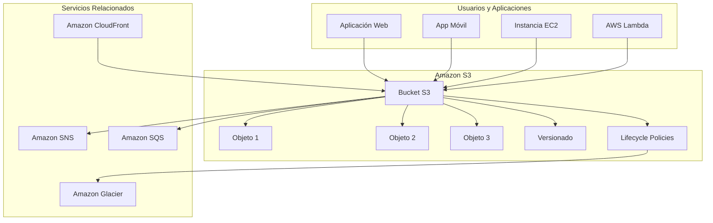
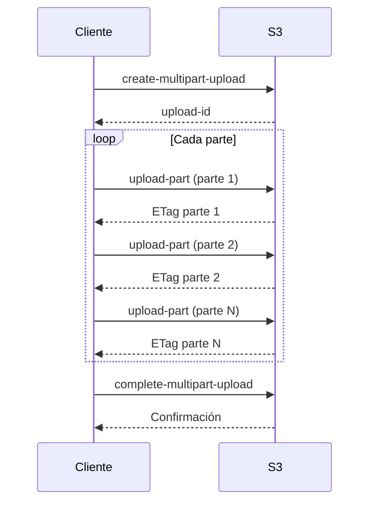
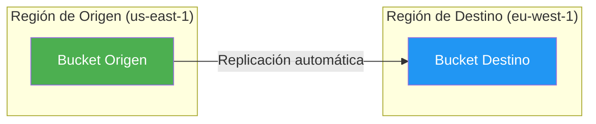

# Amazon S3 - Simple Storage Service

## Tabla de contenidos

- [¿Qué es Amazon S3?](#qué-es-amazon-s3)
- [Conceptos fundamentales](#conceptos-fundamentales)
- [Clases de almacenamiento](#clases-de-almacenamiento)
- [Versionado](#versionado)
- [Políticas de Lifecycle](#políticas-de-lifecycle)
- [Encriptación](#encriptación)
- [Políticas de bucket](#políticas-de-bucket)
- [Access Points](#access-points)
- [S3 Transfer Acceleration](#s3-transfer-acceleration)
- [S3 Event Notifications](#s3-event-notifications)
- [Hosting de sitios web estáticos](#hosting-de-sitios-web-estáticos)
- [S3 Select y Glacier Select](#s3-select-y-glacier-select)
- [Replicación entre regiones](#replicación-entre-regiones)
- [Replicación en la misma región](#replicación-en-la-misma-región)
- [Multipart upload](#multipart-upload)
- [URLs pre-firmadas](#urls-pre-firmadas)
- [Modelo de precios](#modelo-de-precios)
- [Estrategias de optimización de costos](#estrategias-de-optimización-de-costos)
- [Mejores prácticas](#mejores-prácticas)
- [Errores comunes](#errores-comunes)
- [Ejemplos de código](#ejemplos-de-código)
- [Diagramas Mermaid](#diagramas-mermaid)
- [Preguntas frecuentes (FAQ)](#preguntas-frecuentes-faq)
- [Consejos para entrevistas](#consejos-para-entrevistas)
- [Resumen](#resumen)

---

## ¿Qué es Amazon S3?

Amazon Simple Storage Service (S3) es un servicio de almacenamiento de objetos en la nube que ofrece escalabilidad, disponibilidad y seguridad. Pensemos en S3 como **un disco duro ilimitado en el cielo**: no necesitas preocuparte por el espacio, el mantenimiento del hardware ni la infraestructura subyacente. Simplemente subes y recuperas archivos desde cualquier lugar del mundo.

S3 está diseñado para almacenar y recuperar cualquier cantidad de datos desde cualquier lugar, con un rendimiento de clase mundial. Es utilizado por millones de empresas y desarrolladores para casos de uso que van desde sitios web estáticos hasta backups de bases de datos masivas.

### Características principales

| Característica | Descripción |
|----------------|-------------|
| **Escalabilidad** | Almacena desde unos pocos bytes hasta varios petabytes |
| **Durabilidad** | 99.999999999% (11 nueves) de durabilidad |
| **Disponibilidad** | Desde 99.9% hasta 99.99% según la clase de almacenamiento |
| **Seguridad** | Encriptación, políticas de acceso, VPC endpoints |
| **Versatilidad** | Hosting web, backups, data lakes, aplicación móvil |

---

## Conceptos fundamentales

### Buckets

Un **bucket** es un contenedor para objetos almacenados en S3. Es similar a una carpeta raíz en un sistema de archivos. Cada bucket tiene un nombre globalmente único en todas de AWS.

```text
s3://mi-bucket-unico
```

Reglas para los nombres de bucket:
- Debe ser único en todas de AWS (globalmente)
- Entre 3 y 63 caracteres de longitud
- Solo minúsculas, números, guiones y puntos
- No puede comenzar ni terminar con guión
- No puede contener guiones consecutivos (por ejemplo, `--`)
- No puede empezar con `xn--` o `sthl-` (prefijos reservados)

### Objetos

Un **objeto** es la unidad fundamental de datos en S3. Cada objeto consiste en:

- **Key**: La ruta completa del objeto dentro del bucket (incluye prefijo)
- **Value**: Los datos del objeto (hasta 5 TB)
- **Metadata**: Información sobre el objeto (fecha de creación, tamaño, etc.)
- **Version ID**: Identificador único cuando el versionado está habilitado

```text
s3://mi-bucket/imagenes/foto.jpg
       |         |          |
    bucket      key       objeto
```

### Regiones de S3

Los bucket se crean en una **región de AWS** específica. Debes elegir la región más cercana a tus usuarios para minimizar la latencia. Sin embargo, los objetos son accesibles globalmente a través de la URL del bucket.

---

## Clases de almacenamiento

S3 ofrece múltiples clases de almacenamiento optimizadas para diferentes casos de uso. La elección correcta puede reducir significativamente tus costos.

| Clase de almacenamiento | Durabilidad | Disponibilidad | Latencia de acceso | Costo de almacenamiento | Caso de uso ideal |
|--------------------------|-------------|----------------|-------------------|------------------------|-------------------|
| **S3 Standard** | 99.999999999% | 99.99% | Milisegundos | $$$$$ | Datos de acceso frecuente |
| **S3 Standard-IA** | 99.999999999% | 99.9% | Milisegundos | $$$ | Datos accedidos menos frecuentemente |
| **S3 One Zone-IA** | 99.999999999% | 99.5% | Milisegundos | $$ | Datos reconstituibles, copias de seguridad |
| **S3 Glacier Instant Retrieval** | 99.999999999% | 99.9% | Milisegundos | $$$$ | Archivos que se acceden raramente pero necesitan acceso rápido |
| **S3 Glacier Flexible Retrieval** | 99.999999999% | 99.99% | Minutos a horas | $$ | Archivos a largo plazo, backups |
| **S3 Glacier Deep Archive** | 99.999999999% | 99.99% | Horas | $ | Archivos a largo plazo, cumplimiento normativo |

### Detalle de cada clase

#### S3 Standard
La clase predeterminada para datos que se acceden con frecuencia. Ideal para big data, aplicaciones web, contenido de medios y repositorios de código.

#### S3 Standard-Infrequent Access (Standard-IA)
Similar a S3 Standard pero con un costo de almacenamiento más bajo y un costo mayor por recuperación de datos. Ideal para datos que se acceden menos de una vez al mes pero que necesitan acceso de milisegundos.

#### S3 One Zone-Infrequent Access (One Zone-IA)
Almacena datos en una sola zona de disponibilidad, reduciendo el costo. Ideal para datos que pueden ser recreados o que ya tienen una copia en otra ubicación.

#### S3 Glacier Instant Retrieval
Almacén de alto rendimiento para archivos de.archive que necesitan acceso en milisegundos. Costo más bajo que Standard-IA pero con un costo mínimo de recuperación.

#### S3 Glacier Flexible Retrieval
Ideal para backups a largo plazo y archivado. Los tiempos de recuperación van desde minutos hasta horas.

#### S3 Glacier Deep Archive
La opción más económica para datos que necesitan ser retenidos por 7 a 10 años. Tiempos de recuperación de hasta 12 horas.

---

## Versionado

El **versionado** en S3 es como tener una **máquina del tiempo para tus archivos**: cada vez que modificas o eliminas un objeto, S3 guarda una versión anterior.

### ¿Cómo funciona?

Cuando habilitas el versionado en un bucket:

1. Cada vez que subes un objeto con la misma key, S3 crea una nueva versión
2. Las versiones anteriores no se eliminan permanentemente
3. Los identificadores de versión se agregan a la URL del objeto

```text
s3://mi-bucket/archivo.txt?versionId=v1
s3://mi-bucket/archivo.txt?versionId=v2
s3://mi-bucket/archivo.txt?versionId=v3
```

### Estados del versionado

| Estado | Descripción |
|--------|-------------|
| **Habilitado** | S3 crea versiones para todos los objetos |
| **Suspendido** | No se crean nuevas versiones, pero las existentes se mantienen |
| **Sin versionado** | Comportamiento predeterminado, sin historial de versiones |

### Eliminación con versionado habilitado

Cuando el versionado está habilitado, eliminar un objeto crea una **marca de eliminación** (delete marker) en lugar de eliminar el objeto permanentemente. Para restaurar un objeto eliminado, simplemente elimina la marca de eliminación.

```bash
# Eliminar una marca de eliminación para restaurar un objeto
aws s3api delete-object --bucket mi-bucket --key archivo.txt --version-id v2
```

---

## Políticas de Lifecycle

Las políticas de **lifecycle** permiten automatizar la transición de objetos entre clases de almacenamiento y la eliminación de datos obsoletos. Es como programar un **recordatorio automático** para mover o eliminar archivos.

### Ejemplo de política de lifecycle

```json
{
  "Rules": [
    {
      "ID": "Mover a Standard-IA después de 30 días",
      "Status": "Enabled",
      "Filter": {
        "Prefix": "datos/"
      },
      "Transitions": [
        {
          "Days": 30,
          "StorageClass": "STANDARD_IA"
        },
        {
          "Days": 90,
          "StorageClass": "GLACIER"
        },
        {
          "Days": 365,
          "StorageClass": "DEEP_ARCHIVE"
        }
      ],
      "Expiration": {
        "Days": 730
      }
    }
  ]
}
```

### Transiciones disponibles

| Transición | Costo mínimo de almacenamiento | Tiempo mínimo |
|------------|-------------------------------|---------------|
| Standard → Standard-IA | 30 días | 30 días |
| Standard → One Zone-IA | 30 días | 30 días |
| Standard-IA → Glacier | 30 días | 30 días |
| Glacier Flexible → Glacier Deep | 90 días | 90 días |
| Glacier Deep → Eliminación | 180 días | 180 días |

---

## Encriptación

S3 ofrece múltiples opciones de encriptación para proteger tus datos en reposo (at rest) y en tránsito (in transit).

### SSE-S3 (Server-Side Encryption with S3-managed keys)

- AWS gestiona las claves de encriptación
- Cada objeto se encripta con una clave única
- Clave maestra rotada anualmente
- Compatible con HMAC (AWS Signature Version 4)

```json
{
  "Rules": [
    {
      "ApplyServerSideEncryptionByDefault": {
        "SSEAlgorithm": "AES256"
      }
    }
  ]
}
```

### SSE-KMS (Server-Side Encryption with KMS-managed keys)

- Usas AWS Key Management Service (KMS) para gestionar las claves
- Puedes crear y gestionar tus propias claves maestras (CMK)
- Registro de auditoría con AWS CloudTrail
- Control de acceso granular con políticas KMS

```json
{
  "Rules": [
    {
      "ApplyServerSideEncryptionByDefault": {
        "SSEAlgorithm": "aws:kms",
        "KMSMasterKeyID": "arn:aws:kms:us-east-1:123456789012:key/12345678-1234-1234-1234-123456789012"
      }
    }
  ]
}
```

### SSE-C (Server-Side Encryption with Customer-provided keys)

- Tú proporcionas las claves de encriptación
- AWS no almacena las claves
- Debes proporcionar la clave en cada petición de lectura
- Mayor control pero mayor complejidad

### Encriptación del lado del cliente (Client-side)

- Encriptas los datos antes de subirlos a S3
- Tú gestionas las claves completamente
- AWS nunca ve los datos sin encriptar
- Ideal para cumplimiento normativo estricto

### Comparación de opciones de encriptación

| Opción | Gestión de claves | Auditoría | Control de acceso | Complejidad |
|--------|-------------------|-----------|-------------------|-------------|
| SSE-S3 | AWS | Limitada | Predeterminado | Baja |
| SSE-KMS | AWS KMS | Completa | Granular | Media |
| SSE-C | Cliente | Ninguna | Total | Alta |
| Client-side | Cliente | Total | Total | Muy alta |

---

## Políticas de bucket

Las **políticas de bucket** son documentos JSON que definen quién tiene acceso a los objetos del bucket y qué acciones pueden realizar.

### Ejemplo: Permitir lectura pública

```json
{
  "Version": "2012-10-17",
  "Statement": [
    {
      "Sid": "PermitirLecturaPublica",
      "Effect": "Allow",
      "Principal": "*",
      "Action": "s3:GetObject",
      "Resource": "arn:aws:s3:::mi-bucket/*"
    }
  ]
}
```

### Ejemplo: Acceso solo desde una IP específica

```json
{
  "Version": "2012-10-17",
  "Statement": [
    {
      "Sid": "PermitirSoloDesdeIP",
      "Effect": "Allow",
      "Principal": "*",
      "Action": "s3:GetObject",
      "Resource": "arn:aws:s3:::mi-bucket/*",
      "Condition": {
        "IpAddress": {
          "aws:SourceIp": "203.0.113.0/24"
        }
      }
    }
  ]
}
```

### Ejemplo: Acceso a另一个 bucket desde Lambda

```json
{
  "Version": "2012-10-17",
  "Statement": [
    {
      "Sid": "PermitirAccesoLambda",
      "Effect": "Allow",
      "Principal": {
        "Service": "lambda.amazonaws.com"
      },
      "Action": [
        "s3:GetObject",
        "s3:PutObject"
      ],
      "Resource": [
        "arn:aws:s3:::mi-bucket-origen/*",
        "arn:aws:s3:::mi-bucket-destino/*"
      ]
    }
  ]
}
```

---

## Access Points

Los **Access Points** son puntos de acceso simplificados que facilitan el acceso a datos en S3 a través de redes compartidas o VPC específicas. Es como crear **puertas de entrada diferentes** para tu bucket, cada una con sus propias reglas.

### Casos de uso

- **Acceso compartido**: Múltiples equipos acceden al mismo bucket con diferentes permisos
- **Acceso desde VPC**: Restringir acceso a través de endpoints de VPC
- **Aislamiento de datos**: Separar datos de diferentes departamentos

### Crear un Access Point

```bash
aws s3control create-access-point \
  --account-id 123456789012 \
  --name mi-access-point \
  --bucket mi-bucket \
  --public-access-block-configuration \
    BlockPublicAcls=true,IgnorePublicAcls=true,BlockPublicPolicy=true,RestrictPublicBuckets=true
```

---

## S3 Transfer Acceleration

**S3 Transfer Acceleration** usa la red global de edge locations de Amazon CloudFront para acelerar las transferencias de archivos a S3, especialmente cuando los clientes están lejos de la región del bucket.

### ¿Cómo funciona?

En lugar de enviar datos directamente a la región de S3, los datos se envían a la edge location más cercana y luego se transmiten por la red privada de AWS a S3.

```text
Cliente (Europa) → Edge Location (Frankfurt) → Red AWS → S3 (Virginia)
```

### Configurar Transfer Acceleration

```bash
aws s3api put-bucket-accelerate-configuration \
  --bucket mi-bucket \
  --accelerate-configuration Status=Enabled
```

---

## S3 Event Notifications

S3 puede enviar notificaciones cuando ocurren eventos como crear, eliminar o restaurar objetos. Es como configurar **alertas automáticas** para tu bucket.

### Eventos disponibles

| Evento | Descripción |
|--------|-------------|
| `s3:ObjectCreated:*` | Se creó un objeto (put, post, multipart upload) |
| `s3:ObjectCreated:Put` | Se creó un objeto con put |
| `s3:ObjectCreated:Post` | Se creó un objeto con post |
| `s3:ObjectCreated:Copy` | Se copió un objeto |
| `s3:ObjectCreated:CompleteMultipartUpload` | Se completó un multipart upload |
| `s3:ObjectRemoved:*` | Se eliminó un objeto |
| `s3:ObjectRemoved:Delete` | Se eliminó un objeto |
| `s3:ObjectRemoved:DeleteMarkerCreated` | Se creó un marker de eliminación |
| `s3:ObjectRestore:*` | Se restauró un objeto |
| `s3:ObjectRestore:Post` | Se inició una restauración |
| `s3:ObjectRestore:Completed` | Se completó una restauración |
| `s3:ReducedRedundancyLostObject` | Se perdió un objeto RRS |

### Destinos de notificación

- Amazon SNS (Simple Notification Service)
- Amazon SQS (Simple Queue Service)
- AWS Lambda
- Amazon EventBridge

### Ejemplo de configuración con SNS

```json
{
  "TopicConfiguration": [
    {
      "Topic": "arn:aws:sns:us-east-1:123456789012:NotificacionesS3",
      "Event": "s3:ObjectCreated:*",
      "Filter": {
        "Key": {
          "FilterRules": [
            {
              "Name": "prefix",
              "Value": "imagenes/"
            }
          ]
        }
      }
    }
  ]
}
```

---

## Hosting de sitios web estáticos

S3 puede alojar sitios web estáticos (HTML, CSS, JavaScript, imágenes) de forma muy económica y escalable.

### Configuración

```bash
# Habilitar hosting web
aws s3api put-bucket-website \
  --bucket mi-sitio-web \
  --website-configuration '{
    "IndexDocument": {"Suffix": "index.html"},
    "ErrorDocument": {"Key": "error.html"}
  }'

# Habilitar acceso público
aws s3api put-public-access-block \
  --bucket mi-sitio-web \
  --public-access-block-configuration \
    BlockPublicAcls=false,IgnorePublicAcls=false,BlockPublicPolicy=false,RestrictPublicBuckets=false
```

### Política de bucket para hosting web

```json
{
  "Version": "2012-10-17",
  "Statement": [
    {
      "Sid": "PermitirLecturaPublica",
      "Effect": "Allow",
      "Principal": "*",
      "Action": "s3:GetObject",
      "Resource": "arn:aws:s3:::mi-sitio-web/*"
    }
  ]
}
```

### URL del sitio web

```text
http://mi-sitio-web.s3-website-us-east-1.amazonaws.com
```

---

## S3 Select y Glacier Select

**S3 Select** te permite recuperar un subconjunto de datos de un objeto usando expresiones SQL estándar, en lugar de descargar el objeto completo. Es como tener un **motor de consulta SQL** integrado en tu almacenamiento.

### Ejemplo con AWS CLI

```bash
aws s3 select-object-content \
  --bucket mi-bucket \
  --key datos/ventas.csv \
  --input-serialization '{"CSV": {"FileHeaderInfo": "Use"}}' \
  --output-serialization '{"CSV": {}}' \
  --expression "SELECT * FROM s3object WHERE \"precio\" > 100" \
  resultado.txt
```

### Formatos soportados

- CSV
- JSON
- Parquet
- Avro

---

## Replicación entre regiones

La **replicación entre regiones (CRR)** copia automáticamente objetos entre buckets en diferentes regiones de AWS. Es como tener una **copia de seguridad geográfica** de tus datos.

### Casos de uso

- Cumplimiento normativo (los datos deben estar en una región específica)
- Minimizar la latencia para usuarios en diferentes regiones
- Cumplir requisitos de disaster recovery

### Configurar CRR

```bash
# Crear policy de replicación
aws s3api put-bucket-replication \
  --bucket mi-bucket-origen \
  --replication-configuration '{
    "Role": "arn:aws:iam::123456789012:role/rol-replicacion",
    "Rules": [
      {
        "Status": "Enabled",
        "Destination": {
          "Bucket": "arn:aws:s3:::mi-bucket-destino",
          "StorageClass": "STANDARD"
        }
      }
    ]
  }'
```

---

## Replicación en la misma región

La **replicación en la misma región (SRR)** copia automáticamente objetos entre buckets en la misma región de AWS.

### Casos de uso

- Cumplimiento normativo
- Tests de desarrollo
- Separar datos de producción y desarrollo

---

## Multipart upload

El **multipart upload** divide un archivo grande en partes más pequeñas y las sube de forma paralela. Es como mover un mueble grande **desmontándolo por piezas**.

### Ventajas

- **Rendimiento mejorado**: Sube partes en paralelo
- **Resumen desde donde quedó**: Si una parte falla, solo necesitas reintentar esa parte
- **Tamaño máximo**: Archivos hasta 5 TB

### Ejemplo de multipart upload

```bash
# Iniciar multipart upload
aws s3api create-multipart-upload --bucket mi-bucket --key archivo-grande.zip

# Subir partes
aws s3api upload-part --bucket mi-bucket --key archivo-grande.zip \
  --upload-id "upload-id-123" --part-number 1 --body parte1.zip

aws s3api upload-part --bucket mi-bucket --key archivo-grande.zip \
  --upload-id "upload-id-123" --part-number 2 --body parte2.zip

# Completar multipart upload
aws s3api complete-multipart-upload --bucket mi-bucket --key archivo-grande.zip \
  --upload-id "upload-id-123" \
  --multipart-upload '{
    "Parts": [
      {"PartNumber": 1, "ETag": "etag1"},
      {"PartNumber": 2, "ETag": "etag2"}
    ]
  }'
```

---

## URLs pre-firmadas

Las **URLs pre-firmadas** son URLs temporales que permiten acceder a objetos privados sin necesidad de credenciales AWS. Son como **invitaciones temporales** para acceder a un archivo.

### Casos de uso

- Compartir archivos con usuarios externos
- Descargas temporales
- Cargas de archivos por parte de usuarios no autenticados

### Ejemplo con AWS CLI

```bash
# Generar URL pre-firmada válida por 1 hora
aws s3 presign s3://mi-bucket/archivo-secreto.pdf --expires-in 3600

# Resultado:
# https://mi-bucket.s3.us-east-1.amazonaws.com/archivo-secreto.pdf?X-Amz-Algorithm=...
```

### Ejemplo con SDK (Python)

```python
import boto3
from botocore.config import Config

s3 = boto3.client('s3')

# Generar URL pre-firmada para descarga
url = s3.generate_presigned_url(
    'get_object',
    Params={'Bucket': 'mi-bucket', 'Key': 'archivo.pdf'},
    ExpiresIn=3600  # 1 hora
)

print(f"URL de descarga: {url}")
```

---

## Modelo de precios

S3 cobra por:

1. **Almacenamiento**: Por GB almacenado por mes
2. **Solicitudes**: Por cada 1,000 solicitudes (GET, PUT, LIST)
3. **Transferencia de datos**: Por GB transferido fuera de S3
4. **Transfer Acceleration**: Por GB transferido con aceleración
5. **Replicación**: Por GB replicado

### Ejemplo de cálculo de costos

```text
Almacenamiento: 100 GB × $0.023/GB = $2.30/mes
Solicitudes: 100,000 GET × $0.0004/1000 = $0.04/mes
Transferencia: 50 GB × $0.09/GB = $4.50/mes
Total estimado: $6.84/mes
```

---

## Estrategias de optimización de costos

### 1. Usar la clase de almacenamiento correcta

- Datos accedidos frecuentemente → S3 Standard
- Datos accedidos menos de una vez al mes → Standard-IA
- Datos accedidos raramente → Glacier Instant Retrieval
- Archivos a largo plazo → Glacier Flexible o Deep Archive

### 2. Implementar lifecycle policies

```json
{
  "Rules": [
    {
      "ID": "OptimizarCostos",
      "Status": "Enabled",
      "Transitions": [
        {"Days": 30, "StorageClass": "STANDARD_IA"},
        {"Days": 90, "StorageClass": "GLACIER"},
        {"Days": 365, "StorageClass": "DEEP_ARCHIVE"}
      ]
    }
  ]
}
```

### 3. Usar S3 Intelligent-Tiering

S3 Intelligent-Tiering mueve automáticamente los datos entre clases de almacenamiento en función de los patrones de acceso. No hay cargos por monitoreo de acceso ni por transiciones.

### 4. Eliminar datos obsoletos

```bash
# Eliminar objetos antiguos
aws s3 rm s3://mi-bucket/ --recursive --exclude "*" --include "*.log" --older-than 90d
```

---

## Mejores prácticas

### Seguridad

1. **Habilitar versionado**: Protege contra eliminaciones accidentales
2. **Usar encriptación**: SSE-KMS para control granular, SSE-S3 para simplicidad
3. **Implementar políticas de bucket**: Principio de menor privilegio
4. **Habilitar logging**: S3 Access Logs para auditoría
5. **Usar VPC endpoints**: Para acceso privado sin internet

### Rendimiento

1. **Usar prefixes distribuidos**: Evitar hotspots de partición
2. **Multipart upload**: Para archivos mayores a 100 MB
3. **Transfer Acceleration**: Para clientes remotos
4. **Paralelizar subidas**: Usar SDK con multipart upload

### Organización

1. **Usar tags**: Para clasificar y gestionar costos
2. **Implementar lifecycle policies**: Para automatizar la gestión de datos
3. **Usar Access Points**: Para simplificar el acceso multi-equipos
4. **Nombrar buckets consistentemente**: Convención de nombres clara

### Monitoreo

1. **CloudWatch Metrics**: Monitorear métricas de S3
2. **CloudTrail**: Registrar accesos y cambios
3. **S3 Storage Lens**: Analíticas de almacenamiento
4. **Amazon Macie**: Detectar datos sensibles

---

## Errores comunes

### 1. No habilitar versionado

```text
❌ "Subí un archivo incorrecto y no puedo recuperar la versión anterior"
✅ Habilitar versionado desde el principio
```

### 2. No usar lifecycle policies

```text
❌ "Estoy pagando por almacenamiento innecesario"
✅ Implementar lifecycle policies para automatizar la transición
```

### 3. No usar encriptación

```text
❌ "Mis datos están sin encriptar y no cumplen normativas"
✅ Habilitar SSE-KMS o SSE-S3 para todos los buckets
```

### 4. No monitorear costos

```text
❌ "Mi factura de S3 es inesperadamente alta"
✅ Usar AWS Cost Explorer y configurar alertas
```

### 5. Usar buckets públicos innecesariamente

```text
❌ "Mi bucket es público y contiene datos sensibles"
✅ Bloquear acceso público por defecto y usar políticas restrictivas
```

---

## Ejemplos de código

### Ejemplo 1: AWS CLI - Operaciones básicas de S3

```bash
# Crear bucket
aws s3 mb s3://mi-nuevo-bucket

# Subir archivo
aws s3 cp archivo.txt s3://mi-bucket/archivo.txt

# Subir directorio completo
aws s3 cp ./mi-directorio s3://mi-bucket/mi-directorio --recursive

# Listar objetos
aws s3 ls s3://mi-bucket/

# Listar con detalles
aws s3 ls s3://mi-bucket/ --recursive --human-readable

# Copiar entre buckets
aws s3 cp s3://bucket-origen/archivo.txt s3://bucket-destino/archivo.txt

# Eliminar objeto
aws s3 rm s3://mi-bucket/archivo-antiguo.txt

# Eliminar todos los objetos del bucket
aws s3 rm s3://mi-bucket/ --recursive

# Sincronizar directorio local con bucket
aws s3 sync ./mi-directorio s3://mi-bucket/mi-directorio

# Sincronizar bucket con directorio local
aws s3 sync s3://mi-bucket/mi-directorio ./mi-directorio-local

# Verificar tamaño del bucket
aws s3 ls s3://mi-bucket/ --recursive --summarize
```

### Ejemplo 2: SDK (Node.js) - Subir y descargar archivos

```javascript
const { S3Client, PutObjectCommand, GetObjectCommand, 
        ListObjectsV2Command, DeleteObjectCommand } = require('@aws-sdk/client-s3');
const { getSignedUrl } = require('@aws-sdk/s3-request-presigner');
const fs = require('fs');

const s3Client = new S3Client({ region: 'us-east-1' });

async function subirArchivo(bucketName, key, filePath) {
    const fileContent = fs.readFileSync(filePath);
    
    const command = new PutObjectCommand({
        Bucket: bucketName,
        Key: key,
        Body: fileContent,
        ContentType: 'application/pdf'
    });
    
    const response = await s3Client.send(command);
    console.log('Archivo subido:', response.Location);
    return response;
}

async function descargarArchivo(bucketName, key, outputPath) {
    const command = new GetObjectCommand({
        Bucket: bucketName,
        Key: key
    });
    
    const response = await s3Client.send(command);
    const body = await response.Body.transformToByteArray();
    fs.writeFileSync(outputPath, body);
    console.log('Archivo descargado:', outputPath);
}

async function listarObjetos(bucketName, prefix = '') {
    const command = new ListObjectsV2Command({
        Bucket: bucketName,
        Prefix: prefix
    });
    
    const response = await s3Client.send(command);
    response.Contents.forEach(obj => {
        console.log(`${obj.Key} - ${obj.Size} bytes - ${obj.LastModified}`);
    });
    return response.Contents;
}

async function generarUrlPreFirmada(bucketName, key, expiresIn = 3600) {
    const command = new GetObjectCommand({
        Bucket: bucketName,
        Key: key
    });
    
    const url = await getSignedUrl(s3Client, command, { expiresIn });
    console.log('URL pre-firmada:', url);
    return url;
}

// Ejemplo de uso
async function main() {
    await subirArchivo('mi-bucket', 'docs/informe.pdf', './informe.pdf');
    await listarObjetos('mi-bucket', 'docs/');
    await generarUrlPreFirmada('mi-bucket', 'docs/informe.pdf');
    await descargarArchivo('mi-bucket', 'docs/informe.pdf', './descarga.pdf');
}

main().catch(console.error);
```

### Ejemplo 3: AWS CLI - Configurar lifecycle y encriptación

```bash
# Crear política de lifecycle
cat > lifecycle-policy.json << 'EOF'
{
  "Rules": [
    {
      "ID": "LifecyclePolicy",
      "Status": "Enabled",
      "Filter": {
        "Prefix": "datos/"
      },
      "Transitions": [
        {
          "Days": 30,
          "StorageClass": "STANDARD_IA"
        },
        {
          "Days": 90,
          "StorageClass": "GLACIER"
        }
      ],
      "Expiration": {
        "Days": 365
      }
    }
  ]
}
EOF

# Aplicar política de lifecycle
aws s3api put-bucket-lifecycle-configuration \
  --bucket mi-bucket \
  --lifecycle-configuration file://lifecycle-policy.json

# Habilitar encriptación SSE-KMS
cat > encryption-policy.json << 'EOF'
{
  "Rules": [
    {
      "ApplyServerSideEncryptionByDefault": {
        "SSEAlgorithm": "aws:kms",
        "KMSMasterKeyID": "arn:aws:kms:us-east-1:123456789012:key/12345678-1234-1234-1234-123456789012"
      },
      "BucketKeyEnabled": true
    }
  ]
}
EOF

# Aplicar encriptación
aws s3api put-bucket-encryption \
  --bucket mi-bucket \
  --server-side-encryption-configuration file://encryption-policy.json

# Verificar configuración
aws s3api get-bucket-lifecycle-configuration --bucket mi-bucket
aws s3api get-bucket-encryption --bucket mi-bucket
```

---

## Diagramas Mermaid

### Arquitectura general de S3



### Flujo de multipart upload



### Flujo de replicación entre regiones



---

## Preguntas frecuentes (FAQ)

### ¿Cuál es el tamaño máximo de un objeto en S3?
El tamaño máximo de un objeto en S3 es **5 TB** (terabytes). Sin embargo, para objetos mayores a 5 GB, se recomienda usar multipart upload.

### ¿S3 es compatible con versionado?
Sí, S3 soporta versionado. Cuando el versionado está habilitado, cada vez que subes un objeto con la misma key, S3 crea una nueva versión en lugar de sobrescribir la anterior.

### ¿Puedo acceder a S3 desde Internet?
Sí, S3 es accesible desde Internet a través de la API de REST de S3, la consola de AWS, la CLI de AWS y los SDKs de AWS.

### ¿Cuánto cuesta S3?
Los costos varían según la clase de almacenamiento, la región y el volumen de datos. Consulta la [página de precios de S3](https://aws.amazon.com/s3/pricing/) para obtener información actualizada.

### ¿S3 es adecuado para bases de datos?
S3 no está diseñado para bases de datos transaccionales. Es ideal para almacenamiento de objetos, archivos estáticos, backups y data lakes. Para bases de datos, considera Amazon RDS, DynamoDB o Aurora.

### ¿Puedo mover datos entre clases de almacenamiento?
Sí, puedes mover datos entre clases de almacenamiento manualmente o usar lifecycle policies para automatizar las transiciones.

### ¿S3 es seguro?
S3 ofrece múltiples capas de seguridad: encriptación (SSE-S3, SSE-KMS, SSE-C), políticas de bucket, VPC endpoints, IAM, y más. AWS cumple con múltiples certificaciones de seguridad y cumplimiento normativo.

### ¿Puedo usar S3 para hosting web?
Sí, S3 puede alojar sitios web estáticos (HTML, CSS, JavaScript). Para sitios web dinámicos, considera usar Amazon EC2, ECS o Lambda.

### ¿Cuál es la diferencia entre S3 y Glacier?
S3 Standard es para datos accedidos frecuentemente con acceso de milisegundos. Glacier es para archivado a largo plazo con tiempos de acceso desde minutos hasta horas. Glacier es significativamente más económico que S3 Standard.

### ¿Puedo copiar datos entre buckets?
Sí, puedes copiar datos entre buckets usando la CLI, la consola o el SDK. También puedes configurar replicación automática entre buckets.

---

## Consejos para entrevistas

### Preguntas técnicas comunes

1. **¿Cuál es la diferencia entre S3, EBS y EFS?**
   - S3: Almacenamiento de objetos, acceso web, escalabilidad ilimitada
   - EBS: Almacenamiento de bloques, para EC2, bajo latencia
   - EFS: Sistema de archivos, compartido entre múltiples EC2

2. **¿Qué es la replicación CRR y cuándo usarla?**
   - CRR (Cross-Region Replication) copia automáticamente objetos entre buckets en diferentes regiones
   - Usar para cumplimiento normativo, disaster recovery y reducir latencia

3. **¿Cómo protegerías un bucket S3 de acceso no autorizado?**
   - Habilitar bloqueo de acceso público
   - Usar políticas de bucket restrictivas
   - Implementar encriptación
   - Habilitar versionado y logging
   - Usar VPC endpoints

4. **¿Cuándo usarías multipart upload?**
   - Para archivos mayores a 100 MB
   - Para mejorar el rendimiento de subida
   - Para reanudar uploads fallidos

5. **¿Qué es S3 Intelligent-Tiering?**
   - Clase de almacenamiento que mueve automáticamente datos entre tiers en función de patrones de acceso
   - Sin cargos por monitoreo o transiciones

### Buenas respuestas

- Siempre menciona la **durabilidad de 11 nueves** de S3
- Explica la diferencia entre las **clases de almacenamiento**
- Describe cómo el **versionado** protege contra eliminaciones accidentales
- Menciona **lifecycle policies** para optimizar costos
- Habla sobre **encriptación** y **políticas de acceso**

---

## Resumen

Amazon S3 es el servicio de almacenamiento de objetos más utilizado en la nube. Aquí están los puntos clave:

| Concepto | Descripción |
|----------|-------------|
| **Buckets** | Contenedores para objetos con nombres globalmente únicos |
| **Objetos** | Unidades de datos con key, value y metadata |
| **Storage Classes** | 6 clases optimizadas para diferentes casos de uso |
| **Versionado** | Historial de versiones de objetos |
| **Lifecycle Policies** | Automatización de transición y eliminación |
| **Encriptación** | SSE-S3, SSE-KMS, SSE-C, client-side |
| **Replicación** | CRR y SRR para copias automáticas |
| **Event Notifications** | Notificaciones automáticas de eventos |
| **Websites** | Hosting de sitios web estáticos |
| **Costos** | Optimizar con clases correctas y lifecycle |

### Checklist de implementación

- [ ] Crear bucket con nombre único
- [ ] Habilitar versionado
- [ ] Configurar encriptación
- [ ] Implementar políticas de bucket
- [ ] Crear lifecycle policies
- [ ] Configurar logging de acceso
- [ ] Implementar monitoreo con CloudWatch
- [ ] Configurar alertas de costos
- [ ] Documentar políticas de acceso
- [ ] Realizar pruebas de recuperación

---

*Última actualización: 2024*
