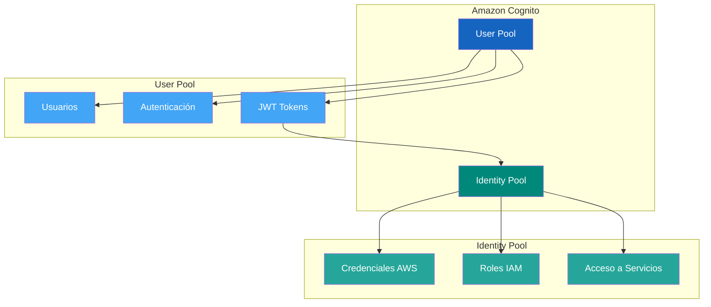
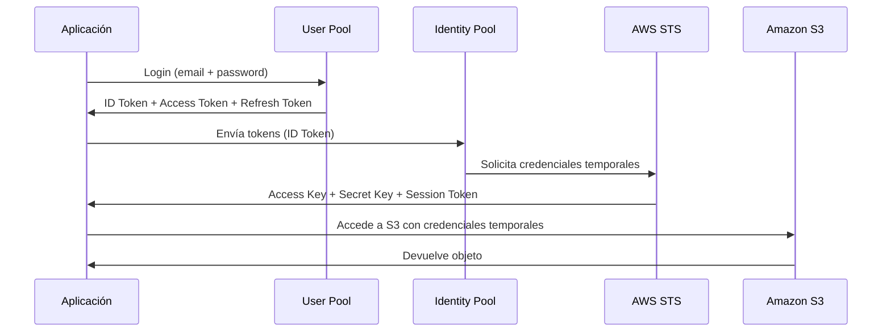
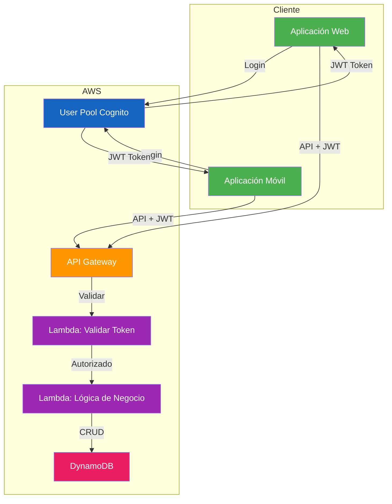

# Amazon Cognito

Amazon Cognito es el servicio de AWS para gestionar la autenticación y autorización de usuarios en aplicaciones web y móviles. Proporciona un directorio de usuarios, autenticación con proveedores sociales, y tokens de acceso para interactuar con servicios de AWS.

---

## ¿Qué es Amazon Cognito?

Cognito resuelve dos problemas fundamentales:

1. **User Pools (Pools de Usuarios)** - Directorio de usuarios con funcionalidades de autenticación, registro, recuperación de contraseña y verificación de email.
2. **Identity Pools (Pools de Identidad)** - Proporcionan credenciales temporales de AWS para acceder a servicios como S3, DynamoDB o Lambda.



---

## Autenticación vs Autorización

| Concepto | Autenticación | Autorización |
|----------|--------------|--------------|
| Pregunta | ¿Quién eres? | ¿Qué puedes hacer? |
| Mecanismo | Login, contraseña, MFA | Políticas, permisos, roles |
| Token | ID Token (quién soy) | Access Token (qué puedo hacer) |
| Ejemplo | Login con email/password | Acceso a S3 bucket específico |

---

## User Pools

Un User Pool es un directorio de usuarios que proporciona funcionalidades de registro y autenticación.

### Funcionalidades principales

| Funcionalidad | Descripción |
|---------------|-------------|
| Registro de usuarios | Formulario personalizado o hosteado |
| Login | Email/contraseña, nombre de usuario/contraseña |
| Recuperación de contraseña | Email con enlace de restablecimiento |
| Verificación de email | Código de verificación por email |
| MFA | App virtual o SMS |
| Bloqueo de cuentas | Después de intentos fallidos |
| Federación social | Google, Facebook, Apple, Amazon |
| SAML | Integración con Active Directory |
| Lambda Triggers | Personalización del flujo |

### Crear un User Pool

```bash
# Crear un User Pool con AWS CLI
aws cognito-idp create-user-pool \
    --pool-name "MiAppUsuarios" \
    --policies '{
        "PasswordPolicy": {
            "MinimumLength": 12,
            "RequireUppercase": true,
            "RequireLowercase": true,
            "RequireNumbers": true,
            "RequireSymbols": true
        }
    }' \
    --auto-verified-attributes email \
    --username-attributes email \
    --mfa-configuration "ON" \
    --enabled-mfas SOFTWARE_TOKEN_MFA \
    --schema '[
        {
            "Name": "email",
            "Required": true,
            "Mutable": true
        },
        {
            "Name": "name",
            "Required": true,
            "Mutable": true
        },
        {
            "Name": "custom:department",
            "AttributeDataType": "String",
            "Mutable": true
        }
    ]'
```

### Clientes de App

```bash
# Crear un cliente de app (sin secreto de cliente)
aws cognito-idp create-user-pool-client \
    --user-pool-id <USER_POOL_ID> \
    --client-name "MiAppWeb" \
    --generate-secret=false \
    --explicit-auth-flows ALLOW_USER_SRP_AUTH ALLOW_REFRESH_TOKEN_AUTH \
    --supported-identity-providers COGNITO \
    --callback-urls "https://midominio.com/callback" \
    --logout-urls "https://midominio.com/logout" \
    --allowed-o-auth-flows authorization_code \
    --allowed-o-auth-scopes openid email profile \
    --allowed-o-auth-flows-user-pool-client
```

---

## Identity Pools

Un Identity Pool permite intercambiar tokens de autenticación (JWT) por credenciales temporales de AWS.

### Funcionalidades

| Funcionalidad | Descripción |
|---------------|-------------|
| Credenciales anónimas | Acceso sin autenticación previa |
| Credenciales autenticadas | Después de login en User Pool |
| Federación social | Tokens de Google, Facebook |
| Roles IAM | Diferentes permisos por usuario |
| Mapeo de identidades | Un usuario puede tener múltiples identidades |



### Configurar un Identity Pool

```bash
# Crear Identity Pool
aws cognito-identity create-identity-pool \
    --identity-pool-name "MiAppIdentityPool" \
    --allow-unauthenticated-identities=false \
    --cognito-identity-providers '[{
        "ProviderName": "cognito-idp.us-east-1.amazonaws.com/<USER_POOL_ID>",
        "ClientId": "<APP_CLIENT_ID>",
        "ServerSideTokenCheck": true
    }]'

# Configurar roles IAM para Identity Pool
aws cognito-identity set-identity-pool-roles \
    --identity-pool-id <IDENTITY_POOL_ID> \
    --roles '{
        "authenticated": "arn:aws:iam::<ACCOUNT_ID>:role/CognitoAuthenticatedRole",
        "unauthenticated": "arn:aws:iam::<ACCOUNT_ID>:role/CognitoUnauthenticatedRole"
    }'
```

---

## Tokens JWT

Cognito emite tres tokens después de la autenticación exitosa:

| Token | Uso | Contenido | Validez |
|-------|-----|-----------|---------|
| ID Token | Identidad del usuario | Claims del usuario (email, nombre, etc.) | 1 hora |
| Access Token | Autorización a APIs | Scopes, cliente, usuario | 1 hora |
| Refresh Token | Renovar tokens | Referencia para obtener nuevos tokens | 30 días |

### Estructura del ID Token

```json
{
    "sub": "uuid-del-usuario",
    "email": "usuario@ejemplo.com",
    "email_verified": true,
    "name": "Juan García",
    "cognito:username": "juan.garcia",
    "cognito:groups": ["admin", "usuarios"],
    "custom:department": "Ingeniería",
    "iss": "https://cognito-idp.us-east-1.amazonaws.com/us-east-1_xxxxx",
    "aud": "1234567890abcdef",
    "token_use": "id",
    "auth_time": 1234567890,
    "exp": 1234571490,
    "iat": 1234567890
}
```

### Ejemplo de validación de token

```python
import jwt
import requests

def validate_token(token, user_pool_id, region='us-east-1'):
    url = f'https://cognito-idp.{region}.amazonaws.com/{user_pool_id}/.well-known/jwks.json'
    jwks = requests.get(url).json()
    
    # Decodificar header del JWT
    header = jwt.get_unverified_header(token)
    kid = header['kid']
    
    # Encontrar la clave pública
    key = None
    for jwk in jwks['keys']:
        if jwk['kid'] == kid:
            key = jwk
            break
    
    if not key:
        raise Exception('Clave pública no encontrada')
    
    # Validar el token
    payload = jwt.decode(
        token,
        key,
        algorithms=['RS256'],
        audience='tu-app-client-id',
        issuer=f'https://cognito-idp.{region}.amazonaws.com/{user_pool_id}'
    )
    
    return payload
```

---

## Hosted UI

El Hosted UI es una página de login pre-construida que puede personalizar.

### Configurar Hosted UI

```bash
# Habilitar dominio del Hosted UI
aws cognito-idp create-user-pool-domain \
    --domain "mi-app-auth" \
    --user-pool-id <USER_POOL_ID>

# URL del Hosted UI
# https://mi-app-auth.auth.us-east-1.amazoncognito.com
```

### URLs del Hosted UI

| URL | Descripción |
|-----|-------------|
| `/login` | Página de inicio de sesión |
| `/signup` | Página de registro |
| `/oauth2/authorize` | Iniciar flujo OAuth 2.0 |
| `/oauth2/token` | Intercambiar código por tokens |
| `/logout` | Cerrar sesión |
| `/oauth2/revoke` | Revocar refresh token |

---

## Social Sign-In

Cognito soporta autenticación con proveedores sociales populares.

### Configurar Google

```mermaid
graph LR
    A[Usuario] -->|Click "Login con Google"| B[Hosted UI Cognito]
    B -->|Redirect| C[Google OAuth]
    C -->|Consentimiento| D[Google emite token]
    D -->|Redirect| Cognito
    Cognito -->|Valida token| E[User Pool]
    E -->|Emite JWT| F[Aplicación]
    
    style A fill:#4CAF50,color:#fff
    style B fill:#1565C0,color:#fff
    style C fill:#EA4335,color:#fff
    style D fill:#EA4335,color:#fff
    style E fill:#FF9800,color:#fff
    style F fill:#9C27B0,color:#fff
```

### Configurar Google Identity Provider

```bash
# Crear proveedor de identidad Google
aws cognito-idp create-identity-provider \
    --user-pool-id <USER_POOL_ID> \
    --provider-name Google \
    --provider-type Google \
    --provider-details '{
        "client_id": "tu-google-client-id.apps.googleusercontent.com",
        "client_secret": "tu-google-client-secret",
        "authorize_scopes": "openid email profile"
    }' \
    --attribute-mapping '{
        "email": "email",
        "name": "name",
        "picture": "picture"
    }'

# Configurar cliente de app para usar Google
aws cognito-idp update-user-pool-client \
    --user-pool-id <USER_POOL_ID> \
    --client-id <APP_CLIENT_ID> \
    --supported-identity-providers COGNITO Google \
    --provider-details '{
        "Google": "tu-google-client-id"
    }'
```

### Configurar Facebook

```bash
# Crear proveedor de identidad Facebook
aws cognito-idp create-identity-provider \
    --user-pool-id <USER_POOL_ID> \
    --provider-name Facebook \
    --provider-type Facebook \
    --provider-details '{
        "client_id": "tu-facebook-app-id",
        "client_secret": "tu-facebook-app-secret",
        "authorize_scopes": "public_profile,email"
    }' \
    --attribute-mapping '{
        "email": "email",
        "name": "name",
        "picture": "picture"
    }'
```

### Configurar Apple

```bash
# Crear proveedor de identidad Apple
aws cognito-idp create-identity-provider \
    --user-pool-id <USER_POOL_ID> \
    --provider-name SignInWithApple \
    --provider-type SignInWithApple \
    --provider-details '{
        "client_id": "com.tuapp.serviceid",
        "team_id": "tu-team-id",
        "key_id": "tu-key-id",
        "private_key": "tu-private-key",
        "authorize_scopes": "name email"
    }' \
    --attribute-mapping '{
        "email": "email",
        "name": "name"
    }'
```

---

## Custom Authentication Flows

Cognito permite personalizar el flujo de autenticación mediante Lambda Triggers.

### Lambda Triggers disponibles

| Trigger | Momento | Uso |
|---------|---------|-----|
| Pre Authentication | Antes de autenticar | Bloquear usuarios, validar reglas |
| Post Authentication | Después de autenticar | Logging, actualización de perfil |
| Pre Sign-up | Antes de registrar | Validar datos, aprobar automáticamente |
| Post Confirmation | Después de confirmar | Crear recursos, enviar bienvenida |
| Define Auth Challenge | Definir desafío | Autenticación personalizada |
| Create Auth Challenge | Crear desafío | Generar código, pregunta |
| Verify Auth Challenge | Verificar desafío | Validar respuesta |
| Pre Token Generation | Antes de emitir token | Modificar claims del token |
| User Migration | Migrar usuario | Autenticar desde sistema externo |
| Custom Message | Mensajes personalizados | Email, SMS personalizados |

### Ejemplo de Lambda Trigger - Pre Sign-up

```python
import boto3

def handler(event, context):
    """
    Lambda trigger para pre-sign-up.
    Auto-confirma usuarios con dominio corporativo.
    """
    email = event['request']['userAttributes']['email']
    domain = email.split('@')[1]
    
    # Auto-confirmar usuarios corporativos
    allowed_domains = ['empresa.com', 'startup.io']
    
    if domain in allowed_domains:
        event['response']['autoConfirmUser'] = True
        event['response']['autoVerifyEmail'] = True
    
    return event
```

### Ejemplo de Custom Authentication Flow

```python
import boto3
import random
import hashlib

client = boto3.client('cognito-idp')

def define_auth_challenge(event, context):
    """Define el flujo de autenticación personalizado."""
    if event['request']['session'] == []:
        # Primer paso: pedir código SMS
        event['response']['challengeName'] = 'CUSTOM_CHALLENGE'
        event['response']['issueTokens'] = False
        event['response']['failAuthentication'] = False
    else:
        last_challenge = event['request']['session'][-1]
        if last_challenge['challengeResult'] == True:
            # Desafío respondido correctamente
            event['response']['issueTokens'] = True
            event['response']['failAuthentication'] = False
        else:
            # Desafío fallido
            event['response']['issueTokens'] = False
            event['response']['failAuthentication'] = True
    
    return event

def create_auth_challenge(event, context):
    """Crea el desafío (código SMS)."""
    if event['request']['challengeMetadata'] == 'SMS':
        code = str(random.randint(100000, 999999))
        # Guardar código en DynamoDB o similar
        # Enviar SMS con el código
    return event

def verify_auth_challenge(event, context):
    """Verifica la respuesta del desafío."""
    # Comparar respuesta con código almacenado
    event['response']['answerCorrect'] = True
    return event
```

---

## Integración con API Gateway y Lambda

### Arquitectura completa



### Authorizer de Cognito en API Gateway

```bash
# Crear authorizer de Cognito
aws apigateway create-authorizer \
    --rest-api-id <REST_API_ID> \
    --name "CognitoAuthorizer" \
    --type COGNITO_USER_POOLS \
    --provider-arns "arn:aws:cognito-idp:us-east-1:<ACCOUNT_ID>:userpool/<USER_POOL_ID>" \
    --identity-source "method.request.header.Authorization"

# Asociar authorizer al método
aws apigateway update-method \
    --rest-api-id <REST_API_ID> \
    --resource-id <RESOURCE_ID> \
    --http-method GET \
    --patch-operations \
        op=replace,path=/authorizationType,value=COGNITO_USER_POOLS \
        op=replace,path=/authorizerId,value=<AUTHORIZER_ID>
```

### Lambda Authorizer (Custom Authorizer)

```python
import json
import jwt

def lambda_handler(event, context):
    """
    Lambda Authorizer para validar tokens JWT.
    """
    token = event['authorizationToken']
    
    try:
        # Remover prefijo Bearer
        if token.startswith('Bearer '):
            token = token[7:]
        
        # Decodificar y validar JWT
        payload = jwt.decode(
            token,
            'tu-public-key',
            algorithms=['RS256'],
            audience='tu-app-client-id',
            issuer='https://cognito-idp.us-east-1.amazonaws.com/<USER_POOL_ID>'
        )
        
        # Construir política de autorización
        return generate_policy(
            payload['sub'],
            'Allow',
            event['methodArn'],
            context={
                'userId': payload['sub'],
                'email': payload.get('email'),
                'groups': payload.get('cognito:groups', [])
            }
        )
    
    except Exception as e:
        raise Exception('Unauthorized')

def generate_policy(principal_id, effect, resource, context=None):
    """Genera política de autorización para API Gateway."""
    policy = {
        'principalId': principal_id,
        'policyDocument': {
            'Version': '2012-10-17',
            'Statement': [{
                'Action': 'execute-api:Invoke',
                'Effect': effect,
                'Resource': resource
            }]
        }
    }
    
    if context:
        policy['context'] = context
    
    return policy
```

---

## Códigos de Ejemplo - Almacenar y Recuperar Secretos

### Registro de usuario con AWS SDK

```python
import boto3

client = boto3.client('cognito-idp', region_name='us-east-1')

def registrar_usuario(email, password, nombre):
    """Registra un nuevo usuario en el User Pool."""
    response = client.sign_up(
        ClientId='tu-app-client-id',
        Username=email,
        Password=password,
        UserAttributes=[
            {'Name': 'email', 'Value': email},
            {'Name': 'name', 'Value': nombre}
        ]
    )
    return response

def confirmar_usuario(email, codigo):
    """Confirma el registro con el código de verificación."""
    response = client.confirm_sign_up(
        ClientId='tu-app-client-id',
        Username=email,
        ConfirmationCode=codigo
    )
    return response

def iniciar_sesion(email, password):
    """Inicia sesión y retorna tokens."""
    response = client.initiate_auth(
        ClientId='tu-app-client-id',
        AuthFlow='USER_SRP_AUTH',
        AuthParameters={
            'USERNAME': email,
            'SRP_A': 'valor-srp-a'
        }
    )
    return response
```

### JavaScript - Frontend

```javascript
import { Amplify } from 'aws-amplify';
import { signIn, signUp, confirmSignUp, signOut } from 'aws-amplify/auth';

// Configurar Amplify
Amplify.configure({
    Auth: {
        Cognito: {
            userPoolId: 'us-east-1_xxxxxxxx',
            userPoolClientId: '1234567890abcdef',
            loginWith: {
                email: true,
                oauth: {
                    domain: 'mi-app-auth.auth.us-east-1.amazoncognito.com',
                    scopes: ['openid', 'email', 'profile'],
                    redirectSignIn: ['https://midominio.com/callback'],
                    redirectSignOut: ['https://midominio.com/']
                }
            }
        }
    }
});

// Registrar usuario
async function registrar(email, password) {
    try {
        const result = await signUp({
            username: email,
            password: password,
            options: {
                userAttributes: {
                    email: email,
                    name: 'Juan García'
                }
            }
        });
        console.log('Registro exitoso:', result);
    } catch (error) {
        console.error('Error:', error);
    }
}

// Iniciar sesión
async function login(email, password) {
    try {
        const result = await signIn({
            username: email,
            password: password
        });
        console.log('Login exitoso:', result);
    } catch (error) {
        console.error('Error:', error);
    }
}
```

---

## Mejores Prácticas de Seguridad

### 1. Configurar políticas de contraseña robustas

```bash
aws cognito-idp update-user-pool \
    --user-pool-id <USER_POOL_ID> \
    --policies '{
        "PasswordPolicy": {
            "MinimumLength": 12,
            "RequireUppercase": true,
            "RequireLowercase": true,
            "RequireNumbers": true,
            "RequireSymbols": true
        }
    }' \
    --account-recovery-setting '{
        "RecoveryMechanisms": [
            {
                "Priority": 1,
                "Name": "verified_email"
            }
        ]
    }'
```

### 2. Habilitar MFA obligatorio

```bash
aws cognito-idp set-user-pool-mfa-config \
    --user-pool-id <USER_POOL_ID> \
    --mfa-configuration "ON" \
    --sms-mfa-configuration '{
        "SmsAuthenticationMessage": "Tu código es {####}",
        "SmsVerificationMessage": "Tu código de verificación es {####}"
    }' \
    --software-token-mfa-configuration '{"Enabled": true}'
```

### 3. Configurar Advanced Security

```bash
aws cognito-idp update-user-pool \
    --user-pool-id <USER_POOL_ID> \
    --user-pool-add-ons '{
        "AdvancedSecurityMode": "ENFORCED"
    }'
```

### 4. Proteger el cliente de app

```javascript
// NUNCA exponer el secreto del cliente en frontend
// En aplicaciones web, usar SRP sin secreto

// MAL - Exponer secreto
const clientSecret = '1234567890abcdef'; // NUNCA hacer esto

// BIEN - Sin secreto en frontend
const config = {
    userPoolId: 'us-east-1_xxxxxxxx',
    userPoolClientId: '1234567890abcdef'
    // No hay clientSecret en frontend
};
```

### 5. Rotar tokens regularmente

```python
# Configurar refresh token validation
import time

def is_token_expired(expires_at):
    """Verifica si un token ha expirado."""
    return time.time() > expires_at

def refresh_tokens(refresh_token, user_pool_id, client_id):
    """Renueva tokens usando el refresh token."""
    client = boto3.client('cognito-idp')
    
    response = client.initiate_auth(
        ClientId=client_id,
        AuthFlow='REFRESH_TOKEN_AUTH',
        AuthParameters={
            'REFRESH_TOKEN': refresh_token
        }
    )
    
    return response['AuthenticationResult']
```

---

## Cuando Usar vs No Usar Cognito

| Usar Cognito cuando | No usar Cognito cuando |
|---------------------|----------------------|
| App web o móvil con usuarios propios | Acceso a servicios AWS desde Lambda/EC2 |
| Necesita autenticación social (Google, Facebook) | Usa Active Directory corporativo (usar IAM Identity Center) |
| Escalabilidad elástica de usuarios | Requisitos de autenticación muy customizados |
| Integración con API Gateway | Solo necesita roles para servicios AWS |
| Costos bajos (100K usuarios gratis/mes) | Ya tiene un sistema de identidad propio |

---

## Pricing

| Componente | Costo |
|------------|-------|
| User Pools - Usuarios activos mensuales | Gratis hasta 50,000 (nivel gratuito), luego $0.0055/usuario/mes |
| Identity Pools - Usuarios activos mensuales | Gratis hasta 50,000 (nivel gratuito), luego $0.0055/usuario/mes |
| Auth Requests | Gratis hasta 50,000/mes |
| Advanced Security | $0.05/acto de autenticación (opcional) |
| SMS MFA | Costos de SMS de AWS |

---

## Preguntas Frecuentes (FAQ)

### ¿Cuál es la diferencia entre User Pool e Identity Pool?

Un User Pool es un directorio de usuarios que maneja autenticación (login, registro, contraseñas). Un Identity Pool proporciona credenciales temporales de AWS. Puede usar ambos juntos: login en User Pool → tokens JWT → Identity Pool → credenciales AWS.

### ¿Puedo migrar usuarios de otro sistema a Cognito?

Sí, usando el trigger `User Migration`. Puede validar credenciales contra su sistema actual y crear usuarios automáticamente en Cognito.

### ¿Cognito es gratis?

Sí hasta cierto límite: 50,000 usuarios activos mensuales y 50,000 actos de autenticación por mes son gratuitos. Más allá, cuesta $0.0055/usuario/mes.

### ¿Puedo personalizar el Hosted UI?

Sí, puede personalizar colores, logos, y mensajes. También puede usar su propio dominio personalizado.

### ¿Cómo funciona la federación con proveedores sociales?

Cognito actúa como proxy: el usuario se autentica con el proveedor (Google, Facebook, etc.), Cognito valida el token, y emite sus propios tokens JWT de Cognito.

### ¿Puedo usar Cognito con applications móviles?

Sí, AWS Amplify SDK facilita la integración con apps iOS, Android, React Native, Flutter, y más.

### ¿Qué sucede si un usuario es comprometido?

Puede inhabilitar el usuario inmediatamente, forzar cambio de contraseña, o revocar todos los tokens usando la API de Cognito.

---

## Resumen

Amazon Cognito es la solución de AWS para autenticación y autorización en aplicaciones modernas:

- **User Pools**: Directorio de usuarios con autenticación, registro, MFA y recuperación de contraseña
- **Identity Pools**: Credenciales temporales de AWS para acceder a servicios
- **JWT Tokens**: ID Token (identidad), Access Token (autorización), Refresh Token (renovación)
- **Social Sign-In**: Integración con Google, Facebook, Apple y más
- **Lambda Triggers**: Personalización completa del flujo de autenticación
- **Hosted UI**: Página de login pre-construida y personalizable
- **Integración**: API Gateway, Lambda, Amplify SDK para apps web y móviles
- **Seguridad**: MFA, Advanced Security, políticas de contraseña robustas
- **Costos**: 50K usuarios/mes gratis, luego $0.0055/usuario/mes

Cognito es ideal para aplicaciones que necesitan un sistema de autenticación escalable, seguro y con integración nativa con servicios de AWS.
