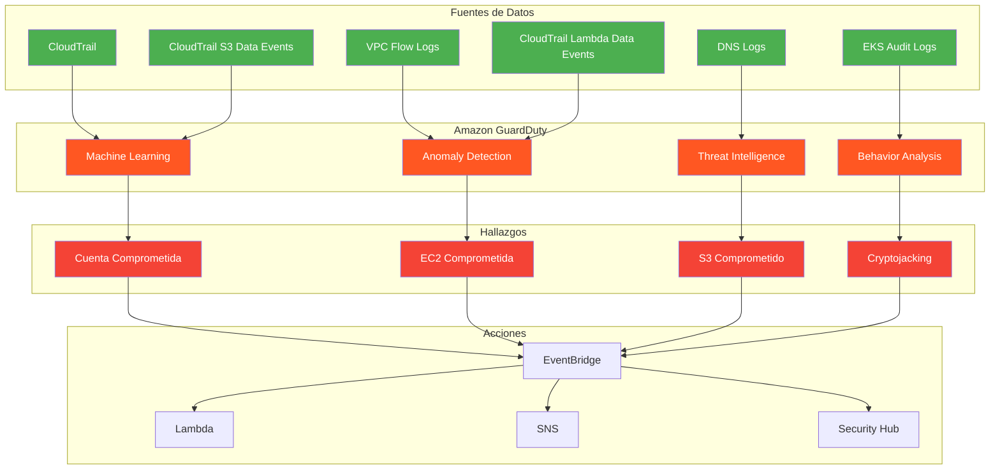
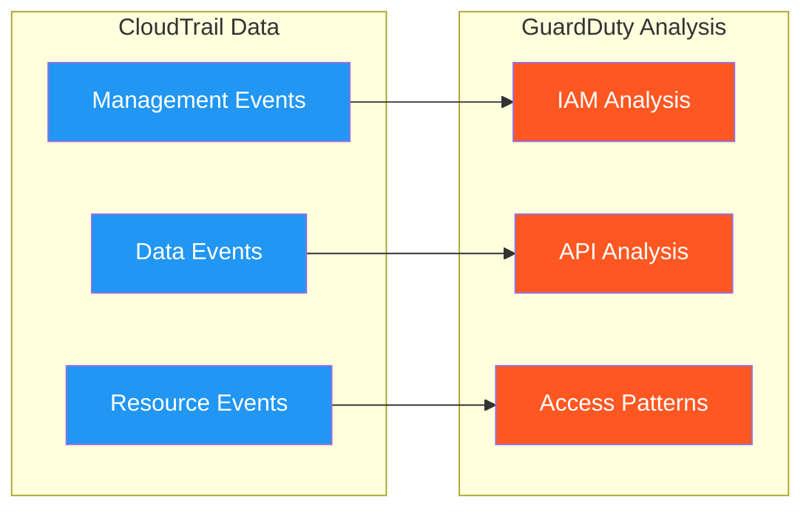
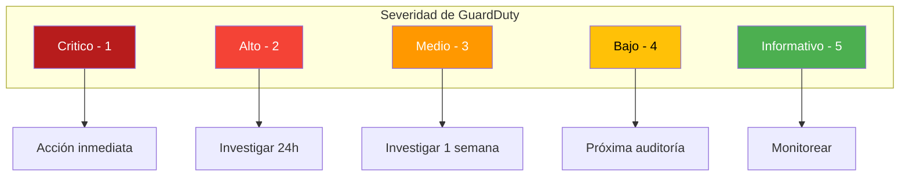
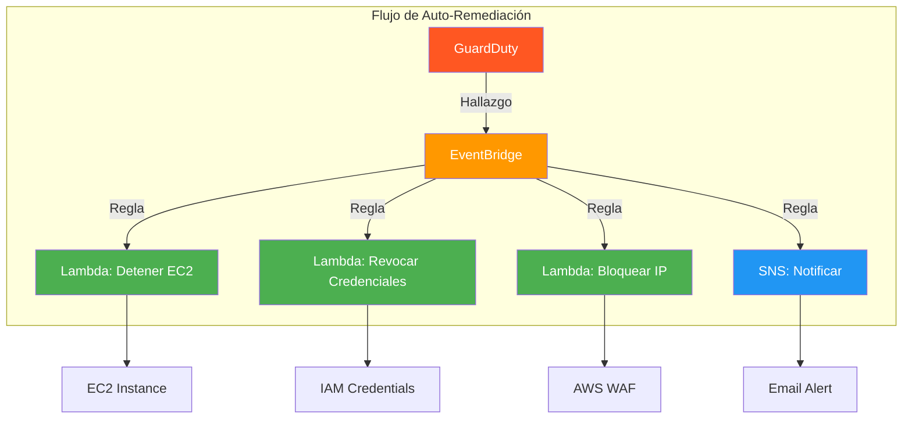
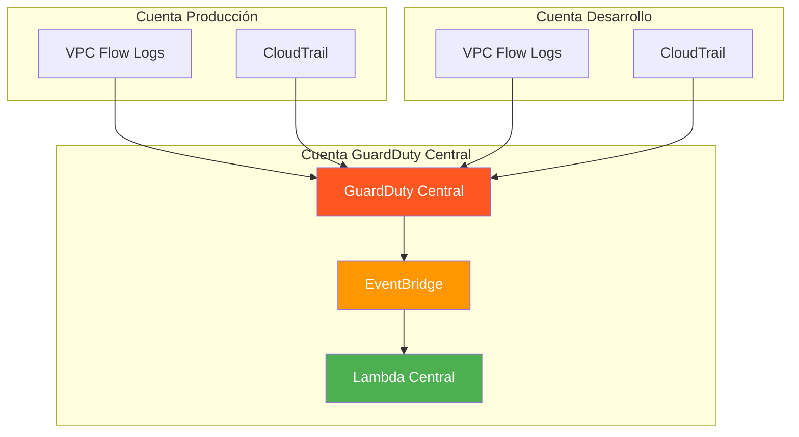

# Amazon GuardDuty

Amazon GuardDuty es un servicio de detección de amenazas que monitorea continuamente su cuenta de AWS, recursos y cargas de trabajo en busca de actividad maliciosa y comportamiento no autorizado.

---

## ¿Qué es Amazon GuardDuty?

GuardDuty utiliza aprendizaje automático, análisis de comportamiento y inteligencia de amenazas integrada para detectar:

- **Compromiso de cuentas** - Acceso no autorizado a servicios AWS
- **Compromiso de cargas de trabajo** - Actividad maliciosa en EC2 y containers
- **Compromiso de datos** - Acceso no autorizado a datos en S3
- **Enumeración** - Reconocimiento de recursos
- **Cryptojacking** - Uso no autorizado de recursos para minar criptomonedas



---

## Tipos de Detección de Amenazas

### 1. Compromiso de Cuentas IAM

| Tipo de Hallazgo | Descripción | Severidad |
|-------------------|-------------|-----------|
| `UnauthorizedAccess:IAMUser/InstanceCredentialExfiltration.OutsideAWS` | Credenciales usadas fuera de AWS | Alta |
| `UnauthorizedAccess:IAMUser/InstanceCredentialExfiltration.InsideAWS` | Credenciales usadas desde IP sospechosa | Alta |
| `CredentialAccess:IAMUser/AnomalousBehavior` | Comportamiento anómalo de credenciales | Media-Alta |
| `DefenseEvasion:IAMUser/AnomalousBehavior` | Intento de evadir defensas | Alta |
| `Persistence:IAMUser/AnomalousBehavior` | Intento de persistencia anómala | Media |

### 2. Compromiso de EC2

| Tipo de Hallazgo | Descripción | Severidad |
|-------------------|-------------|-----------|
| `Recon:EC2/MaliciousIPCaller.Custom` | IP en lista de amenazas | Alta |
| `Recon:EC2/MaliciousIPCaller.TemporaryIP` | IP temporalmente maliciosa | Media-Alta |
| `Behavior:EC2/NetworkPermissions` | Cambio en patrones de red | Media |
| `Behavior:EC2/InstancePermissions` | Cambio en permisos de instancia | Media |
| `DefenseEvasion:EC2/GradientEconomy` | Instancia con configuración sospechosa | Media |
| `CryptoCurrency:EC2/BitcoinTool.B` | Actividad de minado de criptomonedas | Alta |

### 3. Compromiso de S3

| Tipo de Hallazgo | Descripción | Severidad |
|-------------------|-------------|-----------|
| `Discovery:S3/MaliciousIPCaller.Custom` | Acceso desde IP maliciosa | Alta |
| `Discovery:S3/AnomalousBehavior` | Comportamiento anómalo en S3 | Media |
| `Policy:S3/AnomalousBehavior` | Cambio sospechoso en políticas | Alta |
| `Persistence:S3/AnomalousBehavior` | Intento de persistencia en S3 | Media |

### 4. Compromiso de EKS

| Tipo de Hallazgo | Descripción | Severidad |
|-------------------|-------------|-----------|
| `Tactics:K8s/PrivilegeEscalation` | Escalación de privilegios | Alta |
| `Tactics:K8s/DefenseEvasion` | Evasión de defensas | Media |
| `Tactics:K8s/Persistence` | Persistencia en el clúster | Media |
| `Tactics:K8s/Discovery` | Enumeración de recursos | Baja |
| `Tactics:K8s/Execution` | Ejecución de código malicioso | Alta |

---

## Fuentes de Datos

GuardDuty analiza múltiples fuentes de datos para detectar amenazas.

### CloudTrail



```bash
# Verificar que CloudTrail está habilitado
aws cloudtrail describe-trails

# Habilitar CloudTrail si no está activo
aws cloudtrail create-trail \
    --name "GuardDutyTrail" \
    --s3-bucket-name "mi-bucket-cloudtrail" \
    --is-multi-region-trail

aws cloudtrail start-logging --name "GuardDutyTrail"
```

### VPC Flow Logs

```bash
# Habilitar VPC Flow Logs
aws ec2 create-flow-logs \
    --resource-type VPC \
    --resource-ids vpc-12345678 \
    --traffic-type ALL \
    --log-destination-type cloud-watch-logs \
    --log-group-name "/aws/vpc/flowlogs" \
    --deliver-logs-permission-arn "arn:aws:iam::123456789012:role/VPCFlowLogsRole"
```

### DNS Logs (Route 53 Resolver)

```bash
# Habilitar DNS query logging
aws route53resolver create-resolver-query-log-config \
    --name "GuardDutyDNS" \
    --destination-arn "arn:aws:logs:us-east-1:123456789012:log-group:/aws/route53/dnsquery" \
    --resolver-endpoint-id rslvr-out-12345678

# Asociar a VPC
aws route53resolver associate-resolver-query-log-config \
    --resolver-query-log-config-id rqlc-12345678 \
    --resource-id vpc-12345678
```

### EKS Audit Logs

```bash
# Habilitar EKS audit logs
aws eks update-cluster-config \
    --name mi-cluster \
    --logging '{
        "clusterLogging": {
            "enabled": true,
            "types": ["audit", "api"]
        }
    }'
```

### CloudTrail S3 Data Events

```bash
# Habilitar S3 data events en CloudTrail
aws cloudtrail put-event-selectors \
    --trail-name GuardDutyTrail \
    --event-selectors '[{
        "ReadWriteType": "All",
        "IncludeManagementEvents": true,
        "DataResources": [{
            "Type": "AWS::S3::Object",
            "Values": ["arn:aws:s3:::mi-bucket-sensible/"]
        }]
    }]'
```

---

## Severidad de Hallazgos

| Severidad | Nivel | Acción Recomendada |
|-----------|-------|-------------------|
| 1 | Critico | Investigar inmediatamente, considerar deshabilitar recursos |
| 2 | Alto | Investigar dentro de 24 horas |
| 3 | Medio | Investigar dentro de una semana |
| 4 | Bajo | Revisar en el próximo ciclo de auditoría |
| 5 | Informativo | Monitorear, acción opcional |

### Clasificación de severidad



---

## Configurar GuardDuty

### Habilitar GuardDuty

```bash
# Habilitar GuardDuty
aws guardduty create-detector \
    --enable \
    --finding-publishing-frequency FIFTEEN_MINUTES \
    --data-sources '{
        "S3Logs": {"Enable": true},
        "FlowLogs": {"Enable": true},
        "DnsLogs": {"Enable": true},
        "Kubernetes": {
            "AuditLogs": {"Enable": true}
        },
        "CloudTrail": {
            "S3DataEvents": {"Enable": true},
            "ManagementEvents": {"Enable": true}
        }
    }'
```

### Listar hallazgos

```bash
# Listar hallazgos recientes
aws guardduty list-findings \
    --detector-id <DETECTOR_ID> \
    --finding-criteria '{
        "Severity": {
            "Gte": 7
        }
    }' \
    --sort-criteria '{"AttributeName": "severity", "OrderBy": "desc"}'

# Obtener detalles de un hallazgo
aws guardduty get-findings \
    --detector-id <DETECTOR_ID> \
    --finding-ids <FINDING_ID>
```

### Filtrar hallazgos

```bash
# Filtrar por severidad
aws guardduty list-findings \
    --detector-id <DETECTOR_ID> \
    --finding-criteria '{
        "Severity": {
            "Gte": 7,
            "Lte": 9
        },
        "Type": {
            "Eq": ["UnauthorizedAccess:IAMUser/InstanceCredentialExfiltration.OutsideAWS"]
        }
    }'

# Filtrar por recurso
aws guardduty list-findings \
    --detector-id <DETECTOR_ID> \
    --finding-criteria '{
        "Resource.InstanceDetails.InstanceId": {
            "Eq": ["i-1234567890abcdef0"]
        }
    }'
```

---

## Integración con EventBridge y Lambda

### Auto-remediación con EventBridge



### Regla de EventBridge

```bash
# Crear regla para hallazgos críticos
aws events put-rule \
    --name "GuardDutyCriticalFindings" \
    --event-pattern '{
        "source": ["aws.guardduty"],
        "detail-type": ["GuardDuty Finding"],
        "detail": {
            "severity": [{"numeric": [">=", 7]}]
        }
    }' \
    --state ENABLED \
    --description "Auto-remediación para hallazgos críticos de GuardDuty"
```

### Lambda de auto-remediación - Detener EC2

```python
import boto3
import json

ec2 = boto3.client('ec2')
sns = boto3.client('sns')

def lambda_handler(event, context):
    """Detiene instancias EC2 comprometidas."""
    
    # Extraer información del hallazgo
    detail = event['detail']
    finding_type = detail['type']
    instance_id = detail['resource']['instanceDetails']['instanceId']
    region = detail['region']
    
    print(f'Procesando hallazgo: {finding_type}')
    print(f'Instancia: {instance_id}')
    
    # Detener la instancia
    ec2.stop_instances(
        InstanceIds=[instance_id],
        Force=False
    )
    
    # Agregar tag de seguridad
    ec2.create_tags(
        Resources=[instance_id],
        Tags=[
            {'Key': 'SecurityStatus', 'Value': 'Compromised'},
            {'Key': 'GuardDutyFinding', 'Value': finding_type},
            {'Key': 'RemediationDate', 'Value': context.aws_request_id}
        ]
    )
    
    # Notificar
    sns.publish(
        TopicArn='arn:aws:sns:us-east-1:123456789012:alertas-seguridad',
        Message=f'Instancia {instance_id} detenida automáticamente.\n'
                f'Tipo de hallazgo: {finding_type}\n'
                f'Región: {region}',
        Subject=f'GuardDuty: Instancia comprometida {instance_id}'
    )
    
    return {
        'statusCode': 200,
        'body': json.dumps({
            'instance_id': instance_id,
            'action': 'stopped',
            'finding_type': finding_type
        })
    }
```

### Lambda de auto-remediación - Revocar credenciales

```python
import boto3
import json

iam = boto3.client('iam')
sns = boto3.client('sns')

def lambda_handler(event, context):
    """Revoca credenciales de usuarios comprometidos."""
    
    detail = event['detail']
    finding_type = detail['type']
    
    # Extraer información del usuario
    if 'accessKeyDetails' in detail['resource']:
        access_key = detail['resource']['accessKeyDetails']['accessKeyId']
        user_name = detail['resource']['accessKeyDetails']['userName']
        
        print(f'Revocando acceso del usuario: {user_name}')
        
        # Listar todas las access keys del usuario
        keys = iam.list_access_keys(UserName=user_name)
        
        # Eliminar todas las access keys
        for key in keys['AccessKeyMetadata']:
            iam.delete_access_key(
                UserName=user_name,
                AccessKeyId=key['AccessKeyId']
            )
            print(f'Access key eliminada: {key["AccessKeyId"]}')
        
        # Forzar cambio de contraseña
        iam.create_login_profile(
            UserName=user_name,
            Password='TempPassword123!',
            PasswordReset=True
        )
        
        # Agregar tag de seguridad
        iam.tag_user(
            UserName=user_name,
            Tags=[
                {'Key': 'SecurityStatus', 'Value': 'Compromised'},
                {'Key': 'GuardDutyFinding', 'Value': finding_type}
            ]
        )
        
        # Notificar
        sns.publish(
            TopicArn='arn:aws:sns:us-east-1:123456789012:alertas-seguridad',
            Message=f'Credenciales del usuario {user_name} revocadas.\n'
                    f'Access key comprometida: {access_key}\n'
                    f'Tipo de hallazgo: {finding_type}',
            Subject=f'GuardDuty: Credenciales comprometidas - {user_name}'
        )
    
    return {'statusCode': 200}
```

### Lambda de auto-remediación - Bloquear IP

```python
import boto3
import json

wafv2 = boto3.client('wafv2')
ec2 = boto3.client('ec2')

def lambda_handler(event, context):
    """Bloquea IPs maliciosas en AWS WAF."""
    
    detail = event['detail']
    ip_address = detail['service']['action']['networkConnectionAction']['remoteIpDetails']['ipAddressV4']
    
    print(f'Bloqueando IP: {ip_address}')
    
    # Obtener Web ACL existente
    web_acl = wafv2.get_web_acl(
        Name='MiWebACL',
        Scope='CLOUDFRONT',
        Id='<WEB_ACL_ID>'
    )
    
    # Crear o actualizar IP Set
    try:
        ip_set = wafv2.get_ip_set(
            Name='BlockedIPs',
            Scope='CLOUDFRONT',
            Id='<IP_SET_ID>'
        )
        
        # Agregar IP al set existente
        current_addresses = ip_set['IPSet']['Addresses']
        current_addresses.append(f'{ip_address}/32')
        
        wafv2.update_ip_set(
            Name='BlockedIPs',
            Scope='CLOUDFRONT',
            Id='<IP_SET_ID>',
            Addresses=current_addresses,
            LockToken=ip_set['LockToken']
        )
    except Exception as e:
        print(f'Error actualizando IP Set: {e}')
    
    # Agregar regla de bloqueo si no existe
    rules = web_acl['WebACL']['Rules']
    rule_exists = any(r['Name'] == 'BlockBlacklistedIPs' for r in rules)
    
    if not rule_exists:
        new_rule = {
            'Name': 'BlockBlacklistedIPs',
            'Priority': 0,
            'Action': {'Block': {}},
            'Statement': {
                'IPSetReferenceStatement': {
                    'ARN': 'arn:aws:wafv2:us-east-1:123456789012:regional/ipset/BlockedIPs/<IP_SET_ID>'
                }
            },
            'VisibilityConfig': {
                'SampledRequestsEnabled': True,
                'CloudWatchMetricsEnabled': True,
                'MetricName': 'BlockBlacklistedIPs'
            }
        }
        rules.append(new_rule)
        
        wafv2.update_web_acl(
            Name='MiWebACL',
            Scope='CLOUDFRONT',
            Id='<WEB_ACL_ID>',
            DefaultAction={'Allow': {}},
            Rules=rules,
            VisibilityConfig={
                'SampledRequestsEnabled': True,
                'CloudWatchMetricsEnabled': True,
                'MetricName': 'MiWebACL'
            },
            LockToken=web_acl['LockToken']
        )
    
    return {
        'statusCode': 200,
        'body': json.dumps({
            'ip_address': ip_address,
            'action': 'blocked'
        })
    }
```

---

## Integración con Security Hub

```bash
# Habilitar Security Hub
aws securityhub enable-security-hub

# Habilitar integración de GuardDuty
aws securityhub update-security-hub-configuration \
    --auto-enable-controls=true

# Listar productos de GuardDuty en Security Hub
aws securityhub list-products \
    --filters '{"ProductName": [{"Value": "GuardDuty", "Comparison": "EQUALS"}]}'
```

---

## Monitoreo y Alertas

### Dashboard de CloudWatch

```bash
# Crear dashboard de GuardDuty
aws cloudwatch put-dashboard \
    --dashboard-name "GuardDutyDashboard" \
    --dashboard-body '{
        "widgets": [
            {
                "type": "metric",
                "properties": {
                    "title": "Hallazgos por Severidad",
                    "metrics": [
                        ["AWS/GuardDuty", "FindingCount", "DetectorId", "<DETECTOR_ID>", "Severity", "1"],
                        ["...", "Severity", "2"],
                        ["...", "Severity", "3"],
                        ["...", "Severity", "4"],
                        ["...", "Severity", "5"]
                    ],
                    "period": 300,
                    "stat": "Sum"
                }
            }
        ]
    }'
```

### Alarmas de CloudWatch

```bash
# Alarma para hallazgos críticos
aws cloudwatch put-metric-alarm \
    --alarm-name "GuardDutyCriticalFindings" \
    --namespace "AWS/GuardDuty" \
    --metric-name "FindingCount" \
    --dimensions Name=DetectorId,Value=<DETECTOR_ID> Name=Severity,Value=1 \
    --statistic Sum \
    --period 300 \
    --threshold 1 \
    --comparison-operator GreaterThanOrEqualToThreshold \
    --evaluation-periods 1 \
    --alarm-actions "arn:aws:sns:us-east-1:123456789012:alertas-criticas"

# Alarma para hallazgos altos
aws cloudwatch put-metric-alarm \
    --alarm-name "GuardDutyHighFindings" \
    --namespace "AWS/GuardDuty" \
    --metric-name "FindingCount" \
    --dimensions Name=DetectorId,Value=<DETECTOR_ID> Name=Severity,Value=2 \
    --statistic Sum \
    --period 300 \
    --threshold 5 \
    --comparison-operator GreaterThanOrEqualToThreshold \
    --evaluation-periods 2 \
    --alarm-actions "arn:aws:sns:us-east-1:123456789012:alertas-altas"
```

---

## Precio

| Componente | Costo |
|------------|-------|
| Eventos de análisis | $1.00 por millón de eventos |
| S3 Data Events | $1.00 por millón de eventos |
| EKS Audit Logs | $1.00 por millón de eventos |
| Free tier | 30 días de prueba gratuita para nuevos usuarios |

### Ejemplo de costo mensual

| Fuente | Eventos/mes | Costo |
|--------|-------------|-------|
| CloudTrail Management | 10M | $10.00 |
| VPC Flow Logs | 50M | $50.00 |
| DNS Logs | 20M | $20.00 |
| S3 Data Events | 5M | $5.00 |
| **Total estimado** | **85M** | **$85.00** |

---

## Mejores Prácticas

### 1. Habilitar todas las fuentes de datos

```bash
aws guardduty update-detector \
    --detector-id <DETECTOR_ID> \
    --data-sources '{
        "S3Logs": {"Enable": true},
        "FlowLogs": {"Enable": true},
        "DnsLogs": {"Enable": true},
        "Kubernetes": {
            "AuditLogs": {"Enable": true}
        },
        "CloudTrail": {
            "S3DataEvents": {"Enable": true},
            "ManagementEvents": {"Enable": true}
        }
    }'
```

### 2. Publicar hallazgos cada 15 minutos

```bash
aws guardduty update-detector \
    --detector-id <DETECTOR_ID> \
    --finding-publishing-frequency FIFTEEN_MINUTES
```

### 3. Crear cuenta de GuardDuty dedicada



### 4. Automatizar respuesta con EventBridge

```json
{
    "source": ["aws.guardduty"],
    "detail-type": ["GuardDuty Finding"],
    "detail": {
        "severity": [{"numeric": [">=", 7]}],
        "type": [
            "UnauthorizedAccess:IAMUser/InstanceCredentialExfiltration.OutsideAWS",
            "CryptoCurrency:EC2/BitcoinTool.B"
        ]
    }
}
```

### 5. Integrar con Security Hub

```bash
# Habilitar auto-enable de controles
aws securityhub update-security-hub-configuration \
    --auto-enable-controls=true

# Listar controles de GuardDuty
aws securityhub get-enabled-controls \
    --filter '{"ControlId": [{"Value": "GuardDuty.1", "Comparison": "PREFIX"}]}'
```

---

## Errores Comunes

| Error | Consecuencia | Solución |
|-------|--------------|---------|
| No habilitar todas las fuentes | Detección incompleta | Habilitar S3, Flow Logs, DNS, EKS |
| No configurar EventBridge | Sin auto-remediación | Crear reglas de EventBridge |
| Ignorar hallazgos de severidad baja | Acumulación de riesgos | Revisar periódicamente |
| No publicar cada 15 minutos | Retraso en detección | Configurar FIFTEEN_MINUTES |
| No monitorear métricas | Sin visibilidad | Crear dashboards y alarmas |
| No integrar con Security Hub | Gestión fragmentada | Habilitar Security Hub |

---

## Preguntas Frecuentes (FAQ)

### ¿GuardDuty tiene costo durante el free tier?

No, el free tier de 30 días es gratuito para nuevos usuarios de AWS. Después, cuesta $1.00/millón de eventos.

### ¿Cuánto tarda GuardDuty en detectar amenazas?

Generalmente detecta amenazas en minutos. El tiempo depende del tipo de amenazas y la frecuencia de eventos.

### ¿Puedo usar GuardDuty en múltiples cuentas?

Sí, puede usar GuardDuty en múltiples cuentas con AWS Organizations, delegando la administración a una cuenta central.

### ¿GuardDuty protege contra todas las amenazas?

No, GuardDuty detecta amenazas basadas en patrones conocidos. No detecta zero-day attacks o amenazas muy específicas.

### ¿Puedo excluir recursos del monitoreo?

No directamente, pero puede crear reglas de suppression en EventBridge para filtrar hallazgos específicos.

### ¿GuardDuty funciona con workloads on-premises?

GuardDuty monitorea servicios de AWS. Para workloads on-premises, necesitaría otras soluciones de seguridad.

### ¿Cómo se compara GuardDuty con soluciones de terceros?

GuardDuty es un servicio managed, fácil de usar y con costo bajo. Soluciones de terceros pueden ofrecer más personalización pero con mayor complejidad.

---

## Resumen

Amazon GuardDuty es el servicio de detección de amenazas de AWS:

- **Monitoreo continuo**: Analiza CloudTrail, VPC Flow Logs, DNS Logs, EKS
- **Detección inteligente**: Usa machine learning y inteligencia de amenazas
- **Tipos de hallazgos**: Compromiso de cuentas, EC2, S3, EKS, cryptojacking
- **Severidad**: Del 1 (crítico) al 5 (informativo)
- **Auto-remediación**: Integración con EventBridge y Lambda
- **Integración**: Security Hub, CloudWatch, SNS
- **Costo**: $1.00/millón de eventos con 30 días gratis
- **Configuración**: Simple habilitación con una línea de comando

GuardDuty es esencial para la detección temprana de amenazas en AWS y debe ser habilitado en todas las cuentas de producción. Combine con WAF, Shield, Security Hub y IAM para una seguridad completa en la nube.
