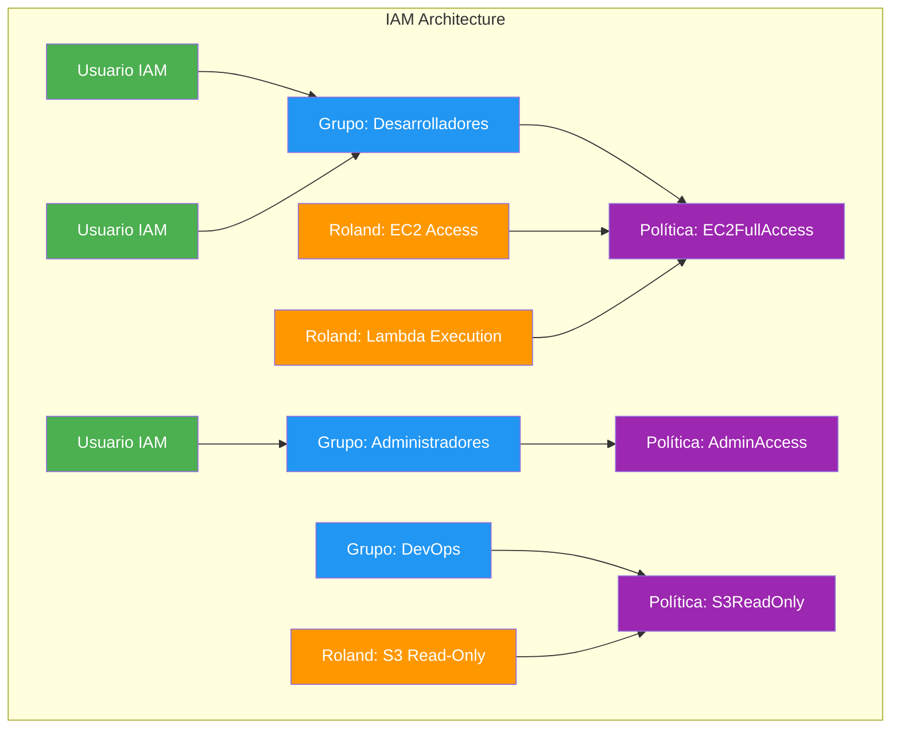
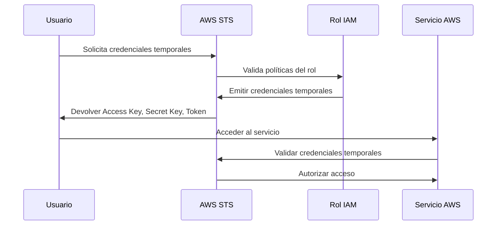
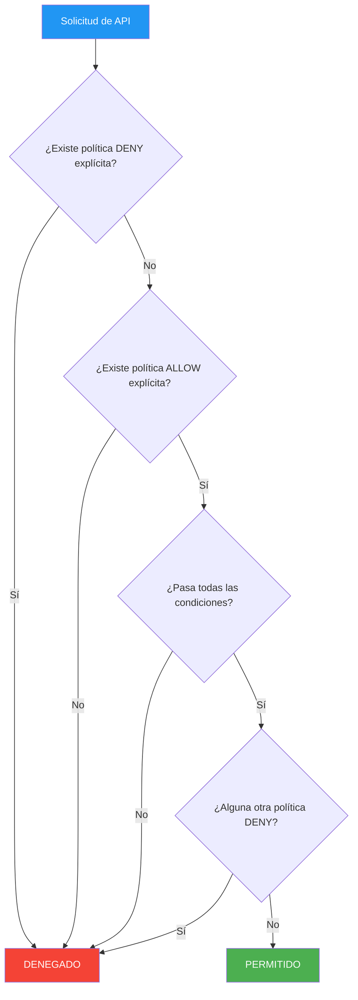
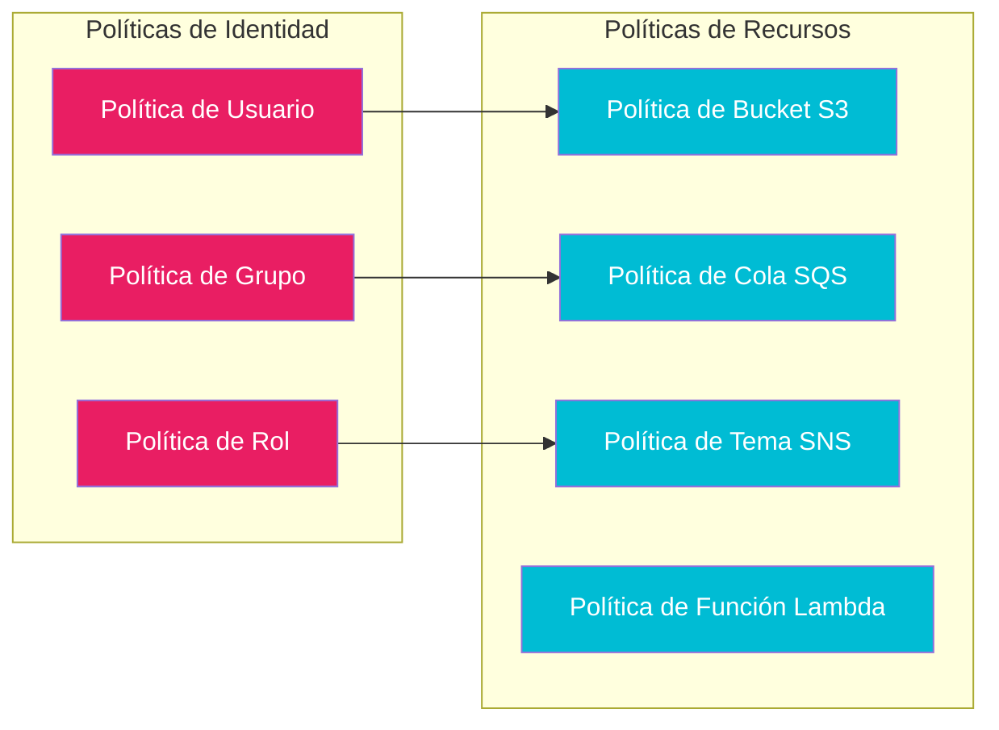
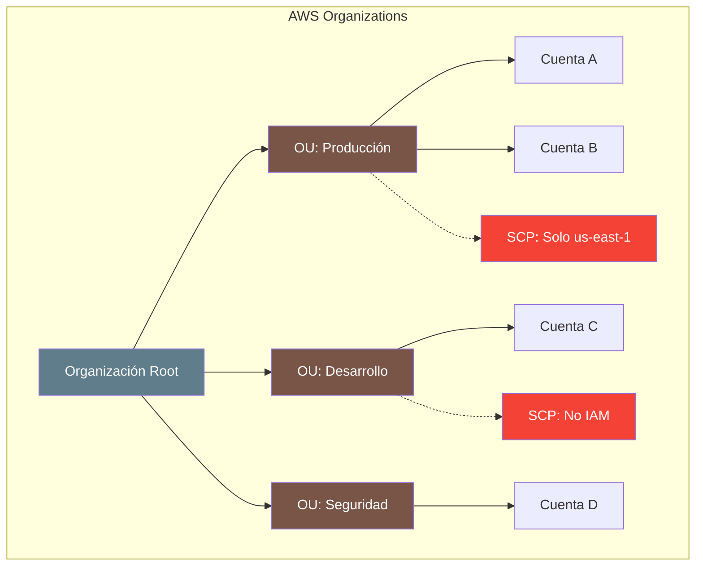
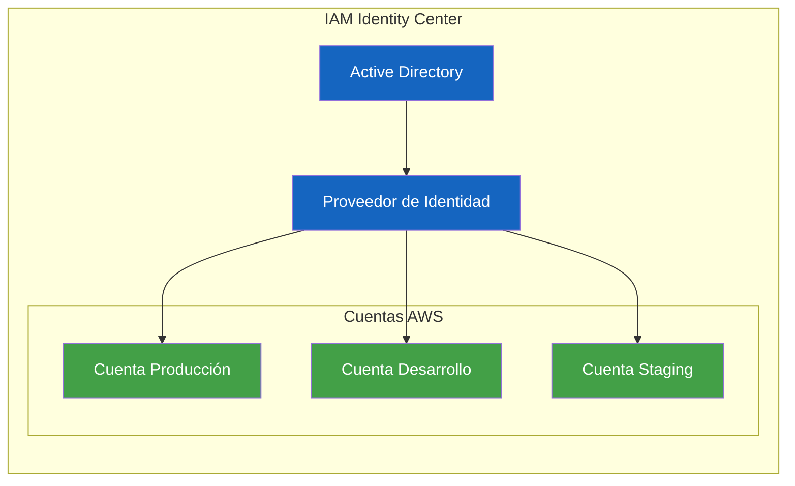

# IAM - Identity and Access Management

AWS Identity and Access Management (IAM) es el servicio central de seguridad en AWS. Permite controlar **quién** puede acceder a **qué** recursos y **qué acciones** puede realizar sobre ellos. Es gratuito y se encuentra disponible en todas las regiones de AWS.

---

## ¿Qué es IAM?

IAM es un servicio web que ayuda a manejar de forma segura el acceso a los recursos de AWS. Con IAM, puede controlar de forma centralizada quién o qué puede usar los servicios de AWS, los recursos que están disponibles, en qué acciones se permite usar esos recursos y bajo qué condiciones.

### Características principales

| Característica | Descripción |
|----------------|-------------|
| Gratuito | No se cobra por crear usuarios, grupos, roles o políticas |
| Seguridad centralizada | Un solo punto para gestionar credenciales y permisos |
| Acceso granular | Control a nivel de API, recurso, y condición |
| Federación | Integración con proveedores de identidad externos (Active Directory, Google, etc.) |
| MFA | Autenticación multifactor para mayor seguridad |
| Auditoría | Integración con CloudTrail para registro de actividad |

---

## Componentes de IAM

### Usuarios, Grupos, Roles y Políticas

IAM se compone de cuatro elementos fundamentales que trabajan juntos para definir quién tiene acceso a qué recursos de AWS.



### Usuarios IAM

Un usuario IAM es una identidad con credenciales de acceso programático y/o acceso a la consola de administración de AWS. Cada usuario IAM es único y tiene un nombre y credenciales asociadas.

**Ejemplo de creación de usuario:**

```bash
# Crear un usuario IAM con acceso a consola
aws iam create-user \
    --user-name juan.garcia \
    --tags Key=Department,Value=Engineering \
    --tags Key=Project,Value=WebApp

# Crear credenciales de acceso programático
aws iam create-access-key --user-name juan.garcia

# Crear login profile para acceso a consola
aws iam create-login-profile \
    --user-name juan.garcia \
    --password MySecureP@ssw0rd! \
    --password-reset-required
```

### Grupos IAM

Un grupo IAM es una colección de usuarios. Todos los usuarios del grupo heredan las políticas asignadas al grupo. Los grupos facilitan la gestión de permisos para múltiples usuarios.

```bash
# Crear un grupo
aws iam create-group --group-name Desarrolladores

# Agregar usuarios al grupo
aws iam add-user-to-group \
    --user-name juan.garcia \
    --group-name Desarrolladores

aws iam add-user-to-group \
    --user-name maria.lopez \
    --group-name Desarrolladores
```

### Roles IAM

Un rol IAM es una entidad que tiene permisos pero no tiene credenciales de acceso permanentes. Los roles se usan para:
- Asignar permisos a servicios de AWS (EC2, Lambda, ECS)
- Acceso federado desde proveedores de identidad externos
- Acceso cruzado entre cuentas de AWS



**Ejemplo de rol para EC2:**

```json
{
    "Version": "2012-10-17",
    "Statement": [
        {
            "Effect": "Allow",
            "Principal": {
                "Service": "ec2.amazonaws.com"
            },
            "Action": "sts:AssumeRole"
        }
    ]
}
```

### Políticas IAM

Las políticas IAM definen los permisos. Un documento JSON que especifica quién tiene acceso, a qué recursos y bajo qué condiciones.

---

## Sintaxis de Políticas IAM

### Estructura básica de una política

```json
{
    "Version": "2012-10-17",
    "Id": "politica-s3-desarrolladores",
    "Statement": [
        {
            "Sid": "PermitirLecturaEscrituraS3",
            "Effect": "Allow",
            "Action": [
                "s3:GetObject",
                "s3:PutObject",
                "s3:DeleteObject"
            ],
            "Resource": [
                "arn:aws:s3:::mi-bucket-desarrollo/*"
            ],
            "Condition": {
                "StringEquals": {
                    "aws:RequestedRegion": "us-east-1"
                }
            }
        },
        {
            "Sid": "DenegarAccesoAFolderPrivado",
            "Effect": "Deny",
            "Action": [
                "s3:GetObject",
                "s3:PutObject"
            ],
            "Resource": [
                "arn:aws:s3:::mi-bucket-desarrollo/privado/*"
            ]
        }
    ]
}
```

### Elementos de una política

| Elemento | Descripción | Requerido |
|----------|-------------|-----------|
| `Version` | Versión del lenguaje de políticas (siempre `2012-10-17`) | Sí |
| `Id` | Identificador único de la política (opcional) | No |
| `Statement` | Array de declaraciones individuales | Sí |
| `Sid` | Identificador de la declaración | No |
| `Effect` | `Allow` o `Deny` | Sí |
| `Action` | Acciones de AWS permitidas o denegadas | Sí |
| `Resource` | ARN(s) de los recursos afectados | Sí |
| `Condition` | Condiciones bajo las cuales aplica la política | No |

### Recursos ARN (Amazon Resource Names)

```bash
# Formato general
arn:aws:servicio:region:cuenta:recurso

# Ejemplos
arn:aws:s3:::mi-bucket                    # Bucket S3
arn:aws:s3:::mi-bucket/archivo.txt        # Objeto específico
arn:aws:ec2:us-east-1:123456789012:instance/i-1234567890abcdef0  # Instancia EC2
arn:aws:iam::123456789012:user/juan       # Usuario IAM
arn:aws:lambda:us-east-1:123456789012:function:mi-funcion  # Función Lambda
```

---

## Lógica de Evaluación de Políticas IAM

La evaluación de políticas IAM sigue un proceso determinista que determina si una solicitud es permitida o denegada.



### Reglas de evaluación

1. **Por defecto, todo está denegado** - No hay permisos implícitos
2. **Un DENY explícito siempre gana** - Si hay un DENY en cualquier política aplicable, la solicitud se deniega
3. **Se necesita un ALLOW explícito** - Para que una solicitud sea permitida, debe existir al menos un ALLOW
4. **Las políticas de recursos se evalúan junto con las políticas de identidad**
5. **Las políticas de control de servicios (SCPs) actúan como límites máximos**

### Ejemplo de evaluación

```json
// Política 1: En el grupo "Desarrolladores"
{
    "Effect": "Allow",
    "Action": "s3:*",
    "Resource": "arn:aws:s3:::mi-bucket/*"
}

// Política 2: En el usuario "juan"
{
    "Effect": "Deny",
    "Action": "s3:DeleteBucket",
    "Resource": "arn:aws:s3:::*"
}

// Resultado: Juan puede hacer todo en S3 excepto eliminar buckets
```

---

## Tipos de Políticas

### AWS Managed Policies vs Customer Managed Policies

| Característica | AWS Managed | Customer Managed |
|----------------|-------------|------------------|
| Creada por | AWS | El usuario |
| Actualización | Automática por AWS | Manual por el usuario |
| Versiones | Múltiples versiones | Una versión activa |
| Reutilización | Compartida entre cuentas | Específica de la cuenta |
| Personalización | No modificable | Completamente personalizable |
| Uso recomendado | Casos comunes estándar | Requisitos de seguridad específicos |

### Políticas de Identidad vs Políticas de Recursos



### Políticas de Recursos (Resource-based Policies)

Las políticas de recursos se adjuntan directamente a un recurso. Permiten definir quién puede acceder al recurso y desde dónde.

**Ejemplo de política de bucket S3:**

```json
{
    "Version": "2012-10-17",
    "Statement": [
        {
            "Sid": "PermitirAccesoCuentaAlicia",
            "Effect": "Allow",
            "Principal": {
                "AWS": "arn:aws:iam::987654321098:root"
            },
            "Action": [
                "s3:GetObject",
                "s3:PutObject"
            ],
            "Resource": [
                "arn:aws:s3:::mi-bucket-compartido/*"
            ],
            "Condition": {
                "StringEquals": {
                    "aws:PrincipalOrgID": "o-1234567890"
                }
            }
        }
    ]
}
```

### Límites de Permisos (Permission Boundaries)

Los límites de permisos definen el alcance máximo de permisos que un rol o usuario puede tener, incluso si las políticas adjuntas otorgan más permisos.

```json
{
    "Version": "2012-10-17",
    "Statement": [
        {
            "Effect": "Allow",
            "Action": [
                "s3:*",
                "ec2:Describe*",
                "lambda:CreateFunction",
                "lambda:InvokeFunction"
            ],
            "Resource": "*"
        },
        {
            "Effect": "Deny",
            "Action": [
                "iam:*",
                "organizations:*",
                "account:*"
            ],
            "Resource": "*"
        }
    ]
}
```

### Service Control Policies (SCPs)

Las SCPs se usan en AWS Organizations para definir límites máximos de permisos para todas las cuentas de la organización.



**Ejemplo de SCP para limitar regiones:**

```json
{
    "Version": "2012-10-17",
    "Statement": [
        {
            "Sid": "DenyAllOutsideUsEast1",
            "Effect": "Deny",
            "NotAction": [
                "iam:*",
                "sts:*",
                "organizations:*",
                "account:*"
            ],
            "Resource": "*",
            "Condition": {
                "StringNotEquals": {
                    "aws:RequestedRegion": "us-east-1"
                }
            }
        }
    ]
}
```

---

## Condiciones y Condition Keys

Las condiciones permiten especificar cuándo se aplican las políticas. Utilizan condition keys predefinidas o personalizadas.

### Condition Keys comunes

| Condition Key | Descripción |
|---------------|-------------|
| `aws:CurrentTime` | Hora actual de la solicitud |
| `aws:SourceIp` | Dirección IP de origen |
| `aws:RequestedRegion` | Región solicitada |
| `aws:PrincipalTag/etiqueta` | Etiquetas del principal |
| `aws:PrincipalOrgID` | ID de la organización |
| `aws:SecureTransport` | Si la conexión es HTTPS |
| `s3:prefix` | Prefijo del objeto S3 |
| `s3:delimiter` | Delimitador para listado |

**Ejemplo de condición con IP:**

```json
{
    "Version": "2012-10-17",
    "Statement": [
        {
            "Effect": "Allow",
            "Action": "ec2:*",
            "Resource": "*",
            "Condition": {
                "IpAddress": {
                    "aws:SourceIp": "192.0.2.0/24"
                }
            }
        }
    ]
}
```

**Ejemplo de condición con MFA:**

```json
{
    "Version": "2012-10-17",
    "Statement": [
        {
            "Effect": "Allow",
            "Action": "iam:CreateUser",
            "Resource": "*",
            "Condition": {
                "Bool": {
                    "aws:MultiFactorAuthPresent": true
                }
            }
        }
    ]
}
```

---

## Autenticación Multifactor (MFA)

MFA agrega una capa adicional de seguridad requiriendo un código de un dispositivo físico o virtual además de la contraseña.

### Tipos de dispositivos MFA

| Tipo | Descripción | Seguridad |
|------|-------------|-----------|
| Virtual MFA | Apps como Google Authenticator, Authy | Alta |
| Hardware MFA | Dispositivos físicos como YubiKey | Muy Alta |
| U2F Security Key | Llaves USB de seguridad | Muya Alta |
| SMS MFA | Códigos por mensaje de texto | Baja |

**Ejemplo de habilitar MFA virtual:**

```bash
# Crear dispositivo MFA virtual
aws iam create-virtual-mfa-device \
    --virtual-mfa-device-name juan-mfa

# Activar MFA (requiere dos códigos consecutivos)
aws iam enable-mfa-device \
    --user-name juan.garcia \
    --serial-number arn:aws:iam::123456789012:mfa/juan-mfa \
    --authentication-code-1 123456 \
    --authentication-code-2 789012
```

---

## IAM vs IAM Identity Center (AWS SSO)

| Característica | IAM | IAM Identity Center |
|----------------|-----|---------------------|
| Alcance | Cuenta individual | Organización (todas las cuentas) |
| Identidades | Usuarios IAM locales | Directory Service, Active Directory |
| Federación | Manual por cuenta | Centralizada |
| SSO | No | Sí |
| Roles | Por cuenta | Cruzados entre cuentas |
| Gestión | Descentralizada | Centralizada |
| Uso recomendado | Cuentas individuales | Multi-cuenta con Organizations |



---

## IAM Access Analyzer

IAM Access Analyzer ayuda a identificar recursos compartidos externamente mediante análisis estático de políticas.

```bash
# Crear analizador
aws iam create-access-analyzer \
    --account-id 123456789012 \
    --analyzer-name mi-analizador

# Listar hallazgos
aws iam list-findings \
    --analyzer-arn arn:aws:iam::123456789012:access-analyzer/mi-analizador
```

### Tipos de hallazgos

| Hallazgo | Descripción |
|----------|-------------|
| Bucket S3 compartido externamente | Bucket accesible desde fuera de la organización |
| Bucket S3 compartido con terceros | Bucket accesible por cuentas específicas externas |
| Rol IAM compartido externamente | Rol que puede ser asumido desde fuera |
| Clave de cifrado compartida | KMS key compartida externamente |

---

## Mejores Prácticas de IAM

### 1. Regla del menor privilegio

```json
// MAL - Permisos excesivos
{
    "Effect": "Allow",
    "Action": "*",
    "Resource": "*"
}

// BIEN - Permisos específicos
{
    "Effect": "Allow",
    "Action": [
        "s3:GetObject",
        "s3:PutObject"
    ],
    "Resource": "arn:aws:s3:::mi-bucket/archivos/*"
}
```

### 2. Habilitar MFA siempre

```bash
# Forzar MFA para acciones sensibles
aws iam put-user-policy \
    --user-name juan.garcia \
    --policy-name RequireMFA \
    --policy-document '{
        "Version": "2012-10-17",
        "Statement": [
            {
                "Effect": "Deny",
                "NotAction": [
                    "iam:CreateVirtualMFADevice",
                    "iam:EnableMFADevice",
                    "iam:GetUser",
                    "iam:ListMFADevices",
                    "iam:ListVirtualMFADevices",
                    "sts:GetSessionToken"
                ],
                "Resource": "*",
                "Condition": {
                    "BoolIfExists": {
                        "aws:MultiFactorAuthPresent": false
                    }
                }
            }
        ]
    }'
```

### 3. Usar roles para servicios de AWS

```bash
# Crear rol para Lambda
aws iam create-role \
    --role-name lambda-execution-role \
    --assume-role-policy-document '{
        "Version": "2012-10-17",
        "Statement": [{
            "Effect": "Allow",
            "Principal": {"Service": "lambda.amazonaws.com"},
            "Action": "sts:AssumeRole"
        }]
    }'

# Adjuntar política gerenciada
aws iam attach-role-policy \
    --role-name lambda-execution-role \
    --policy-arn arn:aws:iam::aws:policy/service-role/AWSLambdaBasicExecutionRole
```

### 4. Rotar credenciales regularmente

```bash
# Listar acceso_keys mayores a 90 días
aws iam list-access-keys --user-name juan.garcia \
    --query 'AccessKeyMetadata[*].[AccessKeyId,CreateDate]' \
    --output table
```

### 5. Usar condiciones para mayor seguridad

```json
{
    "Effect": "Allow",
    "Action": "s3:*",
    "Resource": "*",
    "Condition": {
        "Bool": {
            "aws:SecureTransport": "true"
        },
        "StringEquals": {
            "s3:x-amz-server-side-encryption": "aws:kms"
        }
    }
}
```

---

## Errores Comunes

| Error | Consecuencia | Solución |
|-------|--------------|----------|
| Usar `"Action": "*"` | Permisos excesivos | Especificar acciones necesarias |
| Usar `"Resource": "*"` en Allow | Acceso a todos los recursos | Definir ARN específicos |
| No usar MFA | Compromiso de credenciales | Habilitar MFA virtual o hardware |
| Credenciales hardcoded en código | Exposición de secretos | Usar roles o Secrets Manager |
| No rotar access keys | Riesgo de compromiso | Rotar cada 90 días |
| No revisar políticas periódicamente | Permisos obsoletos | Auditoría trimestral con Access Analyzer |
| Usar usuario root para operaciones diarias | Riesgo de compromiso total | Crear usuario IAM con permisos limitados |
| No usar condiciones de contexto | Acceso desde ubicaciones no deseadas | Agregar condiciones IP, región, MFA |

---

## Consejos para Entrevistas

1. **¿Cuál es la diferencia entre Allow y Deny?** - Deny siempre gana sobre Allow. Si hay un DENY explícito en cualquier política, la solicitud se deniega independientemente de los ALLOW.

2. **¿Qué es un ARN?** - Amazon Resource Name, formato único para identificar recursos: `arn:aws:servicio:region:cuenta:recurso`

3. **¿Cuándo usar un rol vs un usuario?** - Roles para servicios de AWS y acceso temporal. Usuarios para personas que necesitan acceso persistente.

4. **¿Qué es la evaluación de políticas?** - Proceso de 5 pasos: verificar DENY explícito → verificar ALLOW explícito → verificar condiciones → verificar otros DENY → permitir o denegar.

5. **¿Qué son las SCPs?** - Service Control Policies, actúan como límites máximos en cuentas de AWS Organizations. No otorgan permisos, solo los restringen.

6. **¿Cuál es la diferencia entre Identity y Resource policies?** - Identity policies se adjuntan a usuarios/grupos/roles. Resource policies se adjuntan directamente al recurso (S3, SQS, Lambda, etc.).

7. **¿Qué es Permission Boundary?** - Define el alcance máximo de permisos. Si el boundary dice Deny, no importa qué diga la política adjunta.

---

## Preguntas Frecuentes (FAQ)

### ¿IAM tiene algún costo?

No, IAM es un servicio gratuito de AWS. No se cobra por crear usuarios, grupos, roles, políticas o por las solicitudes de autenticación.

### ¿Cuántos usuarios IAM puedo crear?

Puede crear hasta 5,000 usuarios IAM por cuenta de AWS. Para más usuarios, considere usar IAM Identity Center con Active Directory.

### ¿Puedo compartir políticas entre cuentas?

Sí, puede crear políticas gerenciadas por el cliente (Customer Managed Policies) y compartirlas entre cuentas de la misma organización, o usar políticas gerenciadas por AWS.

### ¿Qué sucede si elimino un usuario con políticas adjuntas?

Las políticas no se eliminan automáticamente. Debe eliminar manualmente las políticas después de eliminar el usuario.

### ¿Puedo usar IAM con proveedores de identidad externos?

Sí, IAM soporta federación con Active Directory, Google, Facebook, y cualquier proveedor SAML 2.0 o OpenID Connect.

### ¿Cómo funciona la rotación de credenciales con IAM?

AWS recomienda rotar access keys cada 90 días. Puede usar AWS CLI o SDKs para crear nuevas claves y eliminar las antiguas.

### ¿Las SCPs reemplazan las políticas de identidad?

No, las SCPs definen los límites máximos. Las políticas de identidad definen los permisos reales dentro de esos límites.

---

## Resumen

IAM es el servicio fundamental de seguridad en AWS que controla el acceso a todos los recursos de la nube. Los conceptos clave incluyen:

- **Usuarios**: Identidades para personas con credenciales persistentes
- **Grupos**: Colecciones de usuarios que comparten permisos
- **Roles**: Entidades con permisos temporales para servicios y federación
- **Políticas**: Documentos JSON que definen permisos con efecto Allow o Deny
- **Evaluación**: Deny siempre gana → se necesita ALLOW explícito → condiciones deben cumplirse
- **MFA**: Capa adicional de seguridad siempre recomendada
- **SCPs**: Límites máximos para cuentas en AWS Organizations
- **Permission Boundaries**: Límites de permisos para roles y usuarios
- **Access Analyzer**: Herramienta para detectar recursos compartidos externamente

IAM es gratuito y debe ser la primera consideración de seguridad al trabajar con AWS. Siempre aplique el principio del menor privilegio y revise periódicamente sus políticas.
