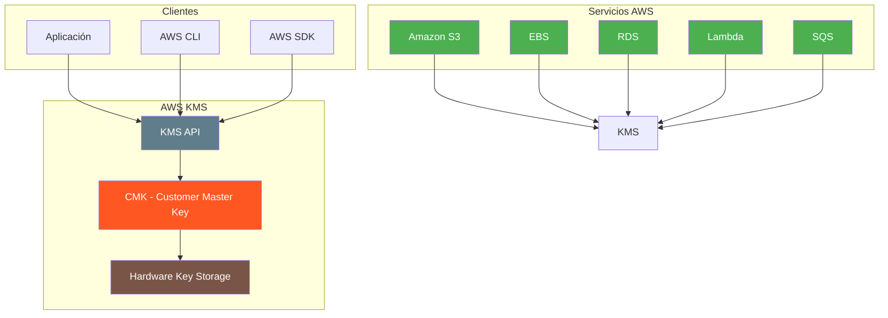
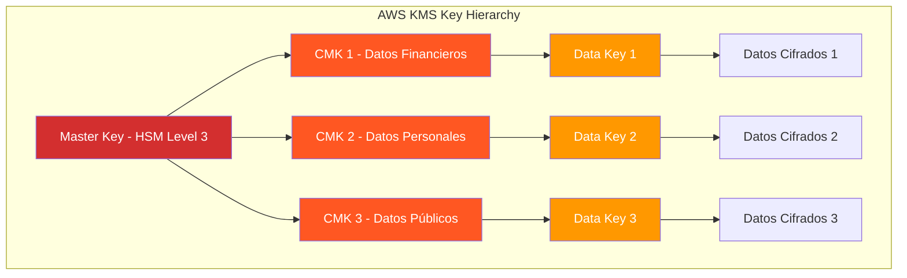
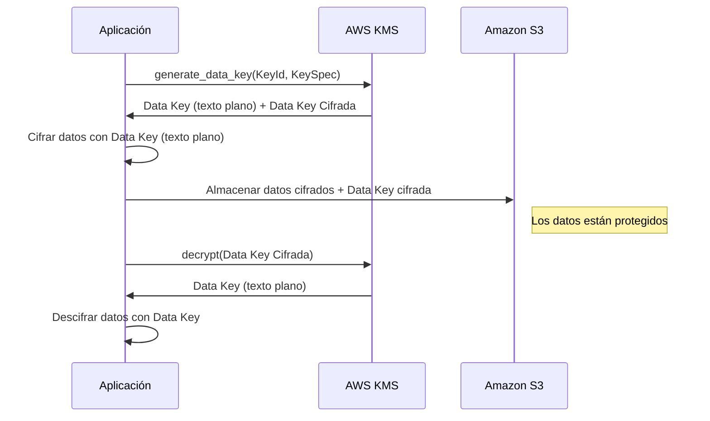
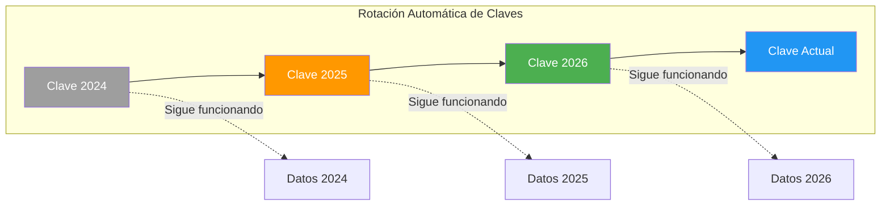

# AWS KMS - Key Management Service

AWS Key Management Service (KMS) es un servicio administrado que facilita la creación y el control de claves de cifrado utilizadas para proteger datos. KMS se integra con la mayoría de los servicios de AWS para cifrar datos en reposo y en tránsito.

---

## ¿Qué es AWS KMS?

KMS proporciona un servicio centralizado de gestión de claves de cifrado que:

- **Crea** claves de cifrado simétricas y asimétricas
- **Administra** el ciclo de vida de las claves (creación, uso, rotación, eliminación)
- **Usa** Hardware Security Modules (HSM) FIPS 140-2 Level 3 para proteger las claves
- **Se integra** con más de 100 servicios de AWS
- **Cumple** con normativas de seguridad y cumplimiento



---

## Claves Simétricas vs Asimétricas

| Característica | Simétricas | Asimétricas |
|----------------|-----------|-------------|
| Tipo de clave | Una sola clave | Par de claves (pública/privada) |
| Operación | Cifrar y descifrar con la misma clave | Cifrar con pública, descifrar con privada |
| Rendimiento | Más rápido | Más lento |
| Uso principal | Cifrado de datos | Firma digital, intercambio de claves |
| Servicios integrados | S3, EBS, RDS, Lambda | Email, SSL/TLS |
| Tamaño | 256 bits | 2048, 3072, 4096 bits |

### Ejemplo de clave simétrica

```python
import boto3

kms = boto3.client('kms')

# Crear clave simétrica
response = kms.create_key(
    Description='Clave para cifrar datos de clientes',
    KeyUsage='ENCRYPT_DECRYPT',
    KeySpec='SYMMETRIC_DEFAULT',
    Tags=[
        {'TagKey': 'Proyecto', 'TagValue': 'WebApp'},
        {'TagKey': 'Equipo', 'TagValue': 'Seguridad'}
    ]
)

key_id = response['KeyMetadata']['KeyId']
print(f'Clave creada: {key_id}')
```

### Ejemplo de clave asimétrica

```python
# Crear par de claves asimétricas
response = kms.create_key(
    Description='Clave para firma digital',
    KeyUsage='SIGN_VERIFY',
    KeySpec='RSA_4096',
    Tags=[
        {'TagKey': 'Uso', 'TagValue': 'FirmaDigital'}
    ]
)

key_id = response['KeyMetadata']['KeyId']

# Obtener la clave pública
public_key = kms.get_public_key(
    KeyId=key_id
)
print(f'Clave pública: {public_key["PublicKey"]}')
```

---

## CMK vs AWS-Managed Keys

### Customer Managed Keys (CMK)

Las CMK son claves que usted crea, posee y administra completamente.

| Característica | CMK | AWS-Managed Key |
|----------------|-----|-----------------|
| Propietario | Usted | AWS |
| Política de clave | Personalizable | Predeterminada por AWS |
| Rotación | Manual o automática | Automática por AWS |
| Eliminación | Programable | No eliminable |
| Uso | Datos específicos del cliente | Datos internos de AWS |
| Costo | $1/clave/mes + $0.03/10K solicitudes | Gratis (integrada en servicios) |

### AWS-Managed Keys

AWS crea automáticamente una clave administrada por AWS para cada servicio que la necesite.

```bash
# Listar claves administradas por AWS
aws kms list-keys --query 'Keys[?KeyId==`aws/s3`]'
```

**Formato de ARN de clave AWS-managed:**

```
arn:aws:kms:us-east-1:123456789012:key/aws/s3
arn:aws:kms:us-east-1:123456789012:key/aws/ebs
arn:aws:kms:us-east-1:123456789012:key/aws/rds
```

### Jerarquía de claves



---

## Envelope Encryption (Cifrado de Sobre)

El cifrado de sobre es un patrón donde se cifra un Data Key (clave de datos) con una CMK, y luego se usa el Data Key para cifrar los datos.

### Flujo de Envelope Encryption



### Ejemplo completo de Envelope Encryption

```python
import boto3
import os

class EnvelopeEncryption:
    def __init__(self, key_id):
        self.kms = boto3.client('kms')
        self.key_id = key_id
    
    def encrypt_file(self, filename):
        """Cifra un archivo usando envelope encryption."""
        # 1. Generar Data Key
        response = self.kms.generate_data_key(
            KeyId=self.key_id,
            KeySpec='AES_256'
        )
        
        data_key = response['Plaintext']
        encrypted_data_key = response['CiphertextBlob']
        
        # 2. Leer el archivo
        with open(filename, 'rb') as f:
            plaintext = f.read()
        
        # 3. Cifrar los datos con la Data Key
        from cryptography.hazmat.primitives.ciphers.aead import AESGCM
        nonce = os.urandom(12)
        aesgcm = AESGCM(data_key)
        ciphertext = aesgcm.encrypt(nonce, plaintext, None)
        
        # 4. Guardar datos cifrados + metadata
        encrypted_filename = f'{filename}.encrypted'
        with open(encrypted_filename, 'wb') as f:
            # Guardar longitud del nonce
            f.write(len(nonce).to_bytes(4, 'big'))
            f.write(nonce)
            # Guardar longitud de la Data Key cifrada
            f.write(len(encrypted_data_key).to_bytes(4, 'big'))
            f.write(encrypted_data_key)
            # Guardar datos cifrados
            f.write(ciphertext)
        
        # Limpiar clave en memoria
        data_key = b'\x00' * len(data_key)
        
        return encrypted_filename
    
    def decrypt_file(self, encrypted_filename):
        """Descifra un archivo que fue cifrado con envelope encryption."""
        # 1. Leer metadata
        with open(encrypted_filename, 'rb') as f:
            # Leer nonce
            nonce_len = int.from_bytes(f.read(4), 'big')
            nonce = f.read(nonce_len)
            # Leer Data Key cifrada
            dk_len = int.from_bytes(f.read(4), 'big')
            encrypted_data_key = f.read(dk_len)
            # Leer datos cifrados
            ciphertext = f.read()
        
        # 2. Descifrar Data Key con KMS
        response = self.kms.decrypt(
            CiphertextBlob=encrypted_data_key
        )
        data_key = response['Plaintext']
        
        # 3. Descifrar datos
        from cryptography.hazmat.primitives.ciphers.aead import AESGCM
        aesgcm = AESGCM(data_key)
        plaintext = aesgcm.decrypt(nonce, ciphertext, None)
        
        # 4. Guardar archivo descifrado
        decrypted_filename = encrypted_filename.replace('.encrypted', '')
        with open(decrypted_filename, 'wb') as f:
            f.write(plaintext)
        
        return decrypted_filename

# Uso
crypto = EnvelopeEncryption('arn:aws:kms:us-east-1:123456789012:key/uuid-cmk')
crypto.encrypt_file('documento.pdf')
crypto.decrypt_file('documento.pdf.encrypted')
```

### Por qué usar Envelope Encryption

| Razón | Descripción |
|-------|-------------|
| Rendimiento | Cifrar con AES-256 es más rápido que con RSA |
| Escalabilidad | Puede cifrar grandes volúmenes de datos |
| Seguridad | La Data Key se cifra una sola vez con KMS |
| Flexibilidad | Puede cambiar la CMK sin re-cifrar los datos |

---

## Políticas de Clave (Key Policies)

Las políticas de clave definen quién puede usar la clave y bajo qué condiciones.

### Política de clave predeterminada

```json
{
    "Version": "2012-10-17",
    "Id": "key-default-1",
    "Statement": [
        {
            "Sid": "PermitirAdministracionTotal",
            "Effect": "Allow",
            "Principal": {
                "AWS": "arn:aws:iam::123456789012:root"
            },
            "Action": "kms:*",
            "Resource": "*"
        },
        {
            "Sid": "PermitirUsoCondicional",
            "Effect": "Allow",
            "Principal": {
                "AWS": "*"
            },
            "Action": [
                "kms:Encrypt",
                "kms:Decrypt",
                "kms:ReEncrypt*",
                "kms:GenerateDataKey*",
                "kms:DescribeKey",
                "kms:CreateGrant"
            ],
            "Resource": "*",
            "Condition": {
                "StringEquals": {
                    "kms:CallerArn": "arn:aws:iam::123456789012:user/administrador"
                }
            }
        }
    ]
}
```

### Política para acceso cruzado de cuentas

```json
{
    "Version": "2012-10-17",
    "Statement": [
        {
            "Sid": "PermitirUsoDesdeOtraCuenta",
            "Effect": "Allow",
            "Principal": {
                "AWS": "arn:aws:iam::987654321098:root"
            },
            "Action": [
                "kms:Decrypt",
                "kms:DescribeKey"
            ],
            "Resource": "*",
            "Condition": {
                "StringEquals": {
                    "kms:ViaService": "s3.us-east-1.amazonaws.com"
                }
            }
        }
    ]
}
```

---

## Grants (Autorizaciones)

Los Grants son una forma de delegar permisos para usar una clave KMS a otros servicios o usuarios.

```bash
# Crear grant para una Lambda
aws kms create-grant \
    --key-id <KEY_ID> \
    --grantee-principal arn:aws:iam::123456789012:role/lambda-role \
    --operations Encrypt Decrypt GenerateDataKey DescribeKey

# Listar grants
aws kms list-grants --key-id <KEY_ID>

# Revocar grant
aws kms revoke-grant \
    --key-id <KEY_ID> \
    --grant-id <GRANT_ID>
```

---

## Rotación de Claves

KMS soporta rotación automática de claves cada año.

```bash
# Habilitar rotación automática
aws kms enable-key-rotation --key-id <KEY_ID>

# Verificar estado de rotación
aws kms get-key-rotation-status --key-id <KEY_ID>

# Listar versiones de clave
aws kms list-key-versions --key-id <KEY_ID>
```

### Cómo funciona la rotación



| Aspecto | Detalle |
|---------|---------|
| Frecuencia | Cada año (automático) |
| Versiones anteriores | Sigue funcionando para descifrar |
| Datos cifrados | No necesitan re-cifrado |
| Control | Solo para CMK, no para AWS-managed |

---

## Custom Key Store (CloudHSM)

Para requisitos de cumplimiento estrictos, puede usar CloudHSM como almacén de claves personalizado.

| Característica | KMS estándar | Custom Key Store (CloudHSM) |
|----------------|-------------|----------------------------|
| Hardware | HSM AWS administrado | CloudHSM dedicado |
| FIPS 140-2 | Level 3 | Level 3 |
| Acceso | API KMS | API KMS + CloudHSM API |
| Costo | $1/clave/mes | $1/clave/mes + CloudHSM |
| Control | AWS gestiona HSM | Usted gestiona HSM |

```bash
# Crear Custom Key Store
aws kms create-custom-key-store \
    --custom-key-store-name "MiAlmacenClaves" \
    --cloud-hsm-cluster-id "cluster-123456" \
    --trust-anchor-certificate file://certificado.pem

# Crear clave en Custom Key Store
aws kms create-key \
    --custom-key-store-id <CUSTOM_KEY_STORE_ID> \
    --description "Clave en CloudHSM"
```

---

## Integración con Servicios AWS

### Amazon S3

```python
import boto3

s3 = boto3.client('s3')
kms = boto3.client('kms')

# Cifrar bucket con SSE-KMS
s3.put_bucket_encryption(
    Bucket='mi-bucket-seguro',
    ServerSideEncryptionConfiguration={
        'Rules': [{
            'ApplyServerSideEncryptionByDefault': {
                'SSEAlgorithm': 'aws:kms',
                'KMSMasterKeyID': 'arn:aws:kms:us-east-1:123456789012:key/uuid-cmk'
            },
            'BucketKeyEnabled': True
        }]
    }
)

# Subir objeto con cifrado
s3.put_object(
    Bucket='mi-bucket-seguro',
    Key='documento.pdf',
    Body=b'contenido del documento',
    ServerSideEncryption='aws:kms',
    SSEKMSKeyId='arn:aws:kms:us-east-1:123456789012:key/uuid-cmk'
)

# Descargar objeto (se descifra automáticamente)
response = s3.get_object(
    Bucket='mi-bucket-seguro',
    Key='documento.pdf'
)
contenido = response['Body'].read()
```

### Amazon EBS

```python
ec2 = boto3.client('ec2')

# Crear volumen cifrado con CMK
response = ec2.create_volume(
    AvailabilityZone='us-east-1a',
    Size=100,
    VolumeType='gp3',
    Encrypted=True,
    KmsKeyId='arn:aws:kms:us-east-1:123456789012:key/uuid-cmk',
    TagSpecifications=[{
        'ResourceType': 'volume',
        'Tags': [
            {'Key': 'Nombre', 'Value': 'VolumenCifrado'},
            {'Key': 'Proyecto', 'Value': 'Produccion'}
        ]
    }]
)
```

### Amazon RDS

```python
rds = boto3.client('rds')

# Crear instancia RDS cifrada
response = rds.create_db_instance(
    DBInstanceIdentifier='mi-base-datos',
    DBInstanceClass='db.t3.medium',
    Engine='mysql',
    MasterUsername='admin',
    MasterUserPassword='SecureP@ssw0rd!',
    StorageEncrypted=True,
    KmsKeyId='arn:aws:kms:us-east-1:123456789012:key/uuid-cmk',
    AllocatedStorage=100
)
```

### AWS Lambda

```python
import boto3
import os

def lambda_handler(event, context):
    """Lambda que accede a datos cifrados en S3."""
    s3 = boto3.client('s3')
    
    # Obtener objeto cifrado (se descifra automáticamente)
    response = s3.get_object(
        Bucket=os.environ['BUCKET_NAME'],
        Key='configuracion/secretos.json'
    )
    
    config = response['Body'].read().decode('utf-8')
    
    # Cifrar resultado antes de almacenar
    s3.put_object(
        Bucket=os.environ['BUCKET_NAME'],
        Key='resultados/output.json',
        Body=config,
        ServerSideEncryption='aws:kms',
        SSEKMSKeyId=os.environ['KMS_KEY_ID']
    )
    
    return {'statusCode': 200}
```

---

## Data Keys (Claves de Datos)

Las Data Keys son claves que KMS genera para cifrar datos. Existen dos tipos:

| Tipo | Descripción | Uso |
|------|-------------|-----|
| Data Key (texto plano) | Clave sin cifrar para cifrar/descifrar datos | Almacenar temporalmente en memoria |
| Data Key (cifrada) | Clave cifrada por la CMK | Almacenar junto con los datos cifrados |

### Ejemplo con boto3

```python
# Generar Data Key
response = kms.generate_data_key(
    KeyId='arn:aws:kms:us-east-1:123456789012:key/uuid',
    KeySpec='AES_256'
)

# Plaintext se usa para cifrar datos
data_key = response['Plaintext']

# CiphertextBlob se almacena con los datos cifrados
encrypted_data_key = response['CiphertextBlob']

# Para descifrar
response = kms.decrypt(
    CiphertextBlob=encrypted_data_key
)
decrypted_data_key = response['Plaintext']
```

### Data Key con contexto de cifrado

```python
# Generar Data Key con contexto
response = kms.generate_data_key_with_context(
    KeyId='arn:aws:kms:us-east-1:123456789012:key/uuid',
    KeySpec='AES_256',
    EncryptionContext={
        'AppName': 'MiAplicacion',
        'Environment': 'Production',
        'UserId': 'user-12345'
    }
)

# Para descifrar, se necesita el mismo contexto
response = kms.decrypt(
    CiphertextBlob=encrypted_data_key,
    EncryptionContext={
        'AppName': 'MiAplicacion',
        'Environment': 'Production',
        'UserId': 'user-12345'
    }
)
```

---

## Costos

| Componente | Costo |
|------------|-------|
| CMK (Customer Managed Key) | $1.00/clave/mes |
| Data Key (generación) | $0.03/10,000 solicitudes |
| Cifrado/descifrar | $0.03/10,000 solicitudes |
| AWS-managed keys | Gratis |
| CloudHSM Custom Key Store | $1.50/hora/HSM + $0.03/10,000 solicitudes |
| Free tier | 20,000 solicitudes/mes gratis los primeros 12 meses |

---

## Mejores Prácticas

### 1. Usar CMK para datos sensibles

```bash
# Crear CMK con política restrictiva
aws kms create-key \
    --description "Clave para datos de clientes" \
    --policy '{
        "Version": "2012-10-17",
        "Statement": [{
            "Sid": "PermitirSoloAdministradores",
            "Effect": "Allow",
            "Principal": {
                "AWS": "arn:aws:iam::123456789012:role/KMSAdmin"
            },
            "Action": "kms:*",
            "Resource": "*"
        }]
    }'
```

### 2. Usar Encryption Context

```python
# Siempre usar contexto de cifrado
kms.encrypt(
    KeyId=key_id,
    Plaintext=data,
    EncryptionContext={
        'Purpose': 'customer-data',
        'Environment': 'production'
    }
)
```

### 3. Habilitar rotación automática

```bash
# Habilitar rotación para CMKs
aws kms enable-key-rotation --key-id <KEY_ID>
```

### 4. Usar Bucket Key para S3

```python
# Habilitar Bucket Key para reducir costos
s3.put_bucket_encryption(
    Bucket='mi-bucket',
    ServerSideEncryptionConfiguration={
        'Rules': [{
            'ApplyServerSideEncryptionByDefault': {
                'SSEAlgorithm': 'aws:kms'
            },
            'BucketKeyEnabled': True
        }]
    }
)
```

### 5. Monitorear uso de KMS

```bash
# Habilitar logging de CloudTrail para KMS
aws cloudtrail put-event-selectors \
    --trail-name mi-trail \
    --event-selectors '[{
        "ReadWriteType": "All",
        "IncludeManagementEvents": true,
        "DataResources": [{
            "Type": "AWS::KMS::Key",
            "Values": ["arn:aws:kms:us-east-1:123456789012:key/"]
        }]
    }]'
```

---

## Errores Comunes

| Error | Consecuencia | Solución |
|-------|--------------|----------|
| No usar Encryption Context | Imposible rastrear uso de claves | Siempre especificar contexto |
| Compartir CMK entre servicios sin política | Acceso no controlado | Configurar política de clave |
| No habilitar rotación | Clave comprometida sin cambio | Habilitar rotación anual |
| Usar AWS-managed key para datos sensibles | Control limitado | Usar CMK personalizada |
| Almacenar Data Key en texto plano | Exposición de clave | Usar variable temporal y limpiar memoria |
| No configurar eliminación de clave | Retención innecesaria | Programar eliminación con período de gracia |

---

## Preguntas Frecuentes (FAQ)

### ¿KMS es gratuito?

KMS no es completamente gratuito. Las CMK cuestan $1.00/clave/mes. Las solicitudes cuestan $0.03/10,000. Las AWS-managed keys son gratuitas.

### ¿Cuál es la diferencia entre CMK y AWS-managed?

CMK es completamente administrada por usted (política, rotación, acceso). AWS-managed es administrada por AWS para servicios específicos, con control limitado.

### ¿Puedo exportar claves de KMS?

No, las claves nunca salen de KMS en texto plano. Solo puede exportar claves asimétricas públicas.

### ¿Qué es Envelope Encryption?

Patrón donde una Data Key (cifrada por CMK) se usa para cifrar datos. La Data Key cifrada se almacena con los datos.

### ¿Cómo funciona la rotación automática?

KMS crea una nueva versión de la clave cada año. La versión anterior sigue disponible para descifrar datos existentes.

### ¿Puedo usar KMS con servicios fuera de AWS?

Sí, puede usar claves asimétricas de KMS para firmar datos que se verifican fuera de AWS, o usar la API KMS desde cualquier lugar.

### ¿Qué sucede si elimino una clave KMS?

La clave se marca para eliminación (7-30 días predeterminado). Después de ese período, se elimina permanentemente y los datos cifrados quedan irrecuperables.

---

## Resumen

AWS KMS es el servicio central de cifrado en AWS:

- **CMK**: Claves que usted administra, cuestan $1/clave/mes
- **AWS-managed Keys**: Claves gratuitas para servicios integrados
- **Simétricas vs Asimétricas**: Simétricas para cifrado, asimétricas para firma
- **Envelope Encryption**: Data Key cifrada por CMK, usa Data Key para datos
- **Rotación**: Automática cada año para CMK
- **CloudHSM**: Para requisitos de cumplimiento estrictos
- **Integración**: S3, EBS, RDS, Lambda, SQS y más de 100 servicios
- **Encryption Context**: Siempre usar para rastreo y auditoría

KMS es fundamental para la seguridad en AWS y debe ser la primera consideración al diseñar la arquitectura de cifrado de sus datos.
