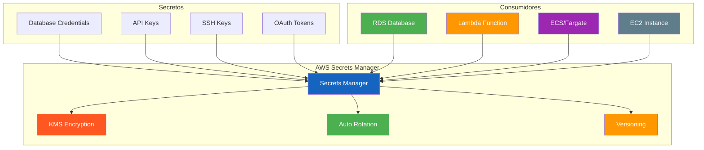
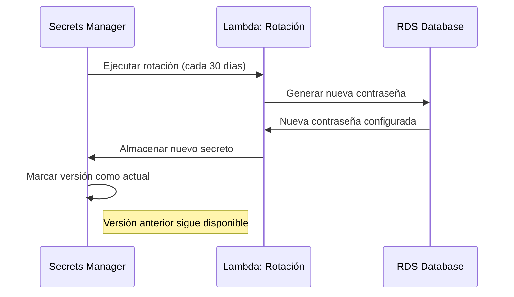
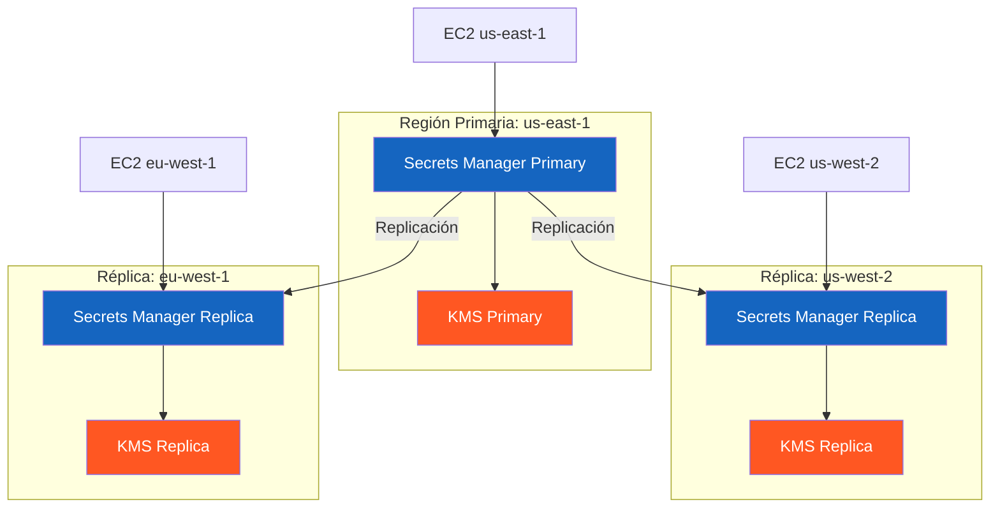

# AWS Secrets Manager

AWS Secrets Manager es un servicio que facilita la gestión de secretos como contraseñas de bases de datos, claves de API, credenciales OAuth y otros datos sensibles. Proporciona rotación automática, cifrado en reposo y acceso centralizado.

---

## ¿Qué es AWS Secrets Manager?

Secrets Manager protege el acceso a secretos mediante:

- **Cifrado** en reposo con KMS
- **Rotación automática** de credenciales
- **Auditoría** con CloudTrail
- **Control de acceso** con IAM
- **Multi-region** para alta disponibilidad



---

## Secrets Manager vs Parameter Store

| Característica | Secrets Manager | Parameter Store |
|----------------|----------------|-----------------|
| Costo | $0.40/secret/mes + $0.05/10K API calls | Gratis (standard) o $0.05/parámetro (advanced) |
| Rotación automática | Sí, nativa con Lambda | No |
| Multi-region | Sí | No |
| Versionado | Sí | Sí |
| Cifrado | KMS (integrado) | KMS (opcional) |
| Integración RDS | Nativa, un clic | Manual |
| Uso recomendado | Secretos con rotación | Configuraciones no sensibles |

### Cuándo usar cada uno

```
Secrets Manager:
- Contraseñas de bases de datos
- Claves de API de servicios externos
- Credenciales OAuth
- Cualquier secret que necesite rotación automática

Parameter Store:
- Configuraciones de aplicación
- Valores no sensibles
- Listas de feature flags
- Información de entornos
```

---

## Crear y Gestionar Secretos

### Crear un secreto de base de datos

```bash
# Crear secreto para RDS MySQL
aws secretsmanager create-secret \
    --name "produccion/mysql/admin" \
    --description "Credenciales de administrador MySQL para producción" \
    --secret-string '{
        "username": "admin",
        "password": "MySecureP@ssw0rd!",
        "engine": "mysql",
        "host": "mi-rds-cluster.cluster-xxxxx.us-east-1.rds.amazonaws.com",
        "port": 3306,
        "dbname": "mi_base_datos"
    }' \
    --tags '[
        {"Key": "Environment", "Value": "Production"},
        {"Key": "Service", "Value": "WebApp"},
        {"Key": "Team", "Value": "Backend"}
    ]'
```

### Crear un secreto de clave de API

```bash
# Crear secreto para API externa
aws secretsmanager create-secret \
    --name "produccion/stripe/api-key" \
    --description "Clave de API de Stripe para producción" \
    --secret-string "sk_live_1234567890abcdef"
```

### Obtener un secreto

```bash
# Obtener secreto por nombre
aws secretsmanager get-secret-value \
    --secret-id "produccion/mysql/admin"

# Obtener secreto por ARN
aws secretsmanager get-secret-value \
    --secret-id "arn:aws:secretsmanager:us-east-1:123456789012:secret:produccion/mysql/admin-AbCdEf"

# Obtener solo el valor del password
aws secretsmanager get-secret-value \
    --secret-id "produccion/mysql/admin" \
    --query 'SecretString' \
    --output text | jq -r '.password'
```

### Listar secretos

```bash
# Listar todos los secretos
aws secretsmanager list-secrets

# Listar secretos con filtro
aws secretsmanager list-secrets \
    --filters '[
        {"Key": "tag-key", "Values": ["Environment"]},
        {"Key": "tag-value", "Values": ["Production"]}
    ]'
```

### Actualizar un secreto

```bash
# Actualizar contraseña
aws secretsmanager update-secret \
    --secret-id "produccion/mysql/admin" \
    --secret-string '{
        "username": "admin",
        "password": "NuevaContrasenaSegura123!",
        "engine": "mysql",
        "host": "mi-rds-cluster.cluster-xxxxx.us-east-1.rds.amazonaws.com",
        "port": 3306,
        "dbname": "mi_base_datos"
    }'
```

---

## Rotación Automática

La rotación automática es una de las características más poderosas de Secrets Manager.

### Cómo funciona la rotación



### Configurar rotación para RDS

```bash
# Crear Lambda para rotación de RDS
aws lambda create-function \
    --function-name "SecretsRotation-MySQL" \
    --runtime python3.9 \
    --handler index.handler \
    --role arn:aws:iam::123456789012:role/SecretsRotationRole \
    --zip-file fileb://rotation-lambda.zip \
    --timeout 30 \
    --environment '{
        "Variables": {
            "SECRETS_MANAGER_ENDPOINT": "https://secretsmanager.us-east-1.amazonaws.com"
        }
    }'

# Habilitar rotación
aws secretsmanager rotate-secret \
    --secret-id "produccion/mysql/admin" \
    --rotation-lambda-arn "arn:aws:lambda:us-east-1:123456789012:function:SecretsRotation-MySQL" \
    --rotation-rules '{
        "AutomaticallyAfterDays": 30
    }'

# Verificar estado de rotación
aws secretsmanager describe-secret \
    --secret-id "produccion/mysql/admin" \
    --query 'RotationEnabled'
```

### Script Lambda para rotación de RDS MySQL

```python
import boto3
import json
import pymysql
import random
import string

def lambda_handler(event, context):
    """Rotación automática de credenciales RDS MySQL."""
    secret_arn = event['SecretId']
    step = event['Step']
    
    sm = boto3.client('secretsmanager')
    
    if step == 'createSecret':
        create_secret(sm, secret_arn)
    elif step == 'setSecret':
        set_secret(sm, secret_arn)
    elif step == 'testSecret':
        test_secret(sm, secret_arn)
    elif step == 'finishSecret':
        finish_secret(sm, secret_arn)
    
    return {'statusCode': 200}

def generate_password(length=20):
    """Genera una contraseña segura."""
    chars = string.ascii_letters + string.digits + "!@#$%^&*"
    password = ''.join(random.SystemRandom().choice(chars) for _ in range(length))
    return password

def create_secret(sm, secret_arn):
    """Crea nueva versión del secreto."""
    current = sm.get_secret_value(SecretId=secret_arn, VersionStage='AWSCURRENT')
    current_dict = json.loads(current['SecretString'])
    
    new_password = generate_password()
    current_dict['password'] = new_password
    
    sm.put_secret_value(
        SecretId=secret_arn,
        SecretString=json.dumps(current_dict),
        VersionStages=['AWSPENDING'],
        ClientRequestToken=context.aws_request_id
    )

def set_secret(sm, secret_arn):
    """Configura la contraseña en la base de datos."""
    pending = sm.get_secret_value(
        SecretId=secret_arn,
        VersionStage='AWSPENDING',
        VersionId=context.aws_request_id
    )
    pending_dict = json.loads(pending['SecretString'])
    
    # Conectar y cambiar contraseña
    conn = pymysql.connect(
        host=pending_dict['host'],
        user=pending_dict['username'],
        password=pending_dict['password'],
        port=int(pending_dict['port'])
    )
    
    cursor = conn.cursor()
    cursor.execute(
        f"ALTER USER '{pending_dict['username']}'@'%' IDENTIFIED BY '{pending_dict['password']}'"
    )
    conn.commit()
    cursor.close()
    conn.close()

def test_secret(sm, secret_arn):
    """Prueba que el secreto funciona."""
    pending = sm.get_secret_value(
        SecretId=secret_arn,
        VersionStage='AWSPENDING',
        VersionId=context.aws_request_id
    )
    pending_dict = json.loads(pending['SecretString'])
    
    # Probar conexión
    conn = pymysql.connect(
        host=pending_dict['host'],
        user=pending_dict['username'],
        password=pending_dict['password'],
        port=int(pending_dict['port'])
    )
    conn.close()

def finish_secret(sm, secret_arn):
    """Marca la versión como actual."""
    metadata = sm.describe_secret(SecretId=secret_arn)
    current_version = None
    
    for version, stages in metadata['VersionIdsToStages'].items():
        if 'AWSCURRENT' in stages:
            current_version = version
            break
    
    sm.update_secret_version_stage(
        SecretId=secret_arn,
        VersionStage='AWSCURRENT',
        MoveToVersionId=context.aws_request_id,
        RemoveFromVersionId=current_version
    )
```

---

## Multi-Region Secrets

Secrets Manager soporta replicación multi-region para alta disponibilidad.

```bash
# Crear secreto multi-region
aws secretsmanager create-secret \
    --name "produccion/mysql/admin" \
    --secret-string '{"username":"admin","password":"SecurePass123!"}' \
    --add-replica-regions '[{"Region":"us-west-2"},{"Region":"eu-west-1"}]'

# Agregar réplica a secreto existente
aws secretsmanager replicate-secret-to-regions \
    --secret-id "produccion/mysql/admin" \
    --replica-regions '[{"Region":"ap-southeast-1"}]'

# Listar réplicas
aws secretsmanager describe-secret \
    --secret-id "produccion/mysql/admin" \
    --query 'ReplicationStatus'
```

### Arquitectura Multi-Region



---

## Versionado

Secrets Manager mantiene versiones de cada secreto.

| Versión | Descripción |
|---------|-------------|
| AWSCURRENT | Versión activa actual |
| AWSPREVIOUS | Versión anterior (backup) |
| AWSPENDING | Versión pendiente de rotación |
| Personalizada | Para A/B testing o migraciones |

```bash
# Obtener versión específica
aws secretsmanager get-secret-value \
    --secret-id "produccion/mysql/admin" \
    --version-stage AWSCURRENT

# Obtener versiones anteriores
aws secretsmanager list-secret-version-ids \
    --secret-id "produccion/mysql/admin"

# Restaurar versión anterior
aws secretsmanager update-secret-version-stage \
    --secret-id "produccion/mysql/admin" \
    --version-stage AWSCURRENT \
    --move-to-version-id <VERSION_ID_ANTERIOR>
```

---

## Cifrado

Todos los secretos se cifran con KMS automáticamente.

```bash
# Crear secreto con CMK específica
aws secretsmanager create-secret \
    --name "produccion/mysql/admin" \
    --secret-string '{"password":"SecurePass123!"}' \
    --kms-key-id "arn:aws:kms:us-east-1:123456789012:key/uuid-cmk"

# Re-cifrar secreto con nueva CMK
aws secretsmanager rotate-secret \
    --secret-id "produccion/mysql/admin" \
    --kms-key-id "arn:aws:kms:us-east-1:123456789012:key/nueva-cmk"
```

---

## Integración con Servicios

### Amazon RDS

```python
import boto3
import json
import pymysql

def get_db_connection():
    """Obtiene conexión a RDS usando Secrets Manager."""
    sm = boto3.client('secretsmanager')
    
    response = sm.get_secret_value(
        SecretId='produccion/mysql/admin'
    )
    
    secret = json.loads(response['SecretString'])
    
    conn = pymysql.connect(
        host=secret['host'],
        user=secret['username'],
        password=secret['password'],
        port=int(secret['port']),
        database=secret['dbname'],
        cursorclass=pymysql.cursors.DictCursor
    )
    
    return conn

def lambda_handler(event, context):
    """Lambda que accede a RDS via Secrets Manager."""
    conn = get_db_connection()
    cursor = conn.cursor()
    
    cursor.execute("SELECT * FROM usuarios WHERE activo = 1")
    usuarios = cursor.fetchall()
    
    cursor.close()
    conn.close()
    
    return {'usuarios': usuarios}
```

### AWS Lambda

```python
import boto3
import json
import os

def lambda_handler(event, context):
    """Lambda que usa secretos de API externa."""
    sm = boto3.client('secretsmanager')
    
    # Obtener clave de API de Stripe
    response = sm.get_secret_value(
        SecretId=os.environ['STRIPE_SECRET_ARN']
    )
    
    stripe_key = response['SecretString']
    
    # Usar la clave de API
    import stripe
    stripe.api_key = stripe_key
    
    # Crear cargo
    charge = stripe.Charge.create(
        amount=2000,
        currency='usd',
        source='tok_visa',
        description='Cargo de ejemplo'
    )
    
    return {'charge_id': charge.id}
```

### AWS ECS/Fargate

```yaml
# task-definition.json
{
    "family": "mi-app",
    "containerDefinitions": [
        {
            "name": "app",
            "image": "mi-app:latest",
            "secrets": [
                {
                    "name": "DB_PASSWORD",
                    "valueFrom": "arn:aws:secretsmanager:us-east-1:123456789012:secret:produccion/mysql/admin:password::"
                }
            ],
            "environment": [
                {
                    "name": "DB_HOST",
                    "value": "mi-rds.cluster-xxxxx.us-east-1.rds.amazonaws.com"
                }
            ]
        }
    ]
}
```

### Amazon ECS con Secrets Manager

```bash
# Registrar task definition con secrets
aws ecs register-task-definition \
    --family mi-app \
    --container-definitions '[
        {
            "name": "app",
            "image": "mi-app:latest",
            "secrets": [
                {
                    "name": "DB_PASSWORD",
                    "valueFrom": "arn:aws:secretsmanager:us-east-1:123456789012:secret:produccion/mysql/admin-AbCdEf:password::"
                }
            ],
            "environment": [
                {"name": "DB_HOST", "value": "mi-rds.cluster-xxxxx.us-east-1.rds.amazonaws.com"},
                {"name": "DB_USER", "value": "admin"}
            ],
            "logConfiguration": {
                "logDriver": "awslogs",
                "options": {
                    "awslogs-group": "/ecs/mi-app",
                    "awslogs-region": "us-east-1",
                    "awslogs-stream-prefix": "ecs"
                }
            }
        }
    ]'
```

---

## Códigos de Ejemplo Completos

### Aplicación Flask con Secrets Manager

```python
from flask import Flask, jsonify
import boto3
import json
import os

app = Flask(__name__)

def get_secret(secret_name):
    """Obtiene secreto de Secrets Manager."""
    sm = boto3.client('secretsmanager')
    response = sm.get_secret_value(SecretId=secret_name)
    return json.loads(response['SecretString'])

@app.route('/api/health')
def health():
    return jsonify({'status': 'healthy'})

@app.route('/api/users')
def get_users():
    db_secret = get_secret('produccion/mysql/admin')
    
    import pymysql
    conn = pymysql.connect(
        host=db_secret['host'],
        user=db_secret['username'],
        password=db_secret['password'],
        database=db_secret['dbname']
    )
    
    cursor = conn.cursor(pymysql.cursors.DictCursor)
    cursor.execute("SELECT id, nombre, email FROM usuarios")
    users = cursor.fetchall()
    
    cursor.close()
    conn.close()
    
    return jsonify({'users': users})

if __name__ == '__main__':
    app.run(host='0.0.0.0', port=5000)
```

### Script de rotación para API Key

```python
import boto3
import requests
import json

def rotate_api_key(secret_arn):
    """Rota una clave de API externa."""
    sm = boto3.client('secretsmanager')
    
    # Obtener secreto actual
    current = sm.get_secret_value(SecretId=secret_arn)
    config = json.loads(current['SecretString'])
    
    # Solicitar nueva clave al servicio externo
    response = requests.post(
        'https://api.externa.com/v1/rotate-key',
        headers={'Authorization': f'Bearer {config["old_key"]}'}
    )
    
    if response.status_code == 200:
        new_key = response.json()['new_key']
        
        # Actualizar secreto
        config['api_key'] = new_key
        sm.put_secret_value(
            SecretId=secret_arn,
            SecretString=json.dumps(config)
        )
        
        return True
    return False
```

---

## Precio

| Componente | Costo |
|------------|-------|
| Secretos almacenados | $0.40/secret/mes |
| API calls (invocaciones) | $0.05/10,000 invocaciones |
| Rotación automática | $0.05/10,000 invocaciones de Lambda |
| Multi-region | $0.40/secret/mes por réplica |
| Free tier | 30,000 invocaciones API gratis los primeros 12 meses |

---

## Mejores Prácticas

### 1. Usar ARN para referenciar secretos

```python
# MAL - Usar nombre
secret = sm.get_secret_value(SecretId='produccion/mysql/admin')

# BIEN - Usar ARN completo
secret = sm.get_secret_value(
    SecretId='arn:aws:secretsmanager:us-east-1:123456789012:secret:produccion/mysql/admin-AbCdEf'
)
```

### 2. Implementar rotación automática

```bash
# Configurar rotación cada 30 días
aws secretsmanager rotate-secret \
    --secret-id "produccion/mysql/admin" \
    --rotation-lambda-arn "arn:aws:lambda:us-east-1:123456789012:function:RotateRDS" \
    --rotation-rules '{"AutomaticallyAfterDays": 30}'
```

### 3. Usar etiquetas para organización

```bash
aws secretsmanager create-secret \
    --name "produccion/mysql/admin" \
    --tags '[
        {"Key": "Environment", "Value": "Production"},
        {"Key": "Service", "Value": "WebApp"},
        {"Key": "Team", "Value": "Backend"},
        {"Key": "CostCenter", "Value": "CC-1234"},
        {"Key": "DataClassification", "Value": "Confidential"}
    ]'
```

### 4. Configurar políticas de acceso

```json
{
    "Version": "2012-10-17",
    "Statement": [
        {
            "Sid": "PermitirAccesoPorTag",
            "Effect": "Allow",
            "Action": [
                "secretsmanager:GetSecretValue",
                "secretsmanager:DescribeSecret"
            ],
            "Resource": "*",
            "Condition": {
                "StringEquals": {
                    "aws:ResourceTag/Service": "WebApp",
                    "aws:ResourceTag/Environment": "Production"
                }
            }
        }
    ]
}
```

### 5. Monitorear con CloudWatch

```bash
# Crear alarma para errores de rotación
aws cloudwatch put-metric-alarm \
    --alarm-name "SecretsRotationFailed" \
    --metric-name "RotationFailed" \
    --namespace "AWS/SecretsManager" \
    --statistic Sum \
    --period 300 \
    --threshold 1 \
    --comparison-operator GreaterThanOrEqualToThreshold \
    --evaluation-periods 1 \
    --alarm-actions "arn:aws:sns:us-east-1:123456789012:alertas-seguridad"
```

---

## Errores Comunes

| Error | Consecuencia | Solución |
|-------|--------------|---------|
| Hardcodear secretos en código | Exposición en repositorios | Usar Secrets Manager |
| No rotar credenciales | Riesgo de compromiso a largo plazo | Habilitar rotación automática |
| No usar ARN | Errores de referencia | Siempre usar ARN completo |
| No etiquetar secretos | Difícil de administrar | Usar etiquetas consistentes |
| No configurar políticas IAM | Acceso no controlado | Implementar menor privilegio |
| No monitorear rotación | Fallos silenciosos | Crear alarmas CloudWatch |

---

## Preguntas Frecuentes (FAQ)

### ¿Cuántos secretos puedo almacenar?

No hay límite en el número de secretos. El costo es $0.40/secret/mes.

### ¿Puedo migrar secretos de Parameter Store a Secrets Manager?

Sí, puede crear secretos en Secrets Manager y actualizar sus aplicaciones gradualmente.

### ¿Cómo funciona la rotación automática?

Secrets Manager ejecuta una función Lambda según un calendario. La Lambda genera nuevas credenciales, las actualiza en el servicio, y Secrets Manager actualiza el secreto.

### ¿Puedo usar Secrets Manager con aplicaciones on-premises?

Sí, puede acceder a Secrets Manager desde cualquier lugar con acceso a Internet usando la API HTTPS.

### ¿Qué sucede si la rotación falla?

Secrets Manager registra el error en CloudWatch. La versión anterior sigue activa. Puede revisar el problema y reintentar manualmente.

### ¿Secrets Manager cifra los secretos?

Sí, todos los secretos se cifran con KMS automáticamente. Puede usar una CMK personalizada para mayor control.

### ¿Puedo compartir secretos entre cuentas?

Sí, puede usar políticas de recurso para compartir secretos entre cuentas de AWS.

---

## Resumen

AWS Secrets Manager es esencial para gestionar secretos en la nube:

- **Gestión centralizada**: Almacena y administra todos los secretos en un lugar
- **Rotación automática**: Credenciales siempre frescas con Lambda
- **Multi-region**: Alta disponibilidad con réplicas
- **Cifrado**: Protección en reposo con KMS
- **Integración**: RDS, Lambda, ECS, EC2 y más
- **Versionado**: Mantiene versiones anteriores para rollback
- **Auditoría**: Registro completo con CloudTrail
- **Costo**: $0.40/secret/mes + $0.05/10K API calls

Secrets Manager debe ser la primera consideración para almacenar cualquier credencial o dato sensible en AWS.
