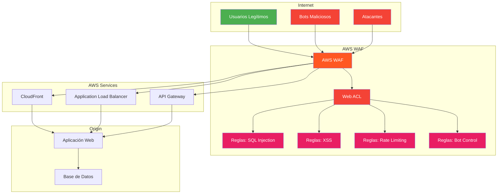
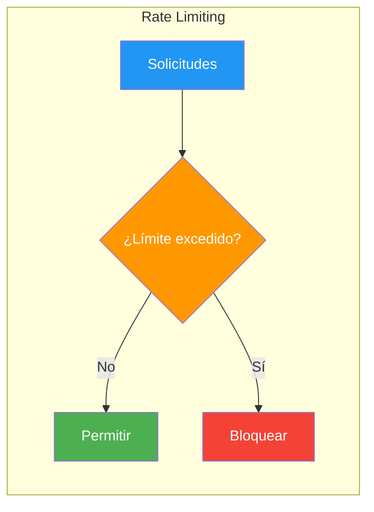
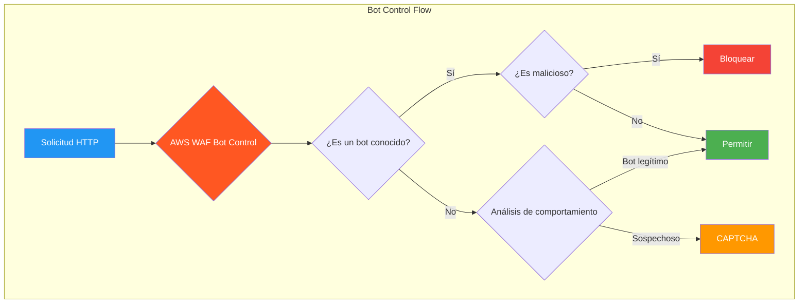
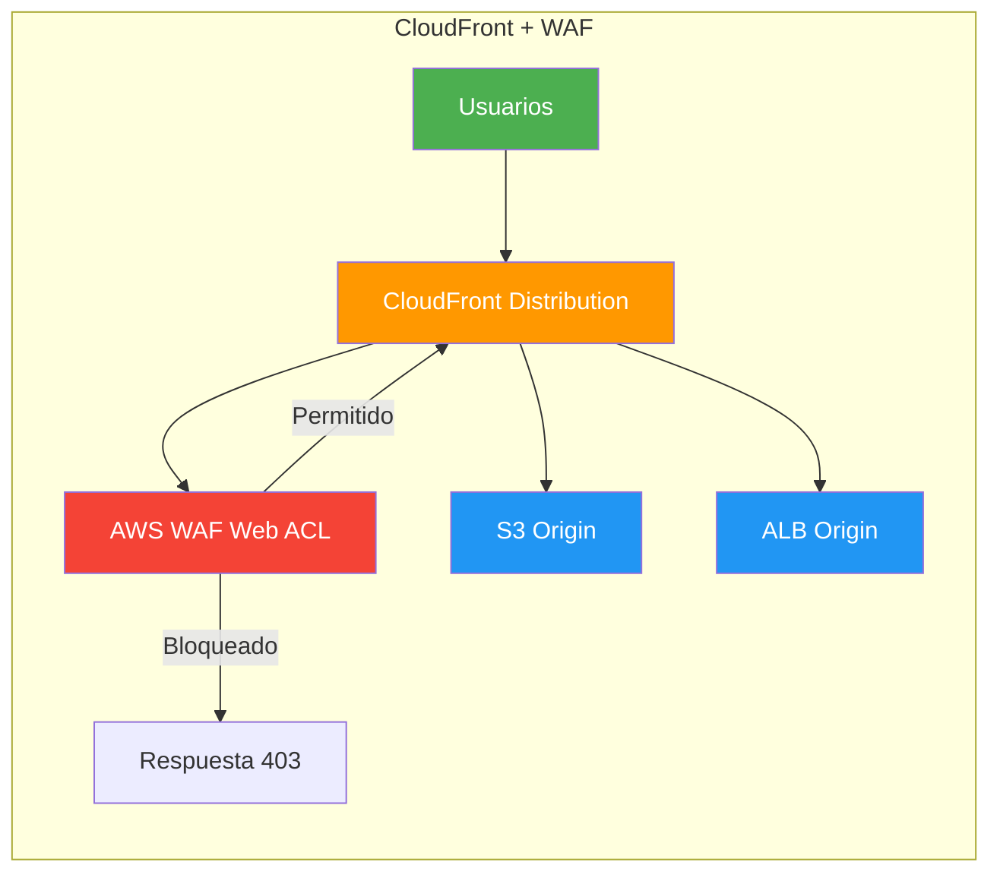
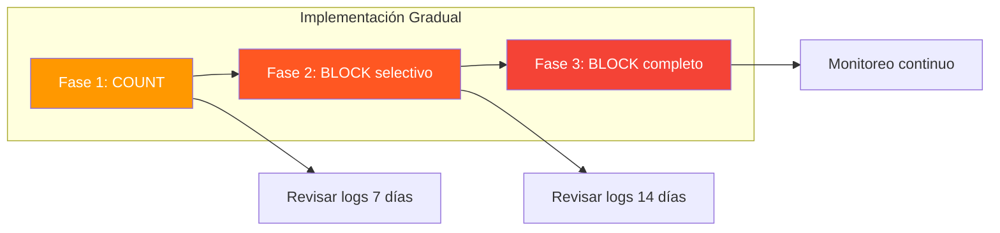

# AWS WAF - Web Application Firewall

AWS WAF (Web Application Firewall) protege las aplicaciones web contra tráfico malicioso y exploit de vulnerabilidades comunes. Permite crear reglas personalizadas para filtrar y monitorear las solicitudes HTTP/HTTPS.

---

## ¿Qué es AWS WAF?

AWS WAF actúa como una barrera de protección entre Internet y sus aplicaciones web. Filtra solicitudes maliciosas antes de que lleguen a sus servidores.

### Características principales

| Característica | Descripción |
|----------------|-------------|
| Web ACLs | Listas de control de acceso web |
| Reglas manejadas | Reglas pre-configuradas por AWS |
| Reglas personalizadas | Reglas creadas por usted |
| Rate limiting | Limitación de solicitudes por IP |
| Protección SQL injection | Detección de ataques SQL |
| Protección XSS | Detección de cross-site scripting |
| Bot control | Identificación y bloqueo de bots |
| Geographic blocking | Bloqueo por geolocalización |



---

## Web ACLs (Web Access Control Lists)

Una Web ACL es el contenedor principal de AWS WAF. Define qué tráfico permitir, bloquear o contar.

### Crear una Web ACL

```bash
# Crear Web ACL para CloudFront
aws wafv2 create-web-acl \
    --name "MiWebACL" \
    --scope CLOUDFRONT \
    --default-action Allow={} \
    --rules '[
        {
            "Name": "SQLInjectionRule",
            "Priority": 1,
            "Action": {"Block": {}},
            "Statement": {
                "SqliMatchStatement": {
                    "FieldToMatch": {"UriPath": {}},
                    "TextTransformations": [
                        {
                            "Priority": 0,
                            "Type": "URL_DECODE"
                        }
                    ]
                }
            },
            "VisibilityConfig": {
                "SampledRequestsEnabled": true,
                "CloudWatchMetricsEnabled": true,
                "MetricName": "SQLInjectionRule"
            }
        },
        {
            "Name": "RateLimitRule",
            "Priority": 2,
            "Action": {"Block": {}},
            "Statement": {
                "RateBasedStatement": {
                    "Limit": 2000,
                    "AggregateKeyType": "IP"
                }
            },
            "VisibilityConfig": {
                "SampledRequestsEnabled": true,
                "CloudWatchMetricsEnabled": true,
                "MetricName": "RateLimitRule"
            }
        }
    ]' \
    --visibility-config '{
        "SampledRequestsEnabled": true,
        "CloudWatchMetricsEnabled": true,
        "MetricName": "MiWebACL"
    }' \
    --id $(uuidgen | cut -d'-' -f1)
```

---

## Tipos de Reglas

### 1. Reglas de SQL Injection

```bash
# Regla para detectar SQL injection en URI
aws wafv2 create-rule-group \
    --name "SQLInjectionProtection" \
    --scope CLOUDFRONT \
    --capacity 50 \
    --rules '[
        {
            "Name": "SQLInjectionURI",
            "Priority": 1,
            "Action": {"Block": {}},
            "Statement": {
                "SqliMatchStatement": {
                    "FieldToMatch": {"UriPath": {}},
                    "TextTransformations": [
                        {"Priority": 0, "Type": "URL_DECODE"},
                        {"Priority": 1, "Type": "HTML_ENTITY_DECODE"}
                    ]
                }
            },
            "VisibilityConfig": {
                "SampledRequestsEnabled": true,
                "CloudWatchMetricsEnabled": true,
                "MetricName": "SQLInjectionURI"
            }
        }
    ]' \
    --visibility-config '{
        "SampledRequestsEnabled": true,
        "CloudWatchMetricsEnabled": true,
        "MetricName": "SQLInjectionProtection"
    }'
```

### 2. Reglas de Cross-Site Scripting (XSS)

```bash
# Regla para detectar XSS en query strings
aws wafv2 create-rule-group \
    --name "XSSProtection" \
    --scope CLOUDFRONT \
    --capacity 50 \
    --rules '[
        {
            "Name": "XSSQueryString",
            "Priority": 1,
            "Action": {"Block": {}},
            "Statement": {
                "XssMatchStatement": {
                    "FieldToMatch": {"QueryString": {}},
                    "TextTransformations": [
                        {"Priority": 0, "Type": "URL_DECODE"},
                        {"Priority": 1, "Type": "HTML_ENTITY_DECODE"}
                    ]
                }
            },
            "VisibilityConfig": {
                "SampledRequestsEnabled": true,
                "CloudWatchMetricsEnabled": true,
                "MetricName": "XSSQueryString"
            }
        }
    ]' \
    --visibility-config '{
        "SampledRequestsEnabled": true,
        "CloudWatchMetricsEnabled": true,
        "MetricName": "XSSProtection"
    }'
```

### 3. Rate Limiting



```bash
# Regla de rate limiting por IP
aws wafv2 update-rule-group \
    --name "MiWebACL" \
    --scope CLOUDFRONT \
    --id <RULE_GROUP_ID> \
    --lock-token <LOCK_TOKEN> \
    --rules '[
        {
            "Name": "RateLimitPerIP",
            "Priority": 10,
            "Action": {"Block": {}},
            "Statement": {
                "RateBasedStatement": {
                    "Limit": 2000,
                    "AggregateKeyType": "IP",
                    "ScopeDownStatement": {
                        "ByteMatchStatement": {
                            "FieldToMatch": {"UriPath": {}},
                            "PositionalConstraint": "STARTS_WITH",
                            "SearchString": "/api/",
                            "TextTransformations": [
                                {"Priority": 0, "Type": "LOWERCASE"}
                            ]
                        }
                    }
                }
            },
            "VisibilityConfig": {
                "SampledRequestsEnabled": true,
                "CloudWatchMetricsEnabled": true,
                "MetricName": "RateLimitPerIP"
            }
        }
    ]'
```

### 4. Geographic Blocking

```bash
# Bloquear países específicos
aws wafv2 create-rule-group \
    --name "GeoBlocking" \
    --scope CLOUDFRONT \
    --capacity 20 \
    --rules '[
        {
            "Name": "BlockHighRiskCountries",
            "Priority": 1,
            "Action": {"Block": {"CustomResponse": {"ResponseCode": 403}}},
            "Statement": {
                "GeoMatchStatement": {
                    "CountryCodes": ["XX", "YY", "ZZ"]
                }
            },
            "VisibilityConfig": {
                "SampledRequestsEnabled": true,
                "CloudWatchMetricsEnabled": true,
                "MetricName": "GeoBlocking"
            }
        }
    ]' \
    --visibility-config '{
        "SampledRequestsEnabled": true,
        "CloudWatchMetricsEnabled": true,
        "MetricName": "GeoBlocking"
    }'
```

### 5. Regla de lista de IPs

```bash
# Crear lista de IPs bloqueadas
aws wafv2 create-ip-set \
    --name "IPBlacklist" \
    --scope CLOUDFRONT \
    --ip-address-version IPV4 \
    --addresses "192.0.2.0/24" "203.0.113.0/24"

# Crear regla basada en lista de IPs
aws wafv2 create-rule-group \
    --name "IPBlacklistRule" \
    --scope CLOUDFRONT \
    --capacity 10 \
    --rules '[
        {
            "Name": "BlockBlacklistedIPs",
            "Priority": 1,
            "Action": {"Block": {}},
            "Statement": {
                "IPSetReferenceStatement": {
                    "ARN": "arn:aws:wafv2:us-east-1:123456789012:regional/ipset/IPBlacklist/uuid"
                }
            },
            "VisibilityConfig": {
                "SampledRequestsEnabled": true,
                "CloudWatchMetricsEnabled": true,
                "MetricName": "IPBlacklist"
            }
        }
    ]'
```

### 6. Regla de Body Size

```bash
# Limitar tamaño del body
aws wafv2 create-rule-group \
    --name "BodySizeLimit" \
    --scope CLOUDFRONT \
    --capacity 10 \
    --rules '[
        {
            "Name": "LimitBodySize",
            "Priority": 1,
            "Action": {"Block": {}},
            "Statement": {
                "SizeConstraintStatement": {
                    "FieldToMatch": {"Body": {}},
                    "ComparisonOperator": "GT",
                    "Size": 10240,
                    "TextTransformations": [
                        {"Priority": 0, "Type": "NONE"}
                    ]
                }
            },
            "VisibilityConfig": {
                "SampledRequestsEnabled": true,
                "CloudWatchMetricsEnabled": true,
                "MetricName": "BodySizeLimit"
            }
        }
    ]'
```

---

## Reglas Manejadas (Managed Rules)

AWS WAF ofrece reglas pre-configuradas para proteger contra amenazas comunes.

### Reglas manejadas populares

| Regla | Propósito | Costo |
|-------|-----------|-------|
| AWSManagedRulesCommonRuleSet | Protección general | $1.00/mes + $0.60/1M solicitudes |
| AWSManagedRulesSQLiRuleSet | SQL injection | $1.00/mes + $0.60/1M solicitudes |
| AWSManagedRulesKnownBadInputsRuleSet | Inputs maliciosos conocidos | $1.00/mes + $0.60/1M solicitudes |
| AWSManagedRulesAmazonIpReputationList | IPs con mala reputación | $1.00/mes + $0.60/1M solicitudes |
| AWSManagedRulesBotControlRuleSet | Control de bots | $10.00/mes + $1.00/1M solicitudes |
| AWSManagedRulesAnonymousIpList | IPs anónimas | $1.00/mes + $0.60/1M solicitudes |

### Agregar regla manejada

```bash
# Agregar AWSManagedRulesCommonRuleSet
aws wafv2 update-web-acl \
    --name "MiWebACL" \
    --scope CLOUDFRONT \
    --id <WEB_ACL_ID> \
    --rules '[
        {
            "Name": "AWSManagedRulesCommonRuleSet",
            "Priority": 1,
            "OverrideAction": {"None": {}},
            "Statement": {
                "ManagedRuleGroupStatement": {
                    "VendorName": "AWS",
                    "Name": "AWSManagedRulesCommonRuleSet",
                    "RuleActionOverrides": [
                        {
                            "Name": "SizeRestrictions_BODY",
                            "ActionToUse": {"Block": {}}
                        }
                    ]
                }
            },
            "VisibilityConfig": {
                "SampledRequestsEnabled": true,
                "CloudWatchMetricsEnabled": true,
                "MetricName": "CommonRuleSet"
            }
        }
    ]' \
    --lock-token <LOCK_TOKEN>
```

---

## Bot Control

El Bot Control identifica y mitiga el tráfico de bots maliciosos.



### Configurar Bot Control

```bash
# Agregar Bot Control
aws wafv2 update-web-acl \
    --name "MiWebACL" \
    --scope CLOUDFRONT \
    --id <WEB_ACL_ID> \
    --rules '[
        {
            "Name": "AWSManagedRulesBotControlRuleSet",
            "Priority": 0,
            "OverrideAction": {"None": {}},
            "Statement": {
                "ManagedRuleGroupStatement": {
                    "VendorName": "AWS",
                    "Name": "AWSManagedRulesBotControlRuleSet",
                    "ManagedRuleGroupConfigs": [
                        {
                            "AwsManagedRulesBotControlRuleSet": {
                                "InspectionLevel": "COMMON"
                            }
                        }
                    ]
                }
            },
            "VisibilityConfig": {
                "SampledRequestsEnabled": true,
                "CloudWatchMetricsEnabled": true,
                "MetricName": "BotControl"
            }
        }
    ]' \
    --lock-token <LOCK_TOKEN>
```

---

## Integración con Servicios AWS

### CloudFront



```bash
# Asociar Web ACL a CloudFront
aws wafv2 associate-web-acl \
    --web-acl-arn <WEB_ACL_ARN> \
    --resource-arn <CLOUDFRONT_DISTRIBUTION_ARN>
```

### Application Load Balancer

```bash
# Asociar Web ACL a ALB
aws wafv2 associate-web-acl \
    --web-acl-arn <WEB_ACL_ARN> \
    --resource-arn <ALB_ARN>
```

### API Gateway

```bash
# Asociar Web ACL a API Gateway REST API
aws wafv2 associate-web-acl \
    --web-acl-arn <WEB_ACL_ARN> \
    --resource-arn <API_GATEWAY_ARN>
```

### Amazon AppSync (GraphQL)

```bash
# Asociar Web ACL a AppSync
aws wafv2 associate-web-acl \
    --web-acl-arn <WEB_ACL_ARN> \
    --resource-arn <APPSYNC_ARN>
```

---

## Reglas Personalizadas Avanzadas

### Regla de bloqueo por header

```bash
# Bloquear solicitudes sin header de autenticación
aws wafv2 create-rule-group \
    --name "AuthHeaderRequired" \
    --scope REGIONAL \
    --capacity 10 \
    --rules '[
        {
            "Name": "BlockNoAuthHeader",
            "Priority": 1,
            "Action": {"Block": {}},
            "Statement": {
                "NotStatement": {
                    "Statement": {
                        "ByteMatchStatement": {
                            "FieldToMatch": {
                                "SingleHeader": {"Name": "authorization"}
                            },
                            "PositionalConstraint": "STARTS_WITH",
                            "SearchString": "Bearer ",
                            "TextTransformations": [
                                {"Priority": 0, "Type": "LOWERCASE"}
                            ]
                        }
                    }
                }
            },
            "VisibilityConfig": {
                "SampledRequestsEnabled": true,
                "CloudWatchMetricsEnabled": true,
                "MetricName": "AuthHeaderRequired"
            }
        }
    ]' \
    --visibility-config '{
        "SampledRequestsEnabled": true,
        "CloudWatchMetricsEnabled": true,
        "MetricName": "AuthHeaderRequired"
    }'
```

### Regla de bloqueo por user-agent

```bash
# Bloquear user-agents maliciosos
aws wafv2 create-rule-group \
    --name "MaliciousUserAgents" \
    --scope CLOUDFRONT \
    --capacity 20 \
    --rules '[
        {
            "Name": "BlockBadUserAgents",
            "Priority": 1,
            "Action": {"Block": {}},
            "Statement": {
                "OrStatement": {
                    "Statements": [
                        {
                            "ByteMatchStatement": {
                                "FieldToMatch": {"Headers": {"Name": "user-agent"}},
                                "PositionalConstraint": "CONTAINS",
                                "SearchString": "sqlmap",
                                "TextTransformations": [
                                    {"Priority": 0, "Type": "LOWERCASE"}
                                ]
                            }
                        },
                        {
                            "ByteMatchStatement": {
                                "FieldToMatch": {"Headers": {"Name": "user-agent"}},
                                "PositionalConstraint": "CONTAINS",
                                "SearchString": "nikto",
                                "TextTransformations": [
                                    {"Priority": 0, "Type": "LOWERCASE"}
                                ]
                            }
                        }
                    ]
                }
            },
            "VisibilityConfig": {
                "SampledRequestsEnabled": true,
                "CloudWatchMetricsEnabled": true,
                "MetricName": "BadUserAgents"
            }
        }
    ]'
```

### Regla con条件 (Conditions)

```bash
# Bloquear solo en horario específico
aws wafv2 create-rule-group \
    --name "MaintenanceBlock" \
    --scope CLOUDFRONT \
    --capacity 10 \
    --rules '[
        {
            "Name": "BlockDuringMaintenance",
            "Priority": 1,
            "Action": {"Block": {"CustomResponse": {"ResponseCode": 503}}},
            "Statement": {
                "AndStatement": {
                    "Statements": [
                        {
                            "ByteMatchStatement": {
                                "FieldToMatch": {"UriPath": {}},
                                "PositionalConstraint": "STARTS_WITH",
                                "SearchString": "/api/",
                                "TextTransformations": [
                                    {"Priority": 0, "Type": "LOWERCASE"}
                                ]
                            }
                        },
                        {
                            "GeoMatchStatement": {
                                "CountryCodes": ["US"]
                            }
                        }
                    ]
                }
            },
            "VisibilityConfig": {
                "SampledRequestsEnabled": true,
                "CloudWatchMetricsEnabled": true,
                "MetricName": "MaintenanceBlock"
            }
        }
    ]'
```

---

## Monitoreo y Logging

### Habilitar logging con Kinesis Data Firehose

```bash
# Crear delivery stream para logs de WAF
aws firehose create-delivery-stream \
    --delivery-stream-name "WAFLogsStream" \
    --extended-s3-destination-configuration '{
        "RoleARN": "arn:aws:iam::123456789012:role/FirehoseRole",
        "BucketARN": "arn:aws:s3:::mi-bucket-logs-waf",
        "Prefix": "waf-logs/year=!{timestamp:yyyy}/month=!{timestamp:MM}/day=!{timestamp:dd}/",
        "ErrorOutputPrefix": "waf-errors/",
        "BufferingHints": {
            "SizeInMBs": 64,
            "IntervalInSeconds": 300
        }
    }'

# Habilitar logging en Web ACL
aws wafv2 put-logging-configuration \
    --logging-configuration '{
        "ResourceArn": "arn:aws:wafv2:us-east-1:123456789012:regional/webacl/MiWebACL/uuid",
        "LogDestinationConfigs": [
            "arn:aws:firehose:us-east-1:123456789012:deliverystream/WAFLogsStream"
        ],
        "RedactedFields": []
    }'
```

### CloudWatch Metrics

```bash
# Crear alarma para solicitudes bloqueadas
aws cloudwatch put-metric-alarm \
    --alarm-name "WAF-BlockedRequests" \
    --metric-name "BlockedRequests" \
    --namespace "AWS/WAFV2" \
    --statistic Sum \
    --period 300 \
    --threshold 1000 \
    --comparison-operator GreaterThanThreshold \
    --evaluation-periods 2 \
    --dimensions Name=WebACL,Value=MiWebACL Name=Region,Value=us-east-1 \
    --alarm-actions "arn:aws:sns:us-east-1:123456789012:alertas-waf"
```

---

## Precio

| Componente | Costo |
|------------|-------|
| Web ACLs | $5.00/mes por Web ACL |
| Reglas personalizadas | $0.60/1 millón de solicitudes |
| Reglas manejadas | $1.00/mes + $0.60/1M solicitudes |
| Bot Control | $10.00/mes + $1.00/1M solicitudes |
| Rate limiting | $0.60/1 millón de solicitudes |
| Logging | Costos de Kinesis Data Firehose + S3 |

### Ejemplo de costo mensual

| Componente | Cantidad | Costo |
|------------|----------|-------|
| Web ACL | 1 | $5.00 |
| Reglas manejadas (3) | 3 | $3.00 + $1.80 |
| Reglas personalizadas (5) | 5 | $3.00 |
| Solicitudes totales | 10M | $6.00 |
| **Total estimado** | | **$18.80/mes** |

---

## Mejores Prácticas

### 1. Empezar en modo COUNT

```bash
# Cambiar a modo COUNT para pruebas
aws wafv2 update-web-acl \
    --name "MiWebACL" \
    --scope CLOUDFRONT \
    --id <WEB_ACL_ID> \
    --default-action Allow={} \
    --rules '[
        {
            "Name": "SQLInjectionRule",
            "Priority": 1,
            "Count": {},
            "Statement": {
                "SqliMatchStatement": {
                    "FieldToMatch": {"UriPath": {}},
                    "TextTransformations": [
                        {"Priority": 0, "Type": "URL_DECODE"}
                    ]
                }
            }
        }
    ]'
```

### 2. Usar reglas manejadas como base

```bash
# Agregar conjunto básico de reglas manejadas
aws wafv2 update-web-acl \
    --name "MiWebACL" \
    --scope CLOUDFRONT \
    --rules '[
        {
            "Name": "AWSManagedRulesCommonRuleSet",
            "Priority": 1,
            "OverrideAction": {"None": {}},
            "Statement": {
                "ManagedRuleGroupStatement": {
                    "VendorName": "AWS",
                    "Name": "AWSManagedRulesCommonRuleSet"
                }
            }
        },
        {
            "Name": "AWSManagedRulesSQLiRuleSet",
            "Priority": 2,
            "OverrideAction": {"None": {}},
            "Statement": {
                "ManagedRuleGroupStatement": {
                    "VendorName": "AWS",
                    "Name": "AWSManagedRulesSQLiRuleSet"
                }
            }
        },
        {
            "Name": "AWSManagedRulesAmazonIpReputationList",
            "Priority": 3,
            "OverrideAction": {"None": {}},
            "Statement": {
                "ManagedRuleGroupStatement": {
                    "VendorName": "AWS",
                    "Name": "AWSManagedRulesAmazonIpReputationList"
                }
            }
        }
    ]'
```

### 3. Configurar rate limiting apropiado

```python
# Determinar límite de rate apropiado
def calculate_rate_limit(avg_requests_per_second):
    """Calcula límite de rate para WAF."""
    # Permitir 2x el promedio normal
    limit = avg_requests_per_second * 2 * 60  # Por minuto
    
    # Asegurar mínimo de 100
    return max(limit, 100)

# Ejemplo: 50 solicitudes/segundo promedio
limit = calculate_rate_limit(50)  # = 6000
```

### 4. Monitorear regularmente

```bash
# Revisar muestras de solicitudes
aws wafv2 get-sampled-requests \
    --web-acl-arn <WEB_ACL_ARN> \
    --rule-metric-name "SQLInjectionRule" \
    --scope CLOUDFRONT \
    --time-window '{
        "StartTime": "2024-01-01T00:00:00Z",
        "EndTime": "2024-01-01T23:59:59Z"
    }' \
    --max-items 100
```

### 5. Implementar bloqueo gradual



---

## Errores Comunes

| Error | Consecuencia | Solución |
|-------|--------------|---------|
| Empezar directamente con BLOCK | Bloquear tráfico legítimo | Empezar en modo COUNT |
| No monitorear métricas | No detectar falsos positivos | Configurar CloudWatch |
| No usar reglas manejadas | Pérdida de protección general | Agregar AWSManagedRulesCommonRuleSet |
| Rate limit demasiado bajo | Bloquear usuarios legítimos | Analizar tráfico normal primero |
| No actualizar reglas | Protección obsoleta | Revisar y actualizar mensualmente |
| No configurar logging | Sin visibilidad | Habilitar Kinesis Data Firehose |

---

## Preguntas Frecuentes (FAQ)

### ¿AWS WAF protege contra DDoS?

AWS WAF mitiga ataques de capa 7 (HTTP/HTTPS). Para protección completa contra DDoS, combine con AWS Shield Standard/Advanced.

### ¿Puedo usar WAF con aplicaciones on-premises?

Sí, puede usar WAF Regional con ALB que haga proxy hacia servidores on-premises.

### ¿Cuánto cuesta AWS WAF?

Una Web ACL cuesta $5/mes. Las reglas cuestan $0.60/1M solicitudes. Las reglas manejadas tienen costo adicional por mes.

### ¿Puedo crear mis propias reglas manejadas?

Sí, puede crear Rule Groups personalizadas y asociarlas a su Web ACL.

### ¿Cómo pruebo las reglas antes de activarlas?

Use el modo COUNT para registrar coincidencias sin bloquear. Revise los logs y luego cambie a BLOCK.

### ¿WAF funciona con WebSocket?

Sí, AWS WAF inspecta tanto tráfico HTTP/HTTPS como WebSocket.

### ¿Puedo excluir reglas manejadas específicas?

Sí, puede usar RuleActionOverrides para desactivar reglas específicas dentro de un conjunto manejado.

---

## Resumen

AWS WAF es esencial para proteger aplicaciones web en AWS:

- **Web ACLs**: Contenedor principal para reglas de filtrado
- **Reglas manejadas**: Protección pre-configurada por AWS
- **Reglas personalizadas**: SQL injection, XSS, rate limiting, geo-blocking
- **Bot Control**: Identificación y bloqueo de bots maliciosos
- **Integración**: CloudFront, ALB, API Gateway, AppSync
- **Logging**: Kinesis Data Firehose para análisis
- **Costo**: $5/mes Web ACL + $0.60/1M solicitudes
- **Monitoreo**: CloudWatch metrics y sampled requests

WAF debe ser la primera línea de defensa para cualquier aplicación web expuesta a Internet. Combine con Shield, GuardDuty y其他 servicios de seguridad para una protección completa.
