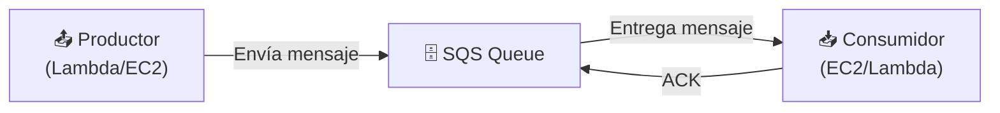
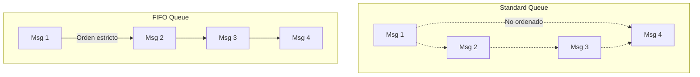
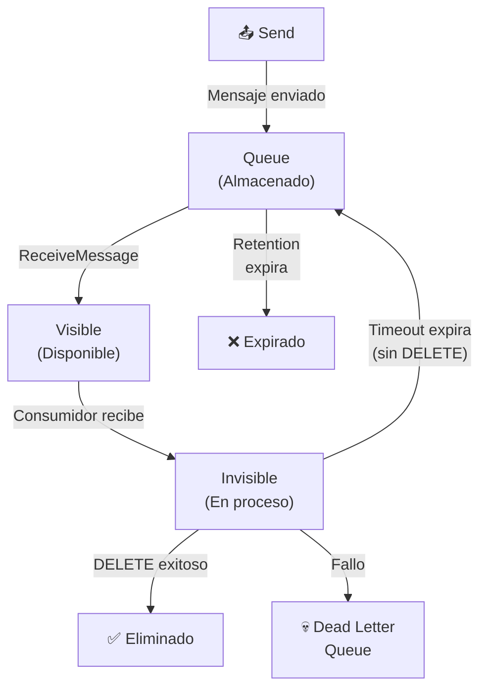
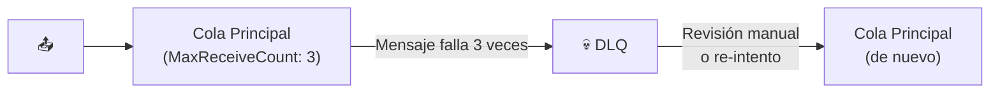
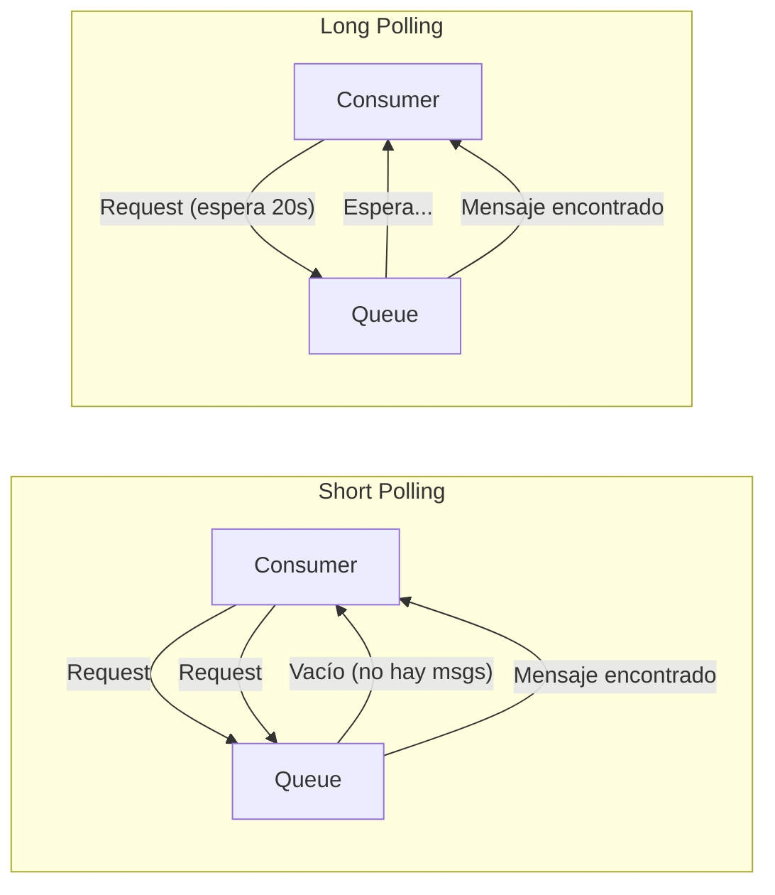
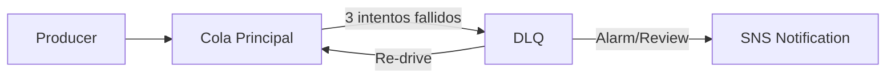
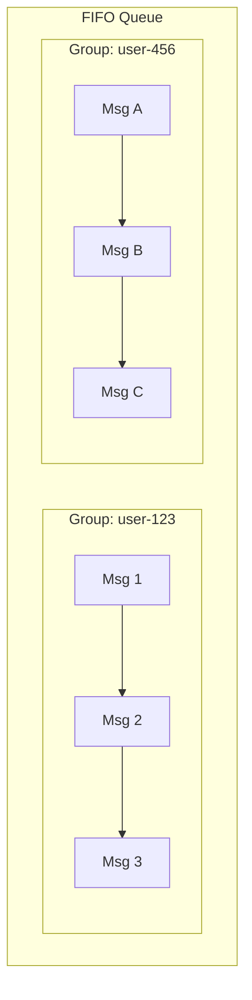
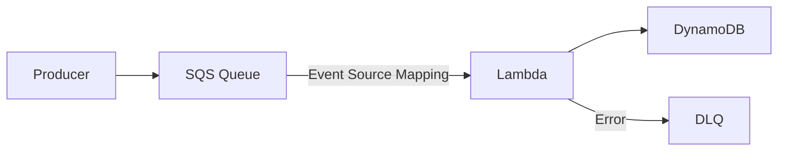
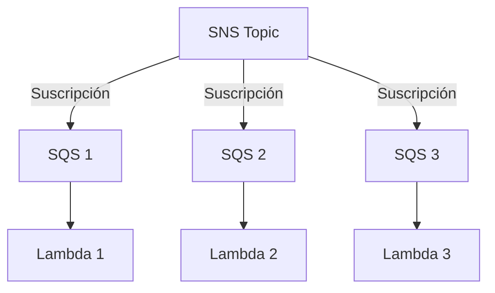
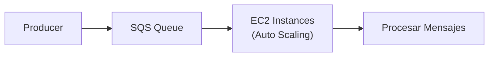

# Amazon SQS - Simple Queue Service

## ¿Qué es SQS?

Imagina que tienes un **buzón de correo** en tu oficina. Cuando alguien te envía un mensaje, lo deposita en el buzón y tú lo revisas cuando tienes tiempo. No necesitas estar presente cuando el remitente envía el mensaje. **Amazon SQS (Simple Queue Service)** es ese buzón de correo entre servicios: un servicio envía un mensaje a una cola, y otro servicio lo procesa cuando está disponible, sin necesidad de que ambos estén activos al mismo tiempo.



:::tip
SQS es **fully managed**: AWS se encarga de la infraestructura, escalabilidad, y disponibilidad. Tú solo envías y recibes mensajes.
:::

## Standard Queue vs FIFO Queue

| Característica | Standard Queue | FIFO Queue |
|---|---|---|
| Orden | **No garantizada** (best-effor) | **Estrictamente ordenada** |
| Throughput | **Illimitado** | **300 msg/s** (3,000 con batch) |
| Exactly-once delivery | No (at-least-once) | Sí |
| Deduplicación | No | Sí (Message Deduplication ID) |
| Message Group ID | No | Sí (requerido) |
| Costo | $0.40/millón | $0.50/millón |
| Nombre de cola | Hasta 80 caracteres | Termina en `.fifo` |
| Uso típico | Notificaciones, decoupling | Pedidos, transacciones financieras |



```bash
# Crear Standard Queue
aws sqs create-queue \
  --queue-name mi-cola-estandar \
  --attributes '{
    "VisibilityTimeout": "300",
    "MessageRetentionPeriod": "1209600",
    "ReceiveMessageWaitTimeSeconds": "20"
  }'

# Crear FIFO Queue
aws sqs create-queue \
  --queue-name mi-cola.fifo \
  --attributes '{
    "FifoQueue": "true",
    "ContentBasedDeduplication": "true",
    "VisibilityTimeout": "300"
  }'
```

## Ciclo de Vida de un Mensaje



### Pasos del ciclo:
1. **Producer** envía mensaje a la cola
2. Mensaje queda **visible** para ser recibido
3. **Consumer** recibe el mensaje (queda invisible por `VisibilityTimeout`)
4. Consumer procesa y envía **DELETE**
5. Si no se envía DELETE antes del timeout, el mensaje **vuelve a ser visible**

## Visibility Timeout

El **Visibility Timeout** es el tiempo que un mensaje permanece invisible después de ser recibido por un consumidor.

```
VisibilityTimeout: 300 segundos (5 minutos)

Tiempo 0: Mensaje recibido → invisible
Tiempo 60: Consumer procesa → envía DELETE → eliminado ✅
Tiempo 300: Si no se eliminó → vuelve a ser visible (posible re-procesamiento)
```

```bash
# Cambiar Visibility Timeout
aws sqs set-queue-attributes \
  --queue-url https://sqs.us-east-1.amazonaws.com/123456789012/mi-cola \
  --attributes '{"VisibilityTimeout": "600"}'
```

:::warning
Si tu procesamiento toma más tiempo que el Visibility Timeout, el mensaje será procesado **nuevamente**. Ajusta el timeout al tiempo máximo de procesamiento.
:::

## Dead Letter Queue (DLQ)

Una **Dead Letter Queue** captura mensajes que fallan repetidamente, evitando que se pierdan o se re-procesen indefinidamente.



```bash
# Crear DLQ
aws sqs create-queue \
  --queue-name mi-dlq

# Configurar Redrive Policy
aws sqs set-queue-attributes \
  --queue-url https://sqs.us-east-1.amazonaws.com/123456789012/mi-cola \
  --attributes '{
    "RedrivePolicy": "{\"deadLetterTargetArn\":\"arn:aws:sqs:us-east-1:123456789012:mi-dlq\",\"maxReceiveCount\":\"3\"}"
  }'
```

| Parámetro | Descripción | Valor típico |
|---|---|---|
| maxReceiveCount | Intentos antes de enviar a DLQ | 3-5 |
| deadLetterTargetArn | ARN de la cola DLQ | ARN completo |

## Message Retention

Cuánto tiempo SQS conserva un mensaje antes de eliminarlo automáticamente.

| Período | Valor |
|---|---|
| Mínimo | 1 minuto |
| Máximo | 14 días (1,209,600 segundos) |
| Default | 4 días (345,600 segundos) |

```bash
# Cambiar retención a 14 días
aws sqs set-queue-attributes \
  --queue-url https://sqs.us-east-1.amazonaws.com/123456789012/mi-cola \
  --attributes '{"MessageRetentionPeriod": "1209600"}'
```

## Long Polling vs Short Polling

| Característica | Short Polling | Long Polling |
|---|---|---|
| Comportamiento | Retorna inmediatamente | Espera hasta 20s por mensaje |
| Costo | Más peticiones = más caro | Menos peticiones = más barato |
| Eficiencia | Posibles respuestas vacías | Respuestas más completas |
| ReceiveMessageWaitTimeSeconds | 0 (default) | 1-20 segundos |
| Uso | Cuando necesitas respuesta inmediata | Cuando hay pausas entre mensajes |



```bash
# Habilitar Long Polling
aws sqs set-queue-attributes \
  --queue-url https://sqs.us-east-1.amazonaws.com/123456789012/mi-cola \
  --attributes '{"ReceiveMessageWaitTimeSeconds": "20"}'
```

## Batch Operations

Procesa múltiples mensajes en una sola llamada API, reduciendo costos y latencia.

| Operación | Máximo por batch |
|---|---|
| SendMessageBatch | 10 mensajes |
| DeleteMessageBatch | 10 mensajes |
| ChangeMessageVisibilityBatch | 10 mensajes |

```bash
# Enviar batch de mensajes
aws sqs send-message-batch \
  --queue-url https://sqs.us-east-1.amazonaws.com/123456789012/mi-cola \
  --entries '[
    {"Id": "1", "MessageBody": "Mensaje 1", "DelaySeconds": 10},
    {"Id": "2", "MessageBody": "Mensaje 2"},
    {"Id": "3", "MessageBody": "Mensaje 3"}
  ]'
```

## Server-Side Encryption (SSE)

| Tipo | Descripción | Key Management |
|---|---|---|
| SSE-SQS | SQS gestiona las claves | AWS-managed |
| SSE-KMS | Usas claves KMS | Customer-managed o AWS-managed |

```bash
# Habilitar SSE-KMS
aws sqs set-queue-attributes \
  --queue-url https://sqs.us-east-1.amazonaws.com/123456789012/mi-cola \
  --attributes '{
    "KmsMasterKeyId": "alias/mi-key",
    "KmsDataKeyReusePeriodSeconds": "300"
  }'
```

## Queue Policies

```json
{
  "Version": "2012-10-17",
  "Statement": [{
    "Sid": "AllowSendFromAccountB",
    "Effect": "Allow",
    "Principal": {"AWS": "arn:aws:iam::999888777666:root"},
    "Action": "sqs:SendMessage",
    "Resource": "arn:aws:sqs:us-east-1:123456789012:mi-cola",
    "Condition": {
      "ArnEquals": {"aws:SourceArn": "arn:aws:sns:us-east-1:123456789012:mi-topic"}
    }
  }]
}
```

## Redrive Policy



## Delay Queues

Retrasa la disponibilidad de mensajes hasta 15 minutos.

```bash
# Delay en cola completa
aws sqs set-queue-attributes \
  --queue-url https://sqs.us-east-1.amazonaws.com/123456789012/mi-cola \
  --attributes '{"DelaySeconds": "300"}'

# Delay por mensaje (máximo 15 min)
aws sqs send-message \
  --queue-url https://sqs.us-east-1.amazonaws.com/123456789012/mi-cola \
  --message-body "Mensaje con delay" \
  --delay-seconds 900
```

## Message Deduplication (FIFO)

SQS FIFO ofrece dos formas de deduplicación:

1. **Content-Based Deduplication**: Hash del body del mensaje
2. **Message Deduplication ID**: ID único que tú proporcionas

```bash
# Envío con deduplicación explícita
aws sqs send-message \
  --queue-url https://sqs.us-east-1.amazonaws.com/123456789012/mi-cola.fifo \
  --message-body "Pedido #12345" \
  --message-group-id "grupo-pedidos" \
  --message-deduplication-id "pedido-12345-2026"
```

## Message Group ID (FIFO)

**Message Group ID** define una secuencia de mensajes dentro de una FIFO Queue. Los mensajes dentro del mismo grupo se procesan **en orden**, pero diferentes grupos se procesan **en paralelo**.



## Integraciones Comunes

### SQS + Lambda



### SQS + SNS (Fan-Out)



### SQS + EC2



## Precio

| Concepto | Costo |
|---|---|
| Standard Queue | $0.40 por millón de requests |
| FIFO Queue | $0.50 por millón de requests |
| Datos transferidos | $0.09/GB (primera 10TB/mes) |
| Data Retention | Gratis |
| Long Polling | Gratis |
| SQS Free Tier | 1 millón de requests gratis/mes (12 meses) |

## Mejores Prácticas

1. **Usa Long Polling** para reducir costos y mejorar eficiencia
2. **Siempre configura DLQ** para mensajes que fallan
3. **Ajusta Visibility Timeout** al tiempo máximo de procesamiento
4. **Usa batch operations** para reducir llamadas API
5. **Habilita SSE-KMS** para datos sensibles
6. **Monitorea con CloudWatch** (ApproximateNumberOfMessages, AgeOfOldestMessage)
7. **Usa Message Group ID** para ordenar por entidad (ej: usuario, pedido)
8. **No uses SQS como base de datos** - es una cola temporal
9. **Configura tags** para gestión de costos

## Errores Comunes

| Error | Consecuencia | Solución |
|---|---|---|
| VisibilityTimeout muy bajo | Mensajes procesados múltiples veces | Aumentar timeout |
| Sin DLQ | Mensajes fallidos se pierden o re-procesan | Configurar DLQ con maxReceiveCount |
| Short polling innecesario | Costos altos por peticiones vacías | Usar Long Polling (20s) |
| FIFO sin Message Group ID | Error al enviar | Siempre incluir Message Group ID |
| SQS como cola infinita | Datos retenidos 14 días y eliminados | Monitorear y procesar a tiempo |

## Preguntas Frecuentes (FAQ)

**¿SQS garantiza exactly-once delivery?**
Solo FIFO Queue. Standard Queue es at-least-once.

**¿Puedo tener múltiples consumidores?**
Sí. SQS distribuye mensajes entre consumidores, pero cada mensaje se procesa solo una vez (con visibility timeout).

**¿Cuánto tiempo retiene SQS un mensaje?**
Hasta 14 días. Por defecto son 4 días.

**¿Puedo usar SQS con SNS?**
Sí. El patrón SNS → SQS (Fan-Out) es muy común para distribuir eventos a múltiples servicios.

## Tips para Entrevistas

1. **Standard vs FIFO:** Standard = high throughput, no orden. FIFO = ordered, exactly-once, lower throughput
2. **Visibility Timeout** evita procesamiento duplicado pero no lo elimina (at-least-once)
3. **DLQ** es crucial para debugging y no perder mensajes
4. **Long Polling** reduce costos y respuestas vacías
5. **SQS es pull-based** (consumer busca mensajes), SNS es push-based (envía mensajes)
6. **Fan-out pattern:** SNS → múltiples SQS para distribuir eventos

## Resumen

| Componente | Descripción |
|---|---|
| Standard Queue | Alto throughput, sin orden garantizado |
| FIFO Queue | Orden estricto, exactly-once, 300 msg/s |
| Visibility Timeout | Tiempo que un mensaje permanece invisible |
| DLQ | Captura mensajes fallidos para análisis |
| Long Polling | Espera mensajes en lugar de preguntar constantemente |
| Batch Operations | Envía/borra 10 mensajes por llamada |
| Message Group ID | Secuencia de mensajes dentro de FIFO |
| Message Deduplication | Evita mensajes duplicados en FIFO |
| Redrive Policy | Reglas para enviar mensajes a DLQ |
