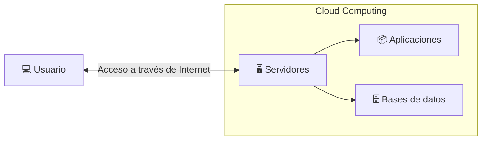
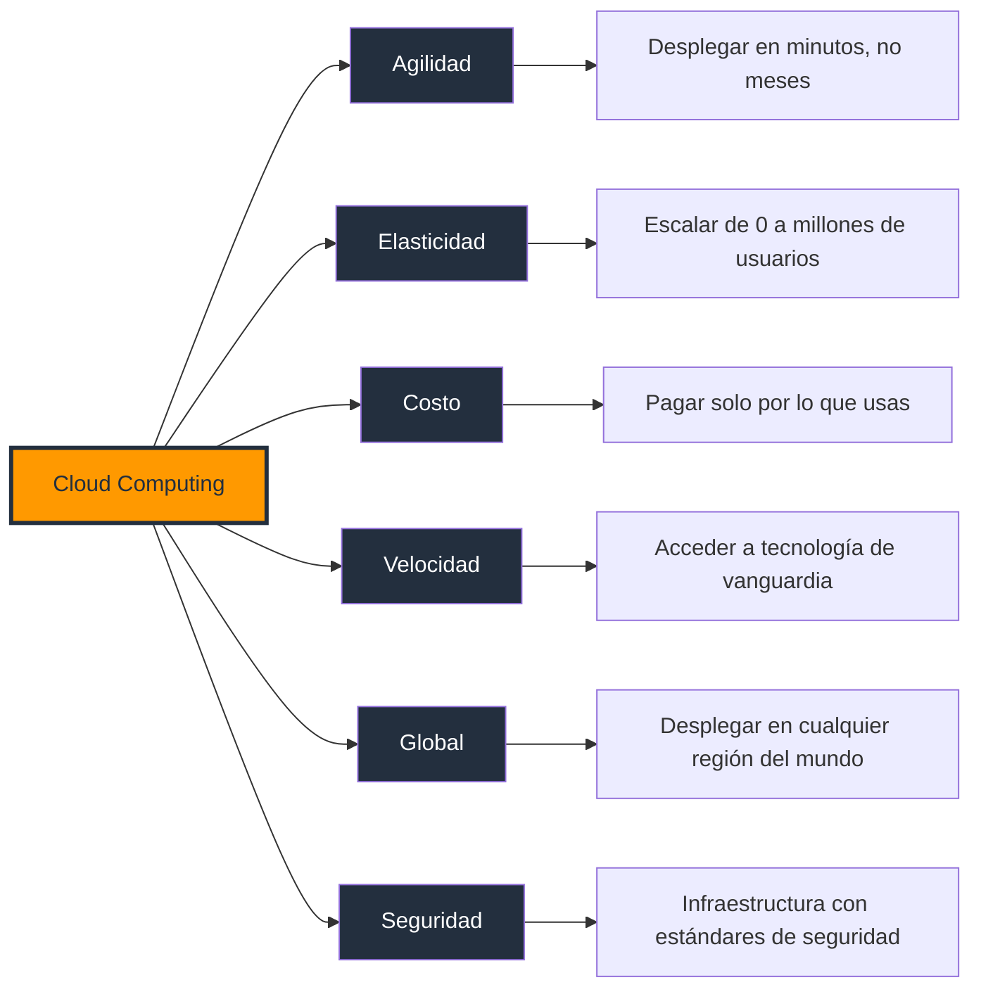
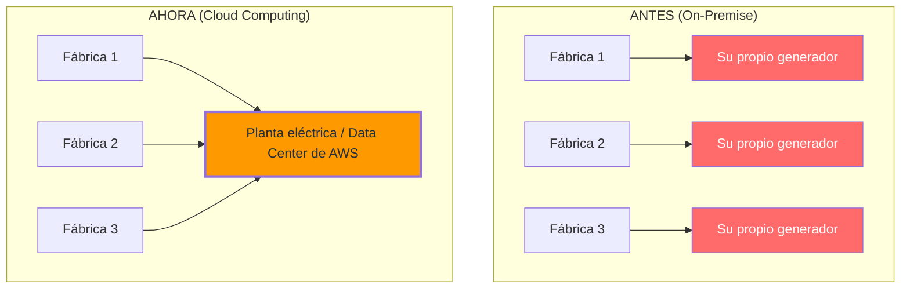

# Introducción

El término **cloud computing** o **computación en la nube**, se ha convertido en una herramienta imprescindible en el mundo de la tecnología moderna. Con su aparición, ha revolucionado la manera en que las organizaciones y usuarios individuales acceden a y gestionan sus recursos informáticos.

Principales características:

- **Elasticidad**: Se puede escalar rápidamente la capacidad según aumente o disminuya la demanda. 
- **Pago por uso**: Solo se paga por los recursos consumidos, optimizando costes. 
- **Accesibilidad**: Se accede a los servicios desde cualquier dispositivo con conexión a Internet.

## ¿Qué es Cloud Computing?

El **Cloud Computing** (o computación en la nube) es la entrega bajo demanda de servicios de TI a través de internet con un modelo de precios de pago por uso. En lugar de que las empresas tengan que comprar, poseer y mantener sus propios servidores y centros de datos físicos, pueden acceder a potencia de cómputo, almacenamiento, bases de datos y otras tecnologías de forma remota en función de sus necesidades a través de un proveedor de la nube.

::: info Definición según NIST
La definición más utilizada es la del **National Institute of Standards and Technology (`NIST`)**:

>**Cloud Computing** es un modelo que permite el acceso conveniente y bajo demanda, a través de la red, a un conjunto compartido de recursos informáticos configurables (como redes, servidores, almacenamiento, aplicaciones y servicios), que pueden ser aprovisionados y liberados rápidamente con un mínimo esfuerzo administrativo o interacción con el proveedor.

Esta definición resume perfectamente la esencia del Cloud:

- Bajo demanda.
- Acceso por Internet.
- Recursos compartidos.
- Escalable.
- Pago por uso.

:::

## Principales proveedores

Las entidades dominantes en el mercado del cloud computing son empresas que han desarrollado plataformas y servicios robustos, capaces de atender las necesidades de millones de usuarios. Entre ellos, destacan:

- **Microsoft Azure**: Ofrece una amplia gama de servicios y se integra perfectamente con productos de Microsoft.
- **Amazon Web Services**: Considerada una de las plataformas más completas y ampliamente adoptadas.
- **Google Cloud Platform**: Reconocida por sus análisis de datos y herramientas de aprendizaje automático.
 
Estos proveedores han establecido un estándar en la industria y continúan innovando para ofrecer soluciones más eficientes y seguras.

## ¿Qué significa "la nube"?

Muchas personas imaginan que **"la nube"** es un lugar mágico donde viven los datos. La realidad es diferente. 

La nube son **centros de datos** (Data Centers) distribuidos por todo el mundo. Estos centros contienen miles o incluso millones de servidores físicos conectados entre sí.

Cuando subes una foto a Google Drive o Netflix reproduce una película, realmente estás utilizando alguno de esos servidores.

## Conceptos fundamentales del Cloud Computing

Es importante comprender los componentes que hacen posible su funcionamiento. Estos conceptos forman la base sobre la que se construyen servicios como Amazon Web Services (AWS), Microsoft Azure y Google Cloud Platform.

### 1. Infraestructura física

La infraestructura física es el conjunto de componentes de hardware que permiten operar un centro de datos. Incluye elementos como:

- Servidores físicos.
- Discos SSD y HDD.
- Procesadores (CPU).
- Memoria RAM.
- Switches y routers.
- Cables de red.
- Sistemas de refrigeración.
- Sistemas eléctricos (UPS y generadores).
- Racks para alojar los servidores.
- Sistemas de seguridad física.

Toda esta infraestructura constituye la base sobre la que funcionan los servicios en la nube.

:::tip Ejemplo
Imagina construir un edificio. Antes de instalar oficinas o muebles, primero necesitas los cimientos, columnas, electricidad y tuberías. Esa es la infraestructura física del Cloud.
:::

### 2. Centro de datos (Data Center)

Un Data Center es una instalación especialmente diseñada para alojar miles de servidores y garantizar que funcionen de forma continua. Un centro de datos dispone de:

- Energía eléctrica redundante.
- Refrigeración.
- Conexión de alta velocidad a Internet.
- Sistemas contra incendios.
- Seguridad física.
- Monitoreo las 24 horas.

Los grandes proveedores de nube como AWS, Azure y Google Cloud poseen centros de datos distribuidos en diferentes regiones del mundo para ofrecer alta disponibilidad y baja latencia.

:::tip Ejemplo
Cuando guardas una foto en Google Drive, esta no se almacena "en la nube" de forma mágica; realmente queda almacenada en alguno de los servidores ubicados dentro de un Data Center.
:::

### 3. Servidor

Un servidor es una computadora de alto rendimiento diseñada para ofrecer servicios a otros equipos a través de una red. Entre sus funciones están:

- Ejecutar aplicaciones.
- Alojar sitios web.
- Ejecutar bases de datos.
- Procesar solicitudes de usuarios.
- Almacenar información.

A diferencia de un computador personal, un servidor puede atender simultáneamente a cientos o miles de usuarios.

:::tip Ejemplo
Cuando visitas una página web, tu navegador envía una solicitud a un servidor, el cual procesa la petición y devuelve la información correspondiente.
:::

Un servidor normalmente tiene:

- CPU (procesador)
- Memoria RAM
- Disco SSD o HDD
- Tarjeta de red
- Sistema operativo (Linux, Windows Server, etc.)

### 4. Virtualización

La virtualización es una tecnología que permite dividir un servidor físico en múltiples servidores virtuales independientes. Cada máquina virtual dispone de:

- Su propio sistema operativo.
- Su propia memoria RAM;
- Su propio disco;
- Su propia CPU virtual.
- Configuración de red.

Todo ello compartiendo el mismo hardware físico mediante un software llamado **hipervisor**.

Gracias a la virtualización es posible aprovechar mucho mejor los recursos disponibles y crear nuevos servidores en cuestión de minutos. Antes de la virtualización, un servidor físico normalmente ejecutaba una sola aplicación. Hoy, un mismo servidor puede alojar decenas o incluso cientos de máquinas virtuales.

### 5. Recursos de cómputo

Los recursos de cómputo son los elementos tecnológicos que una aplicación necesita para funcionar. Los principales recursos son:

| Recurso        | Función                                                                           |
| -------------- | --------------------------------------------------------------------------------- |
| CPU            | Ejecuta instrucciones y procesa información.                                      |
| Memoria RAM    | Almacena temporalmente los datos mientras se ejecutan las aplicaciones.           |
| Almacenamiento | Guarda archivos y bases de datos de forma permanente.                             |
| Red            | Permite la comunicación entre usuarios, servidores y servicios.                   |
| GPU (opcional) | Acelera tareas como inteligencia artificial, renderizado y procesamiento gráfico. |

En Cloud Computing estos recursos pueden aumentarse o reducirse bajo demanda, pagando únicamente por lo que se utiliza.

## Ventajas del cloud computing

El **cloud computing** supone un cambio con respecto a la forma tradicional de pensar de las empresas sobre los recursos de TI. Estas son las razones más comunes por las que las organizaciones recurren a la nube.

- **Coste**: el cloud computing elimina los gastos de capital y los recursos necesarios para ejecutar y gestionar su propia infraestructura. El precio y el coste del hardware, el software, las utilidades y la gestión in situ de los servidores aumentan rápidamente. 
- **Velocidad**: la mayoría de los servicios de cloud computing son de autoservicio y bajo demanda. Incluso se pueden aprovisionar grandes cantidades de recursos informáticos en cuestión de minutos, normalmente con unos pocos clics, lo que le proporciona una gran flexibilidad y reduce la presión de la planificación de la capacidad.
- **Escala mundial**: los servicios de cloud computing incluyen la capacidad de escala flexible. En la nube, esto significa proporcionar la cantidad adecuada de recursos de TI para sus cargas de trabajo. Por ejemplo, elegir más o menos potencia informática, almacenamiento o ancho de banda justo cuando se necesita y desde la ubicación geográfica adecuada.
- **Productividad**: los centros de datos in situ suelen requerir una configuración de hardware de apilamiento intensivo, parches de software y otras tareas de gestión de TI que requieren mucho tiempo. El cloud computing elimina la necesidad de realizar muchas de estas tareas, lo que permite a los equipos de TI trabajar en objetivos empresariales más importantes.
- **Rendimiento**: los servicios de cloud computing se ejecutan en una red mundial de centros de datos seguros que suelen utilizar un hardware informático de última generación. Esta red global proporciona a los usuarios de su aplicación la latencia de red reducida que esperan. A medida que su base de usuarios cambia geográficamente, su infraestructura de nube también puede hacerlo.
- **Seguridad**: los proveedores de nube pueden ofrecer un amplio conjunto de políticas, tecnologías y controles que refuerzan su estrategia de seguridad general. Estas herramientas protegen sus datos, aplicaciones, aplicaciones empresariales, datos confidenciales, usuarios finales e infraestructura frente a posibles amenazas.
- **Fiabilidad**: los proveedores de servicios en la nube pueden almacenar datos en varios sitios redundantes, lo que le proporciona un acceso fiable a sus recursos en la nube.
- **Movilidad**: el cloud computing ayuda a sus trabajadores ya que pone los recursos a disposición de sus usuarios en cualquier momento y lugar, y en cualquier dispositivo conectado a Internet.
- **Modernización**: los servicios en la nube pueden desempeñar un papel fundamental a la hora de ayudar a su organización a abandonar las engorrosas tecnologías heredadas y adoptar soluciones más innovadoras que automatizan los procesos, optimizan los flujos de trabajo y simplifican las operaciones de TI.

:::info Ejemplo
Antes de que existiera la red eléctrica, cada fábrica necesitaba su propia planta de energía. Si necesitaba más potencia, debía comprar más generadores. Si la planta fallaba, toda la producción se detenía. Era un modelo costoso, difícil de mantener y poco escalable.

Hoy todo es diferente. Simplemente conectas un aparato a un enchufe y pagas únicamente por la electricidad que consumes. No necesitas saber cómo funciona la planta de generación, darle mantenimiento o preocuparte por su capacidad.

**El Cloud Computing funciona exactamente con la misma idea.**

En lugar de comprar y mantener servidores propios, utilizas la infraestructura de un proveedor en la nube y pagas solo por los recursos que realmente utilizas.

:::

## ¿Por qué surgió el Cloud Computing?

El Cloud nació porque el modelo tradicional dejó de ser suficiente para las necesidades modernas. Hace años, cualquier empresa debía comprar toda su infraestructura. Eso implicaba:

- Comprar servidores.
- Comprar discos duros.
- Comprar switches.
- Comprar routers.
- Instalar sistemas operativos.
- Configurar redes.
- Contratar personal especializado.
- Tener una sala de servidores.

Todo esto requería una enorme inversión. Además, si el negocio crecía, era necesario comprar más equipos. Si el negocio disminuía, los servidores seguían ocupando espacio y consumiendo energía. Era un modelo poco flexible.

### Principales problemas

- **Alto costo inicial**. Los servidores eran muy costosos. Una pequeña empresa podía gastar miles de dólares antes incluso de comenzar a operar.

- **Mucho tiempo de implementación**. Comprar un servidor podía tomar semanas. Después era necesario: instalarlo, configurarlo, conectarlo, probarlo. Mientras tanto el proyecto esperaba.

- **Mala utilización**. Muchos servidores trabajaban únicamente al 10% o 20% de su capacidad. El resto del tiempo permanecían prácticamente sin uso. Sin embargo, seguían consumiendo: electricidad, espacio, refrigeración, mantenimiento.

- **Difícil escalar**. Si una página web recibía muchas visitas inesperadas: el servidor podía saturarse y el sitio dejaba de responder. La única solución era comprar más hardware.

- **Mantenimiento constante**. Había que: cambiar discos dañados, actualizar hardware, instalar parches, monitorear temperatura, reemplazar componentes. Todo esto requería personal especializado.

- **Disponibilidad limitada**. Si ocurría un incendio, inundación o falla eléctrica, los servicios podían quedar completamente fuera de línea.