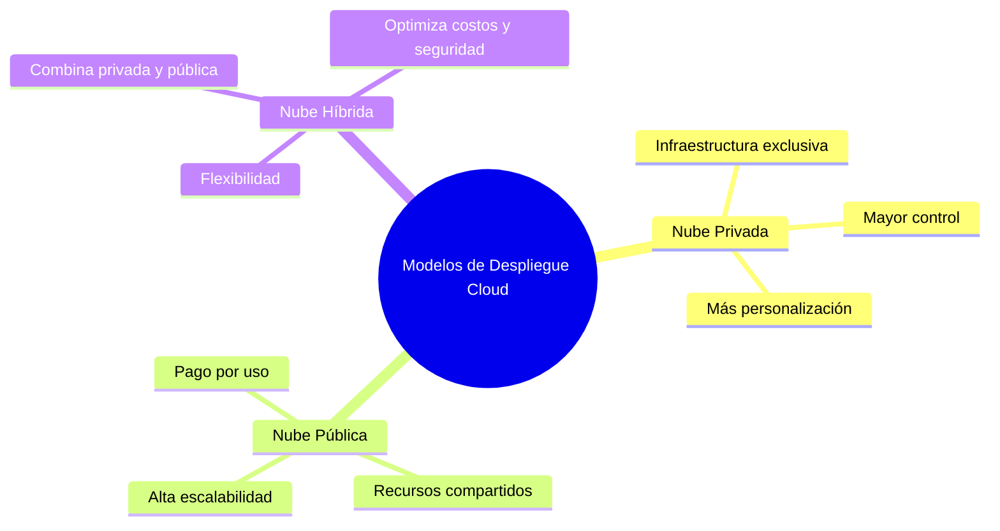
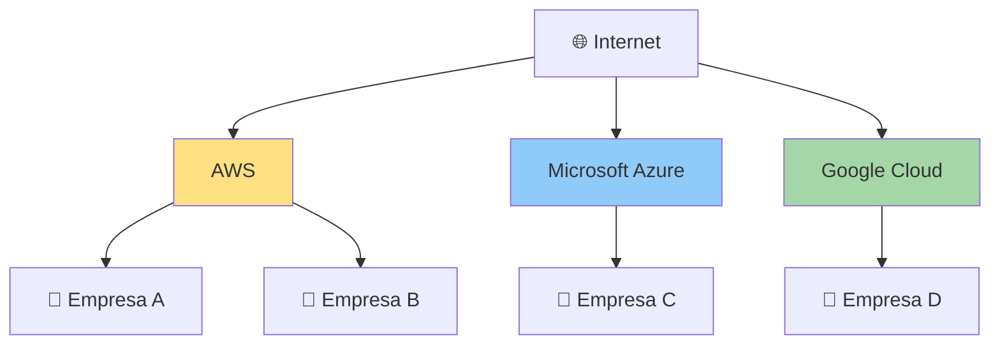
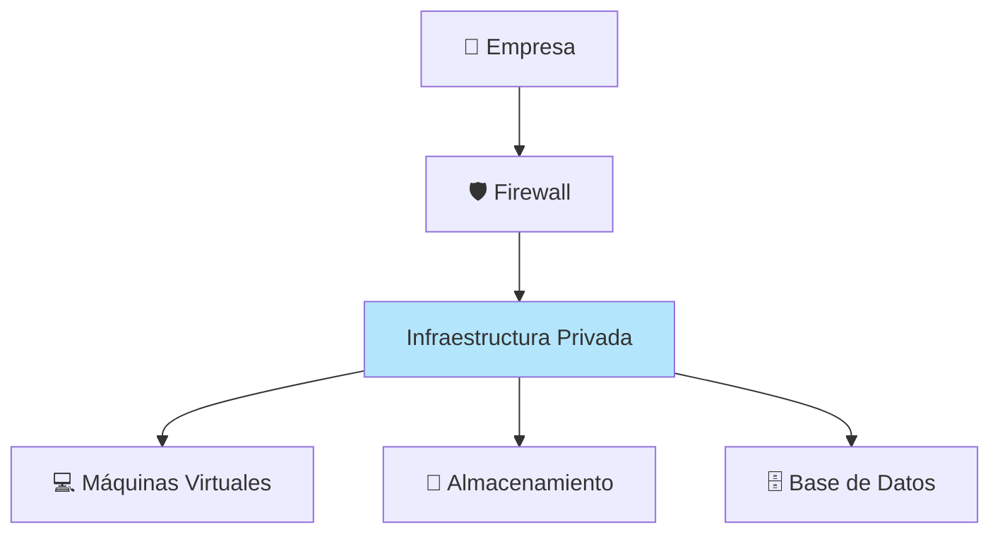
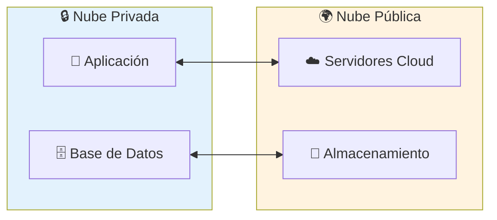

# Modelos de Despliegue Cloud

Los modelos en la nube definen el tipo de implementación de recursos en la nube. Los tres principales modelos en la nube son: privados, públicos e híbridos.

## Tipos

### Nube Pública

Es un tipo de cloud computing en el que un proveedor de servicios en la nube pone a disposición de los usuarios recursos de computación a través de Internet público. Entre ellos se incluyen aplicaciones SaaS, máquinas virtuales (VM) individuales, hardware de computación, infraestructuras completas de nivel empresarial y plataformas de desarrollo. Estos recursos pueden ser gratuitos o estar sujetos a modelos de suscripción o pago por uso.

El proveedor de servicios en la nube pública posee, gestiona y asume toda la responsabilidad de los centros de datos, el hardware y la infraestructura en los que se ejecutan las cargas de trabajo de sus clientes. Por lo general, proporciona conectividad de red de gran ancho de banda para ayudar a garantizar un alto rendimiento y un acceso rápido a las aplicaciones y los datos.

La nube pública es un entorno multiusuario en el que todos los clientes agrupan y comparten la infraestructura del centro de datos y otros recursos del proveedor de servicios en la nube. En el mundo de los principales proveedores de nube pública, como Amazon Web Services (AWS), Google Cloud, IBM Cloud, Microsoft Azure y Oracle Cloud, estos clientes pueden contarse por millones. 

>Muchas empresas utilizan la misma infraestructura física administrada por el proveedor, aunque sus datos permanecen aislados.

- **Ventajas:** Costo bajo, escalabilidad inmediata, sin mantenimiento de hardware.
- **Desventajas:** Menos control sobre infraestructura, compliance limitado.

### Nube Privada

Es un modelo de implementación de cloud computing en el que todos los recursos en la nube se destinan a un solo cliente o usuario a la organización lo que comúnmente se denomina **"on-premise"**. Proporcionan más control, seguridad y gestión de datos, al mismo tiempo que permiten que los usuarios internos se beneficien de un conjunto compartido de recursos de computación, almacenamiento y redes.

La **nube privada** combina muchos beneficios del cloud computing (incluidas la elasticidad, la escalabilidad y la facilidad de prestación de servicios) con el control de acceso, la seguridad y la personalización de recursos de la infraestructura local.

Una nube privada suele alojarse en las instalaciones del centro de datos del cliente. Sin embargo, también puede alojarse en la infraestructura de un proveedor de servicios en la nube independiente o crearse en una infraestructura alquilada alojada en un centro de datos externo.

Muchas empresas eligen una nube privada en lugar de un entorno de nube pública para cumplir con los requisitos de cumplimiento normativo. Las entidades a gran escala, como las agencias gubernamentales, las organizaciones sanitarias y las instituciones financieras, a menudo optan por configuraciones de nube privada para cargas de trabajo que manejan documentos confidenciales, información de identificación personal, propiedad intelectual, historiales médicos, datos financieros u otros datos sensibles.

>Toda la infraestructura pertenece a una sola empresa, ofreciendo mayor control y seguridad.

- **Ventajas:** Control total, cumplimiento normativo, personalización profunda.
- **Desventajas:** Costo alto, requiere equipo de TI dedicado.

### Nube Híbrida

Es un entorno informático mixto donde las aplicaciones se ejecutan mediante una combinación de servicios de computación, almacenamiento y servicios en distintos entornos, como nubes públicas y nubes privadas, incluidos los centros de datos on‐premise, ubicaciones externas o independientes. Los enfoques de cloud computing híbrido están muy extendidos, ya que hoy en día casi nadie depende únicamente de una nube pública.

>La empresa mantiene los datos sensibles en su infraestructura privada y utiliza la nube pública para ampliar capacidad o ejecutar cargas de trabajo.

- **Ventajas:** Flexibilidad, optimización de costos, migración gradual.
- **Desventajas:** Complejidad de integración, requisitos de conectividad.

En la tabla siguiente se resaltan algunos aspectos comparativos clave entre los modelos de nube.

| Nube pública | Nube privada | Nube híbrida |
|--------------|--------------|--------------|
| No hay gastos de capital para escalar verticalmente. | Tiene control total sobre los recursos y la seguridad. | Proporciona la máxima flexibilidad. |
| Las aplicaciones pueden aprovisionarse y desaprovisionarse rápidamente. | Los datos no se intercalan con los datos de otros inquilinos. | Determina dónde ejecutar las aplicaciones. |
| Solo pagas por lo que usas. | Debe adquirirse hardware para la puesta en funcionamiento y el mantenimiento. | Tú controlas los requisitos de seguridad, cumplimiento o legales. |
| No tienes control total sobre los recursos y la seguridad. | Eres responsable del mantenimiento y las actualizaciones del hardware. | Combina los beneficios de la nube pública y privada según las necesidades del negocio. |

### Multi-nube (Multi-cloud)

Aunque no es un modelo de implementación física, el enfoque multi-nube implica utilizar múltiples proveedores de nube pública (por ejemplo, AWS y Azure a la vez) para evitar la dependencia de un solo proveedor o para aprovechar las fortalezas específicas de cada uno
