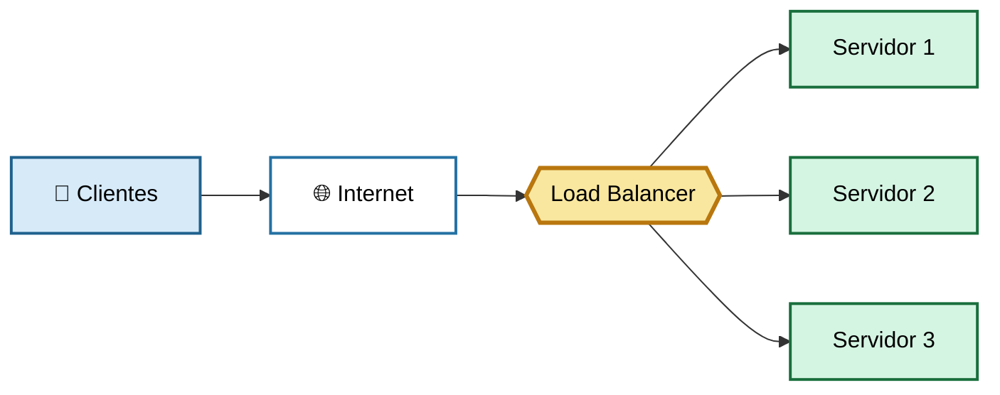
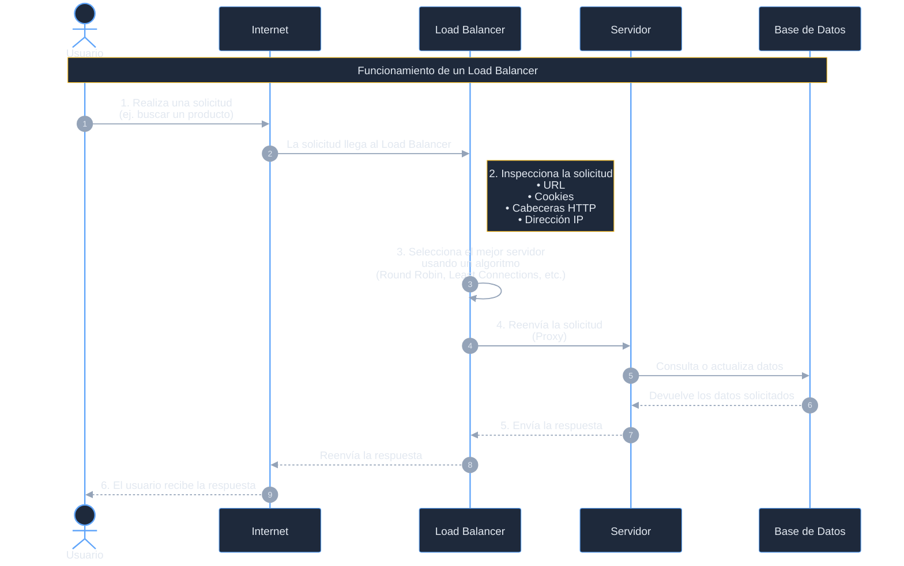
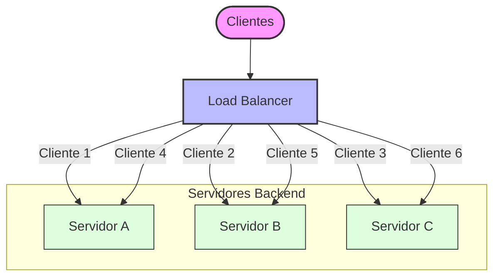
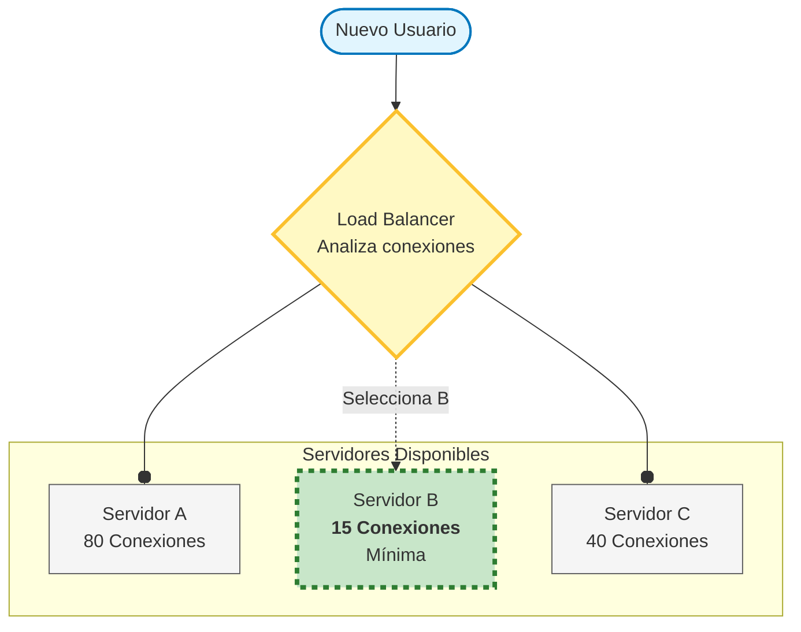
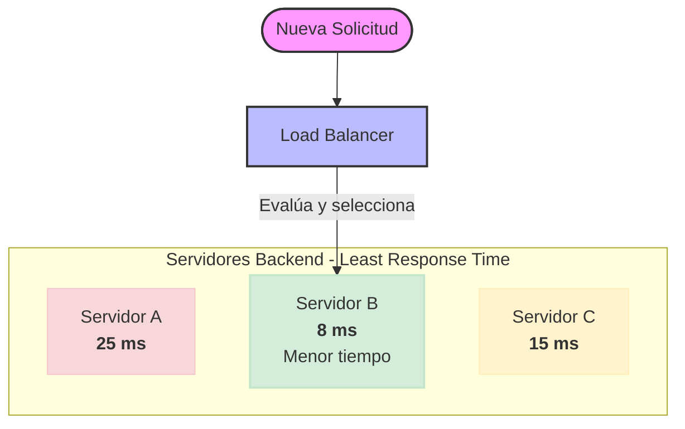
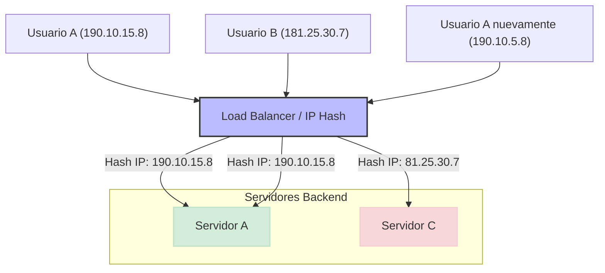

# Balanceador de Carga

Un **balanceador de carga** reparte el tráfico de red entrante entre varios servidores para que ninguno se sature. Mejora el rendimiento, mantiene tus aplicaciones disponibles cuando un servidor falla y te deja escalar agregando más servidores.

## ¿Qué es un Balanceador de Carga?

Un Balanceador de Carga (Load Balancer) es un componente de hardware o software cuya función es distribuir automáticamente las solicitudes de los usuarios entre varios servidores, evitando que uno solo se sobrecargue y garantizando que la aplicación continúe funcionando de manera rápida, estable y disponible.

En términos sencillos:

>Un Load Balancer actúa como un "director de tráfico", decidiendo a qué servidor debe enviar cada solicitud de los usuarios para que el trabajo se reparta de forma equilibrada.


:::tip ¿Por qué es necesario un Load Balancer?
Imagina que tienes una aplicación web con 10,000 usuarios conectados. Si todos los usuarios enviaran sus solicitudes a un único servidor, este podría saturarse rápidamente.

Aunque existan otros servidores disponibles, si nadie reparte las solicitudes, algunos estarán saturados mientras otros permanecerán prácticamente sin uso. Aquí es donde entra el Load Balancer.
:::

## Función principal de un balanceador de carga
Dentro de las funciones de los balanceadores de carga podemos destacar las siguientes:

- **Distribución eficiente del tráfico de red**

    El balanceador es un elemento indispensable para orquestar los servidores y asegurarse de que los clientes sean atendidos de la mejor manera. Además también permite que se pueda realizar una correcta escalabilidad de las aplicaciones, poniendo de manera intermedia un balanceador que podrá dirigirse el tráfico entre más o menos servidores, según sea necesario.

- **Garantizar la disponibilidad y alta redundancia**

    Pero además de distribuir la carga entre los servidores, también se encargan de asegurar que las aplicaciones se encuentren siempre disponibles. Esto lo consigue distribuyendo la carga hacia servidores que sabe que están funcionando correctamente, evitando dirigir el tráfico hacia servidores que puedan estar inactivos por cualquier motivo.

    Por supuesto, esto lo consigue hacer sin intervención del usuario, de modo que es transparente para el cliente.

- **Mejora del rendimiento de las aplicaciones**

    Los balanceadores de carga permiten mejorar el rendimiento de las aplicaciones ya que mantienen los servidores más descongestionados. Esto hace que las aplicaciones puedan funcionar de manera más optimizada, mejorando la experiencia de usuario.

- **Protección contra sobrecargas y caídas**

    Gracias a su capacidad de dirigir el tráfico hacia los nuevos activos también consigue evitar posibles sobrecargas del sistema o incluso caídas completas de las aplicaciones, debidas a un tráfico excesivo.

## ¿Cómo funciona?

El proceso ocurre en milisegundos cada vez que un usuario interactúa con una aplicación:

1. **Llegada de la Petición**: Un usuario abre su navegador o aplicación móvil y realiza una acción (por ejemplo, buscar un producto). La petición sale de su dispositivo hacia la dirección IP pública del sistema, pero en realidad golpea primero al balanceador de carga.

2. **Recepción e Inspección**: El balanceador intercepta la solicitud. Dependiendo de su configuración, puede analizar la URL, las cookies, las cabeceras o la dirección IP del usuario para tomar una decisión.

3. **Selección del Servidor**: Utilizando un algoritmo interno (como Round Robin o Least Connections), el balanceador elige cuál de todos los servidores disponibles detrás de él está en mejores condiciones para atender la petición.

4. **Enrutamiento (Proxy)**: El balanceador reenvía la petición al servidor seleccionado. Para ese servidor, el cliente es el propio balanceador (o bien le pasa la IP real del usuario mediante cabeceras especiales como X-Forwarded-For).

5. **Procesamiento y Respuesta**: El servidor procesa los datos (consulta la base de datos, renderiza la vista, etc.) y le devuelve la respuesta al balanceador de carga.

6. **Entrega al Usuario**: El balanceador recibe la respuesta del servidor y se la entrega al usuario final. Todo este circuito es completamente transparente para la persona que está navegando.



:::info El rol crítico de los Health Checks
En segundo plano, el balanceador hace algo igual de importante que repartir tráfico: monitorear constantemente a los servidores. Cada pocos segundos, les envía una señal de prueba (ping o petición HTTP a una ruta de estado).

Si un servidor responde correctamente, lo mantiene en la lista activa. Si un servidor falla, se congela o da error, el balanceador lo saca automáticamente de la lista de candidatos y deja de enviarle tráfico hasta que se recupere.
:::

## ¿Cómo decide a qué servidor enviar una solicitud?

La di­s­tri­bu­ción de las pe­ti­cio­nes entrantes depende del algoritmo utilizado.

### Round robin

El algoritmo Round Robin distribuye las solicitudes de manera secuencial entre todos los servidores disponibles.

Cada nueva petición se envía al siguiente servidor de la lista y, cuando llega al último, vuelve a comenzar desde el primero. De esta forma, todos los servidores reciben aproximadamente la misma cantidad de solicitudes.

**Ejemplo**

Supongamos que existen tres servidores:

```txt
Servidor A
Servidor B
Servidor C
```

Las solicitudes se distribuirían de la siguiente manera:

```txt
Solicitud 1 → Servidor A
Solicitud 2 → Servidor B
Solicitud 3 → Servidor C

Solicitud 4 → Servidor A
Solicitud 5 → Servidor B
Solicitud 6 → Servidor C
```



**Cuándo utilizarlo?**

Este algoritmo es recomendable cuando todos los servidores poseen características similares (CPU, memoria y capacidad de procesamiento) y las solicitudes requieren un tiempo de ejecución parecido.

**Ventajas**

- Es sencillo de implementar.
- Distribuye las solicitudes de forma equilibrada.
- Consume pocos recursos.

**Desventajas**

No tiene en cuenta el estado de cada servidor. Si uno de ellos está sobrecargado, continuará recibiendo solicitudes cuando llegue su turno, aunque los demás tengan poca carga.

### Least Connections

El algoritmo Least Connections envía cada nueva solicitud al servidor que tiene el menor número de conexiones activas.

En lugar de repartir las peticiones por turnos, analiza cuál de los servidores está atendiendo menos usuarios en ese momento y selecciona ese servidor.

Antes de decidir, el Load Balancer pregunta:

>¿Qué servidor tiene menos usuarios conectados en este momento?

**Ejemplo**

Supongamos el estado actual de los servidores:

```txt
Servidor A → 80 conexiones
Servidor B → 15 conexiones
Servidor C → 42 conexiones
```

Llega un nuevo usuario. El Load Balancer piensa:

```txt
A tiene 80
B tiene 15 ← el menor
C tiene 40
```

Entonces envía la solicitud al **servidor `B`**.



>Al llegar una nueva solicitud, el Load Balancer la enviará al **Servidor `B`**, ya que es el que tiene menos conexiones activas.

**¿Cuándo utilizarlo?**

Es especialmente útil en aplicaciones donde las conexiones permanecen abiertas durante un tiempo considerable, como:

- Chats en línea.
- Videojuegos multijugador.
- Aplicaciones con WebSockets.
- Plataformas de videoconferencia.

En estos casos, algunos usuarios pueden permanecer conectados durante varios minutos o incluso horas, por lo que repartir únicamente por turnos no resulta eficiente.

**Ventajas**

- Reduce la probabilidad de sobrecargar un servidor.
- Distribuye mejor la carga cuando las conexiones tienen distinta duración.
- Aprovecha de forma más eficiente los recursos disponibles.

**Desventajas**

Solo considera la cantidad de conexiones activas, pero no la capacidad de cada servidor. Dos servidores con el mismo número de conexiones pueden ofrecer rendimientos muy diferentes si uno dispone de más recursos de hardware.

### Least Response Time

El algoritmo Least Response Time selecciona el servidor que presenta el menor tiempo de respuesta.

Para ello, el Load Balancer supervisa continuamente cuánto tarda cada servidor en responder a las solicitudes y dirige las nuevas peticiones hacia el que ofrece el mejor rendimiento en ese momento.

En lugar de preguntar:

>¿Quién tiene menos conexiones?

Pregunta:

>¿Quién está respondiendo más rápido?

**Ejemplo**

Tiempo de respuesta actual:

```txt
Servidor A → responde en 25 ms
Servidor B → responde en 8 ms
Servidor C → responde en 15 ms
```
Llega una solicitud. El Load Balancer elige:
En este caso, la nueva solicitud será enviada al **Servidor `B`**, ya que responde más rápidamente.



:::info ¿Por qué un servidor puede responder más lento?

Porque puede tener:

- CPU muy ocupada.
- Memoria llena.
- Disco lento.
- Muchas conexiones.
- Problemas de red.

Aunque tenga pocas conexiones, puede tardar mucho en responder.
:::

**¿Cuándo utilizarlo?**

Es una excelente opción para aplicaciones donde la velocidad de respuesta es un factor crítico, por ejemplo:

- Plataformas de comercio electrónico.
- Servicios bancarios.
- APIs de alta demanda.
- Aplicaciones en tiempo real.

**Ventajas**

- Mejora la experiencia del usuario al reducir la latencia.
- Aprovecha automáticamente el servidor con mejor rendimiento.
- Se adapta a cambios en la carga de trabajo.

**Desventajas**

Su implementación es más compleja, ya que requiere medir continuamente el rendimiento de todos los servidores antes de tomar una decisión.

### IP Hash

El algoritmo **`IP`** Hash utiliza la dirección **`IP`** del cliente para determinar qué servidor atenderá su solicitud.

A partir de la dirección **`IP`**, el Load Balancer realiza un cálculo matemático (función hash) que siempre produce el mismo resultado para esa **`IP`**. Como consecuencia, un mismo usuario suele ser enviado siempre al mismo servidor.

**Ejemplo**

```txt
Usuario A → IP: 190.10.15.8
Usuario B → IP: 181.25.30.7
```

Después de aplicar el algoritmo:

```txt
190.10.15.8 → Servidor A
181.25.30.7 → Servidor C
190.10.15.8 → Servidor A otra vez
```

Aunque el **usuario `A`** realice varias solicitudes, continuará siendo atendido por el mismo servidor.


> Siempre que ese usuario vuelva, terminará en el mismo servidor (mientras la infraestructura no cambie).

**¿Cuándo utilizarlo?**

Este algoritmo es útil cuando la aplicación almacena información de la sesión directamente en la memoria del servidor, como:

- Sesiones de usuarios.
- Carritos de compra.
- Estados temporales de una aplicación.

Al mantener al usuario en el mismo servidor, se evita perder esa información entre solicitudes.

**Ventajas**

- Mantiene la afinidad de sesión (Session Affinity o Sticky Sessions).
- Reduce la necesidad de compartir el estado entre servidores.
- Facilita el manejo de sesiones almacenadas localmente.

**Desventajas**

Si un servidor deja de estar disponible o cambia el número de servidores del clúster, la asignación de usuarios puede modificarse, obligando a redistribuir las solicitudes.


:::tip Una forma sencilla de recordarlos

Imagina que eres el encargado de asignar clientes a cajas en un supermercado:

- **Round Robin**: "Le toca la siguiente caja", sin importar si está llena o vacía.
- **Least Connections**: "Ve a la caja con menos personas haciendo fila".
- **Least Response Time**: "Ve a la caja cuyo cajero está atendiendo más rápido".
- **IP Hash**: "Este cliente siempre va a la misma caja para que el cajero ya conozca su historial".

Con esta analogía, es fácil recordar la diferencia:

- **Round Robin** piensa en el orden.
- **Least Connections** piensa en la cantidad de trabajo actual.
- **Least Response Time** piensa en la velocidad.
- **IP Hash** piensa en mantener al mismo usuario en el mismo servidor.

:::

## Comparación de los algoritmos

| Algoritmo               | ¿Cómo toma la decisión?                                 | Escenario recomendado                                                           |
| ----------------------- | ------------------------------------------------------- | ------------------------------------------------------------------------------- |
| **Round Robin**         | Envía cada solicitud al siguiente servidor de la lista. | Cuando todos los servidores tienen capacidades similares.                       |
| **Least Connections**   | Selecciona el servidor con menos conexiones activas.    | Aplicaciones con conexiones de larga duración.                                  |
| **Least Response Time** | Elige el servidor que responde en el menor tiempo.      | Aplicaciones donde el rendimiento y la baja latencia son prioritarios.          |
| **IP Hash**             | Asigna el servidor según la dirección IP del cliente.   | Aplicaciones que requieren mantener la sesión del usuario en el mismo servidor. |


## Ventajas

- **Evita la sobrecarga**

    Distribuye las solicitudes entre varios servidores para que ninguno trabaje por encima de su capacidad.

- **Mejora el rendimiento**

    Al repartir el trabajo, cada servidor procesa menos solicitudes y responde más rápidamente.

- **Alta disponibilidad**

    Si un servidor falla, las solicitudes se envían automáticamente a los demás. La aplicación sigue funcionando.

- **Permite la escalabilidad horizontal**

    Cuando se agregan nuevos servidores, el Load Balancer comienza a enviarles tráfico automáticamente. No es necesario que los usuarios hagan ningún cambio.

- **Mayor confiabilidad**

    Reduce el riesgo de que toda la aplicación deje de funcionar debido a la falla de un único servidor.

## Casos de uso

Los balanceadores de carga son fundamentales en aplicaciones que reciben muchas solicitudes, como:

- **Aplicaciones web de alto tráfico**

    Si tenemos una página web que requiere atender un alto volumen de tráfico es importante contar con un balanceador de carga que permita dirigir los usuarios entre diversos servidores.

- **Servicios en la nube y SaaS**

    Las aplicaciones de Software como Servicio (SaaS) son otro claro ejemplo donde los balanceadores de carga son especialmente deseables. Este tipo de servicios requieren atender a una gran cantidad de usuarios y los sistemas de balanceo de tráfico nos permiten distribuirlos de manera sencilla, atendiendo también a factores como su localización geográfica.

- **Infraestructuras críticas y financieras**

    También es ideal para infraestructuras críticas que requieran una alta disponibilidad por ejemplo en instituciones financieras o plataformas de pagos electrónicos, donde cualquier pequeña caída pueda suponer pérdidas cuantiosas para numerosos clientes. incluso la pérdida de reputación online.

- **Juegos online y streaming**

    Otro tipo de servicios que requiere alta disponibilidad y la gestión de altas demandas de tráfico son los sitios de juegos online o las plataformas de contenido por streaming. En ellos se usan los balanceadores de carga de manera intensiva para garantizar el servicio para todos sus usuarios de una manera estable y fluida.