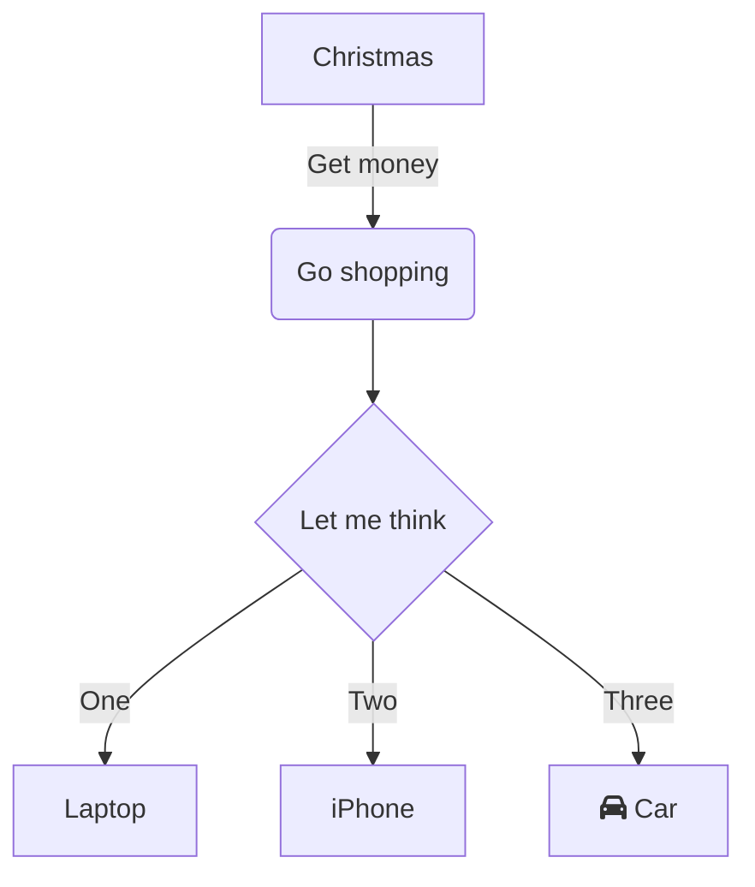

# Introducción a NestJS

Imagina que construyes una casa. Podrías hacerlo con martillo y clavos (Express), pero si quieres una casa bien estructurada, con planos, cimientos sólidos y habitaciones bien organizadas, necesitas una arquitectura. **NestJS es esa arquitectura para el backend.**



## ¿Qué es?

**NestJS** es un framework progresivo para construir aplicaciones del lado del servidor con Node.js. Está construido sobre **TypeScript** y combina lo mejor de:

- **Programación Orientada a Objetos** (OOP)
- **Programación Funcional** (FP)
- **Programación Reactiva** (FRP)

```typescript
import { NestFactory } from '@nestjs/core';
import { AppModule } from './app.module';

async function bootstrap() {
  const app = await NestFactory.create(AppModule);
  await app.listen(3000);
}
bootstrap();
```

Debajo del capó usa **Express** por defecto (o **Fastify** opcionalmente) como framework HTTP, pero añade una capa de abstracción que organiza el código en **módulos, controladores, servicios, pipes, guards, interceptores y filtros**.

:::tip
NestJS no compite con Express: lo **envuelve**. Piensa en Express como el motor y NestJS como la carrocería, el volante y los pedales.
:::

## ¿Por qué es importante?

Node.js tiene muchos frameworks: Express, Fastify, Koa, Hapi… ¿por qué aprender NestJS?

| Problema | Express / otros | NestJS |
|---|---|---|
| Organización del código | Cada desarrollador organiza como quiere | Arquitectura **obligada** por el framework |
| TypeScript | Configuración manual | **Soporte nativo** desde el primer comando |
| Inyección de dependencias | No existe nativamente | **Sistema de DI** integrado |
| Validación | Middleware manual | **Pipes + DTOs** declarativos |
| Autenticación | Cada quien su librería | **Guards + JWT Module** oficial |
| Documentación de API | Swagger manual | **Swagger Module** integrado |
| Testing | Configuración manual | **Testing Module** con mocking |
| Estructura a gran escala | Se vuelve caótico | **Crece ordenadamente** con módulos |

## Problema que resuelve

Express es minimalista y flexible, pero esa flexibilidad tiene un costo: **no impone estructura**. En proyectos pequeños funciona bien, pero cuando crecen:

```
src/
  routes/
    usuarios.js
    productos.js
  middleware/
    auth.js
  utils/
    formatDate.js
  server.js
```

Al cabo de meses, este proyecto típico de Express termina así:

```javascript
// ❌ Express típico: todo mezclado
const express = require('express');
const app = express();

// Middleware de autenticación (inline)
app.use((req, res, next) => {
  // validar token...
});

// Rutas (en el mismo archivo)
app.get('/api/usuarios', async (req, res) => {
  // lógica de negocio AQUÍ mismo
  const usuarios = await db.query('SELECT * FROM usuarios');
  res.json(usuarios);
});

app.post('/api/usuarios', async (req, res) => {
  // validación manual AQUÍ
  if (!req.body.nombre) return res.status(400).json({ error: 'Nombre requerido' });
  // lógica de negocio AQUÍ
  const usuario = await db.query('INSERT INTO usuarios ...');
  // enviar email AQUÍ
  await emailService.send(...);
  res.json(usuario);
});
```

Este enfoque tiene problemas graves cuando el proyecto escala:

1. **Sin separación de responsabilidades**: rutas, lógica de negocio, validación y acceso a datos, todo junto.
2. **Código duplicado**: la misma validación aparece en cada ruta.
3. **Dificultad para testear**: no puedes probar la lógica sin el servidor HTTP.
4. **Sin guía arquitectónica**: cada desarrollador organiza como quiere, generando caos.

NestJS resuelve esto con una arquitectura clara:

```
src/
  modules/
    usuarios/
      usuarios.controller.ts    → Rutas
      usuarios.service.ts       → Lógica de negocio
      usuarios.module.ts        → Agrupación
      dto/
        crear-usuario.dto.ts    → Validación
    auth/
      auth.controller.ts
      auth.service.ts
      guards/
        jwt-auth.guard.ts       → Autenticación
  common/
    pipes/
      validation.pipe.ts        → Validación global
```

```typescript
// ✅ NestJS: cada cosa en su lugar
@Controller('usuarios')
export class UsuariosController {
  constructor(private readonly usuariosService: UsuariosService) {}

  @Post()
  @UsePipes(new ValidationPipe())
  async crear(@Body() dto: CrearUsuarioDto) {
    return this.usuariosService.crear(dto);
    // El controlador solo recibe la petición y delega
  }
}
```

## Cómo funciona

### Arquitectura por capas

NestJS organiza las aplicaciones en una estructura de **módulos**, donde cada módulo agrupa un conjunto relacionado de funcionalidades.

```
Aplicación NestJS
│
├── Módulo Raíz (AppModule)
│   │
│   ├── Módulo Usuarios
│   │   ├── Controlador (rutas)
│   │   ├── Servicio (lógica)
│   │   ├── DTOs (validación)
│   │   └── Provider (repositorio, etc.)
│   │
│   ├── Módulo Auth
│   │   ├── Controlador
│   │   ├── Servicio
│   │   ├── Guards (protección)
│   │   └── Strategies (JWT, OAuth)
│   │
│   └── Módulo Productos
│       ├── Controlador
│       ├── Servicio
│       └── ...
```

### Componentes principales

| Componente | Rol | Analogía |
|---|---|---|
| **Módulos** | Agrupan componentes relacionados | Departamentos de una empresa |
| **Controladores** | Manejan rutas HTTP | Recepcionistas |
| **Servicios** | Contienen lógica de negocio | Especialistas |
| **DTOs** | Definen estructura de datos | Formularios |
| **Pipes** | Validan y transforman entrada | Filtros de calidad |
| **Guards** | Protegen rutas | Guardias de seguridad |
| **Interceptors** | Transforman respuestas | Empaquetadores |
| **Filters** | Manejan errores | Servicio de emergencias |

### Flujo de una petición

```
Cliente → Petición HTTP
            ↓
        Middleware (global)
            ↓
          Guard (¿tiene permiso?)
            ↓
        Interceptor (pre)
            ↓
          Pipe (validar datos)
            ↓
        Controlador (recibir y delegar)
            ↓
          Servicio (lógica de negocio)
            ↓
        Interceptor (post / transformar respuesta)
            ↓
          Filter (si hay error → respuesta formateada)
            ↓
Cliente ← Respuesta HTTP
```

## Sintaxis

### Decoradores principales

NestJS hace un uso intensivo de **decoradores** para añadir metadatos a las clases y sus miembros.

| Decorador | Propósito |
|---|---|
| `@Module()` | Define un módulo |
| `@Controller()` | Define un controlador |
| `@Injectable()` | Define un servicio / provider |
| `@Get()`, `@Post()`, etc. | Asocia un método a un verbo HTTP |
| `@Param()`, `@Body()`, `@Query()` | Extrae parámetros de la petición |
| `@UseGuards()` | Aplica guards |
| `@UsePipes()` | Aplica pipes |
| `@UseInterceptors()` | Aplica interceptors |
| `@UseFilters()` | Aplica filters |
| `@Inject()` | Inyección explícita de dependencias |
| `@Optional()` | Marca dependencia como opcional |

## Ejemplo básico

La aplicación NestJS más pequeña posible.

```typescript
// app.module.ts
import { Module } from '@nestjs/common';
import { AppController } from './app.controller';
import { AppService } from './app.service';

@Module({
  controllers: [AppController],
  providers: [AppService],
})
export class AppModule {}
```

```typescript
// app.controller.ts
import { Controller, Get } from '@nestjs/common';
import { AppService } from './app.service';

@Controller()
export class AppController {
  constructor(private readonly appService: AppService) {}

  @Get()
  getHello(): string {
    return this.appService.getHello();
  }
}
```

```typescript
// app.service.ts
import { Injectable } from '@nestjs/common';

@Injectable()
export class AppService {
  getHello(): string {
    return '¡Hola Mundo desde NestJS!';
  }
}
```

```typescript
// main.ts
import { NestFactory } from '@nestjs/core';
import { AppModule } from './app.module';

async function bootstrap() {
  const app = await NestFactory.create(AppModule);
  await app.listen(3000);
  console.log('Servidor corriendo en http://localhost:3000');
}
bootstrap();
```

```json
// package.json (dependencias mínimas)
{
  "dependencies": {
    "@nestjs/common": "^11.0.0",
    "@nestjs/core": "^11.0.0",
    "@nestjs/platform-express": "^11.0.0",
    "reflect-metadata": "^0.2.0",
    "rxjs": "^7.8.0"
  },
  "devDependencies": {
    "typescript": "^5.5.0"
  }
}
```

## Ejemplo intermedio

API REST de usuarios con módulo, controlador, servicio y DTO.

<CodeGroup>
<CodeGroupItem title="usuarios.module.ts">

```typescript
import { Module } from '@nestjs/common';
import { UsuariosController } from './usuarios.controller';
import { UsuariosService } from './usuarios.service';

@Module({
  controllers: [UsuariosController],
  providers: [UsuariosService],
  exports: [UsuariosService],
})
export class UsuariosModule {}
```

</CodeGroupItem>
<CodeGroupItem title="usuarios.controller.ts">

```typescript
import { Controller, Get, Post, Param, Body, ParseIntPipe } from '@nestjs/common';
import { UsuariosService } from './usuarios.service';
import { CrearUsuarioDto } from './dto/crear-usuario.dto';

@Controller('usuarios')
export class UsuariosController {
  constructor(private readonly usuariosService: UsuariosService) {}

  @Get()
  async obtenerTodos() {
    return this.usuariosService.obtenerTodos();
  }

  @Get(':id')
  async obtenerUno(@Param('id', ParseIntPipe) id: number) {
    return this.usuariosService.obtenerUno(id);
  }

  @Post()
  async crear(@Body() dto: CrearUsuarioDto) {
    return this.usuariosService.crear(dto);
  }
}
```

</CodeGroupItem>
<CodeGroupItem title="usuarios.service.ts">

```typescript
import { Injectable, NotFoundException } from '@nestjs/common';
import { CrearUsuarioDto } from './dto/crear-usuario.dto';

interface Usuario {
  id: number;
  nombre: string;
  email: string;
}

@Injectable()
export class UsuariosService {
  private usuarios: Usuario[] = [];
  private idCounter = 1;

  obtenerTodos(): Usuario[] {
    return this.usuarios;
  }

  obtenerUno(id: number): Usuario {
    const usuario = this.usuarios.find(u => u.id === id);
    if (!usuario) throw new NotFoundException(`Usuario #${id} no encontrado`);
    return usuario;
  }

  crear(dto: CrearUsuarioDto): Usuario {
    const usuario: Usuario = {
      id: this.idCounter++,
      nombre: dto.nombre,
      email: dto.email,
    };
    this.usuarios.push(usuario);
    return usuario;
  }
}
```

</CodeGroupItem>
<CodeGroupItem title="dto/crear-usuario.dto.ts">

```typescript
import { IsString, IsEmail, MinLength } from 'class-validator';

export class CrearUsuarioDto {
  @IsString()
  @MinLength(3)
  nombre: string;

  @IsEmail()
  email: string;
}
```

</CodeGroupItem>
</CodeGroup>

```typescript
// app.module.ts
import { Module } from '@nestjs/common';
import { UsuariosModule } from './usuarios/usuarios.module';

@Module({
  imports: [UsuariosModule],
})
export class AppModule {}
```

## Ejemplo avanzado

Aplicación NestJS completa con configuración, validación global, autenticación JWT, documentación Swagger y logger estructurado.

```typescript
// main.ts
import { NestFactory } from '@nestjs/core';
import { ValidationPipe, Logger } from '@nestjs/common';
import { SwaggerModule, DocumentBuilder } from '@nestjs/swagger';
import { AppModule } from './app.module';

async function bootstrap() {
  const app = await NestFactory.create(AppModule);
  const logger = new Logger('Bootstrap');

  // Configuración global
  app.setGlobalPrefix('api/v1');
  app.enableCors({
    origin: process.env.CORS_ORIGIN || 'http://localhost:4200',
    credentials: true,
  });

  // Pipe global de validación
  app.useGlobalPipes(
    new ValidationPipe({
      whitelist: true,
      forbidNonWhitelisted: true,
      transform: true,
    }),
  );

  // Documentación Swagger
  const config = new DocumentBuilder()
    .setTitle('API Docs')
    .setDescription('API de la plataforma educativa')
    .setVersion('1.0')
    .addBearerAuth()
    .build();
  const document = SwaggerModule.createDocument(app, config);
  SwaggerModule.setup('docs', app, document);

  await app.listen(process.env.PORT || 3000);
  logger.log(`Aplicación corriendo en ${await app.getUrl()}`);
  logger.log(`Documentación en ${await app.getUrl()}/docs`);
}
bootstrap();
```

```typescript
// app.module.ts
import { Module } from '@nestjs/common';
import { ConfigModule } from '@nestjs/config';
import { ThrottlerModule } from '@nestjs/throttler';
import { UsuariosModule } from './modules/usuarios/usuarios.module';
import { AuthModule } from './modules/auth/auth.module';

@Module({
  imports: [
    ConfigModule.forRoot({ isGlobal: true }),
    ThrottlerModule.forRoot([{ limit: 100, ttl: 60000 }]),
    UsuariosModule,
    AuthModule,
  ],
})
export class AppModule {}
```

## Caso de uso real

Cómo se estructura un proyecto NestJS en una empresa real como **Nike**, **Adidas** o **Coca-Cola** para sus plataformas de comercio electrónico.

```
project-name/
├── src/
│   ├── main.ts                          # Punto de entrada
│   ├── app.module.ts                    # Módulo raíz
│   ├── common/                          # Código compartido
│   │   ├── decorators/                  # Decoradores personalizados
│   │   ├── filters/                     # Exception filters
│   │   ├── guards/                      # Guards globales
│   │   ├── interceptors/                # Interceptors
│   │   ├── pipes/                       # Pipes personalizados
│   │   └── interfaces/                  # Interfaces compartidas
│   ├── config/                          # Configuración
│   │   └── database.config.ts
│   ├── modules/                         # Módulos de negocio
│   │   ├── auth/
│   │   ├── usuarios/
│   │   ├── productos/
│   │   ├── carrito/
│   │   ├── pedidos/
│   │   └── pagos/
│   ├── database/                        # Migraciones, seeds
│   │   ├── migrations/
│   │   └── seeds/
│   └── utils/                           # Funciones auxiliares
│       └── formateadores.ts
├── test/                                # Tests
│   ├── unit/
│   └── e2e/
├── .env                                 # Variables de entorno
├── .env.example
├── nest-cli.json
├── tsconfig.json
├── tsconfig.build.json
└── package.json
```

## Buenas prácticas

### 1. Un módulo por dominio de negocio

Agrupa controladores, servicios y DTOs por funcionalidad, no por tipo.

```typescript
// ✅ Bien: agrupado por dominio
modules/usuarios/
modules/productos/
modules/pedidos/

// ❌ Mal: agrupado por tipo
controllers/
services/
dto/
```

### 2. Usa el CLI de NestJS para generar código

```bash
nest generate module usuarios
nest generate controller usuarios
nest generate service usuarios
```

### 3. Configura TypeScript strict mode

```json
// tsconfig.json
{
  "compilerOptions": {
    "strict": true,
    "strictNullChecks": true,
    "noImplicitReturns": true
  }
}
```

### 4. Mantén los controladores delgados

Un controlador solo recibe la petición y delega al servicio. Sin lógica de negocio.

### 5. Usa variables de entorno con ConfigModule

```typescript
@Module({
  imports: [ConfigModule.forRoot({ isGlobal: true })],
})
```

### 6. Documenta tu API desde el inicio

Swagger debería configurarse en el `main.ts` desde el día uno, no al final.

### 7. Valida todo en el borde de entrada

Usa `ValidationPipe` global con `whitelist: true` y `forbidNonWhitelisted: true`.

## Errores comunes

### 1. No entender la diferencia entre providers, controllers y módulos

```typescript
// ❌ Error: confundir providers con controllers
@Module({
  controllers: [UsuariosService],   // Service no es un controller
  providers: [UsuariosController],  // Controller no es un provider
})
```

### 2. Olvidar reflect-metadata

```typescript
// ❌ Error: falta import 'reflect-metadata' en main.ts
// Sin esto, los decoradores no funcionan
```

```typescript
// ✅ Correcto
import 'reflect-metadata';
import { NestFactory } from '@nestjs/core';
```

### 3. Ignorar el sistema de módulos

Poner todo en el `AppModule` en lugar de dividir en módulos por dominio.

```typescript
// ❌ Error: un solo módulo con todo
@Module({
  controllers: [AuthController, UsuariosController, ProductosController, PedidosController],
  providers: [AuthService, UsuariosService, ProductosService, PedidosService],
})
```

### 4. No usar async/await correctamente

```typescript
// ❌ Error: mezclar then/catch con async/await
@Get()
obtenerTodos() {
  return this.service.obtenerTodos().then(data => {
    return data.filter(d => d.activo);
  });
}

// ✅ Correcto
@Get()
async obtenerTodos() {
  const datos = await this.service.obtenerTodos();
  return datos.filter(d => d.activo);
}
```

### 5. Crear un NestJS app para APIs muy simples

Si solo necesitas 2 rutas sin autenticación, Express es suficiente. NestJS brilla en aplicaciones **medianas y grandes** con múltiples módulos, roles, y lógica compleja.

## Relación con otros conceptos

| Concepto | Relación |
|---|---|
| **Express / Fastify** | NestJS los usa como motor HTTP subyacente. Express por defecto, Fastify opcional. |
| **TypeScript** | NestJS está escrito en TypeScript y lo recomienda, pero soporta JavaScript. |
| **RxJS** | NestJS usa Observables para manejar flujos reactivos y comunicación asíncrona. |
| **Node.js** | NestJS es un framework de Node.js. Todo el ecosistema npm está disponible. |
| **Decoradores de TypeScript** | Los decoradores son la base de la metaprogramación en NestJS. |
| **Inversify.js** | NestJS tiene su propio sistema de DI inspirado en Inversify y Angular. |
| **Angular** | NestJS toma prestados conceptos de Angular: módulos, decoradores, DI, servicios. |

## Resumen

- **NestJS** es un framework progresivo para Node.js con TypeScript que impone una arquitectura limpia y organizada.
- Combina **OOP, FP y FRP** en un solo framework.
- Usa **decoradores** para definir controladores, servicios, módulos y más.
- Se basa en **Express/Fastify** pero añade una capa de abstracción con módulos, DI, guards, pipes, interceptors y filters.
- Organiza el código en **módulos por dominio** de negocio.
- Incluye **soporte nativo** para TypeScript, validación, autenticación, testing, Swagger y más.
- Es ideal para aplicaciones **medianas y grandes** donde la organización y escalabilidad importan.
- Se aprende progresivamente: empiezas con un controlador y un servicio, y añades complejidad conforme la necesitas.

## Quiz

<details>
<summary><strong>Pregunta 1:</strong> ¿Sobre qué framework HTTP se construye NestJS por defecto?</summary>

**Respuesta:** Express. NestJS lo envuelve y añade una capa de abstracción. También puede configurarse para usar Fastify como motor alternativo.
</details>

<details>
<summary><strong>Pregunta 2:</strong> ¿Qué decorador se usa para marcar una clase como un servicio que puede ser inyectado?</summary>

**Respuesta:** `@Injectable()`. Este decorador registra la clase en el contenedor de inyección de dependencias de NestJS.
</details>

<details>
<summary><strong>Pregunta 3:</strong> ¿Cuál es el componente principal que agrupa controladores, servicios y otros componentes relacionados?</summary>

**Respuesta:** El **Módulo** (`@Module()`). Los módulos son la unidad de organización fundamental en NestJS y agrupan funcionalidades relacionadas por dominio.
</details>

<details>
<summary><strong>Pregunta 4:</strong> ¿Qué ventaja tiene NestJS sobre Express para aplicaciones grandes?</summary>

**Respuesta:** Impone una arquitectura organizada con separación clara de responsabilidades (módulos, controladores, servicios), sistema de inyección de dependencias integrado, validación declarativa, guards para autenticación y soporte nativo de TypeScript. Express es más flexible pero no guía al desarrollador hacia un código mantenible a largo plazo.
</details>

<details>
<summary><strong>Pregunta 5:</strong> ¿Qué biblioteca de TypeScript es fundamental para que funcionen los decoradores de NestJS?</summary>

**Respuesta:** `reflect-metadata`. Sin ella, los decoradores no pueden leer ni escribir metadatos en tiempo de ejecución y NestJS no puede funcionar. Siempre debe importarse al inicio de `main.ts`.
</details>
