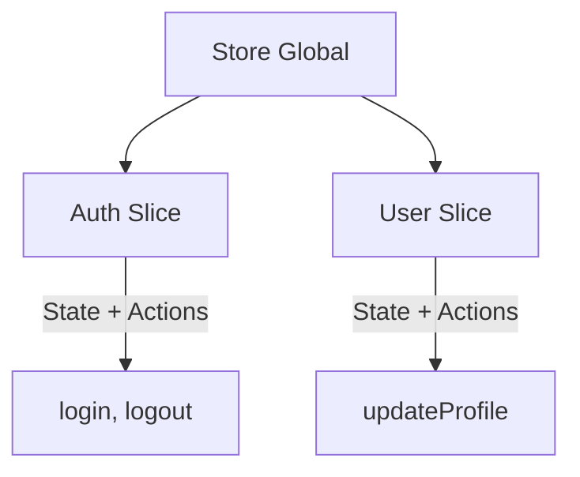

# Patrón Slices
El **Patrón Slices** es un enfoque arquitectónico que permite dividir la lógica de estado global de una aplicación en módulos más pequeños, independientes y fáciles de mantener.
Cada slice representa un dominio del estado (por ejemplo: autenticación, usuario, configuración, carrito, etc.), y contiene tanto el estado como las acciones relacionadas con ese dominio.

Su propósito principal es evitar el “God Store”, un store monolítico donde toda la lógica y el estado se mezclan, dificultando el mantenimiento, la escalabilidad y la colaboración entre desarrolladores.

El patrón Slices busca:

- **Escalabilidad**: Permite que el estado crezca sin volverse inmanejable.
- **Modularidad**: Cada slice vive en su propio archivo y puede desarrollarse, probarse y versionarse por separado.
- **Separación de responsabilidades**: Cada dominio gestiona su propio estado.
- **Reutilización**: Los slices pueden compartirse entre proyectos o usarse en diferentes stores.
- **Mantenibilidad**: Facilita el refactorizado y la incorporación de nuevos módulos sin romper la lógica existente.

## ¿Qué es un Slice?

Un **Slice** es una función que define una porción del estado global junto con sus acciones específicas. No crea el store por sí misma, sino que se combina con otros slices dentro de un store principal.

**Por ejemplo:**

- **`authSlice`** maneja la autenticación (token, user, login, logout).
- **`userSlice`** maneja el perfil del usuario (name, email, updateProfile).
- **`settingsSlice`** podría manejar temas, idioma, preferencias, etc.

## Implementación con TypeScript
Para implementar este patrón de manera profesional en Zustand, se utiliza el tipo genérico **`StateCreator`** proporcionado por la librería.

**Estructura de carpetas**

```txt
src/
 ├─ store/
 │   ├─ slices/
 │   │   ├─ authSlice.ts
 │   │   └─ userSlice.ts
 │   ├─ store.ts
 └─ components/
     └─ Profile.tsx
```

### Paso 1: Definir las interfaces de cada Slice
Cada slice define sus interfaces de estado y acciones. Esto asegura tipado fuerte y claridad sobre qué controla cada módulo.

```ts title="authSlice.ts"
// Estado del slice
export interface AuthState {
  token: string | null;
  user: { name: string } | null;
}

// Acciones del slice
export interface AuthActions {
  login: (token: string, name: string) => void;
  logout: () => void;
}

// Tipo final del slice (combinación de estado + acciones)
export type AuthSlice = AuthState & AuthActions;
```

```ts title="userSlice.ts"
// Estado del slice
export interface UserState {
  name: string;
  age: number;
  email: string;
}

// Acciones del slice
export interface UserActions {
  updateProfile: (data: Partial<UserState>) => void;
}

// Tipo final del slice (combinación de estado + acciones)
export type UserSlice = UserState & UserActions;
```
###  Paso 2: Crear el Slice
Una vez definida las interfaces, se procede a crear el slice. Un Slice se define como una función que recibe **`set`** y **`get`** y devuelve el estado y las acciones de su propio segmento.

```ts title="authSlice.ts"
import { StateCreator } from "zustand";

// ... (Interfaces de AuthState, AuthActions, AuthSlice)

// Creación del slice
export const createAuthSlice: StateCreator<AuthSlice> = (set, get) => ({
    //logica del slice
    //...
});
```

```ts title="userSlice.ts"
import { StateCreator } from "zustand";

// ... (Interfaces de UserState, UserActions, UserSlice)

// Creación del slice
export const createUserSlice: StateCreator<UserSlice> = (set, get) => ({
    //logica del slice
    //...
});
```
donde:

- **`set`**: actualiza el estado del slice.
- **`get`**: obtiene el estado actual.

### Paso 3. Implementación del slice.
Realizamos la implementación del slice con el estado inicial y las acciones.

```ts title="authSlice.ts"
import { StateCreator } from "zustand";

// ... (Interfaces de AuthState, AuthActions, AuthSlice)

// Implementación del slice
export const createAuthSlice: StateCreator<AuthSlice> = (set, get) => ({
  
  // 1. ESTADO INICIAL -> initial state
  token: null,
  user: null,
  
  // 2. ACCIONES -> actions
  login: (token, name) => set({ token, user: { name } }),
  logout: () => set({ token: null, user: null }),
});
```
```ts title="userSlice.ts"
import { StateCreator } from "zustand";

// ... (Interfaces de UserState, UserActions, UserSlice)

// Implementación del slice
export const createUserSlice: StateCreator<UserSlice> = (set, get) => ({
    
    // 1. ESTADO INICIAL -> initial state
    name: "Invitado",
    age: 0,
    email: "no-email@example.com",

    // 2. ACCIONES -> actions
    updateProfile: (data) => set((state) => ({ ...state, ...data })),
});
```
### Paso 4. Crear el Store Global y Unificar los Slices
Finalmente, se utiliza la función **`create`** en un archivo principal (**`store.ts`**), donde se une el estado de todos los Slices definidos.

```ts title="store.ts"
import { create } from "zustand";
import { AuthSlice, createAuthSlice } from "./authSlice";
import { UserSlice, createUserSlice } from "./userSlice";

// Combina los tipos de todos los slices
export type AppState = AuthSlice & UserSlice;

// Crea el store combinando las funciones de los slices
export const useAppStore = create<AppState>()((...a) => ({
  ...createAuthSlice(...a),
  ...createUserSlice(...a),
}));
```
>Observa que los slices se combinan simplemente con la desestructuración de objetos.
Cada slice recibe los mismos parámetros (**`set`**, **`get`**, **`store`**) y puede coexistir dentro del estado global.

**Archivo authSlice.ts**
```ts
import { StateCreator } from "zustand";

export interface AuthState {
  token: string | null;
  user: { name: string } | null;
}

export interface AuthActions {
  login: (token: string, name: string) => void;
  logout: () => void;
}

export type AuthSlice = AuthState & AuthActions;

export const createAuthSlice: StateCreator<AuthSlice> = (set, get) => ({
    
    token: null,
    user: null,
  
    login: (token, name) => set({ token, user: { name } }),
    logout: () => set({ token: null, user: null }),
});
```
**Archivo userSlice.ts**
```ts
import { StateCreator } from "zustand";

export interface UserState {
  name: string;
  age: number;
  email: string;
}

export interface UserActions {
  updateProfile: (data: Partial<UserState>) => void;
}

export type UserSlice = UserState & UserActions;

export const createUserSlice: StateCreator<UserSlice> = (set, get) => ({
    
    name: "Invitado",
    age: 0,
    email: "no-email@example.com",

    updateProfile: (data) => set((state) => ({ ...state, ...data })),
});
```

### Paso 5. Uso del Store en Componentes
Ahora puedes usar el store en cualquier componente de React, accediendo solo a la parte que necesites.

```tsx title="profile.tsx"
import { useAppStore } from "./store";

export const Profile = () => {

    const user = useAppStore((state) => state.user);
    const logout = useAppStore((state) => state.logout);

    return(
        <div>
            <h2>Perfil de Usuario</h2>
            <p>Bienvenido, {user?.name}</p>
            <button onClick={logout}>Cerrar sesión</button>
        </div>
    )
}
```
## Buenas Prácticas

- **Mantén un slice por dominio lógico**: Como por ejemplo, **`authSlice`**, **`userSlice`**, **`themeSlice`**, **`cartSlice`**, etc.
- **No mezcles responsabilidades**: Evita que un slice controle más de un dominio del estado.
- **Centraliza la creación del store**: Solo un archivo (**`store.ts`**) debe crear y combinar los slices.
- **Evita mutar el estado directamente**: Siempre usa set con objetos inmutables o funciones que devuelvan un nuevo estado.
- **Usa selectores y memoización.**: Accede solo a las propiedades necesarias para evitar renderizados innecesarios.
- **Organiza tus slices por dominio y prioridad**: Si la app crece, puedes incluso agruparlos en subcarpetas (**`core/`**, **`ui/`**, **`features/`**).